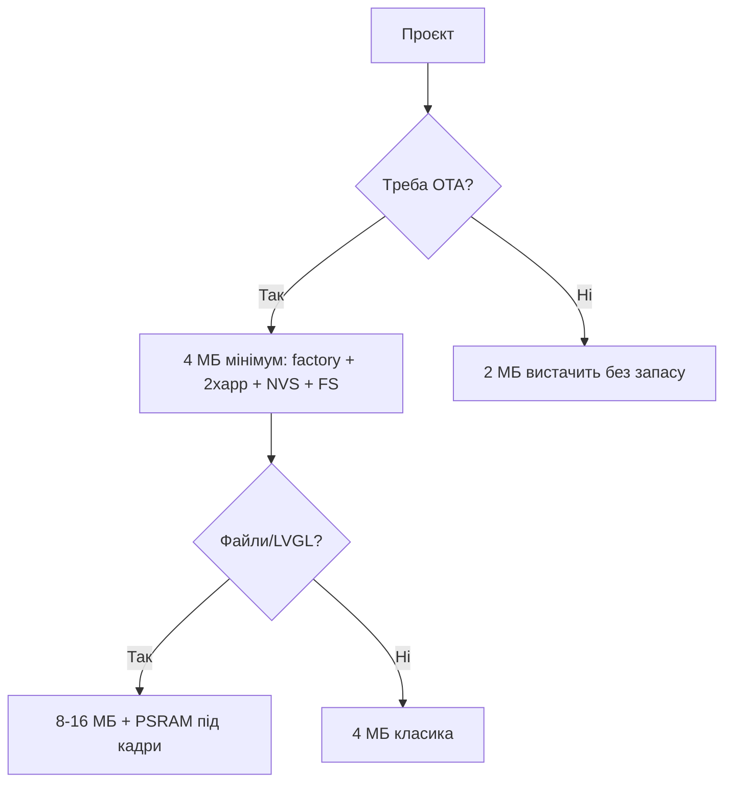

# Flash та PSRAM

EN version: `01-Hardware/06-Flash-PSRAM.en.md`

![[assets/img/flash-psram-scheme.png|500]]
*Рис. Flash/PSRAM: режими з даташиту, PSRAM в menuconfig, OTA від 4 МБ.*

> [!warning] Flash живиться від 3.3V!
> SPI-flash ESP32 працює на **3.3V** (режим 3.3V, не 1.8V). Неправильний strapping VDD_SPI вб'є завантаження. Див. [[03-GPIO/02-Strapping-pini]].

## Призначення

Flash та PSRAM - Flash: QD / QIO, розміри; PSRAM: SPI vs Octal; Таблиця partitions (приклад 4 МБ). ESP-IDF Programming Guide - SPI Flash API, partitions, PSRAM. Winbond / GigaDevice / XMC - звірити маркування чипа flash з режимом (DIO/QIO) у menuconfig. PSRAM буває SPI (Classic) або Octal (S3) - тип виставляється при ініціалізації, інакше OOM.

## Flash: QD / QIO, розміри

| Параметр | Значення |
| --- | --- |
| Режими | DIO / DOUT / QIO / QOUT |
| Швидкість | 40 / 80 МГц |
| Розміри | 4 / 8 / 16 МБ |
| Напруга | **3.3V** |
| Виробники | Winbond, GigaDevice, XMC |
| Типові маркування | W25Q32 (Winbond 4 МБ), GD25Q32 (GigaDevice 4 МБ), W25Q64/GD25Q64 (8 МБ) - сумісні за командами, дивитись ID |

> [!tip] Як перевірити розмір
> Команда esptool.py flash_id покаже ID. Повний розмір: esptool.py --port COMx flash_id. Або в коді ESP.getFlashChipSize(). Якщо прошивка більша за факт - boot-loop. Див. [[07-Boot-Strapping-Reset]].

## PSRAM: SPI vs Octal

| Тип | Швидкість | Чипи | Примітка |
| --- | --- | --- | --- |
| SPI PSRAM | до 40 МГц | WROVER | 4-8 МБ, див. [[01-Hardware/01-ESP32-Classic]] |
| Octal PSRAM | до 80 МГц | S3 N8R2/N16R8 | 2-32 МБ, див. [[03-ESP32-S3]] |
| Без PSRAM | - | WROOM | Для сенсорів вистачає |

> [!info] Partitions звязок
> PSRAM не входить у partitions, але flash-розмітка залежить від розміру flash: factory + OTA + SPIFFS/LittleFS. Для 4 МБ - default.csv, для 8/16 МБ - custom з більшим app. Порівняння чинів: [[00-Start/03-Porivnyannya-chipiv]].

## Таблиця partitions (приклад 4 МБ)

| Імя | Offset | Size | Призначення |
| --- | --- | --- | --- |
| nvs | 0x9000 | 20K | WiFi-калібрування |
| otadata | 0xe000 | 8K | OTA-вибір |
| factory | 0x10000 | 1M | Заводська прошивка |
| spiffs | 0x290000 | 1.3M | Файли |

## Таблиця з'єднань ESP32|Модуль

| ESP32 | Модуль | Опис |
| --- | --- | --- |
| 3V3 | Модуль flash VDD | Живлення flash **3.3V** |
| GPIO6-11 | Модуль SPI flash | Не використовувати для GPIO |
| GPIO16-17 | Модуль PSRAM CS/CLK | Тільки на WROVER/S3 |
| GND | Модуль GND | Земля памʼяті |
| EN | Модуль RESET | Скидання памʼяті разом з CPU |

## Офіційні джерела

- [ESP-IDF Programming Guide](https://docs.espressif.com/projects/esp-idf/en/latest/) - SPI Flash API, partitions, PSRAM.
- [Техдокументація Espressif](https://www.espressif.com/en/support/download/documents) - даташити (режими QD/QIO, швидкості).
- Winbond / GigaDevice / XMC - *перевірити вручну* за маркуванням чипа flash.

## Режими flash: DIO / DOUT / QIO / QOUT / Octal

| Режим | Ліній даних | Швидкість SPI | Чипи | Швидкість читання | Коли |
| --- | --- | --- | --- | --- | --- |
| DIO | 2 | 40 МГц | Усі Classic/S2/C3 | ~10 МБ/с | Дефолт, найсумісніший |
| DOUT | 2 (dual-out) | 40 МГц | Старі flash | ~10 МБ/с | Рідко, для старих партій |
| QIO (Quad I/O) | 4 | 80 МГц | WROOM/WROVER, S2 | ~30 МБ/с | Швидкий старт, камери Classic |
| QOUT (Quad Out) | 4 | 80 МГц | Ті ж | ~25 МБ/с | Компроміс сумісності |
| Octal SPI | 8 | 80 МГц | Тільки S3 N8R2/N16R8 | ~80 МБ/с | LVGL 800×480, камера HD |
| QD (Quad down) | 4 внутр. | 80 МГц | SiP (ESP8684/85, C3FH4) | ~25 МБ/с | Вбудована flash, нічого не чіпай |

> [!danger] QIO на DIO-flash = цегла до перепрошивки
> Якщо прошити з `--flash_mode qio` чип, чия flash вміє тільки DIO - отримаєш `flash read err`. Лікується перепрошивкою з `--flash_mode dio`. Золоте правило: не знаєш flash - ший `dio`, працює скрізь.

```bash
# Визначення flash по факту (не по наклейці!)
esptool.py --port /dev/ttyUSB0 flash_id
# Вивід: Manufacturer: ef (Winbond), Device: 4016 → 4 МБ; 4017 → 8 МБ; 4018 → 16 МБ
esptool.py --port /dev/ttyUSB0 flash_size
# Увімкнення quad-режиму на Winbond/GD (якщо підтримує):
esptool.py --port /dev/ttyUSB0 write_flash_status --non-volatile 0x0200
# Читання статусу назад:
esptool.py --port /dev/ttyUSB0 read_flash_status
```

| ID Device | Розмір | Приклад чипа |
| --- | --- | --- |
| `0x4014` | 1 МБ | Рідко, тестові |
| `0x4016` | 4 МБ | WROOM-32, MINI-1 |
| `0x4017` | 8 МБ | WROVER-E, S3-WROOM-1 |
| `0x4018` | 16 МБ | WROVER-I 16МБ, S3-WROOM-2 |
| `0x6018` + Octal | 16 МБ Octal | S3 N16R8 |

## Розрахунок місця під OTA + FS (4 / 8 / 16 МБ)

Формула бюджету:

```text
flash_total = bootloader(64K) + partitions_table(4K) + NVS(20K) + otadata(8K)
            + app0 + app1 (OTA-пара) + SPIFFS/LittleFS + coredump(64K опц.)
Правило OTA: app0 = app1 = max_app_size. Без пари — OTA неможливий.
Правило FS: LittleFS мінімум 64K, комфортно 512K–1M під логи/конфіг.
```

| Flash | Схема | app0 / app1 | FS | NVS+службові | Коментар |
| --- | --- | --- | --- | --- | --- |
| 4 МБ | factory + OTA + FS | 1.28 МБ / 1.28 МБ | ~1 МБ | ~100 КБ | Стандарт `default_4MB.csv`, вистачає для IoT |
| 4 МБ | factory без OTA + великий FS | 1.9 МБ (один) | ~1.9 МБ | ~100 КБ | OTA немає - тільки USB-перепрошивка |
| 8 МБ | OTA + FS | 2.5 МБ / 2.5 МБ | ~2.5 МБ | ~100 КБ | Камера VGA + LVGL малий |
| 8 МБ | OTA + великий FS | 1.9 МБ / 1.9 МБ | ~3.8 МБ | ~100 КБ | Логи/аудіо в FS |
| 16 МБ | OTA + FS | 4 МБ / 4 МБ | ~7 МБ | ~100 КБ | Камера HD + файли, S3-WROOM-2 |
| 2 МБ (ESP8684H2) | factory без OTA | ~1.2 МБ (один) | ~512 КБ | ~100 КБ | OTA-пари немає куди - не плануй! |

Готові CSV-приклади:

```csv
# partitions-8MB-ota-fs.csv (8 МБ: OTA 2×2.5M + FS)
# Name,   Type, SubType, Offset,  Size
nvs,      data, nvs,     0x9000,  0x5000,
otadata,  data, ota,     0xe000,  0x2000,
app0,     app,  ota_0,   0x10000, 0x280000,
app1,     app,  ota_1,   0x290000,0x280000,
spiffs,   data, spiffs,  0x510000,0x2E0000,
coredump, data, coredump,0x7F0000,0x10000,
```

```csv
# partitions-4MB-default (4 МБ, заводська логіка Arduino)
# Name,   Type, SubType, Offset,  Size
nvs,      data, nvs,     0x9000,  0x5000,
otadata,  data, ota,     0xe000,  0x2000,
app0,     app,  ota_0,   0x10000, 0x140000,
app1,     app,  ota_1,   0x150000,0x140000,
spiffs,   data, spiffs,  0x290000,0x160000,
```

```bash
# Прошивка з явним режимом і розміром (не покладайся на авто!)
esptool.py --chip auto --port /dev/ttyUSB0 write_flash \
  --flash_mode dio --flash_freq 40m --flash_size 4MB \
  0x1000 bootloader.bin 0x8000 partitions.bin 0x10000 firmware.bin

# Стирання перед зміною розмітки (обовʼязково при зміні partitions!)
esptool.py --port /dev/ttyUSB0 erase_flash
```

## PSRAM: коли без нього ніяк

| Задача | RAM без PSRAM | Потрібно | Висновок |
| --- | --- | --- | --- |
| Сенсор + MQTT | 520 КБ вистачає | 0 | WROOM досить |
| Camera VGA JPEG | кадр ~100-300 КБ | 2 МБ+ | N8R2 мінімум |
| Camera HD + stream | 2 кадри × 500 КБ | 4-8 МБ | N16R8 |
| LVGL 800×480 16-біт | фреймбуфер ~750 КБ | 8 МБ Octal | Тільки S3-WROOM-2 |
| TLS + OTA-буфер | ~100 КБ на сесію | WROOM вистачає, але тісно | WROVER комфортніше |

```cpp
// Перевірка PSRAM в рантаймі (Arduino + ESP-IDF сумісно)
#include <Arduino.h>
void setup() {
  Serial.begin(115200);
  if (psramFound()) {
    Serial.printf("PSRAM: %d bytes, free heap %d\n", ESP.getPsramSize(), ESP.getFreeHeap());
  } else {
    Serial.println("PSRAM НЕМАЄ — камера/LVGL не запустяться!");
  }
}
// ESP-IDF menuconfig: Component config → ESP PSRAM → Support for external SPI RAM
```

Розмітка і OTA-процес: [[08-Pamyat/01-Partitions-NVS]], [[08-Pamyat/03-OTA|OTA]], інструмент: [[09-Proshivka/04-Esptool-Flash]].

### Mermaid: скільки flash треба



## Типові помилки

| # | Помилка | Чому погано | Як правильно |
| --- | --- | --- | --- |
| 1 | QIO на DIO-flash | Boot loop | Режим з даташиту мікросхеми |
| 2 | PSRAM вимкнено в menuconfig | OOM у камери/LVGL | SPIRAM Enable + тип |
| 3 | OTA на 2 МБ | Два слоти не влазять | OTA - від 4 МБ |
| 4 | 80 МГц на саморобній платі | Биті читання | 40 МГц |
| 5 | GD25Q64 замість W25Q64 без перевірки | Рідкісні відмінності статус-регістрів | Звірити flash_id і даташит; quad-режим вмикати лише після тесту |

## Див. також

- [[Home]]
- [[00-Start/03-Porivnyannya-chipiv]]
- [[03-GPIO/01-GPIO-oglyad]]
- [[03-GPIO/02-Strapping-pini]]
- [[02-Zhivlennya/01-Lancjugi-zhivlennya]]
- [[05-Moduli-WROOM-WROVER-MINI]]
- [[07-Boot-Strapping-Reset]]
