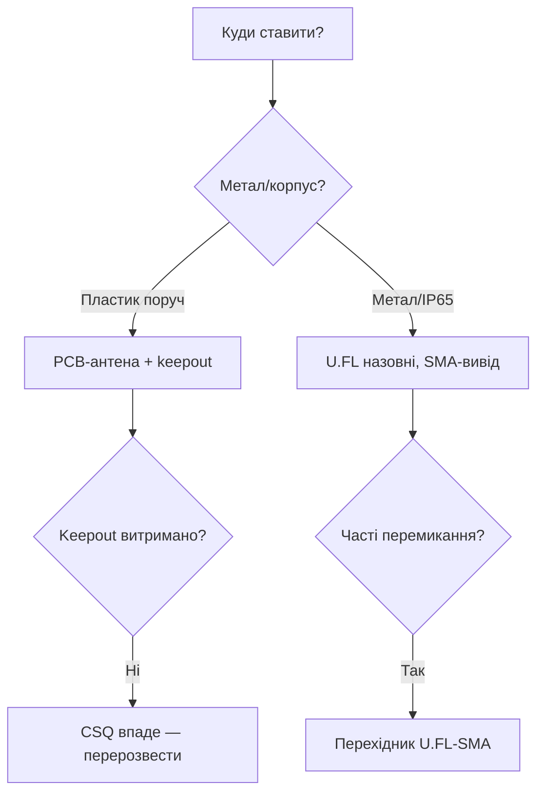

# Антени та RF

EN version: `01-Hardware/08-Antennas-RF.en.md`

![[assets/img/placeholder.png]]

> [!warning] RF-каскад живиться від 3.3V!
> Потужність TX прямо залежить від стабільних **3.3V**. Просадка до 3.0V ріже дальність удвічі. Конденсатори за [[02-Zhivlennya/01-Lancjugi-zhivlennya]] обов'язкові.

## Призначення

Антени та RF - PCB vs IPEX; Keepout зона і розведення; ESP-NOW дальність. Потужність TX прямо залежить від стабільних 3.3V. Просадка до 3.0V ріже дальність удвічі. Конденсатори за [[02-Zhivlennya/01-Lancjugi-zhivlennya]] обов'язкові. Модулі з IPEX без антени не вмикай на передачу. Відбита потужність палить вихід. Перевір модулі: 05-Moduli-WROOM-WROVER-MINI.

## PCB vs IPEX

| Параметр | PCB-антена | IPEX зовнішня |
| --- | --- | --- |
| Посилення | близько 2 dBi | 3-5 dBi |
| Дальність ESP-NOW | 100-200 м пряма | 300-500 м пряма |
| Ціна | 0 | + антена і кабель |
| Ризик | Розстройка корпусом | Забули підключити - згорить PA |

> [!danger] Не вмикай без антени
> Модулі з IPEX без антени не вмикай на передачу. Відбита потужність палить вихід. Перевір модулі: [[05-Moduli-WROOM-WROVER-MINI]].

## Keepout зона і розведення

| Правило | Значення |
| --- | --- | --- |
| Keepout під антеною | 15 мм без міді і землі |
| Відстань до металу | мінімум 10 мм |
| Антена на краю плати | Так, мідь не під антеною |
| Живлення RF | **3.3V** + 100 nF + 10 uF поруч |
| USB / DC-DC подалі | мінімум 20 мм від антени |

> [!tip] Поради розведення
> Антену - на кут плати, земляний полігон - з вирізом. Траси 3.3V широкі (20 mil+). Кварц і flash подалі від антени. Порівняння чипів за RF: [[00-Start/03-Porivnyannya-chipiv]].

## ESP-NOW дальність

| Умови | PCB | IPEX 5 dBi |
| --- | --- | --- |
| Кімната | 20-30 м | 40-60 м |
| Поле пряма видимість | 150 м | 400 м |
| Швидкість 1 Mbps | найдалі | найдалі |

Живлення для тестів дальності - тільки стабільні **3.3V**, виміряй споживання за [[03-Spozhivannya]].

## Таблиця з'єднань ESP32|Модуль

| ESP32 | Модуль | Опис |
| --- | --- | --- |
| 3V3 | Модуль RF VDD | Чисті **3.3V** без пульсацій |
| GND | Модуль GND | Суцільна земля під RF |
| GPIO2 | Модуль LED-індикатор | Індикація TX 3.3V |
| RX2/TX2 | Модуль лог-аналізатор | Дебаг ESP-NOW 3.3V |
| EN | Модуль RESET | Скидання перед тестом дальності |

## Офіційні джерела

- [Техдокументація Espressif](https://www.espressif.com/en/support/download/documents) - Hardware Design Guidelines: антени, keepout, EMC.
- [ESP Modules - каталог з фото (Espressif)](https://www.espressif.com/en/products/modules) - PCB vs IPEX виконання.
- [nRF24L01 дальність/антени (LME)](https://lastminuteengineers.com/nrf24l01-arduino-wireless-communication/) - практики дальності, живлення RF-каскаду.

## Keepout-розміри ASCII-кресленням

Вид зверху на модуль з PCB-антеною (антена - штриховка зверху):

```text
┌─────────────────────────┐
│  МОДУЛЬ (мідь, земля)   │
│                         │
│   ┌───────────────┐     │
│   │  ESP32 + flash │     │
│   └───────────────┘     │
├─────────────────────────┤ ← межа keepout (тут закінчується земля!)
│ ░░░░░░░░░░░░░░░░░░░░░░░ │  ← PCB-АНТЕНА (меандр)
│ ░░░░ KEEPOUT 15 мм ░░░░ │  ← НІ міді, НІ землі, НІ доріжок!
│ ░░░░░░░░░░░░░░░░░░░░░░░ │
└─────────────────────────┘
   ▲                 ▲
   │◄── ширина антени ──►│  ≈ 12–15 мм (за даташитом модуля)
   │                     │
   └── край плати-носія, далі — ПОВІТРЯ (ідеально) або пластик
```

Числові правила (з Hardware Design Guidelines):

| Правило | Значення | Чому |
| --- | --- | --- |
| Keepout під/над антеною | 15 мм без міді, землі, доріжок | Земля під антеною = КЗ для поля |
| Відстань до металу (батарея, екран, гвинти) | ≥10 мм | Метал розстроює антену на 100-200 МГц |
| Антена - на краю плати-носія | Виступ за край або врівень | Антена всередині плати = -6 дБ |
| USB/DC-DC/кварц | ≥20 мм від антени | Імпульсні перешкоди лізуть у RX |
| Товщина доріжок 3.3V до модуля | ≥20 mil (0.5 мм) | Тонкі = просадка = втрата дальності |
| Земля під RF-частиною | Суцільний полігон + via-стіна | Розрізана земля = кільце-антена перешкод |

> [!danger] Корпус вбиває дальність
> Металевий корпус без виносної антени = -15…-20 дБ (дальність /10). Пластик з наповнювачем = -3 дБ. Перед серією завжди тест ESP-NOW на 50 м у реальному корпусі. Живлення при тестах - стабільні 3.3V: [[02-Zhivlennya/01-Lancjugi-zhivlennya]].

## Орієнтація PCB-антени

| Розташування | Ефект | Оцінка |
| --- | --- | --- |
| Антена вгору, край плати в небо (вертикально) | Donut-діаграма в горизонті | Найкраще для ESP-NOW між будинками |
| Дві плати антенами одна до одної, вертикально | Максимум сигналу | Еталонний тест дальності |
| Одна вертикально, друга горизонтально (90°) | Поляризаційні втрати -10…-20 дБ | «Не працює на 30 м» - перевір орієнтацію першою! |
| Антена всередині плати, над землею | -6…-10 дБ | Перерозведи плату |
| Поруч батарея 18650 (5 мм) | -8 дБ + розстройка | Відсунь на 10+ мм або IPEX |

```text
Тест орієнтації (5 хв, без приладів):
1. Дві плати на відстані 20 м, антени вертикально → запиши RSSI (wifi_scan / esp-now ack).
2. Одну поклади горизонтально → запиши RSSI.
3. Різниця >10 дБ = поляризація, а не «поганий модуль». Вузли кріпи однаково!
```

## IPEX-кабелі: втрати

| Кабель (типовий pigtail) | Довжина | Втрати на 2.4 ГГц | Висновок |
| --- | --- | --- | --- |
| 1.13 мм (тонкий сірий) | 10 см | ~1 дБ | Норма |
| 1.13 мм | 15 см | ~1.5 дБ | Межа, далі не треба |
| 1.13 мм | 25 см | ~2.5 дБ | Зʼїдає виграш від 5 dBi антени |
| 1.37 / RG178 (товстіший) | 15 см | ~0.8 дБ | Краще для виносу |
| Перехідник IPEX→SMA + SMA-кабель 1 м | - | 2-3 дБ | Тільки якщо антена справді 5+ dBi |

> [!tip] IPEX-розʼєм - на 30 циклів
> Розʼєм U.FL розрахований на ~30 підключень. Далі - люфт і втрати. На серії: підключив раз, залив термоклеєм, більше не чіпай. Перевірка: поворуши кабель під час `ping` - стрибки loss = розʼєм.

## Дальність: ESP-NOW / LoRa, таблиця vs перешкоди

Умови еталонні: PCB 2 dBi vs IPEX 5 dBi, TX 20 дБм, живлення чисті 3.3V, швидкість ESP-NOW 1 Мбіт (найдальнобійніша), LoRa 433 МГц для порівняння з [[12-Moduli-zvyazku/02-NRF24-LoRa]].

| Умови | ESP-NOW PCB | ESP-NOW IPEX 5 dBi | LoRa 433 МГц 100 мВт (для орієнтиру) |
| --- | --- | --- | --- |
| Кімната (стіни бетон) | 20-30 м | 40-60 м | 100-200 м |
| Квартира → сходова | 10-15 м | 25-40 м | 80-150 м |
| Вулиця, прямо, 1.5 м над землею | 100-150 м | 300-400 м | 1-2 км |
| Поле, антени 3 м над землею | 150-200 м | 400-500 м | 3-5 км |
| Ліс / дощ | /2 від поля | /2 від поля | /1.5 |
| Швидкість 5.5-11 Мбіт | -30% дальності | -30% | - (SF7 vs SF12 аналогічно) |
| WiFi-роутер поруч на тому ж каналі | retries, -20% | retries, -20% | Не впливає (інший діапазон) |

Формула швидкої оцінки (Friis, спрощено):

```text
+6 дБ (антена + потужність) = ×2 дальності у вільному просторі.
Приклад: PCB 2dBi→IPEX 5dBi = +3 дБ → дальність ×1.4 (150 м → 210 м).
Решта до 400 м дає винос антени вище землі (не сама антена!).
Тому перше — підніми антену на 2–3 м, друге — міняй антену.
```

```cpp
// Замір RSSI ESP-NOW для орієнтаційних тестів (слейв показує рівень)
#include <WiFi.h>
#include <esp_now.h>
void onRecv(const esp_now_recv_info *info, const uint8_t *data, int len) {
  Serial.printf("RSSI proxy: MAC %02X:%02X:%02X len=%d\n",
    info->src_addr[3], info->src_addr[4], info->src_addr[5], len);
  // Точний RSSI — через wifi_promiscuous або логи WiFi-скану поруч
}
void setup() {
  Serial.begin(115200);
  WiFi.mode(WIFI_STA);
  esp_now_init();
  esp_now_register_recv_cb(onRecv);
}
void loop() {}
```

Протоколи дальнього звʼязку: [[05-Radio/03-ESP-NOW]], модулі: [[05-Moduli-WROOM-WROVER-MINI]].

### Mermaid: вибір антени



## Типові помилки

| # | Помилка | Чому погано | Як правильно |
| --- | --- | --- | --- |
| 1 | Мідь під антеною | Розстроювання | Keepout на всіх шарах |
| 2 | U.FL як вимикач | Розхитується | 30 циклів макс; далі SMA |
| 3 | Чужа антена | КСХ 5+, смерть PA | Тільки свій діапазон |
| 4 | Перегнутий кабель | Втрати/обрив | Радіус від 5 діаметрів |
| 5 | Тест біля роутера | Поле - не стіл | RSSI на місці |

## Див. також

- [[Home]]
- [[00-Start/03-Porivnyannya-chipiv]]
- [[03-GPIO/01-GPIO-oglyad]]
- [[03-GPIO/02-Strapping-pini]]
- [[02-Zhivlennya/01-Lancjugi-zhivlennya]]
- [[05-Moduli-WROOM-WROVER-MINI]]
- [[01-Hardware/01-ESP32-Classic]]
