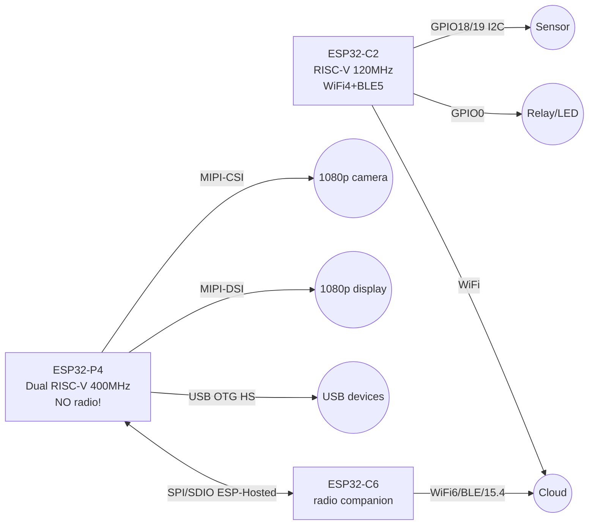

# ESP32-C2 / ESP32-P4 - cheap RISC-V node and powerful host without radio

## Purpose

Two extreme poles of the Espressif line: ESP32-C2 - the cheapest WiFi4+BLE5 RISC-V for simple nodes
(few GPIO and memory - a conscious price compromise),
and ESP32-P4 - a powerful dual-core RISC-V WITHOUT radio: a host for cameras/displays (MIPI, USB HS OTG)
with ESP32-C6 as a radio companion. Plus ESP8684/ESP8685 - SiP versions of C2 with built-in flash.
Neighbors: C3/C6/H2 - [[01-Hardware/04-ESP32-C3-C6-H2.en]], Classic - [[01-Hardware/01-ESP32-Classic.en]],
S2 - [[01-Hardware/02-ESP32-S2.en]], S3 - [[01-Hardware/03-ESP32-S3.en]].

## Characteristics

| Parameter | ESP32-C2 (ESP8684/85 - SiP) | ESP32-P4 |
| --- | --- | --- |
| CPU | 32-bit single-core RISC-V, up to 120 MHz | Dual-core RISC-V HP up to 400 MHz plus FPU plus AI extensions, plus 40 MHz LP-core |
| Memory | 272 KB SRAM (16 KB cache), 576 KB ROM; external flash (C2) / built-in 2-4 MB (ESP8684/85) | 768 KB HP SRAM plus 8 KB TCM, external PSRAM; external flash |
| Radio | WiFi 4 (802.11n, up to 72 Mbit, 18-20 dBm) plus BLE 5 | NONE! WiFi/BLE only through a companion (C6/S3 over SPI/SDIO/UART) |
| GPIO | about 14 available (QFN32) | 55 programmable GPIO |
| Peripherals | SPI, UART, I2C, LED PWM, ADC, USB-Serial-JTAG | MIPI-CSI (camera) plus ISP, MIPI-DSI (display up to 1080p), USB OTG 2.0 HS, Ethernet, SDIO Host 3.0, SPI/I2S/I2C/MCPWM/RMT/ADC/UART/TWAI, H.264 at 1080p30, PPA/2D-DMA, touch |
| Security | Secure Boot, flash encryption | Secure Boot, flash encryption, DSA plus HMAC plus Key Manager, TEE |
| Package | QFN32 5x5 mm (C2); QFN24 4x4 mm (ESP8684H2/H4, ESP8685H2/H4) | - (modules/DevKit) |
| Power | Strictly 3.3 V, GPIO not 5V-tolerant | Strictly 3.3 V, GPIO not 5V-tolerant |
| Target | Smart sockets/lamps, simple sensors, ESP-AT slave | HMI panels, cameras, edge-AI, USB host, gateways |

> ESP8684 = C2 plus built-in 2 MB (H2) / 4 MB (H4) flash; ESP8685 = same plus a built-in PSRAM-slot-compatible variant.
> The letter means the SiP flash size - read the marking on the package before picking the partition table!

## Module pin legend

### ESP32-C2 / ESP8684 DevKit (typical board)

| Pin | Marking | Type | Where / to what | Note |
| --- | --- | --- | --- | --- |
| 1 | 3V3 | Power input/output | 3.3 V | LDO from USB 5 V; do NOT feed 5 V into 3V3! |
| 2 | GND | Ground | Common ground | - |
| 3 | GPIO8 | Strapping plus LED | Built-in LED (active HIGH on some boards) | Strapping: do not hold LOW at boot! |
| 4 | GPIO9 | Strapping (BOOT) | BOOT button | LOW at reset = download mode |
| 5 | TX0 / RX0 (GPIO20/21) | UART0 | USB-UART bridge / console | Logs, flashing |
| 6 | GPIO18/19 | Default I2C | SDA/SCL of sensors | 4.7 kOhm pull-up |
| 7 | GPIO0-7 | GPIO/ADC/PWM | Sensors, relays, LED | ADC 0-3.3 V, PWM via LEDC |
| 8 | EN | Enable, active high | EN button | LOW = chip off |

> C2 has only about 14 GPIO: every pin counts. There is no second I2C/SPI port for luxury -
> route the buses correctly the first time, see [[03-GPIO/01-GPIO-oglyad.en]] and [[01-Hardware/07-Boot-Strapping-Reset.en]].

### ESP32-P4 DevKit (typical board)

| Pin / group | Marking | Type | Where / to what | Note |
| --- | --- | --- | --- | --- |
| 1 | 3V3 / 5V (VIN) | Power | 5 V USB or 3.3 V | P4 plus PSRAM plus camera eat noticeably - PSU with margin |
| 2 | GND | Ground | Common ground | Star to the PSU with camera/display |
| 3 | USB D+/D- (OTG HS) | USB 2.0 HS | Board USB connector | Host for cameras/flash drives or device |
| 4 | MIPI-CSI (2/4 lane) | Camera | Camera FPC cable | Up to 1080p, built-in ISP |
| 5 | MIPI-DSI (2 lane) | Display | Display FPC cable | Up to 1080p plus PPA/2D-DMA for GUI |
| 6 | SDIO / SPI (companion) | Bus to C6 | ESP32-C6 module | ESP-Hosted / ESP-AT: WiFi plus BLE for P4 |
| 7 | UART0 (TX/RX) | Console | USB-UART bridge | Logs, flashing |
| 8 | JTAG (TCK/TMS/TDI/TDO) | Debugging | JTAG probe | Hardware debug without printf |
| 9 | GPIO (55 pcs) | GPIO | Peripherals | SPI/I2C/UART/MCPWM/RMT/ADC/TWAI/Ethernet |

### P4 plus C6 bundle (radio companion)

| P4 | C6 | Purpose | Note |
| --- | --- | --- | --- |
| SPI: SCK/MOSI/MISO/CS | SPI slave | ESP-Hosted (fast) | Main WiFi data path |
| SDIO CLK/CMD/D0-D3 | SDIO slave | ESP-Hosted (fastest) | For streaming traffic |
| UART TX/RX | UART | ESP-AT (simple) | AT commands, slower but simple |
| GPIO (handshake) | GPIO | Ready interrupt | Data-ready signals |
| 3V3 / GND | 3V3 / GND | Companion power | Common ground mandatory |

## Connection diagram

| ESP32-C2 node | Sensor / actuator | Note |
| --- | --- | --- |
| 3V3 | Sensor VCC 3.3 V | LDO current budget about 300-500 mA |
| GND | GND | Common ground |
| GPIO18 (SDA) | SDA (BME280 etc.) | I2C, pull-up |
| GPIO19 (SCL) | SCL | 400 kHz |
| GPIO0 | Relay via MOSFET | Not strapping-critical in operation |
| TX0/RX0 | Console | Logs |

| ESP32-P4 host | Peripherals | Note |
| --- | --- | --- |
| 5V VIN | PSU 5 V 2 A+ | Camera plus display plus PSRAM |
| MIPI-CSI FPC | Camera module | Cable to the click, no skew |
| MIPI-DSI FPC | Display | GUI via PPA/2D-DMA |
| USB OTG | USB camera/flash drive | Host mode, 5 V power on VBUS |
| SPI/SDIO plus UART | ESP32-C6 companion | ESP-Hosted (fast) or ESP-AT (simple) |
| JTAG | Probe | OpenOCD, breakpoints |

Table of when to take instead of C3/S3:

| Task | Take | Why not C3/S3 |
| --- | --- | --- |
| Socket/lamp/simple sensor, price critical | C2 / ESP8684 | C3 is pricier and bigger; S3 is overkill |
| ESP-AT WiFi slave for the main MCU | C2 | Cheaper than C3, AT firmware ready |
| Battery BLE beacon | C3, not C2! | C2 has a worse deep-sleep profile and less LP peripherals |
| Zigbee/Thread/Matter | C6/H2, not C2/P4! | C2 has no 802.15.4, P4 has no radio at all |
| 1080p camera/display, HMI, USB host | P4 (plus C6 for radio) | S3 is weaker (no MIPI/USB HS); C3/C6 cannot drive a camera |
| Budget camera (OV2640, 2 MP) | S3, not P4! | P4 has no radio and costs more - S3 is enough for OV2640 |
| Gateway with Ethernet plus WiFi | P4 (Ethernet MAC) plus C6 | Classic/S3: Ethernet only via an external PHY module |

### ASCII diagram

```text
ESP32-C2 вузол (простий сенсор, WiFi4+BLE5)
------------
USB 5V ──[LDO]──► 3V3 (чип строго 3.3В! GPIO не 5V-tolerant)
GND ────────────► GND
GPIO18 ─────────► SDA сенсора (I2C, pull-up 4.7к)
GPIO19 ─────────► SCL сенсора
GPIO0 ──────────► MOSFET реле/LED
TX0/RX0 ────────► консоль (логи/прошивка)
GPIO9 (BOOT) LOW при reset = download-режим
УВАГА: ~14 GPIO — шини планувати одразу, другого порту немає!
ESP8684/85: flash ВСЕРЕДИНІ (H2=2МБ/H4=4МБ) — таблиця партицій під неї!

ESP32-P4 хост (потужний, БЕЗ радіо!) + C6-компаньйон
------------
[БЖ 5В 2А+] ────► VIN P4 (камера+дисплей+PSRAM жеруть!)
MIPI-CSI FPC ───► модуль камери (до 1080p, ISP всередині)
MIPI-DSI FPC ───► дисплей (до 1080p, PPA/2D-DMA малюють GUI)
USB OTG ────────► USB-камера/флешка (хост, 5В на VBUS)
P4 SPI/SDIO ────► ESP32-C6 (ESP-Hosted: WiFi6+BLE+15.4 для P4!)
P4 UART ────────► ESP32-C6 (ESP-AT: простіше, повільніше)
P4 JTAG ────────► пробник OpenOCD
Спільний GND P4+C6+БЖ обов'язково!
P4 БЕЗ C6 = без WiFi/BLE взагалі. Не шукати "увімкнути WiFi на P4"!
```

### Mermaid



![[assets/img/esp32-c2-p4-scheme.png|600]]
*Fig. C2 node with sensor and P4 host with camera/display and C6 companion. Space for the diagram - see [[assets/README]].*

## ESP-IDF code

```c
// ESP32-C2: WiFi STA + BLE (target: esp32c2, пам'ять економити!)
#include "esp_wifi.h"
#include "nvs_flash.h"

void app_main_c2(void)
{
    nvs_flash_init();
    // C2: маленька SRAM — мінімальні буфери WiFi, без PSRAM!
    wifi_init_config_t cfg = WIFI_INIT_CONFIG_DEFAULT();
    esp_wifi_init(&cfg);
    wifi_config_t wc = {.sta = {.ssid = "SSID", .password = "PASS"}};
    esp_wifi_set_mode(WIFI_MODE_STA);
    esp_wifi_set_config(WIFI_IF_STA, &wc);
    esp_wifi_start();
    esp_wifi_connect();
    // BLE5 advertising — через NimBLE, GATT-сервер температури.
}

// ESP32-P4: камера MIPI-CSI + дисплей MIPI-DSI (target: esp32p4)
#include "esp_camera.h"
void app_main_p4(void)
{
    // Піни — зі схеми конкретної P4-плати (FPC-конектори)!
    camera_config_t cc = {
        .pixel_format = PIXFORMAT_RGB565,
        .frame_size = FRAMESIZE_HD,   // 720p: 1080p — тільки з PSRAM!
        .fb_count = 2,
        // .pin_pwdn/sccb/sda/vsync/href/pclk/data — за платою
    };
    // esp_camera_init(&cc);  // після заповнення пінів плати
    // Дисплей: esp_lcd_new_panel_... (MIPI-DSI) + LVGL через PPA/2D-DMA.
    // Радіо: ESP-Hosted — P4 майстер SPI/SDIO, C6 слейв з hosted-прошивкою.
}
```

## Arduino code

```cpp
// ESP32-C2 (плата: "ESP32C2 Dev Module"): простий WiFi-вузол
#include <WiFi.h>
void setup() {
  Serial.begin(115200);
  WiFi.mode(WIFI_STA);
  WiFi.begin("SSID", "PASS");
  while (WiFi.status() != WL_CONNECTED) delay(300);
  Serial.println(WiFi.localIP());
  // Пам'ять: уникати String-накопичень, великі буфери — у flash (PROGMEM).
}
void loop() {
  // опитування сенсора по I2C + publish; deep-sleep між циклами
}

// ESP32-P4 (ядро Arduino-ESP32 з підтримкою P4): камера + C6 AT-лінк
#include <HardwareSerial.h>
HardwareSerial Radio(2);  // UART до C6 з ESP-AT
void setup_p4() {
  Serial.begin(115200);
  Radio.begin(115200, SERIAL_8N1, 16, 17);  // TX/RX до C6
  Radio.println("AT");  // відповідь OK = компаньйон живий
  // Камера: див. приклад CameraWebServer під піни своєї P4-плати.
}
```

## MicroPython code

```python
# ESP32-C2: MicroPython збірка під c2 (обмежена RAM — код компактно!)
import network, time
w = network.WLAN(network.STA_IF)
w.active(True)
w.connect("SSID", "PASS")
for _ in range(40):
    if w.isconnected(): break
    time.sleep_ms(500)
print("IP:", w.ifconfig()[0])
# from machine import I2C, Pin  # I2C(0, scl=Pin(19), sda=Pin(18))

# ESP32-P4: MicroPython під p4 — UART до C6-компаньйона з ESP-AT
from machine import UART
radio = UART(2, baudrate=115200, tx=17, rx=16, timeout=500)
radio.write("AT\r\n"); time.sleep_ms(300)
print("C6:", radio.read())  # чекаємо OK
# Камеру/DSI-дисплей з MicroPython на P4 — через нативні модулі збірки плати.
```

## Common issues

1. **Looking for WiFi on P4** - it has none in hardware. Only a C6/S3 companion (ESP-Hosted/AT) over SPI/SDIO/UART.
2. **Taking C2 for a camera/Matter** - it cannot do it: little RAM/GPIO, no 802.15.4. Camera - S3/P4, Matter - C6/H2.
3. **5 V on C2/P4 GPIO** - death of the pin/chip. Both are strictly 3.3 V, see [[03-GPIO/03-Pidtyaguvannya-rivni.en]].
4. **C3 partitions on ESP8684H2** - boot loop. SiP flash 2 MB: partition table for H2, not for 4 MB!
5. **Powering P4 from a weak USB** - reboots with camera. PSU 5 V 2 A+, thick wires, star ground.
6. **FPC cables inserted crooked** - MIPI stripes/silence. Cable to the latch click, contacts as marked on the board.
7. **1080p without PSRAM on P4** - no frames. HD/FHD frame buffer - only in PSRAM, check `fb_count` and size.
8. **ESP-Hosted without a handshake GPIO** - packet loss. Data-ready pin mandatory, SPI speed matched on both sides.
9. **Ignoring C2 BOOT/strapping** - it will not flash. GPIO9 LOW at reset = download; do not hold GPIO8 LOW at boot.
10. **Expecting C3-level deep-sleep from C2** - faster discharge. C2 has a humbler LP domain - budget per the datasheet, see [[07-Timeri-Son/03-Sleep-ULP.en]].

## Official sources

- [ESP32-C2 - product page (Espressif)](https://www.espressif.com/en/products/socs/esp32-c2) - RISC-V, WiFi4 plus BLE5, SRAM/ROM, photos.
- [ESP32-P4 - product page (Espressif)](https://www.espressif.com/en/products/socs/esp32-p4) - dual-core 400 MHz, MIPI/USB HS, companion via ESP-Hosted/AT.
- [ESP32-C6 - product page (Espressif)](https://www.espressif.com/en/products/socs/esp32-c6) - WiFi6 plus BLE plus 802.15.4, ideal P4 radio companion.
- [ESP-IDF SPI Master - docs with code (Espressif)](https://docs.espressif.com/projects/esp-idf/en/latest/esp32/api-reference/peripherals/spi_master.html) - P4 to C6 bus for ESP-Hosted.
- [ESP-IDF UART - docs with code (Espressif)](https://docs.espressif.com/projects/esp-idf/en/latest/esp32/api-reference/peripherals/uart.html) - P4 to C6 UART link for ESP-AT.

## eFuse and protection (C2 / P4)

> [!danger] C2/P4 eFuse - irreversible!
> Writes go only `0` to `1`. C2 has few blocks - a mistake in `KEY_PURPOSE` can eat the only XTS slot. P4 has more keys (Key Manager, HMAC, DSA), but `UART_DOWNLOAD_DIS` bricks the same way. Always start from `summary`. Base: [[08-Pamyat/04-Secure-Boot-Encrypt.en]].

### Key bits C2 vs P4

| Bit / field | C2 (cheap node) | P4 (host) | Irreversible |
| --- | --- | --- | --- |
| `JTAG_DISABLE` | + (no point leaving it on a socket) | + (leave open until debug ends!) | Yes |
| `FLASH_CRYPT_CNT` | 7 bits, odd = ON | 7 bits, XTS for external flash | Only burn more |
| `SECURE_BOOT_EN` | + (ECDSA, little memory for the key - plan) | + (RSA/ECDSA plus TEE) | Yes |
| `KEY_PURPOSE_0..5` | Present, few slots | Present plus Key Manager purpose | Once! |
| `UART_DOWNLOAD_DIS` | + | + (do not burn while debugging MIPI!) | Yes, last |
| `DISABLE_DL_ENCRYPT/DECRYPT/CACHE` | + | + | Yes |
| `SECURE_BOOT_KEY_REVOKE` | + | + (3 pcs) | Yes |
| C2 special | ESP8684/85 SiP flash encrypted by the same XTS | - | - |
| P4 special | - | DSA/HMAC/Key Manager, TEE isolation, JTAG protection | Yes |

```bash
# Інспекція (безпечно)
espefuse.py --chip esp32c2 --port /dev/ttyUSB0 summary
espefuse.py --chip esp32p4 --port /dev/ttyACM0 summary
espefuse.py --chip esp32c2 --port /dev/ttyUSB0 get FLASH_CRYPT_CNT

# C2: ключ з файлу (32 випадкові байти!)
python3 -c "import os; open('/tmp/opencode/c2_xts.bin','wb').write(os.urandom(32))"
espefuse.py --chip esp32c2 --port /dev/ttyUSB0 burn_key BLOCK_KEY0 /tmp/opencode/c2_xts.bin XTS_AES_128_KEY

# P4: тільки після стабільного MIPI + PSRAM-тесту!
espefuse.py --chip esp32p4 --port /dev/ttyACM0 burn_efuse SECURE_BOOT_EN
```

> [!warning] C2 plus Secure Boot plus 272 KB SRAM
> The signature is verified at every boot - that is extra boot time plus RAM. On C2 with big firmware first measure `boot time` before and after. If the node wakes for 2 s to send temperature - secure boot can eat 10-20% of the battery budget. Calculate per [[07-Timeri-Son/03-Sleep-ULP.en]] and [[02-Zhivlennya/03-Spozhivannya.en | Power draw]].

```c
// Єдина діагностика C2/P4
#include "esp_flash_encrypt.h"
#include "esp_secure_boot.h"
void c2p4_prot(void) {
    ESP_LOGI("p", "crypt=%d sb=%d",
        esp_flash_encryption_enabled(), esp_secure_boot_enabled());
}
```

## Typical clocks / crystals (C2 / P4)

| Source | C2 | P4 | Purpose |
| --- | --- | --- | --- |
| XTAL | 40 MHz | 40 MHz | Reference |
| CPU | 120 MHz single RISC-V | 400 MHz dual HP plus 40 MHz LP | Computing |
| APB | 60-80 MHz | 80-200 MHz (domains!) | Buses |
| USB-Serial-JTAG (C2) | 48 MHz | - | Flashing/logs |
| USB OTG HS (P4) | - | 60 MHz PHY (480 Mbit) | Host for USB cameras/flash drives |
| MIPI (P4) | - | CSI up to 1.5 Gbit/lane, DSI up to 1080p | Camera/display |
| RTC_SLOW | 150 kHz / 32.768 kHz | 150 kHz / 32.768 kHz plus LP-core | Sleep |
| Crystal tolerance | plus/minus 10 ppm (WiFi!) | plus/minus 20 ppm (no WiFi - softer) | Accuracy |

P4 frame calculation:

```text
1080p RGB565 кадр = 1920×1080×2 = ~4 МБ.
Без PSRAM (768 КБ HP SRAM): влазить тільки QVGA (320×240×2 = 150 КБ).
720p (1280×720×2 = 1.8 МБ): потрібна PSRAM 8+ МБ, fb_count=2 → 3.6 МБ.
1080p30 H.264: тільки з PSRAM + апаратний кодер, інакше пропуск кадрів.
Висновок: P4 без PSRAM = без камери. Перевірка: ESP.getPsramSize().
```

```cpp
// C2: економія (120→80 МГц, WiFi живий)
#include <Arduino.h>
void setup() {
  Serial.begin(115200);
  setCpuFrequencyMhz(80);
  Serial.println(getCpuFrequencyMhz());
}
```

## Boot mode (C2 / P4)

| Mode | C2: GPIO8/9 | P4: strapping | EN | Log / action |
| --- | --- | --- | --- | --- |
| SPI-boot (normal) | GPIO8 HIGH, GPIO9 HIGH | BOOT HIGH | HIGH | `boot:0x8`, boot from flash |
| Download | GPIO9 LOW at reset | BOOT LOW at reset | edge 0 to 1 | `waiting for download`, flash it |
| JTAG | GPIO8 HIGH, GPIO9 HIGH | JTAG pins free | HIGH | Boot plus OpenOCD |
| C2 trap | GPIO8 LOW (LED!) = stuck | - | - | Do not put a button on GPIO8 |
| P4 trap | - | Weak PSU = `rst:0x10` at camera start | HIGH | PSU 5 V 2 A+, see power above |

```bash
esptool.py --chip esp32c2 --port /dev/ttyUSB0 flash_id
esptool.py --chip esp32p4 --port /dev/ttyACM0 flash_id
# C2 мовчить? GPIO9→GND + EN клік. P4 мовчить? Перевір БЖ і USB HS-кабель.
```

| C2/P4 log | Meaning | Action |
| --- | --- | --- |
| `boot:0x8` | Normal | Work |
| `waiting for download` | ROM waiting | Flash `write_flash --flash_mode dio` |
| `flash read err` | SiP (H2=2 MB) vs 4 MB partitions | Partitions for the fact! [[01-Hardware/06-Flash-PSRAM.en]] |
| `invalid header` on P4 | PSRAM did not init | Lower `fb_count`, check FPC |

## See also

- [[Home.en]]
- [[00-Start/03-Porivnyannya-chipiv.en]]
- [[01-Hardware/01-ESP32-Classic.en]]
- [[01-Hardware/02-ESP32-S2.en]]
- [[01-Hardware/03-ESP32-S3.en]]
- [[01-Hardware/04-ESP32-C3-C6-H2.en]]
- [[01-Hardware/05-Moduli-WROOM-WROVER-MINI.en]]
- [[01-Hardware/06-Flash-PSRAM.en]]
- [[01-Hardware/07-Boot-Strapping-Reset.en]]
- [[04-Shini/01-UART.en | UART]]
- [[04-Shini/02-SPI.en | SPI]]
- [[99-Dodatki/02-Troubleshooting-FAQ.en]]
