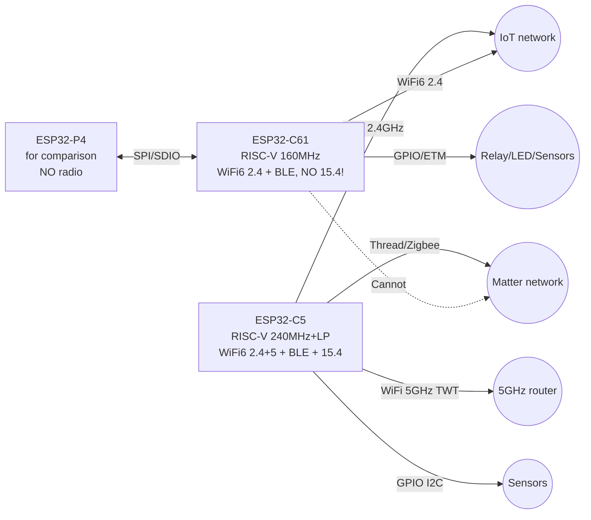

# ESP32-C5 / ESP32-C61 - dual-band Wi-Fi 6 and cut-down Wi-Fi 6

## Purpose

ESP32-C5 - flagship of the C line: the first Espressif RISC-V MCU with **dual-band 2.4 + 5 GHz Wi-Fi 6**,
plus Bluetooth 5 (LE) and **IEEE 802.15.4 (Zigbee/Thread/Matter!)** on one die.
Positioning: **between C6 and S3** - radio better than C6 (5 GHz band added, 240 MHz CPU),
but without the camera-display power of S3 (no MIPI, USB HS, Octal PSRAM for LVGL/camera).
Take C5 when you need Wi-Fi 6 with low latency (5 GHz), a Matter gateway with Thread plus Wi-Fi,
or headroom in the crowded 2.4 GHz air.

ESP32-C61 - **cut-down successor to C6**: same Wi-Fi 6 plus BLE 5, but **no 802.15.4!**
Exactly the Zigbee/Thread radio was cut, while 160 MHz RISC-V, 320 KB SRAM,
in-package PSRAM and rich peripherals (ETM, comparator) stayed. Take C61 when you need
a cheap Wi-Fi 6 node (socket, lamp, Wi-Fi sensor), and Matter only **over-WiFi**,
without Thread. Need Thread/Zigbee - take C6/H2/C5, not C61!
Line neighbors: [[01-Hardware/04-ESP32-C3-C6-H2.en]] (C3/C6/H2),
[[01-Hardware/09-ESP32-C2-P4.en]] (cheap C2 and P4 host),
comparison of all chips - [[00-Start/03-Porivnyannya-chipiv.en]].

> [!warning] Both are strictly 3.3V!
> C5 and C61 run on **3.3V**, GPIO is not 5V-tolerant. DevKit boards make 3.3V from 5V USB via LDO.
> 5V sensors - only through level shifting. The 5 GHz transmitter of C5 is demanding on current!

## Characteristics C5 vs C61

| Parameter | ESP32-C5 | ESP32-C61 |
| --- | --- | --- |
| CPU | 32-bit single-core RISC-V up to **240 MHz** plus LP-CPU up to 40 MHz | 32-bit single-core RISC-V up to 160 MHz |
| Memory | **384 KB SRAM** plus external PSRAM support, 320 KB ROM | **320 KB SRAM**, 256 KB ROM, Quad SPI flash plus in-package PSRAM (Quad SPI up to 120 MHz) |
| Wi-Fi | **Dual-band 2.4 + 5 GHz Wi-Fi 6** (802.11ax 20 MHz; b/g/n 20/40 MHz; a/b/g/n/ac compatible) | **2.4 GHz Wi-Fi 6** (802.11ax 20 MHz; b/g/n 20/40 MHz) |
| Wi-Fi features | TWT, OFDMA, MU-MIMO, BSS coloring | OFDMA, MU-MIMO, TWT |
| Bluetooth | BLE 5 (LE): coded PHY long-range, advertising extensions, 2 Mbit, Mesh plus ESP-Mesh-Lite | BLE 5 (LE): extended advertising, coded PHY, 2 Mbit, Mesh 1.1 |
| 802.15.4 | **Yes: Zigbee plus Thread plus Matter** (PHY plus MAC on die) | **None!** Cut for price |
| GPIO | Up to **29** programmable | Standard MCU set (see module datasheet) |
| Interfaces | SPI, UART, I2C, I2S, LED PWM, ADC, GDMA, SDIO 2.0 Slave, QSPI | SPI, I2C, UART, I2S, ADC, GDMA, **ETM**, analog comparator, LED PWM, GPIO, LP IO, Timers |
| Security | Secure Boot, flash plus PSRAM encryption, crypto accelerators, Digital Signature, Key Manager, TEE plus APM plus PMP | Secure Boot, flash plus PSRAM encryption, crypto accelerators, ECDSA Digital Signature, TEE plus APM plus PMP |
| Power | Strictly 3.3 V, GPIO not 5V-tolerant | Strictly 3.3 V, GPIO not 5V-tolerant |
| Status | Mass production since 30.04.2025 | Mass production since 16.06.2025 |
| Target | Gateways, dual-band nodes, Matter plus Thread, low-latency Wi-Fi | Cheap Wi-Fi 6 nodes, Matter-over-WiFi, ESP-AT slave |

> C5: the 40 MHz LP-CPU can be the main processor for power-sensitive tasks -
> the main core sleeps, the LP collects sensors. C61: the trick is **ETM** (trigger to task automation without CPU)
> and the comparator for zero-cross detection (dimmers, meters).

## Big table of the C line plus P4: cores / radio / RAM / price / when to take

| Chip | Cores | Radio | RAM / Flash | 2026 module price, $ * | When to take |
| --- | --- | --- | --- | --- | --- |
| C2 (ESP8684/85 SiP) | RISC-V 120 MHz | WiFi 4 plus BLE 5 | 272 KB SRAM; 2-4 MB SiP flash | 1.5-2.5 | Cheapest: socket, lamp, ESP-AT slave |
| C3 | RISC-V 160 MHz | WiFi 4 plus BLE 5.0 | 400 KB SRAM; 4-8 MB ext. | 2-4 | Battery Wi-Fi sensor, ESP-NOW, BLE beacon |
| C6 | RISC-V HP 160 MHz plus LP 20 MHz | WiFi 6 (2.4) plus BLE 5.3 plus **15.4** | 512 KB SRAM; 8 MB | 4-6 | Matter/Thread/Zigbee gateway, Wi-Fi 6 2.4 GHz |
| **C5** | RISC-V **240 MHz** plus LP 40 MHz | WiFi 6 **(2.4+5)** plus BLE 5 plus **15.4** | **384 KB** SRAM plus ext. PSRAM; 320 KB ROM | 5-8 | **Dual-band Wi-Fi 6**, low latency, Thread plus 5 GHz |
| **C61** | RISC-V 160 MHz | WiFi 6 (2.4) plus BLE 5, **no 15.4** | **320 KB** SRAM plus in-package PSRAM; 256 KB ROM | 2.5-4 | **Cheap Wi-Fi 6** instead of C3/C6 where Thread is not needed |
| H2 | RISC-V 96 MHz plus LP | No Wi-Fi! BLE 5.2 plus **15.4** | 320 KB SRAM; 4-8 MB | 3-5 | Battery Zigbee end device plus border router |
| P4 | Dual RISC-V HP 400 MHz plus LP 40 MHz | **None!** Only via C6 companion | 768 KB HP SRAM plus ext. PSRAM; ext. flash | 8-12 | 1080p HMI, MIPI camera, USB HS, edge-AI (plus C6 for radio) |

\* Prices - indicative 2026 retail for modules/DevKit (AliExpress/distributors), depend on PSRAM and package.
Updated price cut - [[00-Start/03-Porivnyannya-chipiv.en]].

> [!tip] Selection formula
> Need Thread/Zigbee - C6/H2/**C5** (not C61, not C2!). Need cheap Wi-Fi 6 - **C61**.
> Need 5 GHz - only **C5**. Need camera/display - S3/P4 (see [[01-Hardware/03-ESP32-S3.en]]).
> Cheapest node without Wi-Fi 6 - C2 (see [[01-Hardware/09-ESP32-C2-P4.en]]).

## Module pin legend

### ESP32-C5-DevKitC-1 (typical board)

| Pin / group | Marking | Type | Where / to what | Note |
| --- | --- | --- | --- | --- |
| 1 | 5V (VIN) / 3V3 | Power | USB 5 V to LDO to 3.3 V | C5 on 5 GHz TX eats more - LDO with 600+ mA margin |
| 2 | GND | Ground | Common ground | Star to PSU on a gateway with peripherals |
| 3 | GPIO9 | Strapping BOOT | BOOT button | LOW at reset = download mode |
| 4 | GPIO8 | Strapping | Must be HIGH at boot | Do not hold LOW (see strapping below)! |
| 5 | TX0/RX0 (GPIO11/12 typ.) | UART0 | USB-UART bridge / console | 115200 logs, flashing, 3.3V logic |
| 6 | GPIO0/1 (I2C0) | I2C | SDA/SCL of sensors | 4.7 kOhm pull-up to 3.3V |
| 7 | GPIO (up to 29 pcs) | GPIO/ADC/PWM/SPI | Sensors, relays, LED | ADC 0-3.3 V, PWM via LEDC |
| 8 | EN | Enable | EN button | LOW = chip off, RC 10k plus 1 uF |

### ESP32-C61-MINI-1 / DevKit (typical board)

| Pin / group | Marking | Type | Where / to what | Note |
| --- | --- | --- | --- | --- |
| 1 | 3V3 / 5V (VIN) | Power | 5 V USB or 3.3 V | 500+ mA LDO, capacitors near the module |
| 2 | GND | Ground | Common ground | Must share with sensors |
| 3 | GPIO9 | Strapping BOOT | BOOT button | LOW at reset = download |
| 4 | GPIO8 | Strapping | Must be HIGH | LED/button to GND = no boot |
| 5 | TX0/RX0 | UART0 | USB-UART bridge | Console, flashing |
| 6 | GPIO (I2C/SPI) | Bus | Sensors | ETM can link triggers without CPU |
| 7 | ADC input | Analog | Divider/sensor 0-3.3 V | No 5V! |
| 8 | EN | Enable | EN button | RC circuit as on all C chips |

## Connection diagram

| ESP32-C5 gateway | Peripherals | Note |
| --- | --- | --- |
| 3V3 | Sensor VCC 3.3 V | LDO budget 600+ mA (5 GHz TX peak!) |
| GND | GND | Common ground |
| GPIO0 (SDA) / GPIO1 (SCL) | I2C sensors | Pull-up to 3.3V |
| GPIO SPI | Zigbee/Thread logic inside! | No external 15.4 module needed |
| 5 GHz antenna | Dual-band PCB/IPEX | A single-band 2.4 GHz antenna cuts 5 GHz! |
| TX0/RX0 | Console | Logs, flashing |

| ESP32-C61 node | Peripherals | Note |
| --- | --- | --- |
| 3V3 | Sensor VCC 3.3 V | 500 mA LDO is enough (2.4 GHz only) |
| GND | GND | Common ground |
| GPIO I2C | SDA/SCL | 400 kHz, pull-up |
| GPIO | Relay via MOSFET | ETM triggers without waking CPU |
| TX0/RX0 | Console | Logs |

### ASCII diagram

```text
ESP32-C5 (dual-band Wi-Fi 6 + BLE + 15.4!) — позиція між C6 і S3
------------
USB 5V ──[LDO 600мА+]──► 3V3 (чип строго 3.3В! 5 ГГц TX = пік струму!)
GND ───────────────────► GND
GPIO0 ────────────────► SDA сенсорів (I2C, pull-up 4.7к до 3.3V)
GPIO1 ────────────────► SCL сенсорів
GPIO8 (strapping) ────► HIGH при boot! Не вішати кнопку на GND!
GPIO9 (BOOT) LOW при reset = download-режим
ANT ──────────────────► DUAL-BAND антена 2.4+5 ГГц (IPEX/PCB)!
15.4 ─────────────────► ВСЕРЕДИНІ (Zigbee/Thread, зовнішній модуль НЕ треба)
PSRAM ────────────────► ЗОВНІШНЯ (квад SPI), батарею рахувати з нею!
C5 НЕ тягне камеру MIPI / USB HS — це S3/P4!

ESP32-C61 (здешевлений C6-наступник, БЕЗ 15.4!)
------------
USB 5V ──[LDO]──► 3V3 (строго 3.3В! GPIO не 5V-tolerant)
GND ────────────► GND
GPIO I2C ───────► SDA/SCL сенсорів (ETM: тригери без CPU!)
GPIO9 (BOOT) LOW при reset = download-режим
GPIO8 ──────────► HIGH при boot!
PSRAM ──────────► IN-PACKAGE (Quad SPI до 120 МГц) — вистачає без оптимізацій
УВАГА: 802.15.4 НЕМАЄ! Zigbee/Thread шукати на C6/H2/C5, не тут!
Matter на C61 = тільки over-WiFi!
```

### Mermaid



![[assets/img/esp32-c5-c61-scheme.png|600]]
*Fig. C5 dual-band gateway and C61 Wi-Fi 6 node. Space for the diagram - see [[assets/README]].*

## ESP-IDF code

```c
// ESP32-C5: dual-band Wi-Fi STA (target esp32c5, IDF 5.5+!)
#include "esp_wifi.h"
#include "nvs_flash.h"

void app_main_c5(void)
{
    nvs_flash_init();
    wifi_init_config_t cfg = WIFI_INIT_CONFIG_DEFAULT();
    esp_wifi_init(&cfg);
    wifi_config_t wc = {.sta = {.ssid = "SSID_5G", .password = "PASS"}};
    esp_wifi_set_mode(WIFI_MODE_STA);
    esp_wifi_set_config(WIFI_IF_STA, &wc);
    esp_wifi_start();
    esp_wifi_connect();
    // 802.15.4: esp_ieee802154_enable() + openthread/zigbee стек окремо.
    // LP-CPU 40 МГц: окремий firmware для збору сенсорів у сні.
}

// ESP32-C61: Wi-Fi 6 вузол (target esp32c61, IDF 5.5+)
#include "esp_wifi.h"
#include "nvs_flash.h"

void app_main_c61(void)
{
    nvs_flash_init();
    // C61: in-package PSRAM вже доступна — великі буфери без оптимізацій.
    wifi_init_config_t cfg = WIFI_INIT_CONFIG_DEFAULT();
    esp_wifi_init(&cfg);
    wifi_config_t wc = {.sta = {.ssid = "SSID", .password = "PASS"}};
    esp_wifi_set_mode(WIFI_MODE_STA);
    esp_wifi_set_config(WIFI_IF_STA, &wc);
    esp_wifi_start();
    esp_wifi_connect();
    // Matter: esp-matter over-WiFi (не Thread!). 15.4 тут НЕ шукати.
}
```

```bash
# ESP-IDF 5.5+: вибір цілі (C5 / C61 — тільки 5.5 і новіші!)
idf.py set-target esp32c5
idf.py set-target esp32c61
idf.py build flash monitor
esptool.py --chip esp32c5 --port /dev/ttyACM0 flash_id
esptool.py --chip esp32c61 --port /dev/ttyACM0 flash_id
```

## Arduino code

```cpp
// ESP32-C5 (ядро arduino-esp32 3.3.x+, плата "ESP32C5 Dev Module")
#include <WiFi.h>
void setup() {
  Serial.begin(115200);
  WiFi.mode(WIFI_STA);
  WiFi.begin("SSID_5G", "PASS");  // C5 вміє 5 ГГц — SSID точки 5G!
  while (WiFi.status() != WL_CONNECTED) delay(300);
  Serial.println(WiFi.localIP());
  // USB CDC On Boot: Enabled (DevKitC-1 — native USB-Serial-JTAG).
}
void loop() {}

// ESP32-C61 (ядро 3.3.x+, плата "ESP32C61 ..." / MINI-1)
#include <WiFi.h>
void setup_c61() {
  Serial.begin(115200);
  WiFi.mode(WIFI_STA);
  WiFi.begin("SSID", "PASS");  // тільки 2.4 ГГц!
  while (WiFi.status() != WL_CONNECTED) delay(300);
  Serial.println(WiFi.localIP());
}
```

## MicroPython code

```python
# C5/C61: стабільної збірки MicroPython станом на 2026 НЕМАЄ — тільки експеримент!
# Стратегія: прототип на C3 (є збірка) → продакшн на C5/C61 через ESP-IDF/Arduino.
# Слідкувати за гілками micropython + oplopcний порт esp32c5/esp32c61.
import network, time
# w = network.WLAN(network.STA_IF)  # запрацює лише після офіційного порту
# w.active(True); w.connect("SSID", "PASS")
```

## Strapping specifics C5 / C61

| Mode | C5: GPIO8/9 | C61: GPIO8/9 | EN | Log / action |
| --- | --- | --- | --- | --- |
| SPI-boot (normal) | GPIO8 HIGH, GPIO9 HIGH | GPIO8 HIGH, GPIO9 HIGH | HIGH | `boot:0x8`, boot from flash |
| Download | GPIO9 LOW at reset | GPIO9 LOW at reset | edge 0 to 1 | `waiting for download`, flash it |
| USB-JTAG | GPIO8 HIGH, GPIO9 HIGH | GPIO8 HIGH, GPIO9 HIGH | HIGH | Boot plus OpenOCD |
| Trap | GPIO8 LOW = stuck (do not put LED/button to GND!) | Same | - | Buttons - on other pins! |

> [!danger] GPIO8 trap of the whole C family
> C5/C61 inherited the logic of C3/C6/H2/C2: GPIO8 must be HIGH at reset.
> An LED on GPIO8 - only through a resistor to 3.3V (active LOW - forbidden!),
> buttons with pull-down to GND on GPIO8/9 - forbidden. Full table: [[01-Hardware/07-Boot-Strapping-Reset.en]].
> Flash/PSRAM - 3.3V, flash modes: [[01-Hardware/06-Flash-PSRAM.en]].

```bash
# Діагностика завантаження
esptool.py --chip esp32c5 --port /dev/ttyACM0 flash_id
esptool.py --chip esp32c61 --port /dev/ttyACM0 flash_id
# Мовчить? BOOT(GPIO9)→GND, клік EN, ший, відпусти BOOT після Connecting...
```

| C5/C61 log | Meaning | Action |
| --- | --- | --- |
| `boot:0x8` | Normal | Work |
| `waiting for download` | ROM waiting | Flash `write_flash` |
| `invalid chip id` | Wrong `--chip` (c5 vs c61!) | Substitute the right chip |
| `flash read err` | Wrong flash size / QSPI mode | See [[01-Hardware/06-Flash-PSRAM.en]] |
| Silence plus `rst:0x10` | 3.3V dip (5 GHz TX on C5!) | Stronger LDO, shorter USB |

## Support in ESP-IDF / Arduino (versions!)

| Environment | ESP32-C5 | ESP32-C61 | Note |
| --- | --- | --- | --- |
| ESP-IDF | **5.5+** (initial, mass-production announcement 04.2025) to latest stable | **5.5+** (full, plus ESP-Matter SDK) | `set-target esp32c5` / `esp32c61`; older 5.1/5.2 do not know the target! |
| Arduino-ESP32 | **3.3.x+** (3.3.7 tested, 3.3.11 has `esp32c5-libs`) | **3.3.x+** (PR #12019 `feat(esp32c61)`) | C5/C61 Dev Module boards; **no 2.x!** |
| PlatformIO | Via pioarduino / community, being tested | Same | For production - plain IDF is more reliable |
| MicroPython | Experiment / no stable build | Experiment / no stable build | Prototype on C3 - [[09-Proshivka/03-MicroPython.en | MicroPython]] |
| ESP-AT / ESP-Hosted | Yes (C5 as coprocessor) | Yes (C61 as coprocessor) | AT over UART, Hosted over SPI/SDIO |
| Debugging | USB-Serial-JTAG plus OpenOCD | USB-Serial-JTAG plus OpenOCD | JTAG: [[09-Proshivka/05-JTAG-Debug.en]] |

Install details: [[09-Proshivka/01-ESP-IDF-setup.en]], [[09-Proshivka/02-Arduino-PlatformIO.en]],
environment choice - [[00-Start/05-Vibir-seredovischa.en]], flashing - [[09-Proshivka/04-Esptool-Flash.en]].

> [!warning] Bought C5 - update the SDK first!
> The symptom "IDF does not know esp32c5" = old IDF (<5.5). The symptom "no C5/C61 board in Arduino" =
> core 2.x or 3.0-3.2 without fresh definitions - update to **3.3.x+** via Boards Manager.

## Common issues

1. **Bought C5 but there are no examples** - because you look in Arduino 2.x / IDF 5.1. Fix: IDF **5.5+**, Arduino **3.3.x+**, examples from IDF `examples/wifi`, `examples/openthread`, `examples/zigbee`.
2. **Expecting 5 GHz from C61/C6/C3** - only **C5** can do 5 GHz! Check the 5G access point SSID and a dual-band antenna.
3. **Taking C61 for Zigbee/Thread** - it has no 802.15.4 in hardware! Only C5/C6/H2. C61 - Matter over WiFi only.
4. **Taking C5 for a 1080p camera/HMI** - no MIPI/USB HS. Budget camera - S3, heavy HMI - P4 plus C6/C61 for radio.
5. **5 V on GPIO/3V3** - pin death. Both are strictly 3.3 V.
6. **Weak LDO/long USB on C5** - reboots on 5 GHz TX (`rst:0x10`). 600+ mA LDO, cable up to 50 cm, bulk capacitor near the module.
7. **Single-band antenna on C5** - 5 GHz "does not catch". Only dual-band PCB/IPEX 2.4+5, routing per [[01-Hardware/08-Anteni-RF.en]].
8. **GPIO8 to GND (LED/button)** - eternal no-boot. See strapping above plus [[01-Hardware/07-Boot-Strapping-Reset.en]].
9. **Looking for stable MicroPython on C5/C61** - there is none. Prototype on C3, production on IDF/Arduino.
10. **PSRAM at the edge (C61 in-package 120 MHz QSPI)** - artifacts on long cables/noisy power. Lower the PSRAM frequency in menuconfig, clean 3.3V.
11. **Mixing up `--chip` in esptool** - `esp32c5` vs `esp32c61` vs `esp32c6`. `invalid chip id` = wrong target.
12. **Expecting C6-level deep-sleep from C5 on 5 GHz** - 5 GHz costs more airtime. For years on battery - C3/H2 plus TWT, see [[00-Start/03-Porivnyannya-chipiv.en]].

## eFuse and protection (C5 / C61)

> [!danger] eFuse - irreversible!
> `0` to `1` forever. `UART_DOWNLOAD_DIS` last, `JTAG_DISABLE` after debug ends.
> Key and encryption base: [[08-Pamyat/04-Secure-Boot-Encrypt.en]], debug: [[09-Proshivka/05-JTAG-Debug.en]].

| Bit / field | C5 | C61 | Irreversible |
| --- | --- | --- | --- |
| `JTAG_DISABLE` | + (leave open while debugging 5 GHz!) | + | Yes |
| `FLASH_CRYPT_CNT` | 7 bits, odd = ON (flash plus PSRAM) | 7 bits, XTS plus PSRAM encryption | Only burn more |
| `SECURE_BOOT_EN` | + (ECDSA) | + (ECDSA) | Yes |
| `KEY_PURPOSE_0..5` | Present plus Key Manager purpose | Present plus ECDSA DS slot | Once! |
| `UART_DOWNLOAD_DIS` | + | + | Yes, last |
| `DISABLE_DL_ENCRYPT/DECRYPT/CACHE` | + | + | Yes |
| `SECURE_BOOT_KEY_REVOKE` | 3 pcs | 3 pcs | Yes |
| Special | TEE plus APM plus PMP isolation, DS peripheral | TEE plus APM plus PMP, ETM does not touch keys | - |

```bash
# Інспекція (безпечно)
espefuse.py --chip esp32c5 --port /dev/ttyACM0 summary
espefuse.py --chip esp32c61 --port /dev/ttyACM0 summary
espefuse.py --chip esp32c5 --port /dev/ttyACM0 get FLASH_CRYPT_CNT

# Ключ XTS з файлу (32 випадкові байти!)
python3 -c "import os; open('/tmp/opencode/c5_xts.bin','wb').write(os.urandom(32))"
espefuse.py --chip esp32c5 --port /dev/ttyACM0 burn_key BLOCK_KEY0 /tmp/opencode/c5_xts.bin XTS_AES_128_KEY
```

```c
// Єдина діагностика C5/C61
#include "esp_flash_encrypt.h"
#include "esp_secure_boot.h"
void c5c61_prot(void) {
    ESP_LOGI("p", "crypt=%d sb=%d",
        esp_flash_encryption_enabled(), esp_secure_boot_enabled());
}
```

## Typical clocks / crystals (C5 / C61)

| Source | C5 | C61 | Purpose |
| --- | --- | --- | --- |
| XTAL | 40 MHz | 40 MHz | Reference |
| CPU | 240 MHz HP plus 40 MHz LP | 160 MHz single | Computing |
| APB | 80 MHz | 80 MHz | Buses |
| USB-Serial-JTAG | 48 MHz from PLL | 48 MHz from PLL | Flashing/logs/debug |
| Radio PHY | 2.4 plus **5 GHz** Wi-Fi 6 plus BLE plus 15.4 | 2.4 GHz Wi-Fi 6 plus BLE 5 | Radio domain |
| RTC_SLOW | 150 kHz / 32.768 kHz plus LP-core | 150 kHz / 32.768 kHz | Sleep, LP tasks |
| Crystal tolerance | **plus/minus 10 ppm (strict dual-band Wi-Fi 6!)** | plus/minus 10 ppm (Wi-Fi 6) | Accuracy |

```text
C5 на 5 ГГц чутливіший до фазового шуму, ніж будь-який 2.4 ГГц чип.
Кварц ±10 ppm обов'язковий; ±20 ppm = retries, просадка MCS, втрата 5 ГГц.
Перевірка: ping -c 100 на 5G → loss >5% при сильному RSSI = підозра на кварц/живлення.
C61 (тільки 2.4): вимоги м'якші, але для Wi-Fi 6 теж тримай ±10 ppm.
```

```cpp
// C5/C61: економія (WiFi живий, струм -30%)
#include <Arduino.h>
void setup() {
  Serial.begin(115200);
  setCpuFrequencyMhz(80);  // C5: 240→80, C61: 160→80
  Serial.println(getCpuFrequencyMhz());
}
```

## Boot mode (C5 / C61)

| Mode | C5 | C61 | EN | Log / action |
| --- | --- | --- | --- | --- |
| SPI-boot (normal) | GPIO8 HIGH, GPIO9 HIGH | GPIO8 HIGH, GPIO9 HIGH | HIGH | `boot:0x8` |
| Download | GPIO9 LOW at reset | GPIO9 LOW at reset | edge 0 to 1 | `waiting for download` |
| JTAG | Pins free, strapping as boot | Same | HIGH | Boot plus OpenOCD |

```bash
esptool.py --chip esp32c5 --port /dev/ttyACM0 flash_id
esptool.py --chip esp32c61 --port /dev/ttyACM0 flash_id
# C5 мовчить на 5V-просадці? Короткий USB-кабель + живлення плати безпосередньо 3.3В.
```

## 5 GHz practice on C5: band, channels, coexistence

| Topic | Practice |
| --- | --- |
| Band choice | 5 GHz - speed and cleanliness; 2.4 - range and walls |
| 5 GHz channels | 36-64 (no DFS), 100+ with DFS radar - lower ones for home! |
| DFS | Airport radar kicks you off the channel - not for critical use |
| 20 MHz width | 40+ only if the air is clean, else worse |
| Roaming | Handover between APs means a break, plan a reconnect |

| Coexistence on one die | Rule |
| --- | --- |
| WiFi 5 GHz plus BLE | Frequencies apart - minimal conflicts |
| WiFi 2.4 plus BLE/15.4 | Coex arbiter mandatory! |
| WiFi 2.4 plus Thread | Time-slicing, Thread frame priority |
| Two active radios | Current peaks add up - power with margin |

```text
Практика виміру:
  iperf на 2.4 vs 5 поруч з роутером — цифри, не відчуття;
  дальність кроками з RSSI-логом;
  просадка живлення осцилографом саме на 5 ГГц TX.
```

## Migrating C3/C6 to C5/C61: difference map

| Topic | C3/C6 | C5/C61 | Action |
| --- | --- | --- | --- |
| IDF | 4.4+/5.1+ | 5.5+ mandatory! | Update first of all |
| Strapping | Own combinations | GPIO8/9, GPIO8 LOW trap | Reread the table! |
| Radio | 2.4 only | C5 plus 5 GHz | Band explicit in config |
| PSRAM | Optional | External, same config | Check the size |
| LP core | None/present | LP 40 MHz | Sleep logic rewritten |
| Pins | Own map | Different map! | Remap everything |
| Arduino | 2.x works | Only 3.3.x+ | Update the core |

```text
Порядок міграції:
  1. Оновити IDF/Arduino;
  2. Новий проєкт з нуля, не копія старого;
  3. Піни і стрепінг за новим даташитом;
  4. Радіо-конфіг під задачу;
  5. Стрес: WiFi + сон добу без ребутів.
```

## Official sources

- [ESP32-C5 - product page (Espressif)](https://www.espressif.com/en/products/socs/esp32-c5) - dual-band Wi-Fi 6 plus BLE plus 15.4, 240 MHz, 384 KB SRAM, 29 GPIO.
- [ESP32-C61 - product page (Espressif)](https://www.espressif.com/en/products/socs/esp32-c61) - Wi-Fi 6 plus BLE 5, 160 MHz, 320 KB SRAM, in-package PSRAM, no 15.4.
- [ESP-IDF Programming Guide - ESP32-C5 (Espressif docs)](https://docs.espressif.com/projects/esp-idf/en/latest/esp32c5/index.html) - start, API, target `esp32c5`.
- [ESP-IDF Programming Guide - ESP32-C61 (Espressif docs)](https://docs.espressif.com/projects/esp-idf/en/latest/esp32c61/index.html) - start, API, target `esp32c61`.
- [ESP32-C5 now in Mass Production (Espressif news, 30.04.2025)](https://www.espressif.com/en/news/ESP32-C5_Mass_Production) - 384 KB SRAM, 40 MHz LP-CPU, IDF v5.5 initial support, ESP-AT/Hosted.
- [ESP32-C61 now in Mass Production (Espressif news, 16.06.2025)](https://www.espressif.com/en/news/C61_Mass_Production) - OFDMA/MU-MIMO/TWT, Mesh 1.1, IDF plus Matter SDK.
- [Arduino-ESP32 releases (GitHub)](https://github.com/espressif/arduino-esp32/releases) - 3.3.x on IDF 5.5.x: `esp32c5-libs`, `feat(esp32c61)`.

## See also

- [[Home.en]]
- [[00-Start/03-Porivnyannya-chipiv.en]]
- [[01-Hardware/04-ESP32-C3-C6-H2.en]]
- [[01-Hardware/09-ESP32-C2-P4.en]]
- [[01-Hardware/01-ESP32-Classic.en]]
- [[01-Hardware/03-ESP32-S3.en]]
- [[01-Hardware/06-Flash-PSRAM.en]]
- [[01-Hardware/07-Boot-Strapping-Reset.en]]
- [[01-Hardware/08-Anteni-RF.en]]
- [[00-Start/05-Vibir-seredovischa.en]]
- [[09-Proshivka/01-ESP-IDF-setup.en]]
- [[09-Proshivka/02-Arduino-PlatformIO.en]]
- [[09-Proshivka/04-Esptool-Flash.en]]
- [[99-Dodatki/02-Troubleshooting-FAQ.en]]
