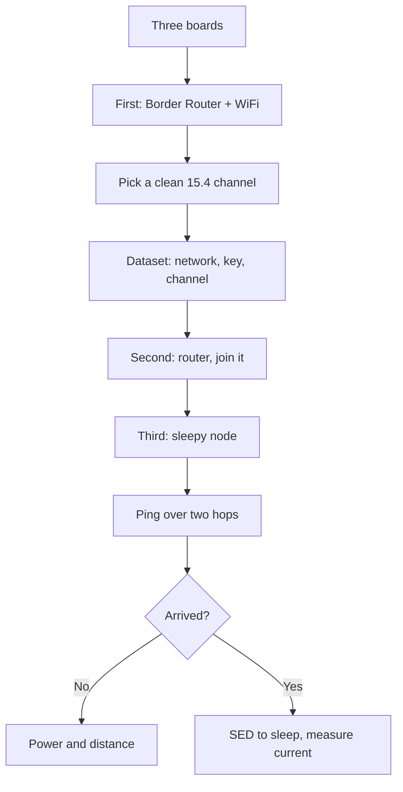

# ESP32-C6 / H2 - 802.15.4 mesh in depth

![[assets/img/c6-h2-zigbee-thread-scheme.png|600]]

![[assets/img/esp32-c6-h2-pinout.png|600]]

## Purpose

ESP32-C6 / H2 - 802.15.4 mesh in depth. The overview note [[01-Hardware/04-ESP32-C3-C6-H2.en]] compares the line, this one gives mesh practice: when Zigbee, when Thread, when Matter on top, how to commission nodes, how end devices sleep and who buffers packets for them, how C6 shares the air between WiFi and 15.4. After reading - a working three-node mesh in one evening.

## Zigbee vs Thread vs Matter: choice

| Criterion | Zigbee | Thread | Matter |
| --- | --- | --- | --- |
| Model | Mesh with a coordinator | Mesh with no single point (leader) | Application protocol on top |
| Transport | Its own full stack | IPv6 (6LoWPAN) | Thread or WiFi |
| Coordinator died | Network orphaned | New leader elected | Depends on transport |
| Ecosystem | Ready: lamps, sensors | Routers plus BR | Apple/Google/Home Assistant |
| Tools | Zigbee2MQTT | OTBR plus web UI | chip-tool, controller |

```text
Правило вибору:
  готові девайси з магазину .... Zigbee + Zigbee2MQTT;
  своя IP-мережа датчиків ....... Thread + Border Router;
  голосові асистенти ............ Matter поверх Thread або WiFi;
  H2 без WiFi ................... тільки 15.4-варіанти!
```

## Node roles: who sleeps and who does not

| Role | Sleeps? | Power | Example |
| --- | --- | --- | --- |
| Coordinator/Leader | No | Mains | Gateway on the desk |
| Router | No | Mains | Lamp repeater |
| End device (ED) | Yes, wakes by itself | Battery | Switch |
| Sleepy (SED) | Yes, deeply | Battery for years | Hourly sensor |
| Parent | No | Mains | Buffers packets for sleepy children! |

> Only a mains-powered node can be a router. A sleepy router is a hole in the network that packets never cross.

## Commissioning: how a node joins the network

| Way | How | When |
| --- | --- | --- |
| Install code / QR | Scan plus short key | Matter and Zigbee 3.0 |
| Network passphrase | Entered by hand | Thread dataset |
| Button on the router | Open commissioning window | Home network |
| Factory dataset | Flashed at the factory | Batch with ambition |

| Trap | Consequence |
| --- | --- |
| One key for all nodes | Breaking one means breaking the network |
| Commissioning left open | A neighbor slipped in their node |
| Channel hardcoded | Nearby WiFi router jams it |

## 15.4 channels vs WiFi: separate them

| 15.4 range | Overlap with WiFi | Conclusion |
| --- | --- | --- |
| Channels 11-14 | WiFi 1 | Avoid with WiFi on 1 |
| Channels 15-19 | Between WiFi 1 and 6 | Relatively quiet |
| Channels 20-24 | WiFi 6-11 | Avoid |
| Channels 25-26 | Above WiFi 11 | Cleanest! |

```text
Практика:
  сканувати ефір перед вибором каналу;
  канали 25–26 — перший кандидат;
  фіксувати канал у dataset, не стрибати.
```

## Mermaid: bringing up a three-node mesh



## C6 coexistence: WiFi plus 15.4 on one die

| Topic | Practice |
| --- | --- |
| Coex arbiter | Always on with two radios! |
| Priorities | Real-time 15.4 frames above background WiFi |
| Current peaks | Both TX at once - power with margin |
| Test | Run traffic both ways for a day |

## H2 as a USB dongle: sniffer and Border Router

| Dongle role | How |
| --- | --- |
| 15.4 sniffer | Sniffer firmware plus Wireshark |
| Thread BR | H2 radio plus host with OTBR |
| Zigbee coordinator | Zigbee2MQTT sees the port |
| Test router | USB powered, antenna up |

## OTA in mesh: updates are slow

| Topic | Practice |
| --- | --- |
| Speed | Kilobytes, not megabytes - the image takes long! |
| Sleepy nodes | Wake for packets, updates take hours |
| Routers first | Update the backbone first |
| Rollback | Two slots or a factory image |

## Mesh node power: numbers

| Role | Current | Battery |
| --- | --- | --- |
| Coordinator/BR | Tens of mA constant | Mains only! |
| Router | Tens of mA | Mains only! |
| SED sensor | Microamps plus TX peaks | Years from a CR2450 |
| Test node | USB | Do not measure sleep from USB-UART! |

## Thread dataset: fields you must know

| Field | Content |
| --- | --- |
| Network Name | Network name, visible in scans |
| Channel | Fixed after measuring the air! |
| PAN ID | Network identifier |
| Network Key | Main secret - not into git! |
| PSKc | Commissioning password |
| Channel Mask | Allowed channels for hopping |

```text
Практика dataset:
  генерувати новий ключ на мережу, не копіпастити з прикладу;
  бекап dataset в сейфі — втратив, перекомісіоновуй все;
  канал фіксувати після сканування, не авто.
```

## Zigbee binding and groups: so the switch knows the lamp

| Topic | Practice |
| --- | --- |
| Binding table | Who sends to whom without a coordinator |
| Groups | One command - ten lamps |
| Scenes | A set of states with one command |
| Bind at commissioning | Right away, while you are at it! |

## Matter fabric: admins and nodes

| Topic | Practice |
| --- | --- |
| Fabric | Shared trust: admin plus nodes |
| Several admins | Apple and Google at once - allowed |
| Node removal | From all fabrics, not just one! |
| Paring code | One-time, do not shine it in the log |

## SED polling: how a sleepy node picks up packets

| Parameter | Value |
| --- | --- |
| Poll interval | Seconds to minutes: more often means livelier and hungrier |
| Parent buffers | While the child sleeps, packets wait |
| Child timeout | Overslept long - dropped from the table! |
| Rejoin | Automatic but slow |

```text
Бюджет SED-датчика:
  сон мікроампери, вимір мілісекунди, TX десятки мілісекунд;
  раз на 10 хвилин — роки від CR2450;
  раз на 10 секунд — місяці, рахуй чесно.
```

## Scanning the air before picking a channel

| Step | Action |
| --- | --- |
| 1 | Energy scan of all 15.4 channels |
| 2 | WiFi scan: which channels routers occupy |
| 3 | Pick the quietest, 25-26 preferred |
| 4 | Fix in the dataset, verify for a day |

## Common issues

| # | Issue | Why it is bad | Correct approach |
| --- | --- | --- | --- |
| 1 | Router on battery | Network with a hole | Routers on mains only! |
| 2 | H2 as a WiFi node | No WiFi in hardware | H2 - mesh plus host |
| 3 | Channel near WiFi | Collisions and retries | 25-26 or a scan |
| 4 | One key everywhere | Break scales up | Unique install codes |
| 5 | Commissioning open | Foreign nodes | Close the window! |
| 6 | Coex off on C6 | Both radios tear | Arbiter always |
| 7 | OTA on everyone at once | Network down for hours | Routers first, then sleepy ones |
| 8 | Test with one node | Mesh unverified | Minimum three: BR, router, SED |

## Official sources

- [ESP Zigbee SDK (Espressif)](https://docs.espressif.com/projects/esp-zigbee-sdk/en/latest/) - coordinator, router, ED.
- [ESP Thread BR (Espressif)](https://docs.espressif.com/projects/esp-thread-br/en/latest/) - Border Router, dataset.
- [ESP Matter SDK (Espressif)](https://docs.espressif.com/projects/esp-matter/en/latest/) - commissioning, chip-tool.

## See also

- [[Home.en]]
- [[01-Hardware/04-ESP32-C3-C6-H2.en]]
- [[05-Radio/02-BLE-Bluetooth.en]]
- [[15-Protokoli/09-Matter-Thread-Zigbee.en]]
- [[14-Devboards/13-ESP32C6-Boards.en]]
- [[14-Devboards/14-ESP32H2-Boards.en]]
- [[99-Dodatki/08-Diagnostic-Map.en]]
