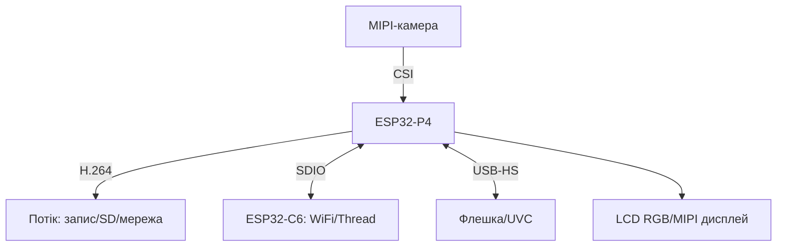

# ESP32-P4 нативно - MIPI, H.264 і USB без Arduino-ядра

EN version: `01-Hardware/12-ESP32-P4-Native.en.md`

![[assets/img/esp32-p4-native-scheme.png|600]]
*Рис. P4 нативно: MIPI-камера → H.264 → запис/стрим, USB-OTG HS - флешки і камери, C6 - радіо.*

> [!tip] Що це за нота
> Чип-рівень P4 без Arduino-прошарку: прямі драйвери IDF, MIPI, кодек, USB-хост. Плата: [[14-Devboards/16-P4-DevKit|плата P4]], USB-хост: [[12-Moduli-zvyazku/30-USB-Host|USB-хост ESP32]].

## 1. Мета

Вичавити P4 нативно:

- MIPI-CSI камери: ініціалізація і кадри без готових обгорток;
- H.264 енкодер: параметри потоку під запис;
- USB-OTG HS: швидкість і класи пристроїв;
- зв'язка P4 (хост) + C6 (радіо) по SDIO;
- коли P4, а коли вистачить S3.

| Параметр | ESP32-P4 | ESP32-S3 |
| --- | --- | --- |
| CPU | 2×RISC-V 400 МГц | 2×LX7 240 МГц |
| Радіо | немає | WiFi + BLE |
| Камера | MIPI-CSI | DVP |
| Відео | H.264 енкодер | немає |
| USB | OTG HS | OTG FS |

## 2. Архітектура



## 3. Розпіновка Function EV Board

| Сигнал | Піни | Примітка |
| --- | --- | --- |
| MIPI-CSI | виділений FPC-роз'єм | шлейф до упору |
| USB-OTG HS | USB-A роз'єм плати | 5V живлення пристроїв |
| USB-Serial | USB-C (JTAG+лог) | прошивка і монітор |
| SDMMC | SD-слот 4-біт | запис відео |
| GPIO | гребінки 2.54 | 3.3V логіка! |
| 5V/GND | клеми живлення | 2A мінімум |

## 4. MIPI-CSI нативно

- драйвер `esp_lcd`/`mipi_csi`: конфіг ліній і частоти;
- сенсор OV5647/IMX636 - ініціалізація SCCB-таблицею;
- буфери в PSRAM: кадр 1080p не влізе в SRAM;
- double-buffering - без розривів потоку;
- приклад `mipi_csi_dvp` з IDF як каркас.

## 5. Робочий код (C, ESP-IDF)

```c
#include "esp_video.h"
#include "esp_log.h"

static const char *TAG = "p4mipi";

void app_main(void) {
  esp_video_init_config_t cfg = {
    .csi = {
      .sccb_config = {.init_sccb = true, .freq = 100000},
      .reset_pin = 12, .pwdn_pin = -1,
    },
  };
  ESP_ERROR_CHECK(esp_video_init(&cfg));
  int fd = esp_video_open("/dev/video0", 0);
  uint8_t *frame = heap_caps_malloc(230400, MALLOC_CAP_SPIRAM);
  while (1) {
    int len = read(fd, frame, 230400);
    if (len > 0) {
      ESP_LOGI(TAG, "frame %d bytes", len);
    }
    vTaskDelay(pdMS_TO_TICKS(100));
  }
}
```

V4L2-шар IDF: відкрив `/dev/video0` - читаєш кадри як з файлу. Реальні структури - з прикладу під свій сенсор.

## 6. Робочий код (MicroPython)

```python
# MicroPython на P4: статуси і керування (важке відео — на C!)
import network
import urequests
import time
from machine import Pin, ADC

status = Pin(48, Pin.OUT)
temp = ADC(Pin(3))
wlan = network.WLAN(network.STA_IF)
wlan.active(True)

def report(ip, t):
    try:
        urequests.post('http://' + ip + '/p4', json={'temp': t})
    except OSError:
        pass

while True:
    raw = temp.read_u16()
    status.value(not status.value())
    report('192.168.1.10', raw * 3.3 / 65535)
    time.sleep(5)
```

Чесно: MicroPython на P4 - для обв'язки (моніторинг, кнопки, MQTT), MIPI/H.264 - тільки C-драйвери IDF.

## 7. H.264: параметри потоку

- бітрейт: 2-8 Мбіт/с під 1080p (сцена вирішує);
- GOP: ключовий кадр щосекунди для стріму;
- CBR для каналу, VBR для запису;
- запис: MP4-муксер поверх енкодера;
- стрім: RTSP-сервер на P4 або шматки в MQTT (ні!).

## 8. Типові помилки

| Симптом | Причина | Лікування |
| --- | --- | --- |
| Чорний кадр MIPI | шлейф/живлення сенсора | перепідключити, перевірити LDO камери |
| H.264 сиплеться | PSRAM повільна/перегрів | нижча роздільність, радіатор |
| USB-HS не бачить | немає 5V на VBUS | живлення OTG увімкнути |
| IDF не знає P4 | стара версія | IDF 5.3+, `set-target esp32p4` |
| Кадр рваний | один буфер | double-buffer в PSRAM |
| C6 мовчить по SDIO | частота/піни | почати з 10 МГц, звірити мапінг |

## 9. Швидка шпаргалка P4

- MIPI: шлейф + SCCB-таблиця сенсора;
- кадри - тільки в PSRAM;
- H.264: GOP щосекунди для стріму;
- USB-HS: 5V на VBUS обов'язково;
- радіо - завжди зовнішній C6.

## 10. Суміжні ноти

- [[14-Devboards/16-P4-DevKit|плата P4]] - виріб детально.
- [[12-Moduli-zvyazku/30-USB-Host|USB-хост ESP32]] - OTG-практика.
- [[12-Moduli-zvyazku/13-Camera-Streaming|стримінг з камери]] - серверна сторона.
- [[14-Devboards/13-ESP32C6-Boards|плати C6]] - радіо-напарник.
- [[Home|головна карта]] - повна навігація.

## Офіційні джерела

- [ESP32-P4 (Espressif)](https://www.espressif.com/en/products/socs/esp32-p4) - характеристики кристала.
- [ESP-IDF P4 API (Espressif)](https://docs.espressif.com/projects/esp-idf/en/latest/esp32p4/) - MIPI, H.264, USB.
- [USB Host examples (Espressif, GitHub)](https://github.com/espressif/esp-idf/tree/master/examples/peripherals/usb/host) - OTG-практика.
