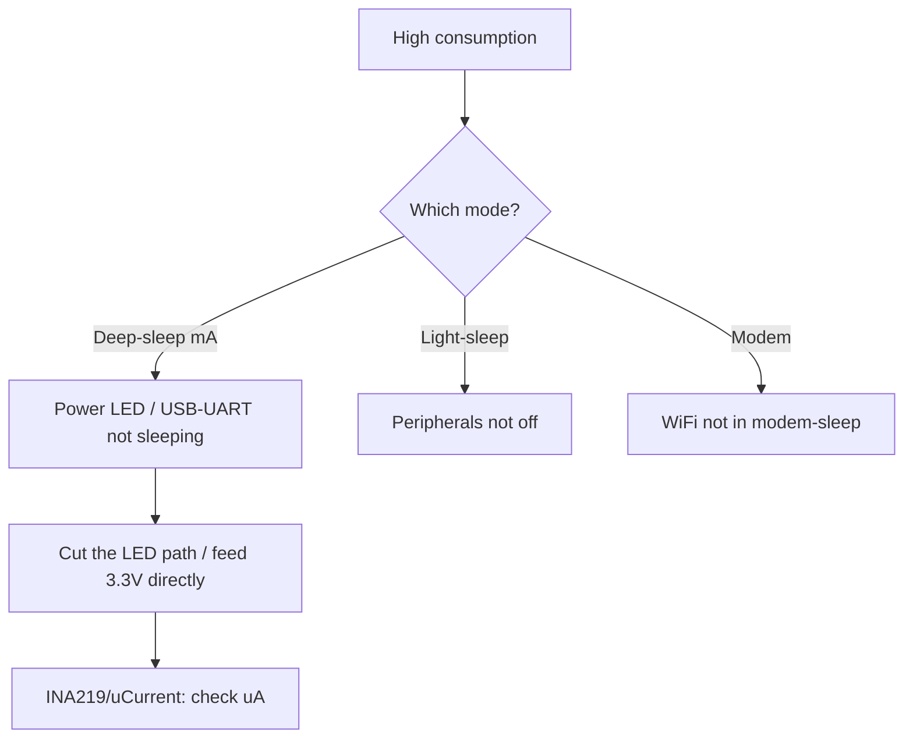

# ESP32 Power Consumption

![[assets/img/placeholder.png]]

> [!warning] Measure on the 3.3V rail!
> All numbers below are 3.3V rail current. Do not confuse with the 5V USB current (lower there thanks to LDO efficiency). In sleep pull GPIO to 3.3V/GND so nothing leaks.

## Purpose

ESP32 power consumption - mode table; INA219 measurement; ESP32-to-module wiring table. All numbers below are 3.3V rail current. Do not confuse with the 5V USB current (lower there thanks to LDO efficiency). In sleep pull GPIO to 3.3V/GND so nothing leaks. AMS1117 eats 5 mA even in deep-sleep - the battery dies in weeks. For batteries take ME6211 or a buck with low Iq. Power: [[02-Zhivlennya/01-Power-Rails.en]], 02-LDO-DC-DC, batteries: 04-Batteries-TP4056.

## Mode table

| Mode | Current (3.3V) | WiFi | Wake-up |
| --- | --- | --- | --- |
| Active RX/TX | 160-260 mA, 500 mA peak | on | - |
| Modem-sleep | 20-40 mA | DTIM pauses | WiFi |
| Light-sleep | 0.8 mA | off | GPIO/timer |
| Deep-sleep | 10-150 uA | off | RTC/ULP |
| Hibernation | 2.5 uA | off | RTC only |

> [!info] ADC2 and modem-sleep
> In modem-sleep ADC2 is free - you can measure. In active with WiFi - only ADC1. See [[03-GPIO/01-GPIO-oglyad.en]], [[01-Hardware/01-ESP32-Classic.en]].

## INA219 measurement

| Step | Action |
| --- | --- |
| 1 | INA219 in the **3.3V** rail gap (not 5V) |
| 2 | 0.1 Ohm shunt, 400 mA / 3.2A range |
| 3 | Log 500 mA TX peaks with an oscilloscope |
| 4 | For deep-sleep switch to the uA range |

> [!tip] The LDO trap
> AMS1117 eats 5 mA even in deep-sleep - the battery dies in weeks. For batteries take ME6211 or a buck with low Iq. Power: [[02-Zhivlennya/01-Power-Rails.en]], [[02-LDO-DC-DC.en]], batteries: [[04-Batteries-TP4056.en]].

## ESP32 to module wiring table

| ESP32 | Module | Description |
| --- | --- | --- |
| 3V3 | Module INA219 VCC | Sensor power **3.3V** |
| GND | Module INA219 GND | Common ground |
| GPIO21 | Module INA219 SDA | I2C 3.3V |
| GPIO22 | Module INA219 SCL | I2C 3.3V |
| 3V3 (gap) | Module load | 3.3V measurement rail |

## Current table of all modes per chip (3.3V rail)

Measured on a DevKit at 25C, WiFi 20 dBm. Your boards differ by ±20% due to LDO and peripherals.

| Mode | Classic | S2 | S3 | C3 | C6 | H2 | C2 | Conditions |
| --- | --- | --- | --- | --- | --- | --- | --- | --- |
| Active CPU 240/160 MHz, WiFi RX | 100-160 mA | 90-140 mA | 110-170 mA | 80-120 mA | 90-130 mA | - (no WiFi) | 70-100 mA | Scan/receive |
| Average WiFi TX | 160-260 mA | 150-240 mA | 180-300 mA | 150-250 mA | 160-260 mA | - | 140-220 mA | Transmit, 20 dBm |
| WiFi TX peak (250 us pulse) | up to 500 mA | up to 400 mA | up to 500 mA | up to 350 mA | up to 350 mA | - | up to 300 mA | Capacitors mandatory! |
| BLE TX/scan | 100-150 mA | - | 100-150 mA | 80-130 mA | 90-140 mA | 60-100 mA | 70-110 mA | 100 ms advertising |
| 802.15.4 TX (C6/H2) | - | - | - | - | 80-120 mA | 60-100 mA | - | Zigbee/Thread |
| CPU without radio | 30-60 mA | 25-50 mA | 30-70 mA | 20-40 mA | 25-45 mA | 15-30 mA | 15-30 mA | WiFi/BLE off |
| Modem-sleep (DTIM) | 20-40 mA | 15-30 mA | 20-40 mA | 15-30 mA | 15-30 mA | - | 10-25 mA | WiFi associated, pauses |
| Light-sleep | 0.8-2 mA | 0.5-1.5 mA | 0.8-2 mA | 0.5-1.5 mA | 0.5-1.5 mA | 0.3-1 mA | 0.5-1 mA | CPU stopped, RTC/ULP alive |
| Deep-sleep + RTC memory | 10-150 uA | 10-100 uA | 10-150 uA | 5-50 uA | 5-50 uA | 3-30 uA | 10-80 uA | ULP/RTC timer |
| Hibernation (RTC only) | 2.5 uA | 2 uA | 2.5 uA | 2 uA | 2 uA | 1.5 uA | 2 uA | Chip minimum |
| Real battery node* | 150 uA-5 mA | - | - | 50 uA-2 mA | - | 20 uA-1 mA | - | `*` With LDO, divider, LED! |

> [!danger] The starred row is the most important one!
> The bare chip eats 10 uA, but the board eats 5 mA: AMS1117 eats 5 mA, the 100k/100k battery divider - 16 uA, the power LED - 2-3 mA, the USB-UART bridge - 5-15 mA. A battery node starts with DESOLDERING the LED and the bridge, not with code optimization. Sleep and ULP: [[07-Timeri-Son/03-Sleep-ULP.en]].

Battery life calculation:

```text
Приклад: 18650 2600 мАг, вузол: deep-sleep 150 мкА + прокидання 200 мА × 5 с щогодини.
Середній струм = 0.15 мА + (200 мА × 5 с / 3600 с) = 0.15 + 0.28 = 0.43 мА.
Час = 2600 / 0.43 ≈ 6000 год ≈ 250 днів (ідеально; реально −30% на саморозряд і холод).
Без deep-sleep (modem 30 мА): 2600/30 ≈ 87 год ≈ 3.5 дні. Різниця ×70!
```

## Deep-sleep measurement method (uCurrent / INA226, jumper gap)

Problem: one instrument cannot measure both 500 mA and 10 uA. Two ranges are needed.

### Option A: jumper gap + two instruments

```text
Шина 3V3 ──[джампер J1]──► ESP32 VCC
              │  │
              │  └── мультиметр в режимі мкА (для сну, джампер ЗНЯТО, струм через прилад)
              └── перемичка (для роботи, джампер ВСТАВЛЕНО, прилад відключено)

Процедура:
1. Джампер ВСТАВЛЕНО → проший код deep-sleep (esp_deep_sleep_start через 5 с після boot).
2. Мультиметр на мкА-діапазон (2000 мкА) підключи паралельно джамперу.
3. Зніми джампер → струм пішов через мультиметр. Зачекай 10 с (плата має заснути!).
4. Зчитай: 10–150 мкА = норма; міліампери = не спить (див. таблицю витоків нижче).
5. Для виміру TX-імпульсу: поверни джампер, INA219/осцилограф на шунті (див. [[02-Zhivlennya/01-Power-Rails.en]]).
```

### Option B: uCurrent Gold / INA226 logger

| Instrument | Range | Accuracy at bottom | How |
| --- | --- | --- | --- |
| uCurrent Gold | nA-1 A (switch) | 10 nA | In the 3.3V gap, voltage output to multimeter/oscilloscope |
| INA226 (16 bit) | shunt of choice | ~10 uA with 0.1 Ohm shunt | I2C logger on a second ESP: writes a current-over-time plot |
| INA219 (12 bit) | ~100 uA step | Coarse for sleep | Active modes only, not for deep-sleep! |
| UT61E+ multimeter | 60 uA-10 A | 10 uA borderline | Cheap, but burden voltage sags the rail - account for it |

```cpp
// Код-вимірювач: 5 с на підключення приладу, потім сон на 1 хв
#include <Arduino.h>
#include "esp_sleep.h"
void setup() {
  Serial.begin(115200);
  Serial.println("5 s to remove jumper...");
  delay(5000);
  // Вимкни все зайве перед сном!
  WiFi.disconnect(true); btStop();
  gpio_hold_dis((gpio_num_t)25); // приклад звільнення hold
  esp_sleep_enable_timer_wakeup(60 * 1000000ULL);
  esp_deep_sleep_start();
}
void loop() {}
```

### Leakage table "why not 10 uA"

| Measured in sleep | Culprit | Fix |
| --- | --- | --- |
| 5-15 mA | USB-UART bridge alive | Cut the bridge power trace / separate board without bridge |
| 2-5 mA | AMS1117 Iq + power LED | ME6211 + desolder the LED |
| 0.5-2 mA | GPIO floating + pull | All unused GPIO to `pinMode(x, INPUT_PULLUP)` or HOLD |
| 100-300 uA | 100k/100k battery divider permanently connected | Divider via MOSFET switch, enable only for measurement |
| 50-150 uA | ADC/sensor not sleeping (BME280 in normal, not sleep) | Put peripherals to sleep before `deep_sleep_start` |
| 10-50 uA | Normal for C3/H2 with RTC memory | Leave as is |

## Brownout debugging via coredump / gdbstub

Brownout is the droop detector firing (typically 2.7-3.0V): the chip resets with a `Brownout detector was triggered` log.

| Step | Action | Command / code |
| --- | --- | --- |
| 1 | Confirm brownout in logs | Look for `Brownout detector was triggered` + `rst:0xc (SW_CPU_RESET)` |
| 2 | Enable coredump to flash | `menuconfig → Core dump → Flash, 64K`, `coredump` partition! [[08-Pamyat/01-Partitions-NVS.en]] |
| 3 | Read the coredump after reboot | `espcoredump.py info_corefile -t elf -c /dev/ttyUSB0 build/app.elf` |
| 4 | Or gdbstub over UART | `menuconfig → Panic handler → GDBStub`, after the crash `xtensa-esp32-elf-gdb -ex "target remote /dev/ttyUSB0"` |
| 5 | Look at PC (program counter) | If PC is in `wifi_tx`/`spi_flash_write` = droop under load, not a code bug! |
| 6 | In parallel - 3.3V oscilloscope capture | See [[02-Zhivlennya/01-Power-Rails.en]]: dip synced with the crash = power |

```c
// Лови brownout програмно (раннє попередження до ребуту)
#include "soc/rtc_cntl_reg.h"
#include "driver/rtc_io.h"
void brownout_hook(void) {
    // ESP-IDF: Component config → Brownout detector → Enabled + callback
    ESP_LOGW("pwr", "BROWNOUT! Vcc просів, див. осцилограмму 3.3V");
    // Збережи стан у RTC-памʼять ДО ресету:
    // RTC_DATA_ATTR int brownout_cnt = 0; brownout_cnt++;
}
// Після ребуту прочитай brownout_cnt з RTC-памʼяті — лічильник просадок.
```

> [!tip] Tell brownout apart from a software WDT
> `rst:0xc + Brownout` = power. `rst:0x7 (TG0WDT)` without Brownout = stuck code (loop without yield, blocked I2C). Do not treat WDT with capacitors, do not treat brownout with timeouts. Reboot FAQ: [[99-Dodatki/02-Troubleshooting-FAQ.en]], power: [[02-Zhivlennya/01-Power-Rails.en]].

### Mermaid: where the current flows



## Common issues

| # | Mistake | Why it is bad | Correct |
| --- | --- | --- | --- |
| 1 | Multimeter on the mA range during TX | Burden voltage sags the board | Peaks - the 10A socket |
| 2 | USB-UART alive in sleep | +mA instead of uA | Power past the bridge / desolder the LED |
| 3 | WiFi not sleeping | 50+ mA in idle | Modem-sleep / deep-sleep |
| 4 | ADC2 + WiFi | Driver conflict | ADC1 with WiFi |

## Official sources

- [ESP32 Sleep Modes - currents](https://docs.espressif.com/projects/esp-idf/en/latest/esp32/api-reference/system/sleep_modes.html) - uA tables.
- [ESP-IDF Power Management](https://docs.espressif.com/projects/esp-idf/en/latest/esp32/api-reference/system/power_management.html) - DFS, light-sleep.

## See also

- [[Home.en]]
- [[00-Start/03-Chip-Comparison.en]]
- [[03-GPIO/01-GPIO-oglyad.en]]
- [[03-GPIO/02-Strapping-pini.en]]
- [[02-Zhivlennya/01-Power-Rails.en]]
- [[02-LDO-DC-DC.en]]
- [[04-Batteries-TP4056.en]]
