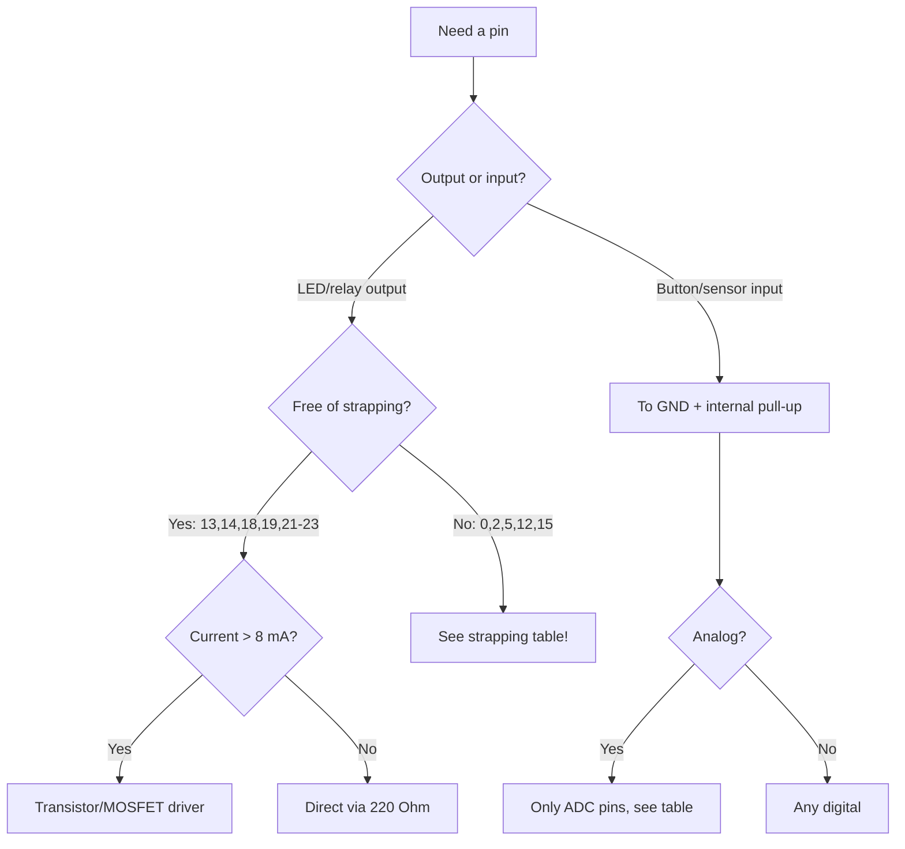

# ESP32 GPIO - matrix overview

![[assets/img/gpio-overview-matrix-scheme.png|600]]
*Fig. GPIO matrix: safe pins, current limits, LED via resistor/driver.*

ESP32 Classic has **34 physical GPIOs** (0-19, 21-23, 25-27, 32-39), of which about 28 are actually available on DevKit. Each pin goes through [[01-Hardware/01-ESP32-Classic.en]] IO MUX + GPIO Matrix.

> [!info] Core idea
> Most peripherals can be assigned to **any GPIO** via GPIO Matrix. Exception - direct IO MUX for high-speed signals (SPI flash, ADC).

## Purpose

ESP32 GPIO - matrix overview - GPIO capability matrix; Digital / Analog / RTC modes; Wiring table - Blink LED. ESP32 Classic has 34 physical GPIOs (0-19, 21-23, 25-27, 32-39), of which about 28 are actually available on DevKit. Each pin goes through [[01-Hardware/01-ESP32-Classic.en]] IO MUX + GPIO Matrix. Most peripherals can be assigned to any GPIO via GPIO Matrix. Exception - direct IO MUX for high-speed signals (SPI flash, ADC).

## GPIO capability matrix

| GPIO | Digital | Analog | RTC | Touch | Limits |
| --- | --- | --- | --- | --- | --- |
| 2 | ✅ | ADC2_CH2 | RTC11 | T2 | strapping, LED onboard |
| 4 | ✅ | ADC2_CH0 | RTC10 | T0 | - |
| 5 | ✅ | - | - | - | strapping, VSPI CS0 |
| 12 | ✅ | ADC2_CH5 | RTC15 | T5 | strapping, MTDI |
| 13 | ✅ | - | RTC14 | - | safe |
| 14 | ✅ | - | RTC16 | - | safe |
| 15 | ✅ | - | RTC13 | - | strapping, MTDO |
| 18 | ✅ | - | - | - | VSPI CLK, safe |
| 19 | ✅ | - | - | - | VSPI MISO, safe |
| 21 | ✅ | - | - | - | I2C SDA, safe |
| 22 | ✅ | - | - | - | I2C SCL, safe |
| 23 | ✅ | - | - | - | VSPI MOSI, safe |
| 25 | ✅ | DAC1 / ADC2_CH8 | RTC6 | - | safe |
| 26 | ✅ | DAC2 / ADC2_CH9 | RTC7 | - | safe |
| 27 | ✅ | ADC2_CH7 | RTC17 | T7 | safe |
| 32 | ✅ | ADC1_CH4 | RTC9 | T9 | safe |
| 33 | ✅ | ADC1_CH5 | RTC8 | T8 | safe |

> [!warning] Current limits
>
> - **Max 12 mA per pin** (recommended 6-8 mA).
> - **Total about 40 mA for all GPIOs** (per datasheet - up to 200 mA per domain, but keep 40 mA for stability).
> - Drive LEDs via a transistor/driver, not 10 LEDs directly from pins!

## Digital / Analog / RTC modes

| Mode | Function | Note |
| --- | --- | --- |
| Digital In/Out | `gpio_set_direction()` / `pinMode()` | pull-up/down in software |
| Analog In | [[06-Analog/01-ADC.en | ADC]] 12 bit | only ADC1/ADC2 pins |
| Analog Out | [[06-Analog/02-DAC-Touch-Hall.en | DAC]] 25/26 | 8 bit |
| RTC IO | [[03-GPIO/05-RTC-GPIO.en]] hold + ULP | deep sleep |

## Wiring table - Blink LED

| ESP32 | LED module | Note |
| --- | --- | --- |
| GPIO2 | ANODE (+) via 220 Ohm | onboard LED on many boards |
| GND | CATHODE (-) | common ground |

### ASCII schematic: button + LED (minimal rig)

```text
3V3 ──[10к pull-up]──┬──► GPIO4 (вхід, активний LOW)
                     │
Кнопка ──────────────┴──► GND (натиснута = LOW!)

GPIO2 ──[220 Ом]──► LED(+) ── LED(−) ──► GND
```

### Mermaid: picking a pin for the task



## Code - Blink

**Arduino:**

```cpp
#define LED 2
void setup() { pinMode(LED, OUTPUT); }
void loop() {
  digitalWrite(LED, HIGH); delay(500);
  digitalWrite(LED, LOW);  delay(500);
}
```

**ESP-IDF:**

```c
#include "driver/gpio.h"
#include "freertos/FreeRTOS.h"
#include "freertos/task.h"
#define LED 2
void app_main(void) {
    gpio_reset_pin(LED);
    gpio_set_direction(LED, GPIO_MODE_OUTPUT);
    while (1) {
        gpio_set_level(LED, 1); vTaskDelay(pdMS_TO_TICKS(500));
        gpio_set_level(LED, 0); vTaskDelay(pdMS_TO_TICKS(500));
    }
}
```

**MicroPython:**

```python
from machine import Pin
import time
led = Pin(2, Pin.OUT)
while True:
    led.on(); time.sleep(0.5)
    led.off(); time.sleep(0.5)
```

## Output modes: push-pull vs open-drain

| Mode | How it works | When |
| --- | --- | --- |
| Push-pull (standard) | Pin drives HIGH and LOW itself | LED, relay via driver, digital |
| Open-drain | Pin drives only LOW, HIGH - via external pull-up | I2C, 1-Wire, wired-OR of several devices, 5V to 3.3V matching |
| Hold (RTC) | Level frozen for sleep time | See [[03-GPIO/05-RTC-GPIO.en]] |

```cpp
// Arduino: open-drain вихід (ESP32 підтримує!)
pinMode(4, OUTPUT_OPEN_DRAIN);
digitalWrite(4, LOW);   // тягне до землі
digitalWrite(4, HIGH);  // відпускає (лінія йде вгору через pull-up!)
```

## Drive strength: how many mA in practice

| Setting (IDF `gpio_set_drive_capability`) | Current | When |
| --- | --- | --- |
| `GPIO_DRIVE_CAP_0` (weak) | about 5 mA | Long wires - LESS ringing |
| `GPIO_DRIVE_CAP_2` (default) | about 10-20 mA | Normal digital |
| `GPIO_DRIVE_CAP_3` (maximum) | about 30-40 mA | Short traces, fast buses |

> Strong driver on a long wire = ringing and extra emission. Guideline: as speed/length grow - start with weak and raise only if edges are sagging (watch with an oscilloscope, see [[17-Lab/01-Instruments.en | Instruments]]).

## Common issues

| # | Issue | Why it is bad | Correct approach |
| --- | --- | --- | --- |
| 1 | 5V on GPIO | Breakdown of protection diodes, dead pin/die | Divider or TXS0108, see [[03-GPIO/03-Pull-Ups-Levels.en| Levels]] |
| 2 | 10 LEDs directly from pins | Over total 40 mA, rail sags | Driver/transistor for each group |
| 3 | Floating input without pull | Picks up noise, false triggers | Internal pull-up or external 10k |
| 4 | Strapping pin taken by peripheral | Will not boot / hangs in download | [[03-GPIO/02-Strapping-Pins.en| Strapping]] table before routing! |
| 5 | Long wire + strong driver | Ringing, bus errors | Weak drive + 33-100 Ohm in series |
| 6 | Open-drain without pull-up | Line floats in the air | External pull-up 4.7-10k to 3.3V |
| 7 | GPIO34-39 as outputs | These are inputs ONLY (no pull, no output)! | Outputs - only GPIO 33 and below |

## Official sources

- [ESP32 Technical Reference Manual - GPIO Matrix / IO MUX](https://docs.espressif.com/projects/esp-idf/en/latest/esp32/api-reference/peripherals/gpio.html) - matrix, modes, drive strength.
- [ESP32 Datasheet - Electrical Characteristics](https://www.espressif.com/sites/default/files/documentation/esp32_datasheet_en.pdf) - currents, levels, absolute maximums.

## See also

- [[Home.en]]
- [[01-Hardware/01-ESP32-Classic.en]]
- [[03-GPIO/02-Strapping-Pins.en| Strapping pins]]
- [[03-GPIO/03-Pull-Ups-Levels.en| Pull-ups and levels]]
- [[03-GPIO/04-Interrupts-PWM.en| Interrupts and PWM]]
- [[03-GPIO/05-RTC-GPIO.en]]
- [[06-Analog/01-ADC.en | ADC]]
