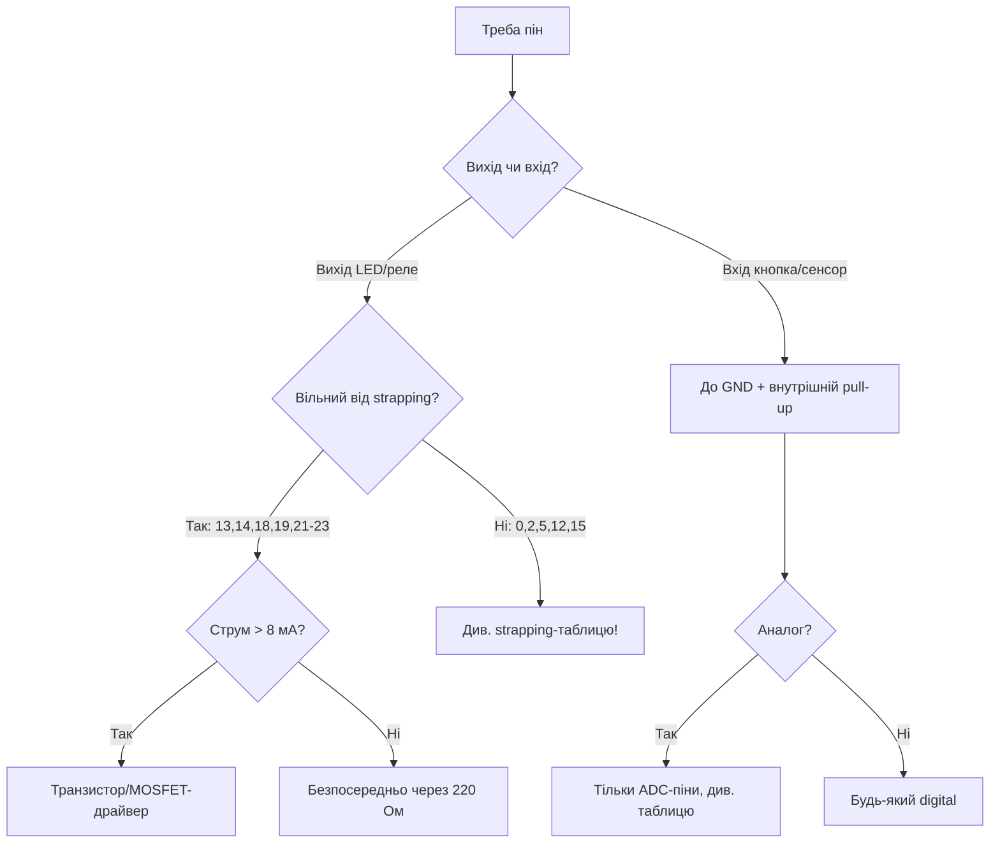

# GPIO ESP32 - огляд матриці

EN version: `03-GPIO/01-GPIO-Overview.en.md`

![[assets/img/gpio-overview-matrix-scheme.png|600]]
*Рис. GPIO-матриця: безпечні піни, струмові ліміти, LED через резистор/драйвер.*

ESP32 Classic має **34 фізичні GPIO** (0-19, 21-23, 25-27, 32-39), з яких реально доступно ~28 на DevKit. Кожен пін - через [[01-Hardware/01-ESP32-Classic]] IO MUX + GPIO Matrix.

> [!info] Ключова ідея
> Більшість периферії можна призначити на **будь-який GPIO** через GPIO Matrix. Виняток - прямий IO MUX для високошвидкісних сигналів (SPI flash, ADC).

## Призначення

GPIO ESP32 - огляд матриці - Матриця можливостей GPIO; Digital / Analog / RTC режими; Таблиця з'єднань - Blink LED. ESP32 Classic має 34 фізичні GPIO (0-19, 21-23, 25-27, 32-39), з яких реально доступно ~28 на DevKit. Кожен пін - через [[01-Hardware/01-ESP32-Classic]] IO MUX + GPIO Matrix. Більшість периферії можна призначити на будь-який GPIO через GPIO Matrix. Виняток - прямий IO MUX для високошвидкісних сигналів (SPI flash, ADC).

## Матриця можливостей GPIO

| GPIO | Digital | Analog | RTC | Touch | Обмеження |
| --- | --- | --- | --- | --- | --- |
| 2 | ✅ | ADC2_CH2 | RTC11 | T2 | strapping, LED onboard |
| 4 | ✅ | ADC2_CH0 | RTC10 | T0 | - |
| 5 | ✅ | - | - | - | strapping, VSPI CS0 |
| 12 | ✅ | ADC2_CH5 | RTC15 | T5 | strapping, MTDI |
| 13 | ✅ | - | RTC14 | - | безпечний |
| 14 | ✅ | - | RTC16 | - | безпечний |
| 15 | ✅ | - | RTC13 | - | strapping, MTDO |
| 18 | ✅ | - | - | - | VSPI CLK, безпечний |
| 19 | ✅ | - | - | - | VSPI MISO, безпечний |
| 21 | ✅ | - | - | - | I2C SDA, безпечний |
| 22 | ✅ | - | - | - | I2C SCL, безпечний |
| 23 | ✅ | - | - | - | VSPI MOSI, безпечний |
| 25 | ✅ | DAC1 / ADC2_CH8 | RTC6 | - | безпечний |
| 26 | ✅ | DAC2 / ADC2_CH9 | RTC7 | - | безпечний |
| 27 | ✅ | ADC2_CH7 | RTC17 | T7 | безпечний |
| 32 | ✅ | ADC1_CH4 | RTC9 | T9 | безпечний |
| 33 | ✅ | ADC1_CH5 | RTC8 | T8 | безпечний |

> [!warning] Струмові обмеження
>
> - **Max 12 мА на пін** (рекомендовано 6-8 мА).
> - **Сумарно ~40 мА на всі GPIO** (за даташитом - до 200 мА на домен, але стабільно тримай 40 мА).
> - Живи LED через транзистор/драйвер, а не безпосередньо 10 LED з пінів!

## Digital / Analog / RTC режими

| Режим | Функція | Примітка |
| --- | --- | --- |
| Digital In/Out | `gpio_set_direction()` / `pinMode()` | pull-up/down програмно |
| Analog In | [[06-Analog/01-ADC | ADC]] 12 біт | тільки ADC1/ADC2 піни |
| Analog Out | [[06-Analog/02-DAC-Touch-Hall | DAC]] 25/26 | 8 біт |
| RTC IO | [[03-GPIO/05-RTC-GPIO]] hold + ULP | глибокий сон |

## Таблиця з'єднань - Blink LED

| ESP32 | LED модуль | Примітка |
| --- | --- | --- |
| GPIO2 | ANODE (+) через 220 Ом | вбудований LED на багатьох платах |
| GND | CATHODE (−) | спільна земля |

### ASCII-схема: кнопка + LED (мінімальний стенд)

```text
3V3 ──[10к pull-up]──┬──► GPIO4 (вхід, активний LOW)
                     │
Кнопка ──────────────┴──► GND (натиснута = LOW!)

GPIO2 ──[220 Ом]──► LED(+) ── LED(−) ──► GND
```

### Mermaid: вибір піна під задачу



## Код - Blink

**Arduino:**

```cpp
#define LED 2
void setup() { pinMode(LED, OUTPUT); }
void loop() {
  digitalWrite(LED, HIGH); delay(500);
  digitalWrite(LED, LOW);  delay(500);
}
```

**ESP-IDF:**

```c
#include "driver/gpio.h"
#include "freertos/FreeRTOS.h"
#include "freertos/task.h"
#define LED 2
void app_main(void) {
    gpio_reset_pin(LED);
    gpio_set_direction(LED, GPIO_MODE_OUTPUT);
    while (1) {
        gpio_set_level(LED, 1); vTaskDelay(pdMS_TO_TICKS(500));
        gpio_set_level(LED, 0); vTaskDelay(pdMS_TO_TICKS(500));
    }
}
```

**MicroPython:**

```python
from machine import Pin
import time
led = Pin(2, Pin.OUT)
while True:
    led.on(); time.sleep(0.5)
    led.off(); time.sleep(0.5)
```

## Режими виходу: push-pull vs open-drain

| Режим | Як працює | Коли |
| --- | --- | --- |
| Push-pull (стандарт) | Пін сам тягне HIGH і LOW | LED, реле через драйвер, цифра |
| Open-drain | Пін тягне тільки LOW, HIGH - через зовнішній pull-up | I2C, 1-Wire, «монтажне АБО» кількох пристроїв, узгодження 5V→3.3V |
| Hold (RTC) | Рівень заморожено на час сну | Див. [[03-GPIO/05-RTC-GPIO]] |

```cpp
// Arduino: open-drain вихід (ESP32 підтримує!)
pinMode(4, OUTPUT_OPEN_DRAIN);
digitalWrite(4, LOW);   // тягне до землі
digitalWrite(4, HIGH);  // відпускає (лінія йде вгору через pull-up!)
```

## Drive strength: скільки мА реально

| Налаштування (IDF `gpio_set_drive_capability`) | Струм | Коли |
| --- | --- | --- |
| `GPIO_DRIVE_CAP_0` (слабкий) | ~5 мА | Довгі шлейфи - МЕНШЕ дзвону |
| `GPIO_DRIVE_CAP_2` (дефолт) | ~10-20 мА | Звичайна цифра |
| `GPIO_DRIVE_CAP_3` (максимум) | ~30-40 мА | Короткі траси, швидкі шини |

> Сильний драйвер на довгому шлейфі = дзвін і перевипромінювання. Правило: швидкість/довжина ростуть - починай зі слабкого і піднімай лише якщо фронти завалені (дивитись осцилографом, див. [[17-Lab/01-Instruments|Прилади]]).

## Типові помилки

| # | Помилка | Чому погано | Як правильно |
| --- | --- | --- | --- |
| 1 | 5V на GPIO | Пробій захисних діодів, смерть піна/кристала | Дільник або TXS0108, див. [[03-GPIO/03-Pidtyaguvannya-rivni | Рівні]] |
| 2 | 10 LED безпосередньо з пінів | Перевищення сумарних 40 мА, просадка | Драйвер/транзистор на кожну групу |
| 3 | Висячий вхід без pull | Ловить шум, хибні спрацювання | Внутрішній pull-up або зовнішній 10к |
| 4 | Strapping-пін зайнятий периферією | Не завантажується / висить у download | Таблиця [[03-GPIO/02-Strapping-pini | Strapping]] перед розводкою! |
| 5 | Довгий шлейф + сильний драйвер | Дзвін, помилки шин | Слабкий drive + 33-100 Ом послідовно |
| 6 | Open-drain без pull-up | Лінія висить у повітрі | Зовнішній pull-up 4.7-10к до 3.3V |
| 7 | GPIO34-39 як виходи | Це ТІЛЬКИ входи (немає pull, немає виходу)! | Виходи - тільки GPIO ≤33 |

## Офіційні джерела

- [ESP32 Technical Reference Manual - GPIO Matrix / IO MUX](https://docs.espressif.com/projects/esp-idf/en/latest/esp32/api-reference/peripherals/gpio.html) - матриця, режими, drive strength.
- [ESP32 Datasheet - Electrical Characteristics](https://www.espressif.com/sites/default/files/documentation/esp32_datasheet_en.pdf) - струми, рівні, абсолютні максимуми.

## Див. також

- [[Home]]
- [[01-Hardware/01-ESP32-Classic]]
- [[03-GPIO/02-Strapping-pini|Strapping-піни]]
- [[03-GPIO/03-Pidtyaguvannya-rivni|Підтягування та рівні]]
- [[03-GPIO/04-Pererivannya-PWM|Переривання та PWM]]
- [[03-GPIO/05-RTC-GPIO]]
- [[06-Analog/01-ADC|ADC]]
