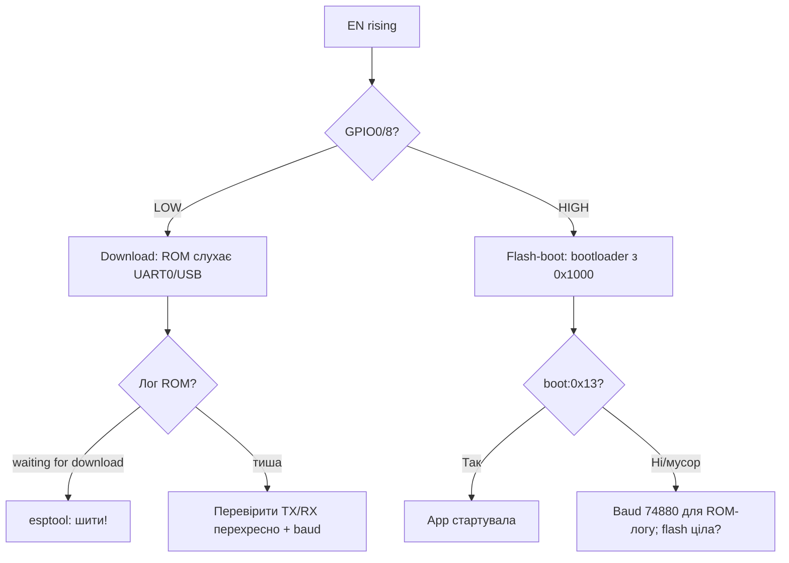

# Strapping-піни ESP32

EN version: `03-GPIO/02-Strapping-Pins.en.md`

![[assets/img/gpio-strapping-boot-scheme.png|600]]
*Рис. Strapping-піни: стани на boot і безпечні комбінації.*

Strapping-піни зчитуються ROM-bootloader в момент **EN rising edge** і визначають режим завантаження. Невірна обв'язка = плата не стартує або не прошивається.

> [!danger] Золоте правило
> Нічого не підключай до strapping-пінів так, щоб воно **жорстко тягнуло пін** в момент подачі живлення. Після boot - використовуй вільно.

## Призначення

Strapping-піни ESP32 - Таблиця стан-на-завантаженні (ESP32 Classic); Чому не підтягувати до землі / живлення; S3 / C3 особливості. Strapping-піни зчитуються ROM-bootloader в момент EN rising edge і визначають режим завантаження. Невірна обв'язка = плата не стартує або не прошивається. Нічого не підключай до strapping-пінів так, щоб воно жорстко тягнуло пін в момент подачі живлення. Після boot - використовуй вільно.

## Таблиця стан-на-завантаженні (ESP32 Classic)

| GPIO | Функція boot | Потрібний рівень для норм. boot | Що буде при порушенні |
| --- | --- | --- | --- |
| GPIO0 | BOOT mode | **HIGH (pull-up 10к)** | LOW → download mode (прошивка), плата "висить" |
| GPIO2 | BOOT + SDIO | **LOW або floating** (внутр. pull-down) | HIGH через сильний pull-up → проблеми boot |
| GPIO5 | SDIO / Flash напруга | **HIGH** | LOW → збій ініціалізації flash |
| GPIO12 | MTDI / VDD_SDIO | **LOW (floating)** | HIGH (>0.5В) → flash на 1.8В, крах |
| GPIO15 | MTDO / debug | **HIGH** | LOW → boot-лог мовчить / збій |

> [!warning] GPIO12 - найпідступніший
> Якщо датчик/периферія підтягує GPIO12 до 3.3В через 4.7к - ESP32 вибере 1.8В живлення flash і **зависне**. Тому на GPIO12 - тільки виходи або входи з weak pull, що не піднімають рівень при boot.

## Чому не підтягувати до землі / живлення

| Помилка | Наслідок | Виправлення |
| --- | --- | --- |
| Кнопка BOOT на GPIO0 до GND без резистора | завжди download mode | кнопка через 10к pull-up до 3.3В |
| LED + резистор GPIO2 → GND сильний | boot ok, але LED впливає | LED на безпечний пін |
| Дільник/Sensor тягне GPIO15 до GND | silent boot, немає UART-логу | перенести сенсор на GPIO13/14 |
| PIR/реле тримає GPIO5 LOW | не стартує flash | перенести на GPIO21-23 |

## S3 / C3 особливості

| Чіп | Strapping | Примітка |
| --- | --- | --- |
| ESP32-S3 | GPIO0, GPIO3, GPIO45, GPIO46 | GPIO45 = VDD_SPI, GPIO46 = ROM лог; USB D-/D+ = GPIO19/20 |
| ESP32-C3 | GPIO2, GPIO8, GPIO9 | GPIO8 = BOOT, GPIO9 = BOOT; USB Serial/JTAG вбудований |
| ESP32 Classic | GPIO0, 2, 5, 12, 15 | див. таблицю вище |

> [!tip] Переїзд з Classic на S3/C3
> Не копіюй схему 1:1. Звірся з datasheet розділ "Strapping Pins" - набір інший, і [[04-Shini/06-USB-OTG-JTAG|USB-OTG-JTAG]] піни теж інші.

## Безпечні піни (смівливо чіпляй периферію)

13, 14, 16, 17, 18, 19, 21, 22, 23, 25, 26, 27, 32, 33

## Таблиця з'єднань - безпечна кнопка BOOT

| ESP32 | Компонент | Значення |
| --- | --- | --- |
| GPIO0 | кнопка → GND | натиск = LOW = download |
| GPIO0 | резистор → 3V3 | pull-up 10 кОм |
| EN | кнопка → GND + 10к → 3V3 | reset |
| GND | спільна | - |

## Повна таблиця strapping по чипах

| Чіп | Strapping-піни | BOOT (download) | Flash-напруга | ROM-лог / USB | Джерело |
| --- | --- | --- | --- | --- | --- |
| ESP32 Classic | GPIO0, 2, 5, 12, 15 | GPIO0=LOW → download | GPIO12=HIGH → VDD_SDIO 1.8В | GPIO15: silent boot при LOW | [[01-Hardware/01-ESP32-Classic]] |
| ESP32-S2 | GPIO0, GPIO45, GPIO46 | GPIO0=LOW → download | GPIO45: VDD_SPI (LOW=3.3В, HIGH=1.8В) | GPIO46: ROM лог (LOW=див. табл.) | [[01-Hardware/02-ESP32-S2]] |
| ESP32-S3 | GPIO0, 3, 45, 46 | GPIO0=LOW → download; GPIO3=HIGH на jtag? | GPIO45: VDD_SPI (0=3.3В) | GPIO46=LOW → download-консоль | [[01-Hardware/03-ESP32-S3]] |
| ESP32-C3 | GPIO2, 8, 9 | GPIO8=LOW або GPIO9=LOW → download | - (немає вибору) | GPIO9 + вбуд. USB Serial/JTAG | [[01-Hardware/04-ESP32-C3-C6-H2]] |
| ESP32-C6 | GPIO8, 9, 15 | GPIO8=LOW → download; GPIO9=LOW → download | - | GPIO15: ROM лог / JTAG | [[01-Hardware/04-ESP32-C3-C6-H2]] |
| ESP32-C5 / C61 (згадка) | див. TRM C5, набір ≈ C6+ | GPIO0/8-комбінація за TRM | VDD_SPI вибір аналогічно S3 | USB-Serial вбудований | [[01-Hardware/10-ESP32-C5-C61]] |

Деталі:

- **Classic GPIO5=LOW** - flash не стартує (SDIO Slave / VDD_SDIO конфлікт). На практиці GPIO5 тримай HIGH або floating з pull-up.
- **S2/S3 GPIO45** - критичний як старий GPIO12: HIGH при boot = flash на 1.8В → «цегла», хоча плата справна. Ніколи не вішай туди кнопку до 3.3В.
- **S3 GPIO3**: LOW при boot примусово вмикає ROM-код через USB-Serial (заводський режим). Якщо USB не працює - перевір, чи GPIO3 не притягнутий до GND периферією.
- **S3 GPIO46**: LOW при boot = ROM виводить лог на UART0; HIGH = мінімум логу. Тиха плата з робочим кодом - часто саме GPIO46.
- **C3 GPIO9**: кнопка BOOT типових плат (напр. SuperMini) сидить саме тут. Серійний монітор через USB-CDC з'являється після прошивки з `USB_CDC_ON_BOOT=1`.
- **C6**: плюс окремий strapping JTAG-сесії через GPIO15 - при відлагодженні через [[04-Shini/06-USB-OTG-JTAG|USB-OTG-JTAG]] не тягни його вниз зовнішнім резистором < 5.1к.

> [!warning] S2/S3 + вбудований USB
> GPIO19/20 (S3) і GPIO19/20 (S2) - USB D-/D+. Підтяжки 22 Ом послідовно, ніяких pull-up/down на них - зірвеш перерахування USB.

## RC-номінали обв'язки

| Вузол | R pull-up | R pull-down / series | C | Коментар |
| --- | --- | --- | --- | --- |
| GPIO0 → 3V3 | 10к | кнопка → GND (без R, короткочасно) | 100 нФ до GND опц. (антибрязкіт) | під час boot рівень має встигнути HIGH за <1 мс |
| EN → 3V3 | 10к | кнопка → GND; 1к послід. від USB-UART DTR | 1 мкФ до GND (затримка старту) | затримка EN дає живленню встоятись; занадто велика C (>10 мкФ) - esptool не встигає reset |
| GPIO45/GPIO12 (VDD_SPI) | - (floating) | 10к до GND якщо траса довга | - | не став сильний pull-up, інакше 1.8В-режим |
| GPIO46/GPIO15 (ROM лог) | 10к до 3V3 (тихий/норм. boot) | - | - | для діагностики можна перемкнути |
| GPIO3 (S3) | 10к до 3V3 | - | - | LOW тільки кнопкою в момент прошивки |
| Auto-reset (DTR/RTS) | - | 100 нФ послідовно DTR→GPIO0, RTS→EN | транзисторна пара NPN | класика DevKit; без C - прошивка тільки вручну BOOT+EN |

Типова схема auto-reset (DevKitV1):

```text
USB-UART DTR --|| 100н --+--> GPIO0
USB-UART RTS --|| 100н --+--> EN
                          R 10к до 3V3 на кожній лінії
```

> [!tip] CP2102 vs CH340
> На CH340 клонах конденсатори іноді 10 нФ - esptool «timed out». Заміни на 100 нФ або тисни BOOT вручну. Див. [[13-Moduli-zhivlennya-rivniv/05-USB-UART-AutoReset|USB-UART AutoReset]].

## Діагностика «не бутиться»

Покроковий чекліст (вимірюй мультиметром **до** натискання EN, плата під живленням):

| Крок | Що міряти | Норма | Якщо не норма |
| --- | --- | --- | --- |
| 1 | 3V3 шина | 3.2-3.4В | [[02-Zhivlennya/01-Lancjugi-zhivlennya | живлення]]: LDO/кабель/діод |
| 2 | EN пін | HIGH 3.3В, при кнопці - LOW | обрив R 10к, пробитий C 1мкФ |
| 3 | GPIO0 | HIGH (~3.3В) | кнопка залипла / DTR тримає LOW |
| 4 | GPIO45 (S2/S3) / GPIO12 (Classic) | LOW (<0.4В) | периферія тягне HIGH → відпаяй, перевір |
| 5 | GPIO46 / GPIO15 | HIGH | див. вище |
| 6 | Струм споживання | 30-80 мА в boot | 0 мА - немає живлення; >500 мА - КЗ/пробитий стаб |
| 7 | UART-лог 115200 8N1 | `ets Jul 29... boot:0x13` | тиша → поміняй RX/TX місцями, перевір GND |

Розшифровка `boot:0xNN` (молодші біти = стан strapping):

| boot-код | Значення |
| --- | --- |
| `0x13` | нормальний SPI-boot (GPIO0=1) |
| `0x03` / `0x01` | download-boot (GPIO0=0) - тисни EN ще раз без BOOT |
| `0x12` + мовчання | ймовірно VDD_SPI=1.8В (GPIO45/12 HIGH) |
| сміття на 74880 бод | ROM-лог Classic на нестандартній швидкості - постав 74880 і читай |

Мінімальний скетч-індикатор (залий через download-mode, якщо boot побитий периферією - відпаяй її першою):

```cpp
void setup() {
  pinMode(2, OUTPUT);
  Serial.begin(115200);
  Serial.println("boot ok");
}
void loop() {
  digitalWrite(2, !digitalRead(2));
  delay(500);
}
```

> [!danger] Периферія-винуватець
> 90% «не бутиться» - це датчик/реле/дисплей на strapping-піні, а не мертвий чіп. Відпаяй усе зі strapping-пінів, добійся `boot:0x13`, потім повертай периферію по одному дроту.

## Strapping C5 / C61 / P4 - особливості

Нові чипи Espressif міняють логіку strapping: менше «високовольтних» пасток типу GPIO12, але більше комбінацій BOOT/USB/JTAG.

| Чіп | Ядро / процес | Strapping-піни | Ключова відмінність від Classic |
| --- | --- | --- | --- |
| ESP32-C5 | RISC-V 32-біт, 2.4 + 5 ГГц | GPIO0, GPIO8, GPIO9 (+GPIO15 JTAG опц.) | Набір близький до C6; вбудований USB-Serial/JTAG; VDD_SPI вибір через GPIO45-подібний або eFuse (див. TRM C5) |
| ESP32-C61 | урізаний C5 (IoT, без 5 ГГц) | GPIO8, GPIO9 (BOOT), GPIO15 (ROM-лог) | Як C6: GPIO8=LOW → download; пильнуй GPIO9 (кнопка BOOT багатьох міні-плат) |
| ESP32-P4 | Dual-core RISC-V HP + LP-core | GPIO0, GPIO34, GPIO35, GPIO37, GPIO38 | Високі номери! BOOT-вибір через GPIO0 + eFuse `BOOT_SEL`; USB/UART/JTAG через окремі strapping; LP-система має власний boot |

Детально по C5/C61 (за TRM ESP32-C5 v0.9+ та datasheet):

| Пін C5/C61 | Семпл-момент | 0 (LOW) | 1 (HIGH / floating+pull-up) | Пастка |
| --- | --- | --- | --- | --- |
| GPIO8 | EN rising | download-boot (ROM UART0/USB) | SPI-boot (flash) | Кнопка BOOT сюди; зовнішній pull-up 10к обов'язковий, інакше шум = випадковий download |
| GPIO9 | EN rising | примусовий download (разом з GPIO8) / ROM-консоль | нормальний boot | На SuperMini-подібних платах сюди виведена кнопка; не вішай датчик з сильним pull-down |
| GPIO15 | EN rising | ROM-лог вимкнено / JTAG TAP активний | ROM-лог на UART0 | Зовнішній pull-down < 5.1к вбиває діагностику - плата «мовчить», хоча жива |
| VDD_SPI select | EN rising (+ eFuse override) | 3.3В flash | 1.8В flash | Не повторюй помилку GPIO12: периферія на цьому піні = «цегла» |

Детально по P4 (за TRM ESP32-P4):

| Пін P4 | Функція strapping | Норма для SPI-boot | Коментар |
| --- | --- | --- | --- |
| GPIO0 | BOOT_MODE0 | HIGH (10к pull-up) | LOW → download; та сама кнопка BOOT |
| GPIO34 | BOOT_MODE1 / VDD_SPI | LOW або floating | HIGH → альтернативний boot-носій / 1.8В |
| GPIO35 | JTAG / ROM-лог select | HIGH | LOW → тихий boot або JTAG-сесія |
| GPIO37 | USB PHY select | HIGH | LOW → ROM чекає USB замість UART |
| GPIO38 | Secure-boot force | HIGH | LOW → ROM вимагає підписаний образ (при eFuse secure-boot) |

> [!warning] P4: високі GPIO ≠ безпечні автоматично
> На Classic «безпечні» - 13/14/21-23. На P4 частина високих номерів - strapping. Не перенось звички без звірки з розділом Strapping Pins datasheet P4. Див. [[01-Hardware/09-ESP32-C2-P4|ESP32-C2 P4]].

Практика розводки C5/C61/P4:

1. Кнопки BOOT/EN - як на Classic: 10к pull-up + кнопка до GND + 100 нФ антибрязкіт на BOOT, 1 мкФ на EN.
2. USB D+/D− (C5/C61 вбудований USB-Serial): послідовні 22 Ом, без pull-up/down, диференціальна пара рівної довжини. Див. [[04-Shini/06-USB-OTG-JTAG|USB-OTG JTAG]].
3. JTAG-піни C5/P4 не підтягуй жорстко: TCK/TMS мають внутрішні pull-up, TDI - pull-up, TDO - floating. Зовнішній сильний pull-down на TDO зірве strapping-семпл.
4. Живлення C5 (5 ГГц PA - піки до 500 мА!): LDO з запасом 1 А + електроліт 470 мкФ, інакше brownout при TX маскується під «strapping-проблему». Див. [[02-Zhivlennya/01-Lancjugi-zhivlennya|Ланцюги живлення]].

```cpp
// Універсальний детектор "я в download чи flash-boot?" — у setup():
#include "esp_system.h"
void setup() {
  Serial.begin(115200);
  delay(100);
  // boot:0x13 видно в ROM-лозі; програмно читаємо причину reset:
  auto r = esp_reset_reason();
  Serial.printf("reset reason: %d\n", (int)r);
  Serial.printf("GPIO0=%d (0=download був затиснутий)\n", digitalRead(0));
}
```

## Flowchart «не бутиться» - повна діагностика

Розширений алгоритм: від розетки до ROM-логу. Виконуй строго зверху вниз, не перескакуй.

```text
START: плата не стартує / тиша в моніторі
  │
  ├─[1] Живлення: 3V3 пін мультиметром
  │     ├─ 0.0В → USB-кабель/діод/LDO/перемичка 5V-3V3. Заміни кабель!
  │     ├─ 2.5–3.1В → LDO в захисті / тонкі DuPont / КЗ. Міряй струм!
  │     └─ 3.2–3.4В → далі
  │
  ├─[2] Струм (розрив 3V3 або лабораторник з амперметром)
  │     ├─ 0 мА → обрив живлення / кнопка EN залипла в LOW / пробитий діод
  │     ├─ >500 мА → КЗ: зніми модулі, шукай нагрів пальцем/тепловізором
  │     ├─ 5–15 мА і тиша → чіп у download або flash 1.8В-режим (крок 4)
  │     └─ 30–80 мА пульсуючий → boot йде, проблема в UART-лозі (крок 6)
  │
  ├─[3] EN пін
  │     ├─ LOW постійно → кнопка залипла / пробитий C 1мкФ / DTR тримає LOW
  │     ├─ повільний ріст (<1В/мс) → C завелика (>10мкФ) + слабкий pull-up
  │     └─ чистий HIGH 3.3В → далі
  │
  ├─[4] GPIO0 (BOOT-режим)
  │     ├─ LOW → download-mode: відпусти кнопку, перевір DTR-конденсатор 100нФ
  │     └─ HIGH → flash-boot, далі
  │
  ├─[5] VDD_SPI пін (GPIO12 Classic / GPIO45 S2-S3 / C5-C61/P4 за datasheet)
  │     ├─ HIGH (>0.5В) → flash у 1.8В-режимі = "цегла". Відпаяй периферію!
  │     └─ LOW (<0.4В) → далі
  │
  ├─[6] UART-лог: 115200 8N1, поміняй RX/TX місцями, спільний GND!
  │     ├─ "ets ... boot:0x13" → нормальний boot, код користувача падає (дивись panic)
  │     ├─ "boot:0x03/0x01" → download: тисни EN без BOOT
  │     ├─ сміття → спробуй 74880 бод (ROM-лог Classic), перевір кварц 40МГц
  │     ├─ тиша + струм 30-80мА → GPIO46/15 (ROM-лог вимкнено) або USB-CDC без USB_CDC_ON_BOOT
  │     └─ тиша + струм 5-15мА → крок 7
  │
  ├─[7] Відпаяй ВСЮ периферію зі strapping-пінів → повтори з кроку 1
  │     └─ запрацювало → повертай периферію по ОДНОМУ дроту, кожного разу EN-reset
  │
  └─[8] Останнє: кварц (осцилограф 40МГц?), flash (прогрій/перепаяй?), eFuse (див. нижче)
        └─ все одно тиша → міняй модуль, цей — донор
```

Таблиця «симптом → винуватець» для швидкого пошуку:

| Симптом | Струм | UART-лог | Винуватець (ймовірність) |
| --- | --- | --- | --- |
| Тиша, гріється стаб | >500 мА | немає | КЗ / переплутані 5V-3V3 / пробитий LDO (70%) |
| Тиша, холодна | 0 мА | немає | кабель / кнопка EN / обрив GND (60%) |
| Тиша, тепла | 5-15 мА | немає | VDD_SPI=1.8В (GPIO12/45 HIGH) (80%) |
| `boot:0x03` по колу | 30-60 мА | download-запрошення | GPIO0 притягнутий LOW: кнопка/DTR/периферія (85%) |
| Сміття замість тексту | 30-80 мА | крякозябри | не той бод (74880 vs 115200) / кварц / довгі дроти RX-TX (70%) |
| Стартує без периферії, з нею - ні | стрибає | `0x12` + стоп | датчик на strapping (90%) |
| Стартує через раз | 30-80 мА | іноді `Brownout` | живлення: тонкі дроти + WiFi-пік + слабкий LDO (75%) |
| Працює тільки поки тримаєш EN | - | лог обривається | C на EN завелика / pull-up обірваний (60%) |
| Після OTA - тиша | 30 мА | `invalid header` | побитий partition / не той flash-mode (див. [[09-Proshivka/04-Esptool-Flash | Boot та прошивка]]) |

Мінімальний стенд для перевірки «живий чи мертвий» (голий модуль, нічого крім живлення+UART):

```text
3V3 --10к--> EN (C 1мк до GND)
3V3 --10к--> GPIO0 (кнопка до GND)
GPIO45/GPIO12 -- залишити floating (перевірити <0.4В)
TX0 --> USB-UART RX, RX0 --> USB-UART TX, GND --> GND
Живлення 3.3В 500мА+ безпосередньо в 3V3/GND (не через слабкий LDO макетки!)
```

### Mermaid: що завантажилось?



## Download-режим vs Flash-boot - таблиця станів

| Сигнал у момент EN-rising | Download (прошивка) | Flash-boot (робота) |
| --- | --- | --- |
| GPIO0 (Classic/S2/S3) / GPIO8 (C3/C6/C5) / GPIO0 (P4) | **LOW** (кнопка натиснута) | **HIGH** (pull-up 10к) |
| EN | rising edge 0→1 (відпустили reset) | rising edge 0→1 |
| U0TXD (GPIO1) | ROM видає `waiting for download` | ROM видає `boot:0x13 ... SPI boot` |
| Що слухає ROM | UART0 115200 + USB-Serial/JTAG (де є) | читає flash з 0x1000 (bootloader) |
| esptool.py | `Connecting... chip sync ok` | `Timed out waiting for packet header` (нормально! прошивати - тільки через download) |
| Струм | 30-60 мА стабільно | пульсації 30→150 мА (bootloader грузить код) |

Ручний вхід у download (коли немає auto-reset):

1. Затисни BOOT (GPIO0/GPIO8 → GND), тримай.
2. Коротко натисни-відпусти EN (reset-імпульс).
3. Відпусти BOOT через 0.5 с.
4. `esptool.py --port COMx flash_id` має відповісти.

Auto-reset через DTR/RTS (чому іноді «Connecting..._____...»):

| Сигнал esptool | Ланцюг | Дія |
| --- | --- | --- |
| DTR LOW → імпульс | DTR -100нФ→ GPIO0 | GPIO0 падає в LOW на ~50 мс |
| RTS LOW → імпульс | RTS -100нФ→ EN | EN падає → чіп в reset |
| Послідовність esptool | RTS+HOLD, DTR-PULSE | GPIO0=LOW ловить EN-rising → download |

Діагностика auto-reset осцилографом/логікою: обидва імпульси мають бути чіткими, фронт <10 мкс. Розмиті фронти (розряджені C 10 нФ на клонах CH340) → заміни C на 100 нФ кераміку. Див. [[13-Moduli-zhivlennya-rivniv/05-USB-UART-AutoReset|USB-UART AutoReset]].

> [!tip] esptool baud vs strapping
> Якщо download входить, але прошивка рветься на високому боді (`--baud 921600`): знизь до 460800/115200. Обрив на високій швидкості - це НЕ strapping, це дроти/земля/живлення. Див. [[09-Proshivka/04-Esptool-Flash|Boot та прошивка]].

## eFuse strapping-override - коли залізо не переробити

eFuse - одноразово програмовані біти: можуть **жорстко зафіксувати** значення strapping, ігноруючи піни. Рятує серію, де трасування вже зроблене з помилкою.

| eFuse-поле (назва залежить від чипа) | Що фіксує | Приклад застосування |
| --- | --- | --- |
| `STRAPPING_SEL` / `SOFT_STRAPPING` | вмикає software-override | увімкнути перед фіксацією |
| `BOOT_SEL_*` / `FLASH_VOLTAGE_SEL` | VDD_SPI 1.8/3.3В | плата з 1.8В flash, а пін плаває - зафіксуй 1.8В |
| `UART_PRINT_CONTROL` | ROM-лог on/off | тихий продукт без перепайки GPIO46/15 |
| `JTAG_DISABLE` / `SECURE_BOOT_EN` | JTAG/secure-boot | фінальний продукт: закрити JTAG назавжди |
| `USB_PHY_SEL` (де є) | USB vs UART ROM-консоль | зафіксувати USB-консоль на C5/C61 |

> [!danger] eFuse - безповоротно
> Записаний біт назад не відкотити. Неправильний `FLASH_VOLTAGE_SEL` або `JTAG_DISABLE` на прототипі = викинутий чіп. Відпрацюй логіку на 2-3 платах перемичками, потім пали eFuse на серії. Завжди читай поточні eFuse перед записом:
>
> ```bash
> espefuse.py --port /dev/ttyUSB0 summary
> # читай, думай, тільки потім burn:
> espefuse.py --port /dev/ttyUSB0 burn_efuse STRAPPING_SEL 1
> ```

Перевірка «чи eFuse перекриває мої піни»:

```bash
espefuse.py --port /dev/ttyUSB0 dump
# шукай SOFT_STRAPPING / STRAP_JTAG / VOL_SEL — якщо запрограмовані,
# рівень на піні ігнорується, дивись тільки eFuse!
```

Зв'язок з secure boot: при увімкненому secure-boot ROM ігнорує частину strapping (захист від даунгрейду в download). Плата, що після ввімкнення secure-boot «перестала прошиватись» - це штатна поведінка, а не брак. Див. [[15-Protokoli/08-Security-Hardening]] та [[09-Proshivka/04-Esptool-Flash|Boot та прошивка]].

## RC-розрахунок затримки EN (чому 1 мкФ, а не 10 мкФ)

| C на EN | R pull-up | tau = R×C | Затримка HIGH | esptool встигає? |
| --- | --- | --- | --- | --- |
| 100 нФ | 10к | 1 мс | ~2 мс | так, ідеально |
| 1 мкФ | 10к | 10 мс | ~20 мс | так (рекомендовано DevKit) |
| 10 мкФ | 10к | 100 мс | ~200 мс | ні - esptool timeout, тисни BOOT вручну |
| 1 мкФ | 47к | 47 мс | ~100 мс | межа, при просіданні живлення - гойдалки reset |

Формула фронту: `V(t) = 3.3 × (1 − e^(−t/RC))`, поріг EN-HIGH ≈ 2.4В → `t ≈ 1.3 × RC`. Тримай сумарну затримку 2-30 мс.

## Чекліст ревізії плати перед замовленням (strapping-рев'ю)

| Пункт ревью | Як перевірити | Критерій PASS |
| --- | --- | --- |
| Жоден датчик/реле/LED не тягне strapping сильніше 47к | схема + номінали pull | слабше 47к або через буфер |
| GPIO0/GPIO8 pull-up 10к на місці | BOM + схема | є, 10к ±5% |
| EN: 10к + 1 мкФ, без електроліта 10 мкФ+ | BOM | tau 2-30 мс |
| VDD_SPI-пін floating або 10к до GND | схема | жодного pull-up до 3V3! |
| DTR/RTS конденсатори 100 нФ | BOM (не 10 нФ!) | 100 нФ кераміка |
| USB D+/D−: 22 Ом, дифпара, без pull | трасування | довжини рівні ±0.5 мм |
| Тестові точки: 3V3, EN, GPIO0, VDD_SPI-пін, TX0 | Gerber/silkscreen | пади під щуп/піни pogo |
| eFuse-план зафіксований у документації серії | `espefuse.py summary` у протоколі | відомо, що палити, а що ні |

Прогін першої плати з партії (15 хвилин, рятує серію):

1. Без прошивки: живлення → струм 30-80 мА пульс → UART 115200 → `boot:0x13`.
2. Ручний download → `flash_id` → повне стирання → заливка blink.
3. Вставити периферію (SD-карта / шлейфи) → EN-reset ×5 → щоразу `boot:0x13`.
4. Прогрів феном + охолодження спреєм → повтор boot ×3 (ловить плаваючі pull).
5. Записати `espefuse.py summary` у паспорт партії.

> [!tip] Сторонній ревьювер за 10 хвилин
> Дай схему колезі тільки з питанням «де тут strapping-піни і що на них висить». Свіже око ловить помилку GPIO12/45 у 80% випадків. Див. [[99-Dodatki/03-Cheklisti-montazhu|Чеклісти монтажу]] та [[99-Dodatki/02-Troubleshooting-FAQ]].

## Типові плати: де ховається strapping-конфлікт

| Плата | Відоме місце конфлікту | Обхід без перепайки |
| --- | --- | --- |
| DevKitV1 (Classic) | GPIO2-LED синій, GPIO12 вільний | LED на GPIO2 - ок, але не чіпляй туди кнопку до GND |
| NodeMCU-32S | GPIO5 pulled-up на борту | периферію з GPIO5 - тільки виходи, не входи з pull-down |
| ESP32-CAM | GPIO0 = кнопка/LED, flash-LED на GPIO4 | при підключеному програматорі знімай перемичку IO0, інакше вічний download |
| S3-DevKitC-1 | GPIO3/45/46 поруч з USB, RGB на GPIO48 | WS2812-RGB (GPIO48) - безпечний, датчики вішай туди, а не на 45/46 |
| C3 SuperMini | BOOT на GPIO9, USB-CDC | після прошивки додай `USB_CDC_ON_BOOT=1`, інакше монітор мовчить |
| WROOM vs WROVER | WROVER: GPIO16/17 - PSRAM! | на WROVER не вважай 16/17 «безпечними UART-пінами» - бери 13/14/21/22, див. [[01-Hardware/05-Moduli-WROOM-WROVER-MINI | WROOM WROVER MINI]] |

Запам'ятай одним рядком: **перед першим EN-reset нової плати - продзвони мультиметром GPIO0, VDD_SPI-пін і EN до GND/3V3; 30 секунд дзвону економять 3 години дебагу.**

Додатково: тримай під рукою запасну перемичку 10к (0805) і кнопку тактову 6×6 - польовий ремонт strapping-обв'язки робиться за 5 хвилин паяльником.
А для серії замов тест-прошивку `strapping_selftest` (друк рівнів пінів у UART при першому boot) - вона ловить брак монтажу резисторів ще на конвеєрі.
Результати selftest записуй у паспорт плати разом з `espefuse.py summary`.
І ніколи не видаляй ці записи - через рік вони пояснять, чому конкретна партія поводиться інакше.

## Офіційні джерела Espressif

- ESP32 Series Datasheet - розділ Strapping Pins (кожен чип окремо): класичні рівні GPIO0/2/5/12/15, допуски напруг семплу.
- ESP32 Technical Reference Manual - глава Boot System / eFuse Controller: моменти семплування, `boot:0xNN` коди, software strapping.
- ESP32-S3 / C3 / C6 / C5 / P4 Technical Reference Manual - власні таблиці strapping (набори пінів різні!).
- ESP-IDF Programming Guide - Bootloader / esptool documentation: послідовність DTR/RTS, ручний download-вхід.
- espefuse.py documentation - поля STRAPPING_SEL, UART_PRINT_CONTROL, безпечне пропалювання.
- Hardware Design Guidelines (Espressif) - рекомендовані RC-номінали BOOT/EN, розводка USB, вимоги до живлення.

## Див. також

- [[Home]]
- [[01-Hardware/01-ESP32-Classic]]
- [[03-GPIO/01-GPIO-oglyad|GPIO огляд]]
- [[03-GPIO/03-Pidtyaguvannya-rivni|Підтягування та рівні]]
- [[03-GPIO/05-RTC-GPIO]]
- [[07-Timeri-Son/03-Sleep-ULP|Sleep та ULP]]
- [[09-Proshivka/04-Esptool-Flash|Boot та прошивка]]
