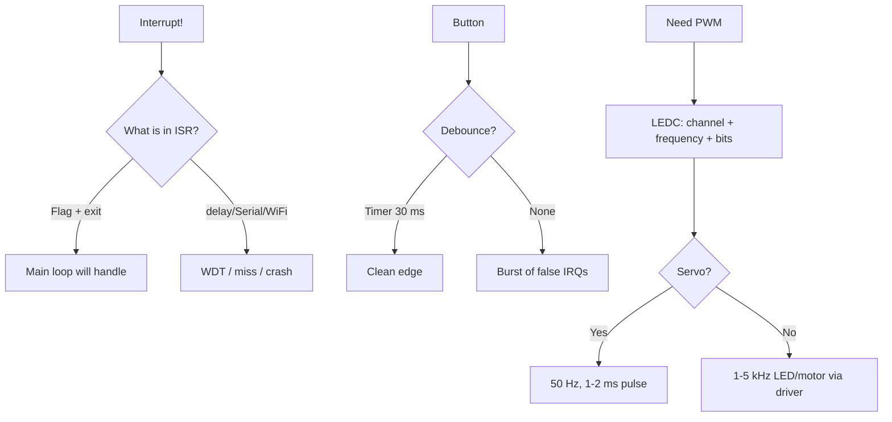

# Interrupts and PWM (LEDC)

![[assets/img/gpio-interrupt-pwm-scheme.png|600]]
*Fig. Interrupts + LEDC: modes, ISR rules, PWM channels.*

ESP32: interrupts on **any GPIO**, LEDC - **16 channels**, frequency 1 Hz - 40 MHz.

> [!info] Two independent mechanisms
> `attachInterrupt` - reaction to an edge. LEDC - hardware PWM with no CPU load. Do not confuse with [[07-Timeri-Son/01-Timeri-MCPWM-PCNT-RMT| MCPWM for motors]].

## Purpose

Interrupts and PWM (LEDC) - interrupts - mode table; LEDC - 16 channels; wiring table. ESP32: interrupts on any GPIO, LEDC - 16 channels, frequency 1 Hz - 40 MHz. attachInterrupt - reaction to an edge. LEDC - hardware PWM with no CPU load. Do not confuse with 07-Timeri-Son/01-Timers-MCPWM-PCNT-RMT.

## Interrupts - mode table

| Arduino mode | ESP-IDF | When |
| --- | --- | --- |
| RISING | GPIO_INTR_POSEDGE | button released / encoder |
| FALLING | GPIO_INTR_NEGEDGE | button pressed (PULLUP) |
| CHANGE | GPIO_INTR_ANYEDGE | encoder, manchester |
| LOW / HIGH | GPIO_INTR_LOW_LEVEL | wakeup, alarm |

> [!warning] ISR rules
> In ISR - only `IRAM_ATTR`, no `delay()`, no `Serial.print`, `volatile` flags. Long work - in loop/task.

## LEDC - 16 channels

| Parameter | Value |
| --- | --- |
| Channels | 16 (2 high/low speed groups) |
| Resolution | 1-16 bit (higher frequency - fewer bits) |
| Frequency | 1 Hz - 40 MHz |
| Binding | any GPIO via matrix |

| Task | Frequency | Resolution |
| --- | --- | --- |
| LED dimming | 5 kHz | 8-12 bit |
| Servo SG90 | 50 Hz | 16 bit (1-2 ms pulse) |
| Buzzer | 2-4 kHz | 8 bit |

## Wiring table

| ESP32 | Device | Note |
| --- | --- | --- |
| GPIO13 | button to GND | INT FALLING, pull-up |
| GPIO18 | LED + 220 Ohm to GND | LEDC CH0 |
| GPIO19 | Servo signal (orange) | LEDC 50 Hz; servo power 5V separate, GND common |

## Code - button + LED PWM + Servo

**Arduino:**

```cpp
volatile bool flag = false;
void IRAM_ATTR isr() { flag = true; }
#define LED 18
#define SERVO 19
void setup() {
  pinMode(13, INPUT_PULLUP);
  attachInterrupt(13, isr, FALLING);
  ledcSetup(0, 5000, 8); ledcAttachPin(LED, 0);
  ledcSetup(1, 50, 16);  ledcAttachPin(SERVO, 1);
}
void loop() {
  if (flag) { flag = false; /* action */ }
  for (int d = 0; d < 255; d++) { ledcWrite(0, d); delay(5); }
  ledcWrite(1, 3277); delay(1000);  // ~1ms
  ledcWrite(1, 6554); delay(1000);  // ~2ms
}
```

**ESP-IDF:**

```c
#include "driver/gpio.h"
#include "driver/ledc.h"
#define LED 18
static void IRAM_ATTR isr(void *a) { /* xQueueSendFromISR */ }
void app_main(void) {
    gpio_set_direction(13, GPIO_MODE_INPUT);
    gpio_set_pull_mode(13, GPIO_PULLUP_ONLY);
    gpio_set_intr_type(13, GPIO_INTR_NEGEDGE);
    gpio_install_isr_service(0);
    gpio_isr_handler_add(13, isr, NULL);
    ledc_timer_config_t t = {.speed_mode=LEDC_LOW_SPEED_MODE,.timer_num=LEDC_TIMER_0,.duty_resolution=LEDC_TIMER_8_BIT,.freq_hz=5000,.clk_cfg=LEDC_AUTO_CLK};
    ledc_timer_config(&t);
    ledc_channel_config_t c = {.gpio_num=LED,.speed_mode=LEDC_LOW_SPEED_MODE,.channel=LEDC_CHANNEL_0,.timer_sel=LEDC_TIMER_0,.duty=128};
    ledc_channel_config(&c);
}
```

**MicroPython:**

```python
from machine import Pin, PWM
import time
btn = Pin(13, Pin.IN, Pin.PULL_UP)
led = PWM(Pin(18), freq=5000, duty=128)
servo = PWM(Pin(19), freq=50, duty=77)  # ~1ms/20ms ~ 77/1023
def cb(p): print("irq")
btn.irq(trigger=Pin.IRQ_FALLING, handler=cb)
while True:
    for d in range(0, 1024, 10):
        led.duty(d); time.sleep_ms(10)
```

## See also

- [[Home.en]]
- [[03-GPIO/01-GPIO-Overview.en| GPIO overview]]
- [[03-GPIO/03-Pull-Ups-Levels.en| Pull-ups]]
- [[07-Timeri-Son/01-Timeri-MCPWM-PCNT-RMT| Timers MCPWM PCNT RMT]]
- [[11-Vivid/03-NeoPixel-Servo-Rele-MOSFET | LED and NeoPixel]]
- [[03-GPIO/04-Interrupts-PWM.en| Buttons and encoders]]
- [[01-Hardware/01-ESP32-Classic.en]]

### Mermaid: ISR hygiene



### LEDC channels and servo math

| Parameter | LED | Servo SG90 | DC motor |
| --- | --- | --- | --- |
| Frequency | 1-5 kHz | 50 Hz | 20-25 kHz (no whistle!) |
| Resolution | 8-10 bit | 14-16 bit (1 us accuracy!) | 8-10 bit |
| Servo pulse | - | 1000-2000 us = 0-180 deg | - |
| Driver | Resistor/MOSFET | Power 5V separate! | H-bridge, see 11-04 |

## Common issues

| # | Issue | Why it is bad | Correct approach |
| --- | --- | --- | --- |
| 1 | delay/Serial in ISR | Blocks system, WDT restart | Flag + handling in loop |
| 2 | Button without debounce | Burst of interrupts | RC + 20-50 ms |
| 3 | CHANGE on encoder without queue | Lost steps at speed | PCNT peripheral (see 07-01!) |
| 4 | Servo powered from 3.3V pin | 500+ mA peak sags rail | Separate 5V PSU, common GND |
| 5 | 1 kHz PWM on motor | Whistle + losses | 20-25 kHz |
| 6 | One LEDC channel for two pins | Settings conflict | Channel - one pin (16 of them!) |

## Official sources

- [ESP32 LEDC (ESP-IDF)](https://docs.espressif.com/projects/esp-idf/en/latest/esp32/api-reference/peripherals/ledc.html) - channels, frequency, resolution.
- [GPIO interrupts (ESP-IDF)](https://docs.espressif.com/projects/esp-idf/en/latest/esp32/api-reference/peripherals/gpio.html) - types, ISR, IRAM.
