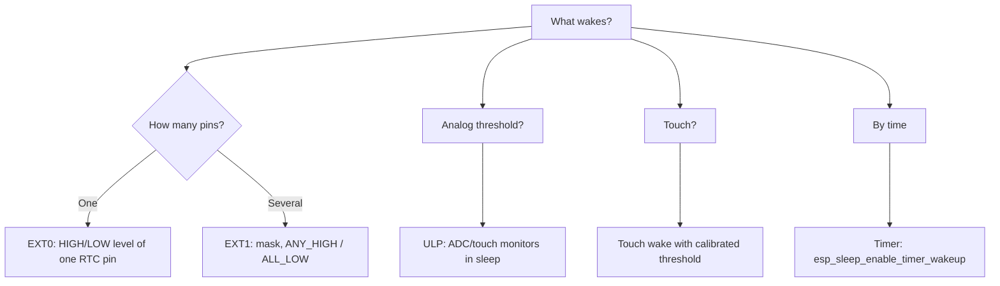

# RTC GPIO - hold and wakeup

![[assets/img/gpio-rtc-sleep-scheme.png|600]]
*Fig. RTC GPIO: level hold, ULP, EXT0/EXT1 wake.*

The RTC domain stays powered even in [[07-Timeri-Son/03-Sleep-ULP.en | deep-sleep]]. Only RTC pins can hold state (hold) and wake the chip. Wake sources - EXT0 (one pin), EXT1 (mask), touch and ULP thresholds. Holding a relay in sleep - classic task: set level, enable hold, fall asleep. After wake hold is released, else the pin stays frozen.

> [!info] Which pins are RTC?
> **0, 2, 4, 12, 13, 14, 15, 25, 26, 27, 32, 33, 34, 35, 36, 39.** GPIO34-39 - input only, no pull.

## Purpose

RTC GPIO - hold and wakeup - RTC GPIO features; wiring table - holding a relay in sleep; Hold API in three frameworks. The RTC domain stays powered even in 07-Timeri-Son/03-Sleep-ULP. Only RTC pins can hold state (hold) and wake the chip.

## RTC GPIO features

| Function | Description |
| --- | --- |
| Hold | holds OUT/HOLD during deep-sleep (relay does not chatter) |
| EXT0 wakeup | 1 RTC pin, HIGH/LOW level wakes |
| EXT1 wakeup | mask of several RTC pins, ANY_HIGH / ALL_LOW |
| ULP | [[07-Timeri-Son/03-Sleep-ULP.en | ULP]] reads RTC sensors without CPU |
| ADC RTC | ADC1 on RTC pins available in sleep |

## Wiring table - holding a relay in sleep

| ESP32 | Module | Note |
| --- | --- | --- |
| GPIO33 | relay IN (via transistor) | RTC8, hold works |
| 3V3 / GND | relay power | separate, if needed in sleep - must be powered too |
| GPIO32 | button to GND | EXT0 wakeup |

## Code

**Arduino (hold + EXT0):**

```cpp
#include "driver/rtc_io.h"
#define RELAY 33
void setup() {
  pinMode(RELAY, OUTPUT); digitalWrite(RELAY, HIGH);
  rtc_gpio_hold_en((gpio_num_t)RELAY);  // тримати в сні
  esp_sleep_enable_ext0_wakeup((gpio_num_t)32, 0); // будити LOW
  esp_deep_sleep_start();
}
```

**ESP-IDF:**

```c
#include "driver/rtc_io.h"
#include "esp_sleep.h"
void app_main(void) {
    rtc_gpio_init(33);
    rtc_gpio_set_direction(33, RTC_GPIO_MODE_OUTPUT_ONLY);
    rtc_gpio_set_level(33, 1);
    rtc_gpio_hold_en(33);
    esp_sleep_enable_ext0_wakeup(32, 0);
    esp_deep_sleep_start();
}
```

**MicroPython:**

```python
from machine import Pin, deepsleep
import esp32
r = Pin(33, Pin.OUT); r.on()
# hold через esp32.gpio_hold_en у нових білдах
esp32.wake_on_ext0(pin=Pin(32), level=esp32.WAKEUP_ALL_LOW)
deepsleep(10000)
```

> [!warning] Do not forget to release hold
> After wake call `rtc_gpio_hold_dis()`, else `digitalWrite` on the pin will do nothing - the pin is "frozen".

### Hold API in three frameworks

```cpp
// Arduino-ESP32: утримати реле у сні
#include "driver/rtc_io.h"
rtc_gpio_hold_en(GPIO_NUM_33);      // заморозити HIGH перед сном
esp_deep_sleep_start();
// ...після wake:
rtc_gpio_hold_dis(GPIO_NUM_33);     // розморозити, інакше digitalWrite мовчить!
```

```c
// ESP-IDF: те саме + ізоляція живлення RTC-домену
rtc_gpio_init(GPIO_NUM_33);
rtc_gpio_set_direction(GPIO_NUM_33, RTC_GPIO_MODE_OUTPUT_ONLY);
rtc_gpio_set_level(GPIO_NUM_33, 1);
rtc_gpio_hold_en(GPIO_NUM_33);
esp_sleep_enable_ext0_wakeup(GPIO_NUM_32, 0);  // будити кнопкою
esp_deep_sleep_start();
```

```text
Обмеження hold, про які забувають:
  - Hold тримає ТІЛЬКИ цифровий рівень; ADC/тач/DAC у сні безпосередньо не працюють —
    їх обслуговує ULP (див. 07-Timeri-Son/03).
  - GPIO34–39: входять у RTC-домен як ВХОДИ (EXT1/ULP), але hold-виходу в них нема.
  - Після будь-якого reset (не wake!) hold скидається — реле клацне. Конденсатор
    на затворі MOSFET (100нФ) маскує клацання на ~мс.
```

### Mermaid: wake-source choice



### EXT0 vs EXT1 vs ULP - choice table

| Source | Pins | Sleep current | When |
| --- | --- | --- | --- |
| Timer | - | about 10 uA | Periodic measurements |
| EXT0 | 1 RTC pin, level | about 10 uA | Button/door |
| EXT1 | Mask of RTC pins | about 10 uA | Several sensors |
| Touch | Touch pins | about 50+ uA | Control panel |
| ULP | ADC/touch thresholds | about 100+ uA | "Wake if..." without CPU |

## Common issues

| # | Issue | Why it is bad | Correct approach |
| --- | --- | --- | --- |
| 1 | Hold not released after wake | Pin frozen, `digitalWrite` silent | `rtc_gpio_hold_dis()` at once |
| 2 | EXT0 on non-RTC pin | Will never wake | Only RTC pins (see table!) |
| 3 | Touch threshold "from nowhere" | False/missing wakeups | Calibrate on site +/- margin |
| 4 | ULP without current measurement | 100+ uA instead of 10 | Budget count (see 02-03!) |
| 5 | Relay held by GPIO without hold | In sleep relay releases | Hold BEFORE sleep + relay power separate |

## Official sources

- [ESP32 Sleep Modes + RTC GPIO (ESP-IDF)](https://docs.espressif.com/projects/esp-idf/en/latest/esp32/api-reference/system/sleep_modes.html) - EXT0/EXT1, hold, ULP.
- [ULP coprocessor guide](https://docs.espressif.com/projects/esp-idf/en/latest/esp32/api-reference/system/ulp.html) - ULP programming.

## See also

- [[Home.en]]
- [[01-Hardware/01-ESP32-Classic.en]]
- [[03-GPIO/01-GPIO-Overview.en| GPIO overview]]
- [[07-Timeri-Son/03-Sleep-ULP.en | Sleep and ULP]]
- [[06-Analog/01-ADC.en | ADC]]
- [[07-Timeri-Son/02-WDT.en | WDT]]
