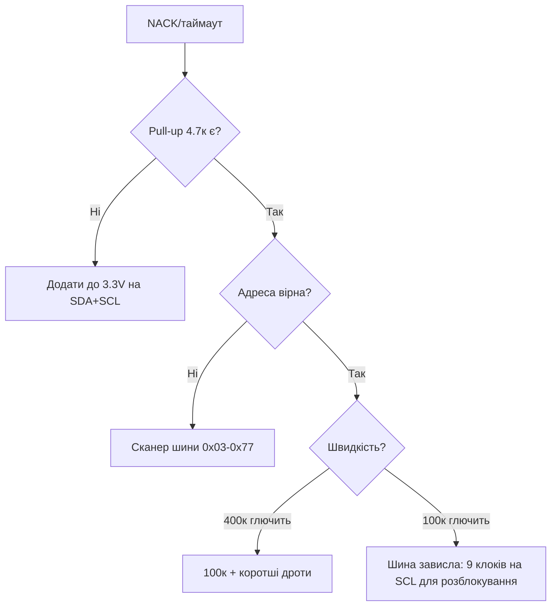

# I2C ESP32

![[assets/img/placeholder.png]]

Два контролери I2C, default **SDA=GPIO21, SCL=GPIO22**. Швидкості 100 / 400 кГц / 1 МГц. На шині - десятки пристроїв з унікальними адресами.

> [!info] Pull-up обов'язкові
> SDA/SCL - open-drain. Без підтяжок шина не працює. Внутрішніх 45к замало для 400 кГц - став **зовнішні 4.7к до 3.3В** (для 1 МГц - 2.2к).

## Призначення

I2C ESP32 - Таблиця з'єднань - кілька пристроїв; Код - сканер; Troubleshooting NACK. Два контролери I2C, default SDA=GPIO21, SCL=GPIO22. Швидкості 100 / 400 кГц / 1 МГц. На шині - десятки пристроїв з унікальними адресами. SDA/SCL - open-drain. Без підтяжок шина не працює. Внутрішніх 45к замало для 400 кГц - став зовнішні 4.7к до 3.3В (для 1 МГц - 2.2к).

## Параметри

| Параметр | Значення |
| --- | --- |
| Контролери | 2 (I2C0, I2C1) |
| Default | SDA 21 / SCL 22 |
| Швидкість | 100 кГц standard, 400 кГц fast, 1 МГц fast+ |
| Pull-up | 4.7к (100-400 кГц), 2.2к (1 МГц) |
| Довжина | до ~1 м на 400 кГц, далі - буфер P82B715 |

## Таблиця з'єднань - кілька пристроїв

| ESP32 | OLED 0.96 | BMP280 | Примітка |
| --- | --- | --- | --- |
| GPIO21 SDA | SDA | SDA | паралельно |
| GPIO22 SCL | SCL | SCL | паралельно |
| 3V3 | VCC | VCC | 3.3В! |
| GND | GND | GND | спільна |
| - | - | SDO→GND/VCC | вибір адреси 0x76/0x77 |
| SDA→3V3 | - | - | 4.7к |
| SCL→3V3 | - | - | 4.7к |

## Код - сканер

**Arduino:**

```cpp
#include <Wire.h>
void setup() {
  Serial.begin(115200);
  Wire.begin(21, 22, 400000);
  for (uint8_t a = 1; a < 127; a++) {
    Wire.beginTransmission(a);
    if (Wire.endTransmission() == 0) { Serial.printf("found 0x%02X\n", a); }
  }
}
void loop() {}
```

**ESP-IDF:**

```c
#include "driver/i2c.h"
void app_main(void) {
    i2c_config_t c = {.mode=I2C_MODE_MASTER,.sda_io_num=21,.scl_io_num=22,.sda_pullup_en=GPIO_PULLUP_ENABLE,.scl_pullup_en=GPIO_PULLUP_ENABLE,.master.clk_speed=400000};
    i2c_param_config(I2C_NUM_0, &c);
    i2c_driver_install(I2C_NUM_0, I2C_MODE_MASTER, 0, 0, 0);
    for (int a = 1; a < 127; a++) {
        i2c_cmd_handle_t h = i2c_cmd_link_create();
        i2c_master_start(h); i2c_master_write_byte(h, (a<<1)|I2C_MASTER_WRITE, true); i2c_master_stop(h);
        if (i2c_master_cmd_begin(I2C_NUM_0, h, pdMS_TO_TICKS(50)) == ESP_OK) printf("found 0x%02X\n", a);
        i2c_cmd_link_delete(h);
    }
}
```

**MicroPython:**

```python
from machine import I2C, Pin
i2c = I2C(0, scl=Pin(22), sda=Pin(21), freq=400000)
print([hex(a) for a in i2c.scan()])
```

## Troubleshooting NACK

| Симптом | Причина | Лікування |
| --- | --- | --- |
| NACK на всі адреси | немає pull-up / переплутані SDA/SCL | 4.7к, перевір [[03-GPIO/01-GPIO-oglyad | піни]] |
| Видно через раз | довгі дроти / 1 МГц завелика | знизи до 100 кГц, коротші дроти |
| Два пристрої одна адреса | конфлікт адрес | перемичка ADDR/SDO, або другий I2C1 |
| Працює без WiFi, падає з WiFi | живлення просідає | окремий LDO, конденсатор 100мкФ |

### Mermaid: NACK і завислі лінії



## Clock stretching, арбітраж, 10-бітні адреси

| Механізм | Що відбувається | Що робити ESP32 |
| --- | --- | --- |
| Clock stretching | Slave тримає SCL LOW, доки не готовий | Чекати (апаратно); таймаут - `i2c_set_timeout` |
| Арбітраж (multi-master) | Два майстри стартують разом - програє той, хто першим відпустив SDA | Рідко на ESP32; при програші - повторити пізніше |
| 10-бітні адреси | Префікс `11110XX` + 2 байти | Підтримка в IDF є, на практиці майже не зустрічається |
| Завислий slave | Тримає SDA LOW вічно | 9 клоків на SCL вручну або живлення slave через MOSFET-ключ |

```cpp
// Arduino: розблокування завислиної шини (9 клоків SCL)
void i2c_unlock(int scl, int sda) {
  pinMode(scl, OUTPUT); pinMode(sda, INPUT_PULLUP);
  for (int i = 0; i < 9; i++) {
    digitalWrite(scl, LOW); delayMicroseconds(5);
    digitalWrite(scl, HIGH); delayMicroseconds(5);
    if (digitalRead(sda)) break;  // slave відпустив — стоп!
  }
}
```

### Розрахунок pull-up: не 4.7к навмання

```text
Rmin = (Vcc - VOL) / IOL = (3.3 - 0.4) / 0.003 ≈ 1к   (не менше — перевантажимо вихід!)
Rmax = tr / (0.8473 × Cbus);  tr=300нс (fast-mode), Cbus≈100пФ → Rmax ≈ 3.5к
Висновок: 2.2–4.7к для 100–400 кГц; довга шина (більша Cbus) → менший R.
```

## Типові помилки

| # | Помилка | Чому погано | Як правильно |
| --- | --- | --- | --- |
| 1 | Без pull-up | Лінії не піднімаються | 4.7к до 3.3V (див. 03-GPIO/03) |
| 2 | Pull-up до 5V | 5V на GPIO! | Тільки до 3.3V |
| 3 | Два пристрої, одна адреса | Конфлікт ACK | ADDR-пін/мультиплексор TCA9548 |
| 4 | 400 кГц по 30 см DuPont | Ємність шини | 100 кГц або коротше/екрановане |
| 5 | Завислий slave тримає SDA | Вся шина мертва | 9 клоків SCL / живлення slave по MOSFET |

## Офіційні джерела

- [I2C-bus specification (NXP UM10204)](https://www.nxp.com/docs/en/user-guide/UM10204.pdf) - режими, таймінги, арбітраж.
- [ESP32 I2C driver (ESP-IDF)](https://docs.espressif.com/projects/esp-idf/en/latest/esp32/api-reference/peripherals/i2c.html) - master/slave, таймаути.

## Див. також

- [[Home]]
- [[01-Hardware/01-ESP32-Classic]]
- [[03-GPIO/03-Pidtyaguvannya-rivni|Підтягування та рівні]]
- [[10-Sensori/03-BME280-BMP280-SHT31|I2C сенсори]]
- [[11-Vivid/01-OLED-SSD1306|OLED дисплеї]]
- [[04-Shini/02-SPI|SPI]]
- [[13-Moduli-zhivlennya-rivniv/02-Level-Shifters|Level-shifteri]]
