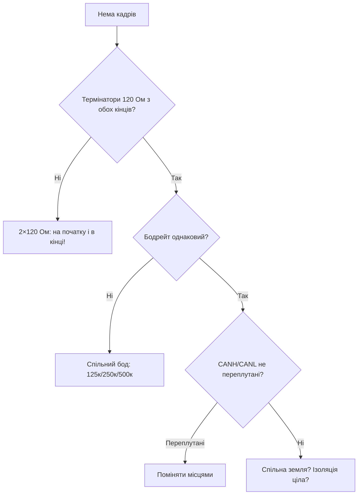

# CAN (TWAI) та RS485

![[assets/img/placeholder.png]]

ESP32 має вбудований **TWAI-контролер** (сумісний з CAN 2.0). Але без трансивера він не працює з шиною. RS485 - через UART + MAX485.

> [!danger] TWAI без трансивера не працює
> Піни TX/RX контролера - логічні 3.3В. Для диференціальної шини CAN потрібен **TJA1050 або SN65HVD230** (3.3В!). Без нього шину не побачиш.

## Призначення

CAN (TWAI) та RS485 - TWAI - схема; RS485 - MAX485 + DE/RE; Modbus коротко. ESP32 має вбудований TWAI-контролер (сумісний з CAN 2.0). Але без трансивера він не працює з шиною. RS485 - через UART + MAX485. Піни TX/RX контролера - логічні 3.3В. Для диференціальної шини CAN потрібен TJA1050 або SN65HVD230 (3.3В!). Без нього шину не побачиш.

## TWAI - схема

| ESP32 | SN65HVD230 (3.3В!) | CAN-шина |
| --- | --- | --- |
| GPIO21 | CTX | - |
| GPIO22 | CRX | - |
| 3V3 | VCC | - |
| GND | GND | - |
| - | CANH | CANH (кручена пара) |
| - | CANL | CANL |
| - | RS→GND через 10к | slope mode |

> [!tip] TJA1050 vs SN65HVD230
> TJA1050 - 5В живлення, потрібен level-shift на RX. **SN65HVD230 - 3.3В**, безпосередньо до ESP32. Для нових схем бери SN65HVD230.

**Arduino (TWAI):**

```cpp
#include "driver/twai.h"
void setup() {
  twai_general_config_t g = TWAI_GENERAL_CONFIG_DEFAULT((gpio_num_t)21, (gpio_num_t)22, TWAI_MODE_NORMAL);
  twai_timing_config_t t = TWAI_TIMING_CONFIG_500KBITS();
  twai_filter_config_t f = TWAI_FILTER_CONFIG_ACCEPT_ALL();
  twai_driver_install(&g, &t, &f);
  twai_start();
}
```

**ESP-IDF / MicroPython:** ESP-IDF - той же `twai_driver_install` + `twai_transmit/receive`; MicroPython - модуль `esp32.TWAI` (у прошивках з підтримкою).

## RS485 - MAX485 + DE/RE

| ESP32 | MAX485 | RS485-шина |
| --- | --- | --- |
| GPIO17 (U2 TX) | DI | - |
| GPIO16 (U2 RX) | RO | - |
| GPIO4 | DE + RE (разом) | напрям: HIGH=TX, LOW=RX |
| 3V3/GND | VCC/GND | - |
| - | A / B | A/B кручена пара + 120 Ом термінатор на кінцях |

**Arduino (Modbus RTU запит):**

```cpp
#include <HardwareSerial.h>
HardwareSerial S2(2);
#define DE_RE 4
void setup() { S2.begin(9600, SERIAL_8N1, 16, 17); pinMode(DE_RE, OUTPUT); }
void txMode(bool tx) { digitalWrite(DE_RE, tx); delayMicroseconds(50); }
void loop() {
  txMode(true);
  uint8_t req[] = {0x01, 0x03, 0x00, 0x00, 0x00, 0x01, 0x84, 0x0A};
  S2.write(req, sizeof(req)); S2.flush();
  txMode(false); delay(100);
}
```

**ESP-IDF:** UART + `uart_set_pin()` + GPIO DE/RE; для Modbus - компонент `esp-modbus`.

**MicroPython:**

```python
from machine import UART, Pin
u = UART(2, baudrate=9600, tx=17, rx=16)
de = Pin(4, Pin.OUT, value=0)
de.on(); u.write(bytes([1,3,0,0,0,1,0x84,0x0A])); de.off()
print(u.read())
```

## Modbus коротко

| Параметр | Значення |
| --- | --- |
| Режими | RTU (бінарний) / ASCII |
| Адреса slave | 1-247 |
| Функції | 0x03 read holding, 0x04 read input, 0x06/0x10 write |
| Таймаут | 50-200 мс між запитами |

### Mermaid: CAN мовчить



## TWAI-фільтри/маски + error-кадри

```cpp
// ESP-IDF: приймати тільки ID 0x100–0x10F (приклад маски)
twai_filter_config_t f = {
  .acceptance_code = (0x100 << 21),
  .acceptance_mask = ~(0xFF << 21),  // молодші 8 біт — don't care
  .single_filter = true
};
twai_driver_install(&g_config, &t_config, &f);
```

| Стан вузла | TEC/REC | Що робити |
| --- | --- | --- |
| error-active | <128 | Норма, працює |
| error-passive | 128-255 | Шукати винуватця (бод/термінатор) |
| bus-off | >255 | `twai_initiate_recovery()` + логування! |

### Bit-timing коротко (чому 8 МГц кварц на MCP2515)

```text
1 Мбіт/с = 8 TQ по 125 нс; похибка кварца ±1% — межа для 1 Мбіт.
Тому MCP2515-модулі з керамічним резонатором замість кварца на 1 Мбіт — лотерея:
для надійності або кварц 8/16 МГц, або бод ≤500 кбіт.
```

## Типові помилки

| # | Помилка | Чому погано | Як правильно |
| --- | --- | --- | --- |
| 1 | Один термінатор або нуль | Відбиття, помилки кадрів | 2×120 Ом, кінці шини |
| 2 | Різні бодрейти | Шина в error-passive | Єдиний бод на всіх |
| 3 | CANH/CANL переплутані | Домінант/рецесив навпаки | Перевірити кольори пари |
| 4 | Довга шина на 1 Мбіт | Затухання | 1 Мбіт - до 40 м; далі нижче бод |
| 5 | Немає спільної землі | Плаваючий потенціал | GND або ізольований трансивер |

## Офіційні джерела

- [ISO 11898 / CiA 301 огляд](https://www.can-cia.org/can-knowledge/) - кадри, арбітраж, error frames.
- [ESP32 TWAI driver (ESP-IDF)](https://docs.espressif.com/projects/esp-idf/en/latest/esp32/api-reference/peripherals/twai.html) - фільтри, маски, стани.

## Див. також

- [[Home]]
- [[01-Hardware/01-ESP32-Classic]]
- [[04-Shini/01-UART|UART]]
- [[12-Moduli-zvyazku/04-RS485-CAN-Ethernet-Kamera|RS485 CAN модулі]]
- [[03-GPIO/01-GPIO-oglyad|GPIO огляд]]
- [[05-Radio/03-ESP-NOW|ESP-NOW]]
- [[05-Radio/01-WiFi-STA-AP|WiFi]]
