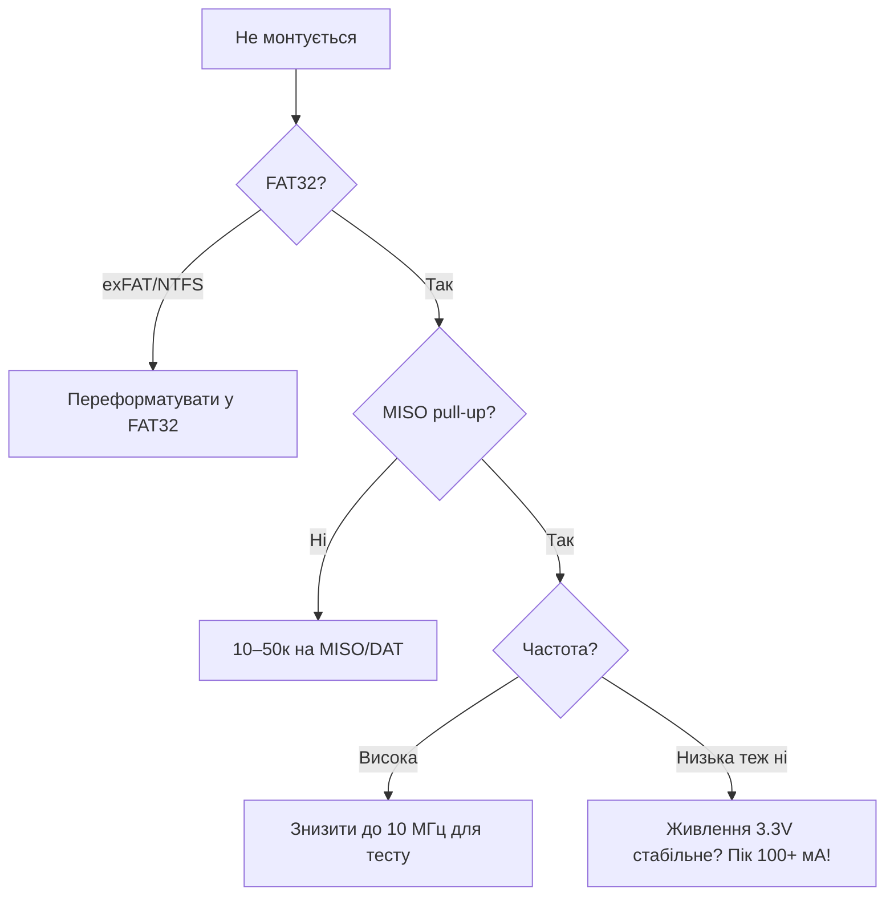

# SD карти - SPI vs SDMMC

![[assets/img/placeholder.png]]

Два режими: **SPI 1-біт** (простий, повільний) і **SDMMC 1/4-біт** (швидкий). Живлення - строго 3.3В, піки до 200 мА при записі.

> [!warning] Живлення 3.3В 200 мА
> Дешеві AMS1117 на DevKit просідають при записі SD + WiFi. Додай електроліт 100-470 мкФ біля слота, інакше - випадкові unmount.

## Призначення

SD карти - SPI vs SDMMC - Порівняння режимів; Піни SDMMC (default); Таблиця з'єднань - SPI SD-модуль. Два режими: SPI 1-біт (простий, повільний) і SDMMC 1/4-біт (швидкий). Живлення - строго 3.3В, піки до 200 мА при записі. Дешеві AMS1117 на DevKit просідають при записі SD + WiFi. Додай електроліт 100-470 мкФ біля слота, інакше - випадкові unmount.

## Порівняння режимів

| Режим | Швидкість | Піни | Коли |
| --- | --- | --- | --- |
| SPI | ~4-10 Мбіт/с | 4 (CLK/MISO/MOSI/CS) | просто, будь-які піни, дисплей на тій же шині |
| SDMMC 1-bit | ~20 Мбіт/с | 4 (CLK/CMD/D0 + GND) | швидше, фіксовані піни |
| SDMMC 4-bit | ~40+ Мбіт/с | 6 (CLK/CMD/D0-D3) | максимум, логер, камера |

## Піни SDMMC (default)

| Сигнал | GPIO | Примітка |
| --- | --- | --- |
| CLK | 6* / 14 | *6 - flash, тому ремап на 14 |
| CMD | 11* / 15 | ремап на 15 |
| D0 | 7* / 2 | ремап на 2 |
| D1/D2/D3 | - / 4,12,13 | тільки 4-bit |

Практично для SDMMC 1-bit бери: CLK=14, CMD=15, D0=2 (+ pull-up 10к на кожну лінію).

## Таблиця з'єднань - SPI SD-модуль

| ESP32 | SD-модуль SPI | Примітка |
| --- | --- | --- |
| GPIO18 | CLK | VSPI CLK |
| GPIO19 | MISO | + pull-up 10к |
| GPIO23 | MOSI | - |
| GPIO5 | CS | окремий CS |
| 3V3 | VCC | 3.3В, не 5В! |
| GND | GND | спільна |

## Код

**Arduino (SPI + FAT):**

```cpp
#include <SD.h>
#include <SPI.h>
void setup() {
  Serial.begin(115200);
  SPI.begin(18, 19, 23, 5);
  if (!SD.begin(5, SPI, 20000000)) Serial.println("mount fail");
  else Serial.println("mounted");
}
```

**ESP-IDF (SDMMC):**

```c
#include "esp_vfs_fat.h"
#include "sdmmc_cmd.h"
// host + slot_config для SDMMC 1-bit, mount /sdcard
// див. example sd_card/sdmmc
```

**MicroPython:**

```python
from machine import SPI, Pin
import sdcard, os
spi = SPI(2, baudrate=20000000, sck=Pin(18), mosi=Pin(23), miso=Pin(19))
os.mount(sdcard.SDCard(spi, Pin(5)), "/sd")
print(os.listdir("/sd"))
# LittleFS для internal: os.VfsLfs2.mkfs(bdev)
```

> [!info] FAT vs LittleFS
> SD - тільки FAT (сумісність з ПК). Внутрішній flash - [[08-Pamyat/02-Filesystem|LittleFS]] (стійка до збоїв живлення).

## Швидкості таблицею - SPI vs SDMMC детально

| Режим | Ширина | Клок SD | Теор. пік | Реальна (замір) | CPU-load |
| --- | --- | --- | --- | --- | --- |
| SPI | 1 біт | 20 МГц | 2.5 МБ/с | 0.5-1.2 МБ/с запис | високий (без DMA) |
| SDMMC 1-bit | 1 біт | 20 МГц | 2.5 МБ/с | ~1.5-2 МБ/с | низький (HW SDMMC) |
| SDMMC 4-bit | 4 біти | 20 МГц | 10 МБ/с | 4-8 МБ/с | низький |
| SDMMC 4-bit HS | 4 біти | 40 МГц | 20 МБ/с | 8-12 МБ/с (карта UHS-I) | низький |

Висновок: логер раз на секунду - вистачить SPI; камера / аудіо-потік / швидкий лог IMU - тільки SDMMC 4-bit.

SDMMC 4-bit піни (приклад ремапу, вільні від flash):

| Сигнал | GPIO | Pull-up | Коментар |
| --- | --- | --- | --- |
| CLK | 14 | - (push-pull) | series-R 33 Ом при довгій трасі |
| CMD | 15 | 10к | strapping! - перевір boot при підключеній карті |
| D0 | 2 | 10к | strapping! - карта всередині має pull-up ~50к, слабкий - додай 10к |
| D1 | 4 | 10к | тільки 4-bit |
| D2 | 12 | 10к | strapping VDD_SDIO! - найризикованіший пін SDMMC |
| D3 | 13 | 10к | тільки 4-bit |

> [!danger] SDMMC + strapping = подвійний ризик
> D2 на GPIO12 і CMD/D0 на 15/2 - це strapping-піни. Карта з власними pull-up може зірвати boot. Якщо плата іноді не стартує з вставленою картою - це воно. Лікування: буфер/ізоляція або повернення на SPI-режим. Див. [[03-GPIO/02-Strapping-pini|Strapping-піни]].

ESP-IDF SDMMC 4-bit mount:

```c
#include "esp_vfs_fat.h"
#include "sdmmc_cmd.h"
#include "driver/sdmmc_host.h"
void sdmmc_mount(void) {
    sdmmc_host_t host = SDMMC_HOST_DEFAULT();
    host.max_freq_khz = SDMMC_FREQ_HIGHSPEED;  // 40 МГц
    sdmmc_slot_config_t slot = SDMMC_SLOT_CONFIG_DEFAULT();
    slot.width = 4;
    slot.clk = 14; slot.cmd = 15; slot.d0 = 2; slot.d1 = 4; slot.d2 = 12; slot.d3 = 13;
    slot.flags |= SDMMC_SLOT_FLAG_INTERNAL_PULLUP;  // + зовнішні 10к!
    esp_vfs_fat_sdmmc_mount_config_t mc = {
        .format_if_mount_failed = false, .max_files = 5,
        .allocation_unit_size = 16 * 1024};
    sdmmc_card_t *card;
    esp_err_t r = esp_vfs_fat_sdmmc_mount("/sdcard", &host, &slot, &mc, &card);
    if (r == ESP_OK) sdmmc_card_print_info(stdout, card);
}
```

## FATFS-налаштування

| Параметр | Рекомендація | Чому |
| --- | --- | --- |
| `allocation_unit_size` | 16-32 КБ | великі кластери = швидкий послідовний запис логера |
| `max_files` | 3-5 | кожен відкритий файл = RAM (~500 Б + буфер) |
| `format_if_mount_failed` | **false** на бойових! | true зітре дані користувача при одному глюку живлення |
| Кодова сторінка | 1251/UTF-8 через `ffconf.h` | кирилиця в іменах файлів |
| `SDCARD_INTR` / DMA | увімкнено за замовчуванням у SDMMC | не вимикай без причини |
| flush-політика | `fflush` / `fsync` кожен N записів | баланс: знос vs втрата даних при знеструмленні |

Паттерн надійного логера (буфер + рідкісний flush):

```cpp
File log_;
unsigned long lastSync = 0;
void logLine(const String &s) {
  log_.println(s);  // RAM-буфер FATFS
  if (millis() - lastSync > 5000) { log_.flush(); lastSync = millis(); }
  // flush раз на 5 с: втрата максимум 5 с даних, зате карта живе роками
}
```

## Знос карт + wear-leveling

| Факт | Наслідок | Мітигація |
| --- | --- | --- |
| NAND-ресурс TLC-карт ~500-3000 циклів на блок | щосекундний rewrite одного файла вбиває блок за місяці | дописуй (append), а не перезаписуй; ротація файлів |
| Контролер карти сам робить wear-leveling, але тільки по записаних блоках | маленький файл що крутиться на місці - погано | файли ≥1 МБ, ротація `log_001.csv…` |
| Знеструмлення під час запису = битий FAT + втрачений кластер | «карта раптом RAW» | `flush()` періодично + конденсатор 470 мкФ + суперкап опц. |
| Дешеві no-name карти брешуть про flush | дані в кеші контролера губляться | бери SanDisk/Samsung Endurance для логерів |

Ротація файлів (приклад):

```cpp
void rotateIfBig(const char *path) {
  File f = SD.open(path);
  if (f && f.size() > 2 * 1024 * 1024UL) {  // >2 МБ — новий файл
    f.close();
    static int n = 0;
    char np[32]; snprintf(np, sizeof np, "/log_%03d.csv", ++n);
    SD.rename(path, np);
  } else if (f) f.close();
}
```

Внутрішній flash для частих малих записів - [[08-Pamyat/02-Filesystem|LittleFS]] (журнальована, стійка до обривів живлення), SD - для великих масивів.

## Фейкові SD (h2testw!)

| Ознака підробки | Перевірка |
| --- | --- |
| «128 ГБ» за ціною 16 ГБ | **h2testw** (Windows) або **F3** (`f3write/f3read`, Linux) - запис+читання всього обсягу |
| Запис обривається / швидкість падає до 1 МБ/с після N ГБ | реальний обсяг = N ГБ, решта - повітря (перезапис по колу) |
| Невідомий VID, кривий принт | `CID`-дамп через `sdmmc_card_print_info` / ChipGenius |
| Карта «губить» старі файли при записі нових | класика фейку: контролер перетер старе |

Процедура приймання карти:

1. `h2testw → Write+Verify` (або `f3write /mnt/sd && f3read /mnt/sd`) - годину часу, але рятує проєкт.
2. Тільки після `Test finished without errors` - ставити в логер.
3. Маркуй карти (дата, реальний обсяг) - не змішуй фейки з бойовими.

> [!warning] Фейкова карта + OTA/логи
> Симптоми «SD іноді mount fail, іноді файли нульові» на 90% - фейкова або вмираюча карта, а не баг коду. Перш ніж дебажити драйвер - проганяй h2testw/F3.

## Живлення 200 мА+

| Споживач | Пік | Зауваження |
| --- | --- | --- |
| SD-карта запис | 100-200 мА | короткі піки 2-5 мс |
| SD + WiFi TX одночасно | 300-450 мА сумарно | саме тут просідає AMS1117-клон |
| Конденсатор біля слота | 100-470 мкФ електроліт + 100 нФ кераміка | <10 мм від VCC слота |
| Живлення | строго 3.3В | 5В-модулі з AMS1117 на борту - живи модулем від 5В, а не карткою безпосередньо |

Ознаки голоду: `mount failed`, `sdmmc_read_blocks failed (0x107)`, випадковий unmount під час WiFi-активності. Лікування: товсті дроти живлення (не тонкі DuPont 30 см!), електроліт біля слота, окремий LDO для SD при паралельному WiFi. Див. [[02-Zhivlennya/01-Lancjugi-zhivlennya|Живлення]].

## SDIO tuning - вичавити максимум з 4-біт шини

| Ручка налаштування | Де крутити | Ефект | Ризик |
| --- | --- | --- | --- |
| `host.max_freq_khz = SDMMC_FREQ_HIGHSPEED` (40 МГц) | `sdmmc_host_t` | ×2 пропускна vs 20 МГц | потрібні короткі траси + добрі pull-up |
| `slot.width = 4` | `sdmmc_slot_config_t` | ×4 vs 1-bit | D1/D2/D3 розведені + strapping-ризик GPIO12! |
| `host.flags &= ~SDMMC_HOST_FLAG_DDR` | вимкення DDR | стабільність на довгих трасах | −30% піку на eMMC |
| Зовнішні pull-up 10к на CMD/D0-D3 | залізо | чисті фронти на 40 МГц | внутрішніх pull-up (~50к) НЕ вистачає! |
| Series-R 33 Ом на CLK | залізо | гасить дзвін | завелика R (100 Ом+) завалює фронт |
| `allocation_unit_size = 32-64 КБ` | mount-конфіг | швидкий послідовний запис | більше slack на малих файлах |
| DMA-буфер вирівняний на 4 байти, в DRAM | код | без тихих перезаписів | PSRAM-буфер = `ESP_ERR_INVALID_ARG` |

Покроковий тюнінг 4-bit HS:

1. Розведи CLK/CMD/D0-D3 зіркою від слота, довжини ±5 мм. CLK - з series-R 33 Ом біля ESP32.
2. Зовнішні 10к pull-up на CMD + D0-D3 (на CLK - НЕ ставити!).
3. Почни з `SDMMC_FREQ_DEFAULT` (20 МГц) + width 4 → стрес-тест (нижче).
4. Перейди на HIGHSPEED (40 МГц) → стрес-тест знову. Помилки CRC → назад на 20 МГц або вкороти траси.
5. `sdmmc_host_get_real_freq()` - перевір реальну частоту (дільник від 40 МГц дає не будь-яке значення!).

```c
#include "sdmmc_cmd.h"
#include "driver/sdmmc_host.h"
#include "esp_vfs_fat.h"
// Стрес-тест шини: 200 циклів запис-читання-перевірка блоками 4 КБ
bool sdmmc_stress(const char *path) {
  FILE *f = fopen(path, "wb");
  if (!f) return false;
  uint8_t w[4096], r[4096];
  for (int i = 0; i < 4096; i++) w[i] = (i * 7) & 0xFF;
  for (int k = 0; k < 200; k++) {
    if (fwrite(w, 1, sizeof w, f) != sizeof w) { fclose(f); return false; }
  }
  fclose(f);
  f = fopen(path, "rb");
  for (int k = 0; k < 200; k++) {
    if (fread(r, 1, sizeof r, f) != sizeof r) { fclose(f); return false; }
    if (memcmp(w, r, sizeof r)) { fclose(f); return false; }  // бій CRC/таймінгу!
  }
  fclose(f);
  return true;
}
```

> [!warning] ESP32 Classic НЕ підтримує input-delay tuning (`sdmmc_host_set_input_delay` → `ESP_ERR_NOT_SUPPORTED`)
> На S3/C6 є `sdmmc_delay_phase_t` / delay-line - підбери фазу семплу при 40 МГц, якщо CRC плаває. На Classic - тільки частота/траси/pull-up.

## Журналювання при втраті живлення - двопис + fsync-політика

Проблема: FAT на SD - не журнальована. Знеструмлення посеред запису = битий FAT + ланцюжок кластерів у нікуди + файл нульової довжини.

Архітектура «двопис» (write-ahead log):

```text
1. Готуєш запис у RAM-буфер (напр. 512 Б / 4 КБ).
2. Дописуєш буфер у WAL-файл (/sd/wal.bin) + fsync → дані вже на носії.
3. Оновлюєш основний файл/індекс + fsync.
4. Позначаєш WAL-запис як застосований (1 байт-флаг + fsync).
5. При старті: якщо WAL має незастосовані записи → replay (дописати в основний файл).
```

fsync-політика (баланс знос vs втрата):

| Політика | Втрата при знеструмленні | Знос карти | Коли |
| --- | --- | --- | --- |
| `fwrite` без flush, закриття раз на годину | до години даних | мінімальний | тестові дані, що відновлюються |
| `flush()` раз на 5 с (таймер) | ≤5 с | низький | логер погоди/трекер - **рекомендовано** |
| `fsync(fileno(f))` кожен запис | ≤1 запис | високий (FAT-таблиця переписується щоразу!) | гроші/лічильники/події безпеки |
| Двопис WAL + fsync кожен запис | 0 (replay при старті) | середній (WAL - послідовний, дешевий для NAND) | критичні дані на дешевій карті |

```cpp
// Надійний логер: буфер + WAL + періодичний fsync
#include <cstdio>
FILE *logF = nullptr, *walF = nullptr;
unsigned long lastSync = 0;
void log_init() {
  // replay незастосованого WAL:
  walF = fopen("/sd/wal.bin", "a+b");
  // ... прочитати незакриті записи, дописати в /sd/log.csv ...
  logF = fopen("/sd/log.csv", "a");
}
void log_line(const char *s) {
  fprintf(walF, "%s\n", s); fflush(walF);  // 1. WAL на носій
  fprintf(logF, "%s\n", s);                // 2. основний файл (буфер)
  if (millis() - lastSync > 5000) {        // 3. рідкісний дорогий fsync
    fflush(logF); fsync(fileno(logF)); fsync(fileno(walF));
    lastSync = millis();
  }
}
```

Залізний рівень захисту:

| Захід | Номінал | Що дає |
| --- | --- | --- |
| Електроліт біля слота | 470 мкФ + 100 нФ | ~5-10 мс на завершення сектора при обриві живлення |
| Суперкап 0.47 Ф через діод | на вхід LDO SD | секунди на коректне закриття файлів (детект падіння через ADC + компаратор!) |
| Детект падіння живлення | дільник Vin → ADC + поріг, або `BOD` | перервати цикл, зробити фінальний fsync, закрити файли |
| `format_if_mount_failed = false` | код | не затерти дані при одному глюку |

> [!danger] Дешеві карти брешуть про flush
> Контролер no-name карти підтверджує `fsync`, не дописавши дані в NAND (кеш без конденсатора). Єдиний захист - карти Endurance + двопис + суперкап. Для критичних застосувань - внутрішній [[08-Pamyat/02-Filesystem|LittleFS]] як первинний носій, SD - як копія.

## Wear-leveling алгоритми - як не вбити карту за місяць

| Рівень вирівнювання | Хто робить | Що вирівнює | Обмеження |
| --- | --- | --- | --- |
| Контролер карти (вбудований) | firmware карти | фізичні erase-блоки (~128-512 КБ) по всій NAND | працює тільки з блоками, що реально перезаписуються; статичні дані «прикипають» |
| Dynamic WL | дешеві карти | тільки гарячі блоки (таблиця FAT, голова лога) | холодні блоки зношуються окремо - карта вмирає нерівномірно |
| Static WL | добрі карти (Endurance, Industrial) | періодично мігрує і холодні дані | дорожче, але ресурс у рази вищий |
| Програмний (твій код) | ти | логіку запису: append + ротація + великі файли | компенсує слабкий контролер! |

Правила програмного WL:

1. **Тільки append.** Ніколи не перезаписуй ті ж байти (лічильник у заголовку файла - зло; лічильник - окремим дописом у WAL).
2. **Файли ≥1 МБ, ротація.** 100 файлів по 2 МБ краще, ніж 1 файл, що крутиться на місці.
3. **Вирівняй запис на erase-блок:** пиши кратно 4 КБ (сторінка) / 512 КБ (блок), уникай «хвостів» 100 байт щоразу в новому секторі.
4. **Рідкісний fsync FAT:** кожен fsync переписує FAT-таблицю (гарячий блок!). Буферизуй 5-60 с.
5. **Залишай 10-20% вільного місця:** контролеру потрібні вільні блоки для remap; забита під зав'язку карта вмирає в рази швидше.

Розрахунок ресурсу:

```text
Карта 16 ГБ TLC, ресурс ~1000 циклів → 16 ТБ сумарного запису (TBW).
Логер 1 КБ/с = 86 МБ/добу = 31 ГБ/рік → 16 ТБ / 31 ГБ ≈ 500 років. Наче вічна?
АЛЕ: write amplification ×10 (FAT-перезапис + маленькі записи + нема WL) → 50 років.
ЩЕ ГІРШЕ: щосекундний rewrite 512-байтного заголовка → один erase-блок 512КБ
перетирається щосекунди → 1000 циклів / 1 Гц ≈ 17 хвилин до смерті блока!
Тому: append + ротація перетворює "17 хвилин" назад у "десятиліття".
```

Карти A1/A2 для random-write (коли логер пише багато малих файлів/база SQLite):

| Клас | Random read | Random write | Послідовний мінімум | Коли брати |
| --- | --- | --- | --- | --- |
| Без класу / Class 10 | не нормований | ~10-50 IOPS | 10 МБ/с | тільки відео/фото потоком |
| **A1** | 1500 IOPS | 500 IOPS | 10 МБ/с | маленький random-лог, конфіги, SQLite-мале |
| **A2** | 4000 IOPS | 2000 IOPS | 10 МБ/с | активна БД на карті, кеш, черги повідомлень |

> [!warning] A2 на ESP32 не розкриється повністю
> A2 вимагає Command Queuing + Cache (SD 6.0 host). ESP32 SDMMC - без CQ, тому A2 працює як «швидка A1». Переплачувати за A2 має сенс тільки якщо карта потім переїде в Linux-хост. Для ESP32 бери **A1 Endurance** - оптимум ціна/ресурс.

## Швидкість запису - виміри таблицею

Заміри ESP32 Classic, карта SanDisk Ultra 16 ГБ A1, файли FAT32, блоки 4 КБ, `allocation_unit_size=32К`:

| Режим | Клок | Блоки 512 Б (random) | Послідовний запис | Послідовне читання | Обмеження |
| --- | --- | --- | --- | --- | --- |
| SPI 10 МГц | 10 МГц | ~80 КБ/с | ~400 КБ/с | ~600 КБ/с | CPU polling |
| SPI 20 МГц | 20 МГц | ~120 КБ/с | ~800 КБ/с | ~1.2 МБ/с | CPU + шлейф |
| SDMMC 1-bit 20 МГц | 20 МГц | ~300 КБ/с | ~1.5 МБ/с | ~2 МБ/с | ширина 1 біт |
| SDMMC 4-bit 20 МГц | 20 МГц | ~800 КБ/с | ~4 МБ/с | ~6 МБ/с | золота середина |
| SDMMC 4-bit 40 МГц HS | 40 МГц | ~1.2 МБ/с | ~8 МБ/с | ~10 МБ/с | карта UHS-I + короткі траси |

Бенчмарк-код (жени на своїй карті - розкид між брендами ×3!):

```cpp
#include <SD.h>
void sd_bench(const char *p = "/bench.bin") {
  const size_t N = 256 * 1024;  // 256 КБ
  uint8_t *b = (uint8_t *)malloc(4096);
  for (int i = 0; i < 4096; i++) b[i] = i & 0xFF;
  File f = SD.open(p, FILE_WRITE);
  unsigned long t = micros();
  for (size_t o = 0; o < N; o += 4096) f.write(b, 4096);
  f.flush();  // чесний замір з дописом на носій!
  unsigned long dt = micros() - t;
  f.close();
  Serial.printf("write %u KB in %lu us = %lu KB/s\n", N / 1024, dt, (N * 1000000UL / dt) / 1024);
  free(b);
}
```

> [!tip] Перший запис завжди повільніший
> Карта прокидається (ініціалізація NAND-каналу). Грій карту 1-2 циклами перед замиром і перед відповідальним логом після довгого сну.

| Забита під зав'язку (>95%) | швидка смерть (немає блоків для remap) | тримай 10-20% вільними, монітор через `statvfs` |

> [!tip] Моніторинг вільного місця в коді
> Раз на добу перевіряй `esp_vfs_fat_info()` / `statvfs("/sdcard")`: вільне <15% → ротація старих файлів + тривога в телеметрію. Переповнена карта в полі = зупинений логер + ризик битого FAT. Див. [[08-Pamyat/02-Filesystem|LittleFS]] для внутрішнього резерву.

## Офіційні джерела Espressif

- ESP-IDF Programming Guide - SDMMC Host Driver (sdmmc_host_init, width/freq, DDR, UHS-I), SD SPI Host Driver, SD Pull-up Requirements (зовнішні pull-up обов'язкові!).
- ESP-IDF Programming Guide - FATFS (allocation_unit_size, max_files, flush-політика), VFS.
- ESP-IDF examples: storage/sd_card (sdmmc + spi), storage/wear_levelling.
- SD Association - Physical Layer Simplified Specification: speed classes, A1/A2 IOPS-вимоги.
- SanDisk/Samsung Endurance whitepapers - TBW, static vs dynamic wear-leveling.

### Mermaid: карта не монтується



## Типові помилки

| # | Помилка | Чому погано | Як правильно |
| --- | --- | --- | --- |
| 1 | exFAT на ESP32 | Драйвер хоче FAT | FAT32 (SD ≤32 ГБ) |
| 2 | Без pull-up на DAT | Плаваючі лінії в idle | Pull-up на MISO/DAT0-3 |
| 3 | 1-біт vs 4-біт плутанина | Швидкість/піни | 1-біт для старту, 4-біт для швидкості |
| 4 | Слабке 3.3V | Просадка при записі | Окремий LDO/конденсатор 100 мкФ |
| 5 | Карта «ноунейм» 128 ГБ | Фейкова ємність, биті FS | Бренд + тест H2testw |

## Див. також

- [[Home]]
- [[01-Hardware/01-ESP32-Classic]]
- [[04-Shini/02-SPI|SPI]]
- [[08-Pamyat/02-Filesystem|LittleFS]]
- [[08-Pamyat/01-Partitions-NVS|Flash розмітка]]
- [[02-Zhivlennya/01-Lancjugi-zhivlennya|Живлення]]
- [[08-Pamyat/02-Filesystem|Логування даних]]
