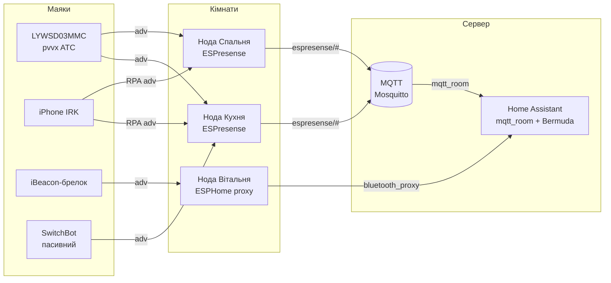

# BLE-шлюз і трекер присутності - ESP32 як BLE→MQTT-шлюз

База: [[05-Radio/02-BLE-Bluetooth|BLE/Bluetooth]], меш і звук: [[05-Radio/05-BLE-Mesh-A2DP-HID|BLE Mesh / A2DP / HID]], старт [[Home]].

## Призначення

ESP32 як **BLE→MQTT-шлюз** - це міст між світом батарейних BLE-маяків і сенсорів та світом Home Assistant / хмари. ESP32 слухає advertising-пакети, декодує їх (температура, вологість, батарея, MAC, RSSI) і публікує в MQTT-брокер, звідки їх забирають Home Assistant (`mqtt_room`, BLE Monitor, BTHome), Node-RED або власний пайплайн.

Три типові ролі шлюзу:

- **Сенсорний шлюз** - збирає дані з Xiaomi LYWSD03MMC / CGG1 / CGDK2 / Qingping / SwitchBot і публікує телеметрію (`home/ble/a4c138XXXXXX {t, h, batt, rssi}`). Один ESP32 покриває квартиру.
- **Трекер присутності (room presence)** - кілька ESP32-нод по кімнатах міряють RSSI одного маяка (телефон, брелок, годинник) і вирішують, у якій кімнаті людина. Стек: **ESPresense** (прошивка ноди + MQTT) або **Bermuda** (ESPHome bluetooth_proxy + HA-інтеграція).
- **Лічильник / детектор** - рахує людей за кількістю BLE-fingerprint без ідентифікації (магазин, офіс, `count_ids` в ESPresense).

Коли що брати: 1-2 сенсори в кімнаті - сенсорний шлюз своїм кодом; трекінг людей по кімнатах - ESPresense (`mqtt_room`) або Bermuda (якщо вже є ESPHome-проксі); пасивні сенсори Xiaomi без прошивки шлюзу - HA BLE Monitor / BTHome.

![[assets/img/ble-gateway-tracker-scheme.png|600]]
*Рис. ESP32-ноди в кімнатах слухають BLE-маяки, публікують RSSI/телеметрію в MQTT, Home Assistant вирішує кімнату (mqtt_room / Bermuda).*

### ASCII-схема

```text
КІМНАТА 1 (кухня)          КІМНАТА 2 (спальня)         ХМАРА / HA
┌─────────────────┐        ┌─────────────────┐
│ ESP32-нода      │        │ ESP32-нода      │
│ BLE scan (pass) │        │ BLE scan (pass) │
│  + WiFi/MQTT    │        │  + WiFi/MQTT    │
└───────┬─────────┘        └────────┬────────┘
        │ espresense/devices/XXX/kitchen {"distance":1.2,"rssi":-61}
        │ espresense/devices/XXX/bedroom {"distance":4.8,"rssi":-79}
        └──────────────┬───────────────────┘
                       ▼
              ┌─────────────────┐
              │ MQTT-брокер     │  Mosquitto (1883, LWT, retain)
              │ espresense/#    │
              │ home/ble/#      │
              └────────┬────────┘
                       ▼
              ┌─────────────────┐
              │ Home Assistant  │
              │ mqtt_room /     │
              │ Bermuda /       │
              │ BLE Monitor     │──► автоматизації, графіки
              └─────────────────┘

МАЯКИ (периферія, тільки advertise, без з'єднання):
  LYWSD03MMC+pvvx ──ATC/BTHome adv──► нода (пасивно, батарея рік+)
  iPhone (IRK) ──RPA adv──► ESPresense enroll ──► irk:XXXX (стабільний id)
  MiBand / брелок iBeacon ──UUID/major/minor──► Bermuda area-sensor
```

### Mermaid



## Архітектура BLE→MQTT-шлюзу

| Шар | Компонент | Варіанти | Коментар |
| --- | --- | --- | --- |
| Периферія | BLE-маяк / сенсор | LYWSD03MMC, CGG1, CGDK2, Qingping, SwitchBot, iBeacon-брелок, телефон | тільки advertising, без з'єднання - батарея живе роками |
| Радіо | ESP32-сканер | ESP32 Classic / S3 / C3 | антена важливіша за чіп; зовнішня антена +3-6 дБ |
| Скан | BLE-стек | NimBLE (легкий) / Bluedroid | за замовчуванням NimBLE; active лише за потреби |
| Транспорт | WiFi + MQTT | Mosquitto, `espresense/#`, `home/ble/#` | retain для статусу, LWT `offline`, QoS 0 для телеметрії |
| Споживач | Home Assistant | `mqtt_room`, Bermuda, BLE Monitor, BTHome | один брокер - кілька споживачів одночасно |
| Опційно | Фільтр/агрегація | dedup за MAC, медіана RSSI, skip_ms | ріже MQTT-трафік у 5-10 разів |

| Топологія | Скільки нод | Точність | Коли |
| --- | --- | --- | --- |
| 1 шлюз на квартиру | 1 | кімната невідома, лише «вдома/немає» | сенсори температури |
| 1 нода на кімнату (ESPresense `mqtt_room`) | 3-6 | рівень кімнати, стабільно | світло/клімат за присутністю |
| Щільна сітка (Companion, 5-8 на поверх) | 8+ | координати X,Y на плані | карта переміщень, складно |
| ESPHome-проксі + Bermuda | стільки ж, скільки ESPHome | рівень кімнати (area) + дистанція | вже є ESPHome-зоопарк |

Правила архітектури: нода - дурна (сканує і публікує), рішення - на сервері (HA обирає найближчу кімнату); топіки ієрархічні (`espresense/devices/<id>/<room>`); статус ноди - retained LWT; телеметрія сенсорів - non-retained, інакше брокер заб'ється.

## Active vs passive scanning - ціна батареї маяків

| Параметр | Passive scanning | Active scanning |
| --- | --- | --- |
| Що робить сканер | тільки слухає advertising-канали 37/38/39 | після adv шле SCAN_REQ, чекає SCAN_RSP |
| Що робить маяк | шле adv і спить | мусить прокинутись і відповісти другим пакетом |
| Струм маяка (CR2032) | ~14-21 мкА (рік-два) | +30-100% до споживання, соотв. менше життя |
| Дані | adv-payload (до 31 Б, ext - більше) | + scan-response (ім'я, повний UUID-список) |
| Потрібен коли | сенсори pvvx/ATC/BTHome, iBeacon, трекінг за MAC | первинне додавання пристрою в HA, ім'я невідоме |
| ESPHome | `esp32_ble_tracker: scan_parameters: active: false` | `active: true` (дефолт!) - поміняй свідомо |
| ESPresense | дефолт пасивний; `query` - точковий active | `query: "flora:"` - active лише для цих префіксів |
| Bermuda/проксі | пасивно достатньо для роботи | active лише щоб «побачити імена» нових пристроїв |

> [!warning] Active-скан садить батареї всім маякам навколо
> Постійний active-scan змушує відповідати КОЖЕН BLE-пристрій у радіусі - включно з сусідськими. Для цілодобової роботи став пасивний скан, active вмикай на 5-10 хвилин лише коли додаєш новий пристрій. Виняток - ESPresense `query`-список: там active-з'єднання точкові, лише до своїх сенсорів (Mi Flora).

| Маяк | Пасивний adv-інтервал | Життя батареї | Що вбиває батарею |
| --- | --- | --- | --- |
| LYWSD03MMC + pvvx (2.5 с) | 2.5 с | CR2032 > 1 рік | active-скан поруч, інтервал < 1 с, екран-цикл |
| CGG1 / CGDK2 + pvvx | 2.5-5 с | CR2450 1.5-2 роки | connect_latency > 1000 мс на слабкому живленні |
| iBeacon-брелок (100 мс) | 100 мс | CR2032 ~6-9 міс | інтервал 100 мс - ціна швидкого знаходження |
| Телефон (HA BLE Transmitter) | ~200-500 мс | −2-5% батареї/день | фоновий adv + IRK-обертання |

## ESPresense - room presence, кілька нод, triangulation

ESPresense - прошивка ESP32-ноди: сканує BLE, рахує дистанцію за RSSI, публікує в MQTT. Home Assistant інтеграцією `mqtt_room` обирає кімнату з мінімальною дистанцією. Калібрування обов'язкове, інакше «15 метрів до телефону поруч».

| Елемент | Значення | Приклад |
| --- | --- | --- |
| Топік статусу | `espresense/rooms/<room>/status` | `online` / `offline` (LWT, retained) |
| Телеметрія | `espresense/rooms/<room>/telemetry` | `{"uptime":12345,"freeHeap":180000}` |
| Пристрій | `espresense/devices/<id>/<room>` | `{"id":"apple:1007:11-12","distance":1.8,"rssi":-63}` |
| Налаштування | `espresense/rooms/<room>/<key>/set` | `max_distance/set → "10.0"` |
| Флот | `espresense/rooms/*/<key>/set` (retain) | розкотити `absorption` на всі ноди |
| `mqtt_room` сенсор | `state_topic: espresense/devices/<id>` | найближча кімната = стан сенсора |

| Налаштування ESPresense | Дефолт | Що крутити |
| --- | --- | --- |
| `max_distance` | 16.0 м | 8-12 м для квартири, інакше чіпляє сусідів |
| `absorption` (фактор n) | 2.7 | 2.0 (open space) … 3.5 (бетонні стіни) |
| `ref_rssi` / `tx_ref_rssi` | −65 / −59 | калібрувати телефоном на 1 м (див. нижче) |
| `rx_adj_rssi` | 0 (S3 bare - 20) | поправка слабкої антени конкретної плати |
| `skip_ms` / `skip_distance` | 5000 мс / 0.5 м | ріжуть MQTT-шум: не слати, якщо не рухалось |
| `forget_ms` | 150000 мс | коли забути маяк (тільки reboot-настройка) |
| `include` / `exclude` | "" | allow-list `apple: iBeacon: known:` - ріже чужі |
| `query` | "" | `flora:` - active-дозапит лише для своїх |
| `count_ids` | "" | `exp:20` - лічильник без ідентифікації |

`mqtt_room` в `configuration.yaml` (один запис на трекінговий пристрій):

```yaml
sensor:
  - platform: mqtt_room
    device_id: "apple:1007:11-12"
    name: "Dan phone room"
    state_topic: "espresense/devices/apple:1007:11-12"
    timeout: 10
    away_timeout: 120
```

| Підхід | Ноди | Точність | Коментар |
| --- | --- | --- | --- |
| `mqtt_room` | 1 на кімнату | кімната | простий, стабільний, рекомендований старт |
| Companion | 5-8 на поверх + план | X,Y координати | точніше, але калібрування - дні; більше нод ≠ краще для `mqtt_room` |
| Трилатерація вручну | 3+ з відомими координатами | перетин кіл | іграшка: RSSI-шум ±3-5 дБ вбиває геометрію без фільтрів |

> [!tip] IRK-enrollment для iPhone
> iOS ротує MAC (RPA), тому за MAC трекати не можна. ESPresense вміє enrollment: нода входить у режим enroll на 2 хв (`enroll/set`), читає Identity Resolving Key телефона і далі впізнає його під будь-яким випадковим MAC як стабільний `irk:XXXX`. IRK синхронізується між нодами через брокер - робити один раз на телефон, не на кімнату.

## Bermuda - HA custom component

Bermuda - інша філософія: ноди лишаються ESPHome `bluetooth_proxy`, а вся логіка - в Home Assistant як custom integration (HACS). Нічого не прошиваєш окремо, якщо ESPHome-проксі вже стоять.

| Параметр | ESPresense | Bermuda |
| --- | --- | --- |
| Прошивка нод | своя (ESPresense) | ESPHome `bluetooth_proxy` (твої ж проксі) |
| Логіка | на ноді (дистанція) + `mqtt_room` | в HA (area + distance сенсори) |
| Транспорт | MQTT | HA Bluetooth backend (проксі → HA безпосередньо) |
| iPhone з RPA | IRK-enrollment вузлом | Private BLE Device core + IRK в HA |
| Трилатерація | Companion (окремий сервіс) | «eventually» - зараз найближча area |
| Коли брати | чистий трекінг, немає ESPHome | вже є ESPHome-зоопарк, не хочеш MQTT-шар |

| Сутність Bermuda | Що показує |
| --- | --- |
| `device_tracker.X` | `home` / `not_home` (можна прив'язати до Person) |
| `sensor.X_area` | ім'я Area найближчого проксі (кімната!) |
| `sensor.X_area_distance` | оцінка метрів до найближчого проксі |
| `bermuda.dump_devices` | JSON-дамп усіх дистанцій до всіх проксі (для шаблонів і налагодження) |

Вимоги Bermuda: проксі призначені в Area в HA (пріоритет - Area Bluetooth-запису пристрою, fallback - Area ESPHome-пристрою); телефони - через BLE Transmitter companion-застосунку або Private BLE Device; USB-BT адаптер на хості - лише для «вдома/немає», без міток часу пакетів.

## Xiaomi LYWSD03MMC + прошивка pvvx ATC

Стокова прошивка Xiaomi говорить зашифрованим MiBeacon і вимагає bindkey + активне з'єднання. Кастомна **pvvx ATC_MiThermometer** (форк atc1441) перетворює термометр на пасивний маяк: температура/вологість/батарея прямо в advertising, читається без з'єднання, батарея живе рік+.

| Прошивка | Формати advertising | Шифрування | HA-підтримка |
| --- | --- | --- | --- |
| Сток Xiaomi | MiBeacon `0xFE95` | так (bindkey обов'язковий) | Xiaomi BLE / BLE Monitor з bindkey |
| atc1441 ATC | ATC custom / «Mi Like» | ні | ESPHome `atc_mithermometer`, OpenMQTTGateway |
| pvvx ATC | Xiaomi, **ATC**, **Custom**, **BTHome v2** + encrypted-опції | опційно (bindkey/PIN) | BTHome, BLE Monitor, ESPHome - бери BTHome v2 |

| Формат pvvx | UUID | Що всередині | Розмір |
| --- | --- | --- | --- |
| ATC1441 | `0x181A` | T×0.1 °C, H×1%, batt% | 16 Б |
| Custom (pvvx ext) | `0x181A` | MAC + T×0.01 + H×0.01 + batt мВ + batt% + лічильник + flags | 19 Б |
| BTHome v2 (рекомендовано) | `0xFCD2` | TLV-об'єкти (T, H, batt - кожен свій тип) | змінний |
| MiBeacon | `0xFE95` | frame `0x0D` (T/H), `0x0A` (batt) | змінний, може шифруватись |

Прошивка: браузер Chrome/Edge → [TelinkMiFlasher](https://pvvx.github.io/ATC_MiThermometer/TelinkMiFlasher.html) → Connect → LYWSD03MMC → Do Activation → Custom Firmware → Start Flashing. OTA без розкриття корпусу; назад на сток - тим же флешером. Увага: HW B1.5/B1.6 після 03.2025 - гірший дисплей і більше споживання, для закупівлі шукай B1.4/B1.7/B1.9/B2.0.

### Bindkey: формат advertising і розшифровка

| Поле MiBeacon-заголовка | Байти | Значення |
| --- | --- | --- |
| Company | `0x1695` (LE) | Xiaomi |
| Frame counter | 2 Б | монотонний, захист від реплею |
| MAC | 6 Б | адреса термометра |
| Capability | 1 Б | біт шифрування |
| Event ID | 2 Б (`0x0D` T/H, `0x0A` batt) | що за дані |
| Payload | N Б | відкрито або AES-CCM |

Зашифрований MiBeacon = AES-128-CCM: ключ = **bindkey** (16 Б, hex), nonce = MAC + frame counter + event. Розшифровка на шлюзі: взяти bindkey (дістати з Mi Home через token-extractor або Xiaomi Cloud Tokens Extractor ДО перепрошивки!), зібрати nonce, викликати AES-CCM-decrypt, перевірити MIC. Саме тому правило: **спочатку bindkey - потім flash**. Після pvvx у форматі BTHome/ATC шифрування можна вимкнути взагалі - і bindkey не потрібен.

Де взяти bindkey: зареєструвати термометр у Mi Home на СТОКОВІЙ прошивці → витягти bindkey/token extractor-утилітою → зберегти в менеджер паролів → прошити pvvx → або відновити bindkey у конфігу pvvx (режим MIJIA encrypted), або перейти на відкритий BTHome.

## Декодери ATC1441 / CGG1 / CGDK2 / JTYJGD03MJ

| Модель | Залізо | pvvx-прошивка | Декодер ESPHome | Нотатка |
| --- | --- | --- | --- | --- |
| Xiaomi LYWSD03MMC | TLSR8251 + SHTCx | `ATC_vNN.bin` | `atc_mithermometer` / `bthome` | наймасовіший; дивись HW-ревізію |
| Xiaomi MHO-C401 | E-ink + TLSR | `MHO_C401_vNN.bin` | `bthome` | великий екран, CR2450 |
| Qingping CGG1-M | E-ink круглий | `CGG1_vNN.bin` | `bthome` / `xiaomi_cgg1` | кнопка ззаду: тримати 2 с для pairing |
| Qingping CGDK2 Lite | E-ink прямокутний | `CGDK2_vNN.bin` | `bthome` | Lite-версія, дешевша |
| Xiaomi MJWSD05MMC | великий дисплей | `BTH_vNN.bin` | `bthome` | дві кнопки; скидання - обидві разом |
| Xiaomi JTYJGD03MJ (clock) | годинник+термометр | частково / сток MiBeacon | `xiaomi_miscale`-сімейство / BLE Monitor | якщо немає pvvx - тільки з bindkey |

Приклад декодера ATC-custom (little-endian, UUID `0x181A`, 19 Б): `MAC[6] | int16 T×100 | uint16 H×100 | uint16 batt_mV | uint8 batt% | uint8 counter | uint8 flags`. Flags: біт0 - геркон/P9, біт3 - тригер температури, біт4 - тригер вологості. Лічильник кадрів - детектор втрачених пакетів (дірка в послідовності = глушіння/дальність).

## Qingping / SwitchBot - пасивне слухання

| Пристрій | Формат | Чи треба з'єднання | Інтеграція |
| --- | --- | --- | --- |
| Qingping CGG1/CGDK2 сток | MiBeacon | так (або bindkey) | BLE Monitor з bindkey |
| Qingping + pvvx BTHome | BTHome v2 | ні | BTHome / ESPHome безпосередньо |
| SwitchBot Meter / Contact / Motion | свій adv (незашифрований сервісний) | ні для сенсорів | HA SwitchBot (Bluetooth) / ESPHome |
| SwitchBot Bot/Curtain (керування!) | потрібен GATT-write | ТАК (active connection) | слот `connection_slots`, не пасивно |

Правило: сенсори-«гов پیگیری» (температура, контакт, рух) - пасивно; виконавчі (Bot натискає кнопку, Curtain їде) - active-з'єднання через проксі зі слотом. Не вішай керування шторами на перевантажену ноду-трекер - заведи окремий проксі поруч.

## HA BLE Monitor інтеграція

BLE Monitor - HACS-кастом для пасивного моніторингу десятків брендів (Xiaomi, ATC, Qingping, SwitchBot, Govee, Ruuvitag…). Працює на хості HA з USB-BT або (обмежено) через форвард.

| Параметр | Значення |
| --- | --- |
| Установка | HACS → `custom-components/ble_monitor` → restart HA |
| Радіо | USB BT5.0+ на хості (рекомендовано USB2.0 HS, інакше пропуски) |
| ESPHome-проксі | НЕ форвардять у BLE Monitor (архітектурно!) - або USB-адаптер, або ESPHome-сенсори безпосередньо |
| Трекінг | static MAC або UUID (iBeacon) |
| Trend | HA 2022.8+ виносить бренди в core (BTHome, Xiaomi BLE…) - нові сетапи починай з core, BLE Monitor - для екзотики |

> [!warning] SSD-знос від Bluetooth на хості
> pvvx попереджає: десятки BLE-пристроїв + BlueZ пишуть дрібні файли в `/var/lib/bluetooth/` безперервно - SSD 256 ГБ вистачає ~на 2 роки. Для великого флоту винось скан на ESP32-ноди (ESPresense/ESPHome), а хост лиши споживачем MQTT.

## Фільтр дублікатів + RSSI-калібрування відстані

Без фільтра одна нода шле 5-20 MQTT-повідомлень/сек з одного маяка. З фільтром - 1 повідомлення на рух.

| Прийом | Реалізація | Ефект |
| --- | --- | --- |
| Dedup за MAC+slot | ігнорувати той же MAC < 5 с (`skip_ms`) | −80% трафіку |
| Поріг руху | слати лише якщо Δdistance > 0.5 м (`skip_distance`) | тиша коли лежить |
| Медіана RSSI (вікно 5-10) | відкидає викиди −95 дБм між −60 | стабільна дистанція |
| 1Euro / Kalman | згладжування ESPresense | менше стрибків кімнати |
| `max_distance` cutoff | відкинути все далі 10-16 м | не чіпляє сусідів/вулицю |
| `include/exclude` | allow-list своїх префіксів | ігнор чужих зубних щіток |
| Дільник звітів | великі рухи - частіше (`max_divisor`) | швидка реакція без спаму в спокої |

### Формула дистанції (log-distance path loss)

```text
d = 10 ^ ((TxPower - RSSI) / (10 * n))

де:  TxPower — RSSI на 1 м (калібрується, типово -59..-65 дБм)
     RSSI    — виміряний рівень (дБм, від'ємний)
     n       — фактор поглинання (absorption): 2.0 open space … 3.5 бетон
```

Приклад: TxPower = −59, RSSI = −71, n = 2.7 → d = 10^((−59+71)/(27)) = 10^(12/27) ≈ 2.78 м.

| Середовище | n (absorption) | TxPower@1м | Коментар |
| --- | --- | --- | --- |
| Open space / коридор | 2.0-2.2 | −59 | ідеальний випадок |
| Квартира, гіпсокартон | 2.5-2.7 (дефолт ESPresense) | −59…−62 | стартова точка |
| Бетонні стіни | 3.0-3.5 | −62…−65 | стіна ≈ −10…−15 дБ |
| Людина між маяком і нодою | +n 0.3-0.5 | - | тіло - мішок води 2.4 ГГц |
| Металевий холодильник/шафа | глушить повністю | - | ноду не ставити за холодильником |

Калібрування за 5 хвилин: поклади телефон/маяк рівно на 1 м від ноди прямою видимістю → запиши середній RSSI за 30 с → впиши в `tx_ref_rssi` (`ref_rssi`); повтори для кожної ноди (антени різні!); потім пройдись квартирою і підкрути `absorption` так, щоб сусідня кімната давала правдоподібні 4-8 м. Без цього - «кімната стрибає».

## Код - шлюз у трьох фреймворках

**ESP-IDF (NimBLE, пасивний скан + dedup + MQTT):**

```c
// NimBLE passive scan + MQTT publish. menuconfig: NimBLE + WiFi + esp-mqtt.
#include "nimble/nimble_port.h"
#include "nimble/nimble_port_freertos.h"
#include "host/ble_hs.h"
#include "host/util/ble_scan.h"
#include "mqtt_client.h"

static esp_mqtt_client_handle_t mqtt;
static int64_t last_pub[16]; // примітивний dedup за молодшими байтами MAC

static int gap_event(struct ble_gap_event *ev, void *arg)
{
    if (ev->type == BLE_GAP_EVENT_DISC) {
        // фільтр: тільки Xiaomi/ATC/BTHome за AD-структурами
        struct ble_hs_adv_fields f;
        if (ble_hs_adv_parse_fields(&ev->disc.data, &f) != 0) return 0;
        // dedup: не частіше 1 разу на 5 с на слот
        int slot = ev->disc.addr.val[0] % 16;
        int64_t now = esp_timer_get_time() / 1000;
        if (now - last_pub[slot] < 5000) return 0;
        last_pub[slot] = now;
        // дистанція за формулою log-distance
        int rssi = ev->disc.rssi;
        float d = powf(10.0f, ((-59 - rssi) / (10.0f * 2.7f)));
        char topic[64], payload[128];
        snprintf(topic, sizeof(topic), "home/ble/%02X%02X%02X%02X%02X%02X",
                 ev->disc.addr.val[5], ev->disc.addr.val[4], ev->disc.addr.val[3],
                 ev->disc.addr.val[2], ev->disc.addr.val[1], ev->disc.addr.val[0]);
        snprintf(payload, sizeof(payload),
                 "{\"rssi\":%d,\"distance\":%.2f}", rssi, d);
        esp_mqtt_client_publish(mqtt, topic, payload, 0, 0, 0);
    }
    return 0;
}

void app_main(void)
{
    // ... init NVS, WiFi, MQTT (mqtt=tcp://broker:1883, LWT home/gateway/status)
    nimble_port_init();
    ble_hs_cfg.store_status_cb = NULL;
    nimble_port_freertos_init(NULL);
    // пасивний скан: дуплексно з WiFi, не садить батареї маяків
    struct ble_gap_disc_params p = {
        .passive = 1, .itvl = 0, .window = 0, .filter_policy = 0,
    };
    ble_gap_disc(0, BLE_HS_FOREVER, &p, gap_event, NULL);
}
```

**Arduino (NimBLE пасивний скан + PubSubClient):**

```cpp
#include <NimBLEDevice.h>
#include <WiFi.h>
#include <PubSubClient.h>

WiFiClient esp; PubSubClient mqtt(esp);
static uint32_t lastSeen[256]; // dedup за молодшим байтом MAC

class AdvCB : public NimBLEAdvertisedDeviceCallbacks {
  void onResult(NimBLEAdvertisedDevice* d) override {
    uint8_t slot = d->getAddress().getNative()[0];
    if (millis() - lastSeen[slot] < 5000) return; // skip_ms
    lastSeen[slot] = millis();
    int rssi = d->getRSSI();
    float dist = pow(10.0, ((-59 - rssi) / (10.0 * 2.7)));
    // ATC-декодер: service UUID 0x181A, 16 байт
    String extra = "";
    if (d->haveServiceUUID() && d->getServiceUUID().toString() == "181a") {
      std::string s = d->getServiceData().toString();
      if (s.length() >= 15) {
        int16_t t = (int16_t)(s[10] | (s[11] << 8)); // T x0.1 (LE)
        extra = ",\"temp\":" + String(t / 10.0, 1);
      }
    }
    char topic[48], payload[128];
    snprintf(topic, sizeof(topic), "home/ble/%s",
             d->getAddress().toString().c_str());
    snprintf(payload, sizeof(payload),
             "{\"rssi\":%d,\"distance\":%.2f%s}", rssi, dist, extra.c_str());
    mqtt.publish(topic, payload);
  }
};

void setup() {
  WiFi.begin("SSID", "PASS");
  mqtt.setServer("192.168.1.5", 1883);
  NimBLEDevice::init("ble-gateway");
  auto* scan = NimBLEDevice::getScan();
  scan->setAdvertisedDeviceCallbacks(new AdvCB());
  scan->setActiveScan(false);   // ПАСИВНИЙ! батареї маяків цілі
  scan->setInterval(100); scan->setWindow(99);
  scan->start(0, nullptr, false); // forever, без дублювань у стек
}
void loop() {
  if (!mqtt.connected()) mqtt.connect("ble-gw1", nullptr, nullptr,
      "home/gateway/status", 1, true, "offline");
  mqtt.loop();
}
```

**MicroPython (aioble пасивний скан + umqtt):**

```python
import bluetooth, time, math
from umqtt.simple import MQTTClient

ble = bluetooth.BLE()
ble.active(True)
mq = MQTTClient("ble-gw1", "192.168.1.5")
mq.connect()
last = {}

TX, N = -59, 2.7  # калібрування: TxPower@1м, absorption

def dist(rssi):
    return 10 ** ((TX - rssi) / (10 * N))

def irq(ev, data):
    if ev == 5:  # _IRQ_SCAN_RESULT
        addr_t, addr, adv_t, rssi, adv = data
        mac = ":".join("%02X" % b for b in reversed(bytes(addr)))
        now = time.ticks_ms()
        if time.ticks_diff(now, last.get(mac, 0)) < 5000:
            return  # dedup 5 c
        last[mac] = now
        # ATC service data 0x181A шукаємо в adv (спрощено: сирі байти)
        print(mac, rssi, round(dist(rssi), 2))
        mq.publish("home/ble/" + mac.replace(":", ""),
                   '{"rssi":%d,"distance":%.2f}' % (rssi, dist(rssi)))

ble.irq(irq)
ble.gap_scan(0, 100000, 100000, False)  # passive! (active=False)
while True:
    mq.check_msg()
    time.sleep(1)
```

Перевірка: `mosquitto_sub -v -t "home/ble/#"` → піднеси термометр до ноди → RSSI росте (−50 поруч, −80 за стіною); `mosquitto_sub -v -t "espresense/#"` → JSON з `distance` на кожну ноду.

## Типові помилки

| Симптом | Причина | Лікування |
| --- | --- | --- |
| Нода бачить 200 пристроїв, MQTT завалений | немає `include`/dedup, шле все підряд | `include: "apple: known: iBeacon:"` + `skip_ms 5000` + `max_distance 10` |
| Кімната стрибає між двома нодами | не калібровано `tx_ref_rssi`/`absorption`, антени різні | калібрувати кожну ноду на 1 м, підкрутити absorption 2.0-3.5 |
| iPhone трекається хвилину і зникає | RPA-ротація MAC без IRK-enrollment | enroll IRK один раз, трекати `irk:XXXX`, не MAC |
| LYWSD03MMC не декодується | стокова прошивка + немає bindkey | витягти bindkey ДО flash або прошити pvvx + BTHome |
| pvvx не прошивається | сівша батарея < 40%, новий HW B1.5/B1.6 | нова CR2032, перевірити HW-ревізію, TelinkMiFlasher з Chrome |
| Bermuda показує «not_home» хоча телефон поруч | проксі не в Area / не той Area-запис | Area ставити на Bluetooth-запис проксі, не лише ESPHome |
| ESPHome-проксі гріється / рве WiFi | aggressive scan interval+window, active scan | дефолтні scan-параметри, passive, esp-idf framework |
| Active-скан «з'їв» батареї сенсорів за місяць | цілодобовий active scan | passive за замовчуванням, active на 10 хв для додавання |
| BLE Monitor мовчить з ESPHome-проксі | проксі не форвардять у BLE Monitor архітектурно | USB-BT на хості або ESPHome-сенсор безпосередньо |
| Дистанція «15 м» до телефону поруч | `absorption` малий / `tx_ref_rssi` чужий | калібрування 1 м + absorption під стіни |
| Дубльовані сутності в HA | одночасно BLE Monitor + core BTHome слухають те саме | обрати один стек, другий вимкнути |
| Нода offline після перезавантаження роутера | немає reconect / captive portal таймаут | `wifi_timeout -1` (чекати вічно), LWT-моніторинг, watchdog |

> [!tip] Чек-лист «не працює трекінг»
>
> 1. Нода online? (`espresense/rooms/<room>/status`). 2. Маяк видно в `mosquitto_sub -v -t "espresense/#"`? 3. `device_id` в `mqtt_room` збігається з fingerprint (serial-лог ноди)? 4. Відстані правдоподібні (калібрування)? 5. `away_timeout` не закороткий (120+)? 90% кейсів - пункти 3-4.

## Офіційні джерела

- [ESPresense GitHub](https://github.com/ESPresense/ESPresense) - прошивка нод, підходи mqtt_room vs Companion.
- [ESPresense - MQTT settings reference](https://espresense.com/configuration/mqtt/) - топіки `espresense/rooms/#`, `espresense/devices/#`, усі налаштування.
- [ESPresense - Home Assistant integration](https://espresense.com/integrations/home-assistant/) - `mqtt_room` конфігурація маяків.
- [ESPresense - GitHub](https://github.com/ESPresense/ESPresense) - вихідники прошивки, релізи, sdkconfig під S3/C3.
- [Bermuda BLE Trilateration - GitHub](https://github.com/agittins/bermuda) - HACS-інтеграція, areas, `dump_devices`.
- [pvvx ATC_MiThermometer - GitHub](https://github.com/pvvx/ATC_MiThermometer) - кастомна прошивка, формати advertising, споживання, Long Range.
- [atc1441 ATC_MiThermometer - GitHub](https://github.com/atc1441/atc_MiThermometer) - оригінальна прошивка, декодер ATC, ESPHome-платформа.
- [TelinkMiFlasher - веб-флешер pvvx](https://pvvx.github.io/ATC_MiThermometer/TelinkMiFlasher.html) - OTA-прошивка термометрів з браузера.
- [BLE Monitor - GitHub](https://github.com/custom-components/ble_monitor) - пасивний монітор, список брендів, обмеження проксі.
- [ESP-IDF Bluetooth API](https://docs.espressif.com/projects/esp-idf/en/latest/esp32/api-reference/bluetooth/index.html) - NimBLE vs Bluedroid, приклади сканування.
- [ESPHome Bluetooth Proxy](https://esphome.io/components/bluetooth_proxy.html) - active vs passive scanning, `connection_slots`.
- [HA MQTT room presence](https://www.home-assistant.io/integrations/mqtt_room/) - формат топіків, `timeout`/`away_timeout`.

## Див. також

- [[Home]]
- [[05-Radio/02-BLE-Bluetooth|BLE/Bluetooth]] - GATT, NimBLE, beacon, MTU
- [[05-Radio/05-BLE-Mesh-A2DP-HID|BLE Mesh / A2DP / HID]] - сусідні BLE-ролі
- [[05-Radio/07-BLE5-LongRange-Audio|BLE5 LongRange + Audio]] - Coded PHY для дальніх маяків
- [[15-Protokoli/01-MQTT|MQTT]] - брокер, retain, LWT, QoS
- [[15-Protokoli/05-Cloud-Pipeline]] - Node-RED, хмари, пайплайн телеметрії
- [[07-Timeri-Son/03-Sleep-ULP|Sleep / ULP]] - маяки на батареї, deep-sleep, струм сну
