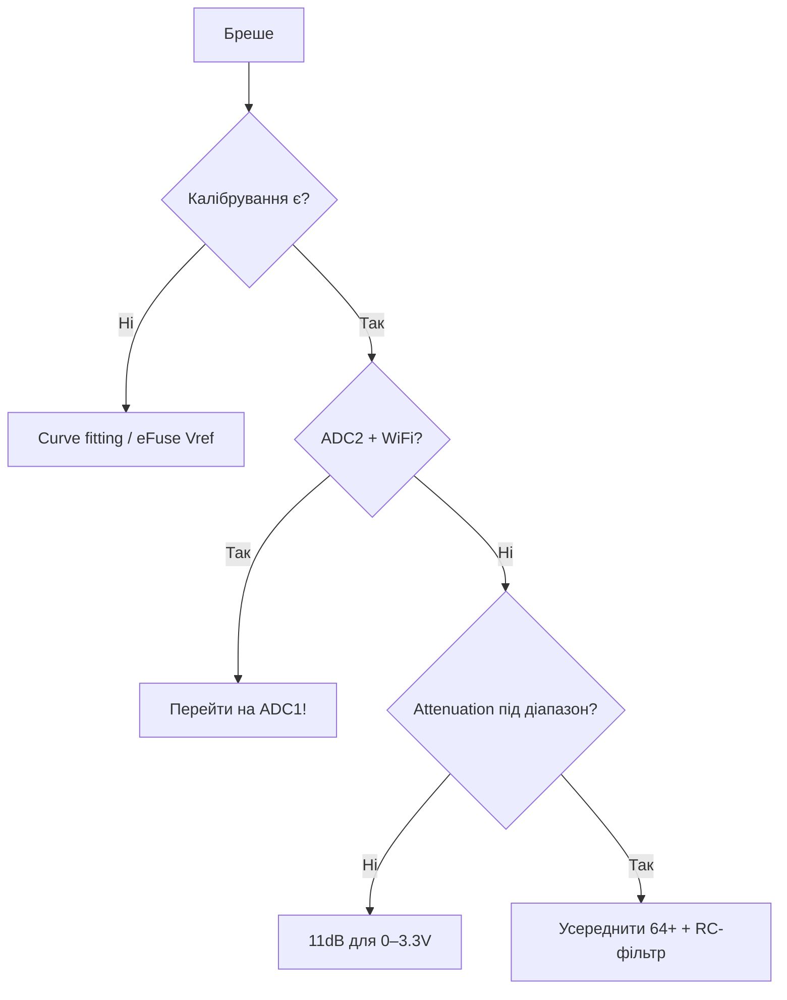

# ADC ESP32 - 12 біт

![[assets/img/placeholder.png]]

Два SAR-АЦП: **ADC1 (8 каналів)** - працює завжди, **ADC2 (10 каналів)** - гальмує при увімкненому WiFi.

> [!danger] ADC2 + WiFi конфлікт
> Коли WiFi активний, ADC2 зайнятий RF-калібруванням - `analogRead` повертає сміття. Для вимірів з WiFi - тільки **ADC1 (GPIO32-39)**.

## Призначення

ADC ESP32 - 12 біт - Канали; Attenuation - таблиця діапазонів; Таблиця з'єднань - потенціометр + дільник батареї. Два SAR-АЦП: ADC1 (8 каналів) - працює завжди, ADC2 (10 каналів) - гальмує при увімкненому WiFi. Коли WiFi активний, ADC2 зайнятий RF-калібруванням - analogRead повертає сміття. Для вимірів з WiFi - тільки ADC1 (GPIO32-39).

## Канали

| ADC1 GPIO | Канал | ADC2 GPIO | Канал |
| --- | --- | --- | --- |
| 36 (VP) | CH0 | 4 | CH0 |
| 37 | CH1 | 2 | CH2 |
| 38 | CH2 | 0 | CH1 |
| 39 (VN) | CH3 | 15 | CH3 |
| 32 | CH4 | 13 | CH4 |
| 33 | CH5 | 12 | CH5 |
| 34 | CH6 | 14 | CH6 |
| 35 | CH7 | 27/25/26 | CH7/8/9 |

GPIO34-39 - тільки вхід.

## Attenuation - таблиця діапазонів

| Attenuation | Діапазон | Рекомендація |
| --- | --- | --- |
| 0 dB | 0-1.1В | точні малі сигнали |
| 2.5 dB | 0-1.5В | - |
| 6 dB | 0-2.2В | датчики 2В |
| 11 dB | 0-3.3В (факт. ~3.9В) | default для 3.3В схем |

> [!tip] Калібрування
> Заводський розкид ±5-10%. Виклич `esp_adc_cal_characterize()` (eFuse Vref) або усереднюй 64 семпли + медіана. Для точності - зовнішній ADS1115.

## Таблиця з'єднань - потенціометр + дільник батареї

| ESP32 | Компонент | Примітка |
| --- | --- | --- |
| GPIO34 | середній вивід потенц. 10к | крайні → 3V3/GND, тільки вхід ок |
| GPIO35 | батарея через дільник 100к/100к | 4.2В→2.1В, + 100нФ до GND |
| GND | спільна | - |

## Код

**Arduino:**

```cpp
void setup() {
  Serial.begin(115200);
  analogReadResolution(12);
  analogSetAttenuation(ADC_11db);
}
void loop() {
  long s = 0; for (int i = 0; i < 64; i++) s += analogRead(34);
  Serial.println(s / 64);
  delay(500);
}
```

**ESP-IDF (oneshot + cal):**

```c
#include "esp_adc/adc_oneshot.h"
#include "esp_adc/adc_cali.h"
void app_main(void) {
    adc_oneshot_unit_handle_t h;
    adc_oneshot_unit_init_cfg_t u = {.unit_id=ADC_UNIT_1};
    adc_oneshot_new_unit(&u, &h);
    adc_oneshot_chan_cfg_t c = {.atten=ADC_ATTEN_DB_11,.bitwidth=ADC_BITWIDTH_12};
    adc_oneshot_config_channel(h, ADC_CHANNEL_6, &c);
    int v = 0; adc_oneshot_read(h, ADC_CHANNEL_6, &v);
}
```

**MicroPython:**

```python
from machine import ADC, Pin
a = ADC(Pin(34))
a.atten(ADC.ATTN_11DB)
a.width(ADC.WIDTH_12BIT)
print(sum(a.read() for _ in range(64)) // 64)
```

## Калібрувальні криві: eFuse Vref, two-point

Ідеальний АЦП: `V = raw / 4095 * 3.3`. Реальний ESP32: референс пливе **1.0-1.2 В** від чіпа до чіпа + нелінійність біля 0 і біля верху. Тому три рівні точності:

| Метод | Точність | Як |
| --- | --- | --- |
| Без калібрування | ±5-10% | `raw/4095*3.3` - тільки індикатор «батарея сідає» |
| eFuse Vref (заводський) | ±2-3% | `esp_adc_cal_characterize(ADC_UNIT_1, ADC_ATTEN_DB_11, ADC_WIDTH_BIT_12, 1100, &chars)` → `esp_adc_cal_raw_to_voltage()` |
| Two-point (ручна, свій стенд) | ±1% | виміряти 2 точки (напр. 0.5 В і 2.5 В мультиметром), побудувати лінію `V = k*raw + b`, зберегти в [[08-Pamyat/01-Partitions-NVS | NVS]] |
| Зовнішній АЦП | ±0.1% | [[10-Sensori/09-ADS1115-MCP3008-PCF8574-MCP23017 | ADS1115]] для «грошових» вимірів |

Крива типового каналу (11 dB): лінійна середина 0.3-2.8 В, загин біля 0 (мертва зона ~50-100 кодів) і насичення біля 3.3-3.9 В. Тому **не проєктуй дільник «впритул»** - лишай запас 10-15%.

**ESP-IDF (новий API adc_cali, IDF 5.x):**

```c
#include "esp_adc/adc_oneshot.h"
#include "esp_adc/adc_cali.h"
#include "esp_adc/adc_cali_scheme.h"
adc_oneshot_unit_handle_t adc;
adc_cali_handle_t cali = NULL;
void adc_init(void) {
    adc_oneshot_unit_init_cfg_t u = {.unit_id = ADC_UNIT_1};
    adc_oneshot_new_unit(&u, &adc);
    adc_oneshot_chan_cfg_t c = {.atten = ADC_ATTEN_DB_11, .bitwidth = ADC_BITWIDTH_12};
    adc_oneshot_config_channel(adc, ADC_CHANNEL_6, &c);
    // Калібрування: спочатку line-fitting, інакше curve-fitting
    adc_cali_line_fitting_config_t lc = {.unit_id = ADC_UNIT_1, .atten = ADC_ATTEN_DB_11,
                                         .bitwidth = ADC_BITWIDTH_12};
    if (adc_cali_create_scheme_line_fitting(&lc, &cali) != ESP_OK) {
        adc_cali_curve_fitting_config_t cc = {.unit_id = ADC_UNIT_1, .atten = ADC_ATTEN_DB_11,
                                              .bitwidth = ADC_BITWIDTH_12};
        adc_cali_create_scheme_curve_fitting(&cc, &cali);
    }
}
int mv = 0;
void read_mv(void) {
    int raw = 0; adc_oneshot_read(adc, ADC_CHANNEL_6, &raw);
    adc_cali_raw_to_voltage(cali, raw, &mv);  // мілівольти, вже з eFuse!
}
```

**Two-point своїми руками (будь-який фреймворк):**

```python
# MicroPython: калібрування дільника батареї
from machine import ADC, Pin
a = ADC(Pin(35)); a.atten(ADC.ATTN_11DB); a.width(ADC.WIDTH_12BIT)
# Стенд: подай 3.3В (точка H) і 1.5В (точка L), запиши raw:
RAW_L, V_L = 1520, 1.50
RAW_H, V_H = 3100, 3.30
k = (V_H - V_L) / (RAW_H - RAW_L)
b = V_L - k * RAW_L
def read_v(n=64):
    s = sorted(a.read() for _ in range(n))
    raw = sum(s[n//2-8:n//2+8]) / 16   # центр відсортованого = робастна медіана
    return k * raw + b
```

## Усереднення + median filter (код)

Шум АЦП ESP32 - ±20-50 кодів (особливо з WiFi). Один `analogRead` - лотерея. Комбо: **медіана (ріже викиди) + середнє (гладить шум)**.

**Arduino (усереднення + медіана):**

```cpp
int cmp(const void *a, const void *b) { return *(int*)a - *(int*)b; }
float readFiltered(uint8_t pin) {
  const int N = 33;
  int buf[N];
  for (int i = 0; i < N; i++) { buf[i] = analogRead(pin); delayMicroseconds(200); }
  qsort(buf, N, sizeof(int), cmp);
  long s = 0;                       // середнє центральних 16 з 33 (= медіанне вікно)
  for (int i = 8; i < 25; i++) s += buf[i];
  int raw = s / 17;
  return raw / 4095.0 * 3.3;        // або через калібрувальну пряму k*raw+b
}
void setup() {
  Serial.begin(115200);
  analogReadResolution(12);
  analogSetAttenuation(ADC_11db);
}
void loop() { Serial.println(readFiltered(34), 3); delay(500); }
```

**ESP-IDF (oneshot + вікно):**

```c
int adc_median(int n) {
    int buf[33], raw;
    for (int i = 0; i < n; i++) { adc_oneshot_read(adc, ADC_CHANNEL_6, &raw); buf[i] = raw; }
    // вставка-сорт для малих n
    for (int i = 1; i < n; i++) { int k = buf[i], j = i - 1;
        while (j >= 0 && buf[j] > k) { buf[j+1] = buf[j]; j--; } buf[j+1] = k; }
    return buf[n/2];
}
```

Правило вікна: N=15-33 при періоді 100-500 мкс. Більше N - гладить, але гальмує реакцію (для кнопки/струму беруть N=5-9).

## DMA-читання (оглядово)

Для швидких сигналів (звук, вібрація) oneshot повільний (~10-100 ксемпл/с з джитером). Режим **continuous + DMA** (IDF `adc_continuous`): АЦП сам кладе семпли в кільцевий буфер без CPU.

```c
// ESP-IDF, оглядово (приклад periph/adc_continuous):
// adc_continuous_handle_cfg_t h = {.max_store_buf_size = 1024, .conv_frame_size = 256};
// adc_continuous_config_t c = {.sample_freq_hz = 20000, .conv_mode = ADC_CONV_SINGLE_UNIT_1,
//                              .format = ADC_DIGI_OUTPUT_FORMAT_TYPE1};
// adc_continuous_new_handle(&h, &ch); adc_continuous_config(ch, &c);
// adc_continuous_register_event_callbacks(ch, {.on_conv_done = cb}, NULL);
// adc_continuous_start(ch); // далі в cb забирати фрейми по 256 семплів
```

Коли треба: спектр вібрації, детектор звуку, осцилограф. Коли НЕ треба: температура/батарея раз на секунду - вистачить oneshot + медіана. На Arduino DMA доступний через `analogContinuous` (ESP32 core 2.0.14+) або IDF-компонент.

## Дільник високої напруги - РОЗРАХУНОК

Задача: міряти батарею/живлення **до 12 В** (або 24 В) каналом 0-3.3 В.

Формула: `Vout = Vin * R2 / (R1 + R2)`, струм дільника `I = Vin / (R1+R2)`.

| Vin max | R1 | R2 | Vout при max | Струм при max | Коментар |
| --- | --- | --- | --- | --- | --- |
| 4.2 В (Li-ion 1S) | 100к | 100к | 2.10 В | 21 мкА | класика, +100нФ до GND |
| 12 В (свинець/БЖ) | 100к | 27к | 2.55 В | 94 мкА | запас до 3.3 В є |
| 12 В (економний) | 1М | 270к | 2.55 В | 9.4 мкА | тільки з буфером! вхідний опір АЦП просадить |
| 24 В | 100к | 15к | 3.13 В | 209 мкА | впритул - краще 100к/13к → 2.77 В |

Кроки: 1) обери Vout ≈ 60-80% шкали (2.0-2.6 В при 11 dB); 2) R1+R2 ≥ 100к (щоб не жерти батарею), але ≤ 200к без операційника (інакше похибка від вхідного опору АЦП ~1 МОм); 3) конденсатор **100 нФ** паралельно R2 (ФНЧ + резервуар для SAR-вибірки); 4) захисний стабілітрон 3.3 В або діод на 3V3 при Vin > 15 В; 5) калібруй two-point (резистори ±1-5% дають основну похибку!).

Зворотна формула в коді: `Vin = Vadc * (R1+R2)/R2`. Зберігай коефіцієнт у NVS після калібрування конкретним мультиметром.

## Шум від WiFi - рознос земель і екранування

Симптом: без WiFi - рівна лінія ±5 кодів, з WiFi - «пила» ±50 кодів синхронно з пакетами. Причина: RF-струми наводяться на довгі аналогові доріжки + просадка живлення в TX-піках.

| Захід | Ефект |
| --- | --- |
| Короткі аналогові дроти (<10 см), вита пара або коаксіал | прибирає 50-70% наведень |
| Аналогова земля окремим дротом до GND плати (зірка), не «транзитом» через реле/мотор | прибирає стрибки при комутації |
| RC-фільтр 1-10к + 100нФ біля піни GPIO | ріже RF-наводку |
| Конденсатор живлення 470 мкФ + 100нФ біля ESP32 | тримає TX-піки 400 мА (див. [[02-Zhivlennya/01-Lancjugi-zhivlennya | Ланцюги живлення]]) |
| Міряти в паузах WiFi (між відправками) або modem-sleep | найдешевший софт-фікс |
| Екран/металевий корпус з заземленням для аналогової частини | для прецизійних схем |

Софт-правило: семплувати **пачкою 16-64 між пакетами WiFi**, медіана ріже RF-викиди. Якщо треба одночасно стрім даних і точний АЦП - винеси вимір на [[10-Sensori/09-ADS1115-MCP3008-PCF8574-MCP23017|ADS1115]] по [[04-Shini/03-I2C|I2C]] (в нього свій ФНЧ і диференційні входи).

### Mermaid: показання брешуть



## Типові помилки

| # | Помилка | Чому погано | Як правильно |
| --- | --- | --- | --- |
| 1 | Без калібрування | ±10% з коробки | eFuse/curve fitting |
| 2 | ADC2 при WiFi | Драйвер конфліктує | Тільки ADC1 |
| 3 | Невірний attenuation | Обрізання шкали | 11dB на 3.3V |
| 4 | Один замір без усереднення | Шум ±30 кодів | 64+ семпли + медіана |
| 5 | Високий імпеданс джерела | Недозаряд S/H | Буфер/менший дільник |

## Офіційні джерела

- [ESP32 ADC (ESP-IDF)](https://docs.espressif.com/projects/esp-idf/en/latest/esp32/api-reference/peripherals/adc.html) - канали, attenuation, калібрування.
- [ADC Calibration Guide](https://docs.espressif.com/projects/esp-idf/en/latest/esp32/api-reference/peripherals/adc_calibration.html) - curve fitting.

## Див. також

- [[Home]]
- [[01-Hardware/01-ESP32-Classic]]
- [[06-Analog/02-DAC-Touch-Hall]]
- [[03-GPIO/01-GPIO-oglyad|GPIO огляд]]
- [[03-GPIO/05-RTC-GPIO]]
- [[07-Timeri-Son/03-Sleep-ULP|Sleep]]
- [[06-Analog/01-ADC|Аналогові сенсори]]
