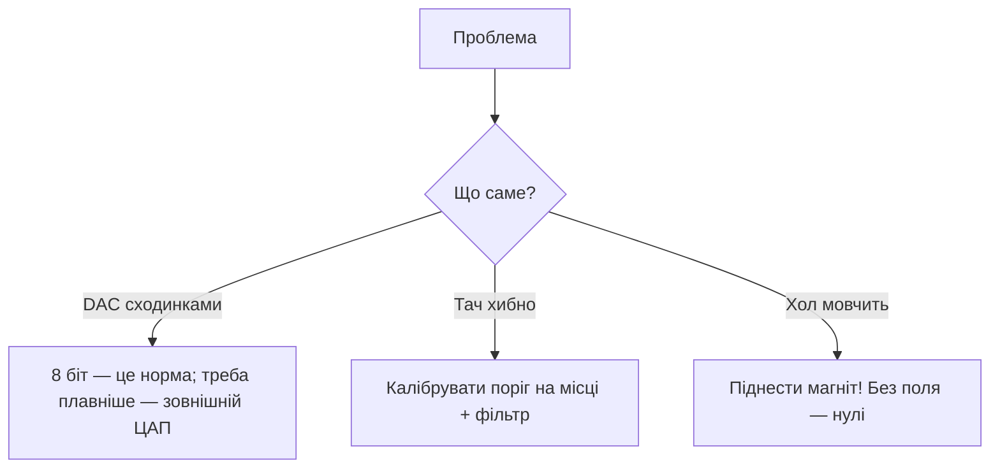

# DAC / Touch / Hall / Temp

![[assets/img/placeholder.png]]

ESP32 Classic має унікальний набір: **2× DAC 8 біт (25/26)**, **10× touch (T0-T9)**, **Hall-сенсор**, вбудований **temp-сенсор**. На S3/C3 DAC немає!

> [!warning] Немає DAC на S3/C3/C6
> Портуючи аудіо/схеми з Classic - заміни DAC на [[04-Shini/04-I2S|I2S ЦАП]] (MAX98357A) або ШІМ + RC-фільтр.

## Призначення

DAC / Touch / Hall / Temp - Touch T0-T9; Таблиця з'єднань; Сигма-дельта модулятор (S2/S3) - 1-біт ЦАП + фільтр. ESP32 Classic має унікальний набір: 2× DAC 8 біт (25/26), 10× touch (T0-T9), Hall-сенсор, вбудований temp-сенсор. На S3/C3 DAC немає! Сигма-дельта модулятор (S2/S3) - 1-біт ЦАП + фільтр.

## DAC

| Параметр | Значення |
| --- | --- |
| Піни | GPIO25 (DAC1), GPIO26 (DAC2) |
| Розрядність | 8 біт (0-255 → 0-3.3В) |
| Швидкість | до ~1 МГц (косинусний генератор) |

## Touch T0-T9

| Touch | GPIO | Touch | GPIO |
| --- | --- | --- | --- |
| T0 | 4 | T5 | 12 |
| T1 | 0 | T6 | 14 |
| T2 | 2 | T7 | 27 |
| T3 | 15 | T8 | 33 |
| T4 | 13 | T9 | 32 |

Працює через фольгу/монету + дріт, чутливість - порогом. Працює як wakeup з [[07-Timeri-Son/03-Sleep-ULP|deep-sleep]].

## Таблиця з'єднань

| ESP32 | Компонент | Примітка |
| --- | --- | --- |
| GPIO25 | динамік через 100мкФ + резистор 120 Ом | DAC-аудіо (тихо, для тестів) |
| GPIO33 (T8) | фольга-кнопка | touch, дріт <20 см |
| GPIO4 (T0) | фольга-кнопка wakeup | touch-wakeup |

## Код

**Arduino (DAC + touch):**

```cpp
#define TOUCH_PIN T8
int thr = 40;
void setup() {
  Serial.begin(115200);
  dacWrite(25, 128);  // 1.65В
  touchAttachInterrupt(TOUCH_PIN, [](){ Serial.println("touch"); }, thr);
}
void loop() {
  Serial.println(touchRead(TOUCH_PIN));
  delay(500);
}
```

**ESP-IDF:**

```c
#include "driver/dac.h"
#include "driver/touch_pad.h"
void app_main(void) {
    dac_output_enable(DAC_CHANNEL_1);
    dac_output_voltage(DAC_CHANNEL_1, 128);
    touch_pad_init();
    touch_pad_config(TOUCH_PAD_NUM8, 500);
}
```

**MicroPython:**

```python
from machine import DAC, Pin, TouchPad
import esp32
dac = DAC(Pin(25)); dac.write(128)
t = TouchPad(Pin(33)); print(t.read())
print(esp32.hall_sensor())
print((esp32.raw_temperature() - 32) * 5 / 9)  # °C (грубо)
```

## Сигма-дельта модулятор (S2/S3) - 1-біт ЦАП + фільтр

На S3 апаратного DAC немає (на S2 є 2× 8-біт, як у Classic), але є **Sigma-Delta Modulator (SDM)**: 1-бітний потік високої частоти, шпаруватість якого = аналогове значення. Після RC-фільтра отримуєш «ЦАП» будь-де на GPIO.

| Параметр | Значення |
| --- | --- |
| Каналів | до 8 (S2/S3) |
| Піни | будь-який GPIO (через матрицю) |
| Частота модуляції | до ~10 МГц (дільник від 80 МГц) |
| Фільтр | RC: 10к + 100нФ (зріз ~160 Гц) для повільних; 1к + 10нФ для аудіо-тестів |
| Розрядність ефективна | ~8 біт на повільних сигналах |

Схема: `GPIO --[10к]--+--[100нФ]--GND`, вихід з точки з'єднання. Пульсації ~10-30 мВ - для керування яскравістю/зсувом ок, для аудіо - краще [[04-Shini/04-I2S|I2S ЦАП]].

**ESP-IDF (S3, SDM):**

```c
#include "driver/sdm.h"
sdm_channel_handle_t ch;
void app_main(void) {
    sdm_config_t cfg = {.clk_src = SDM_CLK_SRC_DEFAULT,
                        .sample_rate_hz = 1000000,  // 1 МГц потік
                        .gpio_num = 4};
    sdm_new_channel(&cfg, &ch);
    sdm_channel_enable(ch);
    // 0..255 -> щільність: -128..127 у знакових одиницях API
    sdm_channel_set_pulse_density(ch, 60);  // ~75% заповнення
}
```

**Arduino (S2/S3 - LEDC як замінник там, де SDM не в core):**

```cpp
// Якщо SDM недоступний у твоєму core — ШІМ + RC дає той самий ефект:
ledcSetup(0, 100000, 8);       // 100 кГц, 8 біт; Arduino-ESP32 2.x! У 3.x: ledcAttach(4, 100000, 8) - див. 99-Dodatki/07-Versions
ledcAttachPin(4, 0);
ledcWrite(0, 192);             // 75% -> ~2.5В після RC 10к+100нФ
```

**MicroPython:** апаратного SDM-модуля немає - використовуй `PWM(Pin(4), freq=100000, duty=768)` + RC-фільтр, або [[04-Shini/04-I2S|I2S]].

## Touch-пороги, волога і плівка

Touch вимірює ємність площадки: палець додає ~5-20 пФ. Базове значення пливе від температури/вологи/плівки - тому **поріг має бути відносним, а не константою**.

| Фактор | Вплив | Лікування |
| --- | --- | --- |
| Плівка/скло 1-3 мм | сигнал падає в 2-5 разів | збільшити площадку (монета 15-20 мм), знизити поріг |
| Волога/конденсат | базове значення «пливе» вгору, хибні спрацьовування | калібрувати baseline при старті + ковзне середнє; герметизувати край плівки |
| Довгий дріт > 20 см | антена, ловить WiFi-наводки | дріт короткий, екран; чутливість нижча |
| Живлення від USB-зарядки | плаваючий GND = шум | торкатися GND корпусу при тестах; RC-фільтр |

Алгоритм адаптивного порога: `baseline` = середнє за 10 с без дотику; спрацьовування коли `value < baseline * 0.8` (значення touch **падає** при дотику!). Гістерезис: відпускання коли `value > baseline * 0.9`.

**Arduino (адаптивний поріг):**

```cpp
#define TP T8
long base = 0;
void calibrate() {
  long s = 0; for (int i = 0; i < 50; i++) { s += touchRead(TP); delay(20); }
  base = s / 50;
  Serial.printf("baseline=%ld thr_on=%ld thr_off=%ld\n", base, base*8/10, base*9/10);
}
void setup() { Serial.begin(115200); calibrate(); }
void loop() {
  int v = touchRead(TP);
  static bool pressed = false;
  if (!pressed && v < base * 8 / 10) { pressed = true; Serial.println("PRESS"); }
  if (pressed && v > base * 9 / 10) { pressed = false; Serial.println("RELEASE"); }
  // повільне підтягування baseline (компенсація вологи):
  if (!pressed) base = (base * 99 + v) / 100;
  delay(50);
}
```

**ESP-IDF:** `touch_pad_set_thresh(TOUCH_PAD_NUM8, base*8/10)` + фільтр `touch_pad_filter_start(10)`; вологозахист - періодичний перерахунок baseline в таймері.

**MicroPython:**

```python
from machine import TouchPad, Pin
t = TouchPad(Pin(33))
base = sum(t.read() for _ in range(50)) // 50
thr = base * 8 // 10
while True:
    v = t.read()
    print(v, "PRESS" if v < thr else "-")
```

## Wakeup по touch з порогом

Touch-контролер працює в [[07-Timeri-Son/03-Sleep-ULP|deep-sleep]] - ідеальна кнопка з нульовим струмом (~5-10 мкА).

**Arduino:**

```cpp
void setup() {
  Serial.begin(115200);
  touchSleepWakeUpEnable(T8, 40);  // T8 < 40 = будити
  // Калібруй число 40 під свою площадку: виведи touchRead у звичайному режимі,
  // візьми ~70% від значення «без дотику».
  esp_sleep_enable_touchpad_wakeup();
  Serial.println("sleep...");
  esp_deep_sleep_start();
}
void loop() {}
```

**ESP-IDF:**

```c
#include "driver/touch_pad.h"
#include "esp_sleep.h"
void app_main(void) {
    touch_pad_init();
    touch_pad_config(TOUCH_PAD_NUM8, 500);       // початковий поріг, уточни виміром
    touch_pad_filter_start(10);
    esp_sleep_enable_touchpad_wakeup();
    esp_deep_sleep_start();
    // Після wakeup: esp_sleep_get_touchpad_wakeup_status() покаже який пад розбудив
}
```

**MicroPython:**

```python
import esp32
from machine import TouchPad, Pin, deepsleep
esp32.wake_on_touch(True)
t = TouchPad(Pin(33))
t.config(400)  # поріг: підбери як 70% від холостого читання
deepsleep(60000)  # прокинеться раніше, якщо торкнутися T8
```

Чек-лист: 1) виміряй холосте і натиснуте значення; 2) поріг = середина між ними; 3) перевір wakeup вологими руками (волога зсуває обидва); 4) якщо два пади поруч - рознеси площадки ≥ 15 мм, інакше перехресні спрацьовування.

### Mermaid: DAC/тач/хол глючить



## Типові помилки

| # | Помилка | Чому погано | Як правильно |
| --- | --- | --- | --- |
| 1 | Чекати 12 біт від DAC | Там 8 біт | Зовнішній MCP4725 для точності |
| 2 | Тач-поріг зі стелі | Хибні/мертві | Калібрування + гістерезис |
| 3 | Хол без магніту | Нулі - це норма | Тест неодимом |
| 4 | DAC + WiFi-шум | Пульсації на виході | RC-фільтр + окремий аналог |

## Офіційні джерела

- [ESP32 DAC (ESP-IDF)](https://docs.espressif.com/projects/esp-idf/en/latest/esp32/api-reference/peripherals/dac.html) - канали 25/26.
- [Touch Sensor Guide](https://docs.espressif.com/projects/esp-idf/en/latest/esp32/api-reference/peripherals/touch_pad.html) - пороги, фільтри.

## Див. також

- [[Home]]
- [[01-Hardware/01-ESP32-Classic]]
- [[06-Analog/01-ADC|ADC]]
- [[07-Timeri-Son/03-Sleep-ULP|Sleep та ULP]]
- [[03-GPIO/04-Pererivannya-PWM|PWM]]
- [[03-GPIO/04-Pererivannya-PWM|Кнопки]]
- [[03-GPIO/01-GPIO-oglyad|GPIO огляд]]
