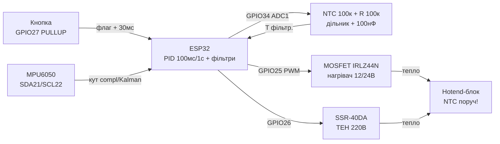

# ПІД-регулятор та фільтри - PID, Калман, усереднення, дебаунс, гістерезис

> [!info] Призначення
> Нотатка про «розумне» керування: **ПІД-регулятор** (су-від, інкубатор, hotend 3D-принтера), **фільтри** (ковзне середнє, медіана, complementary vs Kalman для кута MPU6050), **дебаунс кнопок** (таймер vs переривання+флаг), **гістерезис термостата**. Фінальний приклад: hotend 100к NTC + MOSFET-нагрівач + PID + SSR.

## Призначення

Коротко: тримати фізичну величину (температуру, кут, швидкість) рівно на уставці без гойдалок і перерегулювання. Типові задачі: су-від 60.0 °C ±0.2 °C, інкубатор 37.8 °C, hotend 210 °C для PLA, стабілізація кута коптера за MPU6050, чистий сигнал кнопки без брязкоту.

| Параметр | Значення |
| --- | --- |
| Інтерфейс | Аналог (NTC на ADC1), I2C (MPU6050), GPIO (кнопка, SSR/MOSFET через LEDC-PWM) |
| Живлення модуля | 3.3V (NTC-дільник, MPU6050), нагрівач - окремо 12/24V або 220V через SSR! |
| Рівень сигналів | 3.3V (ESP32 не 5V-толерантний; SSR керувати через транзистор/оптрон) |
| Сумісність | ESP32 / S3 / C3 (ADC1 GPIO32-39 при увімкненому WiFi) |

Навігація: ADC [[06-Analog/01-ADC|ADC]], переривання/PWM [[03-GPIO/04-Pererivannya-PWM]], драйвери/нагрівачі [[11-Vivid/04-L298N-TB6612-A4988-Buzzer]], датчики температури [[10-Sensori/11-NTC-PT100-MAX6675-LM35]], старт [[Home]].

## Характеристики

| Метод | Формула / ідея | Де застосовувати | Параметри старту | Примітка |
| --- | --- | --- | --- | --- |
| P (пропорційна) | `Kp × e` - чим далі від цілі, тим сильніше тиснемо | Швидкий відгук | Kp: нагрів 2-10 (PWM/°C) | Сам по собі дає статичну помилку |
| I (інтегральна) | `Ki × ∫e` - добирає «хвіст» помилки | Прибрати статичну помилку | Ki: 0.05-0.5; ліміт інтеграла! | Без anti-windup - велетенський перегрів |
| D (диференціальна) | `Kd × de/dt` - гальмує на підльоті | Прибрати перерегулювання/гойдалки | Kd: 5-50; фільтр D-складової! | Підсилює шум - фільтрувати вхід |
| Anti-windup | Кламп інтеграла + умовне інтегрування | Будь-який PID з насиченням (0-100% PWM) | `i_max = 30-50%` виходу | Обов'язково при реле/SSR (бінарний вихід!) |
| Ковзне середнє | Середнє N останніх (N=8-64) | Згладити шум NTC/струму | N=16 для температури 1 Гц | Дає затримку N/2 семплів |
| Медіана | Середній з N після сортування (N=3-11) | Викинути викиди/голки | N=5 для ADC | Дорожча за середнє, але ріже спайки |
| Complementary | `α×(gyro) + (1−α)×(accel)`, α≈0.96-0.98 | Кут MPU6050 на ESP32 (дешево!) | α=0.98, dt з таймера | 5 рядків коду, вистачає для 90% задач |
| Kalman (1D) | Прогноз + корекція з коваріаціями Q/R | Точний кут при вібраціях | Q=0.001, R=0.03 (старт) | Складніший; виграш vs complementary ~10-20% |
| Гістерезис | Вкл при T<ціль−Δ, викл при T>ціль+Δ | Термостат на реле/SSR (без PID) | Δ=0.5-2 °C | Рятує реле від цьокотіння |
| Дебаунс | Ігнор змін <20-50 мс | Будь-яка механічна кнопка | 30 мс; флаг з ISR + обробка в loop | Ніколи - `delay()` в ISR! |

> [!tip] З чого почати hotend/су-від
> Стартовий набір PID для нагрівача 40 Вт: Kp=4, Ki=0.15, Kd=20, період PID 1 с (для SSR) або 100 мс (для MOSFET-PWM 20 кГц), ліміт інтеграла ±30%, фільтр входу - медіана 5 + середнє 8. Далі - автотюнінг (релейний метод) і ручна доводка.

![[assets/img/pid-filters-scheme.png|600]]
*Рис. Hotend-стенд: 100к NTC-дільник на ADC + MOSFET/SSR-нагрівач на PWM + кнопка з дебаунсом + MPU6050 для кута.*

## 1. ПІД-регулятор: P / I / D складові та anti-windup

Дискретна форма (позиційна, для ESP32):

```text
e[k]  = setpoint − measured[k]        // помилка
P     = Kp × e[k]
I[k]  = clamp(I[k−1] + Ki × e[k] × dt, −I_MAX, +I_MAX)   // anti-windup клампом!
D     = Kd × (e[k] − e[k−1]) / dt     // або −Kd×d(meas)/dt (derivative on measurement)
u[k]  = clamp(P + I[k] + D, U_MIN, U_MAX)              // 0–255 PWM або 0–100%
```

- **P** - «сила»: великий Kp - швидко, але гойдалки і переліт; малий - повзе і недотягує (статична помилка).
- **I** - «пам'ять»: з'їдає статичну помилку, але при насиченні виходу (нагрів на 100%, а температура ще низька) інтеграл «намотується» у космос → переліт на 10-20 °C. Лікування - **anti-windup**: кламп інтеграла + не інтегрувати, коли вихід уперся в межу (conditional integration) + скидати I при зміні уставки.
- **D** - «гальмо»: дивиться на швидкість наближення і заздалегідь знімає потужність. Підсилює шум АЦП - тому D тільки після фільтра (медіана+середнє) або «D по виміру», а не по помилці (щоб стрибок уставки не давав удару).
- **Період dt** - константа! Викликати PID строго по таймеру (нагрів: 100-1000 мс; мотор: 5-20 мс). `dt` плаваючий з `millis()` - гойдалки.

Настроювання за 15 хвилин (релейний/емпіричний метод):

1. Ki=Kd=0, підняти Kp до стійких коливань (Ku) з періодом Tu.
2. Поставити Kp=0.6×Ku, Ki=2×Kp/Tu×dt, Kd=Kp×Tu/8/dt (Зіглер-Ніколс, старт).
3. Зменшити вдвічі при перельоті >2 °C; додати фільтр D при тремтінні виходу.

Приклади застосувань:

- **Су-від:** уставка 60 °C, ТЕН 500 Вт через SSR, період PID 1 с (SSR не любить ШІМ кілогерци!), гістерезис-аварія +5 °C.
- **Інкубатор:** 37.8 °C, лампа/ТЕН 60 Вт + вентилятор, два датчики (верх/низ), I-ліміт вузький (±15%) - перегрів вбиває виводок.
- **Hotend 3D:** 210 °C, картридж 40 Вт 12/24V через MOSFET, термістор 100к, PWM 20-50 Гц (повільний - інерція!), автотюнінг Marlin `M303` як орієнтир Kp/Ki/Kd.

## 2. Complementary vs Kalman (кут MPU6050) - оглядово

Задача: акселерометр дає абсолютний кут, але шумний при русі; гіроскоп - гладку швидкість, але дрейфує. Зливаємо обидва.

**Complementary (рекомендовано для старту):**

```text
angle += gyro_rate × dt                 // прогноз за гіроскопом
angle  = α × angle + (1−α) × accel_angle // корекція за акселерометром, α=0.98
```

Плюси: 5 рядків, 0 бібліотек, рахується за мікросекунди, dt з `micros()`. Мінуси: α підбирається вручну; при сильних вібраціях акселерометр бреше - complementary вірить йому на (1−α).

**Kalman 1D (коли complementary мало):** стан = [кут, зсув гіроскопа]; прогноз коваріації Q (шум процесу), корекція з R (шум виміру). Дає оптимальну вагу автоматично, краще тримає вібрації коптера/самоката. Ціна: ~40 рядків, матриці 2×2, налаштування Q/R (старт Q=0.001, R=0.03). На ESP32 рахується легко (десятки мікросекунд).

Правило вибору: кут нахилу платформи/маніпулятора/інкубаторної кришки - complementary; політ/балансування при вібраціях моторів - Kalman + вібророзв'язка MPU6050 (поролон!).

## 3. Ковзне середнє + медіана (ланцюжок для NTC)

Сирий ADC ESP32 шумить ±20-50 одиниць (±0.3-0.5 °C на NTC) + раз на секунду прилітає «голка» від WiFi. Ланцюжок:

1. **Медіана 5** - ріже голки (сортуємо 5 останніх, беремо середній).
2. **Ковзне середнє 8-16** - гладить білий шум.
3. У PID віддаємо вже фільтроване; сире - тільки в лог раз на секунду для діагностики.

Кільцевий буфер без `memmove`: індекс `(i+1)%N`, сума біжить (відняти старе, додати нове) - O(1). Частота: температуру читати 10 Гц, фільтр віддавати 1-2 Гц у PID - нагрів інерційний, швидше не треба.

## 4. Дебаунс кнопок - глибоко (таймер vs переривання+флаг)

Механічний контакт брязкотить 5-20 мс: один натиск = 10-50 фронтів. Варіанти:

- **Опитування по таймеру (рекомендовано):** кожні 10 мс читаємо пін; стан зараховуємо, якщо однаковий 3 рази поспіль (30 мс). Просто, детерміновано, 0 проблем з ISR. Для 1-4 кнопок - ідеал.
- **Переривання + флаг:** ISR тільки ставить `volatile bool pressed=true` (і мітку часу!), обробка - у loop з перевіркою `millis()-last>30`. Ніколи в ISR: `delay()`, `Serial.print()`, читання ADC, I2C! Плюс: прокидання з light-sleep по кнопці. Мінус: новачки вішають логіку в ISR і ловлять WDT.
- **Апаратний:** RC 10к + 100 нФ або тригер Шмітта 74HC14 - коли кнопка за 5 м дроту в цеху (там і екранування!).

Кнопку підтягувати до 3.3V внутрішнім pull-up (`INPUT_PULLUP`), замикати на GND; довгі лінії - зовнішній 4.7к + конденсатор 100 нФ біля ESP32.

## 5. Гістерезис термостата (коли PID не потрібен)

Реле/SSR на 220V не люблять ШІМ: для інкубатора-простого або обігрівача достатньо «вилки»: вмикаємо при T < 37.3, вимикаємо при T > 38.3 (уставка 37.8 ± 0.5). Реле клацає раз на хвилини, а не секунди → живе роками. PID виграє там, де треба ±0.2 °C (су-від, hotend); гістерезис - де ±1 °C ок і важлива простота/надійність. Комбінація: PID керує, а аварійний гістерезис +5 °C відрубує нагрів незалежно (безпека!).

## Легенда пінів модуля (hotend-стенд: NTC + MOSFET/SSR + кнопка + MPU6050)

| Пін / вузол | Тип | Куди на ESP32 | Примітка |
| --- | --- | --- | --- |
| NTC 100к (hotend) + R 100к до 3V3 | Аналог-дільник | GPIO34 (ADC1 CH6, тільки вхід!) | Середина дільника → GPIO34 + 100 нФ до GND; Beta 3950, таблиця/Steinhart-Hart у коді |
| MOSFET IRLZ44N (G/D/S) | Силовий ключ НР | G → GPIO25 через 220 Ом (+10к до GND) | D → нагрівач 12/24V, S → GND; радіатор від 3 А; логічний рівень Vgs! |
| SSR-40DA (+/− керування) | Реле твердотільне | + → GPIO26 через 1к (або через 2N2222), − → GND | Навантаження 220V ТЕН; снабер/радіатор; керування 3-32V DC |
| Кнопка «Старт/Стоп» | Цифра | GPIO27 → кнопка → GND (`INPUT_PULLUP`) | Дебаунс 30 мс; +100 нФ до GND при довгих дротах |
| MPU6050 VCC/GND/SDA/SCL | I2C | 3V3/GND/GPIO21/GPIO22 + pull-up 4.7к | Адреса 0x68 (AD0=GND); вібророзв'язка - поролон! |
| Живлення нагрівача 12/24V | Силове | Окремий БЖ, GND спільний з ESP32 в одній точці | Діод Шотткі при індуктивному навантаженні; запобіжник! |

> [!danger] 220V через SSR - безпека
> Силову частину (220V) - в окремий корпус, клемники з кришками, запобіжник + термозапобіжник 240 °C на hotend-блоці, аварійний гістерезис у коді + незалежний термостат. ESP32 і людина не повинні торкатися 220V ніколи.

## Схема підключення

| ESP32 DevKit | Вузол | Примітка |
| --- | --- | --- |
| 3V3 | NTC-дільник верх (R 100к), MPU6050 VCC | Аналог і цифру розвести, 100 нФ біля кожного |
| GND | NTC низ через термістор, MOSFET S, SSR −, кнопка, MPU6050 GND | Зірка в одній точці біля плати |
| GPIO34 | Середина NTC-дільника | ADC1 (працює з WiFi!), attenuation 11 дБ |
| GPIO25 | MOSFET Gate через 220 Ом | LEDC-PWM 20-50 Гц для нагрівача; 10к Gate→GND |
| GPIO26 | SSR + (через 1к / транзистор) | PID-період 1 с для SSR (повільний ключ!) |
| GPIO27 | Кнопка → GND | `INPUT_PULLUP`, дебаунс 30 мс |
| GPIO21/22 | MPU6050 SDA/SCL | I2C 400 кГц, pull-up 4.7к до 3.3V |

![[assets/img/pid-filters-scheme.png|600]]
*Рис. Загальна схема: NTC на GPIO34 + MOSFET/SSR-нагрів + кнопка + MPU6050 на одному ESP32.*

### ASCII-схема

```text
ESP32 DevKit                Hotend-стенд
─────────────                ────────────
3V3 ──┬───────────────────►  R 100к ──┬──► GPIO34 (ADC1!)
      │                               │
      │                          NTC 100к (hotend, до блоку)
      │                               │
GND ──┴───────────────────   GND ─────┘ (+100нФ GPIO34→GND!)

GPIO25 ──220 Ом──► G-IRLZ44N (10к G→GND!)  D ──► Нагрівач 12/24V ──► БЖ+
                          S ──► GND (спільний, радіатор на FET!)
GPIO26 ──1к──► SSR+ (SSR−→GND) ~~ 220V ТЕН ~~ 220V (корпус! запобіжник!)
GPIO27 ──► Кнопка ──► GND (INPUT_PULLUP, +100нФ, дебаунс 30мс)
GPIO21 ──► SDA MPU6050 │ GPIO22 ──► SCL (pull-up 4.7к до 3V3, addr 0x68)

MOSFET: швидкий ШІМ 20-50Гц (PID 100мс). SSR: повільний (PID 1с, time-proportioning)!
```

### Mermaid



## Код Arduino (PID hotend + медіана/середнє + дебаунс + гістерезис-аварія)

```cpp
// Hotend 210 °C: NTC100к на GPIO34 + MOSFET GPIO25 + кнопка GPIO27.
// Бібліотека: br3ttb/Arduino-PID-Library (v1.2.1). Період PID 100 мс.
#include <PID_v1.h>
#define NTC_PIN 34
#define HEAT_PIN 25
#define BTN_PIN 27
double Setpoint = 210, Input = 25, Output = 0;
// Старт для 40Вт-картриджа: Kp=4, Ki=0.15, Kd=20. Далі автотюнінг!
double Kp = 4, Ki = 0.15, Kd = 20;
PID pid(&Input, &Output, &Setpoint, Kp, Ki, Kd, DIRECT);
// --- Фільтр: медіана 5 + середнє 8 ---
float adc_buf[8]; uint8_t abi = 0;
float median5(float v) {
  static float w[5]; static uint8_t i = 0;
  w[i++ % 5] = v;
  float s[5]; memcpy(s, w, sizeof(s));
  for (uint8_t a = 0; a < 4; a++) for (uint8_t b = a + 1; b < 5; b++)
    if (s[b] < s[a]) { float t = s[a]; s[a] = s[b]; s[b] = t; }
  return s[2];
}
float ntcTemp() {  // Beta 3950, R0=100к, дільник 100к до 3V3, ADC 12біт
  int raw = analogRead(NTC_PIN);
  float v = median5(raw);
  adc_buf[abi++ % 8] = v;
  float m = 0; for (uint8_t i = 0; i < 8; i++) m += adc_buf[i];
  m /= 8.0;
  float R = 100000.0 * (4095.0 / m - 1.0);  // верх R до 3V3!
  float T = 1.0 / (1.0 / 298.15 + log(R / 100000.0) / 3950.0) - 273.15;
  return T;
}
// --- Дебаунс опитуванням: 3×10мс ---
bool btnPressed() {
  static uint8_t cnt = 0; static bool ready = true;
  static unsigned long t = 0;
  if (millis() - t < 10) return false;
  t = millis();
  if (digitalRead(BTN_PIN) == LOW) { if (++cnt >= 3 && ready) { ready = false; cnt = 0; return true; } }
  else { cnt = 0; ready = true; }
  return false;
}
bool heating = false;
void setup() {
  Serial.begin(115200);
  analogReadResolution(12); analogSetAttenuation(ADC_11db);
  pinMode(HEAT_PIN, OUTPUT); pinMode(BTN_PIN, INPUT_PULLUP);
  pid.SetMode(AUTOMATIC); pid.SetOutputLimits(0, 255);
  pid.SetSampleTime(100);  // = dt! строго 100 мс
}
void loop() {
  if (btnPressed()) { heating = !heating; Serial.println(heating ? "START" : "STOP"); }
  Input = ntcTemp();
  if (Input > Setpoint + 15) { analogWrite(HEAT_PIN, 0);  // АВАРІЙНИЙ гістерезис!
    Serial.println("АВАРІЯ: перегрів!"); delay(1000); return; }
  if (heating) { pid.Compute(); analogWrite(HEAT_PIN, (int)Output); }
  else analogWrite(HEAT_PIN, 0);
  static unsigned long l = 0;
  if (millis() - l > 500) { l = millis(); Serial.printf("T=%.1f U=%.0f\n", Input, Output); }
  delay(50);
}
```

## Код ESP-IDF (PID + LEDC-PWM + ISR-кнопка з флагом)

```c
// Концепт IDF: ADC-oneshot (GPIO34) + LEDC 20 Гц (GPIO25) + ISR кнопки (GPIO27).
// Повні приклади: adc_oneshot_read + ledc_basic. dt PID — esp_timer 100 мс!
#include "driver/gpio.h"
#include "driver/ledc.h"
#define HEAT_GPIO 25
#define BTN_GPIO 27
static volatile bool btn_flag = false;
static volatile uint32_t btn_last = 0;
static void IRAM_ATTR btn_isr(void *a) {
    uint32_t now = xTaskGetTickCountFromISR();  // мітка, БЕЗ delay/print/ADC!
    if (now - btn_last > pdMS_TO_TICKS(30)) { btn_flag = true; btn_last = now; }
}
void app_main(void) {
    // ADC1 oneshot GPIO34, atten 12дБ; LEDC timer 20 Гц/10 біт, канал на GPIO25.
    // esp_timer_create(100 мс) → PID step: read_filt → P/I(D по виміру) →
    // anti-windup кламп I ±30% → ledc_set_duty_and_update().
    gpio_install_isr_service(0);
    gpio_set_direction(BTN_GPIO, GPIO_MODE_INPUT);
    gpio_set_pull_mode(BTN_GPIO, GPIO_PULLUP_ONLY);
    gpio_set_intr_type(BTN_GPIO, GPIO_INTR_NEGEDGE);
    gpio_isr_handler_add(BTN_GPIO, btn_isr, NULL);
    while (1) {
        if (btn_flag) { btn_flag = false; /* toggle heating */ }
        vTaskDelay(pdMS_TO_TICKS(50));
    }
}
```

## Код MicroPython (термостат з гістерезисом + complementary-кут MPU6050)

```python
# Варіант A: простий термостат-інкубатор 37.8 ±0.5 (без PID — гістерезис!).
from machine import Pin, ADC
import time
adc = ADC(Pin(34)); adc.atten(ADC.ATTN_11DB); adc.width(ADC.WIDTH_12BIT)
heat = Pin(26, Pin.OUT)   # SSR через 1к/транзистор
btn = Pin(27, Pin.IN, Pin.PULL_UP)
SET, D = 37.8, 0.5
def temp_c():
    import math
    raw = sorted([adc.read() for _ in range(5)])[2]  # медіана 5
    R = 100000 * (4095 / max(raw, 1) - 1)
    return 1 / (1 / 298.15 + math.log(R / 100000) / 3950) - 273.15
on = False
last, st = 0, [1, 1, 1]
while True:
    now = time.ticks_ms()
    if time.ticks_diff(now, last) > 10:  # дебаунс 3×10мс
        last = now
        st = st[1:] + [btn.value()]
        if st == [0, 0, 0] and on is False:
            on = True; print("START")
        if st == [1, 1, 1] and on is True and btn.value() == 1:
            pass
    t = temp_c()
    if on:
        if t < SET - D: heat.on()
        elif t > SET + D: heat.off()  # гістерезис: реле не цьокотить
        if t > SET + 5: heat.off(); print("АВАРІЯ!")
    else:
        heat.off()
    time.sleep(0.5)
```

```python
# Варіант B: кут MPU6050 complementary (α=0.98), I2C 21/22.
from machine import I2C, Pin
import time, math
i2c = I2C(0, sda=Pin(21), scl=Pin(22), freq=400000)
A = 0x68
def r16(reg):
    h, l = i2c.readfrom_mem(A, reg, 1)[0], i2c.readfrom_mem(A, reg + 1, 1)[0]
    v = h << 8 | l
    return v - 65536 if v > 32767 else v
i2c.writeto_mem(A, 0x6B, b"\x00")  # wake up
angle, prev = 0.0, time.ticks_us()
ALPHA = 0.98
while True:
    now = time.ticks_us()
    dt = time.ticks_diff(now, prev) / 1e6; prev = now
    ax, az = r16(0x3B), r16(0x3F)
    gx = r16(0x43) / 131.0  # ±250°/с
    acc_a = math.degrees(math.atan2(ax, az))
    angle = ALPHA * (angle + gx * dt) + (1 - ALPHA) * acc_a
    print("Кут: %.1f" % angle)
    time.sleep(0.02)
```

Детальніше про середовища: [[00-Start/05-Vibir-seredovischa|Вибір середовища]].

## Типові помилки

| # | Симптом | Причина | Виправлення |
| --- | --- | --- | --- |
| 1 | Переліт +10-20 °C після виходу на уставку | Windup інтеграла (грів на 100%, I намотався) | Кламп I ±30% виходу, conditional integration (не інтегрувати при насиченні), скидати I при зміні уставки |
| 2 | Гойдалки ±3-5 °C навколо уставки | Kp великий / dt плаває / D без фільтра | Зменшити Kp ×0.6, строгий таймер dt (esp_timer/SetSampleTime), D по виміру + медіана на вході |
| 3 | Вихід тремтить 0-100% щосекунди | Шум ADC у D-складовій, Kd великий | Медіана 5 + середнє 8, Kd ÷2, D-фільтр (першого порядку), перевірити 100 нФ на NTC |
| 4 | SSR клацає/гріється, ТЕН блимає | ШІМ кілогерци на SSR (повільний ключ!) | Для SSR - time-proportioning з періодом 1 с (вікно), для MOSFET - LEDC 20-50 Гц; не навпаки! |
| 5 | Температура «пливе» на 2-3 °C з WiFi | ADC2 замість ADC1; нагрів дільника; не та Beta | Тільки ADC1 (GPIO32-39) при WiFi; R дільника 1% 100к; Beta з даташиту термістора (3950/3435!), калібрування в окропі/льоді |
| 6 | Кнопка дає 5-10 спрацювань за натиск | Брязкіт без дебаунсу; логіка в ISR | Дебаунс 30 мс (3×10 мс або флаг+час), в ISR тільки флаг+мітка; RC 10к/100нФ на довгих лініях |
| 7 | Кут MPU6050 дрейфує/стрибає при вібраціях | Дрейф гіроскопа; акселерометр вірить вібрації | Complementary α=0.98 + калібрування нуля гіроскопа; Kalman при моторах; MPU на поролоні, dt з micros (не delay!) |
| 8 | MOSFET кипить / відкрився наполовину | Не логічний FET (IRF540 замість IRLZ44N), немає радіатора | Тільки logic-level (IRLZ44N/AOD4184), 10к Gate→GND, радіатор від 3 А, ШІМ ≤50 Гц для нагріву |

## Офіційні джерела

- [Arduino PID Library - br3ttb (код PID_v1, API)](https://github.com/br3ttb/Arduino-PID-Library) - `SetSampleTime/SetOutputLimits`, режими DIRECT/REVERSE.
- [ESP-IDF ADC - канали, attenuation, oneshot/continuous, калібрування](https://docs.espressif.com/projects/esp-idf/en/latest/esp32/api-reference/peripherals/adc/index.html) - чому тільки ADC1 з WiFi.
- [ESP-IDF GPIO - переривання, pull-up/down, ISR-сервіс](https://docs.espressif.com/projects/esp-idf/en/latest/esp32/api-reference/peripherals/gpio.html) - `gpio_isr_handler_add`, прапорці IRAM.
- [ESP-IDF LEDC - PWM для MOSFET-нагрівача (частота/дозвіл)](https://docs.espressif.com/projects/esp-idf/en/latest/esp32/api-reference/peripherals/ledc.html) - `ledc_set_duty_and_update`, вибір частоти.

## Див. також

- [[Home]] - стартова сторінка довідника
- [[06-Analog/01-ADC|ADC]] - АЦП ESP32: канали, attenuation, калібрування, конфлікт ADC2/WiFi
- [[11-Vivid/04-L298N-TB6612-A4988-Buzzer]] - силові ключі та драйвери (MOSFET/SSR-практики)
- [[03-GPIO/04-Pererivannya-PWM]] - переривання та ШІМ (ISR-флаги, LEDC-таймери)
- [[10-Sensori/11-NTC-PT100-MAX6675-LM35]] - датчики температури (NTC-таблиці, MAX6675)
