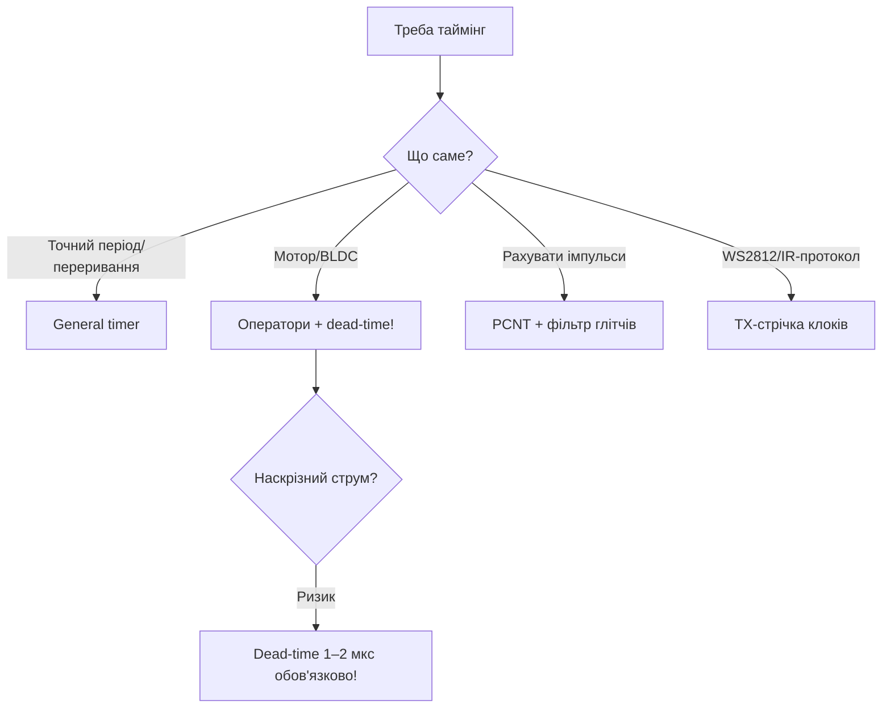

# Таймери / MCPWM / PCNT / RMT

![[assets/img/placeholder.png]]

Чотири апаратні блоки: **hw-timer** (точні інтервали), **MCPWM** (мотори), **PCNT** (енкодер), **RMT** (NeoPixel/ІЧ).

> [!info] Не плутай з LEDC
> [[03-GPIO/04-Pererivannya-PWM|LEDC]] - простий ШІМ (LED, servo). MCPWM - dead-time, fault, 3 фази для BLDC/моста.

## Призначення

Таймери / MCPWM / PCNT / RMT - Огляд блоків; Таблиця з'єднань; RMT-кодування WS2812: таймінги + код. Чотири апаратні блоки: hw-timer (точні інтервали), MCPWM (мотори), PCNT (енкодер), RMT (NeoPixel/ІЧ). [[03-GPIO/04-Pererivannya-PWM]] - простий ШІМ (LED, servo). MCPWM - dead-time, fault, 3 фази для BLDC/моста.

## Огляд блоків

| Блок | Каналів | Частота | Застосування |
| --- | --- | --- | --- |
| HW Timer | 4× 64-біт | 80 МГц / дільник | точний poll, timeout |
| MCPWM | 2 модулі × 3 PWM | до 40 МГц | DC-мотор, servo-мост, BLDC |
| PCNT | 8 лічильників | до 40 МГц | квадратурний енкодер без CPU |
| RMT | 8 каналів TX/RX | 1 нс роздільність | WS2812 NeoPixel, ІЧ NEC |

## Таблиця з'єднань

| ESP32 | Пристрій | Блок |
| --- | --- | --- |
| GPIO18/19 | L298N IN1/IN2 + ENA | MCPWM 20 кГц |
| GPIO34/35 | енкодер A/B | PCNT |
| GPIO23 | WS2812 DIN (через 330 Ом) | RMT |
| 5V/GND | живлення моторів/стрічки | спільний GND! |

**Arduino (hw-timer + RMT NeoPixel):**

```cpp
#include <Adafruit_NeoPixel.h>
Adafruit_NeoPixel px(8, 23, NEO_GRB + NEO_KHZ800);
volatile bool tick = false;
hw_timer_t *t = NULL;
void IRAM_ATTR onT() { tick = true; }
void setup() {
  px.begin();
  t = timerBegin(0, 80, true);  // 1 мкс тік
  timerAttachInterrupt(t, &onT, true);
  timerAlarmWrite(t, 1000000, true); timerAlarmEnable(t);
}
void loop() {
  if (tick) { tick = false; px.fill(px.Color(0, 50, 0)); px.show(); }
}
```

**ESP-IDF (MCPWM + PCNT):**

```c
// MCPWM: mcpwm_new_timer + mcpwm_new_operator + comparator + generator
// PCNT: pcnt_new_unit + pcnt_unit_add_watch_points, приклад pulse_count_event
// RMT TX: rmt_new_tx_channel + rmt_new_bytes_encoder (ws2812 example)
```

**MicroPython:**

```python
from machine import Timer, Pin
from neopixel import NeoPixel
np = NeoPixel(Pin(23), 8)
tim = Timer(0)
tim.init(period=1000, mode=Timer.PERIODIC, callback=lambda t: print("tick"))
np[0] = (0, 50, 0); np.write()
# енкодер: esp32.PCNT у IDF-білдах
```

## RMT-кодування WS2812: таймінги + код

WS2812 (NeoPixel) - 800 кГц, 1 дріт, біт кодується **тривалістю високого рівня**. RMT генерує ці імпульси апаратно - CPU вільний.

| Символ | T0H / T1H (високий) | T0L / T1L (низький) | Період | Допуск |
| --- | --- | --- | --- | --- |
| `0` | 0.35 мкс (220-380 нс) | 0.90 мкс | 1.25 мкс | ±150 нс |
| `1` | 0.90 мкс (580-1000 нс) | 0.35 мкс | 1.25 мкс | ±150 нс |
| RESET | низький > 50 мкс (нові чипи - > 280 мкс) | - | - | тримай 80+ мкс |

Порядок бітів: **GRB**, старший біт перший. Живлення стрічки - 5 В, DIN через **330 Ом**, перший піксель близько (<30 см) або через level-shifter 3.3→5 В. Електроліт **1000 мкФ** на початку стрічки обов'язковий (див. [[02-Zhivlennya/01-Lancjugi-zhivlennya|Ланцюги живлення]]).

**ESP-IDF (RMT bytes-encoder, IDF 5.x):**

```c
#include "driver/rmt_tx.h"
// Таймінги 800 кГц, роздільність 10 МГц (тік 100 нс):
// T0: high=3 (0.3 мкс), low=9 (0.9 мкс); T1: high=9, low=3; reset=800 (80 мкс)
rmt_channel_handle_t led_ch;
rmt_bytes_encoder_handle_t enc;
void ws_init(gpio_num_t pin, int n) {
    rmt_tx_channel_config_t cc = {.gpio_num = pin, .clk_src = RMT_CLK_SRC_DEFAULT,
        .resolution_hz = 10*1000*1000, .mem_block_symbols = 64, .trans_queue_depth = 4};
    rmt_new_tx_channel(&cc, &led_ch);
    rmt_bytes_encoder_config_t ec = {
        .bit0 = {.level0 = 1, .duration0 = 3, .level1 = 0, .duration1 = 9},
        .bit1 = {.level0 = 1, .duration0 = 9, .level1 = 0, .duration1 = 3},
        .flags.msb_first = 1};
    rmt_new_bytes_encoder(&ec, &enc);
    rmt_enable(led_ch);
}
void ws_show(uint8_t *grb, int n) {
    rmt_transmit_config_t tc = {.loop_count = 0};
    rmt_transmit(led_ch, enc, grb, n * 3, &tc);
    rmt_tx_wait_all_done(led_ch, 1000);  // + reset-пауза окремо 100 мкс
}
```

**Arduino (без бібліотеки, через RMT-драйвер IDF):**

```cpp
#include "driver/rmt.h"
#define WS_PIN 23
// Канал 0, дільник 8: тік 100 нс при 80 МГц APB
void wsRaw(const uint8_t *grb, int n) {
  rmt_config_t c = {};
  c.rmt_mode = RMT_MODE_TX; c.channel = RMT_CHANNEL_0;
  c.gpio_num = (gpio_num_t)WS_PIN; c.clk_div = 8; c.mem_block_num = 1;
  c.tx_config.loop_en = false; c.tx_config.idle_level = RMT_IDLE_LEVEL_LOW;
  c.tx_config.idle_output_en = true;
  rmt_config(&c); rmt_driver_install(c.channel, 0, 0);
  // далі: розкласти кожен біт у rmt_item32_t {3,1,9,0} / {9,1,3,0}, rmt_write_items + reset 80 мкс
}
```

**MicroPython (NeoPixel - всередині той же RMT):**

```python
from machine import Pin
from neopixel import NeoPixel
np = NeoPixel(Pin(23), 8)
np[0] = (0, 50, 0)   # GRB всередині бібліотеки!
np.write()
# Увага: WiFi + довга стрічка (>200 пікселів) = просадка 5В -> перший піксель "червонить".
# Лікування: інжекція живлення кожні 50-100 пікселів, спільний GND.
```

> [!warning] WS2812 vs SK6812 vs WS2815
> SK6812 - ті ж таймінги, є RGBW. WS2815 - 12 В (довгі лінії, яскравість нижча). Бібліотеки NeoPixel/FastLED підходять усім трьом, але RESET-тривалість для нових ревізій став 280 мкс - старий код з 50 мкс може мерехтіти.

## PCNT + квадратурний енкодер (з напрямком)

Енкодер дає 2 сигнали A/B зі зсувом 90°. PCNT рахує імпульси **без участі CPU** і фіксує напрямок.

| Подія | A | B | Напрямок |
| --- | --- | --- | --- |
| A росте при B=0 | ↑ | 0 | вперед (+1) |
| A росте при B=1 | ↑ | 1 | назад (−1) |
| Обрив B | - | висить | рахунок в один бік - перевіряй шлейф! |

Підтяжки: вбудовані pull-up увімкнути, конденсатори 10-100нФ на A/B біля ESP32 ріжуть деренчання (див. [[03-GPIO/03-Pidtyaguvannya-rivni|Підтягування]]).

**ESP-IDF (PCNT, IDF 5.x):**

```c
#include "driver/pulse_cnt.h"
pcnt_unit_handle_t pcnt;
void enc_init(gpio_num_t a, gpio_num_t b) {
    pcnt_unit_config_t u = {.low_limit = -10000, .high_limit = 10000};
    pcnt_new_unit(&u, &pcnt);
    pcnt_chan_config_t ca = {.edge_gpio_num = a, .level_gpio_num = b};
    pcnt_channel_handle_t chA; pcnt_new_channel(pcnt, &ca, &chA);
    // A: на зростанні +1 якщо B низький, -1 якщо B високий
    pcnt_channel_set_edge_action(chA, PCNT_CHANNEL_EDGE_ACTION_INCREASE,
                                       PCNT_CHANNEL_EDGE_ACTION_DECREASE);
    pcnt_channel_set_level_action(chA, PCNT_CHANNEL_LEVEL_ACTION_KEEP,
                                        PCNT_CHANNEL_LEVEL_ACTION_INVERSE);
    pcnt_unit_add_watch_points(pcnt, (int[]){-1000, 0, 1000}, 3, 0);
    pcnt_unit_enable(pcnt); pcnt_unit_start(pcnt);
}
int pos = 0;
void enc_poll(void) { pcnt_unit_get_count(pcnt, &pos); }
```

**Arduino (PCNT через переривання - простий варіант без драйвера):**

```cpp
#define EA 34
#define EB 35
volatile long pos = 0;
void IRAM_ATTR onA() { pos += digitalRead(EB) ? -1 : 1; }
void setup() {
  pinMode(EA, INPUT_PULLUP); pinMode(EB, INPUT_PULLUP);
  attachInterrupt(EA, onA, RISING);
  Serial.begin(115200);
}
void loop() { Serial.println(pos); delay(200); }
```

**MicroPython:**

```python
from machine import Pin
pos = 0
pa, pb = Pin(34, Pin.IN, Pin.PULL_UP), Pin(35, Pin.IN, Pin.PULL_UP)
def onA(p):
    global pos
    pos += -1 if pb.value() else 1
pa.irq(onA, Pin.IRQ_RISING)
```

Детальніше про механіку енкодерів - [[10-Sensori/14-DS3231-Encoder-Keypad-Joystick|Encoder Keypad]].

## MCPWM complementary + deadtime для моста

Півміст (H-bridge плече): верхній і нижній транзистори керуються **взаємодоповнюючими** сигналами. Без паузи (dead-time) обидва відкриті одночасно на ~50-200 нс = **наскрізний струм** = дим. MCPWM вставляє dead-time апаратно.

| Параметр | Рекомендація |
| --- | --- |
| Частота моста | 20 кГц (вище чутного, втрати помірні) |
| Dead-time MOSFET (IRFZ44N + драйвер) | 500-1000 нс |
| Dead-time IGBT | 1-3 мкс |
| Вихід | GPIO18 (PWMH) + GPIO19 (PWML) через драйвер (IR2104 / TB6612) - не безпосередньо на затвори! |

```text
PWMH  __--__--__              (верхній ключ)
           ^^ dead-time: обидва закриті
PWML  --__--__--__            (нижній ключ, інверсія + зсув)
```

**ESP-IDF (MCPWM + dead-time, IDF 5.x):**

```c
#include "driver/mcpwm_timer.h"
#include "driver/mcpwm_operator.h"
#include "driver/mcpwm_cmpr.h"
#include "driver/mcpwm_gen.h"
mcpwm_timer_handle_t t; mcpwm_oper_handle_t op;
mcpwm_cmpr_handle_t cmp; mcpwm_gen_handle_t h, l;
void bridge_init(void) {
    mcpwm_timer_config_t tc = {.group_id = 0, .clk_src = MCPWM_TIMER_CLK_SRC_DEFAULT,
        .resolution_hz = 10000000, .period_ticks = 500, .count_mode = MCPWM_TIMER_COUNT_MODE_UP};
    mcpwm_new_timer(&tc, &t);                       // 10 МГц / 500 = 20 кГц
    mcpwm_operator_config_t oc = {.group_id = 0};
    mcpwm_new_operator(&oc, &op);
    mcpwm_operator_connect_timer(op, t);
    mcpwm_comparator_config_t cc = {.flags.update_cmp_on_tez = true};
    mcpwm_new_comparator(op, &cc, &cmp);
    mcpwm_comparator_set_compare_value(cmp, 250);   // 50%
    mcpwm_generator_config_t gh = {.gen_gpio_num = 18}, gl = {.gen_gpio_num = 19};
    mcpwm_new_generator(op, &gh, &h); mcpwm_new_generator(op, &gl, &l);
    // H: високий при TEZ, низький при CMP; L: інверсія
    mcpwm_generator_set_action_on_timer_event(h, MCPWM_GEN_TIMER_EVENT_ACTION(MCPWM_TIMER_DIRECTION_UP, MCPWM_TIMER_EVENT_EMPTY, MCPWM_GEN_ACTION_HIGH));
    mcpwm_generator_set_action_on_compare_event(h, MCPWM_GEN_COMPARE_EVENT_ACTION(MCPWM_TIMER_DIRECTION_UP, cmp, MCPWM_GEN_ACTION_LOW));
    mcpwm_generator_set_action_on_timer_event(l, MCPWM_GEN_TIMER_EVENT_ACTION(MCPWM_TIMER_DIRECTION_UP, MCPWM_TIMER_EVENT_EMPTY, MCPWM_GEN_ACTION_LOW));
    mcpwm_generator_set_action_on_compare_event(l, MCPWM_GEN_COMPARE_EVENT_ACTION(MCPWM_TIMER_DIRECTION_UP, cmp, MCPWM_GEN_ACTION_HIGH));
    // DEAD-TIME 800 нс обом фронтам:
    mcpwm_dead_time_config_t dt = {.posedge_delay_ticks = 8, .negedge_delay_ticks = 8};
    mcpwm_generator_set_dead_time(h, h, &dt);  // тік 100 нс при 10 МГц
    mcpwm_generator_set_dead_time(l, l, &dt);
    mcpwm_timer_enable(t); mcpwm_timer_start_stop(t, MCPWM_TIMER_START_NO_STOP);
}
```

**Arduino:** використовуй той же IDF-API прямо в скетчі (доступний через `driver/mcpwm_*`), або бібліотеку `ESP32Servo`/LEDC для простих мостів типу [[11-Vivid/04-L298N-TB6612-A4988-Buzzer|Драйвери моторів]] - але dead-time там роби вручну паузою, що менш надійно.

**MicroPython:** MCPWM-модуля немає - для моста бери готовий драйвер TB6612/L298N (два GPIO напрямку + один ШІМ), dead-time забезпечує сам драйвер.

> [!danger] Мост без драйвера = спалені ключі
> GPIO ESP32 не дає струму/напруги для затворів MOSFET і не гарантує dead-time програмно при WiFi-перериваннях. Завжди: драйвер (IR2104/FAN7388/TB6612) + dead-time в MCPWM + конденсатори за живленням моста.

### Mermaid: що взяти під задачу



## Типові помилки

| # | Помилка | Чому погано | Як правильно |
| --- | --- | --- | --- |
| 1 | MCPWM без dead-time | Наскрізний струм, дим | 1-2 мкс пауза |
| 2 | PCNT без фільтра | Рахує дзвін | Glitch filter увімкнути |
| 3 | RMT як GPIO-бітбенг | Джиттер | Апаратний RMT-канал |
| 4 | Таймер ISR важкий | Зрив періодів | Прапорець + задача |
| 5 | Прескалер «на око» | Невірна частота | Рахувати: 80МГц / div / ticks |

## Офіційні джерела

- [GPTimer / MCPWM / PCNT / RMT (ESP-IDF)](https://docs.espressif.com/projects/esp-idf/en/latest/esp32/api-reference/peripherals/gptimer.html) - драйвери таймерів.
- [MCPWM Guide](https://docs.espressif.com/projects/esp-idf/en/latest/esp32/api-reference/peripherals/mcpwm.html) - оператори, dead-time.

## Див. також

- [[Home]]
- [[01-Hardware/01-ESP32-Classic]]
- [[03-GPIO/04-Pererivannya-PWM|Переривання та PWM]]
- [[11-Vivid/03-NeoPixel-Servo-Rele-MOSFET|LED NeoPixel]]
- [[03-GPIO/04-Pererivannya-PWM|Кнопки та енкодери]]
- [[11-Vivid/04-L298N-TB6612-A4988-Buzzer|Драйвери моторів]]
- [[07-Timeri-Son/02-WDT|WDT]]
