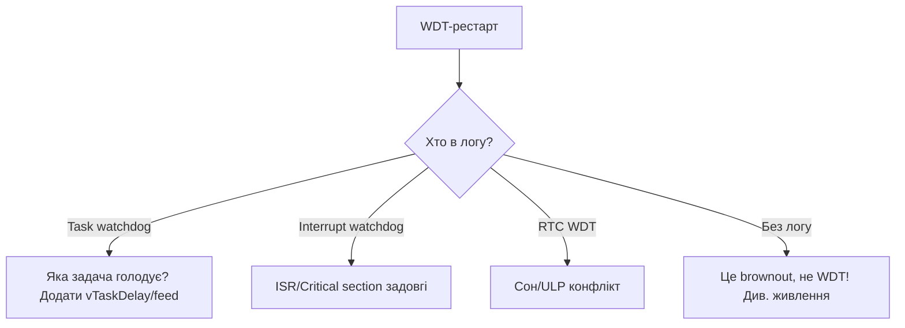

# WDT - сторожові таймери

![[assets/img/placeholder.png]]

Два рівні: **Task WDT** (зависання loop/task) і **RTC WDT** (зависання всього чіпа в сні). Не плутай з [[07-Timeri-Son/03-Sleep-ULP|sleep-wakeup]].

> [!danger] WDT - не костиль для delay()
> Якщо Task WDT спрацьовує - шукай блокуючий `while` / голодний task, а не збільшуй таймаут до 30 с.

## Призначення

WDT - сторожові таймери - Порівняння; Типові причини panic; Таблиця з'єднань (індикація panic). Якщо Task WDT спрацьовує - шукай блокуючий while / голодний task, а не збільшуй таймаут до 30 с. 1. Task watchdog got triggered + дамп регістрів задач в UART0. Види - Task WDT, Interrupt WDT, RTC WDT; кожен лікується по-своєму (див. mermaid-діаграму).

## Порівняння

| Параметр | Task WDT (MWDT0/1) | RTC WDT |
| --- | --- | --- |
| Що стежить | loop + зареєстровані tasks | CPU + RTC в sleep |
| Таймаут default | 5 с (Arduino) | ~9 с |
| Дія | panic + reboot | reset |
| Feed | автоматично в idle / вручну | автоматично |
| Коли вимикати | ніколи надовго | тільки в критичній секції |

## Типові причини panic

| Лог | Причина | Лікування |
| --- | --- | --- |
| `Task watchdog got triggered. The following tasks did not reset the watchdog in time: loopTask` | `delay(10000)` / `while(1)` без yield | розбий на шматки + `vTaskDelay` / `yield()` |
| `Guru Meditation ... LoadProhibited` після WDT | переповнення стека task | збільш stack в `xTaskCreate` |
| reboot кожні ~9 с в deep-sleep | RTC WDT + довгий hold | скороти RTC-операції |

## Таблиця з'єднань (індикація panic)

| ESP32 | Компонент | Примітка |
| --- | --- | --- |
| GPIO2 | LED | горить в setup(), гасне при panic → видно reboot-цикл |
| U0 TX/RX | USB-UART | читай panic-лог для діагностики |

## Код - feed та налаштування

**Arduino:**

```cpp
#include "esp_task_wdt.h"
void setup() {
  Serial.begin(115200);
  esp_task_wdt_init(10, true);  // 10 с, panic=true
  esp_task_wdt_add(NULL);       // стежити за loopTask
}
void loop() {
  // довга робота шматками:
  for (int i = 0; i < 5; i++) { /* chunk */ esp_task_wdt_reset(); delay(1000); }
}
```

**ESP-IDF:**

```c
#include "esp_task_wdt.h"
void app_main(void) {
    esp_task_wdt_config_t c = {.timeout_ms=10000,.idle_core_mask=0,.trigger_panic=true};
    esp_task_wdt_init(&c);
    // у своєму task: esp_task_wdt_add(NULL); ... esp_task_wdt_reset();
}
```

**MicroPython:**

```python
from machine import WDT
w = WDT(timeout=10000)
while True:
    # робота
    w.feed()
```

## Task-WDT vs RTC-WDT vs MWDT0/1 - повна картина

| Сторож | Де живе | Що стежить | Тактування | Дія при спрацюванні |
| --- | --- | --- | --- | --- |
| Task WDT | ядрова SW-надбудова над MWDT | зареєстровані tasks (loopTask, + свої) | APB | panic + reboot (якщо `trigger_panic`) або колбек |
| MWDT0 | Timer Group 0 | те саме, HW-рівень | APB (80 МГц) | переривання → reset |
| MWDT1 | Timer Group 1 | те саме, друга копія (IDF бере одну під Task WDT) | APB | переривання → reset |
| RTC WDT | RTC-домен | CPU + RTC в sleep /ULP-зависання | slow clock (~150 кГц) | reset чіпа |
| INT WDT | переривання | голод interrupt watchdog (ISR не встигає) | CPU-клок | panic (за замовчуванням увімкнено) |

Ієрархія на практиці: твій `loop()` годує **Task WDT** → Task WDT годує **MWDT0** → **RTC WDT** окремо страхує сон. Тому `delay(10000)` вбиває саме Task-рівень, а завислий ULP в deep-sleep - RTC-рівень.

Хто за замовчуванням під наглядом:

| Середовище | Під наглядом | Timeout default |
| --- | --- | --- |
| Arduino | loopTask + IDLE0/1 | 5 с |
| ESP-IDF | IDLE0/IDLE1 (+ свої після `esp_task_wdt_add`) | 5 с (`CONFIG_ESP_TASK_WDT_TIMEOUT_S`) |
| MicroPython | головний task | заданий в `WDT(timeout=...)` |

> [!warning] IDLE-нагляд
> Task WDT за замовчуванням стежить за **IDLE-задачами**. Якщо твій task з пріоритетом вище вічно крутиться без `vTaskDelay` - IDLE голодує → WDT panic, хоча твій код «працює». Лікування: `vTaskDelay(1)` в циклах.

## Timeout-розрахунок

Формула: `timeout > найдовший_атомарний_шматок + запас_WiFi`.

| Сценарій | Найдовший шматок | Рекомендований timeout |
| --- | --- | --- |
| Blink + сенсори | <100 мс | 5 с (default) |
| HTTP-запит в loop | 3-8 с (поганий сервер) | 10-15 с **або** винеси в окремий task |
| Запис 512 КБ в SD | 2-5 с | 10 с + `esp_task_wdt_reset()` між блоками |
| OTA 1 МБ по WiFi | 10-60 с | годуй в колбеку `ArduinoOTA.onProgress` / окремий task |
| Підключення WiFi STA | до 10 с | 15 с на час connect, потім поверни 5 с |

MWDT HW-розрахунок (коли налаштовуєш Timer Group вручну):

```text
timeout_с = (prescaler × reload) / 80_000_000
приклад: prescaler=40000, reload=200000 → (40000×200000)/80М = 100 с — забагато!
практика: prescaler=500, reload=20000 → (500×20000)/80М = 0.125 с — сторож фази
```

Код з періодичним годуванням довгої операції:

```cpp
// Довгий запис SD шматками з годуванням:
void bigWrite(File &f, const uint8_t *buf, size_t n) {
  const size_t CH = 4096;
  for (size_t o = 0; o < n; o += CH) {
    f.write(buf + o, min(CH, n - o));
    esp_task_wdt_reset();  // годуй кожен чанк
    yield();               // дай IDLE подихати
  }
  f.flush();
}
```

## Panic-обробник + coredump

Що відбувається при Task-WDT panic:

1. `Task watchdog got triggered` + дамп регістрів задач в UART0.
2. `Guru Meditation` → reboot (якщо panic=true).
3. При налаштованому coredump - запис в flash/NVS для офлайн-аналізу.

| Куди писати coredump | menuconfig | Коли |
| --- | --- | --- |
| UART (default) | `ESP_COREDUMP_ENABLE_TO_UART` | стенд, швидкий перегляд |
| Flash (64 КБ розділ) | `..._TO_FLASH` + розділ `coredump` в partitions | польовий пристрій без UART |
| Вимкено | `..._TO_NONE` | реліз з обмаль flash |

Розбір flash-coredump:

```bash
# 1. Злити розділ:
esptool.py --port /dev/ttyUSB0 read_flash 0x110000 0x10000 core.bin
# (адресу свого розділу coredump дивись в partitions.csv)
# 2. Декодувати:
esp-coredump.py info_corefile -t elf -c core.bin firmware.elf
# 3. Побачиш стек задачі-винуватця — зазвичай while(1) без yield або deadlock на м'ютексі
```

Мінімальний panic-колбек (зафіксувати причину перед reboot):

```c
#include "esp_task_wdt.h"
#include "esp_system.h"
static void wdt_user_handler(void *arg) {
    // Сюди потрапляємо в контексті переривання: тільки швидке!
    // Наприклад: записати прапор в RTC-пам'ять, моргнути LED неможливо — ISR!
}
void app_main(void) {
    esp_task_wdt_config_t c = {.timeout_ms=10000,.idle_core_mask=(1<<0)|(1<<1),.trigger_panic=true};
    esp_task_wdt_init(&c);
    esp_task_wdt_add_user("myguard", &wdt_user_handler);  // іменований сторож
}
```

Читання причини минулого reset в коді (телеметрія):

```cpp
#include "esp_system.h"
void setup() {
  Serial.begin(115200);
  auto r = esp_reset_reason();
  if (r == ESP_RST_TASK_WDT) Serial.println("попередній reset: Task WDT!");
  else if (r == ESP_RST_INT_WDT) Serial.println("попередній reset: INT WDT!");
  else if (r == ESP_RST_WDT) Serial.println("попередній reset: RTC/MWDT!");
}
```

## Підводні камені з WiFi-задачами

| Камень | Симптом | Лікування |
| --- | --- | --- |
| `WiFi.begin()` блокує loop до 10 с | WDT panic саме при старті/реконекті | timeout 15 с на час connect або WiFi в окремому task |
| `client.readString()` чекає сервер вічно | panic через 5 с | `client.setTimeout(3000)` + читання шматками з `esp_task_wdt_reset()` |
| BLE-scan + WiFi одночасно | IDLE голодує, спрацьовує INT WDT | рознеси в часі: скан → пауза → WiFi-відправка |
| `ESP-NOW` колбек робить важке (SD/HTTP) | WDT в WiFi-task | колбек тільки ставить прапор/чергу, важке - в loop task |
| Два ядра: task на Core 0 забули додати | `esp_task_wdt_add` викликано тільки в loop (Core 1) → Core 0 без нагляду | додавай явно в кожному довгоживучому task |
| `disableLoopWDT()` назавжди | зависання без reboot, «плата мовчить» | вимкай точково навколо однієї операції, потім `enableLoopWDT()` |

Шаблон WiFi-task з власним годуванням:

```cpp
void wifiTask(void *p) {
  esp_task_wdt_add(NULL);  // наглядати за цим task
  for (;;) {
    if (WiFi.status() != WL_CONNECTED) {
      WiFi.reconnect();
      for (int i = 0; i < 20 && WiFi.status() != WL_CONNECTED; i++) {
        vTaskDelay(pdMS_TO_TICKS(500));
        esp_task_wdt_reset();
      }
    }
    esp_task_wdt_reset();
    vTaskDelay(pdMS_TO_TICKS(1000));
  }
}
// в setup: xTaskCreatePinnedToCore(wifiTask, "wifi", 4096, NULL, 3, NULL, 0);
```

> [!tip] Правило великого пальця
> WDT спрацював → це **діагноз**, а не ворог. Збільшення timeout без пошуку блокуючого місця перетворює швидкий зрозумілий panic на повільне незрозуміле зависання. Див. [[09-Proshivka/06-FreeRTOS-Patterns|FreeRTOS патерни]] та [[09-Proshivka/05-JTAG-Debug|відлагодження]].

## Interrupt-WDT vs Task-WDT - глибоке порівняння

| Параметр | Interrupt WDT (IWDT) | Task WDT (TWDT) |
| --- | --- | --- |
| HW-основа | MWDT Timer Group 1 | MWDT Timer Group 0 |
| Хто годує | FreeRTOS tick-ISR кожного ядра | IDLE-task кожного ядра + підписані task |
| Що ловить | заблоковані переривання: довга критична секція, ISR що не вертається, вимкнені переривання | task що не віддає CPU: `while(1)` без yield, голод IDLE, deadlock |
| Timeout default | `CONFIG_ESP_INT_WDT_TIMEOUT_MS` = 300 мс (800 мс з PSRAM!) | `CONFIG_ESP_TASK_WDT_TIMEOUT_S` = 5 с |
| 1-ша стадія | panic `Interrupt wdt timeout on CPUx` + backtrace | warning + backtrace (або panic при `CONFIG_ESP_TASK_WDT_PANIC`) |
| 2-га стадія | hard reset чіпа (якщо panic-handler завис) | reset (при panic=true) |
| Правило timeout | ≥ 2× період tick (при 100 Гц tick - мінімум 20 мс, бери 300 мс) | > найдовшого атомарного шматка + запас WiFi |
| Типові винуватці | `portENTER_CRITICAL` на секунди, `SPI.transfer` в ISR, `Serial.print` в ISR | `delay(10000)` в loop, `client.readString()` без таймауту, щільний цикл без `vTaskDelay` |

Діагностика по логу:

| Лог | Який WDT | Що робити |
| --- | --- | --- |
| `Guru Meditation ... Interrupt wdt timeout on CPU0` + backtrace в ISR/`spi_device_transmit` | IWDT | винеси важке з ISR в task (черга!), скороти критичну секцію |
| `Task watchdog got triggered ... IDLE0 ... Tasks currently running: main` | TWDT, голод IDLE0 | `main` крутиться без yield - додай `vTaskDelay(1)` |
| `... IDLE1 ... CPU 1: wifi` | TWDT, голод IDLE1 | WiFi-task з пріоритетом задушив IDLE - знизь пріоритет або додай паузи |
| `... loopTask` | TWDT, loop завис | шукай блокуючий `while`/`delay` в `loop()` |
| Обидва по черзі | каскад: спочатку TWDT-гальма, потім ISR не встигає | чини першопричину (TWDT), IWDT згасне сам |

menuconfig-матриця (Component config → ESP System Settings):

| Опція | Default | Для продакшену | Для стенду |
| --- | --- | --- | --- |
| `CONFIG_ESP_INT_WDT` | y | y (завжди!) | y |
| `CONFIG_ESP_INT_WDT_TIMEOUT_MS` | 300 | 300 (з PSRAM - 800) | 1000 (щоб встигнути з дебагом) |
| `CONFIG_ESP_TASK_WDT_EN` | y | y | y |
| `CONFIG_ESP_TASK_WDT_INIT` | y (авто при старті) | y | y |
| `CONFIG_ESP_TASK_WDT_PANIC` | n (тільки warning) | **y** (перезапуск замість гнилого зависання) | n (дивись warning + живий чіп) |
| `CONFIG_ESP_TASK_WDT_TIMEOUT_S` | 5 | 5-10 | 10-30 |

> [!warning] JTAG вимикає обидва WDT на брейкпоінтах
> OpenOCD зупиняє MWDT на кожному halt - прошивка під дебагером «ніколи не падає по WDT», а без дебагера падає. Не довіряй поведінці під JTAG: ганяй стрес без дебагера. Див. [[09-Proshivka/05-JTAG-Debug|Відлагодження]].

## Кастомний panic-handler - зафіксувати причину до reboot

Контекст: panic-handler виконується з переривання/кашоподібного стану - **тільки IRAM-safe, без malloc/логування в flash**.

| API | Призначення | Обмеження контексту |
| --- | --- | --- |
| `esp_task_wdt_isr_user_handler()` (слабкий символ - перевизнач у себе) | викликається в ISR при TWDT-timeout | тільки швидке: прапор в RTC-пам'ять, регістр, перезапис змінної |
| `esp_task_wdt_add_user(name, &h)` + `esp_task_wdt_reset_user(h)` | зернистий нагляд за функцією/шляхом коду | reset тільки своїм handle |
| `esp_reset_reason()` при наступному boot | прочитати причину (для телеметрії) | виклик у `setup()`/`app_main` початку |
| `esp_coredump_to_flash` + розділ `coredump` | офлайн-стек винуватця | потрібен розділ у partitions (64 КБ) |

```c
#include "esp_task_wdt.h"
#include "esp_system.h"
#include "esp_attr.h"

// 1. Причина в RTC-пам'ять (переживе reboot!):
RTC_NOINIT_ATTR uint32_t wdt_crash_magic;
RTC_NOINIT_ATTR uint32_t wdt_crash_pc;

// 2. ISR-колбек: тільки запис, ніяких Serial/print/malloc!
void esp_task_wdt_isr_user_handler(void) {
  wdt_crash_magic = 0xDEADBEEF;
  // PC дістань з фрейму, якщо вмієш; мінімум — сам факт спрацювання
}

// 3. При старті — відправка телеметрії:
void report_last_crash(void) {
  auto r = esp_reset_reason();
  if (r == ESP_RST_TASK_WDT || r == ESP_RST_INT_WDT || r == ESP_RST_WDT) {
    // відправ на сервер: причина + magic + uptime + версія прошивки
  }
  if (wdt_crash_magic == 0xDEADBEEF) {
    // був саме TWDT-ISR — цінний біт для статистики парку пристроїв
    wdt_crash_magic = 0;
  }
}
```

Зернистий нагляд за підсистемами (знаходить винуватця з точністю до функції):

```c
esp_task_wdt_user_handle_t uh_sensor, uh_net;
void app_main(void) {
  esp_task_wdt_config_t c = {.timeout_ms = 8000, .idle_core_mask = 3, .trigger_panic = true};
  esp_task_wdt_init(&c);
  esp_task_wdt_add_user("sensor", &uh_sensor);
  esp_task_wdt_add_user("net", &uh_net);
}
void sensor_task(void *p) {
  for (;;) {
    read_sensors_blocking();       // якщо зависне тут — у panic-лозі буде "sensor"!
    esp_task_wdt_reset_user(uh_sensor);
    vTaskDelay(pdMS_TO_TICKS(100));
  }
}
```

## Brownout + WDT взаємодія

Brownout-detector (BOD) - окремий сторож за напругою, але симптоми плутають з WDT: випадкові reboot під WiFi-TX.

| Детектор | Поріг default | Дія | Лог |
| --- | --- | --- | --- |
| BOD Level 1-3 (`CONFIG_BROWNOUT_DET_LVL`) | ~2.4-2.7В (налаштовується) | reset чіпа | `Brownout detector was triggered` |
| Task WDT | 5 с | warning/panic | `Task watchdog got triggered` |
| RTC WDT | ~9 с | reset | тихий reset, причина `ESP_RST_WDT` |

Матриця розрізнення:

| Симптом | BOD | WDT |
| --- | --- | --- |
| Reboot тільки при WiFi-TX / записі SD + WiFi | **так (90%)** | ні |
| Reboot через рівно N секунд у конкретному місці коду | ні | **так** |
| `Brownout detector was triggered` у лозі | **так** | ні |
| Залежність від кабелю/довжини дротів живлення | **так** | ні |
| Залежність від довжини `delay`/`while` | ні | **так** |

Лікування пари BOD+WDT разом (типовий батарейний/дешевий-LDO пристрій):

1. Електроліт 470 мкФ + кераміка 100 нФ біля 3V3 (ковтає WiFi-піки 240-500 мА).
2. Товсті короткі дроти живлення; AMS1117-клони - під підозрою першими. Див. [[02-Zhivlennya/01-Lancjugi-zhivlennya|Живлення]].
3. `CONFIG_BROWNOUT_DET=y` на продакшені - краще чистий BOD-reset з логом, ніж гнила робота на межі.
4. WDT-timeout НЕ збільшувати щоб «пережити» просідання - це маскує BOD під зависання.

```cpp
// Розрізнення BOD vs WDT програмно (телеметрія парку):
#include "esp_system.h"
void setup() {
  Serial.begin(115200);
  switch (esp_reset_reason()) {
    case ESP_RST_BROWNOUT: Serial.println("BOD: чини живлення!"); break;
    case ESP_RST_TASK_WDT: Serial.println("TWDT: шукай блокуючий код"); break;
    case ESP_RST_INT_WDT: Serial.println("IWDT: довга критсекція/ISR"); break;
    case ESP_RST_WDT: Serial.println("RTC/MWDT: сон/бут"); break;
    default: break;
  }
}
```

## RTC-slow-memory збереження причини

`RTC_NOINIT_ATTR` (8 КБ RTC slow, живе в deep-sleep і при WDT-reset, але НЕ при power-off):

| Атрибут | Переживає WDT-reset | Переживає deep-sleep | Переживає power-off | Обсяг |
| --- | --- | --- | --- | --- |
| звичайна DRAM-змінна | ні | ні | ні | весь RAM |
| `RTC_DATA_ATTR` | так | так (якщо RTC-пам'ять не вимкнена) | ні | частина 8 КБ |
| `RTC_NOINIT_ATTR` | так (навіть без init!) | так | ні | частина 8 КБ |
| NVS | так | так | так | flash (повільніше, знос!) |

Шаблон «чорної скриньки»:

```cpp
#include "esp_attr.h"
struct CrashLog { uint32_t magic; uint32_t reason; uint32_t uptime; uint32_t task_id; };
RTC_NOINIT_ATTR CrashLog crashlog;

void save_crash(uint32_t why) {
  crashlog.magic = 0xC0FFEE;
  crashlog.reason = why;
  crashlog.uptime = millis();
}
void setup() {
  if (crashlog.magic == 0xC0FFEE) {
    Serial.printf("LAST CRASH: why=%lu uptime=%lu\n", crashlog.reason, crashlog.uptime);
    crashlog.magic = 0;  // прочитали — стерли
  }
}
```

> [!warning] Ініціалізація RTC-змінних
> `RTC_NOINIT_ATTR` НЕ обнуляється при reset - сміття після першого power-on! Завжди `magic`-перевірка. `RTC_DATA_ATTR` обнуляється при power-on, але теж живе через reset - для лічильника reboot підходить краще.

## Сторож для кожної задачі - патерн TaskGuard

Один глобальний WDT каже «хтось завис». Патерн TaskGuard каже **хто саме і де**.

```cpp
#include "esp_task_wdt.h"
// Кожна довгоживуча задача: add при старті, reset у циклі, delete при смерті.
void guardedTask(void *arg) {
  esp_task_wdt_add(NULL);  // підписати СЕБЕ
  for (;;) {
    // --- атомарний шматок < timeout ---
    do_chunk_of_work();
    esp_task_wdt_reset();  // погодував
    vTaskDelay(pdMS_TO_TICKS(10));  // дай IDLE подихати (обов'язково!)
  }
  // esp_task_wdt_delete(NULL);  // при виході
}
```

Матриця підписки для типового проєкту:

| Задача | Timeout | Feed-де | Коментар |
| --- | --- | --- | --- |
| loopTask | 5 с | кожна ітерація loop | Arduino default - не чіпай |
| sensorTask | 8 с | після кожного опитування шини | I2C-клин (див. [[04-Shini/03-I2C | I2C]]) не має вішати всю плату |
| netTask (HTTP/MQTT) | 15 с | у колбеку onProgress + між запитами | сервер може думати 10 с - це не зависання |
| otaTask | 60 с | у onProgress | тільки на час OTA, потім видали task |
| audioTask (I2S) | 5 с | кожен DMA-блок | underrun - теж форма голоду |

Тимчасове точкове вимкення (тільки навколо ОДНІЄЇ операції!):

```cpp
// Довге стирання flash-сектора: розшир timeout, потім поверни:
esp_task_wdt_reconfigure(&(esp_task_wdt_config_t){.timeout_ms = 30000, .idle_core_mask = 3, .trigger_panic = true});
erase_big_area();
esp_task_wdt_reconfigure(&(esp_task_wdt_config_t){.timeout_ms = 5000, .idle_core_mask = 3, .trigger_panic = true});
```

> [!danger] `disableLoopWDT()` назавжди = сліпий пристрій
> Пристрій без WDT зависає тихо в полі без жодного логу. Дозволено тільки точково (див. вище) або на 30 секунд стендового прогону. На релізі WDT завжди увімкнений з `trigger_panic=true`.

### Зовнішні WDT-чипи: TPS3823 / MAX6369 (коли вбудованих мало)

| Чип | Вікно | Kick | Коли |
| --- | --- | --- | --- |
| TPS3823 | Фіксоване (200 мс - 1.6 с) | Імпульс на WDI | Дешевий нагляд за живленням+кодом |
| MAX6369 | Програмоване (1 мс - 60 с!) | Імпульс, є віконний режим | Довгі цикли сну з контролем |
| TPL5110 (див. 07-04!) | Не WDT, а таймер живлення | DONE | 35 нА замість сну |

```text
Схема: WDO чипа → EN/RESET ESP32 (через діод АБО з кнопкою!);
WDI ← GPIO-«я живий» з головного циклу (НЕ з ISR!).
Віконний режим MAX6369: занадто ранній kick — теж рестарт (ловить «занадто швидкі» цикли!).
```

## Офіційні джерела Espressif

- ESP-IDF Programming Guide - Watchdogs (IWDT/TWDT/RTC_WDT, CONFIG_ESP_INT_WDT_TIMEOUT_MS, CONFIG_ESP_TASK_WDT_TIMEOUT_S, esp_task_wdt_add_user, esp_task_wdt_isr_user_handler, timeout stages, JTAG & watchdogs).
- ESP-IDF Programming Guide - Brownout / Power Management (BOD levels, CONFIG_BROWNOUT_DET_LVL).
- ESP-IDF Programming Guide - RTC / Sleep (RTC_NOINIT_ATTR, RTC slow memory 8 КБ).
- ESP32 Technical Reference Manual - Watchdog Timers (MWDT0/1, RWDT stages, write-protect).
- ESP-IDF examples: system/task_watchdog.

### Mermaid: який WDT спрацював



- MAX6369 Datasheet (Analog Devices, пошук PDF): [MAX6369 search](https://www.alldatasheet.com/view.jsp?Searchword=MAX6369) - WDT з вікном 1 мс-60 с.

## Див. також

- [[Home]]
- [[01-Hardware/01-ESP32-Classic]]
- [[07-Timeri-Son/01-Timeri-MCPWM-PCNT-RMT|Таймери]]
- [[07-Timeri-Son/03-Sleep-ULP|Sleep та ULP]]
- [[09-Proshivka/05-JTAG-Debug|Відлагодження]]
- [[03-GPIO/04-Pererivannya-PWM|Переривання]]
- [[05-Radio/01-WiFi-STA-AP|WiFi]]
