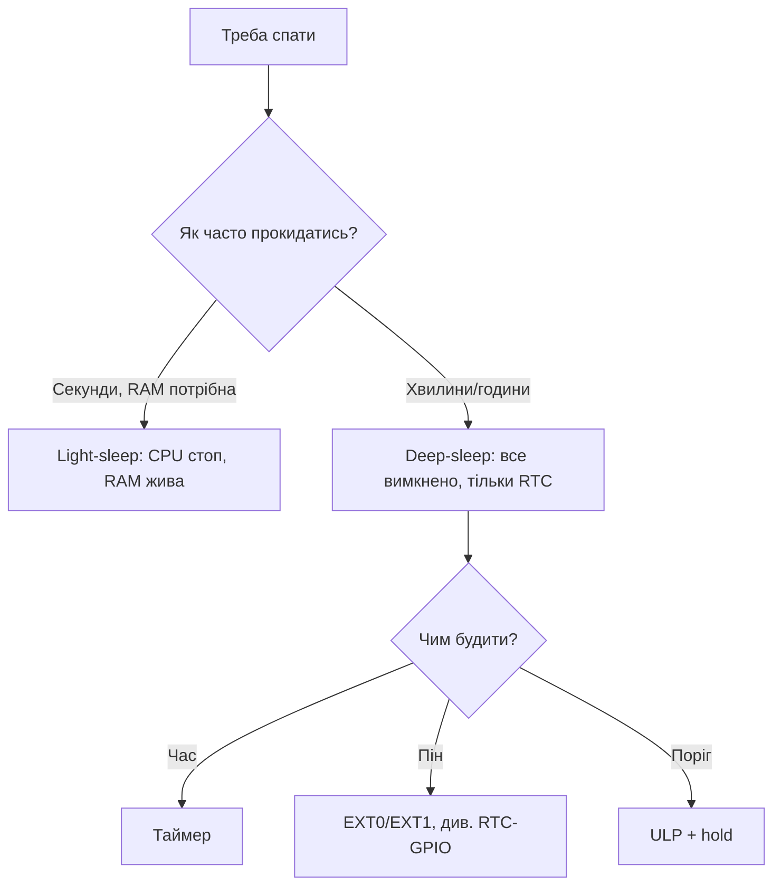

# Sleep та ULP

![[assets/img/placeholder.png]]

Три режими: **Modem-sleep** (WiFi вимк., CPU живий), **Light-sleep** (CPU пауза, RAM жива), **Deep-sleep** (все вимк., тільки RTC, ~10 мкА).

> [!info] Для батареї - тільки deep-sleep
> Light/Modem - міліампери. Рік на Li-ion - тільки deep-sleep + пробудження по таймеру/EXT/RTC.

## Призначення

Sleep та ULP - Струми та wakeup; Таблиця з'єднань - батарейний вузол; Код - deep-sleep 10 с. Три режими: Modem-sleep (WiFi вимк., CPU живий), Light-sleep (CPU пауза, RAM жива), Deep-sleep (все вимк., тільки RTC, ~10 мкА). Власний струм AMS1117 - ~5 мА. Для deep-sleep бери HT7333 / XC6206 / TPS737 з Iq мікроампери.

## Струми та wakeup

| Режим | Струм | RAM | Wakeup |
| --- | --- | --- | --- |
| Active + WiFi | 100-240 мА | + | - |
| Modem-sleep | 10-30 мА | + | WiFi DTIM |
| Light-sleep | 0.8-2 мА | + | GPIO, UART, timer, touch |
| Deep-sleep | ~10 мкА (+150 мкА ULP) | − (тільки RTC mem 8КБ) | EXT0/EXT1, timer, touch, ULP |

| Wakeup | Піни | Примітка |
| --- | --- | --- |
| EXT0 | 1× [[03-GPIO/05-RTC-GPIO]] | рівень HIGH/LOW |
| EXT1 | маска RTC GPIO | ANY_HIGH / ALL_LOW |
| Timer | - | `esp_sleep_enable_timer_wakeup(us)` |
| Touch | T0-T9 | поріг |
| ULP | RTC + [[06-Analog/01-ADC | ADC]]/I2C | програмка на асемблері ULP |

## Таблиця з'єднань - батарейний вузол

| ESP32 | Компонент | Примітка |
| --- | --- | --- |
| GPIO32 | кнопка → GND | EXT0 wakeup LOW |
| GPIO33 | LED/реле через транзистор | [[03-GPIO/05-RTC-GPIO | hold]] в сні |
| GPIO36 | батарея через дільник | вимір перед сном |
| 3V3 | Li-ion 18650 + LDO HT7333 | LDO з Iq <5 мкА! AMS1117 не годиться |

> [!warning] AMS1117 вбиває батарею
> Власний струм AMS1117 - ~5 мА. Для deep-sleep бери HT7333 / XC6206 / TPS737 з Iq мікроампери.

## Код - deep-sleep 10 с

**Arduino:**

```cpp
#define BTN 32
void setup() {
  Serial.begin(115200);
  Serial.printf("wakeup: %d\n", esp_sleep_get_wakeup_cause());
  esp_sleep_enable_timer_wakeup(10 * 1000000ULL);
  esp_sleep_enable_ext0_wakeup((gpio_num_t)BTN, 0);
  Serial.println("sleep...");
  Serial.flush();
  esp_deep_sleep_start();
}
void loop() {}
```

**ESP-IDF:**

```c
#include "esp_sleep.h"
#include "driver/rtc_io.h"
void app_main(void) {
    esp_sleep_enable_timer_wakeup(10 * 1000000ULL);
    esp_sleep_enable_ext0_wakeup(32, 0);
    rtc_gpio_hold_en(33);
    esp_deep_sleep_start();
}
```

**MicroPython:**

```python
from machine import Pin, deepsleep
import esp32
print("wake:", esp32.wake_reason())
esp32.wake_on_ext0(pin=Pin(32), level=esp32.WAKEUP_ALL_LOW)
deepsleep(10000)
```

## Touch-wakeup пороги

| Параметр | Значення / порада |
| --- | --- |
| Діапазон порога | 0…(залежить від `touch_pad_set_voltage`), типово поріг = 1/2-2/3 від baseline |
| Калібрування | міряй baseline 10 разів при старті (суха плата), поріг = baseline × 0.7 |
| Дрейф | волога/температура зсувають baseline на 10-30% → перекалібровка кожне пробудження |
| Фільтр | медіана з 3-5 вимірів, ігноруй одиничні сплески |
| Плата | доріжки touch короткі, без ground-pour під електродом |

```cpp
#include "driver/touch_pad.h"
void touch_wake_init(void) {
  touch_pad_init();
  touch_pad_set_fsm_mode(TOUCH_FSM_MODE_TIMER);
  touch_pad_set_voltage(TOUCH_HVOLT_2V7, TOUCH_LVOLT_0V5, TOUCH_HVOLT_ATTEN_1V);
  touch_pad_config(TOUCH_PAD_NUM9, 0);
  uint16_t base = 0;
  for (int i = 0; i < 10; i++) { uint16_t v; touch_pad_read(TOUCH_PAD_NUM9, &v); base += v; delay(20); }
  base /= 10;
  touch_pad_set_thresh(TOUCH_PAD_NUM9, base * 0.7);
  esp_sleep_enable_touchpad_wakeup();
}
```

> [!tip] Touch крізь корпус
> Електрод-фольга 10×10 мм під пластиком 2 мм працює; під металом - ні. Між електродом і MCU - series-R 1к проти ESD.

## Timer-wakeup дрейф

| Джерело клока RTC | Точність | Дрейф за добу | Коли |
| --- | --- | --- | --- |
| Внутрішній RC (~150 кГц) | ±5-10% | години | default, без кварцу |
| Зовнішній 32.768 кГц | ±20 ppm | ~2 с | точний логер, полив за розкладом |

```text
RC-генератор:  10 хв сну → реально 9–11 хв (не для годинника!)
32к-кварц:     10 хв сну → 10 хв ± 0.01 с
```

Практика: логер «раз на 10 хв» на RC - прийнятно (мітка часу по NTP після пробудження, див. [[15-Protokoli/03-mDNS-NTP-TLS|NTP]]). Полив «о 07:00» - тільки кварц 32.768 кГц або [[10-Sensori/14-DS3231-Encoder-Keypad-Joystick|DS3231]] як зовнішній будильник.

```cpp
// Самокалібрування періоду:
RTC_DATA_ATTR uint64_t real_us = 600 * 1000000ULL;
void sleep_calibrated(uint64_t want_us) {
  int64_t t0 = esp_timer_get_time();
  esp_sleep_enable_timer_wakeup(real_us);
  esp_light_sleep_start();
  int64_t fact = esp_timer_get_time() - t0;
  real_us = real_us * want_us / (uint64_t)fact;
}
```

## ULP-RISC-V приклад (S2/S3!)

На S2/S3 ULP - це повноцінний **RISC-V співпроцесор** (а не FSM-асемблер Classic): пишеться на C, має доступ до RTC-пам'яті, ADC, I2C-біту:

| Покоління ULP | Чіпи | Мова | Пам'ять | Особливості |
| --- | --- | --- | --- | --- |
| ULP FSM | Classic | асемблер ULP | 8 КБ RTC slow | I/O + ADC примітиви |
| ULP RISC-V | S2, S3 | C (RV32IMC) | 8 КБ RTC slow | цикли, масиви, `ulp_riscv_adc_read` |
| LP-core | C6 (LP-Core 32-біт) | C | LP SRAM | швидший, I2C/SPI-LP драйвери |

Приклад: ULP-RISC-V на S3 міряє ADC кожні 100 мс у deep-sleep, будить при порозі:

```c
// ulp/main.c — код ULP (компонується окремо через ulp-ldf):
#include "ulp_riscv.h"
#include "ulp_riscv_adc.h"
#define THRESH 2000
int main(void) {
    ulp_riscv_adc_cfg_t cfg = {
        .channel = ADC_CHANNEL_0, .width = ADC_BITWIDTH_12,
    };
    ulp_riscv_adc_init(&cfg);
    for (;;) {
        int v = ulp_riscv_adc_read(&cfg);
        if (v > THRESH) {
            ulp_riscv_wakeup_main_cpu();  // будимо!
            break;
        }
        ulp_riscv_delay_cycles(100 * 8000);  // ~100 мс на 8 МГц ULP
    }
    return 0;
}
```

```c
// app_main.c — головний CPU:
#include "ulp_riscv.h"
extern const uint8_t ulp_main_bin_start[] asm("_binary_ulp_main_bin_start");
void app_main(void) {
    esp_sleep_wakeup_cause_t cause = esp_sleep_get_wakeup_cause();
    if (cause == ESP_SLEEP_WAKEUP_ULP)
        printf("ULP розбудило: поріг перевищено!\n");
    ulp_riscv_load_binary(ulp_main_bin_start, ...);
    ulp_riscv_run();
    esp_sleep_enable_ulp_wakeup();
    esp_deep_sleep_start();
}
```

> [!warning] Пам'ять ULP
> 8 КБ RTC slow - і код, і дані. Великі масиви/printf всередині ULP - переповнення. Змінні для обміну з CPU - тільки `RTC_SLOW_ATTR`. Див. [[06-Analog/01-ADC|ADC]].

## LP-core C6

| Параметр LP-core C6 | Значення |
| --- | --- |
| Архітектура | 32-біт RISC-V, до ~20 МГц |
| Живлення в deep-sleep | ~150-300 мкА разом з RTC |
| Периферія LP | LP-I2C, LP-UART, LP-SPI, ADC, touch |
| Wakeup джерела | LP-таймер, GPIO, поріг ADC без участі HP-CPU |

Коли брати LP-core замість періодичного пробудження HP:

| Паттерн | Струм середній | Висновок |
| --- | --- | --- |
| HP прокидається раз на 10 с на 0.5 с WiFi-off | ~0.6 мА | простіше, без LP |
| LP-core семплить датчик 1 Гц, HP спить годинами | ~0.2 мА | LP виграє |
| LP-core + поріг → HP тільки по події | ~0.15 мА | максимум автономності |

Мінімальний LP-blink (C6, IDF `esp_lp_core`):

```c
// lp_core/main.c:
#include "ulp_lp_core_lp_adc.h"
int main(void) {
    // ... семплінг датчика, запис у LP_SHARED_MEM ...
    if (sensor_over_thresh())
        ulp_lp_core_wakeup_main_cpu();
    return 0;
}
```

## Вимірювання 10 мкА методикою

| Крок | Дія | Чому |
| --- | --- | --- |
| 1 | Випаяй/вимки AMS1117, живи через HT7333/XC6206 (Iq <5 мкА) | інакше міряєш стабілізатор, а не ESP32 |
| 2 | Вимки USB-UART (CP2102 жере ~мА навіть в idle) | живи безпосередньо 3.3В в піни 3V3/GND |
| 3 | Шунт 10 Ом в розрив 3V3 + осцилограф | 10 мкА × 10 Ом = 100 мкВ - видно; піки 240 мА теж видно |
| 4 | Або Nordic PPK2 / Joulescope / uCurrent | золотий стандарт, готові графіки струму |
| 5 | Профіль: сон → пік WiFi → сон | рахуй середній: `Iavg = (Isleep×Tsleep + Itx×Ttx) / T` |

Приклад розрахунку батареї:

```text
Цикл: сон 600 с × 12 мкА + WiFi 3 с × 120 мА
Заряд: 12мкА×600с + 120мА×3с = 7.2 + 360 = 367 мА·с
Середній: 367/603 ≈ 0.61 мА
18650 3000 мА·г / 0.61 мА ≈ 4900 год ≈ 200 діб
Висновок: домінує WiFi-сесія — скорочуй її, а не вичавлюй 8 замість 12 мкА сну.
```

Чекліст «чому не 10 мкА, а 2 мА»:

| Витік | Скільки жере | Лікування |
| --- | --- | --- |
| GPIO не в hold, LED світиться | 1-5 мА | `rtc_gpio_hold_en()`, LED через транзистор |
| Дільник батареї постійно підключений | 0.1-1 мА | дільник через MOSFET, вмикай на момент виміру |
| Floating входи | 0.1-0.5 мА | невикористані GPIO → pull-up/down або output LOW |
| USB-UART не вимкений | 0.5-15 мА | джампер живлення UART на платі |
| LDO AMS1117 | ~5 мА власних | заміна на HT7333/XC6206 |

## ULP-FSM асемблер - приклад Classic (S0/S2!)

На Classic ULP - 4-бітний FSM з власним асемблером (не C!). Регістри: R0-R3 (16 біт), таймер, ADC, I2C-біт, GPIO.

| Інструкція | Що робить | Приклад |
| --- | --- | --- |
| `MOVE Rd, imm/val` | запис | `MOVE R0, 2000` |
| `ADD/SUB/AND/OR/LSH/RSH` | АЛП | `ADD R0, R1, R2` |
| `LD/ST` | RTC-пам'ять | `ST R0, R3, 0` (зсув!) |
| `ADC R0, SAR_SEL, MUX` | вимір ADC | `ADC R0, 0, 1` |
| `TSENS R0, wait` | температура чіпа | `TSENS R0, 100` |
| `I2C_RD/I2C_WR` | бит-бенг I2C | опитування датчика в сні! |
| `JUMPR/JUMPS stage, thresh, cond` | умовний стрибок між стадіями | серце FSM |
| `STAGE_RST / STAGE_INC` | керування стадією S0-S7 | гістерезис без CPU! |
| `WAKE` | розбудити HP-CPU | `WAKE` + `HALT` |
| `HALT` | спати до наступного запуску | кінець програми |

Стадії S0-S7 - апаратний лічильник гістерезису: `JUMPS` інкрементує/скидає стадію за умовою. Класика: будити тільки якщо поріг перевищено 3 рази поспіль (фільтр сплесків без жодного рядка C!).

Повний приклад: моніторинг ADC з гістерезисом S0/S2 + wakeup (з ULP-прикладу IDF, адаптовано):

```asm
    /* ULP-FSM: прокидаємось періодично, міряємо ADC, рахуємо перевищення */
    .global entry
entry:
    MOVE R3, 0                 /* R3 = адреса змінної лічильника в RTC slow */
    LD R0, R3, 0               /* R0 = лічильник перевищень (з пам'яті) */
    ADC R1, 0, 1               /* R1 = ADC канал (SAR 0, mux 1 = GPIO36) */
    MOVE R2, 2000              /* поріг */
    SUB R2, R1, R2             /* R2 = value - thresh (знак!) */
    JUMPS wake_up, 1, LT       /* якщо value < thresh → стадія S1, скинути лічильник */
    /* value >= thresh: інкремент стадії */
    STAGE_INC 1
    JUMPS over3, 2, GE         /* стадія >= S2 (третє перевищення поспіль!) → будити */
    HALT                       /* ще не 3 рази — спати */

over3:
    ST R0, R3, 0               /* зберегти стан (опц.) */
    WAKE                       /* будимо HP-CPU! причина ESP_SLEEP_WAKEUP_ULP */
    STAGE_RST                  /* скинути стадії */
    HALT

wake_up:
    STAGE_RST                  /* сплеск закінчився — скинути */
    MOVE R0, 0
    ST R0, R3, 0
    HALT
```

Запуск з боку HP-CPU (IDF):

```c
#include "esp_sleep.h"
#include "driver/rtc_io.h"
#include "ulp.h"  // Classic ULP driver
extern const uint8_t ulp_bin_start[] asm("_binary_ulp_main_bin_start");
void app_main(void) {
  ulp_load_binary(0, ulp_bin_start, (ulp_bin_end - ulp_bin_start) / sizeof(uint32_t));
  ulp_set_wakeup_period(0, 100000);  // кожні 100 мс
  ESP_ERROR_CHECK(ulp_run((&ulp_entry - RTC_SLOW_MEM) / sizeof(uint32_t)));
  ESP_ERROR_CHECK(esp_sleep_enable_ulp_wakeup());
  esp_deep_sleep_start();
}
```

> [!warning] Обмеження FSM: 8 КБ slow-пам'яті, немає множення/ділення, немає float
> Складну математику (фільтр Калмана, FFT) - тільки на HP-CPU після wakeup або на ULP-RISC-V (S2/S3) / LP-core (C6). FSM - для порогів, лічильників, I2C-опитування.

## RTC-memory карта - що де живе

| Регіон | Обсяг Classic | Доступ HP | Доступ ULP | Переживає deep-sleep | Призначення |
| --- | --- | --- | --- | --- | --- |
| RTC FAST | 8 КБ | так | ні | так (якщо не вимкнена) | deep-sleep stub, швидкі змінні пробудження |
| RTC SLOW | 8 КБ | так | **так (код+дані ULP!)** | так | програма ULP + обмінні змінні |
| RTC registers / STORE0-7 | 8×32 біт | так | ні | так | wakeup-причина, magic-числа |
| DRAM (HP) | ~320 КБ | так | ні | **ні** - гасне! | звичайні змінні (губляться в deep-sleep) |

Карта SLOW-пам'яті при ULP-FSM (приклад розкладки):

```text
0x5000_0000  +------------------+
             | ULP код (entry)  |  <- ulp_load_binary(0, ...)
             +------------------+
             | лічильник (R3=0) |  <- ST/LD R3,0
             +------------------+
             | поріг / калібр.  |  <- константи, що HP оновлює перед сном
             +------------------+
             | кільце семплів   |  <- ULP пише, HP читає після wakeup
0x5000_1FFF  +------------------+  (8 КБ межа!)
```

Обмін HP↔ULP тільки через `RTC_SLOW_ATTR` / `RTC_DATA_ATTR`:

```c
RTC_SLOW_ATTR uint16_t ulp_samples[64];  // ULP пише (ST), HP читає після WAKE
RTC_SLOW_ATTR uint16_t ulp_thresh = 2000;  // HP пише перед сном, ULP читає (LD)
```

> [!danger] Невідповідність адрес = тиха смерть ULP
> ULP-адреси - це зсуви в словах від початку SLOW (`ulp_load_binary(0,...)`), а HP-адреси - байтові вказівники. Зсув на 1 слово = ULP пише в свій же код. Перевіряй карту `.map` ULP-бінарника після кожної зміни!

## Wakeup-stub - код у перші мілісекунди після deep-sleep

Stub (`esp_wake_deep_sleep`) виконується в RTC FAST до завантаження bootloader: вирішує - вантажити прошивку цілком (дорого, ~100 мс + 30 мА) чи швидко обробити і спати далі (дешево, ~1 мс).

| Підхід | Час активності | Струм | Коли |
| --- | --- | --- | --- |
| Звичайний wakeup → `setup()` | ~100-500 мс (bootloader + WiFi) | 30-150 мА | рідкісні пробудження (раз на 10 хв) |
| Stub: перевірка → назад у сон | ~0.5-2 мс | ~15 мА | часті події (кнопка дрижить, ULP-семпли) |
| Stub + швидкий ADC → рішення | ~2-5 мс | ~15-30 мА | пороговий детектор без повного boot |

```c
// RTC_IRAM_ATTR — обов'язково! Тільки RTC-функції всередині!
#include "esp_sleep.h"
#include "driver/rtc_io.h"
RTC_IRAM_ATTR void esp_wake_deep_sleep(void) {
  // Приклад: порахувати пробудження, 9 з 10 разів — одразу спати
  static RTC_NOINIT_ATTR uint32_t cnt;
  if (++cnt < 10) {
    // швидкий сон без завантаження прошивки:
    esp_deep_sleep_enable_timer_wakeup(1000000ULL);
    esp_deep_sleep_start();  // повернення сюди неможливе — це нормально
  }
  // 10-те пробудження: вийти зі stub → звичайний boot → setup()
  esp_default_wake_deep_sleep();
}
```

> [!warning] У stub заборонено: flash-читання, UART-print, WiFi, malloc, float
> Порушення = exception на етапі, де ще немає panic-handler. Правило: stub - максимум 20 рядків, тільки RTC_IO/таймер/лічильник.

## Light-sleep з WiFi - DTIM та modem-sleep докладно

| Режим WiFi-економії | Середній струм | З'єднання живе? | Затримка RX |
| --- | --- | --- | --- |
| Active (без сну) | 100-160 мА | так | 0 |
| Modem-sleep (авто) | 15-30 мА | так (DTIM-синхронізація) | до DTIM-періоду |
| Modem + Light-sleep auto (`esp_pm`) | 2-10 мА | так | DTIM + час прокидання CPU |
| Light-sleep ручний (WiFi вимк.) | 0.8-2 мА | **ні** | реконект секунди |
| Deep-sleep | 10 мкА | ні | повний boot + конект |

DTIM-розрахунок (ключ до батареї з живим WiFi!):

```text
AP beacon: кожні 102.4 мс (100 TU). DTIM-період тип. 1–3 → delivery кожні 100–300 мс.
Станція прокидається тільки на DTIM-beacon, звіряє TIM-біт, забирає буферизовані пакети.
Iavg ≈ (Isleep×Tdtim + Irx×Trx) / Tdtim.
Приклад: DTIM=3 (307 мс), сон 1.5 мА, RX 60 мА × 3 мс:
Iavg = (1.5×304 + 60×3)/307 ≈ (456+180)/307 ≈ 2.07 мА.
Збільш DTIM на роутері до 5–10 → Iavg падає до ~1.6 мА ціною затримки ping до 1 с.
```

Код modem + auto-light-sleep (з'єднання живе, струм мінімальний):

```c
#include "esp_wifi.h"
#include "esp_pm.h"
// 1. Power management: auto-light-sleep при простої
esp_pm_config_t pm = {.max_freq_mhz = 80, .min_freq_mhz = 10, .light_sleep_enable = true};
esp_pm_configure(&pm);
// 2. WiFi modem-sleep:
esp_wifi_set_ps(WIFI_PS_MIN_MODEM);  // DTIM-синхронізація (економний)
// Альтернатива: WIFI_PS_MAX_MODEM — агресивніший сон, більша затримка.
// 3. DTIM налаштовується НА РОУТЕРІ (beacon interval / DTIM period), не на ESP32!
```

> [!warning] DFS/APB vs UART при light-sleep
> При auto-light-sleep APB-частота стрибає → бод UART пливе. Для консолі/GPS при живому WiFi-сні: `UART_SCLK_REF_TICK` або `esp_pm_lock` на час критичного обміну. Див. [[04-Shini/01-UART|UART]].

## Вимірювання 10 мкА осцилографом + розрахунок батареї на рік

Схема вимірювання (без дорогих PPK2 - звичайним осцилографом!):

```text
Лабораторник 3.3В --[шунт 10 Ом]--+--> 3V3 ESP32 (голий модуль, UART відключений!)
                                  |
Осцилограф CH1 -- диференціально --+  (або два канали A-B math)
                                  |
GND ------------------------------+--> GND ESP32

10 мкА × 10 Ом = 100 мкВ (межа чутливості — бери 100 Ом шунт для фази сну:
100 мкА... ні: 10 мкА × 100 Ом = 1 мВ — вже видно! Але падіння 240мА×100Ом=24В?! —
тому ДВА шунти: 100 Ом (сон, з перемичкою-байпасом для піків) АБО active-пробник струму.
Практика: шунт 10 Ом + підсилення ×100 (INA219/INA226 модуль) + осцилограф.
```

Процедура:

1. Проший `deep_sleep_start` без WiFi, без UART-підтяжок, GPIO в hold.
2. CH осцилографа: сон - плоска лінія ~100 мкВ (10 мкА), періодично пік 240 мА × 0.3 с (якщо WiFi-сесія).
3. Курсорний замір: `Isleep` (база), `Itx` (пік), `Ttx` (ширина), `T` (період).
4. Формула середнього: `Iavg = (Isleep×(T−Ttx) + Itx×Ttx) / T`.

Розрахунок батареї на рік (повний приклад):

```text
Дано: 18650 3400 мА·г, саморозряд 3%/рік, LDO HT7333 Iq=4 мкА, Isleep=14 мкА (10 ESP+4 LDO),
цикл: кожні 600 с — пробудження + WiFi 2.5 с × 110 мА середнє + датчик 0.2 с × 20 мА.
Заряд за цикл: 14мкА×600с + 110мА×2.5с + 20мА×0.2с = 8.4 + 275 + 4 = 287 мА·с.
Iavg = 287/600 ≈ 0.479 мА.
Корисна ємність: 3400 × 0.97 (саморозряд) × 0.85 (ККД LDO+мороз+старіння) ≈ 2800 мА·г.
Час: 2800 / 0.479 ≈ 5845 год ≈ 243 доби ≈ 8 місяців.
Щоб дотягнути до РОКУ: цикл 1200 с (раз на 20 хв) → Iavg ≈ 0.25 мА → 2800/0.25 = 11200 год ≈ 466 діб. ✓
АБО: 2×18650 паралельно (6800) при циклі 600 с → 5600/0.479 ≈ 16 місяців. ✓
```

Таблиця «що з'їдає рік» (чутливість до параметрів):

| Зміна параметра | Iavg | Термін з 3400 мА·г | Висновок |
| --- | --- | --- | --- |
| База: цикл 600 с, WiFi 2.5 с | 0.48 мА | 8 міс. | стартова точка |
| WiFi-сесія 1.0 с (статичний IP + швидкий сервер!) | 0.21 мА | ~18 міс. | **найдешевший виграш** |
| Цикл 1200 с | 0.25 мА | ~15 міс. | вдвічі рідше - вдвічі довше |
| AMS1117 замість HT7333 (+5 мА!) | 5.5 мА | ~25 діб | LDO вирішує все |
| USB-UART не вимкений (+2 мА) | 2.5 мА | ~1.5 міс. | джампер живлення UART! |
| Дільник батареї постійно (+0.3 мА) | 0.78 мА | ~5 міс. | дільник через MOSFET |
| Реклама BLE замість WiFi (0.3 с × 15 мА) | 0.03 мА | ~10 років (ліміт - саморозряд!) | для маяків - тільки BLE, див. [[05-Radio/02-BLE-Bluetooth | BLE]] |

> [!tip] Статичний IP економить СЕКУНДИ
> DHCP-handshake - 1-3 с активного радіо (~100 мА). Статичний IP + `esp_wifi_set_ps` + швидкий закриваючий `esp_deep_sleep_start` одразу після ACK сервера - головний важіль автономності. Див. [[05-Radio/01-WiFi-STA-AP|WiFi]] та [[02-Zhivlennya/04-Akumulyatori-TP4056|Акумулятори]].

## Офіційні джерела Espressif

- ESP-IDF Programming Guide - Sleep Modes (esp_sleep_enable_X_wakeup, power domains, flash DPD vs power-down, console-UART handling, GPIO hold).
- ESP-IDF Programming Guide - ULP Coprocessor FSM (Classic assembler: STAGE_INC/JUMPS/WAKE/HALT) та ULP-RISC-V (S2/S3, C-прошивка).
- ESP-IDF Programming Guide - Power Management (esp_pm_configure, light_sleep_enable, DFS), WiFi Power Save (MIN/MAX_MODEM, DTIM).
- ESP32 Technical Reference Manual - RTC Controller / ULP / RTC Memory Map / SAR ADC в сні.
- ESP-IDF examples: system/deep_sleep, system/light_sleep, ulp/adc, wifi/power_save.
- ESP Hardware Design Guidelines - LDO Iq-вимоги, розводка 32 кГц кварцу, вимірювання deep-sleep струму.

### Mermaid: вибір режиму сну



## Типові помилки

| # | Помилка | Чому погано | Як правильно |
| --- | --- | --- | --- |
| 1 | WiFi не вимкнено перед сном | +50 мА «у сні» | WiFi.stop() до sleep |
| 2 | Змінні губляться | Deep-sleep чистить RAM | RTC_DATA_ATTR / NVS |
| 3 | Периферія жива | мА замість мкА | Вимкнути все + hold |
| 4 | Причина wake не читається | Невідомо чому прокинувся | esp_sleep_get_wakeup_cause() |
| 5 | ULP без виміру | 100+ мкА сюрприз | Бюджет струму заздалегідь |

- TPS737 Datasheet (TI): <https://www.ti.com/product/TPS737> - LDO з мікроамперним Iq.
- PPK2 Power Profiler Kit II (Nordic): <https://www.nordicsemi.com/Products/Development-hardware/Power-Profiler-Kit-2> - вимір струму сну.

## Див. також

- [[Home]]
- [[01-Hardware/01-ESP32-Classic]]
- [[03-GPIO/05-RTC-GPIO]]
- [[06-Analog/01-ADC|ADC]]
- [[07-Timeri-Son/02-WDT|WDT]]
- [[05-Radio/03-ESP-NOW|ESP-NOW]]
- [[02-Zhivlennya/01-Lancjugi-zhivlennya|Живлення]]
