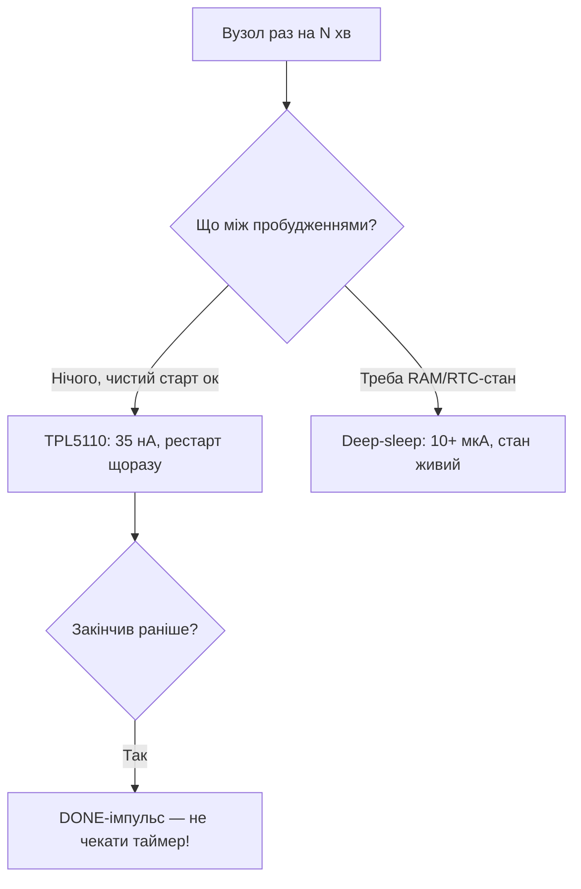

# TPL5110/TPL5111: нанотаймер - 35 нА замість сну

## Призначення

Deep-sleep ESP32 - це 10-150 мкА. TPL5110 - це 35 нА: таймер-ключ, що ФІЗИЧНО відрубує живлення ESP32 і вмикає за розкладом. Для вузла «прокинувся раз на годину» - роки від 18650 замість місяців. Ціна: повний рестарт щоразу (RAM чиста!).

База: старт - [[Home]], сон - [[07-Timeri-Son/03-Sleep-ULP|Sleep]], споживання - [[02-Zhivlennya/03-Spozhivannya|Споживання]], батареї - [[02-Zhivlennya/04-Akumulyatori-TP4056]].

![[assets/img/tpl5110-nanotimer-power-scheme.png|600]]
*Рис. TPL5110 розриває живлення ESP32 MOSFET-ключем; DONE достроково гасить; інтервал - резистором.*

## Характеристики

| Параметр | TPL5110 | TPL5111 |
| --- | --- | --- |
| Свій струм | 35 нА | 35 нА |
| Інтервал | Резистором (100с … 2 год) | + ручний запуск кнопкою |
| Ключ | Зовнішній MOSFET (будь-який струм!) | Той же |
| DONE | Є (дострокове вимкнення) | Є |
| Ціна | $1-2 (плата-модуль) | $1-2 |

```text
Схема (класика):
  LiPo+ ──► [MOSFET P-канальний] ──► VIN ESP32-плати
  TPL5110: DRV ─► затвор MOSFET; DONE ◄── GPIO25 ESP32; DELAY/M ──► резистор на GND
  Робота: таймер спрацював → MOSFET відкрився → ESP32 бутиться → робить справу →
          GPIO25 імпульс DONE → MOSFET закрився → 35 нА до наступного разу.
  Інтервал резистором: R ≈ T / (0.1с/кОм)-шкала з даташиту (перевірити таблицею!).
```

### Mermaid: TPL чи deep-sleep



## Код (Arduino - DONE-імпульс)

```cpp
// ESP32 під TPL5110: зробити справу → DONE → спати до таймера
#define DONE_PIN 25
void setup() {
  pinMode(DONE_PIN, OUTPUT);
  readSensorAndPublish();   // вся робота тут (RAM щоразу чиста!)
  digitalWrite(DONE_PIN, HIGH); delay(50);  // DONE! TPL відрубує живлення
  digitalWrite(DONE_PIN, LOW);
  esp_deep_sleep_start();   // страховка, якщо DONE не дійшов
}
void loop() {}
```

## Типові помилки

| # | Помилка | Чому погано | Як правильно |
| --- | --- | --- | --- |
| 1 | Чекати RTC-пам'ять | Живлення рубається - RAM чиста! | Стан - у NVS/flash |
| 2 | DONE не послано | Чекає весь інтервал дарма | DONE одразу після роботи |
| 3 | MOSFET без запасу | Гріється/падає на піках WiFi | P-канал з Rds×2 запасом |
| 4 | Резистор інтервалу «на око» | Період пливе вдвічі | Таблиця з даташиту + замір |
| 5 | TPL + OTA | Перезапис посеред прошивки | OTA тільки без TPL (джампер!) |
| 6 | Кнопка без антибрязку (5111) | Подвійний старт | RC на вході |

## Офіційні джерела

- [TPL5110/TPL5111 datasheet (TI)](https://www.ti.com/product/TPL5110) - інтервали, DONE, схеми.
- [Adafruit TPL5110 Breakout guide](https://learn.adafruit.com/adafruit-tpl5110-low-power-timer-breakout) - практика, резистори.

## Таблиця інтервалів (резистор DELAY/M - GND)

| Інтервал | R (орієнтир) | Коментар |
| --- | --- | --- |
| 100 с | ~15 кОм | Мінімум практики |
| 10 хв | ~90 кОм | Датчики погоди |
| 30 хв | ~270 кОм | Трекер-стоянка |
| 1 год | ~530 кОм | Класика IoT |
| 2 год | ~1 МОм | Максимум шкали |

> Точні значення - з графіка даташиту (розкид ±20%!). Калібрувати замірений період підстроюванням; температура пливе.

## Вибір MOSFET-ключа

| Параметр | Вимога | Приклад |
| --- | --- | --- |
| Тип | P-канальний, логічний рівень | AO3401, SI2301 |
| Rds(on) | < 50 мОм (падіння < 0.1V при 2A!) | AO3401: 28 мОм |
| Vgs(th) | < −1.5V (відкривається від TPL!) | Перевірити криву, не тільки цифру |
| Струм | З запасом ×2 від піку WiFi (4A+) | Пік 2A → ключ на 4A+ |

```text
TPL5111 + кнопка (ручний запуск між таймерами):
  Кнопка ──► DELAY/M через RC (антибрязк 100нФ!) → примусовий цикл зараз.
  Використання: «показати дані зараз» без чекання години.
```

### ESP-IDF фрагмент (DONE + глибокий сон-страховка)

```c
// DONE на GPIO25, далі — спати щоб там не було
gpio_set_direction(GPIO_NUM_25, GPIO_MODE_OUTPUT);
gpio_set_level(GPIO_NUM_25, 1);
esp_rom_delay_us(50000);
gpio_set_level(GPIO_NUM_25, 0);
esp_deep_sleep_start();  // якщо TPL не відрубав (наприклад, на столі без нього)
```

## TPL5111: ручна кнопка + світлодіод статусу

```text
Відмінність 5111: вхід MANUAL — кнопка примусового циклу + вихід для LED
(блимає під час активного вікна — видно, що вузол живий!).
Схема кнопки: кнопка ──[10к pull-down]──► MANUAL; паралельно 100нФ (антибрязк!).
Застосування: лічильник відвідувачів («натисни і йди»), ручний опит датчика,
перезапуск завислого циклу без розбору корпусу.
```

## NVS-лічильник циклів (стан без RAM!)

```cpp
// ESP32 під TPL: рахувати пробудження через NVS (RTC-пам'ять теж чиста!)
#include <Preferences.h>
Preferences p;
void setup() {
  p.begin("tpl", false);
  uint32_t n = p.getUInt("n", 0) + 1;
  p.putUInt("n", n);
  // кожне 10-те пробудження — повна передача, решта — тільки вимір
  if (n % 10 == 0) fullReport(); else quickMeasure();
  pinMode(25, OUTPUT); digitalWrite(25, HIGH); delay(50);
  digitalWrite(25, LOW);  // DONE
}
void loop() {}
```

## Див. також

- [[Home|Головна]]
- [[07-Timeri-Son/03-Sleep-ULP|Sleep/ULP]]
- [[07-Timeri-Son/02-WDT|WDT]]
- [[02-Zhivlennya/03-Spozhivannya|Споживання]]
- [[02-Zhivlennya/04-Akumulyatori-TP4056|Акумулятори]]
- [[08-Pamyat/01-Partitions-NVS|NVS (стан без RAM)]]
