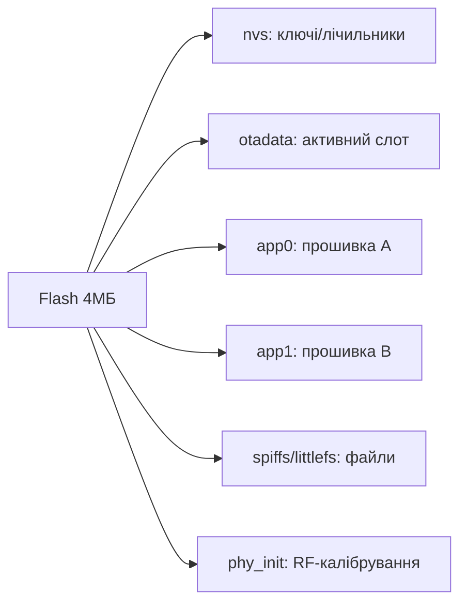

# Partitions та NVS в ESP32

Таблиця розділів (Partition Table) визначає розкладку [[Home|flash-пам'яті]] ESP32: де лежить NVS, OTA-дані, прошивки `app0/app1`, файлові системи. Без розуміння partitions неможливо налаштувати [[01-Hardware/06-Flash-PSRAM|розмір flash]], OTA чи LittleFS.

> [!IMPORTANT]
> Partition Table прошивається за адресою `0x8000` окремо від firmware. Зміна CSV вимагає повного `erase + flash`.

![[assets/img/partitions-nvs-layout-scheme.png|600]]
*Рис. Розкладка 4 МБ: factory/ota_0/ota_1/nvs/otadata/spiffs; NVS - key-value з wear-leveling.*

## Призначення

Partitions та NVS в ESP32 - Default-розкладка 4 МБ; Custom Partition CSV; NVS - key-value сховище. Partition Table прошивається за адресою 0x8000 окремо від firmware. Зміна CSV вимагає повного erase + flash. Сума: 0x9000 + 20K + 8K + 2×1280K + 1408K + 64K = 4096K. Перевіряється командою esptool.py + gen_esp32part.py.

## 1. Default-розкладка 4 МБ

Стандартна схема `default_4MB` (Arduino / IDF `default.csv`):

| Ім'я | Тип / SubType | Offset | Size | Призначення |
| --- | --- | --- | --- | --- |
| `nvs` | data / nvs | `0x9000` | 20 КБ | Key-value сховище [[08-Pamyat/01-Partitions-NVS | NVS]] |
| `otadata` | data / ota | `0xe000` | 8 КБ | Вибір активного OTA-слота |
| `app0` | app / ota_0 | `0x10000` | 1280 КБ | Слот прошивки 0 |
| `app1` | app / ota_1 | `0x150000` | 1280 КБ | Слот прошивки 1 |
| `spiffs` | data / spiffs | `0x290000` | 1408 КБ | Файлова система |
| `coredump` | data / coredump | `0x3F0000` | 64 КБ | Дамп падінь (IDF) |

> [!NOTE]
> Сума: `0x9000 + 20K + 8K + 2×1280K + 1408K + 64K = 4096K`. Перевіряється командою `esptool.py` + `gen_esp32part.py`.

Інші популярні схеми для 4 МБ:

| Схема | app0/app1 | SPIFFS/LittleFS | Коли брати |
| --- | --- | --- | --- |
| `default` | 1280 КБ × 2 | ~1.4 МБ | Універсальна, [[08-Pamyat/03-OTA | OTA]] працює |
| `minimal` | 1920 КБ × 1 (без OTA) | - | Тісний firmware без OTA |
| `no_ota` | 1 × ~2.5 МБ | ~1.3 МБ | Велика прошивка, OTA не треба |
| `huge_app` | 1 × 3 МБ | - | IDF-проєкти з ML/TFLite |
| `custom` | довільні | довільні | Див. нижче |

## 2. Custom Partition CSV

Файл `partitions_custom.csv` - звичайний CSV:

```csv
# Name,   Type, SubType, Offset,  Size, Flags
nvs,      data, nvs,     0x9000,  0x6000,
otadata,  data, ota,     0xf000,  0x2000,
app0,     app,  ota_0,   0x10000, 0x1E0000,
app1,     app,  ota_1,   0x1F0000,0x1E0000,
littlefs, data, spiffs,  0x3D0000,0x30000,
coredump, data, coredump,0x400000,0x10000,
```

> [!TIP]
> Адреси `app0/app1` мають бути вирівняні на `0x10000` (64 КБ). Розмір NVS - кратний 4 КБ (сектор 4096).

Підключення custom-схеми:

| Фреймворк | Як підключити |
| --- | --- |
| ESP-IDF | `idf.py menuconfig` → Partition Table → Custom → вказати CSV |
| Arduino IDE | Tools → Partition Scheme → вибір або `boards.txt` |
| PlatformIO | `board_build.partitions = partitions_custom.csv` в `platformio.ini` |

Перевірка таблиці:

```bash
gen_esp32part.py partitions_custom.csv --verify
gen_esp32part.py partitions_custom.csv partitions_custom.bin
esptool.py --chip esp32 -p /dev/ttyUSB0 write_flash 0x8000 partitions_custom.bin
```

## 3. NVS - key-value сховище

NVS (Non-Volatile Storage) зберігає пари ключ→значення в [[Home|flash]] з wear-leveling і захистом від збою живлення. Ліміти: ключ ≤ 15 символів, namespace ≤ 15 символів, значення: `u8/i32/u64/str/blob`.

| Характеристика | Значення |
| --- | --- |
| Сектор | 4096 байт, мінімум 3 сектори (12 КБ) |
| Знос | wear-leveling, ~100 000 циклів flash |
| Шифрування | опційно через [[08-Pamyat/04-Secure-Boot-Encrypt | Flash Encryption]] |
| Багатопоток | потокобезпечний в IDF, в Arduino - через `Preferences` |

> [!WARNING]
> NVS **не** для частих записів кожну секунду (лічильники, логи). Для цього - RAM + періодичний `commit()`, або [[08-Pamyat/02-Filesystem|файлова система]].

### 3.1 ESP-IDF (C, nvs API)

```c
#include "nvs_flash.h"
#include "nvs.h"

void app_main(void) {
    esp_err_t err = nvs_flash_init();
    if (err == ESP_ERR_NVS_NO_FREE_PAGES || err == ESP_ERR_NVS_NEW_VERSION_FOUND) {
        nvs_flash_erase();          // перший запуск після зміни partitions
        nvs_flash_init();
    }
    nvs_handle_t h;
    nvs_open("storage", NVS_READWRITE, &h);

    int32_t boot_count = 0;
    nvs_get_i32(h, "boot_count", &boot_count);  // якщо нема — залишиться 0
    boot_count++;
    nvs_set_i32(h, "boot_count", &boot_count);
    nvs_set_str(h, "device", "esp32-node-01");
    nvs_commit(h);                  // обов'язково!
    nvs_close(h);
}
```

### 3.2 Arduino (Preferences)

```cpp
#include <Preferences.h>
Preferences prefs;

void setup() {
  Serial.begin(115200);
  prefs.begin("storage", false);          // false = read-write
  uint32_t boot = prefs.getUInt("boot", 0);
  boot++;
  prefs.putUInt("boot", boot);
  prefs.putString("device", "esp32-node-01");
  Serial.printf("Boot #%lu\n", boot);
  prefs.end();
}
void loop() {}
```

### 3.3 MicroPython (NVS через esp32)

```python
from esp32 import NVS
import machine

nvs = NVS("storage")
try:
    boot = nvs.get_i32("boot")
except OSError:
    boot = 0                      # ключ ще не створено
nvs.set_i32("boot", boot + 1)
nvs.commit()
print("Boot #", boot + 1)
```

## 4. Типові операції та помилки

| Команда / Дія | Призначення |
| --- | --- |
| `idf.py partition-table` | Показати поточну розкладку |
| `esptool.py read_flash 0x8000 0x1000 pt.bin` | Зчитати таблицю з пристрою |
| `nvs_flash_erase()` | Очистити NVS (після зміни розміру) |
| `prefs.clear()` | Очистити namespace в Arduino |
| `nvs.commit()` / `nvs_commit()` | Зафіксувати запис |

| Помилка | Причина → Рішення |
| --- | --- |
| `NVS_NO_FREE_PAGES` | Змінено partitions → `nvs_flash_erase()` |
| `Value too long` | Ключ > 15 символів → скоротити |
| `Not found` в `get` | Ключ не існує → передати default |
| Прошивка не стартує після custom CSV | app0 не на `0x10000` → виправити offset |

> [!CAUTION]
> `erase_flash` стирає **все включно з NVS**. Зробіть `read_flash` бекап калібрувань перед стиранням.

### Mermaid: куди що лягло



## Типові помилки

| # | Помилка | Чому погано | Як правильно |
| --- | --- | --- | --- |
| 1 | CSV змінено без erase | Стара таблиця в 0x8000 | Повний erase + flash |
| 2 | NVS як лічильник щоцикл | Знос за місяці | RTC-пам'ять / рідше писати |
| 3 | Немає otadata | OTA неможлива | Два app-слоти + otadata |
| 4 | Розмір app > слота | Обрізана прошивка | Рахувати під .bin + запас |

## Офіційні джерела

- [Partition Tables (ESP-IDF)](https://docs.espressif.com/projects/esp-idf/en/latest/esp32/api-guides/partition-tables.html) - типи, CSV, офсети.
- [NVS Guide](https://docs.espressif.com/projects/esp-idf/en/latest/esp32/api-reference/storage/nvs_flash.html) - ключі, простори імен.

## Див. також

- [[Home]]
- [[01-Hardware/06-Flash-PSRAM]]
- [[08-Pamyat/02-Filesystem|Файлові системи]]
- [[08-Pamyat/03-OTA|OTA]]
- [[08-Pamyat/04-Secure-Boot-Encrypt]]
- [[09-Proshivka/01-ESP-IDF-setup]]
- [[09-Proshivka/02-Arduino-PlatformIO]]
- [[09-Proshivka/04-Esptool-Flash]]
