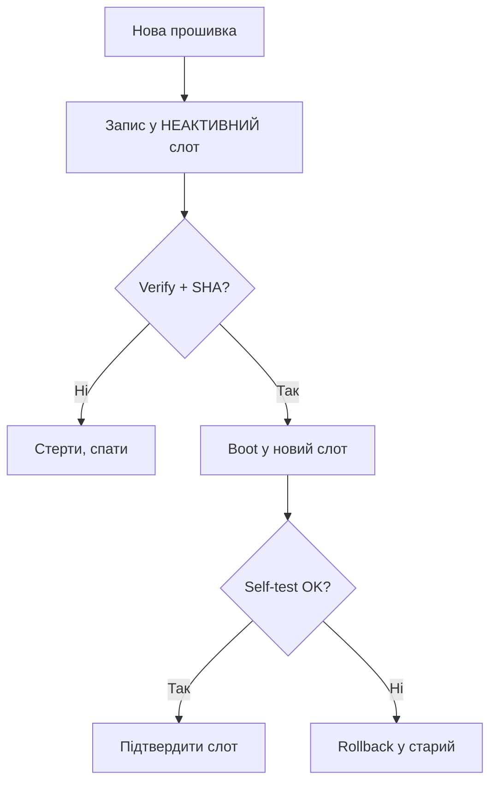

# OTA-оновлення ESP32

OTA (Over-The-Air) дозволяє оновлювати firmware без кабелю - через Wi-Fi. ESP32 має **два OTA-слоти** `app0/app1`: нова прошивка пишеться в неактивний слот, після чого відбувається перемикання. Пов'язано з [[08-Pamyat/01-Partitions-NVS|partitions]], [[01-Hardware/06-Flash-PSRAM|розміром flash]] та [[Home|безпекою]].

> [!IMPORTANT]
> Без `otadata` partition і двох `app`-слотів OTA неможливе. Схема `minimal`/`huge_app` з одним слотом OTA не підтримує.

![[assets/img/ota-dualbank-rollback-scheme.png|600]]
*Рис. Два слоти app0/app1 + otadata: запис → verify → boot → self-test → rollback при провалі.*

## Призначення

OTA-оновлення ESP32 - Як працюють два OTA-слоти; Порівняння методів OTA; AsyncElegantOTA (Arduino) - швидкий старт. Без otadata partition і двох app-слотів OTA неможливе. Схема minimal/huge_app з одним слотом OTA не підтримує. coredump partition допомагає діагностувати, чому новий слот впав і стався rollback.

## 1. Як працюють два OTA-слоти

| Крок | Що відбувається |
| --- | --- |
| 1 | Працює `app0`, `otadata` вказує на `ota_0` |
| 2 | Завантаження нової прошивки → запис в `app1` |
| 3 | Перевірка SHA/MD5 образу |
| 4 | `otadata` переключається на `ota_1`, reboot |
| 5 | Старт `app1` → `esp_ota_mark_app_valid()` підтверджує |
| 6 | Якщо `app1` падає → **rollback** на `app0` |

```text
 ┌────────┐   boot    ┌──────────┐
 │otadata │ ────────► │ app0 *   │  активний
 │ ota_0  │           │ app1     │  ціль OTA
 └────────┘           └──────────┘
```

> [!NOTE]
> `coredump` partition допомагає діагностувати, чому новий слот впав і стався rollback.

## 2. Порівняння методів OTA

| Метод | Транспорт | Плюси | Мінуси | Коли брати |
| --- | --- | --- | --- | --- |
| ArduinoOTA | UDP/TCP, Arduino IDE | Просто, без сервера | Без шифрування, тільки LAN | Домашня розробка |
| AsyncElegantOTA | HTTP, браузер | Веб-інтерфейс, drag&drop | Потрібен доступ до IP | Налагодження в полі |
| HTTPS OTA (IDF) | TLS + HTTP | Шифрування, серверна інфраструктура | Складніше, потрібен сертифікат | Продакшн |
| MQTT OTA | MQTT chunks | Працює через NAT, малий трафік | Повільніше, потрібен брокер | Флот пристроїв |
| BLE OTA | BLE GATT | Без Wi-Fi | Дуже повільно | S3/C3 без мережі |

## 3. AsyncElegantOTA (Arduino) - швидкий старт

```cpp
#include <WiFi.h>
#include <AsyncTCP.h>
#include <ESPAsyncWebServer.h>
#include <AsyncElegantOTA.h>
AsyncWebServer server(80);

void setup() {
  Serial.begin(115200);
  WiFi.begin("SSID", "PASS");
  while (WiFi.status() != WL_CONNECTED) delay(300);
  Serial.println(WiFi.localIP());
  server.on("/", HTTP_GET, [](AsyncWebServerRequest *req){ req->send(200, "text/plain", "OTA ready"); });
  AsyncElegantOTA.begin(&server);   // UI на http://<ip>/update
  server.begin();
}
void loop() { AsyncElegantOTA.loop(); }
```

> [!TIP]
> Обов'язково встановіть пароль: `AsyncElegantOTA.begin(&server, "admin", "secret");` - інакше будь-хто в мережі перепрошиє пристрій.

## 4. ESP-IDF HTTPS OTA

```c
#include "esp_https_ota.h"
esp_http_client_config_t config = {
    .url = "https://example.com/firmware.bin",
    .cert_pem = server_cert_pem_start,   // вбудований CA
    .timeout_ms = 10000,
};
esp_err_t r = esp_https_ota(&config);
if (r == ESP_OK) {
    esp_restart();   // перемикання на новий слот + reboot
}
```

Розширений варіант з колбеком версії та rollback:

```c
esp_ota_handle_t h; const esp_partition_t *p;
// ... esp_https_ota_begin() + esp_https_ota_perform() в циклі ...
esp_ota_mark_app_valid_cancel_rollback();  // підтвердити після self-test
```

## 5. MicroPython OTA (HTTP)

```python
import urequests, machine, esp32
url = "https://example.com/firmware.bin"   # або .py скрипти
r = urequests.get(url)
with open("/update.bin", "wb") as f:
    f.write(r.content)
# далі: перевірка хешу + machine.reset() / кастомний bootloader
print("downloaded", len(r.content))
```

> [!WARNING]
> Стоковий MicroPython не має A/B-слотів з коробки - OTA зазвичай означає оновлення `.py`-файлів або повну перезаливку через `ota` модуль конкретної збірки. Для надійного флоту краще IDF/Arduino.

## 6. Rollback та безпека

| Механізм | Як працює |
| --- | --- |
| `CONFIG_BOOTLOADER_APP_ROLLBACK_ENABLE` | IDF автоматично відкочується при падінні нової прошивки |
| `esp_ota_mark_app_valid()` | Підтвердити після self-test (сенсори, Wi-Fi OK) |
| `esp_ota_mark_app_invalid_rollback_and_reboot()` | Примусовий відкат |
| Secure Boot + підпис | Відхиляє непідписані образи (див. [[08-Pamyat/04-Secure-Boot-Encrypt | Secure Boot]]) |

Чек-лист безпеки OTA:

| # | Вимога |
| --- | --- |
| 1 | Тільки HTTPS (TLS), не чистий HTTP у продакшні |
| 2 | Пароль / токен на `/update` endpoint |
| 3 | Підпис образу (RSA/ECDSA) + Secure Boot V2 |
| 4 | Версія монотонно зростає (anti-downgrade) |
| 5 | Watchdog + self-test перед `mark_valid` |

> [!CAUTION]
> Відкритий `/update` без пароля в публічній мережі = миттєва компрометація флоту. Завжди закривайте аутентифікацією.

### Mermaid: OTA-цикл з відкатом



## Типові помилки

| # | Помилка | Чому погано | Як правильно |
| --- | --- | --- | --- |
| 1 | Один app-слот | Нікуди писати | factory + 2 слоти |
| 2 | Без verify | Битий образ → цегла | SHA + self-test |
| 3 | OTA при 20% батареї | Вимкнення посеред запису | Тільки при >50% / на зарядці |
| 4 | Версія назад бездумно | Anti-rollback цегла | Монотонно вгору |

## Офіційні джерела

- [OTA Guide (ESP-IDF)](https://docs.espressif.com/projects/esp-idf/en/latest/esp32/api-reference/system/ota.html) - слоти, rollback.
- [AsyncElegantOTA (GitHub)](https://github.com/ayushsharma82/AsyncElegantOTA) - швидкий старт Arduino.

## Див. також

- [[Home]]
- [[01-Hardware/06-Flash-PSRAM]]
- [[08-Pamyat/01-Partitions-NVS]]
- [[08-Pamyat/02-Filesystem|Файлові системи]]
- [[08-Pamyat/04-Secure-Boot-Encrypt]]
- [[09-Proshivka/01-ESP-IDF-setup]]
- [[09-Proshivka/02-Arduino-PlatformIO]]
- [[09-Proshivka/04-Esptool-Flash]]
