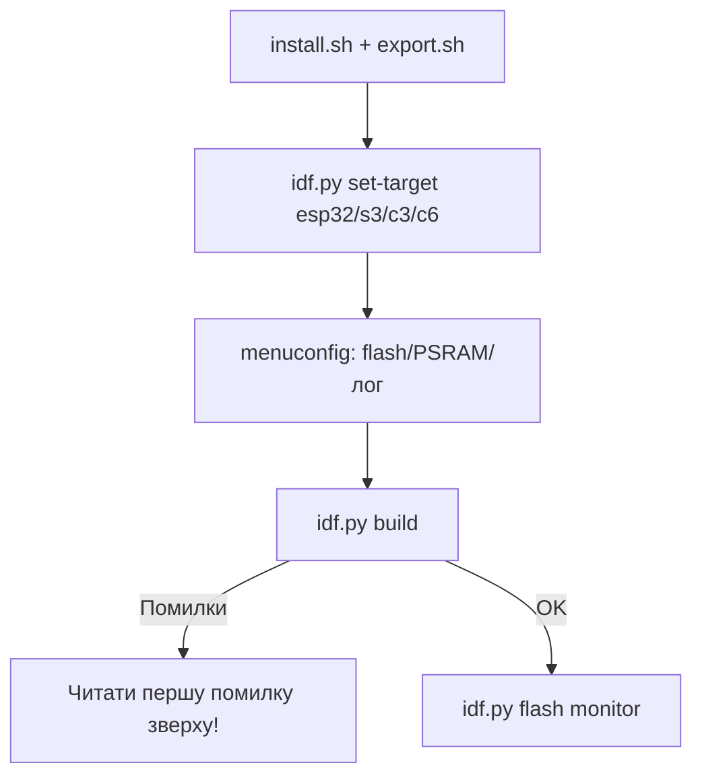

# ESP-IDF Setup 5.x

ESP-IDF - офіційний фреймворк Espressif: максимум контролю, FreeRTOS, [[08-Pamyat/01-Partitions-NVS|partitions]], [[08-Pamyat/03-OTA|OTA]], [[08-Pamyat/04-Secure-Boot-Encrypt|Secure Boot]]. Складніший за Arduino, але обов'язковий для продакшну. Працює поверх того ж [[Home|заліза]] та [[01-Hardware/06-Flash-PSRAM|flash]].

> [!NOTE]
> IDF 5.x вимагає Python 3.8+, CMake 3.16+, Git. ESP32-C6/H2 підтримуються з IDF 5.1+.

![[assets/img/idf-setup-build-scheme.png|600]]
*Рис. IDF-цикл: install → export → set-target → menuconfig → build → flash → monitor.*

## Призначення

ESP-IDF Setup 5.x - Встановлення; Linux (Ubuntu/Debian); Windows. ESP-IDF - офіційний фреймворк Espressif: максимум контролю, FreeRTOS, [[08-Pamyat/01-Partitions-NVS]], [[08-Pamyat/03-OTA|OTA]], [[08-Pamyat/04-Secure-Boot-Encrypt]]. Складніший за Arduino, але обов'язковий для продакшну. Працює поверх того ж Home та [[01-Hardware/06-Flash-PSRAM]]. IDF 5.x вимагає Python 3.8+, CMake 3.16+, Git. ESP32-C6/H2 підтримуються з IDF 5.1+.

## 1. Встановлення

### Linux (Ubuntu/Debian)

```bash
sudo apt install git wget flex bison gperf python3 python3-pip python3-venv \
  cmake ninja-build ccache libffi-dev libssl-dev dfu-util libusb-1.0-0
mkdir -p ~/esp && cd ~/esp
git clone --recursive https://github.com/espressif/esp-idf.git -b v5.3
cd esp-idf && ./install.sh esp32,esp32s3,esp32c3
source export.sh   # кожна нова сесія терміналу!
```

### Windows

| Варіант | Коли брати |
| --- | --- |
| **Offline Installer** (`esp-idf-tools-setup`) | Новачкам, все з коробки |
| **VS Code Extension** (Espressif IDF) | Зручна розробка + флеш кнопкою |
| Ручне (як Linux, через PowerShell) | Досвідченим |

Після offline-інсталера: ярлик `ESP-IDF 5.x CMD` вже містить `export`.

> [!TIP]
> Додайте alias: `alias idf='source ~/esp/esp-idf/export.sh'`. Перевірка: `idf.py --version`.

| Команда перевірки | Очікуваний результат |
| --- | --- |
| `python3 --version` | ≥ 3.8 |
| `cmake --version` | ≥ 3.16 |
| `idf.py --version` | v5.x |
| `esptool.py version` | ≥ 4.x |

## 2. Перший проєкт: blink

```bash
idf.py create-project blink
cd blink
idf.py set-target esp32s3        # або esp32 / esp32c3
idf.py menuconfig                # конфігурація (див. нижче)
idf.py build                     # компіляція
idf.py -p /dev/ttyUSB0 flash     # прошивка
idf.py -p /dev/ttyUSB0 monitor   # serial 115200 + логи
# все разом:
idf.py -p /dev/ttyUSB0 flash monitor
```

Код `main/blink_example_main.c` (скорочено):

```c
#include "freertos/FreeRTOS.h"
#include "freertos/task.h"
#include "driver/gpio.h"
#define LED_GPIO 2
void app_main(void) {
    gpio_reset_pin(LED_GPIO);
    gpio_set_direction(LED_GPIO, GPIO_MODE_OUTPUT);
    while (1) {
        gpio_set_level(LED_GPIO, 1);
        vTaskDelay(pdMS_TO_TICKS(500));
        gpio_set_level(LED_GPIO, 0);
        vTaskDelay(pdMS_TO_TICKS(500));
    }
}
```

Вихід з монітора: `Ctrl+]`. Збірка артефактів лежить у `build/`.

## 3. menuconfig - ключові розділи

| Розділ | Що налаштувати |
| --- | --- |
| Serial flasher config | Flash size (4/8/16 МБ), mode DIO/QIO, freq 40/80 МГц |
| Partition Table | Single factory / Two OTA / Custom CSV ([[08-Pamyat/01-Partitions-NVS | деталі]]) |
| Component config → FreeRTOS | Tick rate 1000 Гц, stack check |
| Component config → ESP System | Log level, panic handler |
| Component config → Wi-Fi / BT | Буфери, power-save |
| Security features | Secure Boot, Flash Encryption ([[08-Pamyat/04-Secure-Boot-Encrypt | деталі]]) |

> [!WARNING]
> Невірний Flash size в menuconfig (напр. 4 МБ замість 8 МБ) = невидима половина пам'яті та падіння OTA. Звіряйте з маркуванням чипа.

## 4. Таблиця команд idf.py

| Команда | Призначення |
| --- | --- |
| `idf.py create-project <name>` | Новий проєкт |
| `idf.py set-target esp32s3` | Зміна чипа (перетирає build/) |
| `idf.py menuconfig` | TUI-конфігуратор |
| `idf.py build` | Компіляція |
| `idf.py flash` | Прошивка (порт з `menuconfig` або `-p`) |
| `idf.py monitor` | Serial-монітор, логи, `Ctrl+]` вихід |
| `idf.py erase-flash` | Повне стирання [[01-Hardware/06-Flash-PSRAM | flash]] |
| `idf.py partition-table` | Показати розкладку partitions |
| `idf.py size` | Розмір app/DRAM/IRAM по компонентах |
| `idf.py fullclean` | Видалити build/ повністю |

## 5. JTAG-дебаг (коротко)

Вбудований USB-JTAG на S3/C3/H2 або зовнішній ESP-Prog:

```bash
openocd -f board/esp32s3-builtin.cfg
# в іншому терміналі:
xtensa-esp32s3-elf-gdb build/blink.elf -ex "target remote :3333"
(gdb) mon reset halt
(gdb) flushregs
(gdb) thb app_main
(gdb) c
```

> [!TIP]
> Повний розбір - у [[09-Proshivka/05-JTAG-Debug|JTAG-Debug]]. Для старту достатньо `monitor` + `ESP_LOGI`.

## 6. Типові помилки

| Помилка | Рішення |
| --- | --- |
| `No such file: export.sh` | Відкрити через ярлик IDF CMD або `source ~/esp/esp-idf/export.sh` |
| `Failed to connect` | Утримувати BOOT, див. [[09-Proshivka/04-Esptool-Flash | Esptool-Flash]] |
| `cmake version too old` | Оновити CMake ≥ 3.16 |
| `Partition too small` | Збільшити app-partition або прибрати компоненти |

### Mermaid: перший проєкт



## Офіційні джерела

- [ESP-IDF Get Started](https://docs.espressif.com/projects/esp-idf/en/latest/esp32/get-started/index.html) - встановлення, перший проєкт.
- [IDF Component Manager](https://docs.espressif.com/projects/idf-component-manager/) - залежності.

## Див. також

- [[Home]]
- [[01-Hardware/06-Flash-PSRAM]]
- [[08-Pamyat/01-Partitions-NVS]]
- [[08-Pamyat/03-OTA|OTA]]
- [[08-Pamyat/04-Secure-Boot-Encrypt]]
- [[09-Proshivka/02-Arduino-PlatformIO]]
- [[09-Proshivka/04-Esptool-Flash]]
- [[09-Proshivka/05-JTAG-Debug]]
