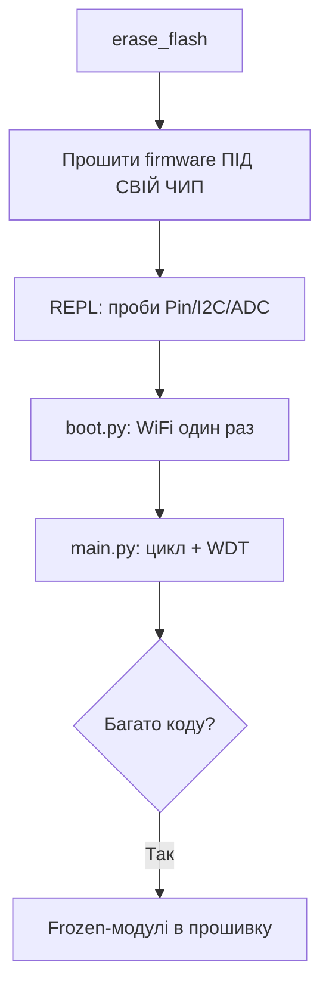

# MicroPython на ESP32

MicroPython - Python 3 прямо на [[Home|мікроконтролері]]: REPL по USB, `boot.py/main.py`, швидкі прототипи без компіляції. Ціна - повільніше за C і менше вільної RAM (частина з'їдена інтерпретатором + [[01-Hardware/06-Flash-PSRAM|PSRAM]] налаштуваннями).

> [!NOTE]
> Беріть офіційні збірки з `micropython.org/download/esp32/` під свій чип: `ESP32`, `ESP32-S3`, `ESP32-C3` - образи **несумісні** між чипами.

![[assets/img/micropython-flash-tools-scheme.png|600]]
*Рис. MicroPython: erase → firmware.bin → Thonny/mpremote → boot.py/main.py → REPL.*

## Призначення

MicroPython на ESP32 - Прошивка firmware через esptool; Thonny: перше підключення; boot.py та main.py. Baud у Thonny зазвичай авто. Якщо кракозябри - перевірте, що в [[09-Proshivka/02-Arduino-PlatformIO]] монітор закритий: два процеси не можуть тримати один порт. 4. Залізо: Pin / I2C / ADC / PWM.

## 1. Прошивка firmware через esptool

| Крок | Команда |
| --- | --- |
| 1. Стерти flash | `esptool.py --chip esp32 -p /dev/ttyUSB0 erase_flash` |
| 2. Залити MicroPython | `esptool.py --chip esp32 -p /dev/ttyUSB0 -b 460800 write_flash -z 0x1000 ESP32_GENERIC-20241129-v1.24.1.bin` |
| 3. S3 (offset інший!) | `write_flash -z 0x0 ESP32_GENERIC_S3-...bin` |
| 4. Перевірка | Натиснути EN, відкрити порт на 115200, має з'явитися `>>>` |

> [!WARNING]
> Offset `0x1000` - для класичного ESP32; для S3/C3 - `0x0`. Невірний offset = мовчання в терміналі. Звіряйте з README на сторінці завантаження.

Таблиця файлів firmware:

| Чип | Файл | Offset |
| --- | --- | --- |
| ESP32 | `ESP32_GENERIC-*.bin` | `0x1000` |
| ESP32-S3 | `ESP32_GENERIC_S3-*.bin` | `0x0` |
| ESP32-C3 | `ESP32_GENERIC_C3-*.bin` | `0x0` |

## 2. Thonny: перше підключення

| Крок | Дія |
| --- | --- |
| 1 | Встановити Thonny, Tools → Options → Interpreter → MicroPython (ESP32) |
| 2 | Вибрати порт `/dev/ttyUSB0` / `COM3` |
| 3 | Stop/Restart → з'являється REPL `>>>` |
| 4 | View → Files - панель файлів на пристрої |

> [!TIP]
> Baud у Thonny зазвичай авто. Якщо кракозябри - перевірте, що в [[09-Proshivka/02-Arduino-PlatformIO|іншій IDE]] монітор закритий: два процеси не можуть тримати один порт.

## 3. boot.py та main.py

| Файл | Коли виконується | Що класти |
| --- | --- | --- |
| `boot.py` | Першим, при кожному старті | Wi-Fi, hostname, watchdog |
| `main.py` | Після `boot.py` | Основний цикл програми |

```python
# boot.py — мінімальний мережевий старт
import network, time
wlan = network.WLAN(network.STA_IF)
wlan.active(True)
wlan.connect("SSID", "PASS")
for _ in range(20):
    if wlan.isconnected():
        break
    time.sleep(0.5)
print("net:", wlan.ifconfig() if wlan.isconnected() else "OFFLINE")
```

```python
# main.py — блималка + REPL-доступність
from machine import Pin
import time
led = Pin(2, Pin.OUT)
while True:
    led.value(not led.value())
    time.sleep(0.5)
```

> [!CAUTION]
> Безкінечний `while True` без пауз блокує watchdog. Додайте `time.sleep()` або `wdt.feed()`.

## 4. Залізо: Pin / I2C / ADC / PWM

```python
from machine import Pin, I2C, ADC, PWM
# GPIO (порівняйте з Arduino digitalWrite / IDF gpio_set_level)
led = Pin(2, Pin.OUT)
btn = Pin(0, Pin.IN, Pin.PULL_UP)
led.value(1)
# I2C сканер (SDA=21, SCL=22 на більшості DevKit)
i2c = I2C(0, scl=Pin(22), sda=Pin(21), freq=400000)
print("i2c:", [hex(a) for a in i2c.scan()])
# ADC (attenuation обов'язкова для 3.3 В!)
adc = ADC(Pin(34))
adc.atten(ADC.ATTN_11DB)
print("adc:", adc.read())
# PWM / Servo-ish
pwm = PWM(Pin(5), freq=1000, duty=512)
```

ESP-IDF-еквівалент (C) для орієнтиру:

```c
gpio_set_level(GPIO_NUM_2, 1);   // vs Pin(2).value(1)
```

Arduino-еквівалент:

```cpp
digitalWrite(2, HIGH);           // vs Pin(2).value(1)
```

## 5. Мережа та пакети (mpipkg / mip)

```python
import network
ap = network.WLAN(network.AP_IF)   # точка доступу для налаштування
ap.active(True)
ap.config(essid="ESP32-SETUP", password="12345678")
# встановлення пакетів (MicroPython ≥ 1.20: mip замість upip)
import mip
mip.install("umqtt.simple")
mip.install("github:org/repo/package")
```

| Інструмент | Команда | Коли |
| --- | --- | --- |
| `mip` (нове) | `mip.install("umqtt.simple")` | MicroPython 1.20+ |
| `upip` (старе) | `upip.install("micropython-umqtt.simple")` | Старі збірки |
| `mpy-cross` | Компіляція `.py` → `.mpy` | Економія RAM/flash |
| `rshell/ampy` | Заливка файлів з CLI | Без Thonny |

> [!NOTE]
> Пакети ставляться в `/lib`. Для [[08-Pamyat/02-Filesystem|економії flash]] компілюйте важкі модулі в `.mpy`.

## 6. Типові помилки

| Помилка | Рішення |
| --- | --- |
| Немає `>>>`, тиша | Невірний offset / чужий бінарник чипа, перепрошити (див. [[09-Proshivka/04-Esptool-Flash | Esptool]]) |
| `ENOMEM` | Забагато імпортів, компілюйте в `.mpy`, приберіть буфери |
| `OSError: [Errno 19] ENODEV` на I2C | Невірні піни / немає pull-up 4.7к |
| Wi-Fi не конектиться | 5 ГГц мережа (ESP32 тільки 2.4 ГГц!), довгий пароль |
| REPL підвисає в `main.py` | `Ctrl+C` в Thonny, перейменуйте `main.py` через Files-панель |

### Mermaid: старт з MicroPython



## Офіційні джерела

- [MicroPython ESP32](https://docs.micropython.org/en/latest/esp32/quickref.html) - quickref по периферії.
- [mpremote / Thonny](https://docs.micropython.org/en/latest/reference/mpremote.html) - робота з платою.

## Див. також

- [[Home]]
- [[01-Hardware/06-Flash-PSRAM]]
- [[08-Pamyat/01-Partitions-NVS]]
- [[08-Pamyat/02-Filesystem|Файлові системи]]
- [[09-Proshivka/01-ESP-IDF-setup]]
- [[09-Proshivka/02-Arduino-PlatformIO]]
- [[09-Proshivka/04-Esptool-Flash]]
- [[09-Proshivka/05-JTAG-Debug]]
