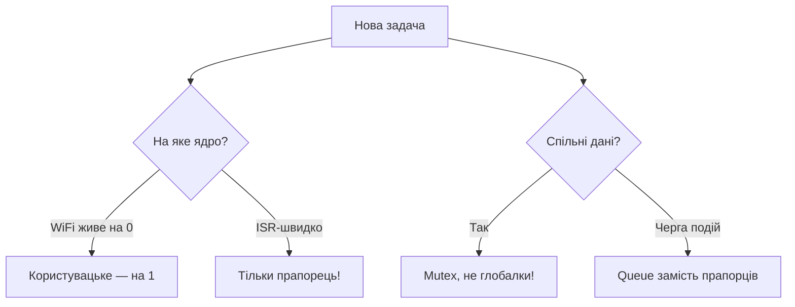

# FreeRTOS патерни на ESP32

## Призначення

FreeRTOS в ESP-IDF - це SMP-ядро (два ядра на ESP32/S3), поверх якого живуть Wi-Fi, BT, TCP/IP та весь `app_main`. Ця нотатка - збірка перевірених патернів: як різати логіку на задачі, не голодувати IDLE, чим відрізняються черги від прямих повідомлень, коли брати event groups і таймери, як пінити задачі на ядра (бо Wi-Fi живе на ядрі 0!), як годувати watchdog, як спати через tickless idle + light sleep, що можна в ISR (IRAM, ніяких `printf`), як лікувати priority inversion м'ютексами та як не влетіти в deadlock. Фінальний приклад - кінцевий автомат WiFi-MQTT на `switch/enum`. Базовий старт - [[09-Proshivka/01-ESP-IDF-setup]], фоновий нагляд - [[07-Timeri-Son/02-WDT|WDT]], сон - [[07-Timeri-Son/03-Sleep-ULP|Sleep/ULP]] (якщо нотатки ще немає - див. MOC), оновлення - [[08-Pamyat/03-OTA|OTA]].

> [!NOTE]
> ESP-IDF стартує FreeRTOS автоматично. Ніколи не кличте `vTaskStartScheduler()` самі - ваша точка входу це `app_main()`, яка вже виконується в задачі `main` з пріоритетом 1.

![[assets/img/freertos-patterns-scheme.png|600]]

## 1. Задачі та пріоритети: не голодувати IDLE

| Поняття | Значення на ESP-IDF | Правило |
| --- | --- | --- |
| `tskIDLE_PRIORITY` = 0 | На кожному ядрі своя IDLE-задача | Ніколи не ставте робочі задачі на 0 без потреби |
| `configMAX_PRIORITIES` = 25 | Діапазон 0-24 | Тримайте прикладну логіку в 2-10 |
| Пріоритет Wi-Fi/BT | Високий (20+) на ядрі 0 | Не змагайтесь з ними пріоритетом 23 |
| `vTaskDelay()` / блокування | Віддає CPU | Кожен цикл задачі мусить блокуватись |
| `while(1){}` без yield | Голод IDLE → TWDT ресет | Заборонено, див. [[07-Timeri-Son/02-WDT | WDT]] |
| Стек задачі | Вказується в **байтах** (не словах!) | Сенсори 2048-3072, мережа 4096-8192 |

> [!WARNING]
> IDLE-задача годує Task Watchdog і чистить пам'ять видалених задач. Задача з пріоритетом вище, що ніколи не блокується, заморить IDLE - отримаєте `Task watchdog got triggered ... IDLE0`.

Код ESP-IDF - створення задач з піном і без:

```c
#include "freertos/FreeRTOS.h"
#include "freertos/task.h"

void sensor_task(void *arg) {
    TickType_t last = xTaskGetTickCount();
    for (;;) {
        // 1. читання сенсора
        // 2. відправка в чергу
        xTaskDelayUntil(&last, pdMS_TO_TICKS(100)); // строга періодика 10 Гц
    }
}

void app_main(void) {
    // мережева задача на APP_CPU, сенсорна — без affinity (мігрує)
    xTaskCreatePinnedToCore(sensor_task, "sensor", 3072, NULL, 5, NULL, 1);
    xTaskCreate(sensor_task, "sensor_any", 3072, NULL, 5, NULL); // tskNO_AFFINITY
}
```

Код Arduino - FreeRTOS доступний прямо в скетчі:

```cpp
void TaskBlink(void *arg) {
  for (;;) {
    digitalWrite(LED_BUILTIN, !digitalRead(LED_BUILTIN));
    vTaskDelay(pdMS_TO_TICKS(500));
  }
}

void setup() {
  pinMode(LED_BUILTIN, OUTPUT);
  // Arduino loop() сам є задачею з пріоритетом 1 на ядрі 1
  xTaskCreatePinnedToCore(TaskBlink, "blink", 2048, NULL, 2, NULL, 1);
}
void loop() {
  vTaskDelay(pdMS_TO_TICKS(1000)); // не голодувати IDLE!
}
```

Код MicroPython - потоків мало, емулюємо кооперативом:

```python
import _thread, time
from machine import Pin
led = Pin(2, Pin.OUT)
def blink():
    while True:
        led.value(not led.value())
        time.sleep(0.5)  # аналог vTaskDelay — віддає GIL
_thread.start_new_thread(blink, ())
while True:
    time.sleep(1)
```

## 2. Черги vs прямі повідомлення (task notifications)

| Критерій | `xQueue` | `xTaskNotify*` / `ulTaskNotifyTake` |
| --- | --- | --- |
| Швидкість | Повільніше (копіювання + блокування) | Найшвидший IPC, ~45% швидше |
| Пам'ять | Буфер на N елементів | 32-бітне значення в TCB, 0 RAM |
| Кілька відправників | Так, багато продюсерів | Ні, 1:1 (один отримувач чітко) |
| Кілька отримувачів | Так (але кожен елемент - одному) | Ні |
| Дані | Будь-яка структура (копія) | 32 біти або вказівник (без копії) |
| З ISR | `xQueueSendFromISR()` | `vTaskNotifyGiveFromISR()` - легше |
| Коли брати | Сенсор → обробка, команди, логер | Сигнал «прокинулась», подія GPIO |

> [!TIP]
> Правило великого пальця: потік даних - черга; сигнал події - notification. Не тягніть структуру 256 байт через notification вказівником на стек - вказівник протухне.

Код ESP-IDF - черга сенсор → мережа:

```c
QueueHandle_t q;
typedef struct { float temp; float hum; uint32_t seq; } sample_t;

void sensor_task(void *arg) {
    sample_t s = {0};
    for (;;) {
        s.temp = 25.0f; s.seq++;
        xQueueSend(q, &s, pdMS_TO_TICKS(50)); // timeout, не block forever
        vTaskDelay(pdMS_TO_TICKS(1000));
    }
}
void net_task(void *arg) {
    sample_t s;
    for (;;) {
        if (xQueueReceive(q, &s, portMAX_DELAY) == pdTRUE) {
            // publish MQTT
        }
    }
}
void app_main(void) {
    q = xQueueCreate(16, sizeof(sample_t));
    xTaskCreatePinnedToCore(sensor_task, "sens", 3072, NULL, 5, NULL, 1);
    xTaskCreatePinnedToCore(net_task, "net", 4096, NULL, 6, NULL, 1);
}
```

Код ESP-IDF - пряме повідомлення з ISR кнопки:

```c
TaskHandle_t btn_task_h = NULL;
void IRAM_ATTR gpio_isr(void *arg) {
    BaseType_t hp = pdFALSE;
    vTaskNotifyGiveFromISR(btn_task_h, &hp);
    portYIELD_FROM_ISR(hp);
}
void btn_task(void *arg) {
    for (;;) {
        ulTaskNotifyTake(pdTRUE, portMAX_DELAY); // спати до натискання
        // debounce + дія
    }
}
```

## 3. Event Groups: прапорці «дочекатись кількох подій»

| Властивість | Значення |
| --- | --- |
| Розмір | 24 біти користувача (старші 8 - служб.) |
| Операції | `xEventGroupSetBits/WaitBits/ClearBits`, `...FromISR` |
| Режими очікування | `pdTRUE` - чекати ВСІ біти, `pdFALSE` - БУДЬ-ЯКИЙ |
| Автоочищення | `xClearOnExit=pdTRUE` - біти гаснуть при виході |
| Коли брати | Wi-Fi connected + MQTT connected + NTP sync → старт |
| Коли НЕ брати | Передача даних (беріть чергу!), лічильники (беріть семафор) |

```c
#include "freertos/event_groups.h"
#define BIT_WIFI_OK BIT0
#define BIT_MQTT_OK BIT1
#define BIT_NTP_OK  BIT2
EventGroupHandle_t ev;

void logic_task(void *arg) {
    EventBits_t b = xEventGroupWaitBits(ev, BIT_WIFI_OK | BIT_MQTT_OK | BIT_NTP_OK,
        pdTRUE, pdTRUE, portMAX_DELAY); // всі + очистити
    // старт основної логіки
    for (;;) { vTaskDelay(pdMS_TO_TICKS(1000)); }
}
void wifi_cb(void) { xEventGroupSetBits(ev, BIT_WIFI_OK); }
void app_main(void) {
    ev = xEventGroupCreate();
    xTaskCreate(logic_task, "logic", 4096, NULL, 5, NULL);
}
```

## 4. Програмні таймери (Timer Service)

| Параметр | Значення |
| --- | --- |
| Задача-демон `Tmr Svc` | Пріоритет `CONFIG_FREERTOS_TIMER_TASK_PRIORITY` (зазвичай 1-2), ядро 0 |
| Точність | Рівень тіку (1 мс при 1000 Гц), не для мікросекунд |
| One-shot vs auto-reload | `pdFALSE` / `pdTRUE` |
| Колбек-контекст | Задача таймера - **не блокуватись**, тільки SetBits/Send |
| Важка робота | З колбека - `xQueueSend()`, робота - в задачі |
| Альтернатива | `esp_timer` (точніший, мкс, ISR-диспетч) - див. [[07-Timeri-Son/01-Timeri-MCPWM-PCNT-RMT | Таймери]] |

```c
#include "freertos/timers.h"
TimerHandle_t t;
void tmr_cb(TimerHandle_t h) {
    // тільки швидке: дати семафор / нотифікацію
}
void app_main(void) {
    t = xTimerCreate("poll", pdMS_TO_TICKS(5000), pdTRUE, NULL, tmr_cb);
    xTimerStart(t, 0);
}
```

Arduino-еквівалент (простіше через `Ticker`-стиль або `millis()`):

```cpp
uint32_t last = 0;
void loop() {
  if (millis() - last > 5000) { last = millis(); pollSensors(); }
}
```

## 5. Pinning на ядра: Wi-Fi живе на 0

| Ядро | Хто там живе | Що пінити вам |
| --- | --- | --- |
| Core 0 = PRO_CPU | Wi-Fi, BT, TCP/IP, `esp_timer`, Timer Service | НЕ кладіть важкі цикли сюди |
| Core 1 = APP_CPU | `app_main`, Arduino `loop()` | Сенсори, дисплей, логіка, MQTT-publish |
| `tskNO_AFFINITY` | Міграція між ядрами | ОК для легких задач, гірше кеш |
| `CONFIG_FREERTOS_UNICORE` | Тільки Core 0 (C3/S2 одноядерні) | Pinning ігнорується, код має збиратись і так |
| FPU-пастка | Задача, що торкнулась `float`, автопіниться | Не дивуйтесь міграційним артефактам |

> [!CAUTION]
> Важкий цикл з `float`-математикою на Core 0 + активний Wi-Fi = джиттер пінгів і розриви MQTT. Міряйте `vTaskGetRunTimeStats()`.

```c
// Правило: мережа-споживач на 1, Wi-Fi не чіпаємо
xTaskCreatePinnedToCore(mqtt_task, "mqtt", 6144, NULL, 6, NULL, 1);
xTaskCreatePinnedToCore(display_task, "disp", 4096, NULL, 4, NULL, 1);
// ISR-сервіс і системне — хай лишаються на 0
```

Таблиця типових пріоритетів проєкту:

| Задача | Ядро | Пріоритет | Стек |
| --- | --- | --- | --- |
| IDLE | 0/1 | 0 | системний |
| `loop` / `main` | 1 | 1 | 8 КБ |
| Кнопки/LED | 1 | 2-3 | 2 КБ |
| Сенсори I2C | 1 | 5 | 3 КБ |
| Дисплей/LVGL | 1 | 4 | 4-8 КБ |
| MQTT-publish | 1 | 6 | 6 КБ |
| TWDT-контроль | будь-яке | 7+ | 2 КБ |

## 6. Watchdog задач (TWDT): годуйте вчасно

| Параметр | Значення |
| --- | --- |
| Що стежить | IDLE0/IDLE1 за замовчуванням, + ваші підписки |
| Таймаут | `CONFIG_ESP_TASK_WDT_TIMEOUT_S` (типово 5 с) |
| Підписка | `esp_task_wdt_add(NULL)` - поточна задача |
| Годування | `esp_task_wdt_reset()` в циклі |
| Панік-режим | `CONFIG_ESP_TASK_WDT_PANIC` - паніка замість варнінгу |
| Довгі операції | `erase_flash`, bulk-write - збільшити таймаут або відписатись тимчасово |

```c
#include "esp_task_wdt.h"
void heavy_task(void *arg) {
    esp_task_wdt_add(NULL);
    for (;;) {
        do_chunk_of_work();          // < 5 с!
        esp_task_wdt_reset();        // погодувати
        vTaskDelay(pdMS_TO_TICKS(10)); // дати IDLE подихати
    }
}
```

> [!TIP]
> Лог `Task watchdog got triggered ... Tasks currently running: main` = задача `main`/`loop` крутиться без `delay`. Деталі - [[07-Timeri-Son/02-WDT|WDT]].

## 7. Tickless idle + light sleep: спати між тіками

| Опція | Що робить |
| --- | --- |
| `CONFIG_FREERTOS_USE_TICKLESS_IDLE` | Зупиняє періодичний тік, ставить таймер на найближчий дедлайн |
| `esp_pm_configure()` + `ESP_PM_CPU_FREQ_MAX` | DFS + автовхід у light sleep |
| Wi-Fi modem-sleep | Радіо прокидається на beacon, CPU спить |
| `esp_light_sleep_start()` | Ручний вхід, прокидання від GPIO/UART/таймера |
| Заборона сну | `esp_pm_lock_acquire()` на час чутливої операції (I2S, RMT-tx) |

```c
#include "esp_pm.h"
void app_main(void) {
    esp_pm_config_t cfg = {
        .max_freq_mhz = 240,
        .min_freq_mhz = 40,
        .light_sleep_enable = true, // tickless + light sleep
    };
    esp_pm_configure(&cfg);
    xTaskCreate(sensor_task, "sens", 3072, NULL, 5, NULL);
}
```

> [!WARNING]
> Light sleep гасить APB-периферію. Логування в момент засинання може дати кракозябри - флеште UART (`fflush(stdout)`) перед сном.

## 8. ISR-правила: IRAM, ніяких printf

| Правило | Чому |
| --- | --- |
| `IRAM_ATTR` на хендлері | Flash може бути недоступна (кеш вимкнено при записі) |
| Тільки `...FromISR()` API | Звичайні викликають assert або deadlock |
| Ніяких `printf` / `ESP_LOGx` | `printf` бере м'ютекс і ходить у flash → креш |
| Коротко: < 10 мкс | Довге - відкласти в задачу через чергу/semaphore |
| `portYIELD_FROM_ISR(hp)` | Запросити перепланування, якщо розбудили вищий пріоритет |
| Спільні дані | `volatile` + критична секція або atomic |

```c
static QueueHandle_t isr_q;
void IRAM_ATTR pulse_isr(void *arg) {
    uint32_t t = xTaskGetTickCountFromISR();
    BaseType_t hp = pdFALSE;
    xQueueSendFromISR(isr_q, &t, &hp);
    if (hp) portYIELD_FROM_ISR(hp);
}
// Погано в ISR: printf, vTaskDelay, xQueueSend (без FromISR), malloc, ESP_LOGI
```

MicroPython-порівняння (ISR = hard IRQ, ще суворіше):

```python
from machine import Pin
def cb(p):
    # тільки прапорець! ніяких print/i2c/alloc
    global flag
    flag = True
btn = Pin(0, Pin.IN, Pin.PULL_UP)
btn.irq(trigger=Pin.IRQ_FALLING, handler=cb)
```

## 9. Priority inversion + mutex: успадкування пріоритету

| Примітив | Взаємне виключення | Успадкування пріоритету | ISR | Коли |
| --- | --- | --- | --- | --- |
| `xSemaphoreCreateMutex()` | Так | Так (головна фіча) | Ні | Спільний I2C/SPI, логер |
| Бінарний семафор | Ні (синхронізація) | Ні | Так (Give) | Сигнал ISR → задача |
| Counting семафор | Ні (ресурси N шт) | Ні | Так | Пул буферів |
| Recursive mutex | Так (той же власник N разів) | Так | Ні | Рідко, краще рефактор |
| Спинлок `portMUX` | Так (короткі ISR-секції) | Н/Д | Так | 2-3 інструкції, не задачі! |

Сценарій інверсії: L(2) тримає mutex → H(8) блокується на mutex → M(5) витісняє L → H чекає, хоча важливіший за M. М'ютекс FreeRTOS тимчасово піднімає L до 8 (успадкування) - M не влізе.

```c
SemaphoreHandle_t i2c_mtx;
void task_a(void *arg) {
    for (;;) {
        if (xSemaphoreTake(i2c_mtx, pdMS_TO_TICKS(100)) == pdTRUE) {
            i2c_read_sensor();       // критична секція коротка!
            xSemaphoreGive(i2c_mtx);
        }
        vTaskDelay(pdMS_TO_TICKS(50));
    }
}
void app_main(void) {
    i2c_mtx = xSemaphoreCreateMutex();
    xTaskCreate(task_a, "a", 3072, NULL, 5, NULL);
}
```

## 10. Deadlock-антипатерни

| Антипатерн | Чим замінити |
| --- | --- |
| Два м'ютекси в різному порядку (A→B в одній задачі, B→A в іншій) | Глобальний порядок захоплення: завжди A потім B |
| `Take` без таймауту (`portMAX_DELAY`) на прикладному м'ютексі | Таймаут 50-100 мс + лічильник + `ESP_LOGW` |
| Виклик блокуючої функції всередині критичної секції | Винести `vTaskDelay/xQueueReceive` за межі `ENTER_CRITICAL` |
| `vTaskDelete()` чужої задачі, що тримає м'ютекс | Прапорець `stop_requested` + `vTaskDelete(NULL)` (самоліквідація) |
| Callback Wi-Fi, що чекає задачу, яку сам заблокував | Event bits замість очікування |
| Рекурсивний `Take` звичайного mutex двічі | Recursive mutex або прибрати вкладеність |

```c
// Правильний порядок: завжди bus_mtx -> log_mtx, ніколи навпаки
xSemaphoreTake(bus_mtx, pdMS_TO_TICKS(100));
xSemaphoreTake(log_mtx, pdMS_TO_TICKS(100));
// ... робота ...
xSemaphoreGive(log_mtx);
xSemaphoreGive(bus_mtx);
```

## 11. State machine WiFi-MQTT на switch/enum (повний приклад)

| Стан | Вхід | Вихід |
| --- | --- | --- |
| `ST_WIFI_DOWN` | Старт / розрив | `esp_wifi_connect()` |
| `ST_WIFI_UP` | `WIFI_EVENT_STA_CONNECTED` | Старт MQTT |
| `ST_MQTT_DOWN` | MQTT disconnect | `esp_mqtt_client_reconnect()` з backoff |
| `ST_MQTT_UP` | `MQTT_EVENT_CONNECTED` | Publish/Subscribe цикл |
| Будь-який | `WIFI_EVENT_STA_DISCONNECTED` | → `ST_WIFI_DOWN`, стоп publish |

```c
typedef enum { ST_WIFI_DOWN, ST_WIFI_UP, ST_MQTT_DOWN, ST_MQTT_UP } conn_state_t;
static conn_state_t st = ST_WIFI_DOWN;
static uint8_t retry = 0;

void conn_task(void *arg) {
    for (;;) {
        switch (st) {
        case ST_WIFI_DOWN:
            esp_wifi_connect();
            // перехід по event-у в обробнику подій:
            break;
        case ST_WIFI_UP:
            mqtt_app_start(); // один раз
            st = ST_MQTT_DOWN;
            break;
        case ST_MQTT_DOWN:
            retry++;
            vTaskDelay(pdMS_TO_TICKS(retry < 5 ? 2000 : 15000)); // backoff
            break;
        case ST_MQTT_UP:
            mqtt_publish_heartbeat();
            vTaskDelay(pdMS_TO_TICKS(10000));
            break;
        }
    }
}
// В event-хендлері тільки перемикання:
// WIFI_EVENT_STA_CONNECTED -> st = ST_WIFI_UP; retry = 0;
// WIFI_EVENT_STA_DISCONNECTED -> st = ST_WIFI_DOWN;
// MQTT_EVENT_CONNECTED -> st = ST_MQTT_UP; retry = 0;
// MQTT_EVENT_DISCONNECTED -> st = (wifi_ok ? ST_MQTT_DOWN : ST_WIFI_DOWN);
```

Arduino-версія того ж автомата:

```cpp
enum ConnState { WIFI_DOWN, WIFI_UP, MQTT_DOWN, MQTT_UP };
ConnState st = WIFI_DOWN;
void loop() {
  switch (st) {
    case WIFI_DOWN: if (WiFi.status() == WL_CONNECTED) st = WIFI_UP; else WiFi.reconnect(); break;
    case WIFI_UP: mqtt_connect_once(); st = MQTT_DOWN; break;
    case MQTT_DOWN: if (mqtt.connected()) st = MQTT_UP; break;
    case MQTT_UP: if (!mqtt.connected()) st = WIFI_DOWN; else mqtt.loop(); break;
  }
  delay(100);
}
```

MicroPython-версія (`uasyncio` - див. [[09-Proshivka/08-Tooling-Deep|Tooling-Deep]]):

```python
import asyncio, network
ST_WIFI_DOWN, ST_MQTT_DOWN, ST_MQTT_UP = 0, 1, 2
async def conn():
    st = ST_WIFI_DOWN
    wlan = network.WLAN(network.STA_IF)
    wlan.active(True)
    while True:
        if st == ST_WIFI_DOWN:
            if not wlan.isconnected(): wlan.connect("SSID", "PASS")
            else: st = ST_MQTT_DOWN
        elif st == ST_MQTT_DOWN:
            try:
                # mqtt.connect() ...
                st = ST_MQTT_UP
            except OSError: pass
        elif st == ST_MQTT_UP:
            # await mqtt.ping()
            pass
        await asyncio.sleep(2)
```

## 12. Типові помилки

| Симптом | Причина | Рішення |
| --- | --- | --- |
| `Task watchdog got triggered ... IDLE0` | Цикл без `vTaskDelay` / блокування | Додати `vTaskDelay` або блокуючий `xQueueReceive` |
| `Stack overflow in task sensor` | Малий стек, великий буфер на стеку | Збільшити стек, `uxTaskGetStackHighWaterMark()`, винести буфер у static/heap |
| `Interrupt wdt timeout on CPU0` | Довга критична секція / ISR | Скоротити ISR, винести роботу в задачу |
| Guru Meditation `LoadProhibited` в черзі | Вказівник на локальний стек через notification | Копіювати дані в чергу, не вказівник |
| Wi-Fi рветься при навантаженні CPU0 | Важка задача на PRO_CPU | Перепінити на ядро 1 |
| `assert failed: xQueueGenericSend` з ISR | Виклик не-FromISR версії | Тільки `...FromISR()` + `portYIELD_FROM_ISR` |
| Креш в ISR при `ESP_LOGI` | Логер ходить у flash/м'ютекс | Прапорець + відкладене логування в задачі |
| Deadlock двох задач | Різний порядок м'ютексів | Єдиний порядок + таймаути `Take` |
| MQTT не перепідключається | Немає автомата, `while(!connect)` блокує IDLE | State machine з backoff (розд. 11) |
| `float` гальмує / дивна міграція | FPU автопінить задачу | Рахувати float на одному ядрі свідомо |

## Офіційні джерела

- [ESP-IDF - FreeRTOS Overview (SMP, пріоритети, affinity)](https://docs.espressif.com/projects/esp-idf/en/stable/esp32/api-reference/system/freertos.html)
- [ESP-IDF - FreeRTOS IDF (задачі, планувальник, критичні секції)](https://docs.espressif.com/projects/esp-idf/en/stable/esp32/api-reference/system/freertos_idf.html)
- [ESP-IDF - Watchdogs (IWDT/TWDT, підписка задач)](https://docs.espressif.com/projects/esp-idf/en/stable/esp32/api-reference/system/wdts.html)
- [ESP-IDF - Sleep Modes (light sleep, wakeup)](https://docs.espressif.com/projects/esp-idf/en/stable/esp32/api-reference/system/sleep_modes.html)
- [FreeRTOS - Official Book / Docs (черги, семафори, таймери)](https://www.freertos.org/Documentation/RTOS_book.html)

### Mermaid: де жити задачі



## Див. також

- [[Home]]
- [[09-Proshivka/01-ESP-IDF-setup]]
- [[09-Proshivka/02-Arduino-PlatformIO]]
- [[09-Proshivka/03-MicroPython|MicroPython]]
- [[09-Proshivka/07-Testing-CI]]
- [[09-Proshivka/08-Tooling-Deep]]
- [[07-Timeri-Son/02-WDT]]
- [[08-Pamyat/03-OTA|OTA]]
