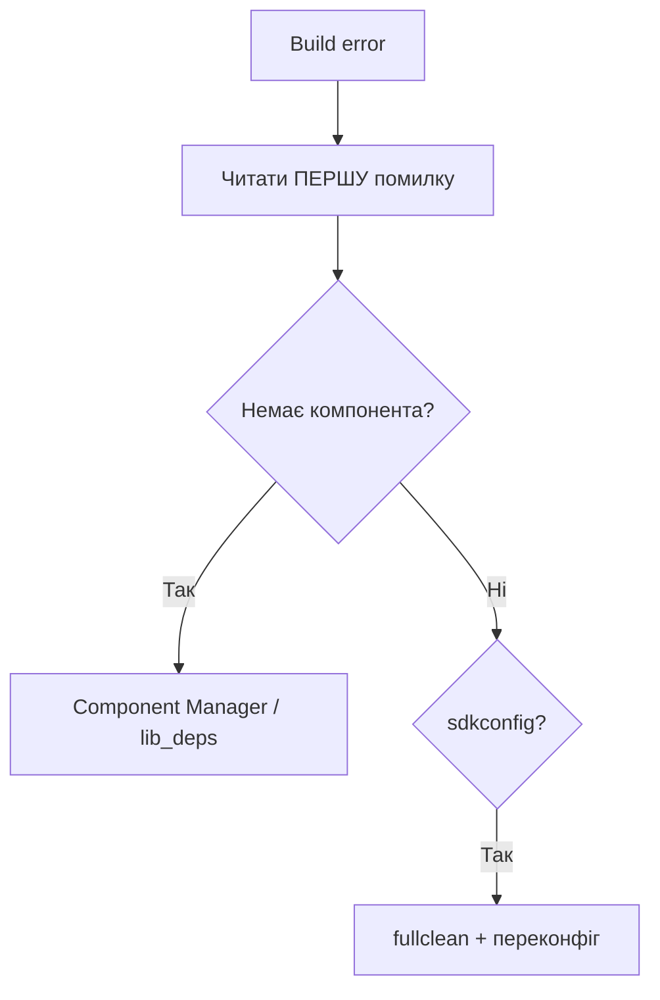

# Глибокий тулчейн: IDF Components, PlatformIO, MicroPython

## Призначення

Коли `blink` працює, починається справжня інженерія: свої компоненти з `idf_component.yml`, відтворювані конфіги через `sdkconfig.defaults`, мінімальний CMake без магії, один `platformio.ini` на кілька плат з `extra_scripts` + `monitor_filters` + OTA-заливкою, а для MicroPython - frozen-модулі, компілятор `mpy-cross`, числодробилка `ulab` (numpy!), `asyncio`/`uasyncio`-сервер і чесна розмова про продуктивність (Viper/емітер - оглядово, з застереженнями). База - [[09-Proshivka/01-ESP-IDF-setup]], швидкий старт - [[09-Proshivka/02-Arduino-PlatformIO]], інтерпретатор - [[09-Proshivka/03-MicroPython|MicroPython]], багатозадачність - [[09-Proshivka/06-FreeRTOS-Patterns]], якість - [[09-Proshivka/07-Testing-CI]].

> [!NOTE]
> Правило відтворюваності: клон → одна команда → той же бінарник. Це дають `sdkconfig.defaults` + `dependencies.lock` + фіксація `platform = espressif32@x.y.z`.

![[assets/img/tooling-deep-scheme.png|600]]

## 1. IDF Component Manager: залежності як у npm, тільки для C

| Поняття | Де | Що робить |
| --- | --- | --- |
| Маніфест `idf_component.yml` | Корінь кожного компонента | Оголошує ім'я, версію, залежності |
| Реєстр `components.espressif.com` | Хмара | `idf.py add-dependency espressif/mqtt^1.3` |
| `managed_components/` | Генерується | Не комітити! Тільки `dependencies.lock` |
| `dependencies.lock` | Корінь проєкту | Пінить точні версії - комітити обов'язково |
| `idf.py create-manifest` | CLI | Шаблон маніфесту для `main`/свого компонента |
| `idf.py update-dependencies` | CLI | Підтягнути нові версії за діапазонами |
| `IDF_COMPONENT_MANAGER=0` | Env | Вимкнути менеджер (офлайн/вендоринг) |

Таблиця версійних діапазонів:

| Запис | Значення |
| --- | --- |
| `example/cmp: ">=1.0.0"` | Будь-яка новіша 1.0.0 |
| `example/cmp: "^1.2.3"` | `>=1.2.3, <2.0.0` (рекомендовано) |
| `example/cmp: "~1.2.3"` | `>=1.2.3, <1.3.0` |
| `example/cmp: "<=3.3.3"` | Не новіша за 3.3.3 |
| `test_component: {git: ..., path: ...}` | Залежність з Git-монорепо |

Код ESP-IDF - свій компонент `components/sensor_hub/idf_component.yml`:

```yaml
version: "2.1.0"
description: "Hub сенсорів I2C для метеостанції"
url: "https://github.com/org/esp-sensor-hub"
targets:
  - esp32
  - esp32s3
  - esp32c3
dependencies:
  idf: ">=5.1"
  espressif/mqtt: "^1.3.0"
  bblanchon/arduinojson: null  # тільки для прикладу, зазвичай C-компоненти
```

Код ESP-IDF - додавання залежності:

```bash
idf.py create-manifest --component=sensor_hub
idf.py add-dependency --component=sensor_hub espressif/mqtt^1.3.0
idf.py reconfigure          # менеджер скачає в managed_components/
cat dependencies.lock       # перевірити піни
```

> [!TIP]
> Свій компонент, що перевизначає системний (наприклад свій `mqtt`), кладіть у `components/` - пріоритет: проєкт > `managed_components` > IDF. Але зловживати не варто: оновлення IDF пройде повз вас.

Код Arduino-порівняння (бібліотеки PlatformIO - аналог реєстру):

```ini
lib_deps =
  bblanchon/ArduinoJson @ ^7.0.0
  madhephaestus/ESP32Encoder @ ^0.11.0
```

Код MicroPython-порівняння (пакети `mip` - див. [[09-Proshivka/03-MicroPython|MicroPython]]):

```python
import mip
mip.install("umqtt.simple")
```

## 2. sdkconfig.defaults: конфіг як код

| Файл | Комітити? | Призначення |
| --- | --- | --- |
| `sdkconfig` | Ні (артефакт!) | Згенерований `menuconfig`, повний дамп |
| `sdkconfig.defaults` | Так | Ваші свідомі перевизначення, 10-30 рядків |
| `sdkconfig.defaults.esp32s3` | Так | Таргет-специфічне (PSRAM, USB) |
| `sdkconfig.defaults.prod` / `.debug` | Так | Профілі: прод vs стенд |
| `sdkconfig.old` | Ні | Бекап після `set-target` |
| `SDKCONFIG_DEFAULTS` (CMake) | Так | Склейка кількох defaults-файлів |

Код - `sdkconfig.defaults` для метеостанції:

```ini
# --- target ---
CONFIG_IDF_TARGET="esp32s3"
# --- flash/PSRAM ---
CONFIG_ESPTOOLPY_FLASHSIZE_16MB=y
CONFIG_SPIRAM=y
CONFIG_SPIRAM_SIZE_8MB=y
# --- FreeRTOS ---
CONFIG_FREERTOS_HZ=1000
CONFIG_FREERTOS_IDLE_TASK_STACKSIZE=2048
# --- логи: прод тихий ---
CONFIG_LOG_DEFAULT_LEVEL_INFO=y
CONFIG_LOG_MAXIMUM_LEVEL_INFO=y
# --- OTA + rollback ---
CONFIG_BOOTLOADER_APP_ROLLBACK_ENABLE=y
CONFIG_PARTITION_TABLE_TWO_OTA=y
# --- Wi-Fi ---
CONFIG_ESP_WIFI_STATIC_RX_BUFFER_NUM=8
CONFIG_ESP_WIFI_DYNAMIC_RX_BUFFER_NUM=16
```

Код - склейка профілів у `CMakeLists.txt` проєкту:

```cmake
cmake_minimum_required(VERSION 3.22)
include($ENV{IDF_PATH}/tools/cmake/project.cmake)
# прод: спільне + платне
set(SDKCONFIG_DEFAULTS "sdkconfig.defaults;sdkconfig.defaults.${IDF_TARGET}")
project(weather-station)
```

Таблиця частих опцій:

| Опція | Ефект |
| --- | --- |
| `CONFIG_COMPILER_OPTIMIZATION_SIZE=y` | `-Os`, менше flash, трохи повільніше |
| `CONFIG_COMPILER_OPTIMIZATION_PERF=y` | `-O2`, швидше, більше flash |
| `CONFIG_ESP_TASK_WDT_TIMEOUT_S=10` | Довший TWDT під стирання flash |
| `CONFIG_PM_ENABLE=y` + `CONFIG_FREERTOS_USE_TICKLESS_IDLE=y` | Light sleep між тіками |
| `CONFIG_ESP_SLEEP_POWER_DOWN_FLASH=y` | Гасити flash у light sleep (обережно!) |

> [!WARNING]
> Закомітили `sdkconfig` замість `sdkconfig.defaults` - отримали конфлікти на кожен `menuconfig` і невідтворювані збірки. Додайте `sdkconfig` у `.gitignore`.

## 3. CMake мінімум: три файли, ніякої магії

| Файл | Мінімум |
| --- | --- |
| Кореневий `CMakeLists.txt` | 3 рядки: `cmake_minimum_required` + `include(project.cmake)` + `project()` |
| `main/CMakeLists.txt` | `idf_component_register(SRCS ... REQUIRES ...)` |
| `components/foo/CMakeLists.txt` | Те саме + `INCLUDE_DIRS` |
| `Kconfig` / `Kconfig.projbuild` | Опційно, пункти `menuconfig` |
| `project_include.cmake` | Рідко, глобальні прапорці до конфігурації |

Код - кореневий `CMakeLists.txt`:

```cmake
cmake_minimum_required(VERSION 3.22)
include($ENV{IDF_PATH}/tools/cmake/project.cmake)
project(weather-station)
```

Код - `main/CMakeLists.txt`:

```cmake
idf_component_register(
  SRCS "main.c" "wifi_app.c" "mqtt_app.c"
  INCLUDE_DIRS "."
  REQUIRES esp_wifi esp_netif mqtt nvs_flash sensor_hub
  PRIV_REQUIRES esp_timer)
```

Код - `components/sensor_hub/CMakeLists.txt` з умовною компіляцією:

```cmake
set(srcs "hub.c" "hub_i2c.c")
if(CONFIG_SENSOR_HUB_ENABLE_BME280)
  list(APPEND srcs "bme280_convert.c")
endif()
idf_component_register(SRCS "${srcs}"
                       INCLUDE_DIRS "include"
                       REQUIRES driver log)
# придушити чужий warning, не чіпаючи апстрим:
target_compile_options(${COMPONENT_LIB} PRIVATE -Wno-unused-variable)
```

Таблиця `REQUIRES` vs `PRIV_REQUIRES`:

| Де інклуд | Куди писати |
| --- | --- |
| Публічний `.h` інклудить `mqtt_client.h` | `REQUIRES mqtt` |
| Тільки `.c` інклудить `esp_timer.h` | `PRIV_REQUIRES esp_timer` |
| `driver/i2c.h` в обох | `REQUIRES driver` |
| Нічого чужого | Можна без обох (common-компоненти підтягнуться самі) |

## 4. PlatformIO: один ini на кілька плат + скрипти + фільтри + OTA

| Фіча | Опція | Навіщо |
| --- | --- | --- |
| Матриця плат | `[env:esp32dev]`, `[env:esp32s3]`, `[env:xiao_c3]` | Один код, три бінарники |
| Спільне | `[env]` + `extends` | Не дублювати `framework/monitor_speed` |
| Скрипт | `extra_scripts = pre:scripts/version.py` | Версія з git у `build_flags` |
| Фільтри монітора | `monitor_filters = esp32_exception_decoder, colorize, time` | Читабельні креш-дампи |
| Файлова система | `board_build.filesystem = littlefs` | `pio run -t uploadfs` |
| OTA-заливка | `upload_protocol = espota` + `upload_port` | Прошивка по Wi-Fi |
| Партиції | `board_build.partitions = partitions_16MB.csv` | Кастом під OTA |

Код - `platformio.ini` на три плати:

```ini
[env]
framework = arduino
monitor_speed = 115200
upload_speed = 921600
monitor_filters = esp32_exception_decoder, colorize, time, log2file
lib_deps =
  bblanchon/ArduinoJson @ ^7.0.0
extra_scripts = pre:scripts/version.py

[env:esp32dev]
platform = espressif32 @ 6.7.0
board = esp32dev
board_build.partitions = default_4MB.csv
build_flags =
  ${env.build_flags}
  -DCORE_DEBUG_LEVEL=3
  -DBOARD_ESP32DEV=1

[env:esp32s3]
platform = espressif32 @ 6.7.0
board = esp32-s3-devkitc-1
board_build.filesystem = littlefs
board_build.partitions = partitions_16MB.csv
build_flags =
  ${env.build_flags}
  -DCORE_DEBUG_LEVEL=3
  -DBOARD_HAS_PSRAM
  -mfix-esp32-psram-cache-issue

[env:xiao_c3]
platform = espressif32 @ 6.7.0
board = seeed_xiao_esp32c3
board_build.partitions = default_4MB.csv
build_flags =
  ${env.build_flags}
  -DCORE_DEBUG_LEVEL=1

[env:ota_lab]
extends = env:esp32s3
upload_protocol = espota
upload_port = esp32-lab.local
upload_flags =
  --port=3232
  --auth=${sysenv.OTA_PASS}
```

Код - `scripts/version.py` (версія з git, див. [[09-Proshivka/07-Testing-CI|Testing-CI]]):

```python
# scripts/version.py — pre-скрипт PlatformIO
import subprocess
Import("env")
try:
    sha = subprocess.check_output(["git", "rev-parse", "--short", "HEAD"]).decode().strip()
    ver = open("version.txt").read().strip()
except Exception:
    sha, ver = "nogit", "0.0.0"
env.Append(CPPDEFINES=[("FW_VERSION", f'\\"{ver}+g{sha}\\"')])
print(f"[version] FW_VERSION={ver}+g{sha}")
```

Код - OTA-заливка з CLI:

```bash
pio run -e esp32s3 -t upload                 # по USB
pio run -e ota_lab -t upload                 # по Wi-Fi (espota)
pio run -e esp32s3 -t uploadfs               # тільки LittleFS
pio run -e esp32s3 -t erase                  # стерти flash
pio device monitor -e esp32s3                # з exception_decoder
```

> [!TIP]
> `monitor_filters = esp32_exception_decoder` перетворює `Backtrace: 0x400d...` на імена функцій. Без нього дебаг крешів - ворожіння.

## 5. MicroPython: frozen-модулі (бібліотека в прошивці)

| Підхід | Де лежить код | Плюси / мінуси |
| --- | --- | --- |
| `main.py` на FS | Flash FS | Легко правити, їсть RAM, видно пароль |
| `.mpy` (mpy-cross) | Flash FS | Менше RAM, швидший імпорт |
| Frozen-модуль | У самій прошивці (ROM) | 0 RAM на парсинг, не стирається, складніша збірка |
| `mip`-пакет | `/lib` | Швидко ставити, залежить від мережі |

Код - заморожування свого драйвера при власній збірці MicroPython:

```bash
# ports/esp32/modules/bme280_frozen.py  <- ваш файл
# ports/esp32/boards/ESP32_GENERIC/manifest.py:
freeze("$(PORT_DIR)/modules", "bme280_frozen.py")
freeze("$(MPY_DIR)/drivers/dht", "dht.py")
make BOARD=ESP32_GENERIC
```

```python
# після прошивки такої збірки:
import bme280_frozen  # імпорт з ROM, без файлів на FS
print(bme280_frozen.__file__)  # frozen, шляху нема
```

> [!WARNING]
> Frozen-модуль не відредагувати по USB - тільки перезбірка прошивки. Тримайте там стабільне ядро (`convert`, `protocol`), а експерименти - у `/lib` на FS.

## 6. MicroPython: mpy-cross (компілюй - економ RAM)

| Команда | Ефект |
| --- | --- |
| `mpy-cross app.py` | `app.mpy` - байткод, менше RAM при імпорті |
| `mpy-cross -mcache-lookup-bc app.py` | Швидший виклик методів (більший файл) |
| `mpy-cross -march=xtensawin` | Архітектурна оптимізація під ESP32 |
| `ampy put app.mpy /lib/app.mpy` | Заливка на плату |
| CI-гейт | `mpy-cross` ловить синтаксичні помилки до плати |

```bash
pip install mpy-cross
mpy-cross -o lib/bme280.mpy lib/bme280.py
ls -la lib/   # .mpy зазвичай на 30-50% менше в RAM при імпорті
ampy -p /dev/ttyUSB0 put lib/bme280.mpy /lib/bme280.mpy
```

Код MicroPython - перевірка виграшу:

```python
import micropython, gc
gc.collect(); print("free:", gc.mem_free())
import bme280        # .py-версія: більше RAM
# import bme280 mpy-версія після заміни: менше RAM на 1-3 КБ
gc.collect(); print("free:", gc.mem_free())
```

## 7. MicroPython: ulab (numpy! на мікроконтролері)

| Можливість | Приклад |
| --- | --- |
| `ulab.numpy.array` | Вектори `int16/float` замість списків Python |
| Арифметика цілими масивами | `(a - baseline) * scale` в C-швидкості |
| `ulab.numpy.fft`, `linalg` | Спектр вібрації/звуку на платі |
| `ulab.utils` | `frombuffer` - сенсорний DMA-буфер → масив без копії |
| Де взяти | Кастомна збірка з `USER_C_MODULES=.../micropython-ulab` або Wokwi-емулятор |

Код MicroPython + ulab - згладжування сенсора:

```python
try:
    from ulab import numpy as np
    HAS_ULAB = True
except ImportError:
    HAS_ULAB = False

def smooth_py(data, w=8):
    return [sum(data[i:i+w])/w for i in range(len(data)-w)]

if HAS_ULAB:
    from ulab import numpy as np
    def smooth_fast(raw):
        a = np.array(raw, dtype=np.float)
        k = np.ones(8, dtype=np.float) / 8.0
        return np.convolve(a, k, mode="valid")
```

Код ESP-IDF-порівняння (те саме в C, нуль магії):

```c
float smooth_c(const float *x, int n, int w) {
    float acc = 0;
    for (int i = 0; i < w; i++) acc += x[i];
    return acc / w;
}
```

> [!NOTE]
> `ulab` немає в стоковій прошивці `micropython.org` - треба збірка з модулем або готовий білд з `micropython-builder`. Перевіряйте `import ulab` на старті і падайте в чистий Python-фолбек.

## 8. MicroPython: asyncio (uasyncio-сервер без потоків)

| Патерн | Коли |
| --- | --- |
| `asyncio.gather()` | Сенсор + мережа + LED паралельно |
| `asyncio.sleep()` | Замість `time.sleep()` - не блокує інших |
| `start_server()` | HTTP/JSON-сторінка стану |
| Черга `asyncio.Queue` | Сенсор → мережа (аналог FreeRTOS-черги) |
| Вотчдог | `wdt.feed()` в окремій корутині |

Код MicroPython - `uasyncio` HTTP-сервер + сенсор:

```python
import asyncio
from machine import Pin, I2C
led = Pin(2, Pin.OUT)
last_temp = 25.0

async def blink():
    while True:
        led.value(not led.value())
        await asyncio.sleep(0.5)

async def poll():
    global last_temp
    while True:
        last_temp = 25.0  # тут: read bme280
        await asyncio.sleep(5)

async def serve(reader, writer):
    body = f'{{"temp": {last_temp}}}'
    hdr = "HTTP/1.0 200 OK\r\nContent-Type: application/json\r\n\r\n"
    await writer.awrite(hdr + body)
    await writer.aclose()

async def main():
    asyncio.create_task(blink())
    asyncio.create_task(poll())
    await asyncio.start_server(serve, "0.0.0.0", 80)
    while True: await asyncio.sleep(3600)

asyncio.run(main())
```

Код ESP-IDF-порівняння (та сама топологія задачами):

```c
// blink_task + poll_task + http_server_task + QueueHandle_t q
// uasyncio-кооператив ~ FreeRTOS-задачі з пріоритетом 1 і yield на sleep
```

## 9. Продуктивність MicroPython: Viper/емітер - оглядово + застереження

| Прийом | Виграш | Ціна / застереження |
| --- | --- | --- |
| `@micropython.native` | ×2-5 на циклах | Більше flash, гірші трейсбеки |
| `@micropython.viper` | ×5-20 на бітах/регістрах | Тільки int/ptr-типи, немає try/except всередині, легко segfault |
| Емітер `emit=native` в `mpy-cross` | Автоматичний native | Менш передбачувано, ніж декоратор |
| `ulab` замість циклів | ×10-100 | Потрібна кастомна прошивка |
| `framebuf` / `memoryview` | 0 копій буфера | Складніший код |
| Перехід на C-модуль | Максимум | Вже не MicroPython, а IDF-компонент |

Код - коли декоратори доречні, а коли ні:

```python
import micropython

@micropython.native
def crc_native(data: bytes) -> int:  # ОК: чистий цикл
    c = 0xFFFF
    for b in data:
        c ^= b
        for _ in range(8):
            c = (c >> 1) ^ (0xA001 if c & 1 else 0)
    return c

# @micropython.viper
# def bitbang_viper(...):  # НЕБЕЗПЕЧНО: прямі GPIO-регістри,
#   ...                    # один невірний ptr = hard fault
#   ...                    # краще RMT/PIO-периферія з IDF!
```

> [!CAUTION]
> `viper` з невірними типами (`ptr32` на неіснуючу адресу) вішає плату без трейсбеку - тільки JTAG/OpenOCD покаже причину. Правило: `native` - можна, `viper` - тільки вимірявши `time.ticks_diff()` до/після і залишивши чистий фолбек. Деталі дебагу - [[09-Proshivka/05-JTAG-Debug|JTAG-Debug]] (якщо нотатки ще немає - через MOC).

Таблиця «що прискорювати»:

| Задача | Інструмент |
| --- | --- |
| CRC/фільтри по масиву | `ulab` або `native` |
| Парсинг NMEA/JSON | Залишити Python, оптимізувати алгоритм |
| Бітбенг 1 МГц+ | Не Python взагалі - RMT/SPI-периферія |
| Дисплей 60 fps | `framebuf` + C-драйвер, не цикли Python |
| HTTP-сервер | `uasyncio`, не потоки |

## 10. Вимір тактів: CCOUNT замість відчуттів

| Інструмент | Що дає |
| --- | --- |
| `CCOUNT` (Xtensa) | Лічильник тактів ядра, читається однією інструкцією |
| `esp_timer_get_time()` | Мікросекунди для довгих ділянок |
| GPIO-маркер + логіка | Час ISR на аналізаторі |

```c
// Вимір ділянки в тактах (Xtensa):
static inline uint32_t get_ccount(void) {
    uint32_t v;
    __asm__ __volatile__("rsr.ccount %0" : "=a"(v));
    return v;
}
uint32_t t0 = get_ccount();
gpio_set_level(PIN, 1);
uint32_t cost = get_ccount() - t0;  // тактів!
```

| Правило | Пояснення |
| --- | --- |
| Міряти в release | Debug без оптимізації бреше в рази |
| Гріти кеш | Перший прогін повільніший |
| Середнє зі 100 | Переривання псують одиничні заміри |
| IRAM для гарячого | Код з flash гальмує на промахах кешу (`IRAM_ATTR`) |

## 11. Шаблон драйвера: esp_err_t і дескриптор

| Елемент | Конвенція |
| --- | --- |
| Дескриптор | Структура зі станом, ніяких глобалів |
| Init | Читання WHO_AM_I, інакше `ESP_ERR_NOT_FOUND` |
| Коди | Стандартні `esp_err_t`, свої - з `ESP_ERR_INVALID_*` |
| Логи | `ESP_LOGI/ESP_LOGE` з тегом драйвера |

```c
typedef struct {
    i2c_port_t port;
    uint8_t addr;
    int32_t calib[3];
    bool present;
} sensor_t;

esp_err_t sensor_init(sensor_t *dev) {
    uint8_t id = 0;
    esp_err_t r = i2c_read_reg(dev->port, dev->addr, REG_ID, &id);
    if (r != ESP_OK) return r;
    if (id != EXPECTED_ID) return ESP_ERR_NOT_FOUND;
    dev->present = true;
    return ESP_OK;
}
```

```text
Правила:
  верхній код логує ESP_LOGE з тегом, а не мовчить;
  повторні помилки шини — лічильник + ресет шини;
  адреса і піни — в Kconfig/menuconfig, не в коді!
```

## 12. Типові помилки

| Симптом | Причина | Рішення |
| --- | --- | --- |
| `Component not found: espressif/mqtt` | Немає `idf_component.yml` / офлайн | `idf.py create-manifest`, `update-dependencies`, перевірити мережу |
| `dependencies.lock` конфлікт у PR | Дві гілки підняли різні версії | `idf.py update-dependencies`, закомітити lock |
| `sdkconfig` в репозиторії шумить | Закомітили артефакт | `git rm --cached sdkconfig`, залишити `sdkconfig.defaults` |
| `set-target` зніс конфіг | Нормальна поведінка, `sdkconfig.old` | Відновити потрібні рядки в `sdkconfig.defaults.*` |
| `REQUIRES` циклічна залежність A↔B | Обидва інклудять публічні `.h` одне одного | Виділити спільне в компонент C, або `PRIV_REQUIRES` + forward-decl |
| PIO: `board not found: esp32-s3-devkitc-1` | Стара платформа | `platform = espressif32 @ 6.7.0` або нове ім'я плати з реєстру |
| PIO: `partition too big` | Кастомна CSV не підхоплена | `board_build.partitions = ...csv`, `pio run -t erase` |
| PIO OTA: `No response` | Не той порт/пароль, плата в sleep | `upload_port = *.local`, `--auth`, розбудити плату |
| MP: `ImportError: no module ulab` | Стокова прошивка без ulab | Кастомний білд або фолбек на чистий Python |
| MP: `ENOMEM` після frozen+mpy | Забагато модулів у RAM | Frozen для ядра, `.mpy` для решти, прибрати дублікати з `/lib` |
| MP: `uasyncio` підвисає | `time.sleep()` всередині корутини | Тільки `await asyncio.sleep()`, блокуючі виклики - в `run_in_executor`-стилі або окремо |

## Офіційні джерела

- [ESP-IDF - Component Manager (idf_component.yml, реєстр)](https://docs.espressif.com/projects/esp-idf/en/stable/esp32/api-guides/tools/idf-component-manager.html)
- [ESP-IDF - Build System (CMake, REQUIRES, sdkconfig.defaults)](https://docs.espressif.com/projects/esp-idf/en/stable/esp32/api-guides/build-system.html)
- [PlatformIO - Espressif32 platform (envs, partitions, OTA, FS)](https://docs.platformio.org/en/latest/platforms/espressif32.html)
- [MicroPython - Quick reference ESP32 (Pin/I2C/WDT/sleep)](https://docs.micropython.org/en/latest/esp32/quickref.html)
- [micropython-ulab - numpy для MicroPython (GitHub)](https://github.com/v923z/micropython-ulab)

### Mermaid: куди копати при проблемах збірки



## Див. також

- [[Home]]
- [[09-Proshivka/01-ESP-IDF-setup]]
- [[09-Proshivka/02-Arduino-PlatformIO]]
- [[09-Proshivka/03-MicroPython|MicroPython]]
- [[09-Proshivka/06-FreeRTOS-Patterns]]
- [[09-Proshivka/07-Testing-CI]]
- [[07-Timeri-Son/02-WDT]]
- [[08-Pamyat/03-OTA|OTA]]
