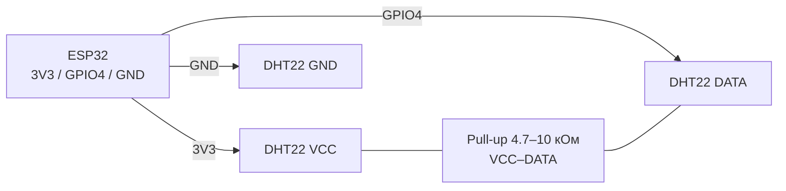

# DHT11 / DHT22 - датчик температури та вологості

## Призначення

DHT11 та DHT22 (AM2302) - дешеві цифрові датчики температури та відносної вологості з власним однопровідним протоколом (не плутати з Dallas 1-Wire). Використовуються для домашніх метеостанцій, теплиць, контролю клімату в приміщенні, IoT-вузлів з deep-sleep.

> Протокол часозалежний: вимагає точного вимірювання імпульсів 20-80 мкс. На ESP32 під FreeRTOS можливі збої читання - потрібні повтори та таймаути. Інтерфейс - власний 1-Wire протокол (не Dallas!), живлення 3.3-5V, період опитування - від 1-2 с. DHT22 точніший (±2% RH) і швидший за DHT11; обидва не для вулиці без захисту. Альтернатива точніше - SHT31/BME280 (див. відповідні ноти).

## Характеристики

| Параметр | DHT11 | DHT22 (AM2302) |
| --- | --- | --- |
| Діапазон температури | 0…+50 °C | −40…+80 °C |
| Точність температури | ±2 °C | ±0.5 °C |
| Діапазон вологості | 20…80 %RH | 0…100 %RH |
| Точність вологості | ±5 %RH | ±2 %RH |
| Роздільна здатність | 1 °C / 1 % | 0.1 °C / 0.1 % |
| Напруга живлення | 3.3-5.5 В | 3.3-5.5 В |
| Струм (вимірювання / сон) | 0.3 мА / 100 мкА | 1.5 мА / 50 мкА |
| Період опитування, мін. | 1 с (1 Гц) | 2 с (0.5 Гц) |
| Протокол | Власний 1-Wire, 40 біт | Власний 1-Wire, 40 біт |
| Ціна (орієнтовно) | ~$1 | ~$3-4 |

## Розпіновка

| Пін модуля | Призначення | Примітка |
| --- | --- | --- |
| VCC (+) | Живлення 3.3 В | Від ESP32 3V3; 5 В теж можна, але рівень DATA буде 5 В - потрібен дільник/level-shifter |
| DATA (S/OUT) | Лінія даних | GPIO через pull-up 5-10 кОм до VCC |
| NC | Не підключено | На 4-пінових модулях відсутній |
| GND (−) | Земля | Спільний GND з ESP32 |

> Модулі з 3 пінами вже мають вбудований pull-up 10 кОм. Голі датчики з 4 пінами - підтяжку треба ставити зовнішню.

## Схема підключення

| ESP32 | Модуль DHT | Примітка |
| --- | --- | --- |
| 3V3 | VCC | Живлення 3.3 В, струм малий |
| GPIO4 | DATA | Будь-який вільний GPIO; уникати strapping-пінів для стабільності |
| GND | GND | Спільна земля |
| - | VCC-DATA | Pull-up 5-10 кОм (якщо немає на модулі) |

Довжина лінії: до 5 м - звичайним дротом; до 20 м - екранована вита пара + pull-up 4.7 кОм + конденсатор 100 нФ між VCC-GND біля датчика.

### ASCII-схема

```text
ESP32 DevKit            DHT22 / AM2302 (модуль)
------------            -----------------------
3V3 ──────────────────► VCC (+)
GND ──────────────────► GND (−)
GPIO4 ────────────────► DATA (S/OUT)
                        VCC ◄──[4.7–10 кОм]──► DATA (якщо нема на модулі)
                        VCC ◄──[100 нФ]──► GND (при лінії > 5 м)
Провід: до 5 м — звичайний; до 20 м — вита пара в екрані
Увага: не живити DATA від 5 В без дільника — ESP32 не 5V-tolerant!
```

### Mermaid



![[assets/img/dht22-scheme.png|500]]
*Рис. DHT22 - живлення 3V3, DATA на GPIO4 з pull-up, конденсатор на довгих лініях. Місце під фото - див. [[assets/README]].*

## Код ESP-IDF

```c
#include "dht.h"  // компонент esp-dht (esp-idf-lib)
#include "freertos/FreeRTOS.h"
#include "freertos/task.h"
#include "esp_log.h"

#define DHT_GPIO GPIO_NUM_4
static const char *TAG = "dht";

void app_main(void)
{
    dht_sensor_type_t type = DHT_TYPE_AM2301; // DHT22
    // для DHT11: DHT_TYPE_DHT11
    for (;;) {
        int16_t temp = 0, hum = 0;
        if (dht_read_data(type, DHT_GPIO, &hum, &temp) == ESP_OK) {
            ESP_LOGI(TAG, "T=%.1f C  H=%.1f %%", temp / 10.0f, hum / 10.0f);
        } else {
            ESP_LOGW(TAG, "Помилка читання, повтор...");
        }
        vTaskDelay(pdMS_TO_TICKS(2000)); // DHT22: не частіше 2 с!
    }
}
```

## Код Arduino

```cpp
#include <DHT.h>
#define DHT_PIN 4
#define DHT_TYPE DHT22   // або DHT11

DHT dht(DHT_PIN, DHT_TYPE);

void setup() {
  Serial.begin(115200);
  dht.begin();
}

void loop() {
  delay(2000); // DHT22 — мінімум 2 с між опитуваннями
  float h = dht.readHumidity();
  float t = dht.readTemperature();
  if (isnan(h) || isnan(t)) {
    Serial.println("Помилка читання DHT!");
    return;
  }
  float hic = dht.computeHeatIndex(t, h, false);
  Serial.printf("T=%.1f C  H=%.1f %%  HI=%.1f C\n", t, h, hic);
}
```

## Код MicroPython

```python
import dht
from machine import Pin
import time

sensor = dht.DHT22(Pin(4))  # або dht.DHT11(Pin(4))

while True:
    try:
        time.sleep_ms(2000)
        sensor.measure()
        print("T={:.1f} C  H={:.1f} %".format(sensor.temperature(), sensor.humidity()))
    except OSError as e:
        print("Помилка DHT, повтор:", e)
```

## Типові помилки

1. **Опитування частіше 1-2 с** → датчик повертає старі дані або checksum error. Дотримуватись пауз: DHT11 ≥ 1 с, DHT22 ≥ 2 с.
2. **Немає pull-up резистора** → `Failed to read`, NaN. Поставити 5-10 кОм між DATA та VCC.
3. **Живлення 5 В + DATA безпосередньо в GPIO** → рівень 5 В на вході ESP32 (не 5V-tolerant!). Живити від 3V3 або ставити дільник / level-shifter.
4. **Довгі дроти без конденсатора** → збої CRC. Додати 100 нФ між VCC-GND біля датчика, зменшити pull-up до 4.7 кОм.
5. **Читання з ISR або під Wi-Fi навантаженням** → порушення таймінгів. Читати в окремому завданні, з 3-5 повторами.
6. **Плутанина DHT11 vs DHT22 у коді** → неправильні значення (у 10 разів більші/менші). Перевірити `DHT_TYPE` / клас драйвера.
7. **Конденсат на датчику** → вологість 99-100 % зависає. Просушити, не ставити у зону прямого випаровування.

## Офіційні джерела

- [DHT22 Datasheet - ASAIR (PDF, via Adafruit)](https://www.adafruit.com/datasheets/DHT22.pdf) - 1-Wire протокол, таймінги, точність ±2-5%.
- [DHT11 Datasheet - ASAIR (PDF, via Adafruit)](https://www.adafruit.com/datasheets/DHT11-chinese-datasheet.pdf) - таймінги, період опитування 1 с.
- [DHT22 - живе фото (Adafruit)](https://www.adafruit.com/product/385) - сторінка товару з фото і документацією.
- [DHT11 - живе фото (Adafruit)](https://www.adafruit.com/product/386) - сторінка товару з фото і документацією.
- [Туторіал DHT11/DHT22 + ESP32 з кодом (RNT)](https://randomnerdtutorials.com/esp32-dht11-dht22-temperature-humidity-sensor-arduino-ide/) - підключення, бібліотека DHT, приклад.
- [Розбір протоколу DHT11/DHT22 з кодом (LME)](https://lastminuteengineers.com/dht11-dht22-arduino-tutorial/) - таймінги, pull-up, приклади.

## Див. також

- [[03-GPIO/01-GPIO-oglyad]]
- [[04-Shini/03-I2C|I2C]]
- [[06-Analog/01-ADC|ADC]]
- [[03-GPIO/04-Pererivannya-PWM]]
- [[02-DS18B20]]
- [[03-BME280-BMP280-SHT31]]
- [[06-INA219-HX711-BH1750]]
