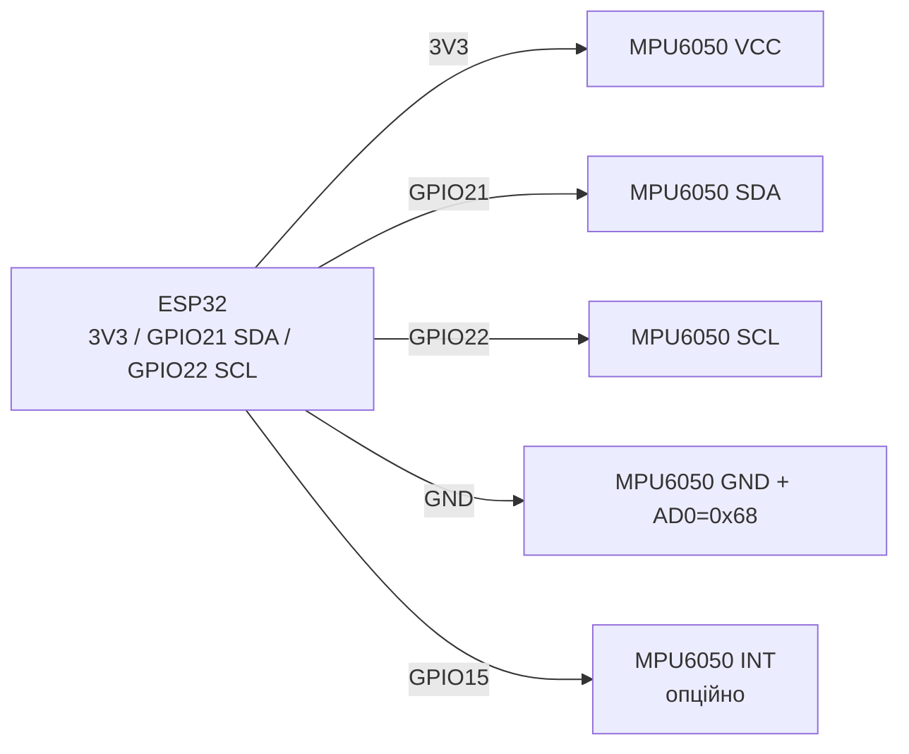

# MPU6050 - акселерометр + гіроскоп (I2C)

## Призначення

MPU6050 - 6-осьовий IMU (3-осьовий акселерометр + 3-осьовий гіроскоп) з вбудованим DMP (Digital Motion Processor). Застосування: вимірювання нахилу, самобалансуючі роботи, крокоміри, стабілізація, детекція руху/падіння, компас-заготовка (з HMC5883L на AUX). Інтерфейс - I2C 400 кГц (адреси 0x68/0x69), живлення 2.4-3.5V, переривання руху будять ESP32 із сну.

## Характеристики

| Параметр | Значення |
| --- | --- |
| Акселерометр | ±2 / ±4 / ±8 / ±16 g, 16 біт |
| Гіроскоп | ±250 / ±500 / ±1000 / ±2000 °/с, 16 біт |
| Температура | Вбудований сенсор, ±1 °C (грубий) |
| Інтерфейс | I2C до 400 кГц; AUX I2C для зовнішнього магнітометра |
| I2C-адреса | 0x68 (AD0→GND), 0x69 (AD0→VCC) |
| DMP | Апаратний fusion (quaternion), прошивка InvenSense |
| Переривання | INT - data-ready, motion-detect, FIFO-overflow |
| Живлення | 2.375-3.46 В (модулі GY-521 з LDO → 3.3-5 В) |
| Струм | ~3.9 мА активний, ~5 мкА сон |

## Розпіновка

| Пін модуля GY-521 | Призначення | Примітка |
| --- | --- | --- |
| VCC | Живлення 3.3-5 В | Від ESP32 3V3 (рекомендовано) |
| GND | Земля | Спільний GND |
| SCL | I2C clock | GPIO22 + pull-up (є на модулі) |
| SDA | I2C data | GPIO21 + pull-up (є на модулі) |
| XDA / XCL | AUX I2C | Для HMC5883L, зазвичай не потрібні |
| AD0 | Вибір адреси | GND → 0x68; VCC → 0x69 |
| INT | Переривання | До GPIO (напр. GPIO15), data-ready / motion |
| - | - | Модуль вже має LDO + pull-up 4.7 кОм |

## Схема підключення

| ESP32 | Модуль MPU6050 | Примітка |
| --- | --- | --- |
| 3V3 | VCC | Живлення 3.3 В |
| GND | GND | Спільна земля, короткі дроти |
| GPIO22 | SCL | Апаратний I2C, 400 кГц можливі |
| GPIO21 | SDA | Апаратний I2C |
| GND | AD0 | Адреса 0x68 (типово); до 3V3 → 0x69 при конфлікті |
| GPIO15 | INT | Опційно; для data-ready / wake-on-motion |

> Два MPU6050 на одній шині: одному AD0→GND (0x68), другому AD0→VCC (0x69).

### ASCII-схема

```text
ESP32 DevKit            GY-521 / MPU6050 (I2C)
------------            ----------------------
3V3 ──────────────────► VCC
GND ──────────────────► GND + AD0 (= 0x68)
GPIO22 ───────────────► SCL (pull-up 4.7 кОм на модулі)
GPIO21 ───────────────► SDA (pull-up 4.7 кОм на модулі)
GPIO15 ───────────────► INT (опційно, data-ready / motion)
Другий MPU: AD0 ──► 3V3 (= 0x69) на тій самій шині
Короткі проводи, модуль поруч з ESP32 (вібрації!)
```

### Mermaid



![[assets/img/mpu6050-i2c.png|500]]
*Рис. MPU6050 - шина I2C, адреса через AD0, переривання INT на GPIO15. Місце під фото - див. [[assets/README]].*

## Код ESP-IDF

```c
#include "mpu6050.h"  // esp-idf-lib
#include "driver/i2c.h"
#include "esp_log.h"
#include <math.h>

#define I2C_PORT I2C_NUM_0
static const char *TAG = "mpu";

void app_main(void)
{
    i2c_config_t cfg = {
        .mode = I2C_MODE_MASTER,
        .sda_io_num = GPIO_NUM_21, .scl_io_num = GPIO_NUM_22,
        .sda_pullup_en = GPIO_PULLUP_ENABLE,
        .scl_pullup_en = GPIO_PULLUP_ENABLE,
        .master.clk_speed = 400000,
    };
    i2c_param_config(I2C_PORT, &cfg);
    i2c_driver_install(I2C_PORT, cfg.mode, 0, 0, 0);

    mpu6050_handle_t dev;
    mpu6050_init(&dev, I2C_PORT, MPU6050_I2C_ADDRESS_LOW); // 0x68
    mpu6050_set_accl_scale(&dev, MPU6050_ACCL_SCALE_4G);
    mpu6050_set_gyro_scale(&dev, MPU6050_GYRO_SCALE_500DPS);

    float alpha = 0.96f, angle = 0;
    int64_t prev = esp_timer_get_time();
    for (;;) {
        mpu6050_accl_t a; mpu6050_gyro_t g;
        mpu6050_get_accl(&dev, &a); mpu6050_get_gyro(&dev, &g);
        float acc_angle = atan2f(a.y, a.z) * 57.2958f;
        int64_t now = esp_timer_get_time();
        float dt = (now - prev) / 1e6f; prev = now;
        angle = alpha * (angle + g.x * dt) + (1 - alpha) * acc_angle;
        ESP_LOGI(TAG, "pitch=%.1f", angle);
        vTaskDelay(pdMS_TO_TICKS(10));
    }
}
```

## Код Arduino

```cpp
#include <Wire.h>
#include <MPU6050.h>  // ElectronicCats / jarzebski

MPU6050 mpu;
float angle = 0;
uint32_t prev = 0;

void setup() {
  Serial.begin(115200);
  Wire.begin(21, 22);
  Wire.setClock(400000);
  mpu.initialize();
  if (!mpu.testConnection()) Serial.println("MPU6050 не відповідає!");
  mpu.setFullScaleAccelRange(MPU6050_ACCEL_FS_4);
  mpu.setFullScaleGyroRange(MPU6050_GYRO_FS_500);
  prev = millis();
}

void loop() {
  int16_t ax, ay, az, gx, gy, gz;
  mpu.getMotion6(&ax, &ay, &az, &gx, &gy, &gz);
  float accAngle = atan2((float)ay, (float)az) * 57.2958;
  float dt = (millis() - prev) / 1000.0; prev = millis();
  angle = 0.96 * (angle + (gx / 65.5) * dt) + 0.04 * accAngle; // complementary
  Serial.printf("pitch=%.1f\n", angle);
  delay(10);
}
```

## Код MicroPython

```python
from machine import I2C, Pin
import time, math
from mpu6050 import MPU6050  # драйвер з micropython-mpu6050

i2c = I2C(0, scl=Pin(22), sda=Pin(21), freq=400000)
print("I2C:", [hex(a) for a in i2c.scan()])
mpu = MPU6050(i2c, addr=0x68)

angle, prev = 0.0, time.ticks_ms()
while True:
    ax, ay, az = mpu.accel.xyz  # g
    gx, gy, gz = mpu.gyro.xyz   # deg/s
    acc_angle = math.degrees(math.atan2(ay, az))
    now = time.ticks_ms()
    dt = time.ticks_diff(now, prev) / 1000.0
    prev = now
    angle = 0.96 * (angle + gx * dt) + 0.04 * acc_angle
    print("pitch={:.1f}".format(angle))
    time.sleep_ms(10)
```

## DMP vs complementary filter

| Підхід | Плюси | Мінуси |
| --- | --- | --- |
| DMP (вбудований) | Quaternion на чипі, розвантажує CPU | Закрита прошивка 281 байт, глюки FIFO-overflow, складний драйвер |
| Complementary filter | 5 рядків коду, детермінований | Потрібен стабільний `dt`, чутливий до вібрацій |
| Kalman | Найкращий на вібраціях | Важчий CPU, налаштування Q/R |

> Для 90 % задач (нахил, самобаланс) достатньо complementary-фільтра з alpha 0.95-0.98 і калібрування нуля гіроскопа.

## Типові помилки

1. **Невірна адреса (AD0)** → `testConnection() = false`. Перевірити `i2c.scan()`: 0x68 vs 0x69.
2. **Живлення 5 В на логіку без LDO** → для голих MPU6050 максимум 3.46 В. GY-521 має LDO - тоді 5 В допустимо, але 3.3 В краще.
3. **Дрейф нуля гіроскопа** → кут «пливе». Калібрувати offset у спокої (100-500 семплів середнього).
4. **FIFO overflow у DMP** → сміттєві кватерніони. Читати FIFO вчасно або повернутись на complementary-фільтр.
5. **I2C 100 кГц + 1 кГц семпли** → не встигає. Підняти до 400 кГц, короткі дроти.
6. **Вібрації моторів** → шум акселерометра. Гумові демпфери, LPF (DLPF_CFG), нижча alpha акселерометра.
7. **INT не підтягнуто / не налаштовано** → фантомні спрацювання wake-on-motion. Налаштувати поріг motion-detect і полярність INT.

## Офіційні джерела

- MPU-6050 Product Page (TDK InvenSense) - `перевірити вручну` (сторінка переїхала, контент не знайдено).
- [MPU-6050 - живе фото (Adafruit)](https://www.adafruit.com/product/3886) - сторінка товару з фото і документацією.
- [Туторіал MPU-6050 + ESP32 з кодом (RNT)](https://randomnerdtutorials.com/esp32-mpu-6050-accelerometer-gyroscope-arduino/) - акселерометр і гіроскоп, приклад.
- [Розбір MPU6050 з кодом (LME)](https://lastminuteengineers.com/mpu6050-accel-gyro-arduino-tutorial/) - регістри, чутливість, приклади.

## Див. також

- [[04-Shini/03-I2C|I2C]]
- [[03-GPIO/04-Pererivannya-PWM]]
- [[03-GPIO/01-GPIO-oglyad]]
- [[04-Shini/02-SPI|SPI]]
- [[06-Analog/01-ADC|ADC]]
- [[03-BME280-BMP280-SHT31]]
