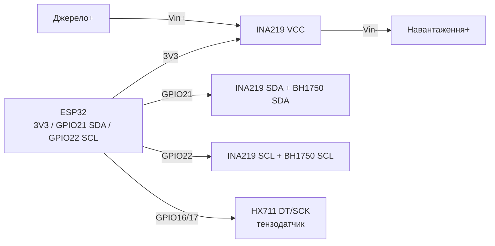

# INA219, HX711, BH1750, вологість ґрунту, MQ-2

## Призначення

Набір «вимірювальних» сенсорів для конкретних фізичних величин: INA219 - струм/напруга/потужність по шині живлення (моніторинг батарей, сонячних панелей); HX711 - 24-бітний АЦП для тензодатчиків (ваги до 1-50 кг); BH1750 - цифровий люксметр; ємнісний сенсор вологості ґрунту - полив; MQ-2 - детектор газу/диму (якісний, не вимірювальний!).

## Характеристики

| Параметр | INA219 | HX711 | BH1750 |
| --- | --- | --- | --- |
| Вимірює | Vbus 0-26 В, струм через шунт, потужність | Міст тензодатчика, ±20/±80 мВ | Освітленість 1-65535 лк |
| Інтерфейс | I2C, 4 адреси (A0/A1: 0x40-0x43) | DT/SCK (власний serial) | I2C 0x23 (ADDR low) / 0x5C (high) |
| Точність | 12 біт, шунт 0.1 Ом (±3.2 А макс) | 24 біт, підсилення 32/64/128 | ±20 %, режими H/M/L |
| Живлення | 3-5.5 В | 2.6-5.5 В (аналог) | 2.4-3.6 В |
| Струм | ~0.7 мА | ~1.5 мА | ~120 мкА |
| Калібрування | Вибір діапазону PGA /32 В, /16 В | Тара + масштаб по еталонній вазі | Немає (заводське) |

Додатково:

| Сенсор | Сигнал | Застереження |
| --- | --- | --- |
| Ємнісний сенсор вологості ґрунту (v1.2/v2.0) | Аналог ~1.2-3.0 В → [[06-Analog/01-ADC | ADC]] | Живити через GPIO (вмикати тільки на вимір!) - інакше електрокорозія за тижні |
| MQ-2 (газ/дим: LPG, метан, CO, дим) | Аналог + цифра (компаратор) | Нагрівач 5 В / ~150 мА, прогрів 24-48 год для стабільності; НЕ кількісний без калібрування по еталонному газу |

## Розпіновка

| INA219 (модуль CJMCU) | Призначення |
| --- | --- |
| VCC / GND | 3.3 В / земля логіки |
| SCL / SDA | I2C до GPIO22/21 |
| Vin− / Vin+ | Розрив шини живлення: джерело → Vin+, навантаження → Vin− (струм тече + → −) |
| A0/A1 | Перемички адреси |

| HX711 (модуль) | Призначення |
| --- | --- |
| VCC / GND | 3.3-5 В; аналогова частина краще 5 В |
| DT | Дані → GPIO |
| SCK | Тактування → GPIO |
| E+/E−, A+/A− | Збудження моста та диференційний вхід тензодатчика (червоний/чорний/білий/зелений) |

| BH1750 | Призначення |
| --- | --- |
| VCC/GND | 3.3 В |
| SCL/SDA | I2C |
| ADDR | GND → 0x23, VCC → 0x5C |

## Схема підключення

| ESP32 | INA219 | Примітка |
| --- | --- | --- |
| 3V3 | VCC | Логіка 3.3 В |
| GND | GND | Спільна земля з вимірюваною шиною! |
| GPIO22 | SCL | I2C |
| GPIO21 | SDA | I2C |
| Джерело + | Vin+ | Напр. батарея/БЖ + |
| Навантаження + | Vin− | Напр. вхід навантаження |
| GND джерела | GND ESP32 | Обов'язково спільний мінус |

| ESP32 | HX711 | Примітка |
| --- | --- | --- |
| 3V3 (або 5V) | VCC | 5 В → кращий SNR, але DT 5 В? На практиці DT ~4.2 В - краще живити 3.3 В або дільник |
| GND | GND | Спільна земля |
| GPIO16 | DT | Вхід даних |
| GPIO17 | SCK | Вихід тактування |

| ESP32 | BH1750 | Примітка |
| --- | --- | --- |
| 3V3 | VCC | Тільки 3.3 В (макс 3.6 В!) |
| GND | GND | Земля |
| GPIO22 | SCL | I2C |
| GPIO21 | SDA | I2C |
| GND | ADDR | Адреса 0x23 |

Ґрунт: VCC сенсора → GPIO25 (живлення тільки на вимір), AOUT → GPIO34 ([[06-Analog/01-ADC|ADC]]), GND → GND. MQ-2: VCC → 5 В, GND → GND, AOUT → GPIO34, DOUT → GPIO35 (поріг потенціометром).

### ASCII-схема

```text
ESP32 DevKit            INA219 (I2C) + HX711 + BH1750
------------            -------------------------------
3V3 ──────────────────► INA219 VCC / HX711 VCC / BH1750 VCC
GND ──────────────────► GND усіх модулів (= мінус вимірюваної шини!)
GPIO22 ───────────────► SCL (INA219 + BH1750 паралельно)
GPIO21 ───────────────► SDA (INA219 + BH1750 паралельно)
Джерело+ ─────────────► INA219 Vin+ ──[шунт 0.1 Ом]──► Vin− ──► навантаження+
GPIO16 ───────────────► HX711 DT
GPIO17 ───────────────► HX711 SCK
E+/E−, A+/A− ─────────► тензодатчик (черв/чорн, біл/зел)
ADDR BH1750 ──────────► GND (= 0x23)
```

### Mermaid



![[assets/img/ina219-hx711.png|500]]
*Рис. INA219 - розрив плюса через Vin+/Vin− зі спільним GND, HX711 на GPIO16/17, BH1750 на тій самій I2C. Місце під фото - див. [[assets/README]].*

## Код ESP-IDF

```c
// INA219 (esp-idf-lib ina219) + BH1750 (esp-idf-lib bh1750)
#include "ina219.h"
#include "bh1750.h"
#include "driver/i2c.h"
#include "esp_log.h"

void app_main(void)
{
    i2c_config_t cfg = {
        .mode = I2C_MODE_MASTER,
        .sda_io_num = GPIO_NUM_21, .scl_io_num = GPIO_NUM_22,
        .sda_pullup_en = GPIO_PULLUP_ENABLE,
        .scl_pullup_en = GPIO_PULLUP_ENABLE,
        .master.clk_speed = 100000,
    };
    i2c_param_config(I2C_NUM_0, &cfg);
    i2c_driver_install(I2C_NUM_0, cfg.mode, 0, 0, 0);

    ina219_handle_t ina;
    ina219_init(&ina, I2C_NUM_0, INA219_ADDR_GND_GND); // 0x40
    ina219_configure(&ina, INA219_BUS_RANGE_16V, INA219_GAIN_320MV,
                     INA219_RES_12BIT, INA219_RES_12BIT, INA219_MODE_CONT);

    bh1750_handle_t lux;
    bh1750_init(&lux, I2C_NUM_0, BH1750_ADDR_LO);      // 0x23
    bh1750_set_mode(&lux, BH1750_MODE_CONT_HIGH_RES);

    for (;;) {
        float v = 0, i = 0, p = 0;
        ina219_get_bus_voltage(&ina, &v);
        ina219_get_current(&ina, &i);
        ina219_get_power(&ina, &p);
        float l = 0; bh1750_read(&lux, &l);
        ESP_LOGI("m", "V=%.2f I=%.1f mA P=%.1f mW lux=%.0f", v, i * 1000, p * 1000, l);
        vTaskDelay(pdMS_TO_TICKS(1000));
    }
}
```

## Код Arduino

```cpp
#include <Wire.h>
#include <Adafruit_INA219.h>
#include <BH1750.h>
#include "HX711.h"

Adafruit_INA219 ina(0x40);
BH1750 lux;
HX711 scale;
#define SOIL_PWR 25
#define SOIL_PIN 34

void setup() {
  Serial.begin(115200);
  Wire.begin(21, 22);
  ina.begin();
  lux.begin(BH1750::CONTINUOUS_HIGH_RES_MODE, 0x23);
  scale.begin(16, 17);
  scale.set_scale(2280.0); // калібрувати еталонною вагою!
  scale.tare();
  pinMode(SOIL_PWR, OUTPUT);
  digitalWrite(SOIL_PWR, LOW);
}

void loop() {
  Serial.printf("INA: %.2f V %.1f mA | lux: %.0f | W: %.1f g\n",
    ina.getBusVoltage_V(), ina.getCurrent_mA(),
    lux.readLightLevel(), scale.get_units(5));
  // Ґрунт: живлення тільки на вимір
  digitalWrite(SOIL_PWR, HIGH); delay(50);
  int soil = analogRead(SOIL_PIN);
  digitalWrite(SOIL_PWR, LOW);
  Serial.printf("soil raw: %d\n", soil);
  delay(2000);
}
```

## Код MicroPython

```python
from machine import I2C, Pin, ADC
import time

i2c = I2C(0, scl=Pin(22), sda=Pin(21))
# INA219 / BH1750 — драйвери: ada_ina219.py, bh1750.py
from ina219 import INA219
from bh1750 import BH1750

ina = INA219(i2c, addr=0x40)
ina.configure()  # default 32V/2A
lux = BH1750(i2c, addr=0x23)

soil_pwr = Pin(25, Pin.OUT, value=0)
soil_adc = ADC(Pin(34)); soil_adc.atten(ADC.ATTN_11DB)

while True:
    print("V={:.2f} I={:.1f}mA lux={:.0f}".format(
        ina.bus_voltage, ina.current, lux.luminance(BH1750.CONT_HIRES_1)))
    soil_pwr.value(1); time.sleep_ms(50)
    print("soil:", soil_adc.read())
    soil_pwr.value(0)
    time.sleep(2)
```

### INA3221 - три канали замість одного INA219

| Параметр | INA219 | INA3221 |
| --- | --- | --- |
| Канали | 1 (шина + шунт) | 3 незалежні канали |
| Діапазони | Шина 0-26 В, шунт ±320 мВ | Шина 0-26 В кожен, шунт ±163.8 мВ |
| АЦП | 12 біт | 12-13 біт програмовано |
| I2C-адреса | 0x40-0x4F (A0/A1) | 0x40-0x43 (A0) |
| Коли брати | Один канал | Сонячна станція: панель + АКБ + навантаження одночасно |

```text
Шунти 0.1 Ом/2W у розрив КОЖНОЇ лінії (PV+, BAT+, LOAD+), INA3221 поруч із шунтами
(доріжки sense короткі, витою парою). Увага: спільна земля обов'язкова — канали не ізольовані!
```

> INA3221 vs 3× INA219: один корпус, один адресний простір, синхронний семплінг - для енергобалансу «прийшло/збереглось/пішло» беріть 3221.

![[assets/img/ina3221-3ch-scheme.png|500]]
*Рис. INA3221: три шунти, спільна земля-зірка, канали не ізольовані.*

## Типові помилки

1. **INA219: немає спільної землі** → нулі/сміття. Мінус вимірюваної шини = GND ESP32.
2. **INA219: переплутані Vin+/Vin−** → від'ємний струм або нуль. Струм має текти від + до − через модуль.
3. **Шунт 0.1 Ом гріється на 3 А** → дрейф. Для великих струмів - зовнішній шунт + калібрування `setCalibration`.
4. **HX711: не та пара дротів тензодатчика** → нулі або насичення. E+/E− - збудження (червоний/чорний), A+/A− - сигнал (білий/зелений); `set_scale` калібрувати еталоном.
5. **HX711 на 5 В + DT у GPIO** → перевищення 3.6 В. Живити HX711 від 3.3 В або ставити дільник на DT.
6. **Ґрунтовий сенсор під постійним живленням** → корозія за 2-4 тижні. Живити через GPIO тільки на 50-100 мс виміру.
7. **INA3221 без спільної землі трьох шунтів** → канали «пливуть». Усі мінуси ліній + GND ESP32 в одну точку; канали не ізольовані!
8. **MQ-2 без прогріву / як «ppm-метр»** → випадкові цифри. Прогрів ≥24 год, порогова логіка по DOUT + калібрування; нагрівач ~800 мВт - не для батареї.

## Офіційні джерела

- [INA219 - сторінка продукту і даташит (TI)](https://www.ti.com/product/INA219) - офіційні характеристики та документація.
- [INA219-модуль - живе фото (Adafruit)](https://www.adafruit.com/product/904) - сторінка товару з фото.
- [Гайд INA219 з кодом (Adafruit Learn)](https://learn.adafruit.com/adafruit-ina219-current-sensor-breakout) - калібрування, приклади.
- [Туторіал HX711 + тензодатчик з кодом (RNT)](https://randomnerdtutorials.com/esp32-load-cell-hx711/) - ваги на ESP32.
- BH1750 Datasheet (ROHM) - `перевірити вручну`.

## Див. також

- [[04-Shini/03-I2C|I2C]]
- [[06-Analog/01-ADC|ADC]]
- [[03-GPIO/01-GPIO-oglyad]]
- [[03-GPIO/04-Pererivannya-PWM]]
- [[01-DHT11-DHT22]]
- [[02-DS18B20]]
- [[03-BME280-BMP280-SHT31]]
