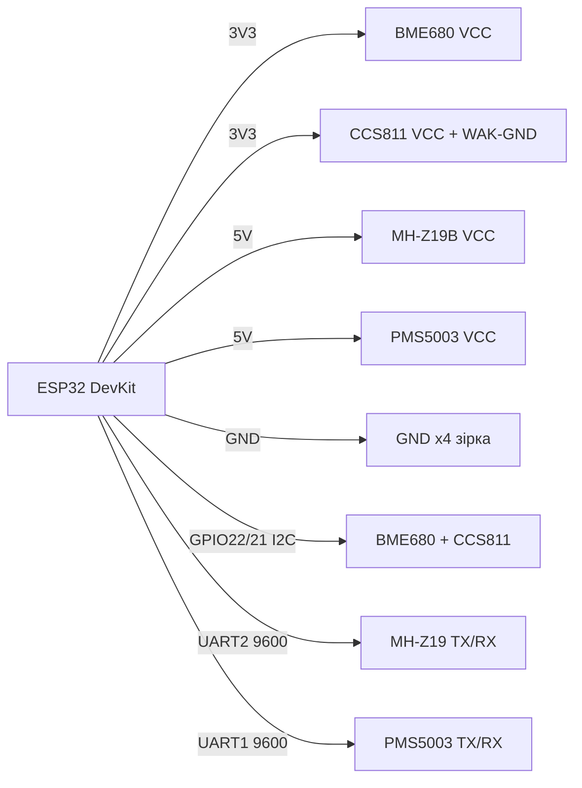

# BME680 / CCS811 / MH-Z19 / PMS5003 - якість повітря та CO2

![[assets/img/air-quality-scheme.png|500]]
*Рис. 1. Підключення сенсорів якості повітря до ESP32: BME680/CCS811 по I2C, MH-Z19/PMS5003 по UART.*

## Призначення

Група сенсорів якості повітря для дому, офісу, школи та вуличних станцій моніторингу. BME680 - температура/вологість/тиск + VOC (леткі органічні сполуки, індекс IAQ). CCS811 - eCO2/TVOC (розрахункові, не справжній CO2). MH-Z19B - справжній NDIR-сенсор CO2 (400-5000 ppm) по UART/PWM. PMS5003 - лазерний лічильник пилу PM1.0/PM2.5/PM10 по UART з вентилятором. Разом закривають повний AQI-вузол на ESP32.

> CCS811 вимагає прогріву 48 годин для стабільних показань! MH-Z19B - 3 хв після ввімкнення, PMS5003 - 30 с на розгін вентилятора.

## Характеристики

| Параметр | BME680 | CCS811 | MH-Z19B | PMS5003 |
| --- | --- | --- | --- | --- |
| Що міряє | T/H/P + VOC (IAQ 0-500) | eCO2 400-8192 ppm, TVOC 0-1187 ppb | CO2 400-5000 ppm (NDIR) | PM1.0/2.5/10, мкг/м³ |
| Інтерфейс | I2C (0x76/0x77) + SPI | I2C 0x5A/0x5B | UART 9600 + PWM | UART 9600 |
| Живлення | 1.7-3.6 В (модуль 3.3-5 В) | 1.8-3.3 В | 4.5-5.5 В (обовʼязково 5 В!) | 5 В, ~100 мА |
| Струм | 12 мА (нагрів) / 3 мкА сон | 30 мА | 60 мА середній | 100 мА (вентилятор) |
| Точність CO2 | Немає (оцінка IAQ) | ±15 % (розрахунок!) | ±50 ppm + 5 % | - |
| Прогрів | 30 хв (гаряча пластина) | 48 год перший раз, 20 хв щоразу | 3 хв | 30 с |
| Ресурс | > 5 років | ~5 років | > 5 років (NDIR) | Вентилятор ~3 роки |
| Ціна | ~$5-7 | ~$5 | ~$15-20 | ~$15 |

### Застереження прогріву

| Сенсор | Що відбувається | Правило |
| --- | --- | --- |
| CCS811 | MOX-елемент «вигоряє», baseline плаває | 48 год безперервної роботи при першому ввімкненні, далі 20 хв; зберігати baseline в NVS |
| BME680 | Гарячий дріт 300 °C, IAQ дрейфує перші хвилини | 30 хв прогріву + бібліотека BSEC для IAQ |
| MH-Z19B | Лампа ІЧ прогрівається | Ігнорувати перші 3 хв, ABC-калібрування раз на 24 год на свіжому повітрі |
| PMS5003 | Вентилятор виходить на оберти | Перші 30 с дані сміттєві; спати між вимірами (setMode passive) |

## Легенда пінів модуля

| Пін | Тип | Куди | Примітка |
| --- | --- | --- | --- |
| VCC (BME680/CCS811) | Живлення 3.3 В | 3V3 ESP32 | CCS811 строго 3.3 В, 5 В спалить! |
| VCC (MH-Z19/PMS5003) | Живлення 5 В | VIN 5V (USB) | Від окремого стабілізатора при довгих лініях; струм до 150 мА |
| GND | Земля | GND ESP32 | Спільна для всіх чотирьох |
| SCL / SDA | I2C | GPIO22 / GPIO21 | BME680 + CCS811 на одній шині (адреси різні) |
| WAK (CCS811) | Вхід | GND | На землю для постійних вимірів; до GPIO для сну |
| RST / INT (CCS811) | Вихід переривання | GPIO (опційно) | Можна не підключати |
| Tx / Rx (MH-Z19, PMS5003) | UART | GPIO16/GPIO17, GPIO18/GPIO19 | Через UART1/UART2; не плутати Tx→Rx хрест-навхрест |
| PWM (MH-Z19) | Вихід ШІМ | GPIO (опційно) | Альтернатива UART: 1004 мс період |
| SET / RESET (PMS5003) | Вхід керування | 3V3 / GPIO | SET=L - сон; RESET - перезапуск |

## Схема підключення

| ESP32 | Модуль | Примітка |
| --- | --- | --- |
| 3V3 | BME680 VCC, CCS811 VCC | Тільки 3.3 В для CCS811! |
| 5V (VIN/VU) | MH-Z19B VCC, PMS5003 VCC | Від USB 5 В, конденсатор 470 мкФ поруч |
| GND | GND усіх модулів | Зірка, товстий провід для 5 В вузлів |
| GPIO22 | BME680 SCL, CCS811 SCL | Спільна шина I2C0 |
| GPIO21 | BME680 SDA, CCS811 SDA | Pull-up 4.7 кОм |
| GPIO17 (TX2) | MH-Z19 RX, PMS5003 RX | Через UART2; хрест: TX ESP → RX сенсора |
| GPIO16 (RX2) | MH-Z19 TX, PMS5003 TX | Один UART на один сенсор! Розвести: MH-Z19 → UART1, PMS5003 → UART2 |
| GPIO18/19 | PMS5003 TX/RX (UART1) | Альтернатива при двох сенсорах одночасно |

### ASCII-схема

```text
        ESP32 DevKit
   +------------------+
   |  3V3  -> BME680 VCC, CCS811 VCC (3.3V!)
   |  5V   -> MH-Z19 VCC, PMS5003 VCC (5V!)
   |  GND  -> GND x4 (зірка)
   |  G22  -> BME680 SCL + CCS811 SCL
   |  G21  -> BME680 SDA + CCS811 SDA
   |  G17 TX2 -> MH-Z19 RX
   |  G16 RX2 <- MH-Z19 TX
   |  G18 TX1 -> PMS5003 RX
   |  G19 RX1 <- PMS5003 TX
   +------------------+
   I2C0: 0x76 (BME680), 0x5A (CCS811)
   UART1 9600: PMS5003 | UART2 9600: MH-Z19
```

### Mermaid



## Код ESP-IDF

```c
#include "driver/uart.h"
#include "esp_log.h"

#define UART_MHZ UART_NUM_2
#define UART_PMS UART_NUM_1
static const char *TAG = "air";

// MH-Z19B: команда читання CO2
static int mhz19_read_co2(void)
{
    uint8_t cmd[9] = {0xFF, 0x01, 0x86, 0, 0, 0, 0, 0, 0x79};
    uart_write_bytes(UART_MHZ, (char *)cmd, 9);
    uint8_t r[9] = {0};
    if (uart_read_bytes(UART_MHZ, r, 9, pdMS_TO_TICKS(500)) != 9) return -1;
    if (r[0] != 0xFF || r[1] != 0x86) return -1;
    uint8_t chk = 0;
    for (int i = 1; i < 8; i++) chk += r[i];
    if ((0xFF - chk + 1) != r[8]) return -1;
    return r[2] * 256 + r[3];
}

// PMS5003: пасивний кадр 32 байти, початок 0x42 0x4D
static bool pms_read(int *pm25, int *pm10)
{
    uint8_t b[32];
    if (uart_read_bytes(UART_PMS, b, 32, pdMS_TO_TICKS(1000)) != 32) return false;
    if (b[0] != 0x42 || b[1] != 0x4D) return false;
    *pm25 = (b[12] << 8) | b[13];
    *pm10 = (b[14] << 8) | b[15];
    return true;
}

void app_main(void)
{
    uart_config_t uc = {.baud_rate = 9600, .data_bits = UART_DATA_8_BITS,
        .parity = UART_PARITY_DISABLE, .stop_bits = UART_STOP_BITS_1,
        .flow_ctrl = UART_HW_FLOWCTRL_DISABLE};
    uart_param_config(UART_MHZ, &uc);
    uart_set_pin(UART_MHZ, 17, 16, -1, -1);
    uart_driver_install(UART_MHZ, 256, 0, 0, NULL, 0);
    uart_param_config(UART_PMS, &uc);
    uart_set_pin(UART_PMS, 18, 19, -1, -1);
    uart_driver_install(UART_PMS, 256, 0, 0, NULL, 0);
    // BME680/CCS811 ініціалізуються по I2C окремо (BSEC / ccs811 lib)
    for (;;) {
        int co2 = mhz19_read_co2();
        int pm25 = 0, pm10 = 0;
        pms_read(&pm25, &pm10);
        ESP_LOGI(TAG, "CO2=%d ppm  PM2.5=%d PM10=%d", co2, pm25, pm10);
        vTaskDelay(pdMS_TO_TICKS(5000));
    }
}
```

## Код Arduino

```cpp
#include <Wire.h>
#include <Adafruit_CCS811.h>
#include <Adafruit_BME680.h>
#include <MHZ19.h>
#include <HardwareSerial.h>

Adafruit_CCS811 ccs;
Adafruit_BME680 bme;
MHZ19 mhz;
HardwareSerial pmsSerial(1); // UART1 для PMS5003
HardwareSerial mhzSerial(2); // UART2 для MH-Z19

void setup() {
  Serial.begin(115200);
  Wire.begin(21, 22);
  if (!ccs.begin(0x5A)) Serial.println("CCS811 не знайдено! Прогрів 48 год!");
  // ccs.setDriveMode(CCS811_DRIVE_MODE_60SEC);
  if (!bme.begin(0x76)) Serial.println("BME680 не знайдено!");
  bme.setGasHeater(320, 150); // 320 C, 150 мс
  mhzSerial.begin(9600, SERIAL_8N1, 16, 17);
  mhz.begin(mhzSerial);
  mhz.autoCalibration(true); // ABC раз на 24 год
  pmsSerial.begin(9600, SERIAL_8N1, 19, 18);
}

void loop() {
  if (ccs.available() && !ccs.readData()) {
    Serial.printf("eCO2=%d TVOC=%d\n", ccs.geteCO2(), ccs.getTVOC());
  }
  Serial.printf("BME680 gas=%.0f Om\n", bme.readGas());
  Serial.printf("CO2=%d ppm\n", mhz.getCO2());
  // PMS5003: читати кадр 0x42 0x4D (див. ESP-IDF приклад)
  delay(5000);
}
```

## Код MicroPython

```python
from machine import I2C, UART, Pin
import time

i2c = I2C(0, scl=Pin(22), sda=Pin(21))
print("I2C:", [hex(a) for a in i2c.scan()])  # 0x76 BME680, 0x5A CCS811

mhz = UART(2, 9600, tx=17, rx=16)
pms = UART(1, 9600, tx=18, rx=19)

def read_mhz19():
    mhz.write(bytes([0xFF, 0x01, 0x86, 0, 0, 0, 0, 0, 0x79]))
    time.sleep_ms(100)
    r = mhz.read(9)
    if r and len(r) == 9 and r[0] == 0xFF and r[1] == 0x86:
        return r[2] * 256 + r[3]
    return None

while True:
    print("CO2:", read_mhz19(), "ppm")
    if pms.any() >= 32:
        b = pms.read(32)
        if b[0] == 0x42 and b[1] == 0x4D:
            print("PM2.5:", (b[12] << 8) | b[13], "PM10:", (b[14] << 8) | b[15])
    time.sleep(5)
```

## Типові помилки

| № | Помилка | Симптом | Рішення |
| --- | --- | --- | --- |
| 1 | CCS811 без прогріву 48 год | eCO2 400 або 8192, стрибає | Прогріти 48 год безперервно, зберігати baseline в NVS (`getBaseline/setBaseline`) |
| 2 | CCS811 живлять від 5 В | Мікросхема гріється, згорає | Тільки 3.3 В! Перевірити перемичку на модулі |
| 3 | MH-Z19 живлять від 3V3 | Нулі або 5000 ppm постійно | Обовʼязково 5 В, струм ≥ 150 мА, спільний GND |
| 4 | Два UART-сенсори на одному UART | Кадри перемішуються | MH-Z19 → UART2, PMS5003 → UART1, швидкість 9600 в обох |
| 5 | PMS5003 без пауз | Вентилятор зношується за рік | Passive mode: спати (`0x42 0x4D 0xE4`), будити раз на 5-10 хв |
| 6 | BME680 без BSEC | «Газ» є, а IAQ немає | IAQ рахує лише бібліотека BSEC (закритий blob); сирий опір - не IAQ |
| 7 | ABC-калібрування в кімнаті | CO2 «повзе» до 400 вночі | Калібрувати на вулиці/свіжому повітрі або вимкнути ABC (`autoCalibration(false)`) і калібрувати вручну |

## Офіційні джерела

- [BME680 - сторінка продукту і даташит (Bosch)](https://www.bosch-sensortec.com/en/products/environmental-sensors/gas-sensors/bme680/) - офіційні характеристики та документація.
- [BME680-модуль - живе фото (Adafruit)](https://www.adafruit.com/product/3660) - сторінка товару з фото.
- [Гайд BME680 з кодом (Adafruit Learn)](https://learn.adafruit.com/adafruit-bme680-humidity-temperature-barometic-pressure-voc-gas) - газ, тиск, вологість.
- [CCS811-модуль - живе фото (Adafruit)](https://www.adafruit.com/product/3566) - сторінка товару з фото.
- [Гайд CCS811 з кодом (Adafruit Learn)](https://learn.adafruit.com/adafruit-ccs811-air-quality-sensor) - VOC і eCO2.
- MH-Z19 (Winsen) і PMS5003 (Plantower) - `перевірити вручну` (сайти блокують автоматичні запити).

## Див. також

- [[10-Sensori/03-BME280-BMP280-SHT31]]
- [[10-Sensori/07-AHT10-AHT20-SHT40]]
- [[04-Shini/03-I2C|I2C]]
- [[04-Shini/01-UART|UART]]
- [[10-Sensori/06-INA219-HX711-BH1750]]
- [[10-Sensori/01-DHT11-DHT22]]
- [[07-Timeri-Son/03-Sleep-ULP]]
