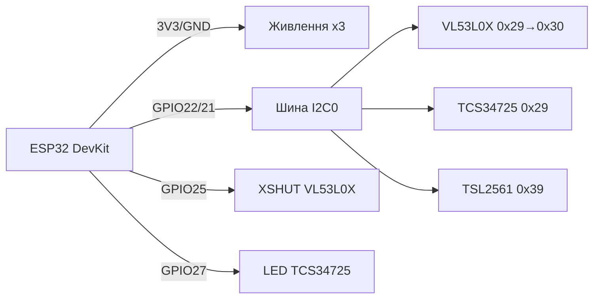

# VL53L0X / TCS34725 / TSL2561 - дальність, колір та освітленість

![[assets/img/light-tof-scheme.png|500]]
*Рис. 1. Оптичні I2C-сенсори на спільній шині ESP32: ToF-далекомір, датчик кольору та люксметр.*

## Призначення

Оптична трійка для робототехніки та розумного дому. VL53L0X - лазерний ToF-далекомір до 2 м (940 нм), заміна ультразвуку HC-SR04 там, де потрібні міліметри та вузький промінь. TCS34725 - RGB-датчик кольору з ІЧ-фільтром для сортувальників, підсвічування та калібрування дисплеїв. TSL2561 - люксметр з двома фотодіодами (видимий + ІЧ) для автопідсвічування та теплиць. Бонус: VEML6070 - дешевий UVA-сенсор для індексу ультрафіолету. Усі - I2C, легко вішаються на одну шину.

## Характеристики

| Параметр | VL53L0X | TCS34725 | TSL2561 | VEML6070 (бонус) |
| --- | --- | --- | --- | --- |
| Вимір | Відстань 30-2000 мм | RGB + Clear, ІЧ-фільтр | Освітленість 0.1-40000 лк | UVA 280-400 нм |
| Принцип | ToF лазер 940 нм | 4 фотодіоди + LED | 2 фотодіоди (VIS+IR) | Фотодіод UVA |
| Інтерфейс | I2C 0x29 (змінна!) | I2C 0x29 (фікс!) | I2C 0x29/0x39/0x49 (ADDR) | I2C 0x38/0x39 |
| Точність | ±3 % до 1.2 м | - | ±15 % (люкси) | Кроки UVA |
| Швидкість | До 50 Гц | 2.4-614 мс інтеграція | 13-402 мс | ~125 мс |
| Поле зору | 25° | - | Широке | Широке |
| Живлення | 2.6-3.6 В (модуль 3.3-5 В) | 3.3-5 В | 2.7-3.6 В | 2.7-5.5 В |
| Струм | 19 мА (лазер) | 235 мкА + LED | 0.5 мА | 270 мкА |
| Ціна | ~$4-5 | ~$3 | ~$3 | ~$2 |

> Увага: VL53L0X, TCS34725 та TSL2561 з заводу мають адресу 0x29! На одній шині - конфлікт. Рішення: пін XSHUT у VL53L0X для зміни адреси або I2C-мультиплексор. TSL2561 перемикається перемичкою ADDR.

## Легенда пінів модуля

| Пін | Тип | Куди | Примітка |
| --- | --- | --- | --- |
| VCC (VIN) | Живлення | 3V3 ESP32 | Усі три модулі GY - 3.3 В (з LDO терплять 5 В) |
| GND | Земля | GND ESP32 | Спільна |
| SCL / SDA | I2C | GPIO22 / GPIO21 | Pull-up 4.7 кОм; усі на одній шині |
| XSHUT (VL53L0X) | Вхід вимкнення | GPIO (напр. 25/26/27) | LOW - сенсор мовчить; по черзі піднімати для призначення адрес |
| GPIO1 (VL53L0X) | Вихід переривання | GPIO (опційно) | Поріг дистанції без опитування |
| INT (TCS34725/TSL2561) | Вихід, open-drain | GPIO (опційно) | Переривання порогу кольору/люксів, pull-up 10 кОм |
| LED (TCS34725) | Вхід керування LED | GPIO або VCC | HIGH - підсвіт увімкнено; для економії - через GPIO |
| ADDR (TSL2561) | Вхід | GND/VCC/NC | GND→0x29, VCC→0x49, NC→0x39 (типово) |

## Схема підключення

| ESP32 | Модуль | Примітка |
| --- | --- | --- |
| 3V3 | VCC усіх | Струм: VL53L0X 19 мА + решта < 2 мА |
| GND | GND усіх | Спільна земля |
| GPIO22 | SCL усіх | Одна шина I2C0 |
| GPIO21 | SDA усіх | Одна шина I2C0 |
| GPIO25 | VL53L0X №1 XSHUT | Для зміни адреси: тримати LOW, підняти першим |
| GPIO26 | VL53L0X №2 XSHUT (якщо два) | Другий далекомір на тій самій шині |
| GPIO27 | TCS34725 LED | Керування підсвітом обʼєкта |
| GPIO34 | TSL2561 INT (опційно) | Поріг сутінків для автопідсвічування |

### ASCII-схема

```text
       ESP32 DevKit                Оптичні модулі (I2C0)
   +-----------------+     +-------------------------------+
   | 3V3 ------------+---->VCC VL53L0X / TCS34725 / TSL2561 |
   | GND ------------+---->GND x3                          |
   | G22 SCL --------+---->SCL x3 (pull-up 4.7k)           |
   | G21 SDA --------+---->SDA x3 (pull-up 4.7k)           |
   | G25 ------------+---->XSHUT VL53L0X (адреса!)         |
   | G27 ------------+---->LED TCS34725                   |
   +-----------------+     +-------------------------------+
   Адреси: VL53L0X -> 0x30 (після XSHUT), TCS -> 0x29, TSL -> 0x39
```

### Mermaid



## Код ESP-IDF

```c
#include "driver/i2c.h"
#include "esp_log.h"

#define I2C_PORT I2C_NUM_0
#define VL_ADDR 0x29
static const char *TAG = "opt";

// Спрощено: ініціалізація VL53L0X через esp-idf-lib (vl53l0x.h)
#include "vl53l0x.h"

void app_main(void)
{
    i2c_config_t cfg = {.mode = I2C_MODE_MASTER, .sda_io_num = 21,
        .scl_io_num = 22, .sda_pullup_en = 1, .scl_pullup_en = 1,
        .master.clk_speed = 400000}; // швидкий I2C для ToF
    i2c_param_config(I2C_PORT, &cfg);
    i2c_driver_install(I2C_PORT, cfg.mode, 0, 0, 0);

    // Два VL53L0X: обидва XSHUT LOW, піднімати по черзі і міняти адресу
    // gpio_set_level(PIN_XSHUT1, 1); vl53l0x_set_address(0x30); ...

    vl53l0x_handle_t tof;
    vl53l0x_init(&tof, I2C_PORT, VL_ADDR);
    vl53l0x_set_timing_budget(&tof, 33000); // 33 мс, баланс швидкість/точність
    for (;;) {
        uint16_t mm = 0;
        if (vl53l0x_read_single(&tof, &mm) == ESP_OK)
            ESP_LOGI(TAG, "Дистанція: %d мм", mm);
        vTaskDelay(pdMS_TO_TICKS(100));
    }
}
// TCS34725: запис ENABLE=0x03, ATIME=інтеграція; читання CDATA/R/G/B (0x14–0x1B).
// TSL2561: POWER=0x03, читання CH0/CH1, люкси = f(CH0, CH1, gain, integration).
```

## Код Arduino

```cpp
#include <Wire.h>
#include <Adafruit_VL53L0X.h>
#include <Adafruit_TCS34725.h>
#include <Adafruit_TSL2561_U.h>

Adafruit_VL53L0X tof;
Adafruit_TCS34725 tcs(TCS34725_INTEGRATIONTIME_154MS, TCS34725_GAIN_4X);
Adafruit_TSL2561_Unified tsl(12345);

void setup() {
  Serial.begin(115200);
  Wire.begin(21, 22);
  pinMode(25, OUTPUT);
  // XSHUT-послідовність для зміни адреси VL53L0X:
  // digitalWrite(25, LOW); delay(10); digitalWrite(25, HIGH); delay(10);
  // tof.begin(0x30);
  if (!tof.begin()) Serial.println("VL53L0X не знайдено!");
  if (!tcs.begin()) Serial.println("TCS34725 не знайдено!");
  if (!tsl.begin()) Serial.println("TSL2561 не знайдено!");
  tsl.enableAutoRange(true);
  tsl.setIntegrationTime(TSL2561_INTEGRATIONTIME_402MS);
}

void loop() {
  VL53L0X_RangingMeasurementData_t m;
  tof.rangingTest(&m);
  if (m.RangeStatus != 4) Serial.printf("ToF: %d мм\n", m.RangeMilliMeter);
  uint16_t r, g, b, c;
  tcs.getRawData(&r, &g, &b, &c);
  Serial.printf("RGB: %d %d %d clear=%d\n", r, g, b, c);
  sensors_event_t e;
  tsl.getEvent(&e);
  if (e.light) Serial.printf("Lux: %.1f\n", e.light);
  delay(300);
}
```

## Код MicroPython

```python
from machine import I2C, Pin
import time

i2c = I2C(0, scl=Pin(22), sda=Pin(21), freq=400000)
print("I2C:", [hex(a) for a in i2c.scan()])

# VL53L0X через драйвер (micropython-vl53l0x)
# import vl53l0x
# tof = vl53l0x.VL53L0X(i2c)
# tof.start()
# print(tof.read(), "мм")

# TCS34725 вручну: увімкнути
TCS = 0x29
i2c.writeto_mem(TCS, 0x80 | 0x00, bytes([0x03]))  # ENABLE PON+AEN
time.sleep_ms(600)
c = int.from_bytes(i2c.readfrom_mem(TCS, 0xA0 | 0x14, 2), 'little')
r = int.from_bytes(i2c.readfrom_mem(TCS, 0xA0 | 0x16, 2), 'little')
g = int.from_bytes(i2c.readfrom_mem(TCS, 0xA0 | 0x18, 2), 'little')
b = int.from_bytes(i2c.readfrom_mem(TCS, 0xA0 | 0x1A, 2), 'little')
print("RGB:", r, g, b, "clear:", c)

# TSL2561 (драйвер tsl2561.py):
# import tsl2561
# s = tsl2561.TSL2561(i2c)
# print(s.read(), "lux")
```

## Типові помилки

| № | Помилка | Симптом | Рішення |
| --- | --- | --- | --- |
| 1 | Три сенсори на 0x29 одночасно | `i2c.scan()` показує один адрес, дані сміттєві | XSHUT-послідовність для VL53L0X або TCA9548A; TSL2561 перемкнути на 0x39/0x49 |
| 2 | VL53L0X дивиться крізь скло | Дистанція завжди 20-60 мм | Скло має бути ІЧ-прозорим; калібрувати offset, у коді віднімати константу |
| 3 | Сонце засвічує ToF | RangeStatus=4 на вулиці | Обмежити до 1.2 м на сонці, додати бленду, усереднювати 5 вимірів |
| 4 | TCS34725 без LED в темряві | RGB ≈ 0 | Увімкнути LED (пін LED → HIGH) або зовнішнє підсвічування 5700K |
| 5 | Не та інтеграція TCS/TSL | Насичення 65535 або шум | Яскраво → 2.4 мс + GAIN_1X; темно → 614 мс + GAIN_60X (авторежим) |
| 6 | VEML6070 плутають з люксметром | «Люкси» не збігаються | VEML6070 міряє лише UVA - для люксів потрібен TSL2561/BH1750 |
| 7 | I2C 100 кГц для трьох сенсорів | ToF не встигає 50 Гц | Підняти до 400 кГц, короткі дроти < 20 см |

## Офіційні джерела

- VL53L0X Product Page (ST) - `перевірити вручну` (таймаут з цього середовища).
- [VL53L0X - живе фото (Adafruit)](https://www.adafruit.com/product/3317) - сторінка товару з фото.
- [Гайд VL53L0X з кодом (Adafruit Learn)](https://learn.adafruit.com/adafruit-vl53l0x-micro-lidar-distance-sensor-breakout) - вимірювання дальності, приклади.
- [TCS34725 - живе фото (Adafruit)](https://www.adafruit.com/product/1334) - сторінка товару з фото.
- [TSL2561 - живе фото (Adafruit)](https://www.adafruit.com/product/439) - сторінка товару з фото.

## Див. також

- [[10-Sensori/05-HC-SR04-PIR]]
- [[10-Sensori/06-INA219-HX711-BH1750]]
- [[04-Shini/03-I2C|I2C]]
- [[10-Sensori/03-BME280-BMP280-SHT31]]
- [[10-Sensori/07-AHT10-AHT20-SHT40]]
- [[03-GPIO/01-GPIO-oglyad]]
- [[03-GPIO/04-Pererivannya-PWM]]
