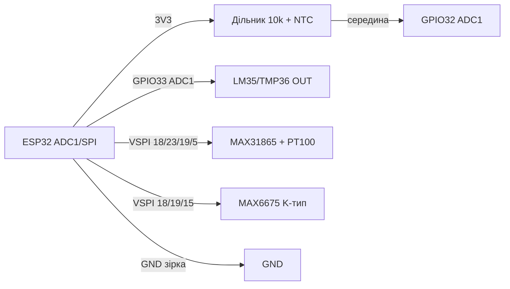

# NTC / PT100 / MAX6675 / LM35 - аналогові датчики температури

![[assets/img/temp-analog-scheme.png|500]]
*Рис. 1. Аналогові датчики температури: NTC-дільник на ADC та термопара MAX6675 по SPI.*

## Призначення

Аналогові та резистивні датчики температури для задач, де цифрові DS18B20/SHT40 не підходять: високі температури (піч, 3D-принтер, паяльник), агресивні середовища, гальванічна простота. NTC 10к - термістор у дільнику на ADC для бойлерів і теплиць. PT100 + MAX31865 - платиновий еталон −200…+850 °C для промисловості. MAX6675 - готовий SPI-модуль K-термопари 0…1024 °C для печей і хотендів. LM35/TMP36 - лінійні давачі 10 мВ/°C для простих індикаторів. Усі читаються через ADC або SPI ESP32.

> Увага: ADC2 ESP32 не працює одночасно з Wi-Fi! Аналогові датчики вішати лише на піни ADC1 (GPIO32-39).

## Характеристики

| Параметр | NTC 10к (3950) | PT100 + MAX31865 | MAX6675 (K-тип) | LM35 / TMP36 |
| --- | --- | --- | --- | --- |
| Діапазон | −40…+125 °C | −200…+850 °C | 0…+1024 °C | −55…+150 °C / −40…+125 °C |
| Точність | ±1 % (≈ ±0.5 °C з калібруванням) | ±0.5 °C (клас A) | ±2 °C + похибка термопари | ±0.5 °C / ±1 °C |
| Вихід | Опір 10к при 25 °C, B=3950 | Опір 100 Ом при 0 °C | SPI 12 біт, 0.25 °C/LSB | 10 мВ/°C (LM35: 0 мВ при 0 °C; TMP36: 500 мВ при 0 °C) |
| Інтерфейс | ADC через дільник | SPI (MAX31865) | SPI read-only | ADC безпосередньо |
| Живлення | 3.3 В (дільник) | 3.3 В | 3.3-5 В | 4-30 В (LM35) / 2.7-5.5 В (TMP36) |
| Струм | < 0.5 мА | 1 мА | 50 мА | 60 мкА |
| Ціна | ~$0.5 | ~$8-12 (модуль+зонд) | ~$4-5 | ~$1 |

### Формула Steinhart-Hart для NTC (спрощена B-параметрична)

```text
R = R0 * exp(B * (1/T - 1/T0)),  T у кельвінах
T = 1 / (1/T0 + ln(R/R0)/B)
R0 = 10000 Ом, T0 = 298.15 K, B = 3950
R = Rseries * ADCmax/ADC - Rseries  (верхній Rseries=10к до 3V3)
```

## Легенда пінів модуля

| Пін | Тип | Куди | Примітка |
| --- | --- | --- | --- |
| NTC пін 1 | Аналог | 3V3 через 10 кОм (верх дільника) | Точний резистор 10к 1 % металоплівковий |
| NTC пін 2 | Аналог | GND + вузол до ADC | Середина дільника → GPIO32-35 (ADC1!) + 100 нФ на GND |
| PT100 (2/3/4 дроти) | Опір | F+ / F− / RTD± MAX31865 | 3-дротова - компроміс; 4-дротова - максимум точності |
| MAX31865 SCK/SDI/SDO/CS | SPI | GPIO18/23/19/5 | Окремий CS; DRDY → GPIO опційно |
| MAX6675 SCK/SO/CS | SPI read-only | GPIO18/19/5 (MOSI не потрібен) | SO → MISO; опитування не частіше 4 Гц (220 мс конверсія) |
| LM35 OUT | Аналог 10 мВ/°C | GPIO32-39 (ADC1) | При 150 °C - 1.5 В, в межах ADC; довгі дроти - екран |
| TMP36 OUT | Аналог | GPIO32-39 (ADC1) | 750 мВ при 25 °C; відʼємні температури - без дільника |

## Схема підключення

| ESP32 | Модуль | Примітка |
| --- | --- | --- |
| 3V3 | Верх дільника NTC (10 кОм), MAX31865 VCC, MAX6675 VCC | LM35 - від 5 В для повного діапазону |
| GND | Низ NTC, GND усіх модулів, екран дротів | Аналогова земля коротка, зірка |
| GPIO32 (ADC1_CH4) | Середина дільника NTC / LM35 OUT | Тільки ADC1! GPIO32-39; атенюація 11 дБ |
| GPIO33 (ADC1_CH5) | TMP36 OUT (другий канал) | Калібрувати `esp_adc_cal` |
| GPIO18/23/19/5 | MAX31865 SCK/SDI/SDO/CS | Апаратний VSPI |
| GPIO15 | MAX6675 CS (другий пристрій) | Свій CS на кожен SPI-модуль; SCK/SO спільні |
| GPIO34 | MAX6675 SO через MISO (спільний) | Або окремий SPI-хост HSPI |

### ASCII-схема

```text
   NTC-дільник (ADC1!)              MAX6675 (SPI)
   3V3 --[10k 1%]--+                ESP32  <->  MAX6675
                   |                G18 SCK --> SCK
                   +--> G32 (ADC1)  G19 MISO <- SO
                   |                G5  CS  --> CS
   NTC --+---------+                (MOSI не потрібен)
         |         |
        GND   [100nF]                   PT100 -> MAX31865
                                       F+/F-/RTD по схемі 3-дроти
```

### Mermaid



## Код ESP-IDF

```c
#include <math.h>
#include "driver/adc.h"
#include "esp_adc_cal.h"
#include "driver/spi_master.h"
#include "esp_log.h"

static const char *TAG = "temp";
#define NTC_RSER 10000.0f
#define NTC_R0   10000.0f
#define NTC_B    3950.0f

static float ntc_to_c(int mv)
{
    float v = mv / 1000.0f;
    float r = NTC_RSER * v / (3.3f - v); // верхній 10к до 3V3
    float t = 1.0f / (1.0f / 298.15f + logf(r / NTC_R0) / NTC_B) - 273.15f;
    return t;
}

// MAX6675: 16 біт, D15 dummy, D14–D3 дані 0.25 C/LSB, D2 = термопара відʼєднана
static float max6675_read(spi_device_handle_t dev)
{
    uint8_t rx[2] = {0};
    spi_transaction_t t = {.length = 16, .rx_buffer = rx};
    ESP_ERROR_CHECK(spi_device_transmit(dev, &t));
    uint16_t v = (rx[0] << 8) | rx[1];
    if (v & 0x04) { ESP_LOGW(TAG, "Термопара відʼєднана!"); return NAN; }
    return ((v >> 3) & 0xFFF) * 0.25f;
}

void app_main(void)
{
    adc1_config_width(ADC_WIDTH_BIT_12);
    adc1_config_channel_atten(ADC1_CHANNEL_4, ADC_ATTEN_DB_11); // GPIO32
    esp_adc_cal_characteristics_t cal;
    esp_adc_cal_characterize(ADC_UNIT_1, ADC_ATTEN_DB_11, ADC_WIDTH_BIT_12, 1100, &cal);
    for (;;) {
        uint32_t mv = 0;
        esp_adc_cal_get_voltage(ADC1_CHANNEL_4, &cal, &mv);
        // усереднення 64 вибірок для шуму:
        ESP_LOGI(TAG, "NTC: %.1f C (ADC %lu мВ)", ntc_to_c((int)mv), mv);
        vTaskDelay(pdMS_TO_TICKS(1000));
    }
}
```

## Код Arduino

```cpp
#include <SPI.h>
#include <max6675.h>
#include <Adafruit_MAX31865.h>

// NTC на GPIO32 (ADC1), LM35 на GPIO33
#define NTC_PIN 32
#define LM35_PIN 33

// MAX6675: SCK=18, SO=19, CS=15
MAX6675 tc(18, 15, 19);
// PT100: CS=5, драйв 3-дроти
Adafruit_MAX31865 pt100(5, 23, 19, 18);

float readNTC() {
  long sum = 0;
  for (int i = 0; i < 64; i++) { sum += analogRead(NTC_PIN); delay(2); }
  float adc = sum / 64.0;
  float v = adc * 3.3 / 4095.0;
  float r = 10000.0 * v / (3.3 - v);
  return 1.0 / (1.0 / 298.15 + log(r / 10000.0) / 3950.0) - 273.15;
}

void setup() {
  Serial.begin(115200);
  analogReadResolution(12);
  analogSetAttenuation(ADC_11db);
  pt100.begin(MAX31865_3WIRE);
}

void loop() {
  Serial.printf("NTC=%.1f C  LM35=%.1f C  K-type=%.1f C  PT100=%.1f C\n",
    readNTC(), analogReadMilliVolts(LM35_PIN) / 10.0,
    tc.readCelsius(), pt100.temperature(100.0, 430.0));
  delay(1000); // MAX6675 не частіше 4 Гц!
}
```

## Код MicroPython

```python
from machine import ADC, Pin, SPI
import time
import math

ntc = ADC(Pin(32)); ntc.atten(ADC.ATTN_11DB); ntc.width(ADC.WIDTH_12BIT)
lm35 = ADC(Pin(33)); lm35.atten(ADC.ATTN_11DB); lm35.width(ADC.WIDTH_12BIT)

def read_ntc():
    s = sum(ntc.read() for _ in range(64)) / 64
    v = s * 3.3 / 4095
    r = 10000 * v / (3.3 - v)
    return 1 / (1 / 298.15 + math.log(r / 10000) / 3950) - 273.15

spi = SPI(2, baudrate=1000000, sck=Pin(18), miso=Pin(19))
cs = Pin(15, Pin.OUT, value=1)

def read_max6675():
    cs(0); d = spi.read(2); cs(1)
    v = (d[0] << 8) | d[1]
    if v & 0x04:
        return None  # термопара відʼєднана
    return ((v >> 3) & 0xFFF) * 0.25

while True:
    print("NTC={:.1f} LM35={:.1f} K={}".format(
        read_ntc(), lm35.read() * 3.3 / 4095 * 100, read_max6675()))
    time.sleep(1)
```

## Типові помилки

| № | Помилка | Симптом | Рішення |
| --- | --- | --- | --- |
| 1 | NTC/LM35 на ADC2 (GPIO0/2/4/12-15/25-27) + Wi-Fi | Показання 4095 або нулі при ввімкненому Wi-Fi | Використовувати лише ADC1 (GPIO32-39); ADC2 недоступний з Wi-Fi |
| 2 | Без калібрування `esp_adc_cal` | Похибка ±10 % на краях діапазону | Калібрувати eFuse (`characterize`), усереднювати 64 вибірки |
| 3 | Резистор дільника 5 % вуглецевий | Зсув 2-3 °C | Металоплівка 10к 1 % + вимір реального опору мультиметром |
| 4 | MAX6675 опитування частіше 4 Гц | Старі дані, стрибки | Пауза ≥ 250 мс між читаннями (конверсія 220 мс) |
| 5 | Біт D2 MAX6675 ігнорують | 0 °C замість аварії при обриві | Перевіряти `v & 0x04` - термопара відʼєднана |
| 6 | PT100 2-дротова без компенсації | +1-2 °C від опору дротів | 3- або 4-дротова схема; Rref 430 Ом 0.1 % |
| 7 | Довгі аналогові дроти без екрана | Шум ±5 °C біля реле/моторів | Вита пара + екран на GND, 100 нФ біля ADC, медіана з 16 вибірок |

## Офіційні джерела

- [LM35 - сторінка продукту і даташит (TI)](https://www.ti.com/product/LM35) - офіційні характеристики та документація.
- [MAX31865-підсилювач PT100 - живе фото (Adafruit)](https://www.adafruit.com/product/3328) - сторінка товару з фото; даташит MAX31865/MAX6675 (Analog/Maxim) - `перевірити вручну` (сайт блокує ботів).
- [Розбір MAX6675 + термопара з кодом (LME)](https://lastminuteengineers.com/max6675-thermocouple-arduino-tutorial/) - підключення, компенсація холодного спаю.
- NTC-таблиці R-T - `перевірити вручну` (за даташитом конкретного термістора).

## Див. також

- [[10-Sensori/02-DS18B20|DS18B20]]
- [[10-Sensori/01-DHT11-DHT22]]
- [[10-Sensori/09-ADS1115-MCP3008-PCF8574-MCP23017]]
- [[06-Analog/01-ADC|ADC]]
- [[04-Shini/02-SPI|SPI]]
- [[04-Shini/03-I2C|I2C]]
- [[10-Sensori/03-BME280-BMP280-SHT31]]
