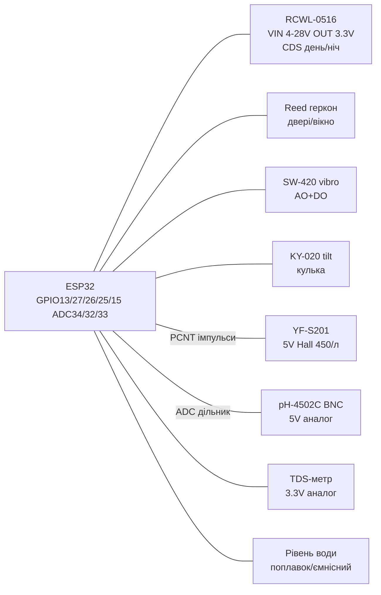

# RCWL-0516, геркон Reed, SW-420, KY-020, YF-S201, рівень води, pH-4502C, TDS

![[assets/img/security-flow-scheme.png|500]]

## Призначення

Набір «охорона + рідини»: RCWL-0516 - мікрохвильовий доплерівський радар руху (бачить крізь пластик/гіпс, не крізь метал), геркон Reed - магнітний контакт дверей/вікон, SW-420 - вібрація/удари (пружинний датчик + LM393), KY-020 - нахил/кулька (tilt), YF-S201 - витрата води (крильчатка + Холл, імпульси), поплавковий/ємнісний рівень води, pH-4502C - кислотність та TDS-метр - мінералізація. Застосування: сигналізація, антивандальність, облік води/полив, акваріуми/гідропоніка.

## Характеристики

| Параметр | RCWL-0516 радар | Reed геркон | SW-420 вібрація | KY-020 нахил |
| --- | --- | --- | --- | --- |
| Принцип | Доплер 3.18 ГГц, мікрохвилі | Герметичний контакт + магніт | Пружина в трубці + LM393 | Кулька замикає контакти |
| Живлення | VIN 4-28 В (стаб. 3.3 В на борту) | Пасивний (підтяжка ESP32) | 3.3-5 В | Пасивний |
| Вихід | OUT 3.3 В HIGH ~2 с на рух | Замкнутий/розімкнутий | AO + DO (поріг) | HIGH/LOW (орієнтація) |
| Дальність/чутливість | 5-9 м, 360° (крізь стіни б'є!) | Зазор 10-20 мм з магнітом | Стукіт/вібрація, потенціометр | Нахил >15-30° |
| Струм | ~3 мА | ~0 (підтяжка 10 кОм) | ~15 мА (світлодіоди) | ~0 |
| Особливе | Пін CDS - блокування вдень (фоторезистор) | Нормально-розімкнутий NO | C-R затримка, дзвін | Брязкіт - потрібен дебаунс |

| Параметр | YF-S201 витрата | Рівень води | pH-4502C | TDS-метр |
| --- | --- | --- | --- | --- |
| Принцип | Крильчатка + Холл | Поплавок-геркон / ємнісна гребінка | Скляний електрод BNC + OP | 2 електроди, провідність |
| Живлення | 5-18 В (сигнал 5 В → дільник!) | 3.3-5 В / пасивний | 5 В (плата), електрод пасивний | 3.3-5 В |
| Вихід | NPN-імпульси ~450/л (F=7.5×Q) | Аналог / цифра / опір | Аналог 0-5 В → pH 0-14 | Аналог 0-2.3 В → 0-1000 ppm |
| Діапазон | 1-30 л/хв | 0-100 % | pH 0-14, ±0.1 після калібрування | 0-1000+ ppm, залежить від T |
| Калібрування | Пролити 1 л, порахувати імпульси | Мін/макс бака | Буфери pH 6.86 + 4.00/9.18 | Розчин 342/1413 ppm + термокомпенсація |
| Застереження | Тільки чиста вода, фільтр на вході | Корозія гребінки - живити імпульсно | Електрод тримати вологим (KCl), не в дистиляті! | Поляризація - міряти AC/імпульсно |

## Легенда пінів модуля

| RCWL-0516 | Призначення | Куди на ESP32 |
| --- | --- | --- |
| VIN | Живлення 4-28 В (тип. 5 В) | 5V (VIN/VU) |
| GND | Земля | GND |
| OUT | 3.3 В HIGH на рух (~2 с утримання) | GPIO13 (RTC-GPIO для wake-up) безпосередньо |
| CDS | Блокування: <0.7 В - заблоковано; підключити фоторезистор на землю для «тільки вночі» | Залишити вільним або фоторезистор 10 кОм |
| 3V3 | Вихід стабілізатора (не вхід!) | Не живити звідси ESP32 |

| SW-420 / KY-020 / Reed | Призначення |
| --- | --- |
| VCC / GND (SW-420) | 3.3 В / GND |
| DO (SW-420) | Поріг вібрації, чутливість потенціометром |
| AO (SW-420) | Сира пружина (стрибає) - для осцилографа |
| Reed 2 дроти | Один на GND, другий на GPIO + `INPUT_PULLUP`; замкнутий = LOW |
| KY-020 3 піни | S → GPIO, middle → GND/VCC за маркуванням (часто S/VCC/GND); перевірити шелкографію! |

| YF-S201 (3 дроти) | Призначення | Куди |
| --- | --- | --- |
| Червоний | 5 В | 5V |
| Чорний | GND | GND |
| Жовтий | Імпульси (5 В амплітуда!) | GPIO через дільник 2:1 або оптопару → GPIO15/PCNT |

| pH-4502C (плата) | Призначення |
| --- | --- |
| VCC/GND | 5 В / GND (аналог чутливий - окремий провід землі!) |
| Po (AO) | Аналог pH → GPIO34 через дільник (плата видає до ~5 В) |
| BNC | Електрод; гайка-регулювання offset, друга - gain |
| To | Термістор температури (опційно) → ADC для компенсації |

| TDS (3 піни) | Призначення |
| --- | --- |
| VCC/GND | 3.3 В (стабільне! бо вимір ратіометричний) |
| AO | Аналог ~0-2.3 В → GPIO32, формула з EC + T |

## Схема підключення

| ESP32 | Модуль | Примітка |
| --- | --- | --- |
| 5V | RCWL VIN, YF-S201 VCC, pH VCC | Радар і витрата тільки 5 В |
| 3V3 | SW-420 VCC, TDS VCC | TDS краще стабільні 3.3 В |
| GND | Усі GND | Зіркою до однієї точки |
| GPIO13 | RCWL OUT | Безпосередньо 3.3 В; RTC-GPIO для deep-sleep wake |
| GPIO27 | Reed (другий дріт на GND) | `INPUT_PULLUP`, переривання |
| GPIO26 | SW-420 DO | [[03-GPIO/04-Pererivannya-PWM]] |
| GPIO25 | KY-020 S | Дебаунс 50 мс |
| GPIO15 | YF-S201 жовтий через дільник | PCNT-вхід, див. код |
| GPIO34 | pH Po через дільник | [[06-Analog/01-ADC | ADC]] |
| GPIO32 | TDS AO | ADC + DS18B20 для T |
| GPIO33 | Рівень води AO | Ємнісний - живити через GPIO16 імпульсно |

### ASCII-схема

```text
              ESP32-DevKitC
            +------------------+
 5V --------| 5V         GND   |--- GND (RCWL/YF/pH)
 3V3 -------| 3V3       GPIO13 |--- OUT (RCWL-0516, 3.3V OK)
 GND -------| GND       GPIO27 |--- Reed --- GND (INPUT_PULLUP)
            |           GPIO26 |--- DO (SW-420)
            |           GPIO25 |--- S (KY-020 tilt)
            |           GPIO15 |---< 10k >---+---< 20k >--- YF-S201 yellow (5V->3.3V)
            |           GPIO34 |---< дільник >--- pH Po
            |           GPIO32 |--- AO (TDS)
            |           GPIO33 |--- AO (рівень води)
            +------------------+

 RCWL CDS: пусто (цілодобово) або фоторезистор до GND (нічний режим).
 YF-S201: стрілка потоку за корпусом! Фільтр-сітка на вході.
```

### Mermaid



## Код ESP-IDF

```c
#include "driver/gpio.h"
#include "driver/adc.h"
#include "driver/pcnt.h"
#include "esp_log.h"
#include "freertos/FreeRTOS.h"
#include "freertos/task.h"

#define RCWL_OUT  GPIO_NUM_13
#define REED_PIN  GPIO_NUM_27
#define FLOW_PIN  GPIO_NUM_15
static const char *TAG = "sec";

// YF-S201: ~450 імп/л => Q(л/хв) = f(Гц)/7.5
static void pcnt_init(void) {
    pcnt_config_t c = {
        .pulse_gpio_num = FLOW_PIN,
        .ctrl_gpio_num = PCNT_PIN_NOT_USED,
        .channel = PCNT_CHANNEL_0,
        .unit = PCNT_UNIT_0,
        .pos_mode = PCNT_COUNT_INC,   // рахувати rising
        .neg_mode = PCNT_COUNT_DIS,
        .counter_h_lim = 32767,
    };
    pcnt_unit_config(&c);
    pcnt_counter_clear(PCNT_UNIT_0);
    pcnt_counter_resume(PCNT_UNIT_0);
}

void app_main(void) {
    gpio_set_direction(RCWL_OUT, GPIO_MODE_INPUT);
    gpio_set_direction(REED_PIN, GPIO_MODE_INPUT);
    gpio_set_pull_mode(REED_PIN, GPIO_PULLUP_ONLY);
    adc1_config_width(ADC_WIDTH_BIT_12);
    adc1_config_channel_atten(ADC1_CHANNEL_6, ADC_ATTEN_DB_11); // pH GPIO34
    pcnt_init();
    int16_t cnt = 0, prev = 0;
    for (;;) {
        pcnt_get_counter_value(PCNT_UNIT_0, &cnt);
        int16_t d = cnt - prev; prev = cnt;      // імпульси за 1 с
        float q = d / 7.5f;                       // л/хв
        int ph_raw = adc1_get_raw(ADC1_CHANNEL_6);
        ESP_LOGI(TAG, "radar=%d reed=%d flow=%.2f L/min pHraw=%d",
            gpio_get_level(RCWL_OUT), gpio_get_level(REED_PIN), q, ph_raw);
        vTaskDelay(pdMS_TO_TICKS(1000));
    }
}
```

## Код Arduino

```cpp
#define RCWL_OUT 13
#define REED 27
#define VIB_DO 26
#define TILT 25
#define FLOW 15
#define PH_PO 34
#define TDS_AO 32

volatile unsigned long pulses = 0;
void IRAM_ATTR onPulse() { pulses++; }

void setup() {
  Serial.begin(115200);
  pinMode(RCWL_OUT, INPUT);
  pinMode(REED, INPUT_PULLUP);
  pinMode(VIB_DO, INPUT);
  pinMode(TILT, INPUT_PULLUP);
  pinMode(FLOW, INPUT);
  attachInterrupt(digitalPinToInterrupt(FLOW), onPulse, RISING); // [[03-GPIO/04-Pererivannya-PWM]]
  analogReadResolution(12);
}

void loop() {
  static unsigned long t0 = 0, p0 = 0;
  if (millis() - t0 >= 1000) {
    noInterrupts(); unsigned long p = pulses; interrupts();
    float q = (p - p0) / 7.5; p0 = p; t0 = millis(); // л/хв
    // pH: калібрування: Po при pH7 ~2.5В (після дільника перерахувати!)
    int phRaw = analogRead(PH_PO);
    float v = phRaw * 3.3 / 4095.0 * 1.5;
    float ph = 7.0 + (2.5 - v) / 0.18; // нахил ~59мВ/pH × gain плати
    Serial.printf("radar=%d reed=%d vib=%d tilt=%d Q=%.2f L/m pH=%.2f TDS=%d\n",
      digitalRead(RCWL_OUT), digitalRead(REED), digitalRead(VIB_DO),
      digitalRead(TILT), q, ph, analogRead(TDS_AO));
  }
}
```

## Код MicroPython

```python
from machine import Pin, ADC
import time

rcwl = Pin(13, Pin.IN)
reed = Pin(27, Pin.IN, Pin.PULL_UP)
vib = Pin(26, Pin.IN)
tilt = Pin(25, Pin.IN, Pin.PULL_UP)
flow = Pin(15, Pin.IN, Pin.PULL_UP)
ph = ADC(Pin(34)); ph.atten(ADC.ATTN_11DB)
tds = ADC(Pin(32)); tds.atten(ADC.ATTN_11DB)

pulses = 0
def on_pulse(p): global pulses; pulses += 1
flow.irq(trigger=Pin.IRQ_RISING, handler=on_pulse)

p0, t0 = 0, time.ticks_ms()
while True:
    if time.ticks_diff(time.ticks_ms(), t0) >= 1000:
        q = (pulses - p0) / 7.5; p0 = pulses; t0 = time.ticks_ms()
        v = ph.read() * 3.3 / 4095 * 1.5
        phv = 7.0 + (2.5 - v) / 0.18
        print("radar={} reed={} vib={} tilt={} Q={:.2f} pH={:.2f} tds={}".format(
            rcwl.value(), reed.value(), vib.value(), tilt.value(), q, phv, tds.read()))
    time.sleep_ms(50)
```

## Типові помилки

1. **RCWL живити від 3.3 В** → нестабільні спрацювання. Тільки VIN 5 В (4-28 В).
2. **RCWL бачить крізь стіну** → тригер від сусідньої кімнати. Зменшити дальність (R-GND резистор), екранувати мідною фольгою ззаду, направити в потрібний бік.
3. **OUT RCWL 2 с утримання** → «залипання». Не опитувати частіше 100 мс, для точного часу - виміряти фронт [[03-GPIO/04-Pererivannya-PWM]].
4. **Reed без підтяжки / довгі дроти** → наводки. `INPUT_PULLUP` + конденсатор 100 нФ + вита пара.
5. **SW-420 дзвенить** → десятки спрацювань на один удар. Програмний дебаунс 100-200 мс або лічильник подій у вікні.
6. **YF-S201 сигнал 5 В в GPIO** → потрібен дільник/оптопара. Інакше - ризик для входу.
7. **YF-S201 без фільтра** → крильчатка клинить від піску. Сітка 40-60 меш на вході, стрілка потоку!
8. **PCNT переповнення** → скидати/читати щосекунди, `h_lim` 32767 при 30 л/хв дає ~225 Гц - ок.
9. **pH-електрод сухий / у дистиляті** → смерть електрода. Зберігати в 3M KCl, калібрувати буферами 6.86 + 4.00.
10. **TDS без термокомпенсації** → похибка 2 %/°C. Міряти T через DS18B20, формула `EC25 = EC/(1+0.02*(T-25))`.
11. **Рівень-гребінка постійно під живленням** → корозія. Живити через GPIO тільки на 50 мс виміру.

## Офіційні джерела

- [Туторіал RCWL-0516 з кодом (RNT)](https://randomnerdtutorials.com/arduino-rcwl-0516/) - радар руху, підключення, приклад.
- [Розбір RCWL-0516 з кодом (LME)](https://lastminuteengineers.com/rcwl0516-microwave-radar-motion-sensor-arduino-tutorial/) - принцип Доплера, джампери, приклади.
- [YF-S201: розпіновка та код витрати води (MicrocontrollersLab)](https://microcontrollerslab.com/water-flow-sensor-pinout-interfacing-with-arduino-measure-flow-rate/) - імпульси, формула л/хв.
- Reed/SW-420/Tilt Datasheet - `перевірити вручну`.

- EC25 Datasheet (Quectel, пошук PDF): [EC25 search](https://www.alldatasheet.com/view.jsp?Searchword=EC25) - LTE Cat-4 модуль.

## Див. також

- [[06-Analog/01-ADC|ADC]]
- [[03-GPIO/04-Pererivannya-PWM]]
- [[03-GPIO/01-GPIO-oglyad]]
- [[04-Shini/03-I2C|I2C]]
- [[04-Shini/02-SPI|SPI]]
- [[04-Shini/01-UART|UART]]
- [[10-Sensori/05-HC-SR04-PIR]]
- [[Home]]
