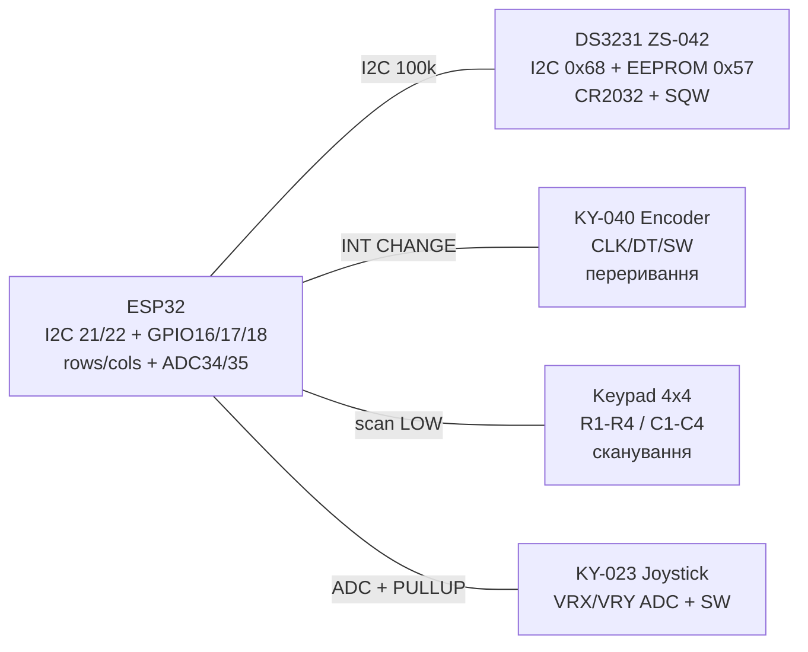

# DS3231 RTC, енкодер KY-040, клавіатура 4x4, джойстик KY-023

![[assets/img/rtc-hmi-scheme.png|500]]

## Призначення

Вузол «час + людський ввід»: DS3231 - прецизійний RTC з термокомпенсацією (±2 ppm, ~±1 хв/рік) та батарейкою CR2032 для ходу при знеструмленні; KY-040 - інкрементальний енкодер з кнопкою для меню/гучності/налаштувань; мембранна клавіатура 4×4 - 16 клавіш на 8 GPIO методом сканування; KY-023 - аналоговий джойстик (2×POT + кнопка) для керування роботами/меню. Разом - повноцінна панель керування без дисплея або разом з OLED/LCD.

## Характеристики

| Параметр | DS3231 RTC | KY-040 енкодер | Клавіатура 4×4 | KY-023 джойстик |
| --- | --- | --- | --- | --- |
| Інтерфейс | I2C 0x68 (+EEPROM AT24C32 0x57 на модулі ZS-042!) | CLK/DT квадратура + SW кнопка | 4 рядки + 4 стовпці (сканування) | VRX/VRY аналог + SW цифра |
| Живлення | 3.3-5 В + CR2032 (хід без живлення) | 3.3-5 В (механічні контакти) | Пасивна (підтяжки ESP32) | 3.3 В (POT 10 кОм!) |
| Точність/дозвіл | ±2 ppm 0-40 °C, секунди-рік + будильники | 20 кроків/оберт, 1-2 імп/крок | 16 клавіш, анти-«фантом» діодами (немає) | Центр ~1.65 В, краї 0/3.3 В |
| Виходи | INT/SQW (будильник/меандр 1 Гц-8 кГц) | Відкритий колектор → підтяжки | R1-R4 виходи, C1-C4 входи | AO ~0-3.3 В → [[06-Analog/01-ADC | ADC]] |
| Струм | ~200 мкА активний, ~3 мкА від батареї | ~0 (+підтяжки) | ~0 (імпульсно) | ~5 мА через POT |
| Особливе | 32K пін - 32.768 кГц; прапор OSF - втрата живлення | Брязкіт - апаратний RC + програмний дебаунс | Одночасні натискання - ghosting | Дрейф центру - калібрування |

> Модуль ZS-042 має підтяжки I2C до **5 В** та схему заряду батареї для акумулятора LIR2032! Якщо ставиш одноразову CR2032 - перерізати доріжку/випаяти діод/резистор заряду, інакше CR2032 нагріється/потече. Підтяжки I2C на модулі часто до 5 В - для ESP32 краще живити модуль від 3.3 В.

## Легенда пінів модуля

| DS3231 (ZS-042) | Призначення | Куди на ESP32 |
| --- | --- | --- |
| VCC | 3.3 В (рекомендовано для ESP32) | 3V3 |
| GND | Земля | GND |
| SDA / SCL | I2C дані/такт | GPIO21 / GPIO22 ([[04-Shini/03-I2C | I2C]]) |
| SQW (INT) | Переривання будильника / меандр | GPIO33 (вхід, підтяжка) |
| 32K | Вихід 32.768 кГц | Не підключати (або лічильник) |
| BAT | CR2032+ (на модулі тримач) | CR2032 3 В, мінус на GND плати |
| AT24C32 | EEPROM 0x57 на тих же SDA/SCL | Той же шинний шлейф |
| AT24C256 / CAT24C32 / FM24C64 | Більші EEPROM (256 Кбіт / FRAM!) на тих же SDA/SCL | Адреси 0x50-0x57 перемичками A0-A2; FM24C64 - FRAM: запис без затримок і практично без зносу |

| KY-040 енкодер | Призначення | Куди |
| --- | --- | --- |
| GND | Земля | GND |
| VCC (+) | Підтяжки (можна не підключати, використати внутрішні) | 3V3 або NC |
| CLK | Фаза A | GPIO16 ([[03-GPIO/04-Pererivannya-PWM]] переривання) |
| DT | Фаза B | GPIO17 (переривання) |
| SW | Кнопка (LOW при натисканні) | GPIO18 + `INPUT_PULLUP` |

| Клавіатура 4×4 (8 пінів) | Призначення |
| --- | --- |
| R1-R4 (рядки) | Виходи ESP32: по черзі LOW, решта HIGH-Z/HIGH |
| C1-C4 (стовпці) | Входи ESP32 з `INPUT_PULLUP`; натиснута = LOW на перетині |
| Шлейф | 8 дротів, довжина <30 см без екрану |

| KY-023 джойстик | Призначення | Куди |
| --- | --- | --- |
| GND / +5V (VCC) | Живлення POT - підключати до **3.3 В**, не 5 В! | 3V3 / GND |
| VRX | Вісь X 0-3.3 В | GPIO34 ([[06-Analog/01-ADC | ADC]]) |
| VRY | Вісь Y 0-3.3 В | GPIO35 |
| SW | Кнопка, LOW при натисканні | GPIO27 + `INPUT_PULLUP` |

## Схема підключення

| ESP32 | DS3231 | KY-040 | Keypad 4×4 | KY-023 | Примітка |
| --- | --- | --- | --- | --- | --- |
| 3V3 | VCC | VCC (або NC) | - | VCC | Джойстик строго 3.3 В! |
| GND | GND | GND | - | GND | Спільна земля |
| GPIO21 | SDA | - | - | - | I2C + pullup 4.7 кОм |
| GPIO22 | SCL | - | - | - | I2C + pullup 4.7 кОм |
| GPIO33 | SQW | - | - | - | Будильник → wake-up |
| GPIO16 | - | CLK | - | - | Переривання CHANGE |
| GPIO17 | - | DT | - | - | Переривання CHANGE |
| GPIO18 | - | SW | - | - | Кнопка енкодера |
| GPIO19/23/5/13 | - | - | R1-R4 | - | Рядки-виходи |
| GPIO12/14/26/25 | - | - | C1-C4 | - | Стовпці-входи PULLUP |
| GPIO34 | - | - | - | VRX | ADC1 |
| GPIO35 | - | - | - | VRY | ADC1 |
| GPIO27 | - | - | - | SW | Кнопка джойстика |

### ASCII-схема

```text
              ESP32-DevKitC
            +-------------------+
 3V3 -------| 3V3        GPIO21 |--- SDA (DS3231) ---[4k7]--- 3V3
 GND -------| GND        GPIO22 |--- SCL (DS3231) ---[4k7]--- 3V3
            |            GPIO33 |--- SQW (DS3231 INT, будильник)
            |            GPIO16 |--- CLK (KY-040)
            |            GPIO17 |--- DT  (KY-040)
            |            GPIO18 |--- SW  (KY-040, PULLUP)
            |   GPIO19/23/05/13|--- R1..R4 (keypad 4x4, виходи)
            |   GPIO12/14/26/25|--- C1..C4 (keypad 4x4, входи PULLUP)
            |            GPIO34 |--- VRX (KY-023, 0-3.3V!)
            |            GPIO35 |--- VRY (KY-023)
            |            GPIO27 |--- SW  (KY-023, PULLUP)
            +-------------------+
 CR2032 в тримач ZS-042. Діод заряду CR2032 - ВИДАЛИТИ/перерізати!
```

### Mermaid



## Код ESP-IDF

```c
#include "driver/i2c.h"
#include "driver/gpio.h"
#include "driver/adc.h"
#include "esp_log.h"
#include "freertos/FreeRTOS.h"
#include "freertos/task.h"

#define I2C_P  I2C_NUM_0
#define ENC_A  GPIO_NUM_16
#define ENC_B  GPIO_NUM_17
static const char *TAG = "hmi";
static volatile int enc_pos = 0;
static uint8_t last_ab = 0;

// DS3231 читання часу (регістри 0x00-0x06 BCD)
static uint8_t bcd(uint8_t b){ return (b>>4)*10 + (b&0x0F); }
static void rtc_read(int *h, int *m, int *s) {
    uint8_t reg = 0, d[7] = {0};
    i2c_master_write_read_device(I2C_P, 0x68, &reg, 1, d, 7, 100);
    *s = bcd(d[0]&0x7F); *m = bcd(d[1]); *h = bcd(d[2]&0x3F);
}

static void IRAM_ATTR enc_isr(void *a) {
    uint8_t ab = (gpio_get_level(ENC_A)<<1) | gpio_get_level(ENC_B);
    // таблиця переходів Gray: +1 / -1
    static const int8_t tbl[16] = {0,-1,1,0, 1,0,0,-1, -1,0,0,1, 0,1,-1,0};
    enc_pos += tbl[(last_ab<<2)|ab];
    last_ab = ab;
}

void app_main(void) {
    i2c_config_t c = {.mode=I2C_MODE_MASTER,.sda_io_num=21,.scl_io_num=22,
        .sda_pullup_en=1,.scl_pullup_en=1,.master.clk_speed=100000};
    i2c_param_config(I2C_P,&c); i2c_driver_install(I2C_P,c.mode,0,0,0);
    gpio_set_direction(ENC_A,GPIO_MODE_INPUT); gpio_set_pull_mode(ENC_A,GPIO_PULLUP_ONLY);
    gpio_set_direction(ENC_B,GPIO_MODE_INPUT); gpio_set_pull_mode(ENC_B,GPIO_PULLUP_ONLY);
    gpio_install_isr_service(0);
    gpio_set_intr_type(ENC_A,GPIO_INTR_ANYEDGE); gpio_set_intr_type(ENC_B,GPIO_INTR_ANYEDGE);
    gpio_isr_handler_add(ENC_A,enc_isr,NULL); gpio_isr_handler_add(ENC_B,enc_isr,NULL);
    adc1_config_width(ADC_WIDTH_BIT_12);
    adc1_config_channel_atten(ADC1_CHANNEL_6,ADC_ATTEN_DB_11); // VRX
    for(;;){ int h,m,s; rtc_read(&h,&m,&s);
        ESP_LOGI(TAG,"%02d:%02d:%02d enc=%d vrx=%d",h,m,s,enc_pos,adc1_get_raw(ADC1_CHANNEL_6));
        vTaskDelay(pdMS_TO_TICKS(500)); }
}
```

## Код Arduino

```cpp
#include <Wire.h>
#include <RTClib.h>
#include <Keypad.h>

RTC_DS3231 rtc;
#define ENC_A 16
#define ENC_B 17
#define ENC_SW 18
volatile long encPos = 0;
int lastA = HIGH;

const byte ROWS = 4, COLS = 4;
char keys[ROWS][COLS] = {{'1','2','3','A'},{'4','5','6','B'},{'7','8','9','C'},{'*','0','#','D'}};
byte rowPins[ROWS] = {19, 23, 5, 13};
byte colPins[COLS] = {12, 14, 26, 25};
Keypad kb = Keypad(makeKeymap(keys), rowPins, colPins, ROWS, COLS);

void IRAM_ATTR onEnc() {
  int a = digitalRead(ENC_A), b = digitalRead(ENC_B);
  if (a != lastA) encPos += (a != b) ? 1 : -1; // напрям по фазі B
  lastA = a;
}

void setup() {
  Serial.begin(115200);
  Wire.begin(21, 22);
  rtc.begin();
  if (rtc.lostPower()) rtc.adjust(DateTime(F(__DATE__), F(__TIME__)));
  pinMode(ENC_A, INPUT_PULLUP); pinMode(ENC_B, INPUT_PULLUP); pinMode(ENC_SW, INPUT_PULLUP);
  attachInterrupt(digitalPinToInterrupt(ENC_A), onEnc, CHANGE);
  pinMode(27, INPUT_PULLUP); // SW джойстика
}

void loop() {
  DateTime n = rtc.now();
  char k = kb.getKey();
  int vx = analogRead(34), vy = analogRead(35);
  Serial.printf("%02d:%02d:%02d T=%.1fC enc=%ld key=%c joy=%d/%d sw=%d\n",
    n.hour(), n.minute(), n.second(), rtc.getTemperature(),
    encPos, k ? k : '-', vx, vy, digitalRead(27));
  delay(200);
}
```

## Код MicroPython

```python
from machine import I2C, Pin, ADC
import time

i2c = I2C(0, scl=Pin(22), sda=Pin(21), freq=100000)
# DS3231: читання 7 байт з 0x00, BCD-розпаковка
def bcd(b): return (b >> 4) * 10 + (b & 0x0F)
def rtc():
    d = i2c.readfrom_mem(0x68, 0x00, 7)
    return bcd(d[2] & 0x3F), bcd(d[1]), bcd(d[0] & 0x7F)

enc_a = Pin(16, Pin.IN, Pin.PULL_UP)
enc_b = Pin(17, Pin.IN, Pin.PULL_UP)
pos = 0
last = enc_a.value()
def on_enc(p):
    global pos, last
    a, b = enc_a.value(), enc_b.value()
    if a != last: pos += 1 if a != b else -1
    last = a
enc_a.irq(trigger=Pin.IRQ_RISING | Pin.IRQ_FALLING, handler=on_enc)

# keypad 4x4 сканування
rows = [Pin(p, Pin.OUT, value=1) for p in (19, 23, 5, 13)]
cols = [Pin(p, Pin.IN, Pin.PULL_UP) for p in (12, 14, 26, 25)]
KEYS = ["123A", "456B", "789C", "*0#D"]
def scan():
    for i, r in enumerate(rows):
        r.value(0)
        for j, c in enumerate(cols):
            if c.value() == 0:
                r.value(1); return KEYS[i][j]
        r.value(1)
    return None

vrx = ADC(Pin(34)); vrx.atten(ADC.ATTN_11DB)
while True:
    h, m, s = rtc()
    print("{:02d}:{:02d}:{:02d} enc={} key={} vrx={}".format(h, m, s, pos, scan(), vrx.read()))
    time.sleep_ms(200)
```

### DS3231M - версія без батарейки

| Параметр | DS3231M |
| --- | --- |
| Відмінність від DS3231 | Вбудований MEMS-резонатор замість кварцу, немає виводів під зовнішній кварц |
| Точність | ±5 ppm (гірше за ±2 ppm DS3231, але без старіння кварцу) |
| Живлення резерву | Тільки зовнішнє (VBAT-пин) - батарейку/іоністор ставити на плату |
| Коли брати | Нові розробки, де не хочеться залежати від кварцового ланцюга; I2C-адреса і регістри - ті ж 0x68 |

> DS3231 vs DS3231M vs DS3231MZ: програма однакова (той же драйвер), відрізняється лише обв'язка резерву.

![[assets/img/ds3231m-vbat-scheme.png|500]]
*Рис. DS3231M: без батарейки на VBAT час скидається при кожному вимкненні.*

## Типові помилки

1. **CR2032 + схема заряду ZS-042** → здуття/протікання одноразової батареї. Випаяти діод D1 або резистор R5/R6 заряду.
2. **Живлення DS3231 5 В + I2C pullup до 5 В** → 5 В на SDA/SCL ESP32. Живити модуль від 3.3 В.
3. **Адреса 0x57 конфлікт** → на ZS-042 висить EEPROM AT24C32 (0x57). Не вішати другий пристрій на 0x57.
4. **Прапор OSF не перевірений** → час «00:00» після першого ввімкнення. `lostPower()` → `adjust()` один раз.
5. **Енкодер без дебаунсу** → стрибки ±3. RC-фільтр 10 кОм/100 нФ + таблиця Gray у перериванні.
6. **Опитування енкодера в loop** → пропуски кроків. Тільки переривання CHANGE на обох фазах.
7. **Клавіатура: довгий шлейф** → наводки, фантоми. <30 см, конденсатори 100 нФ не ставити (ламають сканування) - краще програмний дебаунс 20 мс.
8. **Ghosting при 2+ клавішах** → мембранна матриця без діодів не підтримує N-key. Для комбінацій - окремі кнопки.
9. **Джойстик від 5 В** → VRX до 5 В в ADC! Тільки 3.3 В живлення KY-023.
10. **Дрейф центру джойстика** → щоразу калібрувати центр при старті (усереднити 20 зчитувань), мертва зона ±100.
11. **GPIO12 як стовпець + boot** → рівень на MTDI впливає на завантаження. На час reset не тиснути клавіші.
12. **DS3231M без резерву живлення** → час скидається при кожному вимкненні. VBAT пін обов'язково на батарейку/іоністор, інакше брати звичайний DS3231 з вбудованим тримачем.

## Офіційні джерела

- DS3231 Datasheet (Analog/Maxim) - `перевірити вручну` (сайт analog.com блокує автоматичні запити).
- [DS3231 - живе фото (Adafruit)](https://www.adafruit.com/product/3013) - сторінка товару з фото і документацією.
- [Гайд DS3231 + ESP32 з кодом (RNT)](https://randomnerdtutorials.com/esp32-ds3231-real-time-clock-arduino/) - час, будильники, приклад.
- [Розбір енкодера KY-040 з кодом (LME)](https://lastminuteengineers.com/rotary-encoder-arduino-tutorial/) - квадратура, приклади.
- [Розбір матричної клавіатури з кодом (LME)](https://lastminuteengineers.com/keypad-arduino-tutorial/) - сканування 4×3/4×4, приклади.

- AT24C32 Datasheet (Microchip): <https://www.microchip.com/en-us/product/AT24C32> - I2C EEPROM 32 Кбіт.

## Див. також

- [[04-Shini/03-I2C|I2C]]
- [[06-Analog/01-ADC|ADC]]
- [[03-GPIO/04-Pererivannya-PWM]]
- [[03-GPIO/01-GPIO-oglyad]]
- [[04-Shini/02-SPI|SPI]]
- [[04-Shini/01-UART|UART]]
- [[10-Sensori/05-HC-SR04-PIR]]
- [[Home]]
