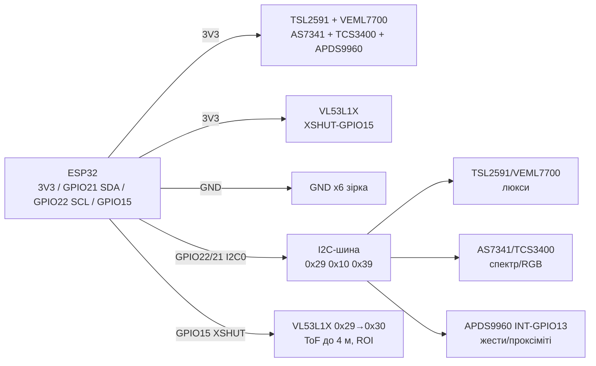

# TSL2591, VEML7700, AS7341, TCS3400, VL53L1X, APDS9960 - світло, спектр, ToF і жести

![[assets/img/light-spectral-gesture-scheme.png|600]]
*Рис. 1. Оптичні I2C-сенсори на спільній шині ESP32: люксметри, спектрометр, ToF-дальномір і сенсор жестів.*

## Призначення

Оптична група для ESP32: точні люкси для теплиць і вуличного освітлення, спектральний аналіз кольору й освітлення, лазерна дальнометрія до 4 м і безконтактні жести/наближення. Заміна BH1750 там, де потрібні справжні люкси, ІЧ-канал або колір.

TSL2591 - люксметр з двома діодами (full + IR), динаміка 600M:1, до 88000 лк. VEML7700 - простий люксметр з готовими люксами, 0-120000 лк. AS7341 - 11-канальний спектрометр (8 видимих + NIR + flicker + clear) через SMUX. TCS3400 - RGB + clear + flicker для кольору й корекції дисплеїв. VL53L1X - ToF-дальномір до 4 м з ROI-вікном і програмованою адресою. APDS9960 - жести (вліво/вправо/вгору/вниз), наближення, RGB, ambient.

> TSL2591 не має перемички адреси (фікс 0x29): два такі на одній шині - тільки через TCA9548A або другий I2C. VL53L1X адресу можна міняти програмно через XSHUT.

## Характеристики

| Параметр | TSL2591 | VEML7700 | AS7341 | TCS3400 |
| --- | --- | --- | --- | --- |
| Що міряє | Люкси 188 мклк-88000 лк | Люкси 0-120000 лк, 0.0036 лк/ct | Спектр 8 каналів 415-680 нм + NIR + clear + flicker | RGB + clear + flicker 50/60 Гц |
| Діоди | Full + IR окремо (visible = full − IR) | Фотодіод з фільтром під око | 16 сенсорів → 6-канальний АЦП через SMUX | RGB + clear + flicker-діод |
| Інтерфейс | I2C, фікс 0x29 | I2C 0x10 | I2C 0x39 | I2C 0x39 |
| Живлення | 2.7-3.6 В (модуль 3.3-5 В) | 2.5-3.6 В (модуль 3.3-5 В) | 1.8 В чип (модуль 3.3-5 В) | 1.8 В чип (модуль 3.3 В) |
| Струм | 0.4 мА акт. / 5 мкА сон | 0.5 мА акт. | ~2 мА | ~2 мА |
| Гейн/інтеграція | Гейн 1-9876×, час 100-600 мс | Гейн 1/2-1/8-1-2×, 25-800 мс | Гейн 1-512×, час/крок ATIME/ASTEP | Гейн 1-64× |
| Особливість | Найкраща динаміка для вулиці | Готові люкси без формул | SMUX-маршрутизація, GPIO/INT | Визначення мерехтіння ламп |

| Параметр | VL53L1X | APDS9960 |
| --- | --- | --- |
| Що міряє | Відстань ToF 40-4000 мм | Жести 4 напрямки + наближення 0-100 мм + RGB + ambient |
| Принцип | ІЧ-лазер 940 нм, час прольоту, ROI 4×4-16×16 SPAD | 4 спрямовані фотодіоди + ІЧ-світлодіод на платі |
| Інтерфейс | I2C 0x29 (зміна програмно) | I2C 0x39 |
| Живлення | 2.6-3.5 В (модуль 3.3-5 В) | 2.4-3.6 В (модуль 3.3-5 В) |
| Струм | ~20 мА (лазер імпульсами) | ~3 мА, LED до 100 мА імпульсами |
| Точність | ±5 % (біла ціль), 50 Гц макс | Жести до ~20 см, наближення 8 біт |
| Особливість | XSHUT для зміни адреси, пороги переривань | Переривання за порогом proximity/clear |

> AS7341 і TCS3400/APDS9960 можуть конфліктувати за адресою 0x39 - не вішати одночасно без мультиплексора. VL53L1X і TSL2591 обидва 0x29 із заводу - VL53L1X перепризначити через XSHUT при старті.

## Легенда пінів модуля

| Пін | Тип | Куди | Примітка |
| --- | --- | --- | --- |
| VIN (усі оптичні) | Живлення 3.3 В | 3V3 ESP32 | Модулі з LDO терплять 5 В, але сенсори - 1.8-3.6 В; ліпше 3.3 В |
| GND | Земля | GND ESP32 | Спільна, короткі дроти |
| SCL / SDA | I2C | GPIO22 / GPIO21 | Усі шість паралельно; pull-up 4.7 кОм |
| INT (TSL2591/VEML/AS7341/APDS) | Вихід переривання | GPIO (опційно) | Пороги люкс/проксіміті; можна не підключати |
| XSHUT (VL53L1X) | Вхід скидання | GPIO15 (обовʼязково при 2× 0x29!) | LOW - сенсор мовчить; по черзі підняти й перепризначити адресу |
| GPIO1 (VL53L1X) | Вихід готовності | GPIO (опційно) | Data-ready замість опитування |
| LED (APDS9960) | Вбудований ІЧ-LED | Нічого (на платі) | Не закривати склом з ІЧ-фільтром; дистанція жестів впаде |
| ADDR (рідко) | Вибір адреси | - | У TSL2591/VEML7700 перемички адреси немає! |

## Схема підключення

| ESP32 | Модуль | Примітка |
| --- | --- | --- |
| 3V3 | VIN усіх оптичних | Тільки 3.3 В для стабільних люксів |
| GND | GND усіх | Зірка |
| GPIO22 | SCL усіх | I2C0, 100-400 кГц |
| GPIO21 | SDA усіх | I2C0, pull-up 4.7 кОм |
| GPIO15 | VL53L1X XSHUT | Для розведення двох адрес 0x29 (TSL2591 + VL53L1X) |
| GPIO13 (опційно) | APDS9960 INT | Переривання жесту/наближення |
| GPIO14 (опційно) | AS7341 INT / VL53L1X GPIO1 | Готовність спектру/дистанції |

> Оптичні сенсори бояться пилу й подряпин на віконці: VL53L1X без скла або зі спеціальним ІЧ-прозорим; APDS9960 не далі 20 см від зони жестів.

### ASCII-схема

```text
ESP32 DevKit              Оптика I2C0 (люкси / спектр / ToF / жести)
------------              ------------------------------------------
3V3 ────────────────────► VIN x6 (TSL2591, VEML7700, AS7341, TCS3400, VL53L1X, APDS9960)
GND ────────────────────► GND x6 (зірка)
GPIO22 ─────────────────► SCL x6 (паралельно, [4.7 кОм] до 3V3)
GPIO21 ─────────────────► SDA x6 (паралельно, [4.7 кОм] до 3V3)
GPIO15 ─────────────────► VL53L1X XSHUT (LOW=мовчить, HIGH=активний)
GPIO13 ◄───────────────── APDS9960 INT (жест/проксіміті, опційно)
GPIO14 ◄───────────────── VL53L1X GPIO1 / AS7341 INT (опційно)
I2C-адреси: 0x29 TSL2591 (фікс!) | 0x10 VEML7700 | 0x39 AS7341/TCS3400/APDS9960 (конфлікт!)
            0x29 VL53L1X → перепризначити на 0x30 через XSHUT при старті
```

### Mermaid



![[assets/img/light-spectral-gesture-scheme.png|600]]
*Рис. 2. Розведення конфлікту 0x29 через XSHUT; 0x39 - тільки один сенсор без мультиплексора.*

## Код ESP-IDF

```c
#include "driver/i2c.h"
#include "esp_log.h"

#define I2C_PORT I2C_NUM_0
#define VL53_DEF 0x29
#define VL53_NEW  0x30
#define XSHUT_PIN GPIO_NUM_15

// Спрощено: XSHUT-послідовність для VL53L1X (повний драйвер — ST API / esp-idf-lib)
// 1) TSL2591 тримати активним (0x29 зайнято ним)
// 2) XSHUT LOW → VL53L1X мовчить; XSHUT HIGH → прокинувся на 0x29
// 3) записати новий адрес 0x30 → далі два сенсори 0x29 + 0x30 живуть разом
void app_main(void)
{
    i2c_config_t cfg = {
        .mode = I2C_MODE_MASTER,
        .sda_io_num = GPIO_NUM_21, .scl_io_num = GPIO_NUM_22,
        .sda_pullup_en = GPIO_PULLUP_ENABLE,
        .scl_pullup_en = GPIO_PULLUP_ENABLE,
        .master.clk_speed = 400000,
    };
    i2c_param_config(I2C_PORT, &cfg);
    i2c_driver_install(I2C_PORT, cfg.mode, 0, 0, 0);
    gpio_set_direction(XSHUT_PIN, GPIO_MODE_OUTPUT);
    gpio_set_level(XSHUT_PIN, 0);
    vTaskDelay(pdMS_TO_TICKS(50));
    gpio_set_level(XSHUT_PIN, 1); // розбудити VL53L1X
    vTaskDelay(pdMS_TO_TICKS(50));
    ESP_LOGI("opt", "reassign VL53L1X 0x29 -> 0x30, then poll TSL/VEML/AS7341/APDS");
    for (;;) vTaskDelay(pdMS_TO_TICKS(1000));
}
```

## Код Arduino

```cpp
#include <Wire.h>
#include <Adafruit_TSL2591.h>
#include <Adafruit_VEML7700.h>
#include <Adafruit_AS7341.h>
#include <Adafruit_APDS9960.h>
#include <VL53L1X.h> // полішук / ST API

#define XSHUT 15
Adafruit_TSL2591 tsl(2591);
Adafruit_VEML7700 veml;
Adafruit_AS7341 spec;
Adafruit_APDS9960 apds;
VL53L1X tof;

void setup() {
  Serial.begin(115200);
  Wire.begin(21, 22);
  pinMode(XSHUT, OUTPUT);
  digitalWrite(XSHUT, LOW); delay(50); // VL53L1X мовчить
  // TSL2591 на 0x29 ініціалізується першим
  if (!tsl.begin()) Serial.println("TSL2591 не знайдено (0x29)!");
  tsl.setGain(TSL2591_GAIN_MED);
  tsl.setTiming(TSL2591_INTEGRATIONTIME_300MS);
  if (!veml.begin()) Serial.println("VEML7700 не знайдено (0x10)!");
  // AS7341 або APDS/TCS на 0x39 — тільки один одночасно!
  if (!spec.begin()) Serial.println("AS7341 не знайдено (0x39)!");
  if (!apds.begin()) Serial.println("APDS9960 не знайдено (0x39, конфлікт з AS7341?)");
  apds.enableProximity(true); apds.enableGesture(true);
  // Тепер будимо ToF і перепризначаємо адресу
  digitalWrite(XSHUT, HIGH); delay(50);
  tof.setTimeout(500);
  if (!tof.init()) Serial.println("VL53L1X не знайдено!");
  tof.setAddress(0x30); // 0x29 -> 0x30
  tof.setDistanceMode(VL53L1X::Long);
  tof.setMeasurementTimingBudget(50000);
  tof.startContinuous(50);
}

void loop() {
  Serial.printf("TSL2591 lux=%.1f | VEML lux=%.1f\n",
    tsl.calculateLux(tsl.getFullLuminosity(), tsl.getFullLuminosity() >> 16), veml.readLux());
  uint16_t ch[12]; // AS7341: readAllChannels()
  Serial.printf("ToF=%d мм | APDS prox=%d жест=%d\n",
    tof.read(), apds.readProximity(), apds.readGesture());
  delay(500);
}
```

## Код MicroPython

```python
from machine import I2C, Pin
import time

i2c = I2C(0, scl=Pin(22), sda=Pin(21), freq=400000)
xshut = Pin(15, Pin.OUT, value=0)
time.sleep_ms(50)
print("без ToF:", [hex(a) for a in i2c.scan()])  # 0x29 TSL, 0x10 VEML, 0x39 AS7341/APDS
xshut.value(1)  # розбудити VL53L1X
time.sleep_ms(50)
print("з ToF:", [hex(a) for a in i2c.scan()])  # +0x29 VL53 -> перепризначити на 0x30 драйвером

# TSL2591 (драйвер tsl2591.py):
# import tsl2591
# lux = tsl2591.TSL2591(i2c).lux
# VEML7700 (драйвер veml7700.py): veml.read_lux()
# AS7341 (драйвер as7341.py): spec.read_all_channels()
# APDS9960 (драйвер apds9960.py): apds.read_gesture()
# VL53L1X (драйвер vl53l1x.py, addr 0x29->0x30, ROI-настройка)

while True:
    print("I2C:", [hex(a) for a in i2c.scan()])
    time.sleep(2)
```

## Типові помилки

| № | Помилка | Симптом | Рішення |
| --- | --- | --- | --- |
| 1 | Два сенсори 0x29 (TSL2591 + VL53L1X) | Один «зникає», NACK при скані | XSHUT-послідовність: TSL першим, потім розбудити ToF і `setAddress(0x30)`; або TCA9548A |
| 2 | Два сенсори 0x39 (AS7341 + APDS9960/TCS3400) | Обидва відповідають сміттям | Тільки один 0x39 на шині; другий - на другий I2C (GPIO16/17) або мультиплексор |
| 3 | VL53L1X за звичайним склом | Дистанція 0 або «шум» 4000 мм | ІЧ-прозоре скло або без скла; протерти віконце; ROI звузити на ціль |
| 4 | APDS9960 далеко від руки | Жести не детектяться | Дистанція жестів ≤ 20 см; прибрати ІЧ-фільтр/скло; підняти LED-струм у драйвері |
| 5 | TSL2591 насичення на сонці | Люкси 88000 і «залипання» | Знизити гейн (LOW) і час (100 мс); VEML7700 - зменшити гейн/інтеграцію |
| 6 | AS7341 читають без SMUX-затримки | Канали нульові або повторюються | Використовувати `readAllChannels()` бібліотеки (чекає ATIME/ASTEP); не читати «сирі» регістри вручну |
| 7 | Довгі I2C > 1 м до оптики | NACK, мерехтіння даних | 100 кГц, екран, pull-up 2.2 кОм; або другий I2C ближче до сенсорів |

## Офіційні джерела

- [Гайд TSL2591 з кодом (Adafruit Learn)](https://learn.adafruit.com/adafruit-tsl2591) - два діоди full+IR, гейн/таймінг, люкси.
- [Гайд VEML7700 з кодом (Adafruit Learn)](https://learn.adafruit.com/adafruit-veml7700) - готові люкси 0-120k, гейн/інтеграція.
- [Гайд AS7341 з кодом (Adafruit Learn)](https://learn.adafruit.com/adafruit-as7341-10-channel-light-color-sensor-breakout) - 11 каналів, SMUX, приклади.
- [Гайд APDS9960 з кодом (Adafruit Learn)](https://learn.adafruit.com/adafruit-apds9960-breakout) - жести, наближення, RGB.
- [Гайд VL53L0X ToF-родини з кодом (Adafruit Learn)](https://learn.adafruit.com/adafruit-vl53l0x-micro-lidar-distance-sensor-breakout) - ToF-принцип, XSHUT/адреса, API (VL53L1X - до 4 м + ROI).
- TCS3400 (ams-OSRAM) - `перевірити вручну` (даташит AMS).

## Див. також

- [[Home]]
- [[06-Analog/01-ADC|ADC]]
- [[04-Shini/03-I2C|I2C]]
- [[04-Shini/02-SPI|SPI]]
- [[04-Shini/01-UART|UART]]
- [[10-Sensori/03-BME280-BMP280-SHT31]]
- [[10-Sensori/06-INA219-HX711-BH1750]]
- [[10-Sensori/17-Gas-CO2-Precision]]
- [[10-Sensori/19-IMU-6-9DOF]]
- [[10-Sensori/20-Bio-IR-Temp]]
- [[10-Sensori/21-Energy-Meters]]
