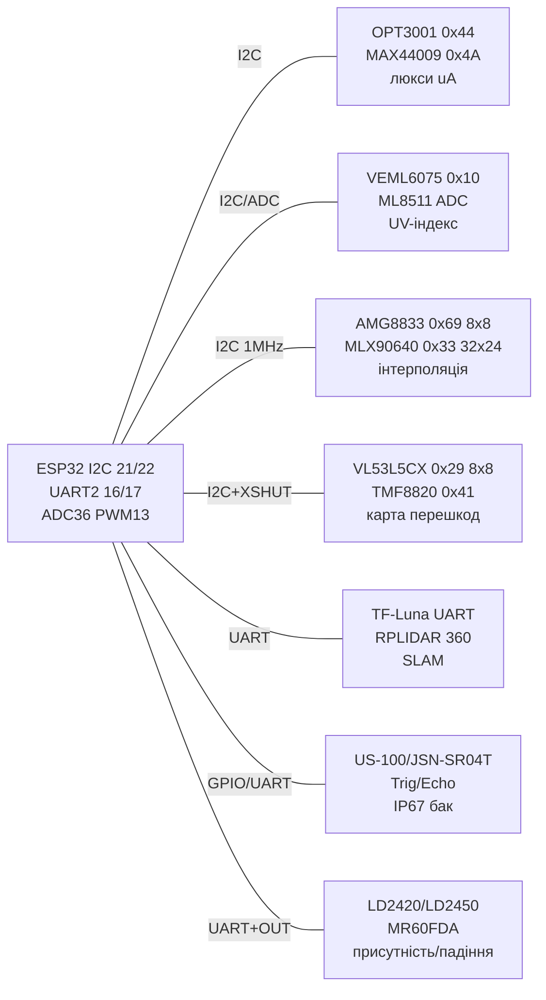

# Світло / УФ / Тепловізори / ToF-матриці / Лідари / Ультразвук / mmWave-радари

![[assets/img/light-uv-irarray-scheme.png|600]]
*Рис. 1. Оптично-радарний вузол ESP32: люкси, УФ-індекс, тепловізори 8×8/32×24, multizone-ToF, UART-лідари, оглядовий RPLIDAR, водозахищений ультразвук та mmWave-детектори присутності/падіння.*

## Призначення

Розширена оптично-далекомірна нота - продовження [[10-Sensori/10-VL53L0X-TCS34725-TSL2561]]. Покриває повний цикл «бачу середовище»: люксметри low-power (MAX44009/OPT3001) для автопідсвічування і теплиць, УФ-сенсори індексу (VEML6075/ML8511/GUVA-S12SD) для метеостанцій, тепловізори (AMG8833 8×8 + MLX90640 32×24 з інтерполяцією!) для детекції людей, multizone-ToF (VL53L5CX 8×8 + TMF8820) для жестів і карт перешкод, UART-лідари (TF-Luna/TFmini) для висотомірів і роботів, оглядовий RPLIDAR A1 для SLAM, водозахищений ультразвук (US-100/JSN-SR04T) для вулиці/баків, mmWave-радари (LD2420/LD2450 мультитаргет! + MR60FDA детектор падіння!) для присутності крізь пластик. Усе з прикладами ESP-IDF + Arduino + MicroPython.

> Як вибрати: люкси в приміщенні - OPT3001; УФ-індекс на вулиці - VEML6075; людина в кімнаті - AMG8833 або LD2420 (дешевше, крізь корпус!); теплова картинка - MLX90640; карта перешкод 8×8 - VL53L5CX; дальність 8-12 м - TF-Luna; огляд 360° - RPLIDAR A1; бак/вулиця - JSN-SR04T; падіння літньої людини - MR60FDA.

## Характеристики

| Параметр | MAX44009 | OPT3001 | VEML6075 | ML8511 / GUVA-S12SD |
| --- | --- | --- | --- | --- |
| Вимір | 0.045-188000 лк | 0.01-83865 лк | UVA+UVB → UV-індекс | УФ-інтенсивність (аналог!) |
| Інтерфейс | I2C 0x4A/0x4B | I2C 0x44/0x45/0x46/0x47 | I2C 0x10 | Аналог 0-3.3 В (через ADC!) |
| Струм | 0.65 мкА (!) | 1.8 мкА | ~500 мкА | ~300 мкА / ~нА (фотодіод) |
| Кут / спектр | Людське око | Людське око, 23 біт | UVA 330-355 + UVB 280-320 нм | 280-390 нм (ML8511), 240-370 нм (GUVA) |
| Калібрування | Заводське | Заводське | Коефіцієнти UVA/UVB → індекс | Ручне: темрява + відоме джерело! |
| Живлення | 1.7-3.6 В | 1.6-3.6 В | 1.7-3.6 В | 2.7-3.6 В / 3.3-5 В |
| Застосування | Батарейні люксметри | Точні люкси, теплиці | Метеостанція, УФ-індекс | Дешевий УФ-сигнал, засмага |

| Параметр | AMG8833 8×8 (тепловізор!) | MLX90640 32×24 (тепловізор!) | VL53L5CX (8×8 multizone) | TMF8820 (multizone) |
| --- | --- | --- | --- | --- |
| Матриця | 8×8 = 64 пікселі, 60° | 32×24 = 768 пікселів, 55°/110° | 8×8 зон, до 4 м | 3×3 / 4×4 зони, до 5 м |
| Діапазон температур / дистанцій | 0…80 °C, ±2.5 °C; людина до 7 м | −40…300 °C, ±2 °C; 16 Гц | 20 мм-4 м, 15/30/60 Гц | 20 мм-5 м, до 30 Гц |
| Інтерфейс / адреса | I2C 0x69 (0x68 перемичкою!) | I2C 0x33, 1 МГц! | I2C 0x29→змінна, LPn/INT | I2C 0x41, INT |
| Споживання | ~4.5 мА | ~23 мА (потрібен запас PSRAM!) | ~150 мА (лазер!) | ~100 мА |
| Фішка | Інтерполяція 8×8→32×32 (SciPy!) | Шахова вибірка, потрібні 20+ кБ RAM | Одночасна карта перешкод | Легкий для ATmega/ESP32 |
| Живлення | 3.3 В | 3.3 В | 3.3 В (LDO на брейкауті) | 3.3 В |

| Параметр | TF-Luna / TFmini (лідар UART!) | RPLIDAR A1 (SLAM оглядово) | US-100 / JSN-SR04T (ультразвук) | LD2420 / LD2450 / MR60FDA (mmWave!) |
| --- | --- | --- | --- | --- |
| Принцип | ToF 850 нм, 1 зона | Триангуляція 360°, 8000 точок/с | Ехо 40 кГц | FMCW 24 ГГц (LD) / 60 ГГц (MR60) |
| Дальність | Luna 0.2-8 м; Plus 0.1-12 м | 0.15-12 м (A1), до 6 Гц обертів | US-100 0.02-4.5 м; JSN 0.2-6 м (вода IP67!) | LD2420 присутність 0-6 м; LD2450 3 цілі + координати!; MR60 падіння/дихання |
| Інтерфейс | UART 115200 + I2C (Luna!) | UART 115200/256000 + мотор-PWM | GPIO Trig/Echo або UART (US-100!) | UART 115200/256000 + GPIO OUT |
| Точність | ±6 см (<6 м) | ±3 см, кут ~1° | ±3 мм + температурний дрейф! | Зони, швидкість, енергія |
| Живлення / струм | 5 В, ~100-350 мА (пік!) | 5 В, ~400-600 мА (мотор!) | 5 В (Echo 5 В → дільник!) | 5 В / 3.3 В, ~100 мА |
| Фішка | Висотомір дрона, ліфт | SLAM-карта кімнати | Бак з водою, вулиця | Крізь пластик, не боїться пари/світла! |

> [!tip] Калібрування УФ-індексу
> VEML6075 віддає сирі UVA/UVB-відліки - індекс рахується коефіцієнтами з даташиту (UVA×a + UVB×b). ML8511/GUVA-S12SD - аналогові: читати через [[06-Analog/01-ADC|ADC]] з усередненням 64 семпли + калібрувати «темрява = 0» і «сонце 12:00 = відомий індекс з прогнозу». Без калібрування це індикатор, а не прилад!
>
> [!warning] Живлення лазерів/моторів/радарів!
> VL53L5CX + TF-Luna + RPLIDAR + LD2450 разом їдять 1+ А піками. Живити від окремого DC-DC 5 В 2 А, ESP32 - окремою гілкою, спільна земля обов'язкова. RPLIDAR-мотор без свого живлення садить USB і дає brownout.

## Легенда пінів модуля

| OPT3001 / MAX44009 | Призначення | Куди |
| --- | --- | --- |
| VIN / GND | 3.3 В | 3V3 / GND |
| SDA / SCL | I2C (OPT 0x44, MAX 0x4A) | GPIO21 / GPIO22 |
| INT | Поріг люксів (open-drain) | GPIO (опційно) + pull-up 10 кОм |
| ADDR | Вибір адреси OPT3001 | GND/VCC/SDA/SCL → 0x44-0x47 |

| VEML6075 / ML8511 / GUVA-S12SD | Призначення | Куди |
| --- | --- | --- |
| VIN / GND | 3.3 В (+100 нФ біля чипа!) | 3V3 / GND |
| SDA / SCL (VEML) | I2C 0x10 | GPIO21 / GPIO22 |
| OUT/EN (ML8511) | Аналог 0-3.3 В / enable | GPIO36 (ADC1!) / GPIO |
| SIG (GUVA) | Аналог (слабкий, потрібен ОП!) | GPIO36 через повторювач або ADS1115 |

| AMG8833 / MLX90640 | Призначення | Куди |
| --- | --- | --- |
| VIN / GND | 3.3 В (MLX - тільки 3.3 В!) | 3V3 / GND + 47 мкФ |
| SDA / SCL | I2C: AMG 0x69, MLX 0x33 | GPIO21 / GPIO22, 1 МГц для MLX! |
| INT | Поріг температури | GPIO (опційно) |

| VL53L5CX / TMF8820 | Призначення | Куди |
| --- | --- | --- |
| VIN / GND | 3.3-5 В (LDO) | 3V3 / GND |
| SDA / SCL | I2C 0x29 (змінна!) / 0x41 | GPIO21 / GPIO22 |
| LPn / XSHUT | Вимкнення для зміни адреси | GPIO25 / GPIO26 |
| INT/GPIO1 | Дані готові | GPIO27 |

| TF-Luna / TFmini | Призначення | Куди |
| --- | --- | --- |
| 5V / GND | 5 В 1 А! | 5V / GND (окрема гілка!) |
| TX / RX | UART 115200 | TX→GPIO16 (дільник!), RX→GPIO17 |
| I2C (Luna) | SDA/SCL 0x10 (альтернатива) | GPIO21 / GPIO22 |

| RPLIDAR A1 | Призначення | Куди |
| --- | --- | --- |
| 5V / GND | 5 В 1.5 А (мотор!) | Зовнішній 5 В! |
| TX / RX | UART 115200 (сканування 256000) | GPIO16 / GPIO17 (UART2) |
| MOTOCTL | ШІМ мотора | GPIO13 (LEDC 25 кГц) |
| MOTOR GND | Земля мотора | Спільна GND |

| US-100 / JSN-SR04T | Призначення | Куди |
| --- | --- | --- |
| VCC / GND | 5 В (JSN) / 3.3-5 В (US-100) | 5V / GND |
| Trig / Echo | 10 мкс імпульс / ширина еха | GPIO12 / GPIO13 (Echo через дільник!) |
| UART (US-100) | Jumper: RX/TX 9600 | GPIO16 / GPIO17 |
| Probe (JSN) | Герметичний датчик, кабель 2.5 м | Не згинати різко, не топити блок! |

| LD2420 / LD2450 / MR60FDA | Призначення | Куди |
| --- | --- | --- |
| 5V/3V3 / GND | За шелкографією (LD2420 - 3.3 В!) | 3V3 або 5V / GND |
| TX / RX | UART 115200 (LD2420) / 256000 (LD2450) | GPIO16 / GPIO17 |
| OUT / GPIO | Присутність HIGH/LOW | GPIO (переривання!) |
| BT (LD2450) | Bluetooth-конфігуратор | Антена назовні корпуса! |

## Схема підключення

| ESP32 | Оптика I2C | ToF-матриці | Лідари/UART | Ультразвук | Радар | Примітка |
| --- | --- | --- | --- | --- | --- | --- |
| 3V3 | OPT/VEML/AMG/MLX VCC | VL53/TMF VCC | - | - | LD2420 VCC | 3.3 В гілка + 47 мкФ |
| 5V | - | - | TF/RPLIDAR/JSN VCC | JSN VCC | LD2450/MR60 VCC | 5 В 2 А окрема гілка! |
| GND | GND | GND | GND | GND | GND | Зірка, товстий провід |
| GPIO21/22 | SDA/SCL усіх I2C | SDA/SCL | - | - | - | Шина I2C0 400 кГц-1 МГц |
| GPIO25/26 | - | XSHUT/LPn | - | - | - | Зміна адрес ToF |
| GPIO16/17 | - | - | TF-TX/RX, RPLIDAR-TX/RX, LD-TX/RX | US-100 UART | LD/MR60 UART | UART2, дільник на 5 В TX! |
| GPIO12/13 | - | - | RPLIDAR-MOTO (13) | Trig (12)/Echo (13) | OUT (присутність) | Echo через дільник! |
| GPIO36 | ML8511/GUVA OUT | - | - | - | - | Тільки ADC1! |

### ASCII-схема

```text
        ESP32 DevKit                 Датчики
    +-----------------+     +-------------------------------+
    | 3V3 ------------+---->VCC OPT3001/VEML6075/AMG8833/MLX90640/LD2420
    | 5V (2A!) -------+---->VCC TF-Luna / RPLIDAR / JSN-SR04T / LD2450
    | GND ------------+---->GND xN (ЗІРКА! товстий провід)
    | G22 SCL --------+---->SCL xN (pull-up 4.7k, <20см для 1МГц MLX!)
    | G21 SDA --------+---->SDA xN (0x44+0x10+0x69+0x33+0x29+0x41)
    | G25/26 ---------+---->XSHUT VL53L5CX/TMF (зміна адрес!)
    | G16 <---[діл.]--+---- TX TF-Luna/RPLIDAR/LD2450 (5V->3.3V!)
    | G17 ------------+---->RX (тих самих)
    | G13 PWM --------+---->MOTOCTL RPLIDAR (25кГц)
    | G12 ------------+---->Trig JSN-SR04T
    | G13 <---[діл.]--+---- Echo JSN (5V!)
    | G36 (ADC1) -----+---- OUT ML8511/GUVA-S12SD (усереднити 64x!)
    +-----------------+     +-------------------------------+
    MLX90640: I2C 1МГц + короткі проводи! RPLIDAR: свій БЖ 5В!
    Тепловізори НЕ крізь скло! Радари — можна крізь пластик (не метал!).
```

### Mermaid



## Код ESP-IDF

```c
#include "driver/i2c.h"
#include "driver/uart.h"
#include "driver/adc.h"
#include "esp_log.h"
#define I2C_P I2C_NUM_0
static const char *TAG = "opt";

// OPT3001 0x44: читання люксів (регістр 0x01)
static float opt_lux(void) {
    uint8_t r = 0x01; uint8_t d[2];
    i2c_master_write_read_device(I2C_P, 0x44, &r, 1, d, 2, 100);
    uint16_t raw = (d[0] << 8) | d[1];
    int exp = (raw >> 12) & 0x0F;
    int mant = raw & 0x0FFF;
    return mant * (0.01 * (1 << exp)); // люкси
}
// AMG8833 0x69: читання 64 пікселів (0x80..0xFF, 12 біт зі знаком)
static void amg_frame(float *px) {
    uint8_t r = 0x80; uint8_t d[128];
    i2c_master_write_read_device(I2C_P, 0x69, &r, 1, d, 128, 200);
    for (int i = 0; i < 64; i++) {
        int16_t v = (d[2*i+1] << 8) | d[2*i];
        if (v & 0x800) v |= 0xF000; // знак 12 біт
        px[i] = v * 0.25; // °C
    }
}
// MLX90640: потрібен драйвер + 1 МГц I2C + білінійна інтерполяція на хості
// VL53L5CX: esp-idf-lib vl53l5cx: init, set_resolution(8x8), start_ranging
// TF-Luna UART2 115200: кадр 9 байт 0x59 0x59 DIST_L DIST_H ...

void app_main(void) {
    i2c_config_t c = {.mode=I2C_MODE_MASTER,.sda_io_num=21,.scl_io_num=22,
        .sda_pullup_en=1,.scl_pullup_en=1,.master.clk_speed=400000};
    i2c_param_config(I2C_P,&c); i2c_driver_install(I2C_P,c.mode,0,0,0);
    // UART2 для TF-Luna / LD2450
    uart_config_t u = {.baud_rate=115200,.data_bits=UART_DATA_8_BITS,
        .parity=UART_PARITY_DISABLE,.stop_bits=UART_STOP_BITS_1,
        .flow_ctrl=UART_HW_FLOWCTRL_DISABLE,.source_clk=UART_SCLK_DEFAULT};
    uart_param_config(UART_NUM_2,&u);
    uart_set_pin(UART_NUM_2,17,16,-1,-1);
    uart_driver_install(UART_NUM_2,1024,0,0,NULL,0);
    adc1_config_width(ADC_WIDTH_BIT_12);
    adc1_config_channel_atten(ADC1_CHANNEL_0, ADC_ATTEN_DB_11); // GPIO36 ML8511
    float px[64];
    for (;;) {
        amg_frame(px);
        float mx = px[0]; for (int i=1;i<64;i++) if (px[i]>mx) mx=px[i];
        int uv = 0, sum = 0;
        for (int i=0;i<64;i++) sum += adc1_get_raw(ADC1_CHANNEL_0);
        uv = sum / 64;
        ESP_LOGI(TAG, "lux=%.0f maxT=%.1f uv_adc=%d", opt_lux(), mx, uv);
        vTaskDelay(pdMS_TO_TICKS(500));
    }
}
```

## Код Arduino

```cpp
#include <Wire.h>
#include <Adafruit_AMG88xx.h>
#include <Adafruit_MLX90640.h>
#include <Adafruit_VEML6075.h>
#include <SparkFun_VL53L5CX_Library.h>

Adafruit_AMG88xx amg;
Adafruit_MLX90640 mlx;
Adafruit_VEML6075 veml;
SparkFun_VL53L5CX tof;
#define TRIG 12
#define ECHO 13
#define RADAR_OUT 15

void setup() {
  Serial.begin(115200);
  Serial2.begin(115200, SERIAL_8N1, 16, 17); // TF-Luna / LD2450 / RPLIDAR
  Wire.begin(21, 22);
  Wire.setClock(1000000); // для MLX90640!
  pinMode(TRIG, OUTPUT);
  pinMode(ECHO, INPUT); // вже через дільник 5V->3.3V!
  pinMode(RADAR_OUT, INPUT);

  amg.begin(0x69);
  veml.begin();
  // MLX90640: mlx.begin(0x33, &Wire); mlx.setMode(MLX90640_CHESS); mlx.setRate(MLX90640_8_HZ);
  // VL53L5CX: tof.begin(); tof.setResolution(8*8); tof.startRanging();
  // TF-Luna працює одразу по UART: кадри 0x59 0x59 ...
  // LD2450: 256000 бод! Serial2.updateBaudRate(256000);
}

void loop() {
  float px[64]; amg.readPixels(px);
  float mx = px[0]; for (int i = 1; i < 64; i++) mx = max(mx, px[i]);
  Serial.printf("AMG max=%.1f UV=%.2f ", mx, veml.readUVI());

  // JSN-SR04T
  digitalWrite(TRIG, LOW); delayMicroseconds(2);
  digitalWrite(TRIG, HIGH); delayMicroseconds(10);
  digitalWrite(TRIG, LOW);
  long us = pulseIn(ECHO, HIGH, 30000);
  Serial.printf("US=%.0fcm radar=%d ", us / 58.0, digitalRead(RADAR_OUT));

  // TF-Luna / LD2450 кадри з Serial2
  while (Serial2.available()) {
    static uint8_t b[9]; static int n = 0;
    uint8_t c = Serial2.read();
    if (n == 0 && c != 0x59) continue;
    b[n++] = c;
    if (n == 9) { n = 0; int dist = b[2] | (b[3] << 8); Serial.printf("TF=%dcm ", dist); }
  }
  // MLX90640: mlx.getFrame(frame); білінійна інтерполяція 32x24 -> дисплей
  // VL53L5CX: tof.getRangingData(&data); карта 8x8 зон
  Serial.println();
  delay(300);
}
```

## Код MicroPython

```python
from machine import I2C, Pin, UART, ADC
import time

i2c = I2C(0, scl=Pin(22), sda=Pin(21), freq=400000)
print("I2C:", [hex(a) for a in i2c.scan()])
uart = UART(2, 115200, rx=16, tx=17)  # TF-Luna / LD2420
trig = Pin(12, Pin.OUT)
echo = Pin(13, Pin.IN)  # через дільник!
radar = Pin(15, Pin.IN)
uv_adc = ADC(Pin(36)); uv_adc.atten(ADC.ATTEN_11DB)

def opt_lux(addr=0x44):
    d = i2c.readfrom_mem(addr, 0x01, 2)
    raw = (d[0] << 8) | d[1]
    return (raw & 0xFFF) * (0.01 * (1 << ((raw >> 12) & 0xF)))

def amg_max(addr=0x69):
    d = i2c.readfrom_mem(addr, 0x80, 128)
    mx = -99
    for j in range(64):
        v = d[2*j] | (d[2*j+1] << 8)
        if v & 0x800: v -= 0x1000
        t = v * 0.25
        if t > mx: mx = t
    return mx

def us_cm():
    trig.off(); time.sleep_us(2)
    trig.on(); time.sleep_us(10); trig.off()
    t0 = time.ticks_us()
    while not echo.value():
        if time.ticks_diff(time.ticks_us(), t0) > 30000: return -1
    t1 = time.ticks_us()
    while echo.value():
        if time.ticks_diff(time.ticks_us(), t1) > 30000: return -1
    return time.ticks_diff(time.ticks_us(), t1) / 58.0

while True:
    uv = sum(uv_adc.read() for _ in range(64)) // 64
    print("lux={:.0f} Tmax={:.1f} US={:.0f} radar={} uart={}".format(
        opt_lux(), amg_max(), us_cm(), radar.value(), uart.read()))
    # MLX90640 + VL53L5CX: потрібні драйвери (mlx90640.py / vl53l5cx.py),
    # інтерполяція AMG 8x8->24x24: білінійна, SciPy на хості або проста на ESP32
    time.sleep_ms(400)
```

### FLIR Lepton - радіометричний тепловізор (наступний рівень)

| Параметр | Lepton 2.5 / 3.5 |
| --- | --- |
| Матриця | 80×60 (2.5) / 160×120 (3.5), LWIR 8-14 мкм |
| Вихід | Температура КОЖНОГО пікселя (радіометрія!), а не «тепло/холодно» |
| Інтерфейс | SPI (VoSPI, кадри 164 сегменти) + I2C (CCI-команди) |
| Живлення | 2.8 В ядро + 1.2/1.8/3.3 В I/O (модуль PureThermal бере це на себе) |
| Коли брати | Пошук людей/тварин, енергоаудит, пожежна сигналізація - там, де AMG8833/MLX90640 дають лише «плями» |

```text
ESP32 ──SPI──► PureThermal2 (Lepton-модуль з USB/UART-мостом і живленням)
Або безпосередньо: VSPI ESP32 ↔ VoSPI Lepton (CS + MOSI/MISO/SCK) + I2C CCI;
кадр 19 200 байт (3.5) — тільки з PSRAM-буфером!
```

> Lepton vs MLX90640: у 3-4 рази дорожче, але кожен піксель - градуси, а не умовні одиниці; калібрування затвором (FFC) клацає кожні кілька хвилин - це норма, не глюк.

## Типові помилки

| № | Помилка | Симптом | Рішення |
| --- | --- | --- | --- |
| 1 | MLX90640 на 100 кГц + довгі дроти | NACK, `fb alloc failed`, смуги | I2C 1 МГц, дроти <15 см, плата з PSRAM, живлення з запасом 500 мА |
| 2 | Тепловізор за склом | «Кімната 25 °C скрізь» | Скло непрозоре для 8-14 мкм! Виріз у корпусі, германієва лінза - ні |
| 3 | AMG8833 адреса 0x68 vs 0x69 | Не сканується | Заводська 0x69; перемичка ADDR → 0x68; сканувати |
| 4 | УФ без калібрування | «Індекс 12 у тіні» | VEML6075 - коефіцієнти з даташиту; ML8511/GUVA - калібрувати темрява/сонце |
| 5 | GUVA-S12SD безпосередньо в ADC | Шум, дрейф | Слабкий струм - потрібен ОП-повторювач або зовнішній ADS1115, усереднення 64× |
| 6 | VL53L5CX без окремого живлення | Скидання ESP32 при вимірі | Пік 150 мА - окремий конденсатор 47 мкФ + DC-DC, XSHUT-послідовність для адрес |
| 7 | TF-Luna TX 5 В в GPIO16 | Вмер UART | Дільник 1к/2к, спільна GND, baud строго 115200 (Luna) |
| 8 | RPLIDAR від USB | Brownout, мотор смикається | Зовнішній 5 В 1.5 А, MOTO-PWM 25 кГц, віброізоляція |
| 9 | JSN-SR04T топить блок | Мертвий сенсор | Герметичний лише зонд! Блок у гермобокс, кабель не перегинати |
| 10 | Ультразвук без термокомпенсації | Похибка ±10% взимку/влітку | `dist *= sqrt(T/273)` або US-100 в UART-режимі з термометром |
| 11 | LD2420 всередині металу | «Нікого немає» | mmWave не проходить метал! Пластик/скло - ок, радар антеною назовні |
| 12 | LD2450 на 115200 | Сміття | LD2450 заводські 256000 бод + протокол з координатами цілей |
| 13 | MR60FDA дивиться на вентилятор | Хибні «падіння» | Зона + фільтр швидкості, радар вище 2 м під нахилом, без вібрацій |
| 14 | Lepton без PSRAM-буфера | Кадр рветься / OOM | Тільки плати з PSRAM; FFC-клацання затвором - норма |

## Офіційні джерела

- [AMG8833 - гайд з кодом та інтерполяцією (Adafruit Learn)](https://learn.adafruit.com/adafruit-amg8833-8x8-thermal-camera-sensor) - 8×8 тепловізор, пороги INT, приклади.
- [MLX90640 - гайд з кодом (Adafruit Learn)](https://learn.adafruit.com/adafruit-mlx90640-ir-thermal-camera) - 32×24, шахова вибірка, вимоги до RAM.
- [VL53L0X - гайд з кодом (Adafruit Learn, база родини VL53L5CX)](https://learn.adafruit.com/adafruit-vl53l0x-micro-lidar-distance-sensor-breakout) - ToF-принципи, таймінг-бюджет, XSHUT.
- [TMF8806 - гайд з кодом (Adafruit Learn, родина TMF8820)](https://learn.adafruit.com/adafruit-tmf8806-time-of-flight-distance-sensor) - multizone-ToF до 5 м, I2C.
- [VEML6075 - гайд з кодом (Adafruit Learn)](https://learn.adafruit.com/adafruit-veml6075-uva-uvb-uv-index-sensor) - UVA/UVB → UV-індекс, калібрування.

## Див. також

- [[Home|Головна карта довідника]]
- [[10-Sensori/10-VL53L0X-TCS34725-TSL2561|ToF/Колір/Люкси перша частина]]
- [[10-Sensori/18-Light-Spectral-Gesture|Світло/Спектр/Жести]]
- [[04-Shini/03-I2C|I2C шина]]
- [[04-Shini/01-UART|UART шина]]
- [[06-Analog/01-ADC|ADC]]
- [[10-Sensori/25-Mag-IMU-2|Магнітометри/IMU-2]]
- [[10-Sensori/26-Light-UV-IRArray-ToF|Ця нота (якір графа)]]
- [[10-Sensori/27-Time-Mem-IO-DAC|RTC/пам'ять/IO/ЦАП]]
- [[12-Moduli-zvyazku/10-Industrial|Industrial fieldbus]]
- [[12-Moduli-zvyazku/08-LD2410-UWB-IR-Voice|Радари LD2410/UWB]]
- [[99-Dodatki/02-Troubleshooting-FAQ|FAQ]]
