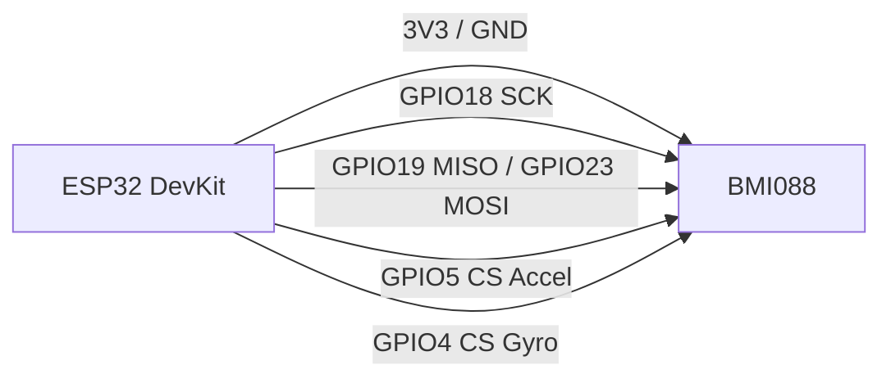

# IMU, вібростійкі акселерометри та високоточні магнітометри

![[assets/img/imu-mag-3-scheme.png|600]]
*Рис. 1. Точна інерціальна навігація та орієнтація: автомобільно-дронові вібростійкі IMU (BMI088, BMI160), високоточні сейсмічні акселерометри (ADXL355), нанотеслові магнітометри (RM3100, MMC5603).*

## Призначення

Сенсори для автопілотів квадрокоптерів, роботів-газонокосарок, антикрадіжних систем, моніторингу вібрацій промислового обладнання та орієнтації у просторі без супутників. BMI088 спеціально спроектований для придушення резонансних вібрацій рами дрона, а RM3100 вимірює магнітні поля без дрейфу нуля. Інтерфейси - SPI/I2C, живлення 2.4-3.6V, вибірка - до кілогерців з FIFO.

## Характеристики

| Модуль | Тип | Діапазон | Інтерфейс | Живлення | Особливість |
| --- | --- | --- | --- | --- | --- |
| BMI088 | 6-DOF (Acc + Gyro) | ±24g, ±2000°/s | SPI / I2C | 3.3 В | Окремі кристали Acc і Gyro для придушення вібрацій |
| BMI160 | 6-DOF IMU | ±16g, ±2000°/s | SPI / I2C | 1.8 .. 3.6 В | Наднизьке споживання (950 мкА), вбудований шагомір |
| ADXL355 | 3-осьовий low-noise Acc | ±2g / ±4g / ±8g | SPI / I2C | 2.25 .. 3.6 В | Сейсмічна точність (25 мкг/√Гц), вимірювання нахилу 0.001° |
| ADXL375 | High-g Acc | ±200g | SPI / I2C | 2.0 .. 3.6 В | Фіксація ударів, аварій та падінь з висоти |
| MMC5603 | 3-осьовий магнітометр | ±16 Gauss | I2C (0x30) | 1.62 .. 3.6 В | 16-біт роздільна здатність, внутрішній SET/RESET спрей |
| RM3100 | Магніто-індуктивний компас | ±800 мкТл | SPI / I2C | 3.3 В | Не має аномалій гистерезису, рекордний відгук (20 нТл) |
| MLX90393 | 3D Hall / 3D Magnetometer | ±50 mT | SPI / I2C | 2.2 .. 3.6 В | Детекція джойстиків та магнітів під довільним кутом |

## Легенда пінів модуля

| Пін | Тип | Куди на ESP32 | Примітка |
| --- | --- | --- | --- |
| VCC | Живлення | 3V3 ESP32 | Суворо 3.3 В |
| GND | Земля | Спільний GND | Спільний мінус |
| SCL / SCK | Тактування | GPIO22 (I2C) або GPIO18 (SPI) | Залежно від вибраного шинного режиму |
| SDA / SDI | Дані / MOSI | GPIO21 (I2C) або GPIO23 (SPI) | Лінія даних |
| SDO / MISO | Вихід даних | GPIO19 (SPI) | Використовується в SPI або для вибору I2C адреси |
| CS_ACC / CS_GYRO | Chip Select | GPIO5 / GPIO4 | У BMI088 окремі піни CS для акселерометра та гіроскопа! |
| INT1 / INT2 | Переривання | GPIO19 / вільний GPIO | Сигнал готовності даних або проходження порогу g |

## Схема підключення

| ESP32 DevKit | BMI088 (SPI режим) | RM3100 (I2C) | Примітка |
| --- | --- | --- | --- |
| 3V3 | VCC | VCC | Живлення 3.3 В |
| GND | GND | GND | Спільна земля |
| GPIO18 | SCK | - | SPI тактування |
| GPIO19 | SDO | - | SPI MISO |
| GPIO23 | SDI | - | SPI MOSI |
| GPIO5 | CS_ACC | - | CS акселерометра |
| GPIO4 | CS_GYRO | - | CS гіроскопа |
| GPIO22 | - | SCL | I2C тактування |
| GPIO21 | - | SDA | I2C дані |

### ASCII-схема

```text
ESP32 DevKit                        BMI088 (Подвійний SPI)
  ┌────────────┐                         ┌─────────────┐
  │        3V3 ├─────────────────────────┤ VCC         │
  │        GND ├─────────────────────────┤ GND         │
  │     GPIO18 ├─────────────────────────┤ SCK         │
  │     GPIO19 ├─────────────────────────┤ SDO         │
  │     GPIO23 ├─────────────────────────┤ SDI         │
  │      GPIO5 ├─────────────────────────┤ CS_ACC      │
  │      GPIO4 ├─────────────────────────┤ CS_GYRO     │
  └────────────┘                         └─────────────┘
```

### Mermaid



## Код ESP-IDF

```c
#include "driver/spi_master.h"
#include "esp_log.h"

#define PIN_CS_ACC  5
#define PIN_CS_GYRO 4

static const char *TAG = "BMI088";

void app_main(void) {
    gpio_config_t io_conf = {
        .pin_bit_mask = (1ULL << PIN_CS_ACC) | (1ULL << PIN_CS_GYRO),
        .mode = GPIO_MODE_OUTPUT,
    };
    gpio_config(&io_conf);
    gpio_set_level(PIN_CS_ACC, 1);
    gpio_set_level(PIN_CS_GYRO, 1);

    ESP_LOGI(TAG, "BMI088 CS лінії налаштовано. Готовий до SPI обміну.");
}
```

## Код Arduino

```cpp
#include <Wire.h>

#define MMC5603_ADDR 0x30

void setup() {
  Serial.begin(115200);
  Wire.begin(21, 22);

  Wire.beginTransmission(MMC5603_ADDR);
  Wire.write(0x1B); // Internal control 0
  Wire.write(0x01); // Take measurement
  Wire.endTransmission();
}

void loop() {
  Wire.beginTransmission(MMC5603_ADDR);
  Wire.write(0x00); // Xout low
  Wire.endTransmission();

  Wire.requestFrom(MMC5603_ADDR, 6);
  if (Wire.available() >= 6) {
    int16_t x = Wire.read() | (Wire.read() << 8);
    Serial.printf("MMC5603 Mag X: %d\n", x);
  }
  delay(500);
}
```

## Код MicroPython

```python
import time
from machine import I2C, Pin

i2c = I2C(0, scl=Pin(22), sda=Pin(21), freq=400000)
devices = i2c.scan()
print("I2C сканування для магнітометра:", [hex(d) for d in devices])
```

## Типові помилки

| № | Помилка | Симптом | Рішення |
| --- | --- | --- | --- |
| 1 | Об'єднання CS_ACC та CS_GYRO у BMI088 | Модуль не відповідає або збоїть | CS_ACC та CS_GYRO - це дві окремі мікросхеми у блоці, використовувати два GPIO |
| 2 | Робота з компасом поруч із силовими дротами | Відхилення курсу на 30-90° | Відносити компас на штангу від батареї та плат DC-DC |
| 3 | Відсутність калібрування hard/soft iron | Нелінійні характеристики орієнтації | Дротити програму обертання пристрою у формі вісімки |
| 4 | Жорсткий викликовий опит без переривань | Пропуск пікових прискорень | Налаштовувати виводи INT на роботу за готовністю нових даних у FIFO |

## Офіційні джерела

- Bosch Sensortec BMI088: [bosch-sensortec.com](https://www.bosch-sensortec.com/products/motion-sensors/imus/bmi088/)
- Analog Devices ADXL355: [analog.com](https://www.analog.com/en/products/adxl355.html)
- PNI RM3100 Magnetometer: `перевірити вручну`
- MEMSIC MMC5603NJ: `перевірити вручну`

### ICM42688: сучасний 6-osnik (заміна MPU6050!)

| Параметр | MPU6050 (класика) | ICM42688 (2026) |
| --- | --- | --- |
| Шум гіроскопа | 0.01 dps/√Гц | 0.0038 dps/√Гц (тише в 3 рази!) |
| Акселерометр | ±16g | ±16g + APEX (кроки/нахил в чипі!) |
| Інтерфейс | I2C 400 кГц / SPI | I2C 1 МГц / SPI 24 МГц |
| FIFO | 1024 байт | 2 КБ + стиснення |
| Ціна модуля | $2 | $5-8 |

```text
Міграція MPU6050 → ICM42688: той самий footprint-модуль (GY-42688),
бібліотеки: SparkFun_ICM42688 / Adafruit_ICM20X (замість Jeff Rowberg!).
APEX-функції (pedometer/tilt/wake-on-motion) розвантажують ESP32 — motion-wake без коду!
```

## Див. також

- [[Home]]
- [[10-Sensori/19-IMU-6-9DOF|Базові IMU MPU6050/ICM20948]]
- [[04-Shini/02-SPI|Шина SPI]]
- [[04-Shini/03-I2C|Шина I2C]]
- [[06-Analog/03-PID-Filters|Фільтри Калмана та комплементарні]]
