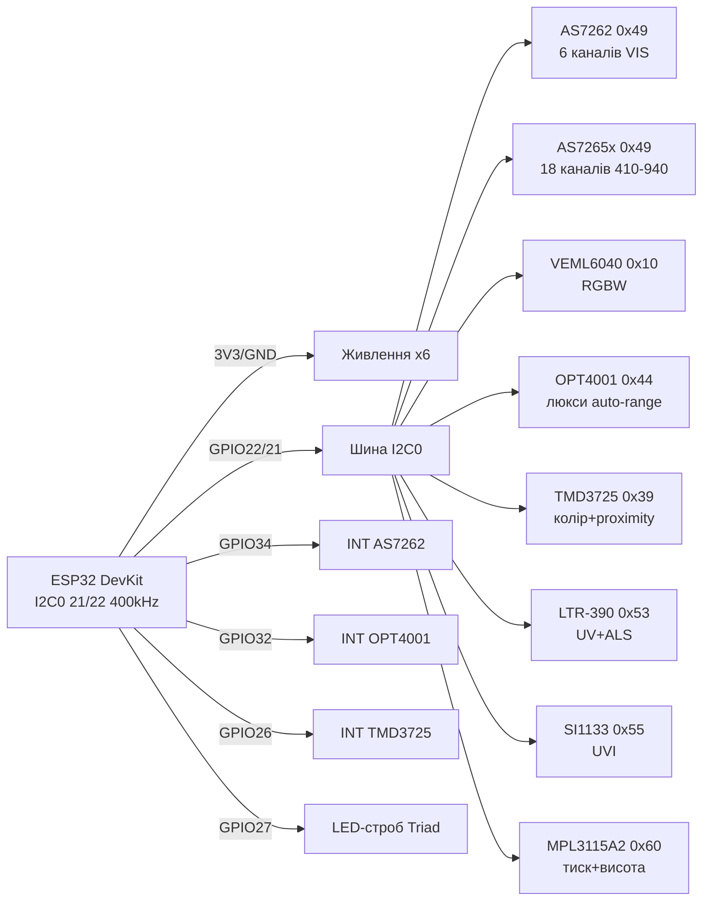

# Спектр, колір, люкси, УФ та тиск 2 - AS7262/AS7265x, VEML6040, OPT4001, TMD3725, SI1133, LTR-390UV, MPL3115A2

![[assets/img/light-color-2-scheme.png|600]]
*Рис. 1. Оптичні I2C-сенсори другого ешелону на спільній шині ESP32: спектрометр, RGBW, прецизійний люксметр, колір+наближення, УФ-сенсори та барометр-висотомір.*

## Призначення

Продовження оптичної лінійки бази (початок - [[10-Sensori/10-VL53L0X-TCS34725-TSL2561]]): тут зібрані сенсори наступного рівня складності.

AS7262 - 6-канальний видимий спектрометр (450-650 нм) для визначення кольору/марки рідини, паперу, ґрунту.

AS7265x - тріо чипів, 18 каналів від 410 до 940 нм (видимий + ближній ІЧ) для справжньої спектроскопії: аналіз рослин, харчів, освітлення.

VEML6040 - дешевий RGBW-сенсор (червоний/зелений/синій/білий) для колірної температури та автобалансу підсвічування.

OPT4001 - прецизійний люксметр automotive-класу з 28-бітним ефективним динамічним діапазоном (312.5 мклк - 83 клк), заміна TSL2561 там, де потрібна точність ока людини.

TMD3725 - колір (RGB+Clear) + наближення в одному корпусі для жестових панелей і вимикання екрана біля вуха.

SI1133 - УФ-індекс + ALS (ambient light) для метеостанцій.

LTR-390UV - найдешевший УФ-сенсор (UVA + ALS) для індикатора «згори на сонці».

MPL3115A2 - цифровий барометр 20-110 кПа з висотоміром (±30 см) і термометром: бонус тиску до оптичної компанії, бо метеостанція без тиску - неповна.

Усі - I2C, живлення 1.6-3.6 В, пряме підключення до ESP32 без узгодження рівнів.

## Характеристики

| Параметр | AS7262 | AS7265x (x3 чипи) | VEML6040 | OPT4001 | TMD3725 | SI1133 | LTR-390UV | MPL3115A2 |
| --- | --- | --- | --- | --- | --- | --- | --- | --- |
| Вимір | 6 каналів 450/500/550/570/600/650 нм, FWHM 40 нм | 18 каналів 410-940 нм | R/G/B/W, 16 біт | Люкси 312.5 мклк - 83 клк | RGB+Clear + proximity | UVI + ALS + ІЧ | UV + ALS | Тиск 20-110 кПа, висота, T |
| Інтерфейс | I2C 0x49 або UART | I2C 0x49 (головний) + 0x4A | I2C 0x10 | I2C 0x44/0x45/0x46/0x47 (ADDR) | I2C 0x39/0x29 | I2C 0x55 | I2C 0x53 | I2C 0x60 |
| Точність | ±12 % канал | ±12 % канал | ±10 % | ±9 % (eye-match) | - | UVI ±1 | Орієнтовна | ±0.4 кПа (±30 см) |
| Інтеграція | LED-драйвер вбудований | 3× LED-драйвери | 40-320 мс | 0.6 мс - 800 мс | 2.7-714 мс | - | Gain ×1-×18 | 1 с - 9 год (FIFO 32) |
| Живлення | 2.7-3.6 В | 2.7-3.6 В | 2.5-3.6 В | 1.6-3.6 В | 2.4-3.6 В (LED 3-5 В) | 1.7-3.6 В | 1.7-3.6 В | 1.95-3.6 В |
| Струм | 5 мА + LED до 100 мА | 12 мА + LED | 250 мкА | 30 мкА (2 мкА сон) | 200 мкА + LED 100 мА імп. | 4.5 мкА | 30 мкА | 40 мкА/вимір |
| Особливе | UART-режим для даталогера | Потребує зовнішнього ІЧ-LED для NIR | Кут чутливості ±60° | FIFO + переривання INT | Переривання порогу | Мала плата QFN | Дешевий (~$1.5) | Переривання висоти/тиску |
| Ціна | ~$25 (SparkFun) | ~$70 (triad) | ~$3 | ~$4 (Adafruit) | ~$4 | ~$5 | ~$2 | ~$4 |

> AS7262 vs AS7265x: 6 каналів вистачає для «який це колір», 18 каналів - для «що це за матеріал».
> OPT4001 vs TSL2561/BH1750: OPT4001 має напівлогарифмічний вихід і автоматичний вибір діапазону - не насичується на сонці до 83 клк.
> LTR-390UV vs SI1133: LTR-390 дешевший і простіший (UV raw counts), SI1133 дає готовий індекс UVI після калібрування.
> MPL3115A2 vs BMP280: MPL3115A2 рахує висоту всередині (регістри ALTITUDE), BMP280 - тільки тиск, висоту рахує MCU.

## Легенда пінів модуля

### AS7262 (SparkFun Spectral, 6 пін)

| Пін | Тип | Куди на ESP32 | Примітка |
| --- | --- | --- | --- |
| 3V3 | Живлення вхід | 3V3 | Тільки 3.3 В, 5 В спалить фільтри! |
| GND | Земля | GND | Спільна |
| SDA | I2C дані | GPIO21 | Pull-up 4.7 кОм на модулі |
| SCL | I2C такт | GPIO22 | До 400 кГц |
| INT | Вихід, active low | GPIO34 (опційно) | Готовність даних |
| RST | Вхід, active low | GPIO4 або 3V3 через 10 кОм | Скидання |

### AS7265x Triad (3 чипи на платі)

| Пін | Тип | Куди на ESP32 | Примітка |
| --- | --- | --- | --- |
| 3V3 | Живлення вхід | 3V3 (окремий LDO 200 мА!) | Три чипи + LED їдять до 150 мА імпульсно |
| GND | Земля | GND | Товстий короткий провід |
| SDA / SCL | I2C | GPIO21 / GPIO22 | Адреса головного 0x49 |
| INT | Вихід | GPIO35 (опційно) | Синхронізація 3 чипів |
| LED | Вхід керування | GPIO27 | Строб підсвіту зразка |

### VEML6040 (Adafruit/SparkFun, STEMMA)

| Пін | Тип | Куди на ESP32 | Примітка |
| --- | --- | --- | --- |
| VIN | Живлення вхід | 3V3 | 2.5-3.6 В |
| GND | Земля | GND | Спільна |
| SDA / SCL | I2C 0x10 | GPIO21 / GPIO22 | Фіксована адреса! Друга така ж - тільки через мультиплексор |
| INT | Вихід | GPIO33 (опційно) | Поріг освітлення |

### OPT4001 (Adafruit breakout)

| Пін | Тип | Куди на ESP32 | Примітка |
| --- | --- | --- | --- |
| VIN | Живлення вхід | 3V3 | 1.6-3.6 В |
| GND | Земля | GND | Спільна |
| SDA / SCL | I2C | GPIO21 / GPIO22 | ADDR пін вибирає 0x44-0x47 |
| ADDR | Вхід | GND/VCC/SDA/SCL | GND→0x44, VCC→0x45, SDA→0x46, SCL→0x47 |
| INT | Вихід open-drain | GPIO32 (опційно) | Поріг + тригер синхронізації |

### TMD3725 (плата з LED)

| Пін | Тип | Куди на ESP32 | Примітка |
| --- | --- | --- | --- |
| VDD | Живлення вхід | 3V3 | 2.4-3.6 В |
| GND | Земля | GND | Спільна |
| SDA / SCL | I2C 0x39 | GPIO21 / GPIO22 | Конфліктує з APDS-9960 (той же 0x39)! |
| INT | Вихід, active low | GPIO26 (опційно) | Колірний поріг / proximity |
| LEDA/LEDK | Живлення ІЧ-LED | 3V3-5V через резистор | Імпульс 100 мА, не живити від GPIO! |

### SI1133 / LTR-390UV (міні-плати)

| Пін | Тип | Куди на ESP32 | Примітка |
| --- | --- | --- | --- |
| VIN (3V3) | Живлення вхід | 3V3 | Обидва 1.7-3.6 В |
| GND | Земля | GND | Спільна |
| SDA / SCL | I2C | GPIO21 / GPIO22 | SI1133 0x55, LTR-390 0x53 - не конфліктують |
| INT | Вихід | GPIO25 (опційно) | Поріг УФ для LTR-390 |

### MPL3115A2 (Adafruit breakout)

| Пін | Тип | Куди на ESP32 | Примітка |
| --- | --- | --- | --- |
| VIN | Живлення вхід | 3V3 | 1.95-3.6 В |
| GND | Земля | GND | Спільна |
| SDA / SCL | I2C 0x60 | GPIO21 / GPIO22 | Унікальна адреса, конфліктів немає |
| INT1 / INT2 | Виходи | GPIO33/GPIO32 (опційно) | Пороги висоти/тиску, FIFO watermark |

## Схема підключення

| ESP32 | AS7262 | VEML6040 | OPT4001 | TMD3725 | LTR-390UV | MPL3115A2 |
| --- | --- | --- | --- | --- | --- | --- |
| 3V3 | VIN | VIN | VIN | VDD | VIN | VIN |
| GND | GND | GND | GND | GND | GND | GND |
| GPIO22 | SCL | SCL | SCL | SCL | SCL | SCL |
| GPIO21 | SDA | SDA | SDA | SDA | SDA | SDA |
| GPIO34 | INT (опц.) | - | - | - | - | - |
| GPIO32 | - | - | INT (опц.) | - | - | INT2 (опц.) |
| GPIO26 | - | - | - | INT (опц.) | - | - |
| GPIO27 | - | - | - | - | - | - (LED-строб AS7265x) |

> Живлення: AS7265x Triad не живити від 3V3 DevKit разом з дисплеєм - окремий LDO 3.3 В 500 мА.
> Шина I2C - [[04-Shini/03-I2C|I2C]]: загальні pull-up 4.7 кОм до 3.3 В, довжина шлейфу < 30 см на 400 кГц.
> Конфлікт адрес: VEML6040 (0x10) фіксована; TMD3725 (0x39) конфліктує з APDS-9960 - розносити по двох шинах (I2C0/I2C1) або TCA9548A.

### ASCII-схема

```text
ESP32 DevKit                 Оптична шина I2C0 (GPIO21/22, 400 кГц)
------------                 --------------------------------------
3V3 ────────────────────────► VIN AS7262 / VEML6040 / OPT4001 /
                              TMD3725 / LTR-390 / MPL3115A2
GND ────────────────────────► GND x6 (зіркою до однієї точки!)
GPIO22 ─────────────────────► SCL x6 (pull-up 4.7k до 3V3)
GPIO21 ─────────────────────► SDA x6 (pull-up 4.7k до 3V3)
GPIO34 ◄───────────────────── INT AS7262 (дані готові)
GPIO32 ◄───────────────────── INT OPT4001 (поріг люксів)
GPIO26 ◄───────────────────── INT TMD3725 (proximity)
GPIO27 ─────────────────────► LED-строб AS7265x Triad
ADDR OPT4001: GND=0x44 VCC=0x45 SDA=0x46 SCL=0x47
УВАГА: VEML6040 завжди 0x10 — дубль тільки через TCA9548A!
```

### Mermaid



![[assets/img/light-color-2-scheme.png|600]]
*Рис. 2. Дубль схеми для друку: усі сенсори на одній шині I2C0, переривання - опційні. Місце під фото макету.*

## Код ESP-IDF

```c
#include "driver/i2c.h"
#include "esp_log.h"

#define I2C_PORT I2C_NUM_0
static const char *TAG = "spectra";

// OPT4001: читання регістрів результату 0x00/0x01 (експонента + мантиса)
static float opt4001_to_lux(uint16_t r0, uint16_t r1)
{
    int exp = (r0 >> 12) & 0x0F;
    uint32_t mant = ((uint32_t)(r0 & 0x0FFF) << 8) | (r1 & 0xFF);
    return mant * 0.01f * (1 << exp) / 1000.0f; // клк -> лк спрощено
}

void app_main(void)
{
    i2c_config_t cfg = {.mode = I2C_MODE_MASTER, .sda_io_num = 21,
        .scl_io_num = 22, .sda_pullup_en = 1, .scl_pullup_en = 1,
        .master.clk_speed = 400000};
    i2c_param_config(I2C_PORT, &cfg);
    i2c_driver_install(I2C_PORT, cfg.mode, 0, 0, 0);

    // MPL3115A2: altimeter mode, oversample 128
    uint8_t alt_cfg[] = {0x26, 0xB9}; // CTRL_REG1: ALT=1, OS=128
    i2c_master_write_to_device(I2C_PORT, 0x60, alt_cfg, 2, 100);
    uint8_t go[] = {0x26, 0xBB}; // OST=1: запуск виміру
    for (;;) {
        i2c_master_write_to_device(I2C_PORT, 0x60, go, 2, 100);
        vTaskDelay(pdMS_TO_TICKS(600));
        uint8_t reg = 0x01;
        uint8_t d[5] = {0};
        i2c_master_write_read_device(I2C_PORT, 0x60, &reg, 1, d, 5, 100);
        int32_t alt_raw = ((int32_t)d[0] << 24 | d[1] << 16 | d[2] << 8) >> 16;
        float alt = alt_raw / 65536.0f;
        ESP_LOGI(TAG, "Висота: %.1f м", alt);
        vTaskDelay(pdMS_TO_TICKS(1000));
    }
}
// AS7262: виртуал-регістри через I2C 0x49 (STATUS 0x00, WRITE 0x01, READ 0x02).
// VEML6040: конф. 0x00, дані R 0x08 / G 0x09 / B 0x0A / W 0x0B (LE).
// TMD3725: ENABLE 0x80=0x0B (PON+AEN+PEN), читання C/R/G/B 0x94..0x9B, PROX 0x9C.
```

## Код Arduino

```cpp
#include <Wire.h>
#include <Adafruit_VEML6040.h>
#include <Adafruit_OPT4001.h>
#include <Adafruit_MPL3115A2.h>

Adafruit_VEML6040 veml;
Adafruit_OPT4001 opt;
Adafruit_MPL3115A2 baro;

void setup() {
  Serial.begin(115200);
  Wire.begin(21, 22);
  Wire.setClock(400000);

  if (!veml.begin()) Serial.println("VEML6040 не знайдено (0x10)!");
  veml.setIntegrationTime(VEML6040_IT_160MS);
  veml.setMode(VEML6040_MODE_AUTO);

  if (!opt.begin(0x44, &Wire)) Serial.println("OPT4001 не знайдено (0x44)!");
  opt.setConversionTime(OPT4001_CONVERSION_TIME_800MS);
  opt.setMode(OPT4001_MODE_CONTINUOUS);

  if (!baro.begin()) Serial.println("MPL3115A2 не знайдено (0x60)!");
  baro.setMode(MPL3115A2_ALTIMETER);
  baro.setSeaPressure(101325);

  // AS7262 (бібліотека SparkFun_AS726X):
  // as726x.begin(Wire, 0x49); as726x.setGain(3); as726x.setIntegrationTime(50);
  // LTR-390 (бібліотека Adafruit_LTR390): ltr390.begin(); ltr390.setMode(LTR390_MODE_UVS);
}

void loop() {
  Serial.printf("RGBW: %d %d %d %d\n",
    veml.getRed(), veml.getGreen(), veml.getBlue(), veml.getWhite());
  sensors_event_t lux;
  opt.getEvent(&lux);
  Serial.printf("Lux OPT4001: %.1f\n", lux.light);
  Serial.printf("Висота: %.1f м, тиск: %.1f гПа\n",
    baro.getLastAltitude(), baro.getLastPressure() / 100.0f);
  delay(1000);
}
```

## Код MicroPython

```python
from machine import I2C, Pin
import time

i2c = I2C(0, scl=Pin(22), sda=Pin(21), freq=400000)
print("I2C:", [hex(a) for a in i2c.scan()])
# Очікуємо: 0x10 VEML, 0x44 OPT, 0x49 AS7262, 0x53 LTR, 0x55 SI1133, 0x60 MPL

# VEML6040: конфіг 0x00, читання G 0x09
VEML = 0x10
i2c.writeto_mem(VEML, 0x00, bytes([0x00, 0x00]))  # IT 40мс, auto
time.sleep_ms(200)
g = int.from_bytes(i2c.readfrom_mem(VEML, 0x09, 2), 'little')
print("Green:", g)

# LTR-390UV: MAIN_CTRL 0x00 = UV mode, читання UV DATA 0x0D..0x0F
LTR = 0x53
i2c.writeto_mem(LTR, 0x00, bytes([0x0A]))  # UVS active
i2c.writeto_mem(LTR, 0x04, bytes([0x02]))  # gain x3, 100 мс
time.sleep_ms(300)
uv = i2c.readfrom_mem(LTR, 0x0D, 3)
print("UV raw:", uv[0] | (uv[1] << 8) | (uv[2] << 16))

# MPL3115A2: читання тиску, регістри 0x01..0x05
MPL = 0x60
i2c.writeto_mem(MPL, 0x26, bytes([0x39]))  # baro mode, OS128
i2c.writeto_mem(MPL, 0x26, bytes([0x3B]))  # OST
time.sleep_ms(600)
d = i2c.readfrom_mem(MPL, 0x01, 5)
press_raw = (d[0] << 16 | d[1] << 8 | d[2]) >> 6
print("Тиск: %.1f Па" % (press_raw / 64.0))

# AS7262 через UART-режим: 115200, команда ATDATA -> 6 значень.
```

## Типові помилки

| № | Помилка | Симптом | Рішення |
| --- | --- | --- | --- |
| 1 | AS7262 живлять від 5 В | Чип гріється, канали нулі | Тільки 3.3 В! Перевірити перемичку VCC на платі SparkFun |
| 2 | Два сенсори 0x10/0x39 на шині | Один не відповідає | VEML6040 фіксований - другий через TCA9548A; TMD3725+APDS9960 рознести по I2C0/I2C1 |
| 3 | OPT4001 насичення на сонці | Люкси «замерзли» на 83k | Увімкнути auto-range (за замовчуванням), conversion time зменшити до 100 мс |
| 4 | Темне скло над OPT4001/VEML | Люкси занижені в 5 разів | Калібрувати коефіцієнт скла; OPT4001 тримає ІЧ-відкидання, але скло має бути нейтральним |
| 5 | AS7265x без строба LED | NIR-канали шумлять | Строб зовнішнього 940 нм LED через GPIO27, інтеграція ≥100 мс |
| 6 | LTR-390 плутають ALS/UVS | «УФ вночі» | Перевірити біт MODE в 0x00: 0x02=ALS, 0x0A=UVS |
| 7 | MPL3115A2 у alti vs baro | Висота «пливе» | Виставити sea-level тиск `setSeaPressure()`; для погоди - BARO mode |
| 8 | Довгі дроти 400 кГц | NACK, сміття | Скоротити до <20 см або знизити до 100 кГц; одна пара pull-up на шину |
| 9 | TMD3725 LED від GPIO | Просадка, ребут | LED живити від 5 В через транзистор, не від піна! |
| 10 | SI1133 без калібрування | UVI не збігається з прогнозом | Калібрувати за чистим небом опівдні (UVI≈7 влітку) |

## Офіційні джерела

- [OPT4001 - сторінка продукту (Texas Instruments)](https://www.ti.com/product/OPT4001) - динамічний діапазон, auto-range, даташит.
- [MPL3115A2 - сторінка продукту (NXP)](https://www.nxp.com/products/sensors/pressure-sensors:MPL3115A2) - тиск/висота, FIFO, режими.
- [VEML6040 - сторінка продукту (Vishay)](https://www.vishay.com/product?docid=84276) - RGBW сенсор, I2C, app-notes.
- [AS7262 - сторінка 6-канального VIS-сенсора (ams OSRAM)](https://ams-osram.com/products/sensor-solutions/ambient-light-color-spectral-proximity-sensors/ams-as7262-consumer-grade-smart-6-channel-vis-sensor) - спектр, калібрування, UART/I2C.

## Див. також

- [[Home]]
- [[10-Sensori/10-VL53L0X-TCS34725-TSL2561|ToF/Колір/Люкси]]
- [[04-Shini/03-I2C|I2C шина]]
- [[10-Sensori/33-Input-IO-2|Ввід/IO-2: тач, енкодери, матриці]]
- [[11-Vivid/14-Displays-3|Дисплеї-3: OLED/TFT/EVE]]
- [[10-Sensori/18-Light-Spectral-Gesture|Світло/Спектр/Жести]]
- [[10-Sensori/26-Light-UV-IRArray-ToF|УФ/Тепло/ToF]]
- [[10-Sensori/24-Pressure-Level-Flow|Тиск/Рівень/Потік]]
- [[06-Analog/01-ADC|ADC]]
- [[99-Dodatki/05-Official-Sources-Sensors|Офіційні джерела: сенсори]]
