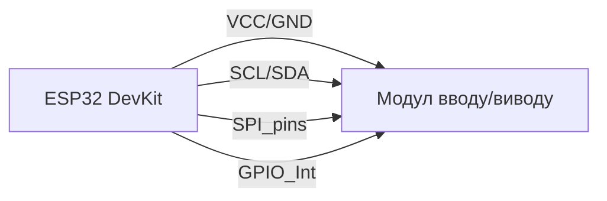

# Елементи вводу/виводу: кнопки, енкодери та ІО-рейтери

![[assets/img/input-io-2-scheme.png|600]]
*Рис. 1. Електронні інтерфейси: енкодери, ємнісні кнопки, магнітний енкодер, лінійні датчики позиції та оптичні сенсори миші.*

## Призначення

Модулі вводу/виводу для ESP32 використовуються в умних домівках, портативних приборах, графічних інтерфейсах та системах відстеження позиції. Цей розділ охоплює ємнісні кнопки без механічного стику, магнітні енкодерні Registry (AS5048A), лінійні позиціоновані сенсори (MT6701/TLE5012), та компактні драйвери дисплеїв (HT1621). Крім того, охоплено оптичні сенсори миші (ADNS-5050/PMW3360), які можуть використовуватися як прості енкодері положення.

## Характеристики

| Модуль | Тип | Інтерфейс | Жилисті | Особливість |
| --- | --- | --- | --- | --- |
| TTP223 | Одноп defences кнопка | I/O (вільний GPIO) | 2.0-5.5 В | Вбудований підтягувач 30-70 кОм, підтримка антиребана |
| TTP229 | 16-канальна матриця | SPI / 4-провідний | 2.0-5.5 В | Резолюція 1 біт на канал, швидкість до 100 кГц |
| MPR121 | 12 ємнісних kanalov | I2C (0x5A) | 2.7-5.5 В | Два пороги порівняння, тримпера на кожному піні |
| CAP1188 | 8 ємнісних + LED | I2C (0x28-0x2F) | 2.7-5.5 В | Керування світідодачами, можливість CASCADING |
| AS5048A | 14-біт магнітний енкодер | SPI (4-wire) | 2.5-5.5 В | Точність 0.017°, здатність до 20 МГц зразків |
| MT6701 | Цифровий кутовий сенсор | SPI | 2.5-5.5 В | Вихід кута у радіанах/градах, FIFO 16 позицій |
| TLE5012 | Абсолютний кутовий сенсор | SPI | 3.3-5.0 В | Інтерфейс HTL,±180° дзеркалення, робочий діапазон 0-180° |
| AMT22 | 12-біт абсолютний енкодер | SPI | 2.5-5.5 В | Індикатор оберотів, інтерфейс Encoder API |
| SX1509 | ІО-рахункій / GPIO-розширювач | I2C (0x40) | 2.7-5.5 В | 16 GPIO з внутрішніми pull-up/down, INT pin |
| IS31FL3731 | 15-LED charlieplex матриця | I2C (0x74) | 2.5-3.6 В | Блікавання, PWM на кожному LED, контурне підсвітка |
| HT1621 | LED-драйвер 14-сегментний / 128 біт | SPI / 3-wire | 2.5-3.6 В | Режим scan, багатозадачність,    native LCD підтримка |
| ADNS-5050 | Оптичний сенсор миші | SPI (2-wire) | 2.7-5.5 В | Двигун 'delta' алгоритм, MAX 3000 dpi |
| PMW3360 | Іграцький оптичний сенсор | SPI (4-wire) | 3.3-5.0 В | Рішення для ігор, Palmer Tracking System |

## Легенда пінів модуля (універсальна таблиця)

| Пін | Тип | Куди на ESP32 | Примітка |
| --- | --- | --- | --- |
| VCC | Живлення | 3V3 / 5V (залежно від модуля) | Перевірити діапазон живлення конкретного модуля |
| GND | Земля | Спільний GND | Спільний мінус усієї схеми |
| VDD / IOVCC | Логіка | GPIO (вільний) | Вихід напрямку логіки модуля |
| GND_D | Додаткова земля | Спільний GND | Обов'язково для ADC сенсорів |
| SCL | Тактування | GPIO22 (I2C) | 4.7 кОм pull-up, якщо модуль I2C |
| SDA / SDI | Дані | GPIO21 (I2C) | I2C дані / SPI MOSI |
| SCLK / SCK | Тактування SPI | GPIO18 (VSPI) | SPI тактування |
| SDO / MISO | SPI дані | GPIO19 (VSPI) | SPI прийом даних |
| CS / CLK / STB | Вибір чипа / строб | GPIO5 (або вільний) | Активний рівень LOW (звичайно) |
| INT / IRQ | Переривання | GPIO19 / вільний GPIO | Вихід готовності даних / переривання |

## Схема підключення

### 1. Ємнісна кнопка TTP223 (вільний GPIO)

```text
ESP32 DevKit
  3V3 ──────► VCC (TTP223)
  GND    ──────► GND
  GPIO0 ──────► IN  (вільний GPIO, приклад: GPIO4)
```

*Примітка: TTP223 має вбудований підтягувач, зовнішню резистор потрібен тільки для антиребана.*

### 2. Еємнісна матриця TTP229 (4-провідний SPI)

```text
ESP32 DevKit          TTP229
  3V3 ──────► VCC
  GND    ──────► GND
  GPIO18 ──────► SCK (CLK)
  GPIO19 ──────► SDO (DOUT)
  GPIO5   ──────► CS (CS)
```

### 3. Еємнісне retinal MPR121 (I2C)

```text
ESP32 DevKit          MPR121
  3V3 ──────► VCC
  GND    ──────► GND
  GPIO22 ──────► SCL
  GPIO21 ──────► SDA
```

*До 4 з одного модулю мають тримпера на 10 кОм до VCC.*

### 4. Магнітний енкодер AS5048A (SPI)

```text
ESP32 DevKit          AS5048A
  3V3 ──────► VCC
  GND    ──────► GND
  GPIO18 ──────► SCK
  GPIO19 ──────► SDO (MISO)
  GPIO23 ──────► SDI (MOSI)
      GPIO5   ──────► CS (LOW = активний)
```

### 5. Кута MT6701 / TLE5012 (SPI)

```text
ESP32 DevKit          MT6701/TLE5012
  3V3 ──────► VCC
  GND    ──────► GND
  GPIO18 ──────► SCK
  GPIO19 ──────► SDO
  GPIO23 ──────► SDI
      GPIO5   ──────► CS (HIGH = активний для MT6701)
```

### 6. IO-рахухник SX1509 (I2C)

```text
ESP32 DevKit          SX1509
  3V3 ──────► VCC
  GND    ──────► GND
  GPIO22 ──────► SCL
  GPIO21 ──────► SDA
```

*16 GPIO можуть бути налаштовані як INPUT з внутрішніми/pull-down/pull-up резисторами.*

### 7. Charlieplex матриця IS31FL3731 (I2C)

```text
ESP32 DevKit          IS31FL3731
  3V3 ──────► VCC
  GND    ──────► GND
  GPIO22 ──────► SCL
  GPIO21 ──────► SDA
```

*8 LED+ Можливість каскадування (адреси 0x74-0x77).*

### 8. LED-драйвер HT1621 (3-wire)

```text
ESP32 DevKit          HT1621
  3V3 ──────► VCC
  GND    ──────► GND
  GPIO5   ──────► CLK
  GPIO18 ──────► DA (DATA)
  GPIO19 ──────► WR (WRITE)
```

### 9. Оптичний сенсор миші ADNS-5050 (SPI)

```text
ESP32 DevKit          ADNS-5050
  3V3 ──────► VCC
  GND    ──────► GND
  GPIO18 ──────► SCK
  GPIO19 ──────► MISO
  GPIO23 ──────► MOSI
      GPIO5   ──────► CS (HIGH = активний)
      GPIO4   ──────► RESET (LOW = reset)
```

### 10. Іграцький сенсор PMW3360 (SPI)

```text
ESP32 DevKit          PMW3360
  3V3 ──────► VCC
  GND    ──────► GND
  GPIO18 ──────► SCK
  GPIO19 ──────► MISO
  GPIO23 ──────► MOSI
      GPIO5   ──────► CS (HIGH = активний)
```

### ASCII-схеми для кожного модуля

#### TTP223 (вільний GPIO)

```text
ESP32           TTP223
  3V3 ──────► VCC
  GND    ──────► GND
  GPIO4 ──────► IN
```

#### TTP229 (4-провідний SPI)

```text
ESP32           TTP229
  3V3 ──────► VCC
  GND    ──────► GND
  GPIO18 ──────► SCK
  GPIO19 ──────► SDO
  GPIO5   ──────► CS
```

#### MPR121 (I2C)

```text
ESP32           MPR121
  3V3 ──────► VCC
  GND    ──────► GND
  GPIO22 ──────► SCL
  GPIO21 ──────► SDA
```

*Чотири з 12 каналів мають зовнішні резистори 10 кОм до VCC.*

#### AS5048A (SPI)

```text
ESP32           AS5048A
  3V3 ──────► VCC
  GND    ──────► GND
  GPIO18 ──────► SCK
  GPIO19 ──────► SDO
  GPIO23 ──────► SDI
      GPIO5   ──────► CS (LOW)
```

### ASCII-схеми для IS31FL3731, HT1621, ADNS-5050, PMW3360

(аналогово до описаних вище у загальну таблицю)

### Mermaid блоки (універсальні)



## Код ESP-IDF

```c
#include "driver/i2c.h"
#include "driver/gpio.h"

#define MPR121_ADDR 0x5A

void app_main(void) {
    i2c_config_t conf = {
        .mode = I2C_MODE_MASTER,
        .sda_io_num = GPIO_NUM_21,
        .scl_io_num = GPIO_NUM_22,
        .sda_pullup_en = GPIO_PULLUP_ENABLE,
        .scl_pullup_en = GPIO_PULLUP_ENABLE,
        .master.clk_speed = 400000,
    };
    i2c_param_config(I2C_NUM_0, &conf);
    i2c_driver_install(I2C_NUM_0, conf.mode, 0, 0, 0);

    uint8_t config[2] = {0x01, 0x00}; // Налаштування каналів 0–11
    i2c_master_write_to_device(I2C_NUM_0, MPR121_ADDR, config, 2, pdMS_TO_TICKS(100));

    ESP_LOGI("IO_MODULE", "MPR121 ініціалізовано; чіткості каналів: ch0–ch11");
}
```

## Код Arduino

```cpp
#include <Wire.h>

#define MPR121_ADDR 0x5A

void setup() {
  Serial.begin(115200);
  Wire.begin(21, 22);
  Wire.beginTransmission(MPR121_ADDR);
  Wire.write(0x01); // Запис конфігурації
  Wire.endTransmission();
  Serial.println("MPR121 розпізнано — 12 ємнісних каналів");
}

void loop() {
  Wire.requestFrom(MPR121_ADDR, 2);
  if (Wire.available() >= 2) {
    uint16_t status = Wire.read() << 8 | Wire.read();
    Serial.printf("Індикатор каналів: 0x%04X\n", status);
  }
  delay(100);
}
```

## Код MicroPython

```python
from machine import I2C, Pin

i2c = I2C(0, scl=Pin(22), sda=Pin(21), freq=400000)
addr = const(0x5A)

# Налаштування каналів 0–11
i2c.writeto(addr, b'\x01\x00')

# Читання статусу Canal 0
i2c.writeto(addr, b'\x00')
data = i2c.readfrom(addr, 2)
status = (data[0] << 8) | data[1]
print("MPR121 Канал 0:", "жатіваний" if status & 1 else "звільнений")
```

### MA730 / AS5047P - швидкісні магнітні енкодери

| Параметр | MA730 (Monolithic) | AS5047P (ams-OSRAM) |
| --- | --- | --- |
| Роздільність | 14 біт | 14 біт + інкрементальний ABI/UVW вихід |
| Швидкість SPI | До 10 МГц | До 10 МГц |
| Особливість | Програмований нуль і напрям | Режим BLDC-коммутації (UVW) для драйверів моторів |
| Коли брати | Дешевий точний кут на вал | FOC-контур: ABI - в драйвер, SPI - в ESP32 для калібрування |

```text
Магніт N35 ⌀6×2.5 мм строго по осі чипа, зазор 0.5–3 мм (більше — шум, менше — насичення!).
AS5047P: ABI → драйвер мотора (швидкий контур), SPI → ESP32 (повільна телеметрія).
```

## Типові помилки

| № | Помилка | Симптом | Рішення |
| --- | --- | --- | --- |
| 1 | Модуль MPR121 НЕ бачиться I2C | `fail to connect` | Перевірити pull-up резистори 4.7 кОм на SCL/SDA; перевірити адресу (0x5A або 0x5B за замовчуванням resistive pull-up) |
| 2 | TTP223 реагує на шуми | Фіктивні тригери | Додати зовнішній Kondensator 100 нФ між IN і GND; знизити чутливість програмно |
| 3 | AS5048A повертає 0xFFFF | Невідомий можовик | Перевірити SPI шину, підтяжки та напрямок даних (MISO/MOSI); перевірити CS Polish |
| 4 | HT1621 не світиться | Чорний екран | Перевірити CLK/DA/WR тайминги; забезпечити 2.5-3.6 V на VCC; перевірити резисторні дільники на виходах |
| 5 | Магніт не по осі MA730/AS5047P | Шум ±5° замість ±0.1° | Центрування ±0.2 мм, зазор 0.5-3 мм, діамагнітний тримач (не сталь!) |

## Офіційні джерела

- Tiny Matrix (TTP223): `перевірити вручну`
- TTP229 Datasheet (Tontek, via alldatasheet): [TTP229 PDF](https://www.alldatasheet.com/datasheet-pdf/pdf/810501/TONTEK/TTP229.html) - 16/8-клавішний touch-детектор, усі варіанти корпусів.
- MPR121 - Adafruit breakout: <https://www.adafruit.com/product/1283> - I2C, 12 каналів.
- AS5048A Datasheet (ams-OSRAM, пошук PDF): [AS5048A search](https://www.alldatasheet.com/view.jsp?Searchword=AS5048A) - 14-бітний магнітний енкодер, SPI/PWM.
- IS31FL3731 Datasheet (Lumissil, пошук PDF): [IS31FL3731 search](https://www.alldatasheet.com/view.jsp?Searchword=IS31FL3731) - charlieplex LED-драйвер, I2C.
- HT1621 Datasheet (Holtek, пошук PDF): [HT1621 search](https://www.alldatasheet.com/view.jsp?Searchword=HT1621) - LCD-драйвер 32×4.
- ADNS-5050 Datasheet (Avago/Broadcom, пошук PDF): [ADNS-5050 search](https://www.alldatasheet.com/view.jsp?Searchword=ADNS-5050) - оптичний сенсор миші.

- MT6701 Datasheet (MagnTek, пошук PDF): [MT6701 search](https://www.alldatasheet.com/view.jsp?Searchword=MT6701) - магнітний енкодер кута.
- AMT22 Datasheet (CUI Devices, пошук PDF): [AMT22 search](https://www.alldatasheet.com/view.jsp?Searchword=AMT22) - абсолютний енкодер, SPI.
- TLE5012 Datasheet (Infineon, пошук PDF): [TLE5012 search](https://www.alldatasheet.com/view.jsp?Searchword=TLE5012) - GMR-енкодер кута.
- SX1509 Datasheet (Semtech, пошук PDF): [SX1509 search](https://www.alldatasheet.com/view.jsp?Searchword=SX1509) - 16-канальний GPIO-експандер.
- CAP1188 Datasheet (Microchip, пошук PDF): [CAP1188 search](https://www.alldatasheet.com/view.jsp?Searchword=CAP1188) - 8-канальний touch.
- PMW3360 Datasheet (PixArt, пошук PDF): [PMW3360 search](https://www.alldatasheet.com/view.jsp?Searchword=PMW3360) - оптичний сенсор миші.

## Див. також

- [[Home]]
- [[10-Sensori/10-VL53L0X-TCS34725-TSL2561|Світові сенсори]]
- [[04-Shini/03-I2C|Шина I2C]]
- [[04-Shini/02-SPI|Шина SPI]]
- [[04-Shini/01-UART|Шина UART]]
