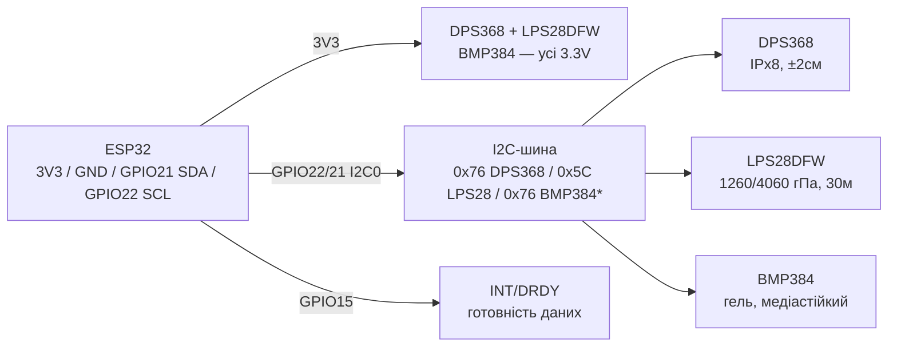

# Сенсори-залишки ринку: DPS368/LPS28, BMP384, TSOP48xx + чесна таблиця «брати / не брати»

![[assets/img/sensor-tails-scheme.png|600]]
*Рис. 1. Хвіст каталогів: водозахищений тиск (DPS368/LPS28/BMP384) на I2C поруч із BME280, ІЧ-приймач TSOP48xx на GPIO з демодуляцією 38кГц.*

> [!tip] Призначення ноти
> Закрити «хвости» ринку сенсорів, що не ввійшли в основні ноти: водозахищений тиск DPS368/LPS28, медіастійкий BMP384, серії ІЧ-приймачів TSOP48xx - плюс короткі картки рідкісних позицій. Тільки підтверджене документацією; сумнівне - у таблиці «не брати» з причиною.

## 1. Призначення

Основні кліматичні ноти ([[10-Sensori/03-BME280-BMP280-SHT31|BME280]], [[10-Sensori/17-Gas-CO2-Precision|Прецизійні гази/CO2]]) покривають масові сенсори. Сюди винесено те, що шукають точково:

| Сенсор | Навіщо | Ключова відмінність |
| --- | --- | --- |
| DPS368 (Infineon) | Тиск у вологих/польових умовах | Водозахист IPx8 (50м, 1 год), точність ±0.002гПа |
| LPS28DFW (ST) | Тиск + глибина у воді до 30м | Два діапазони 1260/4060гПа, водостійкий корпус |
| BMP384 (Bosch) | Тиск у агресивному середовищі | Гелеве заповнення, медіастійкість |
| TSOP48xx (Vishay) | ІЧ-пульт до ESP32 | Серії під несучі 30-56кГц |
| ENS210 (ScioSense) | Точна T/RH у мініатюрі | ±0.15°C, QFN4 2×2мм, I2C |
| SGP41 (Sensirion) | VOC + NOx індекси | Наступник EOL-го SGP30; ⚠️ SGP43 не існує! |
| T6615 (Telaire) | CO2 NDIR без ABC-калібрування | Dual-channel, UART 19200, 5В |
| TGS8100 (Figaro) | Якість повітря (запахи/дим) | Аналоговий MEMS, потрібне калібрування |
| ZMOD4510 (Renesas) | ⚠️ Obsolete/NRND - тільки для довідки | У нові вироби не брати (див. 10) |
| TSL2581 (?) | Освітленість | Знятий з виробництва - НЕ брати (див. 11) |

## 2. Водозахищений тиск: DPS368 vs LPS28DFW

### 2.1. Характеристики

| Параметр | DPS368 (Infineon) | LPS28DFW (ST) |
| --- | --- | --- |
| Діапазон тиску | 300-1200гПа | 260-1260гПа (режим 1) / 260-4060гПа (режим 2) |
| Точність/шум | Прецизійність ±0.002гПа (±2см), відносна ±0.06гПа | Точність ±0.5гПа, шум 0.32Па |
| Вода | IPx8: 50м протягом 1 год | Водостійкий корпус, глибина до 30м |
| Інтерфейс | I2C + SPI | I2C + MIPI I3C |
| Живлення | 1.7-3.6В | 1.7-3.6В (споживання від 1.7мкА) |
| Струм | ~1.7мкА @1Гц, стендбай 0.5мкА | Від 1.7мкА (LP) |
| FIFO | 32 рівні | 128 рівнів |
| Корпус | LGA 2.0×2.5×1.1мм | Циліндричний CCLGA з металокришкою під O-ring |
| ESP32-бібліотеки | Adafruit DPS310 (сумісна), Infineon XENSIV | ST-драйвери, прямі регістри нескладні |

> DPS368 - чемпіон точності й мініатюрності; LPS28DFW - чемпіон глибини (режим 4060гПа ≈ 30м води) і зручного монтажу під O-ring. Для метеостанції на вулиці - будь-який; для глибиноміра - тільки LPS28DFW.

### 2.2. Розпіновка й адреси

| Сенсор | I2C-адреса | SPI | Перемикання адреси |
| --- | --- | --- | --- |
| DPS368 | 0x77 (SDO→VDD) / 0x76 (SDO→GND) | Так, 4-дротяний | Пін SDO |
| LPS28DFW | 0x5C/0x5D (SA0) | Ні (I2C/I3C) | Пін SA0 |

### 2.3. Режими вимірювання DPS368 (повна таблиця)

Три режими роботи (регістр MEAS_CFG): Standby (сон, 0.5мкА), Command (один вимір за командою - для батарейних вузлів), Background (циклічні виміри із заданими rate + oversampling - основний режим).

| Oversampling (OSR) | Крок rate тиску/температури | Що отримуємо | Коли |
| --- | --- | --- | --- |
| ×1 | 1-128 вим/с | Швидко, шумно (~паскалі) | Детект порогів, вентиляція |
| ×2 / ×4 | 1-64 вим/с | Баланс | Логери на батареї |
| ×8 / ×16 | 1-32 вим/с | Чистіше, десятки мкА середнього | Вулична метеостанція |
| ×32 / ×64 | 1-16 вим/с | Висока точність | Висотомір, варіометр |
| ×128 | 1-8 вим/с | Максимум: прецизійність ±0.002гПа (±2см) | Калібрування, еталонні виміри |

> Час одного перетворення росте з OSR (точні мілісекунди - табл. Electrical Characteristics даташиту v1.1); rate вище за можливий при заданому OSR сенсор мовчки обмежує. FIFO 32 рівні збирає пачки без участі ESP32; переривання - за готовністю/порогом. Бібліотека Adafruit DPS310 повністю сумісна (DPS368 = водозахищений наступник DPS310).

### 2.4. Режими вимірювання LPS28DFW (повна таблиця)

| Параметр | Варіанти (за DS13317) | Коментар |
| --- | --- | --- |
| Режим | One-shot / Continuous | One-shot - за командою (батарея); continuous - з ODR |
| ODR | 1, 4, 10, 25, 50, 75, 100, 200 Гц | Вище ODR = більший струм; для глибиноміра досить 1-25Гц |
| Full-scale | 1260гПа (режим 1) / 4060гПа (режим 2) | 4060гПа ≈ 30м води - перемикається бітом FS; назад у 1260 - для точності на повітрі |
| Усереднення (AVG) | 4 / 8 / 16 / 32 / 64 / 128 / 512 | Аналог OSR: більше AVG = менше шуму (0.32Па тип.) |
| FIFO | Bypass / FIFO / Stream / Trigger, 128 рівнів | Stream для глибиноміра (кільце), trigger - стоп за порогом |
| Переривання INT_DRDY | Готовність / пороги тиску / FIFO-пороги | Будити ESP32 з light-sleep тільки за подією |

> LPS28DFW - тільки I2C/I3C (без SPI!). Адреса SA0→GND = 0x5C, SA0→VDD = 0x5D. WHO_AM_I (0x0F) = 0xB4 - перша перевірка живості (див. код у розд. 5).

### ASCII-схема

```text
  ESP32 DevKit              Водозахищений тиск (I2C0)
  ────────────              ─────────────────────────
  3V3 ────────────────────► DPS368 VDD/VDDIO + LPS28DFW VDD + BMP384 VDD/VDDIO
  GND ────────────────────► GND x3 (зірка!)
  GPIO22 ─────────────────► SCL (паралельно, [4.7кОм] до 3V3)
  GPIO21 ─────────────────► SDA (паралельно, [4.7кОм] до 3V3)
  GND ────────────────────► DPS368 SDO (=0x76) / SA0 LPS28 (=0x5C)
  GPIO15 ◄───────────────── DPS368 SDO-INT / LPS28 INT_DRDY (опційно)
  ⚠ Отвір тиску НЕ заклеювати! Мембрану тримати від флюсу/лаку.
```

### Mermaid



> \* DPS368 (0x76) і BMP384 (0x76) конфліктують - розвести адреси (DPS368 SDO→VDD = 0x77) або різні шини/мультиплексор (див. [[04-Shini/03-I2C|I2C]]).

![[assets/img/sensor-tails-scheme.png|600]]
*Рис. 2. TSOP48xx: живлення через RC-фільтр, вихід - на GPIO з перериванням; несуча пульта має збігатися з частотою приймача.*

## 3. BMP384 - медіастійкий тиск (Bosch)

Гелевоване заповнення порожнини: витримує воду, рідини й хімію при правильній інтеграції. Маленький корпус 2.0×2.0×1.0мм, I2C до 3.4МГц + SPI до 10МГц.

| Параметр | Значення |
| --- | --- |
| Діапазон | 300-1250гПа |
| Абсолютна точність | ±50Па (0-65°C) |
| Відносна точність | ±9Па (≈±0.75м) |
| Шум | 0.03Па (мін. смуга, макс. роздільність) |
| Струм | 3.4мкА @1Гц, сон 2.0мкА |
| Інтерфейс | I2C (0x76/0x77) + SPI |
| Живлення | VDD 1.65-3.6В, VDDIO 1.2-3.6В |
| Коли брати | Вулиця, промисловість, волога, пил - де BME280 деградує |

> BMP384 міряє тільки тиск+температуру (без вологості!). Вологість - окремим SHT45/AHT25 (див. [[10-Sensori/17-Gas-CO2-Precision|Прецизійні]]).

### 3.1. Режими живлення (повна таблиця)

| Режим | Поведінка | Струм (тип.) | Коли |
| --- | --- | --- | --- |
| Sleep | Сон, регістри живі | ~2.0мкА | Між рідкісними вимірами (батарея) |
| Forced | Один вимір за командою → назад у sleep | Пік ~500-700мкА на мілісекунди | Логер «прокинувся-поміряв-заснув» |
| Normal | Циклічні виміри з ODR | 3.4мкА @1Гц (середній) | Метеостанція, варіометр |

### 3.2. Oversampling, IIR, ODR

| Параметр | Варіанти | Ефект |
| --- | --- | --- |
| OSR тиску | ×1 - ×32 | ×32 = шум 0.03Па (мін. смуга); ×1 = швидко, шумно |
| OSR температури | ×1 - ×32 | Температура потрібна для компенсації тиску - не вимикати в 0 без причини |
| IIR-фільтр | Коеф. 0 / 1 / 3 / 7 / 15 / 31 / 63 / 127 | Давить короткі сплески (двері грюкнули); великий коеф. = інерційність - для висотоміра брати малий |
| ODR (normal) | 200 … 0.1Гц (ряд: 200/100/50/25/12.5/6.25/3.1/1.5/0.78/0.39/0.2/0.1) | ODR вище за потрібне = самонагрів + струм; для погоди досить 1Гц і рідше |

> Гелеве заповнення = медіастійкість, але НЕ вічність: гель тримає воду/пил/легку хімію, а не занурення під тиском (для глибини - LPS28DFW, розд. 2). Отвір тиску тримати від флюсу і лаку, як у DPS368.

## 4. ІЧ-приймачі TSOP48xx серіями (Vishay)

ІЧ-приймач = фотодіод + AGC-підсилювач + смуговий фільтр + демодулятор. ESP32 отримує вже готовий цифровий сигнал (активний низький). Головне правило: **несуча частота пульта = частота приймача**.

### 4.1. Таблиця серій

| Модель | Несуча | Під що | Корпус |
| --- | --- | --- | --- |
| TSOP4830 | 30кГц | Рідкісні пульти | Mold |
| TSOP4833 | 33кГц | Рідкісні пульти | Mold |
| TSOP4836 | 36кГц | Деякі кондиціонери | Mold/VSOP |
| TSOP4838 / TSOP38238 | 38кГц | 90% побутових пультів (NEC) | Mold/VSOP |
| TSOP4840 | 40кГц | Частина пультів | Mold |
| TSOP4856 | 56кГц | Спецтехніка, B&O-подібні | Mold |
| TSDP34138 | 38.4кГц | Передача даних (не пульти!) | Mold |
| TSMP93/94/95xxx | 30-60кГц / широкосмугові | Репітери, learning (несучу віддають назовні!) | Різні |

> AGC-індекс (TSOP12x/32x/34x/48x) підбирають під протокол: довгі пачки - інший AGC, ніж короткі NEC. Для звичайного пульта беріть TSOP48-серію на потрібну несучу - вона найтолерантніша.

### 4.1.б. AGC-серії детально (друга група цифр у маркуванні)

Одна несуча (напр. 38кГц) випускається в кількох AGC-варіантах - це НЕ взаємозамінні корпуси «на око»:

| Серія (приклад 38кГц) | Характер AGC | Під що |
| --- | --- | --- |
| TSOP32xxx (напр. TSOP32338) | Короткі пачки, швидке відновлення | Пульти NEC/RC5, кнопки |
| TSOP34xxx (напр. TSOP34438) | Середні пачки, захист від перешкод | Пульти + помірні дата-пачки |
| TSOP48xxx (напр. TSOP48438) | Довгі пачки, максимальна толерантність | Універсальний вибір для пультів - беріть за замовчуванням |
| TSDP341xx (напр. TSDP34138) | Фіксований підсилювач, без AGC-обрізання | Передача даних (не пульти!): довгі потоки бітів не обрізаються |
| TSMP58xxx (fixed-gain learner) | Без демодуляції: на виході **сама несуча** | Learning-пульти, аналіз невідомих протоколів - декодувати несучу на ESP32 через RMT |

Правила вибору:

1. Пульт від телевізора/кондиціонера → TSOP48 на несучій пульта (90% - 38кГц → TSOP48438/TSOP4838).
2. Свій дата-лінк через ІЧ (кілобити, довгі пачки) → TSDP, інакше AGC поріже потік.
3. «Хочу приймати будь-який пульт і розібрати протокол» → TSMP + RMT-захват таймінгів на ESP32.
4. Дальність визначає **струм ІЧ-світлодіода передавача** (десятки-сотні мА в імпульсі) і кут (±45° типово), а не «посилення приймача». Сонце/лампи розжарювання насичують фотодіод - приймач ховати від прямого світла, боки екранувати термоусадкою.

### 4.2. Підключення до ESP32

| Пін TSOP | Куди | Примітка |
| --- | --- | --- |
| VS (живлення) | 3V3 через R 100Ом + C 4.7-47мкФ на GND | RC-фільтр обов'язковий - інакше наводки від WiFi дають хибні спрацювання |
| GND | GND ESP32 | Коротко |
| OUT | GPIO (напр. GPIO15), внутрішній pull-up | Активний низький; декодування бібліотекою IRremote |

```cpp
// Arduino: читання NEC-пульта через TSOP4838 (бібліотека IRremote)
#include <IRremote.hpp>
#define IR_PIN 15
void setup() {
  Serial.begin(115200);
  IrReceiver.begin(IR_PIN, ENABLE_LED_FEEDBACK); // вбудований LED моргає на прийом
}
void loop() {
  if (IrReceiver.decode()) {
    Serial.printf("proto=%d addr=0x%X cmd=0x%X\n",
      IrReceiver.decodedIRData.protocol,
      IrReceiver.decodedIRData.address,
      IrReceiver.decodedIRData.command);
    IrReceiver.resume();
  }
}
```

```python
# MicroPython: сирий захват пачок TSOP (NEC — старт 9мс + 4.5мс)
from machine import Pin
import time
ir = Pin(15, Pin.IN, Pin.PULL_UP)
while True:
    if ir.value() == 0:  # старт пачки
        t0 = time.ticks_us()
        while ir.value() == 0: pass
        print("burst:", time.ticks_diff(time.ticks_us(), t0), "us")
    time.sleep_ms(10)
```

## 5. Код: тиск на спільній шині (3 стеки)

```cpp
// Arduino: DPS368 (Adafruit_DPS310) + BMP384 (Adafruit_BMP3XX) + LPS28 (регістри)
#include <Wire.h>
#include <Adafruit_DPS310.h>
#include <Adafruit_BMP3XX.h>
Adafruit_DPS310 dps;
Adafruit_BMP3XX bmp;
void setup() {
  Serial.begin(115200);
  Wire.begin(21, 22);
  if (!dps.begin_I2C(0x77)) Serial.println("DPS368? SDO->VDD = 0x77");
  dps.configurePressure(DPS310_64HZ, DPS310_64SAMPLES);
  if (!bmp.begin_I2C(0x76)) Serial.println("BMP384? SDO->GND = 0x76");
  bmp.setPressureOversampling(BMP3_OVERSAMPLING_8X);
  // LPS28DFW 0x5C: WHO_AM_I 0x0F має повернути 0xB4; далі CTRL_REG1 ODR
}
void loop() {
  sensors_event_t t, p;
  if (dps.getEvents(&t, &p)) Serial.printf("DPS368 P=%.1f T=%.1f\n", p.pressure, t.temperature);
  Serial.printf("BMP384 P=%.1f\n", bmp.readPressure() / 100.0);
  delay(2000);
}
```

```c
// ESP-IDF: перевірка присутності за WHO_AM_I / chip-id
// DPS368: REG 0x0D -> 0x10 | LPS28DFW: REG 0x0F -> 0xB4 | BMP384: REG 0x00 -> 0x50
static uint8_t rd1(uint8_t addr, uint8_t reg) {
    uint8_t v = 0;
    i2c_cmd_handle_t h = i2c_cmd_link_create();
    i2c_master_start(h);
    i2c_master_write_byte(h, (addr << 1) | I2C_MASTER_WRITE, true);
    i2c_master_write_byte(h, reg, true);
    i2c_master_start(h);
    i2c_master_write_byte(h, (addr << 1) | I2C_MASTER_READ, true);
    i2c_master_read_byte(h, &v, I2C_MASTER_NACK);
    i2c_master_stop(h);
    i2c_master_cmd_begin(I2C_NUM_0, h, pdMS_TO_TICKS(100));
    i2c_cmd_link_delete(h);
    return v;
}
// Виклик: rd1(0x77,0x0D)==0x10 -> DPS368; rd1(0x5C,0x0F)==0xB4 -> LPS28; rd1(0x76,0x00)==0x50 -> BMP384
```

## 6. ENS210 - точна температура + вологість у QFN4 (ScioSense)

ENS210 (родина ENS21x) - високоточний цифровий сенсор T/RH: монолітно інтегровані датчики температури й вологості, заводське калібрування, на виході одразу кельвіни і %RH. Перевірено за офіційною сторінкою родини ScioSense (активний продукт, даташити ENS210/ENS210A/ENS212A доступні).

| Параметр | ENS210 | ENS210A / ENS212A |
| --- | --- | --- |
| Температура: точність / діапазон | ±0.15°C / −40…+100°C | ±0.15°C / −40…+125°C |
| Вологість: точність / діапазон | ±2.0%RH / 0-100% | ±2.0%RH (210A) / ±1.5%RH (212A) |
| Корпус | QFN4 2.0×2.0×0.75мм | Той же |
| Живлення | 1.71-3.6В | 1.71-3.6В |
| Інтерфейс | I2C, адреса **фіксована 0x43** | Так само |
| Standby | 40нА (автосон між вимірами) | Так само |
| Кваліфікація | Побут/прилади | ENS210A/212A - AEC-Q100 Grade 1 (авто) |

> Увага, фіксована адреса 0x43: **два ENS210 на одній шині I2C неможливі** - другий тільки через іншу шину або мультиплексор (див. [[04-Shini/03-I2C|I2C]]). Адресу підтверджувати скануванням перед монтажем у виріб.
> EOL-пастка родини: ENS211 і ENS215 зняті з виробництва (EOL-нотифікація ScioSense) - залишки на маркетплейсах не брати; активні - ENS210/210A/212A.

```cpp
// Arduino: ENS210 через бібліотеку sciosense/ens21x-arduino (API — за README бібліотеки)
#include <Wire.h>
// + #include <ENS21x.h> / клас ENS21x з репозиторію sciosense/ens21x-arduino
void setup() {
  Serial.begin(115200);
  Wire.begin(21, 22);
  // 1. I2C-скан: ENS210 має відповісти ТІЛЬКИ на 0x43
  for (uint8_t a = 1; a < 127; a++) {
    Wire.beginTransmission(a);
    if (Wire.endTransmission() == 0) Serial.printf("found 0x%02X\n", a);
  }
  // 2. Далі — init/measure/getTemp/getRH за прикладами бібліотеки ens21x-arduino
}
```

Коли брати: компактний точний T/RH-вузол (термостат, логер, носима електроніка), автомобільні застосування - A-версії. Порівняння з масовими SHT/AHT - у [[10-Sensori/07-AHT10-AHT20-SHT40|AHT/SHT40]] і [[10-Sensori/30-Temp-Precision|Прецизійна температура]].

## 7. SGP41 - VOC + NOx індекси (Sensirion, наступник SGP30)

SGP41 - цифровий MOX-сенсор якості повітря на CMOSens: мікро-hotplate + два канали (VOC і NOx), на виході - сирі ticks і оброблені **Gas Index 1-500** (VOC Index і NOx Index, 100 = середнє типове). Перевірено за каталогом і даташитом Sensirion (активний продукт).

| Параметр | Значення |
| --- | --- |
| Виходи алгоритму | VOC Index 1-500 + NOx Index 1-500 (відносні! не ppm) |
| Сирий вихід | 16-біт ticks VOC + 16-біт ticks NOx |
| Інтерфейс | I2C, адреса 0x59 |
| Живлення / струм | 1.7-3.6В, ~3.0мА @3.3В (hotplate імпульсно) |
| Корпус | DFN 6 пін, 2.44×2.44×0.85мм |
| Self-test | Вбудований (hotplate + MOX), результат - 2 байти + CRC |
| Бібліотеки | Sensirion `arduino-i2c-sgp41` + `arduino-gas-index-algorithm` (GitHub Sensirion) |
| Молодший брат | SGP40 - тільки VOC (дешевший, той же корпус/алгоритм) |

> Чесно про «ppm»: MOX-сенсори НЕ міряють абсолютні ppm VOC - індекс 1-500 показує подію/динаміку відносно базового рівня. Хто обіцяє «точні ppm формальдегіду з SGP41» - вводить в оману. Алгоритму потрібен час адаптації (перша година дані пливуть - норма), компенсація вологості - парою з SHT4x.
> ⚠️ **SGP43 не існує**: у каталозі Sensirion є SGP40 і SGP41 - і крапка. Пропозиції «SGP43» з маркетплейсів = невідомо що (перемаркування/підробка). Так само EOL: SGP30 і SGPC3 зняті - у нові вироби тільки SGP40/SGP41.

```cpp
// Arduino: SGP41 + Gas Index Algorithm (бібліотеки Sensirion з GitHub)
#include <Wire.h>
#include <SensirionI2CSgp41.h>
#include <VOCGasIndexAlgorithm.h>
#include <NOxGasIndexAlgorithm.h>
SensirionI2CSgp41 sgp;
VOCGasIndexAlgorithm vocAlg;
NOxGasIndexAlgorithm noxAlg;
void setup() {
  Serial.begin(115200);
  Wire.begin(21, 22);
  sgp.begin(Wire);
  // Conditioning: перші виміри після ввімкнення — прогрів hotplate
  for (int i = 0; i < 10; i++) {
    uint16_t condVoc = 0, condNox = 0;
    sgp.executeConditioning(0x8000, 0x8000, condVoc); // типовий виклик прогріву
    delay(1000);
  }
}
void loop() {
  uint16_t rawVoc = 0, rawNox = 0;
  if (sgp.measureRawSignals(rawVoc, rawNox) == 0) {
    int32_t vocIdx = vocAlg.process(rawVoc);   // 1..500
    int32_t noxIdx = noxAlg.process(rawNox);   // 1..500
    Serial.printf("VOC idx=%d NOx idx=%d\n", (int)vocIdx, (int)noxIdx);
  }
  delay(1000); // VOC — щосекунди типово
}
```

Коли брати: очищувачі повітря, DCV-вентиляція, «розумний» запуск витяжки за подією. Точні гази/CO2 - у [[10-Sensori/17-Gas-CO2-Precision|Прецизійні гази/CO2]] і [[10-Sensori/22-Gas-2-VOC-Industrial|Гази-2/VOC]].

## 8. T6615 - CO2 NDIR без щоденного ABC (Amphenol Telaire)

T6615 - двоканальний NDIR-модуль CO2 (вимірювальний + герметизований референсний канали): на відміну від молодшого T6613, не потребує щоденного ABC-самокалібрування за чистим повітрям. Перевірено за даташитом Amphenol і платформою ESPHome `t6615`.

| Параметр | Значення |
| --- | --- |
| Діапазони | 0-2000 / 0-5000 / 0-10000 / 0-50000 ppm (модифікації −5K/−10K/−50K; −F = flow-through) |
| Інтерфейси | UART 19200 бод + аналоговий 0-4В (пропорційно ppm) |
| Живлення | 5В регульованих ±5%; пік 0.90Вт / середнє 0.165Вт |
| Умови | 0…+50°C, 0-95%RH без конденсату |
| Прогрів / оновлення | <2хв робочий (10хв - макс. точність); нові дані кожні ~5с |
| ESP32-підтримка | ESPHome `sensor.t6615` з коробки (UART) |

Схема підключення до ESP32 (5-вольтова логіка!):

```text
   T6615 (5V!)                    ESP32
   ──────────                     ─────
   V+ (pin 1/C) ◄── 5V (окремий стабілізатор, пік ~180мА!)
   GND (pin 2/3/12) ──► GND (спільна!)
   TX (pin 10/A) ──[дільник 2:1 або level-shifter]──► RX2 (GPIO16)
   RX (pin 11/B) ◄── TX2 (GPIO17) через level-shifter (5V-tolerant вхід T6615?)
   AV OUT (pin 4, 0–4В) ──[дільник]──► ADC (резервний варіант без UART)
   ⚠ Рівні UART звіряти з даташитом конкретної модифікації; безпосередньо 5V TX → GPIO ESP32 НЕ можна!
```

```yaml
# ESPHome: T6615 по UART (перевірений шлях, без ручного парсингу кадрів)
uart:
  rx_pin: GPIO16
  tx_pin: GPIO17
  baud_rate: 19200
sensor:
  - platform: t6615
    co2:
      name: "CO2 T6615"
    update_interval: 60s
```

```cpp
// Arduino: сирий перегляд кадрів T6615 (для діагностики перед парсингом за UART-протоколом Amphenol)
#include <HardwareSerial.h>
HardwareSerial co2(2);
void setup() {
  Serial.begin(115200);
  co2.begin(19200, SERIAL_8N1, 16, 17); // RX=16, TX=17
}
void loop() {
  while (co2.available()) Serial.printf("%02X ", co2.read());
  Serial.println("| frame");
  delay(5000); // сенсор оновлює дані кожні ~5с
}
```

> T6613 (одноканальний) дешевший, але вимагає регулярного ABC за чистим повітрям - у спальні/офісі з людьми ок, у підвалі/теплиці пливе. Для пилу/повітря загалом - див. [[10-Sensori/23-Dust-CO2-2|Пил/CO2-2]] і [[10-Sensori/08-BME680-CCS811-MHZ19-PMS5003|BME680/CCS811/MH-Z19]].

## 9. TGS8100 - аналоговий MEMS-контроль забруднень повітря (Figaro)

TGS8100 - мініатюрний SMD-сенсор забруднень повітря (сигаретний дим, запахи готування, ЛОС-фон): MEMS-структура з нагрівачем, вихід - **аналоговий** (опір чутливого шару Rs падає в присутності газів). Існування і статус підтверджено за каталогом і техінформацією Figaro (активна позиція для IAQ).

| Параметр | Значення (за Figaro) |
| --- | --- |
| Призначення | Детект забруднень повітря 1-30ppm H2 (орієнтир чутливості) |
| Вихід | Аналоговий: дільник Rs + навантажувальний RL → АЦП |
| Нагрівач | ~60мА (режим живлення нагрівача - за даташитом!) |
| Корпус | SMD, паяється reflow за профілем Figaro |
| Прогрів | ≥1 год у стандартних умовах перед вимірами (20±2°C, 65±5%RH) |
| ESD | Чутливий! Поводження з ESD-захистом |

Схема і логіка роботи:

```text
   5V ──[MOSFET, керування з GPIO]──► VH (нагрівач TGS8100) ──► GND
   (MOSFET — щоб вимикати нагрівач у сні / робити duty-cycle для економії батареї)
   Vc (5V або 3.3V за даташитом) ──[Rs TGS8100]──┬──[RL]──► GND
                                                │
                                                └──► ADC (краще зовнішній ADS1115:
                                                     див. [[10-Sensori/09-ADS1115-MCP3008-PCF8574-MCP23017|ADS1115]])
```

1. Калібрування Ro: витримати ≥1 год на **чистому повітрі**, записати Ro = Rs_чисте.
2. Робоча величина - **відношення Rs/Ro** (< 1 у забрудненні), а не «ppm з неба»: без калібрування еталонним газом це індикатор подій, не газоаналізатор.
3. RL підбирають так, щоб робоча точка дільника була посередині шкали АЦП при типових Rs/Ro (за графіками sensitivity-характеристик Figaro).

```cpp
// Arduino: Rs/Ro-індикатор TGS8100 (після 1 год прогріву!)
#define RL 10000.0f          // навантажувальний резистор, Ом — підібрати за даташитом
float Ro = 0;                // калібрується на чистому повітрі
void setup() {
  Serial.begin(115200);
  // ... прогрів 1 год, нагрівач увімкнено ...
  long sum = 0; for (int i = 0; i < 64; i++) { sum += analogRead(34); delay(10); }
  float v = (sum / 64.0f) / 4095.0f * 3.3f;
  Ro = RL * (3.3f - v) / v;  // Rs на чистому повітрі
  Serial.printf("Ro=%.0f Ohm\n", Ro);
}
void loop() {
  float v = analogRead(34) / 4095.0f * 3.3f;
  float rs = RL * (3.3f - v) / v;
  Serial.printf("Rs/Ro=%.3f %s\n", rs / Ro, (rs / Ro < 0.8) ? "AIR DIRTY" : "air ok");
  delay(2000);
}
```

> Аналогові MOX без калібрування - тільки тригери («провітрити»), кількісні ppm - NDIR/electrochemical з калібруванням. Сусіди по темі: [[10-Sensori/12-MQ2-MQ7-MQ135-Flame-Sound|MQ-серії]] (аналогова класика) і [[10-Sensori/22-Gas-2-VOC-Industrial|Гази-2/VOC]].

## 10. ZMOD4510 - чесна нота: Obsolete, у нові вироби НЕ брати

ZMOD4510 (Renesas/IDT) - MOX-сенсор вуличного повітря (NO2 + O3, неселективно + селективний O3 у ULP-режимі, AQI-прошивка з ML-алгоритмами, I2C, 1.7-3.6В, ULP від 0.2мВт, LGA 3×3×0.7мм, була IP67-версія). Сенсор реальний, документація існує - **але офіційна сторінка Renesas маркує продукт Obsolete/NRND без рекомендованої заміни (станом на 2026)**. Висновок для цієї ноти:

| Питання | Відповідь |
| --- | --- |
| У новий виріб? | ❌ Ні: немає гарантії партій і підтримки прошивки/AQI-алгоритмів |
| У ремонт існуючого? | ✅ Так, поки є залишки у дистриб'юторів |
| Чим замінити для indoor VOC/NOx? | SGP41 (розд. 7) - активний, з алгоритмом і бібліотеками |
| Чим замінити вуличні NO2/O3? | Чесно: прямого активного нащадка Renesas не дає; дивитись Spec Sensors / Alphasense (електрохімічні), це вже інший клас ціни/габаритів |

## 11. Чесна таблиця «брати / не брати» (оновлена)

| Позиція | Статус | Вердикт |
| --- | --- | --- |
| DPS368 | Активний (Infineon XENSIV, даташит v1.1) | ✅ Брати для вулиці/вологості/точності |
| LPS28DFW | Активний (ST, даташит DS13317) | ✅ Брати для глибини/водостійкості |
| BMP384 | Активний (Bosch, гелева серія) | ✅ Брати для агресивного середовища |
| TSOP4838 (38кГц) | Активний (Vishay, серія у виробництві) | ✅ Брати для 90% пультів |
| TSOP4836/4840/4856 | Активні ніші | ✅ Брати тільки під свою несучу |
| TSDP341xx | Активний, але для даних | ⚠️ Тільки для дата-лінків, не для пультів |
| TSMP95/96/97xxx | Активні, learning/репітери | ⚠️ Тільки коли потрібна сама несуча |
| TSL2581 | **Obsolete/EOL** (підтверджено дистриб'юторами, статус Obsolete) | ❌ НЕ брати; заміна - активний TSL2591 |
| ENS210 / ENS210A / ENS212A | Активні (ScioSense ENS21x, I2C 0x43 фікс.) | ✅ Брати для точного T/RH, A-версії - в авто |
| ENS211 / ENS215 | **EOL** (нотифікація ScioSense) | ❌ НЕ брати, залишки - ні |
| SGP41 (VOC+NOx) / SGP40 (VOC) | Активні (Sensirion, I2C 0x59) | ✅ Брати; індекс 1-500, не ppm! |
| «SGP43» з маркетплейсів | **Не існує** (немає в каталозі Sensirion) | ❌ НЕ брати - підробка/перемаркування |
| SGP30 / SGPC3 | **EOL** (Sensirion, є офіційний статус) | ❌ НЕ брати; заміна - SGP40/SGP41 |
| T6615 (Telaire) | Активний (NDIR dual-channel, UART 19200) | ✅ Брати, коли не потрібне ABC |
| T6613 (Telaire) | Активний, але одноканальний + ABC | ⚠️ Тільки де є регулярне чисте повітря |
| TGS8100 (Figaro) | Активний (аналоговий MEMS IAQ) | ⚠️ Брати як тригер подій, не як ppm-метр |
| ZMOD4510 (Renesas) | **Obsolete/NRND** (сторінка Renesas, 2026) | ❌ НЕ брати в нові; заміна - SGP41 / електрохімія |
| Безіменні «BMP388 з маркетплейсу» без маркування Bosch | Перемарковані/невідомі | ❌ НЕ брати; перевіряти chip-id 0x50 |

> Чесність понад усе: TSL2581 колись був хорошим ALS (два канали, I2C), але виробництво зупинене - залишки на руках без підтримки. Для освітленості див. ноти [[10-Sensori/10-VL53L0X-TCS34725-TSL2561|ToF/Колір]] та [[10-Sensori/18-Light-Spectral-Gesture|Світло/Спектр]].

## Типові помилки

| # | Помилка | Симптом | Рішення |
| --- | --- | --- | --- |
| 1 | Отвір тиску заклеєний/залитий лаком | Тиск «стоїть», не реагує на висоту | Тримати мембрану відкритою; маскувати каптоном при покритті |
| 2 | Флюс/волога в отворі DPS368/BMP384 | Дрейф, стрибки показань | Промити, висушити; не дмухати феном в отвір |
| 3 | DPS368 і BMP384 на одній адресі 0x76 | Один зникає зі скану | DPS368 SDO→VDD (0x77), BMP384 SDO→GND (0x76) |
| 4 | LPS28DFW живлять 5В | Перегрів, смерть сенсора | Тільки 1.7-3.6В; логіка 3.3В |
| 5 | LPS28 у режимі 1260гПа під водою глибше ~10м | Насичення, плоска лінія | Увімкнути режим 2 (4060гПа) для глибини |
| 6 | TSOP не на тій несучій (38кГц приймач + 56кГц пульт) | Дальність сантиметри або нуль | Звірити несучі; тримати TSOP4838/4856 під рукою обидва |
| 7 | TSOP без RC-фільтра живлення | Хибні спрацювання при WiFi-TX | R 100Ом + C 4.7-47мкФ біля VS |
| 8 | TSDP для пульта / TSOP для дата-лінка | Обрізані пачки, помилки декоду | Дата - TSDP, пульти - TSOP, learning - TSMP |
| 9 | TSOP дивиться впритул на лампу денного світла/Noname-LED | Постійний шум, «фантомні» коди | Екранувати боки термоусадкою, відвернути від ламп |
| 10 | Купівля TSL2581 «дешево, залишки» | EOL, без партій, підробки | Не брати; заміна - TSL2591 (активний) |
| 11 | Перемаркований BMP з маркетплейсу | Chip-id не 0x50, бібліотека не бачить | Читати chip-id перед монтажем у виріб |
| 12 | Опитування тиску на сотнях Гц «щоб точніше» | Шум і самонагрів, гірше ніж на 1-10Гц | Оверсемплінг сенсора + усереднення, ODR 1-25Гц |
| 13 | Два ENS210 на одній шині I2C | Конфлікт адреси 0x43, шина «висить» | Адреса фіксована - другий тільки на іншу шину/мультиплексор |
| 14 | Купівля ENS211/ENS215 «дешево» | EOL, без підтримки | Тільки ENS210/210A/212A |
| 15 | Трактування VOC/NOx-індексу SGP41 як ppm | «Концентрація» пливе і нічого не означає | Індекс 1-500 = подія/динаміка; ppm - тільки NDIR/електрохімія з калібруванням |
| 16 | Пошук/купівля «SGP43» | Такого сенсора не існує - підробка | SGP40 (VOC) / SGP41 (VOC+NOx), перевіряти chip-ID |
| 17 | T6615 безпосередньо 5V TX → GPIO ESP32 | Перевантаження входу, деградація/вихід з ладу | Дільник/level-shifter на RX ESP32; рівні - за даташитом модифікації |
| 18 | TGS8100 без 1 год прогріву і без Ro-калібрування | «Показання» випадкові, дрейф годинами | Прогрів + Ro на чистому повітрі, робоча величина Rs/Ro |
| 19 | ZMOD4510 у новий виріб «бо є плата-приклад» | Obsolete: завтра не буде партій і прошивок | SGP41 для indoor; вулицю - активною електрохімією |
| 20 | BMP384 як «вологість» | Вологість він не міряє взагалі | Пара SHT45/AHT25 для RH (див. розд. 3) |

## Офіційні джерела

- [BMP384 - продукт і даташит (Bosch Sensortec)](https://www.bosch-sensortec.com/products/environmental-sensors/pressure-sensors/bmp384/) - гель, ±9Па, I2C/SPI.
- [IR Receivers - каталог і параметричний пошук (Vishay)](https://www.vishay.com/en/ir-receiver-modules/) - серії TSOP48xx/TSDP/TSMP, несучі, AGC.
- [XENSIV pressure sensors for IoT, DPS368 waterproof IPx8 (Infineon)](https://www.infineon.com/products/sensor/pressure-sensors/pressure-sensors-for-iot) - DPS368: ±0.002гПа, 50м/1год.
- [DPS368 datasheet v1.1 (Infineon, PDF)](https://www.infineon.com/assets/row/public/documents/24/49/infineon-dps368-datasheet-en.pdf) - регістри, адреси 0x76/0x77, корпус.
- [LPS28DFW - продукт (ST)](https://www.st.com/en/mems-and-sensors/lps28dfw.html) - dual full-scale 1260/4060гПа, водостійкий корпус (сторінка з бот-захистом - відкривати браузером).
- [LPS28DFW datasheet DS13317 (ST, PDF)](https://www.st.com/resource/en/datasheet/lps28dfw.pdf) - шум 0.32Па, FIFO 128, режими.
- [TSL2581/83 datasheet (ams/TAOS, PDF-дзеркало)](https://download.mikroe.com/documents/datasheets/TSL2583%20Datasheet.pdf) - для історії; статус пристрою - Obsolete, не для нових розробок.
- [ENS21x - родина точних T/RH-сенсорів (ScioSense)](https://www.sciosense.com/ens21x-family-of-high-performance-digital-temperature-and-humidity-sensors) - ENS210 ±0.15°C/±2.0%RH, QFN4, I2C, A-версії AEC-Q100; там само EOL-нота ENS211/ENS215.
- [ENS210 datasheet (ScioSense, PDF)](https://www.sciosense.com/wp-content/uploads/2025/12/ENS210-Datasheet.pdf) - регістри, фіксована адреса 0x43, драйвери: [ens21x-arduino](https://github.com/sciosense/ens21x-arduino).
- [SGP41 - VOC+NOx сенсор (Sensirion, каталог)](https://sensirion.com/products/catalog/SGP41) - індекси 1-500, I2C 0x59; даташит SGP41 v1.0; бібліотеки `arduino-i2c-sgp41` + `arduino-gas-index-algorithm` (GitHub Sensirion).
- [T6615 Dual Channel CO2 Sensor Module (Amphenol Telaire)](https://amphenol-sensors.com/en/telaire/co2/525-co2-sensor-modules/319-t6615) - діапазони, UART 19200, 5В; ESPHome-платформа [t6615](https://esphome.io/components/sensor/t6615).
- [TGS8100 - MEMS сенсор забруднень повітря (Figaro)](http://www.figaro.co.jp/en/product/docs/tgs8100_product%20infomation(en)_rev06.pdf) - 1-30ppm H2-орієнтир, ~60мА нагрівач, прогрів ≥1 год, ESD-чутливість (PDF виробника).
- [ZMOD4510 - Gas Sensor for O3 and NO2 (Renesas)](https://www.renesas.com/en/products/zmod4510) - довідково: статус сторінки Obsolete/NRND (2026), тому в нові вироби не брати; даташит лишається джерелом параметрів для ремонту.

## Див. також

- [[Home|Головна]]
- [[10-Sensori/35-Tails|Ця нота (Tails)]] - див. також [[17-Lab/04-PCB-Design|PCB-Design: своя плата]]
- [[10-Sensori/17-Gas-CO2-Precision|Гази/CO2 прецизійні]]
- [[06-Analog/01-ADC|ADC]]
- [[04-Shini/03-I2C|I2C]]
- [[10-Sensori/03-BME280-BMP280-SHT31|BME280/BMP280]]
- [[10-Sensori/24-Pressure-Level-Flow|Тиск/Рівень/Потік]]
- [[10-Sensori/18-Light-Spectral-Gesture|Світло/Спектр]]
- [[12-Moduli-zvyazku/08-LD2410-UWB-IR-Voice|Радар/UWB/ІЧ/Голос]]
