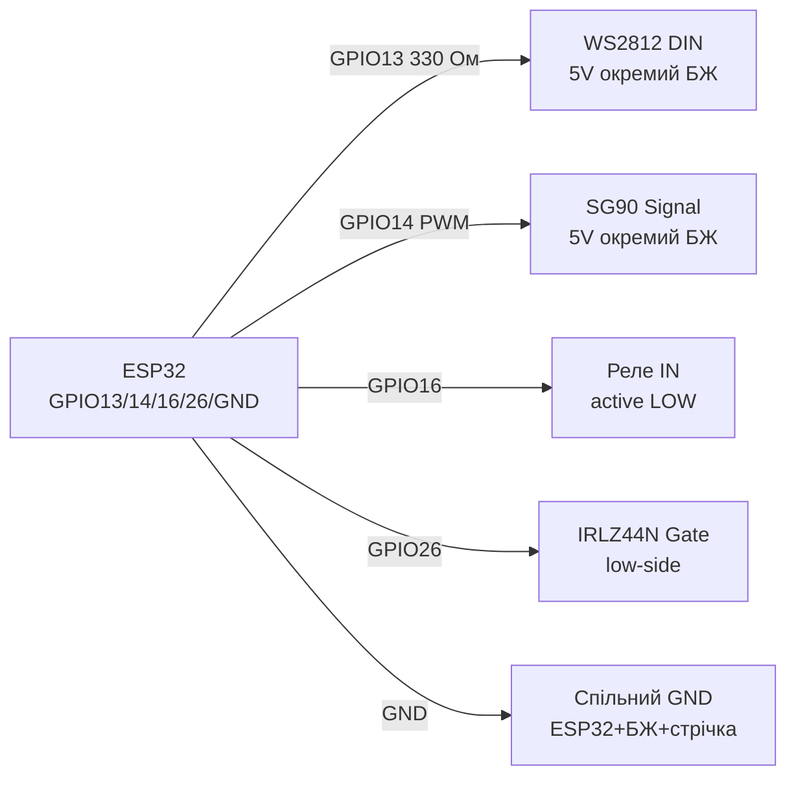

# NeoPixel WS2812, Servo SG90, реле SRD-05V, MOSFET - актуатори

## Призначення

Базові виконавчі пристрої ESP32: адресні LED WS2812B (NeoPixel) для індикації/підсвітки; сервопривід SG90 (PWM 50 Гц) для повороту на кут; реле SRD-05VDC з опторозв'язкою для комутації 220 В / великих DC-навантажень; MOSFET logic-level (IRLZ44N) для ШІМ-керування моторами, стрічками, нагрівачами безпосередньо з GPIO.

## Характеристики

| Пристрій | Керування | Живлення | Ключове правило |
| --- | --- | --- | --- |
| WS2812B | 1-Wire 800 кГц (RMT - ідеально) | 5 В, ~60 мА/LED на білому | Конденсатор 1000 мкФ + резистор 330 Ом на DATA |
| SG90 | PWM 50 Гц, 1-2 мс (0-180°) | 4.8-6 В, ~250 мА пік (stall ~650 мА) | Окреме живлення, спільний GND; не від 3V3 плати! |
| Реле SRD-05V (1-канальний модуль) | IN 5 В (активний LOW), opto PC817 | Котушка 5 В ~70 мА; контакти 10 А/250 VAC | JD-VCC для повної розв'язки; flyback-діод вже на модулі |
| IRLZ44N (logic-level) | Vgs(th) 1-2 В → відкривається від 3.3 В | Id до 47 А (практично 5-10 А без радіатора) | IRFZ44N/IRF540 НЕ підходять (Vgs 10 В)! |

> ESP32 має апаратний RMT-периферік - генерація WS2812 без джитера навіть під Wi-Fi. Бібліотеки: NeoPixelBus (RMT-метод), Adafruit_NeoPixel (бітбенг - гірше), FastLED (RMT-драйвер для ESP32).

## Розпіновка

| WS2812 стрічка | Призначення |
| --- | --- |
| 5V (червоний) | 5 В від окремого БЖ (не від плати при >5 LED!) |
| DIN | DATA від GPIO через 330 Ом |
| GND | Спільний GND з ESP32 і БЖ |

| SG90 | Колір | Призначення |
| --- | --- | --- |
| Коричневий/чорний | GND | Спільна земля |
| Червоний | 5 В | Окремий БЖ 5 В / 1 А+ |
| Помаранчевий/жовтий | Signal | PWM 50 Гц від GPIO |

| Реле-модуль (low-level trigger) | Призначення |
| --- | --- |
| VCC | 5 В котушки |
| IN | GPIO (LOW = реле ON); краще через транзистор/інверсію |
| GND | Земля |
| JD-VCC (джампер) | Зняти джампер → окреме живлення котушки для розв'язки |
| COM/NO/NC | Силові контакти |

## Схема підключення

| ESP32 | WS2812 | Примітка |
| --- | --- | --- |
| GPIO13 | DIN через 330 Ом | Будь-який GPIO з RMT; резистор біля першого LED |
| GND | GND стрічки | Спільна земля з БЖ 5 В обов'язкова |
| - | 5V стрічки | БЖ 5 В: 60 мА × N LED (напр. 30 LED → 2 А запас) |
| - | 5V-GND стрічки | Електроліт 1000 мкФ × 6.3-16 В біля початку стрічки |

| ESP32 | SG90 | Примітка |
| --- | --- | --- |
| GND | GND серво | Спільна земля |
| 5V БЖ | VCC серво | Окремий БЖ; конденсатор 470 мкФ паралельно |
| GPIO14 | Signal | PWM 50 Гц, 500-2400 мкс |

| ESP32 | Реле SRD-05V | Примітка |
| --- | --- | --- |
| GPIO12 | IN | LOW вмикає; при boot GPIO12 - strapping, краще GPIO16/17 |
| 5V | VCC (або JD-VCC) | Котушка 5 В |
| GND | GND | З JD-VCC розв'язкою - окремі землі |

| ESP32 | IRLZ44N (N-канал, low-side) | Примітка |
| --- | --- | --- |
| GPIO26 | Gate через 100 Ом (+ pull-down 10 кОм до GND) | Pull-down тримає закритим під час boot |
| GND | Source | Земля |
| Навантаження− | Drain | Навантаження+ → VCC; flyback-діод для індуктивності |

### ASCII-схема

```text
ESP32 DevKit            WS2812B + SG90 + реле + MOSFET
------------            -------------------------------
GPIO13 ──[330 Ом]─────► DIN стрічки (перший LED поруч!)
GND ──────────────────► GND стрічки (= GND БЖ 5 В!)
БЖ 5 В (60 мА×N) ─────► 5V стрічки + [1000 мкФ] на початок
GPIO14 ───────────────► Signal SG90 (PWM 50 Гц, 1–2 мс)
БЖ 5 В / 1–2 А ───────► VCC серво + [470 мкФ] паралельно
GPIO16 ───────────────► IN реле (LOW = ON; краще не strapping-пін)
5V ───────────────────► VCC / JD-VCC реле (котушка ~70 мА)
GPIO26 ──[100 Ом]─────► Gate IRLZ44N + [10 кОм] до GND (pull-down)
Source ───────────────► GND; Drain ──► навантаження− (low-side)
Індуктивність (мотор/реле голе): flyback-діод паралельно!
```

### Mermaid



![[assets/img/neopixel-5v.png|500]]
*Рис. NeoPixel - окремий БЖ 5 В, резистор 330 Ом і 1000 мкФ; серво і MOSFET зі спільним GND. Місце під фото - див. [[assets/README]].*

## Код ESP-IDF

```c
// WS2812 через RMT (led_strip) + Servo через LEDC
#include "led_strip.h"
#include "driver/ledc.h"

#define STRIP_GPIO GPIO_NUM_13
#define SERVO_GPIO GPIO_NUM_14

void app_main(void)
{
    // --- NeoPixel ---
    led_strip_config_t strip_cfg = {
        .strip_gpio_num = STRIP_GPIO,
        .max_leds = 8,
        .led_model = LED_MODEL_WS2812,
        .color_format = LED_STRIP_COLOR_COMPONENT_FMT_GRB,
        .flags.invert_out = false,
    };
    led_strip_rmt_config_t rmt_cfg = {.resolution_hz = 10 * 1000 * 1000};
    led_strip_handle_t strip;
    led_strip_new_rmt_device(&strip_cfg, &rmt_cfg, &strip);
    led_strip_set_pixel(strip, 0, 255, 0, 0);
    led_strip_refresh(strip);

    // --- Servo 50 Гц ---
    ledc_timer_config_t t = {
        .speed_mode = LEDC_LOW_SPEED_MODE, .timer_num = LEDC_TIMER_0,
        .duty_resolution = LEDC_TIMER_14_BIT, .freq_hz = 50,
        .clk_cfg = LEDC_AUTO_CLK,
    };
    ledc_timer_config(&t);
    ledc_channel_config_t ch = {
        .gpio_num = SERVO_GPIO, .speed_mode = LEDC_LOW_SPEED_MODE,
        .channel = LEDC_CHANNEL_0, .timer_sel = LEDC_TIMER_0,
        .duty = 0, .hpoint = 0,
    };
    ledc_channel_config(&ch);
    // 1.5 мс / 20 мс * 16383 = ~1229 (центр 90°)
    ledc_set_duty(LEDC_LOW_SPEED_MODE, LEDC_CHANNEL_0, 1229);
    ledc_update_duty(LEDC_LOW_SPEED_MODE, LEDC_CHANNEL_0);
}
```

## Код Arduino

```cpp
#include <NeoPixelBus.h>
#include <ESP32Servo.h>

#define LED_PIN 13
#define LED_COUNT 8
#define SERVO_PIN 14
#define RELAY_PIN 16

NeoPixelBus<NeoGrbFeature, NeoEsp32Rmt0Ws2812xMethod> strip(LED_COUNT, LED_PIN);
Servo servo;

void setup() {
  strip.Begin();
  strip.SetPixelColor(0, RgbColor(255, 0, 0));
  strip.Show();
  servo.setPeriodHertz(50);
  servo.attach(SERVO_PIN, 500, 2400);
  servo.write(90);
  pinMode(RELAY_PIN, OUTPUT);
  digitalWrite(RELAY_PIN, HIGH); // реле OFF (active LOW)
}

void loop() {
  servo.write(0); delay(1000);
  servo.write(180); delay(1000);
  digitalWrite(RELAY_PIN, LOW); delay(500);   // реле ON
  digitalWrite(RELAY_PIN, HIGH); delay(500);  // реле OFF
}
```

## Код MicroPython

```python
from machine import Pin, PWM
import neopixel
import time

# NeoPixel
np = neopixel.NeoPixel(Pin(13), 8)
np[0] = (255, 0, 0)
np.write()

# Servo 50 Гц
servo = PWM(Pin(14), freq=50)
def angle(a):  # 0..180 -> duty_u16 (1мс..2мс)
    us = 1000 + a * 1000 // 180
    servo.duty_u16(int(us * 65535 // 20000))
angle(90)

# Реле (active LOW)
relay = Pin(16, Pin.OUT, value=1)
relay.value(0); time.sleep_ms(500)  # ON
relay.value(1)                      # OFF
```

## Типові помилки

1. **WS2812 від 3V3 плати при 10+ LED** → просідання, перезавантаження, рожевий замість білого. Окремий БЖ 5 В з запасом 20 %.
2. **Немає спільної землі ESP32-БЖ-стрічка** → мерехтіння/випадкові кольори. Усі GND з'єднати в одній точці.
3. **Немає 330 Ом + 1000 мкФ** → перший LED згорає від дзвону/кидка струму. Резистор на DATA, конденсатор на 5V біля стрічки.
4. **SG90 живиться від VIN плати/USB** → при stall просідає USB, ESP32 ребутиться. Окремий БЖ 5 В / 1-2 А.
5. **IRFZ44N/IRF540 від 3.3 В** → напіввідкритий, гріється, падає напруга. Тільки logic-level: IRLZ44N, IRL540, AO3400 (SMD).
6. **Реле без flyback-діода (голе реле)** → кидок ЕРС вбиває транзистор. На модулях діод є; голу котушку шунтувати 1N4148/1N4007.
7. **Комутація 220 В без розв'язки та корпусу** → небезпека ураження. JD-VCC розв'язка, запобіжник, корпус, снатбер/варистор на контакти.

## Офіційні джерела

- [NeoPixel-стрічка - живе фото (Adafruit)](https://www.adafruit.com/product/1426) - сторінка товару з фото; даташит WS2812 (WorldSemi) - `перевірити вручну`.
- [NeoPixel Überguide з кодом (Adafruit Learn)](https://learn.adafruit.com/adafruit-neopixel-uberguide) - живлення, таймінги, ефекти.
- [Туторіал Servo + ESP32 з кодом (RNT)](https://randomnerdtutorials.com/esp32-servo-motor-web-server-arduino-ide/) - SG90, вебкерування.
- [Туторіал Relay + ESP32 з кодом (RNT)](https://randomnerdtutorials.com/esp32-relay-module-ac-web-server/) - реле і MOSFET-комутація навантаження.

## Див. також

- [[03-GPIO/01-GPIO-oglyad]]
- [[03-GPIO/04-Pererivannya-PWM]]
- [[06-Analog/01-ADC|ADC]]
- [[04-Shini/03-I2C|I2C]]
- [[04-Shini/02-SPI|SPI]]
- [[01-OLED-SSD1306]]
- [[04-L298N-TB6612-A4988-Buzzer]]
