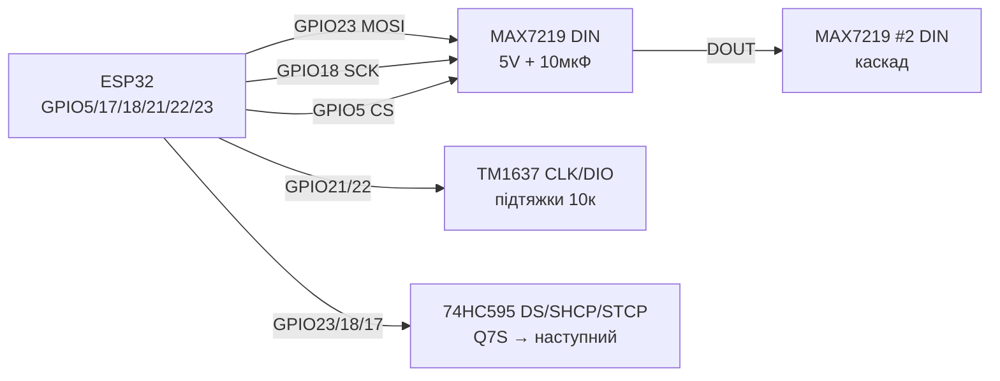

# MAX7219, TM1637, 74HC595 - LED-матриці, індикатори, зсувні регістри

## Призначення

Три класичні способи вивести цифри, текст і прості піктограми без великого дисплея: матриця MAX7219 8×8 (або готовий блок 4-в-1 = 32×8) по SPI з каскадуванням; 4-розрядний 7-сегментний індикатор на TM1637 (2 дроти CLK/DIO, вбудований драйвер); зсувний регістр 74HC595 для розширення виходів (8+ біт з 3 пінів, каскадування, керування сегментами/LED-лінійками безпосередньо). Усе керується з 3.3 В логіки ESP32.

## Характеристики

| Модуль | Інтерфейс | Живлення | Ключове правило |
| --- | --- | --- | --- |
| MAX7219 матриця 8×8 / 4-в-1 | SPI: DIN/CS/CLK, каскад DOUT→DIN | VCC 5 В (логіка DIN толерує 3.3 В) | Резистор ISET (RSET 10 кОм), яскравість регістром Intensity |
| TM1637 4-розряди | CLK + DIO (власний протокол, як I2C) | VCC 5 В (підтяжки до 5 В; ESP32 через рівні або обережно) | Яскравість 0-7 командою, двокрапка окремим бітом |
| 74HC595 | DS + SHCP + STCP (+ OE/MR), каскад Q7S→DS | VCC 3.3-5 В (логіка ESP32 ок) | OE на GND (або PWM-диммінг), MR на VCC, байпас 100 нФ |
| Струм | MAX7219 до ~300-500 мА на блок 4-в-1 | TM1637 ~80 мА | 74HC595 ±35 мА/пін, всього ~70 мА на корпус! |
| Бібліотеки Arduino | MD_Parola/MD_MAX72XX, LedControl | TM1637 (Avishorp), Grove_4DigitalDisplay | ShiftRegister74HC595, прямий shiftOut() |
| ESP-IDF | SPI master + власні команди | GPIO bit-bang | SPI half-duplex або bit-bang |

> MAX7219 живиться від 5 В, але поріг VIH ≈ 3.5 В - практика показує стабільну роботу DIN/CS/CLK від 3.3 В ESP32 на коротких дротах. Для довгих шлейфів або примхливих плат - level shifter 74AHCT125 / TXS0108E.

## Легенда пінів модуля

| Пін | Тип | Куди | Примітка |
| --- | --- | --- | --- |
| MAX7219 VCC | Живлення | 5 В | Окремий запас по струму; електроліт 10 мкФ + кераміка 100 нФ поруч |
| MAX7219 GND | Земля | GND ESP32 | Спільна земля обов'язкова |
| MAX7219 DIN | Вхід (MOSI) | GPIO23 | Дані SPI, 3.3 В ок |
| MAX7219 CS (LOAD) | Вхід | GPIO5 | Вибір кристала; кожен каскад можна окремим CS або ланцюжком |
| MAX7219 CLK | Вхід (SCK) | GPIO18 | Такти SPI до 10 МГц |
| MAX7219 DOUT | Вихід | DIN наступного модуля | Каскадування без додаткових пінів ESP32 |
| MAX7219 ISET | Аналог | Резистор 10 кОм на GND | Задає сегментний струм (~40 мА); НЕ на живлення! |
| TM1637 VCC | Живлення | 5 В | Споживання ~80 мА з індикатором |
| TM1637 GND | Земля | GND | Спільна |
| TM1637 CLK | Вхід/ open-drain | GPIO21 (або будь-який) | Підтяжка 10 кОм; протокол - старт/стоп як у I2C |
| TM1637 DIO | Двонапрямлений | GPIO22 | Дані; підтяжка 10 кОм |
| 74HC595 VCC | Живлення | 3.3 В або 5 В | При 5 В виходи 5 В - для LED через резистори ок |
| 74HC595 GND | Земля | GND | - |
| 74HC595 DS (14) | Вхід даних | GPIO23 / MOSI | Біт за бітом |
| 74HC595 SHCP (11) | Вхід тактів | GPIO18 / SCK | Зсув при фронті |
| 74HC595 STCP (12) | Вхід защіпки | GPIO5 | Latch: перенос у вихідний регістр |
| 74HC595 OE (13) | Вхід, active LOW | GND (або PWM-диммінг) | ШІМ на OE = яскравість LED |
| 74HC595 MR (10) | Вхід, active LOW | VCC (через 10 кОм) | Скидання; імпульс LOW очищає |
| 74HC595 Q0-Q7 | Виходи | LED/сегменти через резистори | Не більше 35 мА на пін! |
| 74HC595 Q7S (9) | Вихід каскаду | DS наступного 595 | Ланцюжки будь-якої довжини |

## Схема підключення

| ESP32 | Модуль | Примітка |
| --- | --- | --- |
| GPIO23 | MAX7219 DIN | MOSI; 3.3 В логіка ок |
| GPIO18 | MAX7219 CLK | SCK |
| GPIO5 | MAX7219 CS | LOAD/CS |
| 5V | MAX7219 VCC | Блок 4-в-1: запас 500 мА+ |
| GND | MAX7219 GND | Спільна земля |
| GPIO21 | TM1637 CLK | Будь-який GPIO; підтяжка 10 кОм до VCC |
| GPIO22 | TM1637 DIO | Будь-який GPIO; підтяжка 10 кОм |
| 5V | TM1637 VCC | 5 В живлення індикатора |
| GPIO23 | 74HC595 DS (14) | Дані |
| GPIO18 | 74HC595 SHCP (11) | Такти (можна спільна шина з MAX7219 CLK) |
| GPIO17 | 74HC595 STCP (12) | Окремий latch |
| GND | 74HC595 OE (13) | Або GPIO з PWM для диммінгу |
| 3V3 | 74HC595 MR (10) | Через 10 кОм до VCC |
| Q7S (9) | DS наступного 595 | Каскад |

### ASCII-схема

```text
ESP32 DevKit          MAX7219 4-в-1 + TM1637 + 74HC595
------------          --------------------------------
GPIO23 ──────────────► DIN  MAX7219 (DOUT ──► DIN наст.)
GPIO18 ──────────────► CLK  MAX7219 + SHCP 595 (спільні!)
GPIO5  ──────────────► CS   MAX7219
GPIO17 ──────────────► STCP 595 (latch) | OE ──► GND
5V ──────────────────► VCC MAX7219 + [10мкФ] + [100нФ]
GND ─────────────────► GND усіх модулів (зірка!)
GPIO21 ──[10к]──┬────► CLK TM1637 (підтяжка до 5V)
GPIO22 ──[10к]──┬────► DIO TM1637
5V ─────────────┴────► VCC TM1637
Q0-Q7 595 ──[220 Ом]─► LED / сегменти (катоди ──► GND)
```

### Mermaid



![[assets/img/max7219-tm1637-74hc595-scheme.png|500]]
*Рис. MAX7219 по SPI + TM1637 по 2 дротах + каскад 74HC595: спільна земля, конденсатори біля MAX7219, резистор ISET 10 кОм. Місце під фото - див. [[assets/README]].*

## Код ESP-IDF

```c
// MAX7219 через SPI master: ініціалізація + символ
#include "driver/spi_master.h"

#define PIN_CS 5
static spi_device_handle_t max;

static void max_write(uint8_t reg, uint8_t data) {
    uint8_t buf[2] = {reg, data};
    spi_transaction_t t = {.length = 16, .tx_buffer = buf};
    gpio_set_level(PIN_CS, 0);
    spi_device_transmit(max, &t);
    gpio_set_level(PIN_CS, 1);
}

void app_main(void) {
    spi_bus_config_t bus = {
        .mosi_io_num = 23, .sclk_io_num = 18, .miso_io_num = -1,
        .quadwp_io_num = -1, .quadhd_io_num = -1,
    };
    spi_bus_initialize(SPI2_HOST, &bus, SPI_DMA_DISABLED);
    spi_device_interface_config_t dev = {
        .clock_speed_hz = 5 * 1000 * 1000, .mode = 0,
        .spics_io_num = -1, .queue_size = 1,  // CS керуємо вручну
    };
    spi_bus_add_device(SPI2_HOST, &dev, &max);
    gpio_set_direction(PIN_CS, GPIO_MODE_OUTPUT);
    gpio_set_level(PIN_CS, 1);

    max_write(0x09, 0x00);  // decode: none (матриця)
    max_write(0x0A, 0x08);  // intensity: середня
    max_write(0x0B, 0x07);  // scan limit: всі 8 рядків
    max_write(0x0C, 0x01);  // shutdown: normal
    max_write(0x0F, 0x00);  // display test: off
    for (uint8_t r = 1; r <= 8; r++)
        max_write(r, 1 << (r - 1));  // діагональ
}

// TM1637 + 74HC595 — бітбенг GPIO (див. Arduino-приклад логіки):
// TM1637: start (CLK=H,DIO H->L), 8 біт LSB-first + ACK, stop.
// 595: 8× {DS=bit; SHCP pulse}; STCP pulse для latch.
```

## Код Arduino

```cpp
#include <SPI.h>
#include <MD_Parola.h>
#include <MD_MAX72XX.h>
#include <TM1637Display.h>

// --- MAX7219 4-в-1 ---
#define HARDWARE_TYPE MD_MAX72XX::FC16_HW
#define MAX_DEVICES 4
#define CS_PIN 5
MD_Parola parola(HARDWARE_TYPE, CS_PIN, MAX_DEVICES);

// --- TM1637 ---
#define TM_CLK 21
#define TM_DIO 22
TM1637Display tm(TM_CLK, TM_DIO);

// --- 74HC595 ---
#define PIN_DS 23    // DS
#define PIN_SH 18    // SHCP
#define PIN_ST 17    // STCP

void srWrite(uint8_t v) {
  digitalWrite(PIN_ST, LOW);
  shiftOut(PIN_DS, PIN_SH, MSBFIRST, v);
  digitalWrite(PIN_ST, HIGH);  // latch
}

void setup() {
  parola.begin();
  parola.setIntensity(5);           // 0..15 — струм і нагрів!
  parola.displayText("ESP32", PA_CENTER, 50, 500, PA_SCROLL_LEFT, PA_SCROLL_LEFT);

  tm.setBrightness(0x03);           // 0..7
  tm.showNumberDec(2026, true);     // з нулями спереду

  pinMode(PIN_DS, OUTPUT); pinMode(PIN_SH, OUTPUT); pinMode(PIN_ST, OUTPUT);
  srWrite(0b10101010);              // бігучий тест
}

void loop() {
  parola.displayAnimate();
  static uint8_t v = 1;
  static uint32_t t = 0;
  if (millis() - t > 150) {         // бігучий вогник на 595
    t = millis();
    srWrite(v);
    v = (v << 1) | (v >> 7);        // rotate
  }
}
```

## Код MicroPython

```python
from machine import Pin, SPI
import time

# --- MAX7219 по SPI ---
spi = SPI(2, baudrate=5_000_000, sck=Pin(18), mosi=Pin(23))
cs = Pin(5, Pin.OUT, value=1)

def max_write(reg, data):
    cs(0)
    spi.write(bytes([reg, data]))
    cs(1)

for reg, val in [(0x09, 0x00), (0x0A, 0x08), (0x0B, 0x07), (0x0C, 0x01), (0x0F, 0x00)]:
    max_write(reg, val)
for r in range(1, 9):
    max_write(r, 1 << (r - 1))  # діагональ

# --- TM1637 бітбенг ---
clk = Pin(21, Pin.OUT, value=1)
dio = Pin(22, Pin.OUT, value=1)

def tm_start():
    dio(1); clk(1); dio(0); clk(0)

def tm_stop():
    clk(0); dio(0); clk(1); dio(1)

def tm_write_byte(b):
    for i in range(8):
        dio((b >> i) & 1); clk(1); clk(0)
    dio(1)  # відпустити під ACK
    clk(1); clk(0)

SEG = (0x3F,0x06,0x5B,0x4F,0x66,0x6D,0x7D,0x07,0x7F,0x6F)
def tm_show(n):
    tm_start(); tm_write_byte(0x40); tm_stop()       # auto-increment
    tm_start(); tm_write_byte(0xC0)
    for d in f"{n:04d}": tm_write_byte(SEG[int(d)])
    tm_stop()
    tm_start(); tm_write_byte(0x88 | 3); tm_stop()   # on + яскравість 3

tm_show(2026)

# --- 74HC595 бітбенг ---
ds, sh, st = Pin(23, Pin.OUT), Pin(18, Pin.OUT), Pin(17, Pin.OUT)
def sr_write(v):
    st(0)
    for i in range(7, -1, -1):
        ds((v >> i) & 1); sh(1); sh(0)
    st(1)

v = 1
while True:
    sr_write(v)
    v = ((v << 1) | (v >> 7)) & 0xFF
    time.sleep_ms(150)
```

## Типові помилки

| # | Помилка | Симптом | Виправлення |
| --- | --- | --- | --- |
| 1 | Яскравість MAX7219 на максимумі при 4-в-1 | Гріється, просідає 5 В, мерехтіння | Intensity 5-8, окремий БЖ 5 В / 1 А, конденсатор 10 мкФ + 100 нФ |
| 2 | Немає/не той RSET (ISET) | Надструм сегментів, деградація LED | Резистор 10 кОм (9.53 кОм тип.) між ISET і GND |
| 3 | TM1637 підтяжки до 5 В без узгодження | ESP32 бачить 5 В на GPIO | Короткі дроти зазвичай ок (open-drain); для надійності - MOSFET-shifter або ділити |
| 4 | Каскад MAX7219 переплутаний DOUT→DIN | Далі першого модуля сміття/темрява | DOUT першого → DIN другого; кількість devices у коді = фізичній |
| 5 | 74HC595 без байпасу 100 нФ | Глітчі, самовільні перемикання | 100 нФ прямо на VCC-GND корпусу |
| 6 | 74HC595 живить реле/великі LED безпосередньо | Перегрів, просідання, смерть корпусу | 595 → транзистор/ULN2003/TPIC6B595; ≤35 мА/пін, ≤70 мА сумарно |
| 7 | Спільні SHCP/STCP бездумно | MAX7219 і 595 заважають одне одному | CS/latch роздільні; такти спільні лише якщо фази не конфліктують, інакше окремі GPIO |
| 8 | Довгі шлейфи SPI 3.3 В до 5 В модуля | Випадкові пікселі | Коротші дроти, 33-100 Ом послідовно на SCK/MOSI, або 74AHCT125 |

## Офіційні джерела

- MAX7219 Datasheet (Analog/Maxim) - `перевірити вручну` (сайт analog.com блокує автоматичні запити).
- [Гайд MAX7219-матриця 8×8 з кодом (RNT)](https://randomnerdtutorials.com/guide-for-8x8-dot-matrix-max7219-with-arduino-pong-game/) - матриця, приклад гри.
- [Розбір TM1637 з кодом (LME)](https://lastminuteengineers.com/tm1637-arduino-tutorial/) - індикатор, годинник, термометр.
- [Розбір 74HC595 з кодом (LME)](https://lastminuteengineers.com/74hc595-shift-register-arduino-tutorial/) - зсувний регістр, каскадування.

- TPIC6B595 Datasheet (TI): <https://www.ti.com/product/TPIC6B595> - зсувний регістр з DMOS-ключами.

## Див. також

- [[03-GPIO/04-Pererivannya-PWM]]
- [[07-Timeri-Son/01-Timeri-MCPWM-PCNT-RMT]]
- [[04-Shini/02-SPI|SPI]]
- [[04-Shini/03-I2C|I2C]]
- [[02-Zhivlennya/01-Lancjugi-zhivlennya]]
- [[Home]]
- [[04-L298N-TB6612-A4988-Buzzer]]
