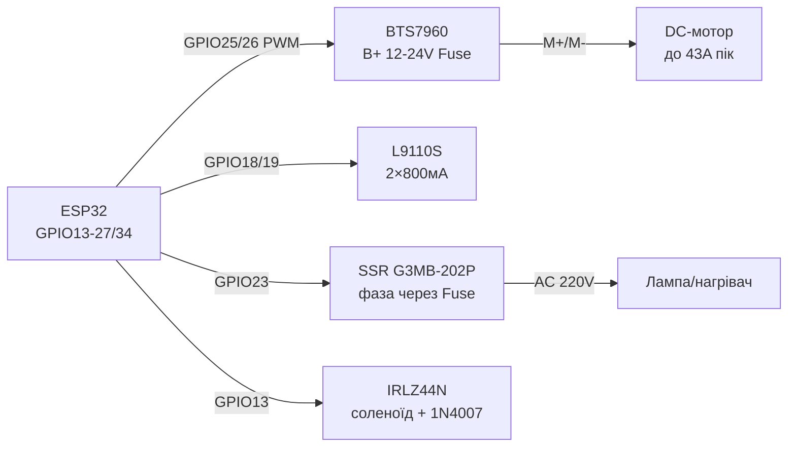

# BTS7960, L9110S, SSR, соленоїд - силові ключі та безпека

## Призначення

Важка силова комутація з ESP32: BTS7960 (43 А H-міст) для великих DC-моторів, лебідок, актуаторів; L9110S - компактний 2-канальний міст до 800 мА для малих моторів і колісних платформ; твердотільне реле SSR G3MB-202P для безшумної комутації AC 220 В (нагрівачі, лампи); соленоїди, електроклапани, помпи через MOSFET + flyback-діод. Окремий акцент - безпека роботи з мережею 220 В.

## Характеристики

| Модуль | Струм / напруга | Керування | Ключове правило |
| --- | --- | --- | --- |
| BTS7960 (IBT-2) | До 43 А пік, VM 6-27 В (практ. 12/24 В) | RPWM + LPWM (або R_EN/L_EN + PWM) | R_IS/L_IS - контроль струму; великий радіатор + запобіжник! |
| L9110S | 2 канали × 800 мА, VCC 2.5-12 В | IA/IB на канал (PWM на одному) | Без радіатора - лише малі мотори; shoot-through при обох HIGH |
| SSR G3MB-202P | AC 2 А / 240 В, zero-cross | DC 3-32 В (3.3 В ESP32 ок) | Тільки AC-навантаження! Радіатор від 1 А; варистор на вихід |
| Соленоїд / клапан / помпа | 12/24 В, 0.3-2 А | MOSFET low-side + flyback 1N4007 | Діод - ОБОВ'ЯЗКОВО, інакше пробій MOSFET |
| MOSFET для соленоїда | IRLZ44N logic-level | Gate 3.3 В через 100 Ом + pull-down 10 к | Шотткі/1N4007 паралельно котушці (катод до +) |
| Захист мережі | Запобіжник + автомат + корпус | - | Ніяких відкритих 220 В на макетці! |

> ⚡ БЕЗПЕКА: 220 В вбиває. SSR і реле комутують фазу через запобіжник, усі AC-з'єднання - у закритому корпусі з кабельними вводами, земля металевих частин - на PE. ESP32 і низьковольтна частина - гальванічно відділені (опторозв'язка SSR/модуля реле це дає, але корпус і запобіжник все одно обов'язкові).

## Легенда пінів модуля

| Пін | Тип | Куди | Примітка |
| --- | --- | --- | --- |
| BTS7960 VCC | Логіка 5 В | 5 В | Живить логіку моста |
| BTS7960 GND | Земля | GND ESP32 | Спільна з логікою |
| BTS7960 B+ / B− (VM/GND) | Силове 6-27 В | АКБ/БЖ + запобіжник | Товсті дроти; електроліт 470+ мкФ |
| BTS7960 M+ / M− | Вихід на мотор | DC-мотор | Міняти полярність = напрям |
| BTS7960 RPWM / LPWM | Входи ШІМ | GPIO (LEDC 20 кГц) | Швидкість за шпаруватістю; напрям - який канал активний |
| BTS7960 R_EN / L_EN | Дозвіл півмостів | GPIO або VCC (джампер) | Обидва HIGH = міст активний; LOW = вибіг |
| BTS7960 R_IS / L_IS | Аналог струму | ADC (через дільник!) | ~2500:1; напруга пропорційна струму |
| L9110S VCC / GND | Живлення 2.5-12 В | БЖ мотора | Спільний GND з ESP32 |
| L9110S IA / IB (канал A) | Входи | GPIO ×2 | HIGH/LOW = напрям; PWM на одному = швидкість |
| L9110S OA / OB | Вихід | Мотор A | До 800 мА |
| SSR 3+ (DC+) / 4− (DC−) | Керування | GPIO / GND | 3.3 В достатньо; світлодіод-індикатор всередині |
| SSR 1~ / 2~ (AC) | Силове AC | Фаза через запобіжник → навантаження | Zero-cross: вмикається в нулі - без іскри |
| Соленоїд + | Силове | 12/24 В БЖ | Через запобіжник по номіналу |
| Соленоїд − | Через MOSFET | Drain IRLZ44N | Діод 1N4007 катодом до + паралельно котушці |
| MOSFET Gate | Вхід | GPIO через 100 Ом + 10 кОм до GND | Pull-down проти вмикання при boot |

## Схема підключення

| ESP32 | Модуль | Примітка |
| --- | --- | --- |
| GPIO25 | BTS7960 RPWM | LEDC 20 кГц; вперед |
| GPIO26 | BTS7960 LPWM | LEDC 20 кГц; назад |
| GPIO27 | BTS7960 R_EN | HIGH = дозвіл; можна джампер на 5 В |
| GPIO14 | BTS7960 L_EN | HIGH = дозвіл |
| GPIO34 | BTS7960 R_IS (через дільник 2:1) | Аналог струму; не перевищувати 3.3 В! |
| 12/24 В + запобіжник | BTS7960 B+ | АКБ/БЖ, товсті дроти |
| GPIO18/19 | L9110S IA/IB (мотор A) | DIR + PWM |
| GPIO21/22 | L9110S OA-пара (мотор B) | Опційно другий мотор |
| GPIO23 | SSR DC+ (3+) | HIGH = AC ON; DC− → GND |
| Фаза→запобіжник→SSR 1~ | SSR AC | SSR 2~ → лампа/нагрівач → N |
| GPIO13 | MOSFET Gate (соленоїд) | 100 Ом + pull-down 10 кОм |
| 12 В | Соленоїд + | Діод 1N4007 паралельно котушці |

### ASCII-схема

```text
ESP32 DevKit              BTS7960 + L9110S + SSR + соленоїд
------------              ----------------------------------
GPIO25 ──────────────────► RPWM BTS7960 (LEDC 20кГц, вперед)
GPIO26 ──────────────────► LPWM BTS7960 (назад)
GPIO27/14 ───────────────► R_EN/L_EN (HIGH=дозвіл)
GPIO34 ◄──[дільник]────── R_IS (струм мотора → ADC)
B+ ◄──[запобіжник]── 12/24V АКБ; M+/M- ──► DC-мотор
GPIO18/19 ───────────────► IA/IB L9110S ──► OA/OB мотор A
GPIO23 ──────────────────► SSR 3+ (DC- ──► GND)
ФАЗА ──[запобіжник]──► SSR 1~ ... 2~ ──► лампа ──► N
GPIO13 ──[100 Ом]──┬────► Gate IRLZ44N (+[10к] до GND)
                   └──── Source ──► GND; Drain ──► соленоїд-
12V ──[запобіжник]──────► соленоїд+ ; [1N4007] катодом до +
```

### Mermaid



![[assets/img/bts7960-ssr-solenoid-scheme.png|500]]
*Рис. BTS7960 з запобіжником у силовому колі, L9110S для малих моторів, SSR з zero-cross на фазі, соленоїд через MOSFET з flyback-діодом. Місце під фото - див. [[assets/README]].*

## Код ESP-IDF

```c
// BTS7960: LEDC 20 кГц на RPWM/LPWM; L9110S і соленоїд — GPIO; SSR — GPIO
#include "driver/ledc.h"
#include "driver/gpio.h"
#include "driver/adc.h"

#define RPWM 25
#define LPWM 26

static void pwm_init(gpio_num_t pin, ledc_channel_t ch) {
    ledc_timer_config_t t = {.speed_mode = LEDC_LOW_SPEED_MODE,
        .timer_num = LEDC_TIMER_0, .duty_resolution = LEDC_TIMER_10_BIT,
        .freq_hz = 20000, .clk_cfg = LEDC_AUTO_CLK};
    ledc_timer_config(&t);
    ledc_channel_config_t c = {.gpio_num = pin,
        .speed_mode = LEDC_LOW_SPEED_MODE, .channel = ch,
        .timer_sel = LEDC_TIMER_0, .duty = 0, .hpoint = 0};
    ledc_channel_config(&c);
}

static void motor(int speed) {  // -1023..1023
    if (speed >= 0) {
        ledc_set_duty(LEDC_LOW_SPEED_MODE, LEDC_CHANNEL_0, speed);
        ledc_set_duty(LEDC_LOW_SPEED_MODE, LEDC_CHANNEL_1, 0);
    } else {
        ledc_set_duty(LEDC_LOW_SPEED_MODE, LEDC_CHANNEL_0, 0);
        ledc_set_duty(LEDC_LOW_SPEED_MODE, LEDC_CHANNEL_1, -speed);
    }
    ledc_update_duty(LEDC_LOW_SPEED_MODE, LEDC_CHANNEL_0);
    ledc_update_duty(LEDC_LOW_SPEED_MODE, LEDC_CHANNEL_1);
}

void app_main(void) {
    pwm_init(RPWM, LEDC_CHANNEL_0);
    pwm_init(LPWM, LEDC_CHANNEL_1);
    gpio_set_direction(27, GPIO_MODE_OUTPUT);  // R_EN
    gpio_set_direction(14, GPIO_MODE_OUTPUT);  // L_EN
    gpio_set_level(27, 1); gpio_set_level(14, 1);
    gpio_set_direction(23, GPIO_MODE_OUTPUT);  // SSR
    gpio_set_direction(13, GPIO_MODE_OUTPUT);  // соленоїд
    motor(512);  // пів швидкості вперед
}
```

## Код Arduino

```cpp
// BTS7960 + L9110S + SSR + соленоїд
#define RPWM 25
#define LPWM 26
#define R_EN 27
#define L_EN 14
#define L_IA 18
#define L_IB 19
#define SSR_PIN 23
#define SOL_PIN 13

void bts(int speed) {  // -255..255
  // analogWrite на ESP32 = LEDC-обгортка сумісності (частота/розрядність за ядром!); точно - через ledcAttach
  if (speed >= 0) { analogWrite(RPWM, speed); analogWrite(LPWM, 0); }
  else { analogWrite(RPWM, 0); analogWrite(LPWM, -speed); }
}

void setup() {
  pinMode(RPWM, OUTPUT); pinMode(LPWM, OUTPUT);
  pinMode(R_EN, OUTPUT); pinMode(L_EN, OUTPUT);
  digitalWrite(R_EN, HIGH); digitalWrite(L_EN, HIGH);
  // ESP32 Arduino: налаштувати LEDC для 20 кГц
  analogWriteFrequency(20000);
  analogWriteResolution(10);  // узгоджено з кодом? тримати 8 біт або перерахувати

  pinMode(L_IA, OUTPUT); pinMode(L_IB, OUTPUT);
  pinMode(SSR_PIN, OUTPUT); digitalWrite(SSR_PIN, LOW);
  pinMode(SOL_PIN, OUTPUT); digitalWrite(SOL_PIN, LOW);
}

void loop() {
  bts(500);                       // великий мотор вперед
  digitalWrite(L_IA, HIGH);       // малий мотор A
  analogWrite(L_IB, 128);         // (протилежний пін у PWM — гальмо/реверс за схемою)
  digitalWrite(SSR_PIN, HIGH);    // AC-навантаження ON
  delay(2000);
  digitalWrite(SSR_PIN, LOW);
  digitalWrite(SOL_PIN, HIGH);    // соленоїд ON (коротко!)
  delay(500);
  digitalWrite(SOL_PIN, LOW);
  delay(2000);
}
```

## Код MicroPython

```python
from machine import Pin, PWM
import time

rpwm = PWM(Pin(25), freq=20000, duty_u16=0)
lpwm = PWM(Pin(26), freq=20000, duty_u16=0)
r_en = Pin(27, Pin.OUT, value=1)
l_en = Pin(14, Pin.OUT, value=1)

def bts(speed):  # -1.0..1.0
    if speed >= 0:
        rpwm.duty_u16(int(speed * 65535))
        lpwm.duty_u16(0)
    else:
        rpwm.duty_u16(0)
        lpwm.duty_u16(int(-speed * 65535))

# L9110S малий мотор
ia, ib = Pin(18, Pin.OUT), Pin(19, Pin.OUT)
ssr = Pin(23, Pin.OUT, value=0)
sol = Pin(13, Pin.OUT, value=0)

bts(0.5)
ia.value(1); ib.value(0)
ssr.value(1)   # AC ON — обережно, 220 В!
time.sleep(2)
ssr.value(0)
sol.value(1)   # соленоїд коротким імпульсом
time.sleep_ms(500)
sol.value(0)
bts(0)
```

### AQY212S - PhotoMOS-реле для малих навантажень

| Параметр | AQY212S (Panasonic) |
| --- | --- |
| Комутація | До 1.1 А / 60 В AC/DC, без дуги і клацань |
| Керування | LED 3-5 мА безпосередньо з GPIO (резистор не забути!) |
| Швидкість | Мілісекунди (повільніше за MOSFET, швидше за геркон) |
| Коли брати | Сигнальні ланцюги, датчики, сухі контакти ПЛК; НЕ для пускачів/ТЕНів |

## Типові помилки

| # | Помилка | Симптом | Виправлення |
| --- | --- | --- | --- |
| 1 | BTS7960 без запобіжника в B+ | Пожежа при заклинюванні/КЗ | Автомобільний запобіжник по номіналу мотора + товсті дроти |
| 2 | R_IS/L_IS безпосередньо в ADC | 5 В на GPIO → смерть піна | Дільник 2:1 (макс ~3 В), усереднення, поріг відсікання в коді |
| 3 | Обидва RPWM і LPWM HIGH (L9110S: IA=IB=HIGH) | Наскрізний струм, нагрів | Пауза dead-time при реверсі; ніколи обидва HIGH одночасно |
| 4 | SSR на DC-навантаження | Не вимикається (тиристор тримає) | G3MB-202P - ТІЛЬКИ AC; для DC - MOSFET/реле |
| 5 | SSR без радіатора на 1.5+ А | Перегрів, деградація, залипання | Радіатор + термопаста від 1 А; запас 2× по струму |
| 6 | Соленоїд без flyback-діода | Пробій MOSFET при вимиканні | 1N4007 (катод до +) прямо на клемах котушки |
| 7 | Довге утримання соленоїда | Перегрів котушки | Короткі імпульси; для утримання - знижувати струм (hold-PWM) |
| 8 | Відкритий монтаж 220 В на макетці | Ризик ураження/пожежі | Закритий корпус, кабельні вводи, запобіжник, маркування |
| 9 | Спільний тонкий GND силового і логіки | Скидання ESP32 при пуску мотора | Зірка GND товстими дротами; електроліт 470+ мкФ на B+ |
| 10 | AQY212S плутають зі звичайним реле | Немає «клацання», малий струм навантаження | PhotoMOS: до 1.1 А / 60 В, керування 3-5 мА; для пускачів - звичайний контактор! |

## Офіційні джерела

- [BTS7960 + Arduino з кодом (DeepBlue)](https://deepbluembedded.com/arduino-bts7960-dc-motor-driver/) - H-міст 43 А, ШІМ, приклад.
- BTS7960 Datasheet (Infineon) - `перевірити вручну`.
- AQY212S Datasheet (Panasonic, пошук PDF): [AQY212S search](https://www.alldatasheet.com/view.jsp?Searchword=AQY212S) - PhotoMOS 60 В/1.1 А.
- L9110S / SSR / соленоїд - `перевірити вручну`.
- [Керування AC-навантаженням з кодом (RNT)](https://randomnerdtutorials.com/esp32-relay-module-ac-web-server/) - реле/SSR, безпека.

## Див. також

- [[03-GPIO/04-Pererivannya-PWM]]
- [[07-Timeri-Son/01-Timeri-MCPWM-PCNT-RMT]]
- [[02-Zhivlennya/01-Lancjugi-zhivlennya]]
- [[04-Shini/01-UART|UART]]
- [[Home]]
- [[03-NeoPixel-Servo-Rele-MOSFET]]
- [[06-PCA9685-MG996R-28BYJ48-TMC2209]]
