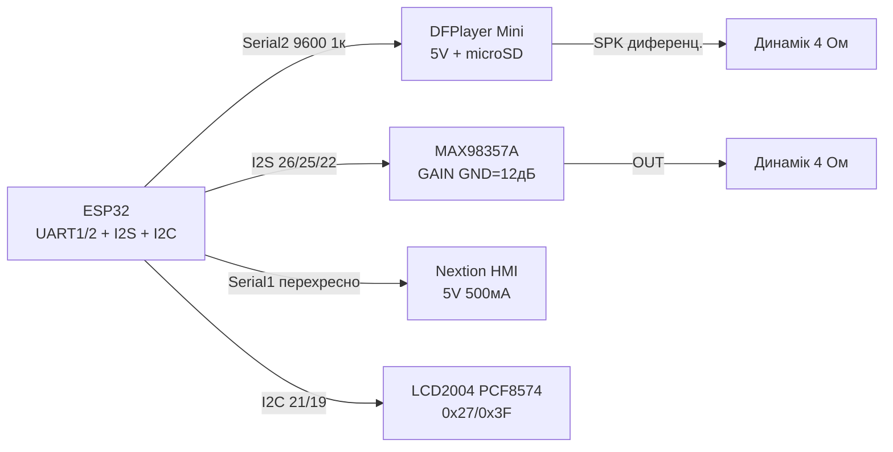

# DFPlayer Mini, MAX98357A, Nextion, LCD2004 - звук і HMI

## Призначення

Звук і людино-машинний інтерфейс для ESP32: DFPlayer Mini - автономний MP3-плеєр з microSD (UART-команди play/volume/folder); MAX98357A - I2S ЦАП+підсилювач 3 Вт для якісного звуку без кодування в DF; Nextion - сенсорний HMI-дисплей зі своєю логікою (ESP32 лише шле UART-команди); LCD2004 через PCF8574 - класичні 4×20 символів по I2C двома дротами. Покриває все: від пищалки-озвучки до панелі керування.

## Характеристики

| Модуль | Інтерфейс | Живлення | Ключове правило |
| --- | --- | --- | --- |
| DFPlayer Mini | UART 9600 (RX/TX) + BUSY + ADKEY | VCC 5 В (3.3 В нестабільно!), SPK± до 3 Вт | RX через 1 кОм (5 В логіка!); microSD FAT32, папки 01/02, файли 001.mp3 |
| MAX98357A I2S | BCLK + LRCK(WS) + DIN | VIN 5 В (є 3.3 В, але 5 В гучніше) | GAIN: оголений=9 дБ, GND=12 дБ, VIN=15 дБ; SD=HIGH |
| Nextion (2.4-7") | UART 9600/115200, TX↔RX перехресно | 5 В, 250-500 мА (підсвітка!) | Прошивка через Nextion Editor + SD; команди з 0xFF 0xFF 0xFF |
| LCD2004 + PCF8574 | I2C, адреса 0x27 або 0x3F | 5 В | Контраст trimmer на backpack; підсвітка джампером |
| Формат SD (DF) | microSD до 32 ГБ, FAT16/32 | MP3/WAV | Імена 0001.mp3 в /MP3 або /01/001.mp3 |
| Бібліотеки | DFRobotDFPlayerMini | ESP32-audioI2S, AudioTools | EasyNextionLibrary, LiquidCrystal_I2C |

> DFPlayer RX - 5 В логіка: ESP32 TX (3.3 В) зазвичай читається, а от DFPlayer TX (5 В) → ESP32 RX треба через дільник 2 кОм/1 кОм або хоча б 1 кОм послідовно. Найнадійніше - TXS0108E, але практика з 1 кОм працює на коротких дротах.

## Легенда пінів модуля

| Пін | Тип | Куди | Примітка |
| --- | --- | --- | --- |
| DFPlayer VCC | Живлення | 5 В | Пік при старті треку; 100 мкФ поруч |
| DFPlayer GND | Земля | GND | Спільна |
| DFPlayer RX | Вхід UART 5 В | ESP32 TX через 1 кОм | 9600 бод; кадри 0x7E…0xEF |
| DFPlayer TX | Вихід UART 5 В | ESP32 RX через дільник | Відповіді/статуси |
| DFPlayer SPK_1 / SPK_2 | Вихід динамік | Динамік 4-8 Ом / 3 Вт | Не на землю! Диференціальний вихід |
| DFPlayer BUSY | Вихід, LOW=грає | GPIO (вхід) | Кінець треку = фронт HIGH |
| DFPlayer IO_1/IO_2 (ADKEY) | Вхід кнопок | Кнопки на GND через резистори | Апаратне керування без UART |
| MAX98357A VIN / GND | Живлення | 5 В / GND | 3 Вт в 4 Ом; при хрипах - окремий БЖ |
| MAX98357A BCLK | Вхід | GPIO26 | Бітовий клок I2S |
| MAX98357A LRCK (WS) | Вхід | GPIO25 | Вибір каналу |
| MAX98357A DIN | Вхід | GPIO22 | Дані |
| MAX98357A GAIN | Конфіг | GND/VIN/NC | 12/15/9 дБ відповідно |
| MAX98357A SD | Вхід | 3V3 (HIGH) | Shutdown; LOW = мовчання |
| Nextion 5V / GND | Живлення | 5 В / GND | 500 мА запас (великі діагоналі!) |
| Nextion TX | Вихід 5 В | ESP32 RX (Serial2) | Через дільник/1 кОм |
| Nextion RX | Вхід 5 В | ESP32 TX | 3.3 В зазвичай читається |
| LCD backpack SDA/SCL | I2C | GPIO21/22 | Адреса сканером: 0x27 або 0x3F |
| LCD backpack VCC/GND | Живлення | 5 В / GND | Контраст - синій trimmer |

## Схема підключення

| ESP32 | Модуль | Примітка |
| --- | --- | --- |
| GPIO17 (TX2) через 1 кОм | DFPlayer RX | Обмеження 5 В логіки |
| GPIO16 (RX2) | DFPlayer TX (через дільник 2к/1к) | Serial2 9600 |
| GPIO4 | DFPlayer BUSY | Вхід; LOW = відтворення |
| Динамік 4 Ом | DFPlayer SPK_1/SPK_2 | Без спільної землі! |
| GPIO26 | MAX98357A BCLK | I2S |
| GPIO25 | MAX98357A LRCK | I2S |
| GPIO22 | MAX98357A DIN | I2S (увага: конфлікт з LCD SCL - рознести!) |
| 3V3 | MAX98357A SD | HIGH = працює |
| Динамік | MAX98357A OUT± | 4 Ом / 3 Вт |
| GPIO16/17 або окремий UART | Nextion TX/RX перехресно | Не ділити один UART з DFPlayer! (див. ASCII) |
| GPIO21 | LCD SDA | I2C 100 кГц достатньо |
| GPIO22→ перенести | LCD SCL | Якщо I2S зайняв 22 - LCD SCL на GPIO19 + свій I2C-скан |

### ASCII-схема

```text
ESP32 DevKit              DFPlayer + MAX98357 + Nextion + LCD2004
------------              --------------------------------------
GPIO17(TX2)──[1к]───────►─► RX DFPlayer (5V логіка! VCC=5V)
GPIO16(RX2)◄──[дільник]─── TX DFPlayer ; BUSY ──► GPIO4
SPK_1/SPK_2 ─────────────► динамік 4 Ом (диф. вихід, не на GND!)
GPIO26 ──────────────────► BCLK MAX98357A (VIN=5V, SD=3V3)
GPIO25 ──────────────────► LRCK MAX98357A (GAIN ──► GND=12дБ)
GPIO22 ──────────────────► DIN  MAX98357A ──► OUT± динамік
GPIO33(TX1) ─────────────► RX Nextion (VCC=5V, 500мА запас!)
GPIO32(RX1) ◄───────────── TX Nextion (перехресно, Serial1)
GPIO21 ──────────────────► SDA LCD2004-backpack (0x27/0x3F)
GPIO19 ──────────────────► SCL LCD2004 (окремо від I2S!)
GND ─────────────────────► GND усіх модулів (зірка)
```

### Mermaid



![[assets/img/dfplayer-max98357-nextion-lcd-scheme.png|500]]
*Рис. DFPlayer на Serial2 через 1 кОм, MAX98357A по I2S, Nextion на окремому UART перехресно, LCD2004 по I2C з адресою 0x27/0x3F. Місце під фото - див. [[assets/README]].*

## Код ESP-IDF

```c
// DFPlayer: UART-кадр play; MAX98357: I2S; LCD2004: I2C PCF8574
#include "driver/uart.h"
#include "driver/i2s.h"
#include "driver/i2c.h"

// --- DFPlayer кадр: 7E FF 06 CMD FB P1 P2 CHK_H CHK_L EF ---
static void df_cmd(uint8_t cmd, uint8_t p1, uint8_t p2) {
    uint8_t f[10] = {0x7E, 0xFF, 0x06, cmd, 0x00, p1, p2, 0, 0, 0xEF};
    uint16_t sum = 0;
    for (int i = 1; i <= 5; i++) sum += f[i];
    sum = 0xFFFF - sum + 1;
    f[6] = sum >> 8; f[7] = sum & 0xFF;
    uart_write_bytes(UART_NUM_2, (char *)f, 10);
}

void app_main(void) {
    uart_config_t u = {.baud_rate = 9600, .data_bits = UART_DATA_8_BITS,
        .parity = UART_PARITY_DISABLE, .stop_bits = UART_STOP_BITS_1,
        .flow_ctrl = UART_HW_FLOWCTRL_DISABLE};
    uart_param_config(UART_NUM_2, &u);
    uart_set_pin(UART_NUM_2, 17, 16, -1, -1);
    uart_driver_install(UART_NUM_2, 256, 256, 0, NULL, 0);

    df_cmd(0x06, 0x00, 20);  // гучність 20/30
    df_cmd(0x12, 0x00, 0x01);  // play /MP3/0001.mp3 або перший трек
    // I2S для MAX98357A:
    i2s_config_t ic = {.mode = I2S_MODE_MASTER | I2S_MODE_TX,
        .sample_rate = 44100, .bits_per_sample = I2S_BITS_PER_SAMPLE_16BIT,
        .channel_format = I2S_CHANNEL_FMT_RIGHT_LEFT,
        .communication_format = I2S_COMM_FORMAT_STAND_I2S,
        .dma_buf_count = 4, .dma_buf_len = 512, .use_apll = false};
    i2s_pin_config_t pc = {.bck_io_num = 26, .ws_io_num = 25,
        .data_out_num = 22, .data_in_num = -1};
    i2s_driver_install(I2S_NUM_0, &ic, 0, NULL);
    i2s_set_pin(I2S_NUM_0, &pc);
}
```

## Код Arduino

```cpp
#include <DFRobotDFPlayerMini.h>
#include <LiquidCrystal_I2C.h>
#include <EasyNextionLibrary.h>

// --- DFPlayer на Serial2 ---
DFRobotDFPlayerMini mp3;
#define BUSY_PIN 4

// --- LCD2004 (адресу перевірити сканером!) ---
LiquidCrystal_I2C lcd(0x27, 20, 4);

// --- Nextion на Serial1 ---
EasyNex nex(Serial1);

void setup() {
  Serial.begin(115200);
  Serial2.begin(9600, SERIAL_8N1, 16, 17);  // RX, TX до DFPlayer
  pinMode(BUSY_PIN, INPUT);
  if (mp3.begin(Serial2)) {
    mp3.volume(20);
    mp3.play(1);  // перший трек
  }

  Serial1.begin(9600, SERIAL_8N1, 32, 33);  // RX, TX до Nextion
  nex.begin(9600);

  lcd.init();
  lcd.backlight();
  lcd.setCursor(0, 0);
  lcd.print("ESP32 Audio+HMI");
  lcd.setCursor(0, 1);
  lcd.print("Track: 1  Vol: 20");
}

void loop() {
  nex.NextionLoop();
  bool playing = (digitalRead(BUSY_PIN) == LOW);
  lcd.setCursor(0, 2);
  lcd.print(playing ? "Playing...  " : "Stopped    ");
  // Кнопка b0 на Nextion -> наступний трек:
  // у Nextion Editor подія Touch Press: print "next" + 0xFF*3,
  // тут: if (nex.readStr("...")) mp3.next();
  delay(200);
}
```

## Код MicroPython

```python
from machine import Pin, UART, I2C
import time

# --- DFPlayer кадр ---
u = UART(2, baudrate=9600, tx=17, rx=16)

def df(cmd, p1=0, p2=0):
    f = bytearray([0x7E, 0xFF, 0x06, cmd, 0x00, p1, p2, 0, 0, 0xEF])
    s = sum(f[1:6]) & 0xFFFF
    s = (0xFFFF - s + 1) & 0xFFFF
    f[6], f[7] = s >> 8, s & 0xFF
    u.write(f)

busy = Pin(4, Pin.IN)
df(0x06, 0, 20)   # гучність
time.sleep_ms(100)
df(0x12, 0, 1)    # play трек 1

# --- Nextion на UART1 ---
n = UART(1, baudrate=9600, tx=33, rx=32)
def nex_set(comp, val):
    n.write(f'{comp}.val={val}'.encode() + b'\xff\xff\xff')
def nex_text(comp, txt):
    n.write(f'{comp}.txt="{txt}"'.encode() + b'\xff\xff\xff')

nex_text("t0", "Hello ESP32")
nex_set("j0", 50)

# --- LCD2004 через PCF8574 (мінімальний драйвер) ---
i2c = I2C(0, sda=Pin(21), scl=Pin(19), freq=100_000)
addr = i2c.scan()[0]  # 0x27 або 0x3F
print("LCD at", hex(addr))
# Далі — повний nibble-драйвер HD44780 через PCF8574
# (EN=2, RW=1, RS=0, D4-D7=4-7, BL=3). Для продакшену взяти
# готовий модуль lcd2004_pcf8574 з micropython-lib.
print("BUSY(LOW=play):", busy.value())
```

## Типові помилки

| # | Помилка | Симптом | Виправлення |
| --- | --- | --- | --- |
| 1 | DFPlayer від 3.3 В | Клацає, ребутиться, не читає SD | Тільки 5 В + 100 мкФ; пік струму при старті треку |
| 2 | RX DFPlayer безпосередньо від ESP32 без 1 кОм | Глітчі, зависання UART | 1 кОм послідовно; TX модуля → ESP32 через дільник |
| 3 | Неправильні імена файлів на SD | Мовчить, BUSY не падає | FAT32, /MP3/0001.mp3 або /01/001.mp3, до 32 ГБ |
| 4 | SPK DFPlayer на землю/спільний динамік з MAX98357 | КЗ виходу, смерть підсилювача | Диференціальний вихід - тільки на свій динамік |
| 5 | GAIN MAX98357A на VIN при 4 Ом | Хрипи, кліппінг, перегрів | GAIN на GND (12 дБ) або NC (9 дБ); окремий БЖ при хрипах |
| 6 | Nextion і DFPlayer на одному UART | Конфлікт кадрів, сміття | Окремі UART: DFPlayer Serial2, Nextion Serial1 |
| 7 | Nextion-команди без 0xFF 0xFF 0xFF | Екран ігнорує | Кожна команда закінчується трьома 0xFF |
| 8 | Не та I2C-адреса LCD (0x27 vs 0x3F) | Підсвітка є, тексту немає | I2C-сканер; + крутити trimmer контрасту |
| 9 | I2S DIN і LCD SCL на одному GPIO22 | Один з двох не працює | Рознести: I2S на 22, LCD на окрему пару (21/19) |

## Офіційні джерела

- [DFPlayer Mini - сторінка товару (DFRobot)](https://www.dfrobot.com/product-1121.html) - опис, характеристики, живе фото.
- [DFPlayer Mini wiki + скетчі (DFRobot)](https://wiki.dfrobot.com/dfr0299/) - команди, схеми, приклади коду.
- [MAX98357A - живе фото (Adafruit)](https://www.adafruit.com/product/3006) - сторінка товару з фото.
- [Гайд MAX98357 I2S з кодом (Adafruit Learn)](https://learn.adafruit.com/adafruit-max98357-i2s-class-d-mono-amp) - I2S-звук, приклади.
- [Офіційний сайт Nextion (документація, редактор)](https://nextion.tech/editor_guide/) - інструкції, HMI-редактор.
- [ESP-IDF I2S - офіційна документація (Espressif)](https://docs.espressif.com/projects/esp-idf/en/latest/esp32/api-reference/peripherals/i2s.html) - API шини I2S.

## Див. також

- [[04-Shini/01-UART|UART]]
- [[04-Shini/03-I2C|I2C]]
- [[04-Shini/02-SPI|SPI]]
- [[03-GPIO/04-Pererivannya-PWM]]
- [[02-Zhivlennya/01-Lancjugi-zhivlennya]]
- [[Home]]
- [[07-Timeri-Son/01-Timeri-MCPWM-PCNT-RMT]]
