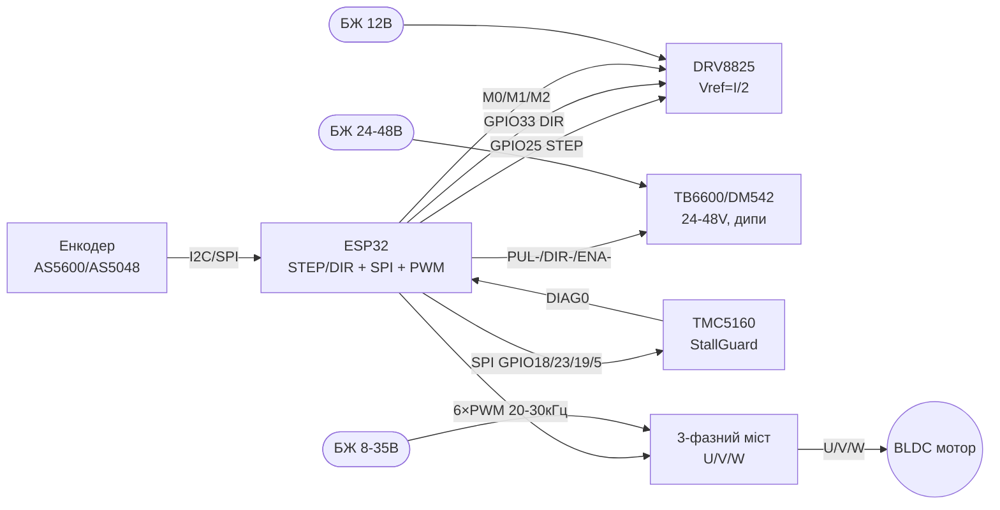

# Силові драйвери 2 - DRV8825, TB6600/DM542, TMC5160, SimpleFOC/BLDC/ESC

## Призначення

Другий рівень силових драйверів для ESP32: компактний драйвер крокових DRV8825 (мікрокрок до 1/32, Vref),
промислові драйвери TB6600/DM542 з дип-перемикачами струму під 24-48 В,
розумний драйвер TMC5160 з конфігурацією по SPI і StallGuard,
а також огляд BLDC/FOC/ESC: 3-фазний міст + енкодер і чому L298N для BLDC не підходить.
База: L298N/TB6612/A4988 - див. [[11-Vivid/04-L298N-TB6612-A4988-Buzzer]],
серво/крокові 28BYJ48/TMC2209 - [[11-Vivid/06-PCA9685-MG996R-28BYJ48-TMC2209]],
потужні ключі BTS7960 - [[11-Vivid/07-BTS7960-L9110S-SSR-Solenoid]].

## Характеристики

| Драйвер | Мотор | Напруга / струм | Керування | Особливість |
| --- | --- | --- | --- | --- |
| DRV8825 (Pololu-кар'єр) | Біполярний кроковий (NEMA14/17) | 8.2-45 В, до 1.5 А без радіатора (2.2 А з охолодженням) | STEP/DIR + M0/M1/M2 | Мікрокрок до 1/32, Vref = I_lim/2, drop-in замість A4988 |
| TB6600 | Кроковий NEMA17/23/34 | 9-42 В, 0.5-4 А (дип SW1-SW3) | STEP/DIR + ENA, дип SW4-SW6 мікрокрок | Опторозв'язка входів, великий радіатор |
| DM542 | Кроковий NEMA23/34 | 20-50 В (типово 24-48 В!), до 4.2 А | STEP/DIR + ENA, дипи струму/мікрокроку | Промисловий корпус, тихіший за TB6600-клони |
| TMC5160 | Кроковий + BLDC-підтримка | 8-60 В, до 3 А RMS (зовнішні MOSFET опційно) | SPI-конфігурація + STEP/DIR | StallGuard2, StealthChop2, DcStep, CoolStep |
| SimpleFOC + 3-фазний міст | BLDC/гімбал/кроковий у FOC | 8-35 В (SimpleFOCShield на DRV8313, до 2 А/фазу) | 3×PWM (6PWM) + енкодер | Векторне керування, плавність і момент на малих обертах |
| BLDC ESC (SimonK/BLHeli) | Безколекторний зірка/трикутник | 2-6S LiPo, десятки ампер | PPM 1-2 мс (серво-сигнал) | Без сенсорів, для пропелерів; позиціонування немає |

> Чому не L298N для крокових/BLDC: біполярний L298N - це кам'яний вік (падіння ~2-4 В, гріється,
> немає мікрокроку і обмеження струму), а для BLDC взагалі потрібен 3-фазний міст з ШІМ 20+ кГц і зворотний зв'язок.

## Легенда пінів модуля

### DRV8825 (кар'єр Pololu, 16 pin)

| Пін | Позначення | Тип | Куди на ESP32 | Примітка |
| --- | --- | --- | --- | --- |
| 1 | ENBL (ENABLE) | Вхід, active low | GPIO26 або NC | LOW = драйвер увімкнено; на платі підтяжка |
| 2 | M0 | Вхід цифровий | GPIO27 / перемичка | Молодший біт мікрокроку (див. таблицю) |
| 3 | M1 | Вхід цифровий | GPIO14 / перемичка | Середній біт мікрокроку |
| 4 | M2 | Вхід цифровий | GPIO12 / перемичка | Старший біт мікрокроку |
| 5 | RESET | Вхід, active low | На SLEEP (перемичка) | Підтягти HIGH, інакше драйвер спить |
| 6 | SLEEP | Вхід, active low | На RESET (перемичка) | HIGH = робота; LOW = сон (струм мкА) |
| 7 | STEP | Вхід, фронт | GPIO25 | Один імпульс ≥1.9 мкс = один мікрокрок |
| 8 | DIR | Вхід цифровий | GPIO33 | HIGH/LOW = напрям |
| 9 | FAULT | Вихід, active low | GPIO32 або NC | Перегрів/переструм; резистор 1.5 кОм на платі |
| 10-11 | A1/A2 (1B/1A) | Вихід силові | Обмотка A мотора | НЕ перемикати на ходу! |
| 12-13 | B1/B2 (2A/2B) | Вихід силові | Обмотка B мотора | Пара визначається мультиметром |
| 14 | GND (логіка) | Земля | GND | Спільна земля логіки |
| 15 | VDD | Живлення вхід | 3V3 | Логіка 3.3 В від ESP32 |
| 16 | VMOT + GND | Живлення силове | 8.2-45 В БЖ + електроліт ≥47 мкФ | Окремий БЖ, земля спільна з ESP32 |

Таблиця M0/M1/M2 (DRV8825):

| M0 | M1 | M2 | Мікрокрок |
| --- | --- | --- | --- |
| LOW | LOW | LOW | Повний крок |
| HIGH | LOW | LOW | 1/2 |
| LOW | HIGH | LOW | 1/4 |
| HIGH | HIGH | LOW | 1/8 |
| LOW | LOW | HIGH | 1/16 |
| HIGH | LOW | HIGH | 1/32 |
| LOW | HIGH | HIGH | 1/32 |
| HIGH | HIGH | HIGH | 1/32 |

Vref: `I_lim = Vref × 2` (Rsense 0.1 Ом). Мотор 1 А → Vref = 0.5 В. Крутити потенціометр при знеструмленому VMOT!

### TB6600 (промисловий модуль з дипами)

| Пін / група | Позначення | Тип | Куди на ESP32 | Примітка |
| --- | --- | --- | --- | --- |
| PUL+ / PUL− | Імпульси кроку | Вхід оптопари | PUL+ → 3V3, PUL− → GPIO25 | Можна навпаки через GND; струм оптопари ~10 мА |
| DIR+ / DIR− | Напрям | Вхід оптопари | DIR+ → 3V3, DIR− → GPIO33 | HIGH/LOW = напрям |
| ENA+ / ENA− | Дозвіл | Вхід оптопари | ENA+ → 3V3, ENA− → GPIO26 | Розімкнено = увімкнено (залежить від ревізії!) |
| VCC / GND | Силове живлення | Вхід | 9-42 В БЖ | Електроліт уже на платі; земля спільна |
| A+ / A−, B+ / B− | Обмотки | Вихід силові | Кроковий мотор | НЕ перемикати під напругою |
| SW1-SW3 | Струм | Дип-перемикачі | 0.5-4 А за таблицею на корпусі | Ставити ≤ номіналу мотора |
| SW4-SW6 | Мікрокрок | Дип-перемикачі | 1/1 … 1/32 | Більший мікрокрок = тихіше і плавніше |
| SW (напівструм) | Half-current | Дип | ON = стоянковий струм 50% | Менше гріється в простої |

### DM542 (аналогічно TB6600, корпусний)

| Пін / група | Позначення | Тип | Куди на ESP32 | Примітка |
| --- | --- | --- | --- | --- |
| PUL+/PUL−, DIR+/DIR−, ENA+/ENA− | Сигнали | Входи оптопар | Як у TB6600 | Логіка 5 В через резистори; 3.3 В працює |
| VCC/GND | Силове | Вхід | 24-48 В БЖ! | Увага: 12 В дасть слабкий момент на швидкості |
| A+/A−, B+/B− | Обмотки | Вихід | Мотор | Струм дипами SW1-SW3 до 4.2 А |
| SW5-SW8 | Мікрокрок | Дипи | До 1/256 (залежить від ревізії) | Перевіряти таблицю саме своєї ревізії |

### TMC5160 (модуль/BOB з SPI)

| Пін | Позначення | Тип | Куди на ESP32 | Примітка |
| --- | --- | --- | --- | --- |
| VM / GND | Силове | Вхід | 8-60 В БЖ | Окремий БЖ + електроліт |
| VIO | Логіка | Вхід | 3V3 | 3.3 В від ESP32 |
| STEP / DIR | Крок/напрям | Вхід | GPIO25 / GPIO33 | Класичний режим після SPI-конфігу |
| SCK / SDI / SDO | SPI | SPI-шина | GPIO18 / GPIO23 / GPIO19 | Конфігурація регістрів |
| CSN | Chip Select SPI | Вхід CS | GPIO5 | Окремий CS на кожен TMC5160 |
| ENN | Дозвіл, active low | Вхід | GPIO26 | LOW = міст увімкнено |
| DIAG0/DIAG1 | Діагностика | Вихід | GPIO32 або NC | StallGuard-флаг зупинки без кінцевиків! |
| CLK | Тактування | Вхід | NC (внутрішній) або GPIO | Внутрішнього 12 МГц вистачає |
| OA1/OA2, OB1/OB2 | Обмотки | Вихід | Мотор | До 3 А RMS без зовнішніх FET |

### SimpleFOC-вузол: 3-фазний міст + енкодер (приклад SimpleFOCShield)

| Пін / вузол | Позначення | Тип | Куди на ESP32 | Примітка |
| --- | --- | --- | --- | --- |
| VM / GND моста | Силове | Вхід | 8-35 В БЖ | Gimbal-мотор R > 10 Ом для Shield |
| U / V / W | 3 фази | Вихід | Обмотки BLDC | Порядок фаз впливає на напрям |
| INH_U/V/W (6PWM) | Верхні ключі | Вхід ШІМ | GPIO25/26/27 | Частота ШІМ 20-30 кГц |
| INL_U/V/W (6PWM) | Нижні ключі | Вхід ШІМ | GPIO32/33/14 | Мертвий час - апаратно в драйвері |
| AS5600 SDA/SCL | Енкодер I2C | I2C | GPIO21 / GPIO22 | Адреса 0x36, магніт над чипом! |
| SPI-енкодер (AS5048) | CS/SCK/MOSI/MISO | SPI | GPIO5/18/23/19 | Точніше і швидше за I2C |
| ACS712/INA | Струм фаз | Аналог | GPIO34/35 (ADC) | Для FOC-струмового контуру |

> L298N у цій схемі немає місця: 2 мости замість 3 фаз, падіння 2-4 В, немає швидкого ШІМ і вимірювання струму.
> BLDC без енкодера = лише відкритий контур (дзига/гімбал-підвіс), позиції не буде.

## Схема підключення

| ESP32 | DRV8825 | TB6600/DM542 | TMC5160 | BLDC-міст (FOC) |
| --- | --- | --- | --- | --- |
| 3V3 | VDD | PUL+/DIR+/ENA+ | VIO | - (логіка моста від свого регулятора) |
| GND | GND логіки + GND VMOT | GND сигнальна | GND | GND (спільна з БЖ моста!) |
| GPIO25 | STEP | PUL− | STEP | INH_U (PWM) |
| GPIO33 | DIR | DIR− | DIR | INH_V (PWM) |
| GPIO26 | ENBL | ENA− | ENN | INH_W (PWM) |
| GPIO27/14/12 | M0/M1/M2 | - (дипи на корпусі) | - (регістри SPI) | - |
| GPIO18/23/19/5 | - | - | SCK/SDI/SDO/CSN | - (SPI під енкодер AS5048) |
| GPIO21/22 | - | - | - | AS5600 SDA/SCL |
| БЖ 8-45 В | VMOT (+47 мкФ!) | - | - | - |
| БЖ 24-48 В | - | VCC TB6600/DM542 | - | - |
| БЖ 8-60 В | - | - | VM | - |
| БЖ 8-35 В | - | - | - | VM моста |

Спільні землі обов'язкові всюди; силові землі - зіркою до БЖ, див. [[02-Zhivlennya/01-Lancjugi-zhivlennya]].
ШІМ/таймери - [[07-Timeri-Son/01-Timeri-MCPWM-PCNT-RMT]], UART для налаштування - [[04-Shini/01-UART|UART]].

### ASCII-схема

```text
ESP32 DevKit              DRV8825 (NEMA17, 12В)
------------              ---------------------
3V3 ────────────────────► VDD (логіка)
GND ────────────────────► GND (логіка) + GND VMOT (зірка!)
GPIO25 ─────────────────► STEP (імпульс ≥1.9 мкс)
GPIO33 ─────────────────► DIR
GPIO26 ─────────────────► ENBL (або NC)
GPIO27/14/12 ───────────► M0/M1/M2 (мікрокрок, див. таблицю)
GPIO32 ◄───────────────── FAULT (опційно)
RESET ◄──перемичка──► SLEEP (обидва HIGH!)
[БЖ 12В] ───────────────► VMOT + GND, електроліт ≥47 мкФ біля плати!
A1/A2, B1/B2 ───────────► обмотки мотора (НЕ чіпати під напругою!)
Vref = I_lim/2 (мотор 1А → 0.5В, крутити при ВИМКНЕНОМУ VMOT)

ESP32 DevKit              TB6600 / DM542 (NEMA23, 24-48В!)
------------              -------------------------------
3V3 ────────────────────► PUL+, DIR+, ENA+ (спільний + оптопар)
GPIO25 ─────────────────► PUL- (крок)
GPIO33 ─────────────────► DIR- (напрям)
GPIO26 ─────────────────► ENA- (дозвіл; на частині ревізій NC=ON)
[БЖ 24-48В] ────────────► VCC + GND (земля спільна з ESP32!)
A+/A-, B+/B- ───────────► обмотки мотора
SW1-SW3: струм ≤ номіналу мотора; SW4-SW6: мікрокрок (1/8..1/32)
УВАГА: 12В на швидкості дасть провал моменту — беріть 24-48В!

ESP32 DevKit              TMC5160 (SPI-конфіг + StallGuard)
------------              -------------------------------
3V3 ────────────────────► VIO
GND ────────────────────► GND
GPIO18 ─────────────────► SCK
GPIO23 ─────────────────► SDI
GPIO19 ◄───────────────── SDO
GPIO5 ──────────────────► CSN (окремий на кожен драйвер!)
GPIO25 ─────────────────► STEP
GPIO33 ─────────────────► DIR
GPIO26 ─────────────────► ENN (LOW=ON)
GPIO32 ◄───────────────── DIAG0 (StallGuard-флаг)
[БЖ 12-48В] ────────────► VM + GND
Спочатку SPI-конфіг (струм, StealthChop), потім STEP/DIR!

ESP32 DevKit              SimpleFOC: міст + енкодер (BLDC)
------------              -------------------------------
GND ═════════════════════ GND моста (товстий провід, зірка!)
GPIO25/26/27 ───────────► INH_U/V/W (верхні ключі, 20-30 кГц)
GPIO32/33/14 ───────────► INL_U/V/W (нижні ключі)
GPIO21 ─────────────────► AS5600 SDA (0x36) / або SPI-енкодер
GPIO22 ─────────────────► AS5600 SCL
[БЖ 12-24В] ────────────► VM моста
U/V/W ──────────────────► 3 фази BLDC (порядок=напрям)
L298N сюди НЕ ставити: 2 мости ≠ 3 фази, падіння 2-4В, немає струму!
```

### Mermaid



![[assets/img/powermotion-bldc-foc-scheme.png|600]]
*Рис. DRV8825/TB6600/TMC5160 та FOC-вузол BLDC з енкодером. Місце під схему - див. [[assets/README]].*

## Код ESP-IDF

```c
#include "driver/gpio.h"
#include "driver/mcpwm_prelude.h"
#include "driver/spi_master.h"
#include "esp_rom_sys.h"

// --- STEP/DIR для DRV8825 / TB6600 / DM542 (MCPWM-оператор як генератор кроків) ---
#define PIN_STEP 25
#define PIN_DIR  33
#define PIN_ENA  26

void stepper_step(gpio_num_t dir, int steps, int step_us)
{
    gpio_set_level(PIN_DIR, dir);
    esp_rom_delay_us(5);
    for (int i = 0; i < steps; i++) {
        gpio_set_level(PIN_STEP, 1);
        esp_rom_delay_us(step_us);   // DRV8825: ≥1.9 мкс
        gpio_set_level(PIN_STEP, 0);
        esp_rom_delay_us(step_us);
    }
}

// --- TMC5160: запис регістра по SPI (приклад: IHOLD_IRUN) ---
#define TMC_HOST SPI2_HOST
static spi_device_handle_t tmc;

void tmc5160_write(uint8_t addr, uint32_t val)
{
    uint8_t tx[5] = {(uint8_t)(addr | 0x80),
                     (val >> 24) & 0xFF, (val >> 16) & 0xFF,
                     (val >> 8) & 0xFF, val & 0xFF};
    spi_transaction_t t = {.length = 40, .tx_buffer = tx};
    spi_device_transmit(tmc, &t);
}

void app_main(void)
{
    gpio_config_t o = {.pin_bit_mask = (1ULL << PIN_STEP) | (1ULL << PIN_DIR) | (1ULL << PIN_ENA),
                       .mode = GPIO_MODE_OUTPUT};
    gpio_config(&o);
    gpio_set_level(PIN_ENA, 0);  // DRV8825 ENBL active low; TB6600 ENA- до GND-логіки
    stepper_step(1, 1600, 500);  // 1/8 мікрокрок: 1600 імп/об для 200-крокового мотора

    // SPI для TMC5160: SCK=18, MOSI=23, MISO=19, CS=5, 1 МГц, mode 3
    spi_bus_config_t bus = {.mosi_io_num = 23, .miso_io_num = 19, .sclk_io_num = 18,
                            .quadwp_io_num = -1, .quadhd_io_num = -1};
    spi_bus_initialize(TMC_HOST, &bus, SPI_DMA_DISABLED);
    spi_device_interface_config_t dev = {.clock_speed_hz = 1000000, .mode = 3,
                                         .spics_io_num = 5, .queue_size = 1};
    spi_bus_add_device(TMC_HOST, &dev, &tmc);
    tmc5160_write(0x10, 0x00071F02);  // IHOLD_IRUN: приклад, біти за даташитом!
    // Далі: GCONF (StealthChop), TPOWERDOWN, COOLCONF, StallGuard-поріг SGT.
}
```

## Код Arduino

```cpp
// Один скетч для DRV8825 / TB6600 / DM542 (STEP/DIR однакові!)
const int PIN_STEP = 25, PIN_DIR = 33, PIN_ENA = 26;

void step_move(bool dir, int steps, int us) {
  digitalWrite(PIN_DIR, dir);
  delayMicroseconds(5);
  for (int i = 0; i < steps; i++) {
    digitalWrite(PIN_STEP, HIGH);
    delayMicroseconds(us);   // DRV8825 ≥2 мкс; TB6600 ≥2.5 мкс
    digitalWrite(PIN_STEP, LOW);
    delayMicroseconds(us);
  }
}

void setup() {
  pinMode(PIN_STEP, OUTPUT); pinMode(PIN_DIR, OUTPUT); pinMode(PIN_ENA, OUTPUT);
  digitalWrite(PIN_ENA, LOW);  // увімкнути міст (перевірити полярність ENA своєї плати!)
  step_move(1, 1600, 500);     // оберт при 1/8 для 200-крокового
}

// --- TMC5160 через бібліотеку TMCStepper ---
#include <TMCStepper.h>
#include <SPI.h>
#define CS_PIN 5
TMC5160Stepper tmc(CS_PIN, 0.075f);  // Rsense 0.075 Ом на конкретній платі!
void setup_tmc() {
  SPI.begin(18, 19, 23, CS_PIN);
  tmc.begin();
  tmc.toff(4); tmc.blank_time(24);
  tmc.rms_current(1200);       // 1.2 А RMS
  tmc.microsteps(16);
  tmc.en_spreadCycle(false);   // StealthChop
  tmc.sgthrs(100);             // StallGuard-поріг (підібрати!)
  // DIAG0 → кінцевик: attachInterrupt(32, on_stall, RISING)
}

// --- SimpleFOC BLDC (відкритий контур мінімум) ---
#include <SimpleFOC.h>
BLDCDriver3PWM driver(25, 26, 27, 12);  // INH_U/V/W + enable
void setup_foc() {
  driver.voltage_power_supply = 12;
  driver.voltage_limit = 6;             // гімбал-мотор! не 12!
  driver.init();
  // Закритий контур: MagneticSensorI2C sensor = MagneticSensorI2C(0x36);
  // BLDCMotor motor(11); motor.linkDriver(&driver); motor.linkSensor(&sensor);
}
```

## Код MicroPython

```python
from machine import Pin, SPI
import time

STEP, DIR, ENA = Pin(25, Pin.OUT), Pin(33, Pin.OUT), Pin(26, Pin.OUT)
ENA.value(0)  # увімкнути міст (перевірити полярність плати!)

def move(steps, us=500, direction=1):
    DIR.value(direction)
    time.sleep_us(5)
    for _ in range(steps):
        STEP.value(1); time.sleep_us(us)
        STEP.value(0); time.sleep_us(us)

move(1600)  # оберт при 1/8

# --- TMC5160: читання регістра по SPI (адреса без бітів запису) ---
spi = SPI(2, baudrate=1000000, polarity=1, phase=1,  # mode 3!
          sck=Pin(18), mosi=Pin(23), miso=Pin(19))
cs = Pin(5, Pin.OUT); cs.value(1)

def tmc_read(addr):
    cs.value(0)
    spi.write(bytes([addr & 0x7F, 0, 0, 0, 0]))  # перший запит — холостий
    cs.value(1); cs.value(0)
    spi.write(bytes([addr & 0x7F])); resp = spi.read(4)
    cs.value(1)
    return int.from_bytes(resp, "big")

print("GCONF:", hex(tmc_read(0x00)))
# StallGuard-результат — регістр SG_RESULT, поріг SGT підбирається під механіку!

# --- BLDC ESC (PPM 1-2 мс, як серво 50 Гц) ---
from machine import PWM
esc = PWM(Pin(25), freq=50)
esc.duty_ns(1000000)  # 1 мс = мінімум/арм; ЗНЯТИ ПРОПЕЛЕР!
time.sleep(2)
esc.duty_ns(1500000)  # середній газ для тесту без навантаження
```

### VESC vs SimpleFOC: готовий контролер чи свій міст

| Параметр | VESC (готовий контролер) | SimpleFOC + свій міст |
| --- | --- | --- |
| Що це | Прошивка+залізо (4-12S, 50-100A) | Бібліотека + DRV8313/8301-міст |
| Налаштування | VESC Tool (GUI, авто-детект мотора!) | Код + калібрування вручну |
| Ціна | $50-150 за канал | $10-20 за канал |
| Телеметрія | CAN/USB з коробки | Що напишеш (UART/CAN) |
| Коли | Електроскейт/велосипед/робот - їхати завтра | Гімбал/дрон/маніпулятор - свій форм-фактор |

```text
Зв'язка з ESP32: VESC ←→ UART/PPM/CAN (команди газу + телеметрія струму/обертів);
ESP32 тут — верхній рівень (пульт/автопілот), FOC рахує сам VESC.
```

### TMC2226 - тихий драйвер з UART

| Параметр | TMC2226 |
| --- | --- |
| Струм | До 2 А RMS, MOSFET низький RDS(on) |
| Режими | StealthChop (тихо) + SpreadCycle (момент) |
| Керування | STEP/DIR + UART (струм, мікрокрок до 1/256 з інтерполяцією) |
| Живлення | VM 4.75-29 В, VIO 3.3 В |
| Коли брати | Заміна TMC2209 там, де гріється: той же footprint StepStick, холодніший ключ |

> TMC2226 vs TMC2209: пін-сумісний апгрейд; UART-адресація та StealthChop налаштовуються так само, Vref-крутіння не потрібне при керуванні струмом по UART.

![[assets/img/tmc2226-uart-scheme.png|500]]
*Рис. TMC2226: VM з конденсатором, обов'язковий VIO 3.3 В, STEP/DIR + UART.*

## Типові помилки

1. **Vref крутять при ввімкненому VMOT** → кидок струму, смерть драйвера. VMOT вимкнути, виставити Vref, потім вмикати.
2. **RESET/SLEEP DRV8825 висять** → драйвер мовчить. З'єднати RESET↔SLEEP (обидва HIGH), інакше сон за замовчуванням.
3. **Мотор перемикають на ходу** → вибух ключів. Будь-які A/B-дроти - тільки при знеструмленому VMOT.
4. **Немає електроліта на VMOT** → скиди від LC-сплесків, особливо на довгих дротах. ≥47 мкФ біля плати, піни короткі.
5. **TB6600/DM542 від 12 В на швидкості** → провал моменту. Кроковим потрібні 24-48 В: момент на обертах росте з напругою.
6. **Струм дипами вище номіналу мотора** → гарячий мотор 100°C+. SW1-SW3 ≤ номіналу; стоянковий напівструм ON.
7. **TMC5160 одразу STEP без SPI-конфігу** → ривки/перегрів. Спочатку струм, StealthChop, SGT-поріг, потім рух.
8. **StallGuard без калібрування** → хибні спрацювання. SGT підбирається під швидкість/напругу/механіку кожного вузла.
9. **L298N на BLDC/кроковий NEMA23** → грілка замість драйвера. L298N: падіння 2-4 В, немає мікрокроку, лише 2 мости.
10. **BLDC без енкодера чекають позицію** → відкритий контур не тримає кут. Для позиції потрібен AS5600/AS5048 + FOC-замикання.
11. **ESC армлять з пропелером** → травма. Перший арм - без пропелера, мінімум 1 мс, напрям перевіряти маркером.
12. **TMC2226 живлять логіку від VM без VIO** → мовчить по UART. VIO 3.3 В від ESP32 обов'язково, навіть якщо VM 24 В.

## Офіційні джерела

- [DRV8825 - кар'єр з фото і таблицею M0-M2 (Pololu)](https://www.pololu.com/product/2133) - Vref = I/2, 8.2-45 В, LC-захист 47 мкФ.
- [TB6612 - гайд з кодом (Adafruit Learn)](https://learn.adafruit.com/adafruit-tb6612-h-bridge-dc-stepper-motor-driver-breakout) - мости, ШІМ, чим відрізняється від L298N.
- [L298N + ESP32 - туторіал з кодом (RNT)](https://randomnerdtutorials.com/esp32-dc-motor-l298n-motor-driver-control-speed-direction/) - швидкість/напрям, чому це база, а не фінал.
- [SimpleFOC - документація з кодом (SimpleFOC)](https://docs.simplefoc.com/bldcmotor) - BLDCDriver, енкодери, FOC-контури.
- [ESP-IDF SPI Master - документація з кодом (Espressif)](https://docs.espressif.com/projects/esp-idf/en/latest/esp32/api-reference/peripherals/spi_master.html) - шина для конфігурації TMC5160.

## Див. також

- [[Home]]
- [[11-Vivid/04-L298N-TB6612-A4988-Buzzer]]
- [[11-Vivid/06-PCA9685-MG996R-28BYJ48-TMC2209]]
- [[11-Vivid/07-BTS7960-L9110S-SSR-Solenoid]]
- [[03-GPIO/01-GPIO-oglyad]]
- [[03-GPIO/04-Pererivannya-PWM]]
- [[07-Timeri-Son/01-Timeri-MCPWM-PCNT-RMT]]
- [[04-Shini/01-UART|UART]]
- [[04-Shini/02-SPI|SPI]]
- [[04-Shini/03-I2C|I2C]]
- [[02-Zhivlennya/01-Lancjugi-zhivlennya]]
- [[99-Dodatki/02-Troubleshooting-FAQ]]
