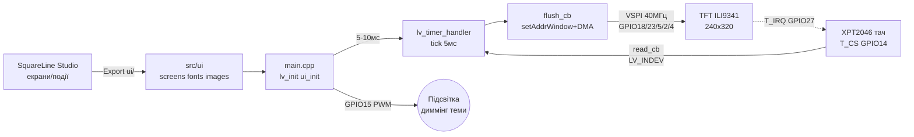

# LVGL v8/v9 + SquareLine Studio - GUI-дашборди

## Призначення

LVGL - графічна бібліотека для мікроконтролерів: віджети, теми, шрифти, анімації
без окремого GPU. SquareLine Studio - візуальний редактор: малюєш екрани мишею,
експортуєш C-файли (`ui/`) у PlatformIO-проєкт. EEZ Flow - оглядова альтернатива
з Blockly-підходом. Нота покриває зв'язку LVGL + flush-драйвер + тач XPT2046,
workflow SquareLine, ключові віджети, шрифти/теми, продуктивність і код дашборда.

## Характеристики

| Компонент | Версія / роль | Вимоги | Нотатка |
| --- | --- | --- | --- |
| LVGL v8.3 | стабільна класика | C99, ~16 кБ RAM мінімум | API `lv_obj_create(parent)`, стилі через `lv_style_t` |
| LVGL v9.x | актуальна гілка | C99, більше flash під новий рендер | інший API (`lv_screen_active()`, `lv_draw_buf`), прикладів v8 треба портувати! |
| SquareLine Studio | WYSIWYG-редактор | ПК Win/Linux/Mac, експорт у C | генерує `ui.c/ui.h/screens/*.c`, події - колбеки |
| EEZ Flow | low-code альтернатива | EEZ Studio, LVGL 8/9 | сценарії блоками + C-код, безкоштовна |
| LovyanGFX / TFT_eSPI | нижній драйвер | SPI 20-80 МГц | `flush_cb` малює через них; див. [[11-Vivid/02-TFT-LCD-Epaper]] |
| XPT2046 | резистивний тач | SPI, спільна шина з TFT | окремий CS + IRQ; калібрування обов'язкове |

> LVGL v8 і v9 НЕ сумісні за API: `lv_scr_act()` → `lv_screen_active()`,
> `lv_disp_draw_buf_t` → `lv_draw_buf_t`, інша ініціалізація теми. SquareLine
> питає цільову версію при створенні проєкту - вистав її РАЗ і не міняй
> посеред розробки, інакше експорт доведеться перегенеровувати.

## LVGL v8/v9 - дисплей-драйвер, tick, буфери

Три речі, без яких LVGL не оживе:

1. **`flush_cb`:** LVGL малює в RAM-буфер, потім кличе твій колбек
   «відправ прямокутник (x1,y1,x2,y2) на дисплей». Усередині - `tft.startWrite()`,
   `setAddrWindow()`, `pushColors(px_map, len)`, `tft.endWrite()`, потім
   ОБОВ'ЯЗКОВО `lv_disp_flush_ready(&disp_drv)`. Без останнього - зависне на
   першому ж кадрі (LVGL чекає готовності вічно).
2. **`tick`:** лічильник мілісекунд для анімацій і таймерів: `lv_tick_inc(5)`
   з `esp_timer` кожні 5 мс або з loop-таймера. Без тіку кнопки «мертві»,
   анімації стоять.
3. **Буфери:** `lv_disp_draw_buf_init(&buf, buf1, buf2, size)`:
   - Один буфер (single) - мінімум RAM, малювання чекає flush.
   - Два буфери (double/full-double) - LVGL малює в один, DMA ллє другий:
     максимум FPS ціною RAM.
   - Розмір: мінімум 1/10 екрана (`240*320/10` px), комфортно 1/4-1/2.
   - Розміщення: SRAM (швидко, мало) для маленьких буферів; PSRAM для
     повноекранних подвійних (320×240×2 байти ×2 = 300 кБ - тільки PSRAM!).

Головний цикл: `lv_timer_handler()` (v8: `lv_task_handler()`) кожні 5-10 мс
з loop або окремого FreeRTOS-таска на другому ядрі (S3) - тоді GUI не смикається
під WiFi. Partial refresh: LVGL сам перемальовує лише брудні прямокутники -
не викликати `lv_obj_invalidate(full_screen)` без потреби.

### Легенда пінів TFT-модуля з тачем (ILI9341 2.4″ + XPT2046)

| Пін | Позначення | Тип | Куди на ESP32 | Примітка |
| --- | --- | --- | --- | --- |
| 1 | VCC | Живлення | 3V3 (модулі з LDO - 5V) | Перевірити перемичку J1 на модулі: 3V3 vs 5V! |
| 2 | GND | Земля | GND | Коротка земля + 100 нФ за живленням біля модуля |
| 3 | CS (TFT) | Вхід CS | GPIO5 | Chip-select дисплея |
| 4 | RESET | Вхід reset | GPIO4 | Скидання контролера |
| 5 | DC/RS | Вхід D/C | GPIO2 | Дані vs команда |
| 6 | MOSI/SDI | Вхід SPI | GPIO23 (VSPI MOSI) | Потік пікселів |
| 7 | SCK | Вхід SPI | GPIO18 (VSPI SCK) | 40 МГц типово, 80 - короткі дроти |
| 8 | LED/BLK | Підсвітка | 3V3 або GPIO15 (PWM) | Через PWM - яскравість/диммінг GUI-тем |
| 9 | MISO/SDO | Вихід SPI | GPIO19 (VSPI MISO) | Спільна з тачем! |
| 10 | T_CS | Вхід CS тача | GPIO14 | ОКРЕМИЙ від TFT-CS! |
| 11 | T_IRQ | Вихід переривання | GPIO27 (опційно) | Пробудження по дотику; без нього - polling |
| 12 | T_CLK/T_DIN | SPI тача | GPIO18/23 (спільні!) | Тач - другий пристрій на тій самій шині |

Пояснення:

- **Спільна шина:** TFT і XPT2046 висять на одному VSPI (SCK/MOSI/MISO спільні),
  вибір - окремими CS. У `flush_cb` і `touch_read` не забувати піднімати чужий CS.
- **MISO обов'язковий:** без MISO тач не прочитати (TFT без MISO жив би, тач - ні).
- **T_IRQ опційно:** з IRQ - подія дотику будить (`lv_indev`), без - читати тач
  кожні 20-30 мс таймером.
- **Калібрування:** сирий ADC XPT2046 (0-4095) → пікселі через 2-3 точки;
  SquareLine калібрування не робить - код у прошивці (див. приклад нижче).

## SquareLine Studio workflow - ui-файли → export → PlatformIO

1. **Новий проєкт:** Board = `Arduino + TFT_eSPI` (або Custom під LovyanGFX),
   роздільність своєї панелі (240×320), глибина кольору 16 біт, LVGL-версія =
   та, що в `platformio.ini` (8.3.x або 9.x - не змішувати!).
2. **Малювання:** Screens (Екран1: дашборд, Екран2: налаштування) → віджети
   (arc/bar/chart/keyboard) → Styles (кольори/шрифти) → Events (клік → зміна
   екрану `lv_scr_load_anim`, виклик своєї функції через `call function`).
3. **Export UI Files:** кнопка Export → папка `ui/` (`ui.c`, `ui.h`,
   `screens/ui_Screen1.c`, `components/`, `images/`, `fonts/`).
4. **PlatformIO:** скопіювати `ui/` у `src/` (або `lib/`), додати в `platformio.ini`:
   `lib_deps = lvgl/lvgl@^8.3.11` (або `^9.1.0`), `build_flags` під драйвер TFT.
   У `main.cpp`: `lv_init()` → `tft.begin()` → `ui_init()` → цикл `lv_timer_handler()`.
5. **Ітерація:** змінив у SquareLine → Export → перезаписав `ui/` (свої хендлери
   тримати ОКРЕМО від `ui_events.c`, інакше експорт їх зітре - класична втрата!).

> Свої колбеки - у `src/app_events.cpp`, ніколи всередині `ui/`.
> SquareLine перезаписує експорт цілком. `ui_events.c` - тільки тонкі виклики
> `app_on_btn(...)`, реалізація - поруч у проєкті.

## EEZ Flow оглядово

EEZ Studio (Envox) + EEZ Flow: безкоштовний open-source конструктор GUI поверх
того ж LVGL (підтримка 8.x/9.x) плюс Flow-сценарії для автоматизації
(вимірювальна техніка, SCPI). Відмінності від SquareLine:

- Проєкт - один `.eez-project`, кодогенерація C++ під Arduino/STM32.
- Віджети тягнуться на канву так само, але логіка - Flow-блоки, а не C-колбеки.
- LVGL-сторінка/віджети сумісні за ідеологією, експорт - своїм генератором
  (не `ui/` SquareLine - не змішувати!).
- Коли брати: безкоштовно + потрібні Flow-сценарії/інструментальна автоматизація;
  коли SquareLine: звичка, готові теми/приклади під ESP32.

## Віджети: arc / bar / chart / keyboard

- **`lv_arc`:** кругова шкала (швидкість, температура): діапазон `lv_arc_set_range`,
  значення `lv_arc_set_value`, прибрати клікабельність `lv_obj_clear_flag(...CLICKABLE)`
  для індикаторів. Фонова дуга - стилем `LV_PART_MAIN`, активна - `LV_PART_INDICATOR`.
- **`lv_bar`:** лінійна смуга (батарея, RSSI): `lv_bar_set_range/value`,
  анімація значення `lv_bar_set_value(..., LV_ANIM_ON)`.
- **`lv_chart`:** графік історії (температура/струм): тип `LV_CHART_TYPE_LINE`,
  `lv_chart_set_point_count` (напр. 60), серія `lv_chart_add_series`,
  оновлення `lv_chart_set_next_value` по таймеру 1 с. Великі point_count у PSRAM!
- **`lv_keyboard`:** екранна клавіатура: прив'язка `lv_keyboard_set_textarea(ta)`,
  режими `LV_KEYBOARD_MODE_NUMBER` для PIN. Перемикати видимість подією фокуса.
- Події всюди: `lv_obj_add_event_cb(obj, handler, LV_EVENT_VALUE_CHANGED, NULL)` -
  у SquareLine це кнопка Events без ручного коду.

## Шрифти і теми

- **Вбудовані:** `lv_font_montserrat_14/20/28...` - увімкнути потрібні в `lv_conf.h`
  (`LV_FONT_MONTSERRAT_20 1`), зайві вимкнути - економія flash.
- **Кирилиця:** стоковий montserrat кирилиці НЕ має! Конвертер
  (LVGL Font Converter, онлайн): TTF → `my_ukr_font.c` з діапазоном
  `0x0400-0x04FF` + латиниця; підключити `LV_FONT_CUSTOM_DECLARE`.
- **Теми:** `lv_theme_default_init()` + `lv_disp_set_theme()`; темна/світла -
  двома стилями і перемикачем у Settings-екрані. Кольори бренду - через
  `lv_color_hex(0x...)` в одному `theme.h`, не розкидати магічні числа.
- **Іконки:** `lv_img_dsc_t` з PNG→C-конвертера (Images у SquareLine роблять це
  самі); великі фони - у PSRAM/flash з `LV_IMG_CF_TRUE_COLOR`.

## Тактиль через XPT2046

Драйвер вводу LVGL (`lv_indev_drv_t`, тип `LV_INDEV_TYPE_POINTER`): колбек
`read_cb` читає XPT2046 по SPI (команда + 12-біт ADC), мапить у пікселі,
виставляє `data->state = LV_INDEV_STATE_PRESSED/RELEASED`. Калібрування:
мінімум 2 точки (ліво-верх, право-низ), формула `x = (adc - x0) * W / (x1 - x0)`.
Фільтр дрижання: 3 читання поспіль + медіана, дебаунс 30 мс. IRQ-пин - для
пробудження з light-sleep; у активному режимі достатньо polling 30 Гц.

## Продуктивність - FPS vs SPI-швидкість, partial refresh

- **Математика SPI:** кадр 320×240×2 байти = 153 600 байт; на 40 МГц (~4 МБ/с
  реально) - ~26 FPS межа шини; на 80 МГц - ~50 FPS, але лише короткі дроти
  і якісний модуль. Більше від шини не вижати - далі тільки паралельний 8/16-біт
  або RGB-панель.
- **Partial refresh:** LVGL шле тільки брудні прямокутники - статичний дашборд
  з однією стрілкою оновлює ~5% екрана = 20× запас FPS. Правило: не інвалідувати
  весь екран таймером, оновлювати значення віджетів.
- **Буфер vs FPS:** single 1/10 - мінімум RAM, кожен flush чекає; double 1/4 -
  золота середина; full-double у PSRAM - максимум, але PSRAM повільніший за SRAM
  (~2×), тому full-single у SRAM інколи швидший за double у PSRAM.
- **Анімації:** `LV_ANIM` з тривалістю 200-400 мс; довгі анімації на всю ширину
  екрана просаджують FPS - зменшувати площу або вимикати на слабких SPI.
- **Вимір:** `LV_USE_PERF_MONITOR 1` в `lv_conf.h` - FPS-лічильник поверх GUI.

## Схема

![[assets/img/lvgl-squareline-scheme.png|600]]
*Рис. LVGL-стек: SquareLine-експорт → flush_cb → TFT, тач XPT2046 назад у LVGL.
Місце під схему - див. [[assets/README]].*

### ASCII-схема

```text
ПК (SquareLine Studio)              ESP32 DevKit
──────────────────────              ────────────
Екрани/віджети/події ──Export──►  src/ui/ (ui.c, screens/, fonts/, images/)
                                          │
main.cpp: lv_init() → tft.begin() → ui_init()
                                          │
                    ┌─────────────────────┼─────────────────────┐
                    ▼                     ▼                     ▼
              lv_timer_handler()    flush_cb (TFT)        touch read (XPT2046)
              кожні 5-10 мс         setAddrWindow+DMA     SPI read → LV_INDEV
                    │                     │                     │
                    └──────── LVGL v8/v9 ядро (tick 5мс) ───────┘
                                          │
TFT ILI9341 (VSPI):                       ▼
3V3/GND, GPIO18 SCK / GPIO23 MOSI / GPIO19 MISO / GPIO5 CS / GPIO2 DC / GPIO4 RST
Тач XPT2046: GPIO14 T_CS (окремий!), GPIO27 T_IRQ (опц.), SPI спільна
Підсвітка: GPIO15 PWM (диммінг теми)
```

### Mermaid



## Код ESP-IDF - LVGL v9: flush + tick + дашборд

```c
#include "lvgl.h"
// Низький драйвер (LovyanGFX/TFT_eSPI обгортка) — спрощено:
extern void tft_push(uint16_t x1, uint16_t y1, uint16_t x2, uint16_t y2,
                     const uint8_t *px, int len);

#define W 240
#define H 320
static lv_draw_buf_t db1, db2;
static uint8_t *b1, *b2;

static void flush_cb(lv_display_t *d, const lv_area_t *a, uint8_t *px) {
    int32_t w = a->x2 - a->x1 + 1, h = a->y2 - a->y1 + 1;
    tft_push(a->x1, a->y1, a->x2, a->y2, px, w * h * 2);
    lv_display_flush_ready(d); // БЕЗ ЦЬОГО — ЗАВИСАННЯ!
}

static void tick_cb(void *arg) { lv_tick_inc(5); } // esp_timer кожні 5 мс

static lv_obj_t *arc_speed, *bar_batt, *chart_temp;
static lv_chart_series_t *ser;

void ui_dash(void) {
    lv_obj_t *s = lv_screen_active();
    lv_obj_t *t = lv_label_create(s);
    lv_label_set_text(t, "ESP32 Dash");
    lv_obj_align(t, LV_ALIGN_TOP_MID, 0, 6);

    arc_speed = lv_arc_create(s);
    lv_arc_set_range(arc_speed, 0, 120);
    lv_obj_set_size(arc_speed, 150, 150);
    lv_obj_align(arc_speed, LV_ALIGN_TOP_MID, 0, 34);
    lv_obj_clear_flag(arc_speed, LV_OBJ_FLAG_CLICKABLE);

    bar_batt = lv_bar_create(s);
    lv_bar_set_range(bar_batt, 0, 100);
    lv_obj_set_size(bar_batt, 200, 16);
    lv_obj_align(bar_batt, LV_ALIGN_BOTTOM_MID, 0, -46);

    lv_obj_t *ch = lv_chart_create(s);
    lv_chart_set_type(ch, LV_CHART_TYPE_LINE);
    lv_chart_set_point_count(ch, 60);
    ser = lv_chart_add_series(ch, lv_palette_main(LV_PALETTE_RED), LV_CHART_AXIS_PRIMARY_Y);
    lv_obj_set_size(ch, 200, 70);
    lv_obj_align(ch, LV_ALIGN_BOTTOM_MID, 0, -4);
}

void app_main(void) {
    lv_init();
    size_t px = W * H / 4; // 1/4 екрана на буфер
    b1 = heap_caps_malloc(px * 2, MALLOC_CAP_SPIRAM);
    b2 = heap_caps_malloc(px * 2, MALLOC_CAP_SPIRAM);
    lv_display_t *d = lv_display_create(W, H);
    lv_draw_buf_init(&db1, W, H / 4, LV_COLOR_FORMAT_RGB565, 0, b1, px * 2);
    lv_display_set_draw_buffers(d, &db1, NULL); // другий — за потреби
    lv_display_set_flush_cb(d, flush_cb);
    const esp_timer_create_args_t ta = {.callback = tick_cb};
    esp_timer_handle_t th; esp_timer_create(&ta, &th);
    esp_timer_start_periodic(th, 5000);
    ui_dash();
    while (1) { lv_timer_handler(); vTaskDelay(pdMS_TO_TICKS(8)); }
}
```

## Код Arduino - LVGL v8 + SquareLine-експорт + XPT2046

```cpp
#include <lvgl.h>
#include <TFT_eSPI.h>
#include <XPT2046_Touchscreen.h>
#include "ui/ui.h" // Export із SquareLine Studio!

TFT_eSPI tft;
XPT2046_Touchscreen ts(14, 27); // T_CS=GPIO14, T_IRQ=GPIO27
static lv_disp_draw_buf_t db;
static lv_color_t *b1, *b2;

void flush_cb(lv_disp_drv_t *d, const lv_area_t *a, lv_color_t *px) {
  uint32_t w = a->x2 - a->x1 + 1, h = a->y2 - a->y1 + 1;
  tft.startWrite();
  tft.setAddrWindow(a->x1, a->y1, w, h);
  tft.pushColors((uint16_t*)&px->full, w * h, true);
  tft.endWrite();
  lv_disp_flush_ready(d);
}

void touch_cb(lv_indev_drv_t *d, lv_indev_data_t *dt) {
  static int16_t lx, ly;
  if (ts.touched()) {
    TS_Point p = ts.getPoint();
    // Калібрування під СВІЙ модуль (2 точки, виміряти!):
    lx = map(p.x, 300, 3800, 0, 240);
    ly = map(p.y, 300, 3800, 0, 320);
    dt->state = LV_INDEV_STATE_PRESSED;
    dt->point.x = lx; dt->point.y = ly;
  } else dt->state = LV_INDEV_STATE_RELEASED;
}

void setup() {
  tft.begin(); tft.setRotation(1);
  ts.begin(); ts.setRotation(1);
  lv_init();
  b1 = (lv_color_t*)heap_caps_malloc(240*320/4*sizeof(lv_color_t), MALLOC_CAP_SPIRAM);
  b2 = (lv_color_t*)heap_caps_malloc(240*320/4*sizeof(lv_color_t), MALLOC_CAP_SPIRAM);
  lv_disp_draw_buf_init(&db, b1, b2, 240*320/4);
  static lv_disp_drv_t dd; lv_disp_drv_init(&dd);
  dd.hor_res = 240; dd.ver_res = 320;
  dd.flush_cb = flush_cb; dd.draw_buf = &db;
  lv_disp_drv_register(&dd);
  static lv_indev_drv_t id; lv_indev_drv_init(&id);
  id.type = LV_INDEV_TYPE_POINTER; id.read_cb = touch_cb;
  lv_indev_drv_register(&id);
  ui_init(); // ← згенеровано SquareLine, свої хендлери — в app_events.cpp!
}
void loop() { lv_timer_handler(); delay(5); }
```

## Код MicroPython - міні-GUI без LVGL (framebuf)

```python
# MicroPython + повний LVGL важкий; для простих дашбордів — framebuf + ST7789.
# Повний порт LVGL (lv_micropython) існує, але тут — легкий варіант.
from machine import SPI, Pin, PWM
import st7789, framebuf, time

spi = SPI(2, baudrate=40000000, sck=Pin(18), mosi=Pin(23), miso=Pin(19))
tft = st7789.ST7789(spi, 240, 320, reset=Pin(4, Pin.OUT),
                    dc=Pin(2, Pin.OUT), cs=Pin(5, Pin.OUT),
                    backlight=Pin(15, Pin.OUT), rotation=1)
tft.init()

buf = bytearray(240 * 40 * 2)  # смуга 40 px — partial refresh вручну!
fb = framebuf.FrameBuffer(buf, 240, 40, framebuf.RGB565)

def bar(y, frac, label):
    fb.fill(0x0000)
    fb.text(label, 4, 4, 0xFFFF)
    w = int(232 * max(0, min(1, frac)))
    fb.fill_rect(4, 18, 232, 14, 0x39E7)   # фон смуги
    fb.fill_rect(4, 18, w, 14, 0x07E0)     # активна частина
    tft.blit_buffer(buf, 0, y, 240, 40)    # ллємо тільки смугу!

bl = Pin(15, Pin.OUT)
pwm = PWM(bl, freq=5000, duty=1023)  # диммінг теми

t = 0
while True:
    bar(40, (t % 100) / 100, "BATT %d%%" % (t % 100))   # смуга-батарея
    bar(120, abs((t % 200) - 100) / 100, "TEMP")        # смуга-температура
    t += 5
    time.sleep_ms(500)
```

## Типові помилки

1. **Завис після першого кадру** → забутий `lv_disp_flush_ready()` /
   `lv_display_flush_ready()`. Перевірити першим.
2. **Мертві кнопки, стоять анімації** → немає `lv_tick_inc()` / `lv_tick_inc(5)`.
   Тік - окремим esp_timer, не в тому ж циклі що handler.
3. **Змішані v8/v9 API** → проєкт SquareLine під v8, lib_deps під v9 (або навпаки).
   Вирівняти версії, експорт перегенерувати.
4. **Білий екран, LVGL наче працює** → не той offset/rotation TFT-драйвера або
   переплутані DC/RES. Спочатку голий тест TFT без LVGL, див. [[11-Vivid/02-TFT-LCD-Epaper]].
5. **Тач дзеркалить/зсув** → немає калібрування, переплутані осі при rotation.
   Калібрувати 2-3 точки ПІСЛЯ фінального `setRotation`.
6. **TFT CS vs T_CS конфлікт** → один GPIO на обидва CS: тач і дисплей глушать
   один одного. Рознести (5 і 14).
7. **Експорт SquareLine стер хендлери** → код був усередині `ui/`. Тримати логіку
   в `src/app_events.cpp`, в `ui/` - тільки `ui_init()` і згенероване.
8. **WDT-ребути при flush на 80 МГц** → довгі дроти, просідання живлення
   підсвітки. Знизити до 40 МГц, окремий провід підсвітки, 100 нФ.
9. **Кирилиця - квадрати** → стоковий montserrat без кирилиці. Конвертер шрифтів
   з діапазоном 0x0400-0x04FF, `LV_FONT_CUSTOM_DECLARE`.
10. **FPS 3-5 на повноекранних анімаціях** → межа SPI + full-screen invalidate.
    Partial refresh, менші площі анімацій, double-buffer 1/4 у PSRAM.

## Офіційні джерела

- [LVGL - документація (v9)](https://docs.lvgl.io/master/) - flush_cb, tick, буфери, віджети arc/bar/chart/keyboard.
- [SquareLine docs](https://docs.squareline.io/docs/squareline) - редактор, export UI-файлів, цільові плати.
- [EEZ Studio - GUI + Flow (Envox)](https://github.com/eez-open/studio) - open-source альтернатива, підтримка LVGL 8/9.
- [LovyanGFX - швидкий драйвер дисплеїв](https://github.com/lovyan03/LovyanGFX) - DMA, спрайт-буфери під flush_cb.

## Див. також

- [[Home]]
- [[11-Vivid/02-TFT-LCD-Epaper]]
- [[11-Vivid/10-Displays-2]]
- [[12-Moduli-zvyazku/12-RC-Protocols]]
- [[12-Moduli-zvyazku/13-Camera-Streaming]]
- [[12-Moduli-zvyazku/04-RS485-CAN-Ethernet-Kamera]]
- [[04-Shini/02-SPI|SPI]]
- [[07-Timeri-Son/01-Timeri-MCPWM-PCNT-RMT]]
- [[99-Dodatki/01-Pinout-tablici]]
- [[99-Dodatki/02-Troubleshooting-FAQ]]
