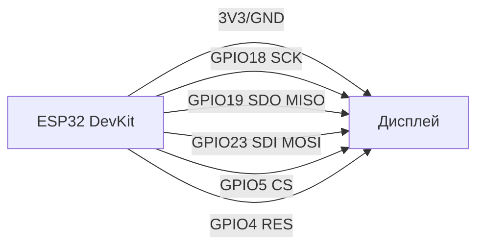

# Дисплеї 3: SSD1322, SSD1351, ST7796, GC9A01, RA8875, FT81x

![[assets/img/displays-3-oled-tft-eve-scheme.png|600]]
*Рис. 1. Вибір дисплею для ESP32: від мініатюрних сірих OLED (SSD1322) до графічного TFT (ST7796) та FT81x 'електроніці' з вбудованим GPU.*

## Призначення

Цей розділ охоплює просунуті дисплеї для професійних приладів, UI/HMI та преміальних проєктів. SSD1322 - це сірий OLED (не кольоровий), SSD1351 - Colour OLED 128×128, ST7796 - класичний TFT 480×320, GC9A01 - круглий OLED/Colour TFT 240×240, RA8875 - контролер великих TFT (3.5"/5"), FT81x - 'електроніці' з вбудованим GPU для швидкого створення інтерфейсів.

## Характеристики

| Модуль | Роздільна здатність | Інтерфейс | Контролер | Живлення | Особливість |
| --- | --- | --- | --- | --- | --- |
| SSD1322 | 128×128 (сірий) | I2C / SPI | SSD1322 | 3.3 В | Сірий pallete, низьке споживання (≈15 мА) |
| SSD1351 | 128×128 (Colour) | SPI | SSD1351 | 3.3 В | 65K кольорів, вбудований RAM animation |
| ILI9340 / ILI9341 | 240×320 (TFT) | SPI / 8080 | ILI9340 (попередник) / ILI9341 | 3.3 В (I/O), 5V (Backlight) | Народний 2.4-2.8″ TFT; ILI9340 - стара ревізія, ILI9341 - актуальна (TFT_eSPI з коробки) |
| ST7796 | 480×320 (TFT) | 8080-шина / SPI | ST7796 | 3.3 В (I/O), 5V (Backlight) | Широкий кут огляду, підтримка LVGL, сумісність з FT81x |
| GC9A01 | 240×240 (Colour) | SPI / 8080 | SSD2805 / st7789 | 3.3 В (I/O), 5V (Backlight) | Kreis-формат, підтримка tactile-tochu |
| RA8875 | 320×240 / 3.5" TFT | 8080-спри / SPI | RA8875 | 3.3 В (I/O), 5V (Backlight) | Великий дисплей, SPI швидкість до 40 МГц |
| FT81x (EVE) | 3.5" / 4.3" / 7" TFT | SPI / 8080 / RGB | FT81x (EVE) | 3.3 В (I/O), 5V (Backlight) | 'Elektor Graphics Engine' - hardwired GUI, списки команд |

## Легенда пінів модуля (універсальна для SPI / 8080)

| Пін | Тип | Куди на ESP32 | Примітка |
| --- | --- | --- | --- |
| VCC | Живлення | 3.3 В (ланцюг) / 5 V (Backlight) | SSDO VCC, Backlight - окремі джерела |
| GND | Земля | Спільний GND | Спільний мінус |
| D0-D7 (DB0-DB7) | дані DBUS | GPIO18-GPIO23 (SPI) | Двонаправльна шина даних |
| RS / RSX | Реєстр / Команда | GPIO5 (або вільний) | 0 = команда, 1 = дані |
| WRX / WR | Write strobe | GPIO18 (SPI) | Пріч команда/дані в пристрій |
| RDX / RD | Read strobe | GPIO19 (SPI) | Читання з пам'яті дисплея |
| CS / XCS | Chip Select | GPIO5 (або вільний) | Активний рівень LOW |
| RESX / RST | Reset | GPIO4 (або вільний) | Hard reset при старті |
| SCK / SCK | Тактування | GPIO18 (SPI) | SPI тактування (якщо 8080 - використовувати WRX) |
| SDI / SDA | SPI дані | GPIO23 (VSPI) | Дані запису |
| SDO | SPI MISO | GPIO19 (VSPI) | Читання даних |

## Схема підключення (SPI 4-wire)

```text
ESP32 DevKit        SSD1322 / SSD1351 / ST7796 / GC9A01 / RA8875 / FT81x
  3V3 ──────► VCC
  GND    ──────► GND
  GPIO18 ──────► SCK (CLK)
  GPIO19 ──────► SDO (MISO)
  GPIO23 ──────► SDI (MOSI)
      GPIO5   ──────► CS (LOW = активний)
      GPIO4   ──────► RES (Reset)
```

### ASCII-схема (SPI)

```text
ESP32 DevKit                        Дисплей (SPI)
  ┌────────────┐                         ┌─────────────┐
  │        3V3 ├─────────────────────────┤ VCC         │
  │        GND ├─────────────────────────┤ GND         │
  │     GPIO18 ├─────────────────────────┤ SCK / CLK   │
  │     GPIO19 ├─────────────────────────┤ SDO / MISO  │
  │     GPIO23 ├─────────────────────────┤ SDI / MOSI  │
  │      GPIO5 ├─────────────────────────┤ CS          │
  │      GPIO4 ├─────────────────────────┤ RES         │
  └────────────┘                         └─────────────┘
```

### Mermaid



## Код ESP-IDF (LVGL + SSD1351)

```c
#include "lvgl.h"
#include "driver/spi_master.h"
#include "display_driver.h"

static lv_disp_draw_buf_t draw_buf;

void app_main(void) {
    esp_err_t ret;
    spi_bus_config_t buscfg = {
        .miso_io_num = GPIO_NUM_19,
        .mosi_io_num = GPIO_NUM_23,
        .sclk_io_num = GPIO_NUM_18,
        .quadwp_io_num = -1,
        .quadhd_io_num = -1,
    };
    ret = spi_bus_initialize(SPI2_HOST, &buscfg, SPI_DMA_CH_AUTO);
    assert(ret == ESP_OK);

    spi_device_interface_config_t devcfg = {
        .clock_speed_hz = 20000000,
        .mode = 0,
        .spics_io_num = GPIO_NUM_5,
        .queue_size = 7,
    };
    ret = spi_bus_add_device(SPI2_HOST, &devcfg, &spi_dev);
    assert(ret == ESP_OK);

    // LVGL initialisation
    lv_init();
    lv_disp_draw_buf_init(&draw_buf, buf1, buf2, LV_HOR_RES_MAX * LV_VER_RES_MAX / 10);

    // Register display handler
    lv_disp_drv_t disp_drv = {
        .hor_res = 128,
        .ver_res = 128,
        .flush_cb = my_disp_flush,
        .draw_buf = &draw_buf,
        .lv_disp_drv_init = true,
    };
    lv_disp_drv_register(&disp_drv);
}
```

## Код Arduino (FT81x EVE)

```cpp
#include <SPI.h>
#include <FT81.h>

#define TFT_CS   5
#define TFT_RST  4
#define TFT_DC   17

void setup() {
  Serial.begin(115200);
  SPI.begin(18, 19, 23, 5);
  EVE.begin(FT81_CLK, FT81_MISO, FT81_MOSI, FT81_CS, FT81_RST);
  EVE_cmd_DlStart();
  // Окремі команди FT81x для кнопок, слайдерів, списків
}

void loop() {
  EVE_cmd_Display();
  EVE_cmd_number(100, 100, 10, 13, "Score:");
}
```

## Код MicroPython (SSD1322 / SPI)

```python
from machine import Pin, SPI
import ssd1322

spi = SPI(1, baudrate=1000000, polarity=0, phase=0, sck=Pin(18), mosi=Pin(23), miso=Pin(19))
dc = Pin(4)
rst = Pin(5)
display = ssd1322.SSD1322(spi, dc, rst, width=128, height=128)
display.fill(0)
display.text("Hello", 0, 0, 1)
display.show()
```

## Типові помилки

| № | Помилка | Симптом | Рішення |
| --- | --- | --- | --- |
| 1 | SSDO втрачає синхронізацію | Смужкі стрічки на екрані, галереї | Перевірити SPI швидкість (понизити до 8-10 МГц); перевірити резистори pull-up на шинах |
| 2 | SSD1322 показує сірий екран | Відсутність Colour даних | Перевірити, чи правильний драйвер: SSD1322 - це CI grey scale, SSD1351 - Colour |
| 3 | FT81x не ініціалізується | `EVE not responding` | Перевірити spi / 8080 режим; перевірити VCC (3.3 В логика, 5 В Backlight); перевірити RESET лінію |
| 4 | Сміття на екрані при обміні кадрів | Фантомні Obrazy, "ghosting" | Використовувати `double buffering` у LVGL; налаштувати `partial refresh` |

## Офіційні джерела

- FTDI FT81x (EVE): `ftdichip.com` (Programming Guide), `github.com/FTDI-EVE`
- GC9A01A Datasheet (GalaxyCore, via alldatasheet): [GC9A01A PDF](https://www.alldatasheet.com/datasheet-pdf/pdf/2267469/GALAXYCORE/GC9A01A.html) - 240×240 TFT, Rev 1.0.
- SSD1322/SSD1351: `seeedstudio.com` (OLED display), `waveshare.com`
- ST7796: `lcdwiki.com` (ST7796 breakdown), `waveshare.com`
- RA8875: `rapidonline.com` (RA8875 datasheet)

- RA8875 Datasheet (Raio, пошук PDF): [RA8875 search](https://www.alldatasheet.com/view.jsp?Searchword=RA8875) - TFT-контролер з GPU.
- ST7796 Datasheet (Sitronix, пошук PDF): [ST7796 search](https://www.alldatasheet.com/view.jsp?Searchword=ST7796) - TFT 480×320.
- ILI9340 Datasheet (Ilitek, пошук PDF): [ILI9340 search](https://www.alldatasheet.com/view.jsp?Searchword=ILI9340) - TFT 240×320.
- SSD1322/SSD1351 Datasheet (Solomon, пошук PDF): [SSD1322 search](https://www.alldatasheet.com/view.jsp?Searchword=SSD1322) - OLED-контролери.
- SSD2805 Datasheet (Solomon, пошук PDF): [SSD2805 search](https://www.alldatasheet.com/view.jsp?Searchword=SSD2805) - MIPI-міст.

## Див. також

- [[Home]]
- [[11-Vivid/12-LVGL-SquareLine|LVGL + SquareLine Studio]]
- [[11-Vivid/13-Audio-Codecs|Аудіокодеки]]
- [[10-Sensori/32-Light-Color-2|Світло/Колір]]
- [[04-Shini/02-SPI|Шина SPI]]
